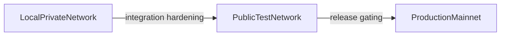

# Blockchain Networks Deep Dive

## Why blockchain projects run multiple networks

Serious blockchain projects split usage across multiple networks so teams can
separate risk and purpose:

- local/private networks for fast deterministic development and testing
- public test networks for integration, wallets, indexers, and ecosystem tools
- production networks where assets have real value and consensus mistakes are
  unacceptable

The exact names vary by ecosystem, but the pattern is consistent.

## Bitcoin

### Bitcoin networks and purpose

- **Mainnet**: production Bitcoin.
- **Testnet3**: long-running public PoW test network; historically useful but
  increasingly noisy and unreliable for some integration workflows.
- **Testnet4**: newer public test network introduced via BIP 94 to address
  long-lived testnet3 issues (notably around difficulty behavior and abuse).
- **Signet**: public network with signature-gated block production, giving more
  predictable block cadence than unconstrained PoW testnets.
- **Regtest**: local private chain where developers control mining and network
  behavior.

### Bitcoin technical separators

- Distinct genesis blocks and message-start magic values per network.
- Distinct default ports (for example: mainnet `8333`, testnet3 `18333`,
  signet `38333`, regtest `18444`, testnet4 `48333`).
- Distinct address encodings/prefix conventions by network (for example
  `bc1...` on mainnet versus test-network HRP/prefixes such as `tb1...`).

### Bitcoin usage in practice

- **Regtest** for deterministic CI and wallet/service unit tests.
- **Signet** for shared integration tests requiring stable, public chain
  behavior.
- **Testnet4** for broad ecosystem testing where public PoW dynamics are useful.

### Bitcoin key lesson

Public PoW testnets can degrade over time due to economics and abuse; many
teams now prefer signet-like controlled test environments for repeatability.

## Ethereum

### Ethereum networks and purpose

- **Mainnet**: production Ethereum L1.
- **Sepolia**: default public app-developer testnet.
- **Hoodi**: protocol/staking-oriented test environment for large validator and
  client testing workflows.
- **Local devnets**: Hardhat/Anvil/Geth local environments for fast contract
  iteration.

Historical testnets such as **Ropsten**, **Rinkeby**, and **Goerli** were
sunset as network strategy and maintenance priorities evolved.

### Ethereum technical separators

- EVM networks are primarily separated by **chain ID** (EIP-155), genesis
  config, and fork activation schedule.
- Example chain IDs: mainnet `1`, Sepolia `11155111`, Holesky `17000` (legacy
  reference), Hoodi `560048`.
- RPC endpoints are network-specific; production and test infrastructure are
  usually isolated by provider and URL.

### Ethereum usage in practice

- **Local devnets** for contract development and rapid test loops.
- **Sepolia** for public dapp integration (wallets, frontends, indexers).
- **Hoodi-class networks** for client, staking, and large-scale release
  rehearsals.

### Ethereum key lesson

Ethereum demonstrates that testnets are not forever. Production-grade teams
treat testnet migration planning as a normal maintenance task.

## Monero

### Monero networks and purpose

- **Mainnet**: production XMR network.
- **Testnet**: experimental public network where protocol changes can be
  validated early and forks may happen sooner.
- **Stagenet**: production-like public network intended for integration and
  operational rehearsal with mainnet-like behavior.
- **Fakechain**: local regtest-style chain for daemon/core regression testing.

Monero introduced stagenet in v0.12.0.0 (March 2018), specifically to improve
realistic pre-mainnet testing.

### Monero technical separators

- Distinct network type selection in daemon/wallet.
- Distinct ports per network family (mainnet `18080/18081/...`,
  testnet `28080/28081/...`, stagenet `38080/38081/...`).
- Distinct address-network bytes/prefixes and distinct network identifiers.
- Distinct genesis transactions and nonces between network families.

### Monero usage in practice

- **Stagenet** for exchange/wallet/service integration before mainnet rollout.
- **Testnet** for protocol engineering and consensus experimentation.
- **Fakechain** for local deterministic test automation.

### Monero key lesson

Monero's split between testnet and stagenet is a strong operational pattern:
one network for experimentation, one for production-like integration.

## Solana

### Solana networks and purpose

- **Mainnet-Beta**: production cluster.
- **Devnet**: primary public developer cluster.
- **Testnet**: validator/client stress and release testing cluster.
- **Localnet** (`solana-test-validator`): local private development.

### Solana technical separators

- Cluster-specific RPC URLs and entrypoints.
- Distinct validator sets, genesis state, and operational policy by cluster.
- Different software rollout cadence between devnet/testnet/mainnet-beta.

### Solana usage in practice

- **Localnet** for rapid local smart-contract testing.
- **Devnet** for public-facing app iteration with faucet-funded test assets.
- **Testnet** for core protocol and performance validation.

### Solana key lesson

Solana cleanly separates app-dev velocity (devnet) from validator/protocol load
testing (testnet), reducing cross-purpose friction.

## Polkadot ecosystem

### Polkadot networks and purpose

- **Polkadot relay chain**: production relay-chain network.
- **Kusama**: canary network with real economic value and faster governance.
- **Westend**: public testing/staging network for Polkadot-style upgrades.
- **Rococo**: parachain-focused test network used heavily for onboarding and
  interoperability testing.

### Polkadot technical separators

- Separate relay-chain and runtime configurations by network.
- Distinct chain specs, identifiers, and SS58 prefix contexts.
- Distinct governance tempo and operational risk profile (especially Kusama).

### Polkadot usage in practice

- **Kusama** for early real-economic deployment and fast iteration.
- **Westend/Rococo** for validation, parachain integration, and release
  rehearsals.

### Polkadot key lesson

The canary model is different from disposable testnets: it adds real economic
pressure before full production rollout on the flagship network.

## Avalanche

### Avalanche networks and purpose

- **Mainnet**: production Avalanche Primary Network.
- **Fuji**: public testnet.
- **Local network**: private local development/deployment network.

### Avalanche technical separators

- Distinct network IDs and chain IDs for EVM-facing C-Chain access.
- Common C-Chain IDs: mainnet `43114`, Fuji `43113`.
- Distinct genesis and validator sets across mainnet, Fuji, and local setups.

### Avalanche usage in practice

- **Local network** for deterministic private testing.
- **Fuji** for public dapp integration and wallet validation.
- **Mainnet** for production subnet and C-Chain workloads.

### Avalanche key lesson

Avalanche shows that "network" can include both primary-chain environments and
custom subnet deployment targets, not only a single global chain context.

## Cross-chain patterns and lessons

Across Bitcoin, Ethereum, Monero, Solana, Polkadot, and Avalanche, the same
architecture patterns appear:

1. A three-layer lifecycle is universal: local/private -> public test ->
   production.
2. Networks are separated by hard technical boundaries: genesis data, network
   IDs/chain IDs, ports, address formats, and protocol magic bytes.
3. Public test networks drift over time; periodic replacement or redesign is
   normal.
4. Networks increasingly split by audience:
   - application developers
   - protocol/client developers
   - validators/operators/infrastructure providers
5. Canary or production-like staging networks reduce mainnet risk by exposing
   real operations before final release.

## Shekyl network model (mapped to these lessons)

Shekyl already implements a four-network model aligned with proven patterns.
From `src/cryptonote_config.h`:

|Network|Primary use|Default P2P|Default RPC|Address prefix|
|---|---|---:|---:|---:|
|Mainnet|Production|11021|11029|55|
|Testnet|Protocol experimentation|12021|12029|53|
|Stagenet|Production-like integration|38080|38081|24|
|Fakechain|Local deterministic testing (`--regtest`)|n/a|n/a|n/a|

### Separation mechanisms in Shekyl

- Distinct `network_type` values (`MAINNET`, `TESTNET`, `STAGENET`,
  `FAKECHAIN`).
- Distinct network UUIDs (`NETWORK_ID`) for mainnet/testnet/stagenet.
- Distinct genesis transactions (`GENESIS_TX`) and nonces by network.
- Distinct public address prefixes and default ports.

### Which Shekyl network to use

- **Feature development and CI**: fakechain/regtest first.
- **Consensus and protocol experiments**: testnet.
- **Exchange, wallet, and ops rehearsal**: stagenet.
- **User-facing production traffic**: mainnet only.

This mirrors mature ecosystem practice: isolate risk early, then progressively
increase realism before mainnet activation.

## References

- [Bitcoin BIP 94 (testnet4)](https://bips.xyz/94)
- [Bitcoin Testnet overview](https://en.bitcoin.it/wiki/Testnet)
- [Ethereum documentation](https://ethereum.org/en/developers/docs/networks/)
- [Monero networks documentation](https://docs.getmonero.org/infrastructure/networks/)
- [Solana clusters](https://solana.com/docs/references/clusters)
- [Polkadot network docs](https://wiki.polkadot.network/)
- [Avalanche docs](https://docs.avax.network/)
