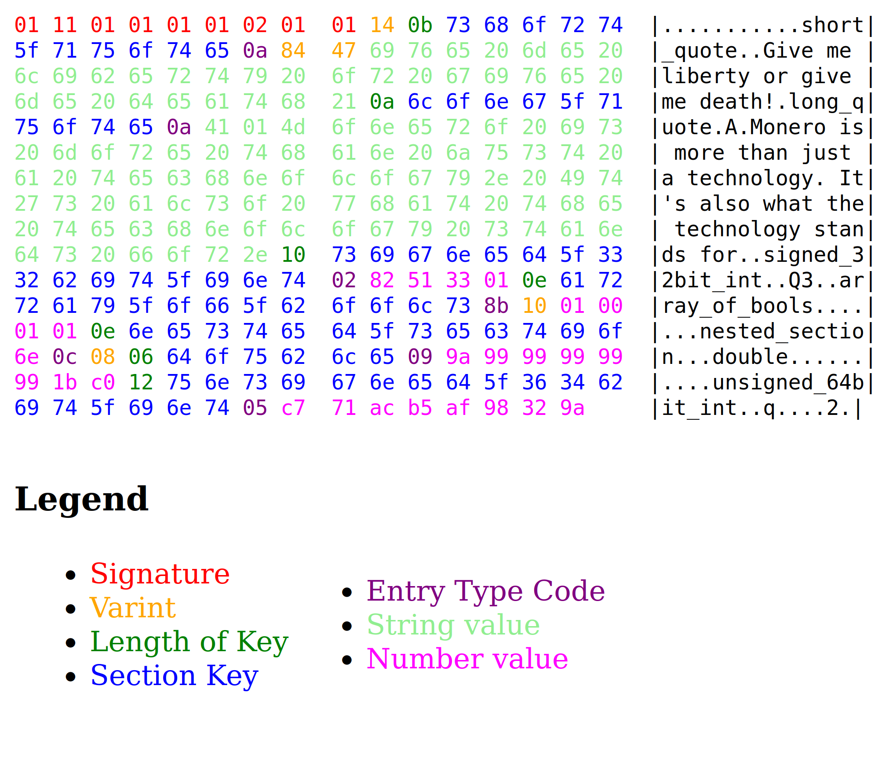

# Portable Storage Format

**Production codec:** `rust/shekyl-portable-storage` (LV-2a). Typed Levin
command maps are LV-2b in `shekyl-levin`. Decision pin:
[`docs/design/LV2_PORTABLE_STORAGE.md`](design/LV2_PORTABLE_STORAGE.md).

Shekyl integers on this format are **little-endian**. Encode order is
lexicographic (`std::map` / `BTreeMap`). Known-answer tests for the
codec live in `rust/shekyl-portable-storage/tests/oracle_kats.rs`.
Handshake / timed-sync / ping / support-flags / `network_address`
round-trips live in `rust/shekyl-levin/tests/payload_kats.rs`.
Notify maps (2001–2004 / 2006–2010) live in
`rust/shekyl-levin/tests/notify_kats.rs` (LV-2b).

## Background

Shekyl makes use of a set of helper classes from a small library named
[epee](https://github.com/monero-project/monero/tree/master/contrib/epee) (inherited from Monero). Part
of this library implements a networking protocol called
[Levin](https://github.com/monero-project/monero/blob/master/contrib/epee/include/net/levin_base.h),
which internally uses a storage format called [Portable
Storage](https://github.com/monero-project/monero/tree/master/contrib/epee/include/storages).
This format (amongst the rest of the
[epee](https://github.com/monero-project/monero/tree/master/contrib/epee)
library), is undocumented - or rather relies on the code itself to serve as the
documentation. Unfortunately, whilst the rest of the library is fairly
straightforward to decipher, the Portable Storage is less-so.  Hence this
document.

## String and Integer Encoding

### Integers

Integers in Shekyl portable_storage are little-endian. The inherited
sketch's "implementations may choose big-endian" hedge is false for
this chain and is not a decoder option.

### Varints

Varints are used to pack integers in an portable and space optimized way. Varints are stored as little-endian integers, with the lowest 2 bits storing the amount of bytes required, which means the largest value integer that can be packed into 1 byte is 63
(6 bits).

#### Byte Sizes

| Lowest 2 bits | Size value    | Value range                       |
|---------------|---------------|-----------------------------------|
| b00           | 1 byte        | 0 to 63                           |
| b01           | 2 bytes       | 64 to 16383                       |
| b10           | 4 bytes       | 16384 to 1073741823               |
| b11           | 8 bytes       | 1073741824 to 4611686018427387903 |

#### Represenations of Example Values
|        Value         | Byte Representation (hex) |
|----------------------|---------------------------|
|                    0 | 00                        |
|                    7 | 1c                        |
|                  101 | 95 01                     |
|               17,000 | A2 09 01 00               |
|        7,942,319,744 | 03 BA 98 65 07 00 00 00   |

### Strings

These are simply length (varint) prefixed char strings without a null
terminator (though one can always add one if desired). There is no
specific encoding enforced, and in fact, many times binary blobs are
stored as these strings. This type should not be confused with the keys
in sections, as those are restricted to a maximum length of 255 and
do not use varints to encode the length.

    "Howdy" => 14 48 6F 77 64 79

### Section Keys

These are similar to strings except that they are length limited to 255
bytes, and use a single byte at the front of the string to describe the
length (as opposed to a varint).

    "Howdy" => 05 48 6F 77 64 79

## Binary Format Specification

### Header

The format must always start with the following header:

| Field            | Type     | Value      |
|------------------|----------|------------|
| Signature Part A | UInt32   | 0x01011101 |
| Signature Part B | UInt32   | 0x01020101 |
| Version          | UInt8    | 0x01       |

In total, the 9 byte header will look like this (in hex): `01 11 01 01 01 01 02 01 01`

### Section

Next we have a root object (or section as the library calls it). This is a map
of name-value pairs called [entries](#Entry). It starts with a count:

| Section       | Type      |
|---------------|-----------|
| Entry count   | varint    |


Which is followed by the section's name-value [entries](#Entry) sequentially:

### Entry

| Entry             | Type                  |
|-------------------|-----------------------|
| Name              | section key           |
| Type              | byte                  |
| Count<sup>1</sup> | varint                |
| Value(s)          | (type dependant data) |

<sup>1</sup> Note, this is only present if the entry type has the array flag
(see below).

#### Entry types

The types defined are:

```cpp
#define SERIALIZE_TYPE_INT64                1
#define SERIALIZE_TYPE_INT32                2
#define SERIALIZE_TYPE_INT16                3
#define SERIALIZE_TYPE_INT8                 4
#define SERIALIZE_TYPE_UINT64               5
#define SERIALIZE_TYPE_UINT32               6
#define SERIALIZE_TYPE_UINT16               7
#define SERIALIZE_TYPE_UINT8                8
#define SERIALIZE_TYPE_DOUBLE               9
#define SERIALIZE_TYPE_STRING               10
#define SERIALIZE_TYPE_BOOL                 11
#define SERIALIZE_TYPE_OBJECT               12
#define SERIALIZE_TYPE_ARRAY                13
```

The entry type can be bitwise OR'ed with a flag:

```cpp
#define SERIALIZE_FLAG_ARRAY              0x80
```

This signals there are multiple *values* for the entry. Since only one bit is
reserved for specifying an array, we can not directly represent nested arrays.
However, you can place each of the inner arrays inside of a section, and make
the outer array type `SERIALIZE_TYPE_OBJECT | SERIALIZE_FLAG_ARRAY`. Immediately following the type code byte is a varint specifying the length of the array.
Finally, the all the elements are serialized in sequence with no padding and
without any type information. For example:

<p style="padding-left:1em; font:italic larger serif">type, count,
value<sub>1</sub>, value<sub>2</sub>,..., value<sub>n</sub></p>

#### Entry values

POD integers and doubles are little-endian, with no padding. Bool is a
single byte that must be `0` or `1`. Strings are a varint length then
that many bytes; there is no UTF-8 requirement on *values* (hashes,
tx blobs, and other PODs travel as `SERIALIZE_TYPE_STRING`).

Entry values which are objects (`SERIALIZE_TYPE_OBJECT`) are stored as
[sections](#Section).

`SERIALIZE_TYPE_ARRAY` (tag 13, untyped) and array-of-array are **a
hard decode error** until a captured C++ body emits one. Production
arrays use `(inner_type | SERIALIZE_FLAG_ARRAY)`.

#### Decode vs encode details

- **Trailing bytes** after the root section are ignored (`load_from_binary`
  does not require consuming the whole buffer).
- **Duplicate keys** in one section are rejected.
- **Encode** walks keys in lexicographic order. Decode accepts any order.
- **Encode** rejects empty keys and keys longer than 254 bytes. Decode
  accepts key lengths 1..=255 (C++ asymmetry).
- **Section keys** in the Rust decoder must be UTF-8. Production maps
  use ASCII identifiers.
- A header-only blob is truncated: C++ rejects a root with `sz == 0`
  after a successful header read.

### Overall example

Let's put it all together and see what an entire object would look like serialized. To represent our data, let's create a JSON object (since it's a format
that most will be familiar with):

```json
{
  "short_quote": "Give me liberty or give me death!",
  "long_quote": "Shekyl builds on proven CryptoNote lineage for privacy and resilience.",
  "signed_32bit_int": 20140418,
  "array_of_bools": [true, false, true, true],
  "nested_section": {
    "double": -6.9,
    "unsigned_64bit_int": 11111111111111111111
  }
}
```

This would translate to:



## Limits

`portable_storage::limits_t` is a **decode parameter**, not a format
constant. Encode does not consult limits. The Rust crate takes a
`Limits { objects, fields, strings }`:

| Caller | objects | fields | strings | C++ source |
|--------|---------|--------|---------|------------|
| Levin invoke/notify | 8192 | 16384 | 16384 | `default_levin_limits` (`levin_abstract_invoke2.h`) |
| HTTP `.bin` RPC | 196608 | 196608 | 196608 | `default_http_bin_limits` = 65536×3 (`http_abstract_invoke.h`) |
| Null limits pointer | `usize::MAX` | `usize::MAX` | `usize::MAX` | `load_from_binary` unrestricted |

- **objects** — nested sections. The root section is not counted.
- **fields** — sum of per-section field counts.
- **strings** — scalar strings plus reserved string-array slots
  (a string array of *n* elements bumps the string budget by *n* once).
- Recursion: C++ `EPEE_PORTABLE_STORAGE_RECURSION_LIMIT` is 100, counted
  on almost every `read` (including raw `memcpy`). The Rust decoder
  counts nested section/entry/array **structural** depth against the
  same 100. Deep primitive-only blobs that would trip C++ but not
  structural depth are not a production shape.
- String length must be `< MAX_STRING_LEN_POSSIBLE` (2_000_000_000).

## Schema layer (not the codec)

The binary codec has optional keys and `SERIALIZE_TYPE_STRING` blobs.
The C++ `KV_SERIALIZE*` macros are a typed overlay. LV-2b owns that
overlay for Levin command maps. Notes so the codec is not asked to
invent them:

- **`KV_SERIALIZE_OPT`.** Store omits the field when the value equals
  the default; load uses the default when the field is absent. Missing
  this is how handshake peerlists and `dandelionpp_fluff` diverge. The
  codec just encodes whatever keys are present.
- **`KV_SERIALIZE_VAL_POD_AS_BLOB`.** A POD is one `SERIALIZE_TYPE_STRING`
  of `sizeof` bytes, not a section. The codec sees a blob.
- **`KV_SERIALIZE_CONTAINER_POD_AS_BLOB`.** A vector/list of PODs is
  *one* string of concatenated elements, not a typed array. Used by
  hash lists (commands 2003/2006/2007/2009/2010).
- **`network_address` union**, including ipv4's store-time `SWAP32LE`,
  plus `block_complete_entry` pruned vs unpruned `txs` and
  `attestation_witness` `OPT`, are LV-2b. See
  [`LV2_PORTABLE_STORAGE.md`](design/LV2_PORTABLE_STORAGE.md) §6.

## Shekyl / CryptoNote specifics

### Entry values

#### Hashes, Keys, Blobs

These are stored as strings, `SERIALIZE_TYPE_STRING`.

#### STL containers (vector, list)

These can be arrays of standard integer types, strings or
`SERIALIZE_TYPE_OBJECT`'s for structs. When the C++ map uses
`CONTAINER_POD_AS_BLOB`, the wire is one concatenated STRING instead
(see Schema layer above).

#### Links to struct definitions in this repository

- Core RPC definitions: `src/rpc/core_rpc_server_commands_defs.h`
  (~343 KV maps; **not** LV-2b — HTTP JSON/binary RPC stays C++).
- CryptoNote protocol definitions: `src/cryptonote_protocol/cryptonote_protocol_defs.h`
  and `src/p2p/net_node_common.h` (Levin-wire subset is LV-2b).

## Known-answer tests

Codec KATs (empty section, C++ `two_keys` / `duplicate_key` from
`tests/unit_tests/epee_serialization.cpp`, nested object, uint64
array, tag-13 hard error, HTTP `.bin` request shape) live in
`rust/shekyl-portable-storage/tests/oracle_kats.rs`. Captured handshake
and `NOTIFY_NEW_TRANSACTIONS` bodies are LV-2b.


[//]: # ( vim: set tw=80: )
