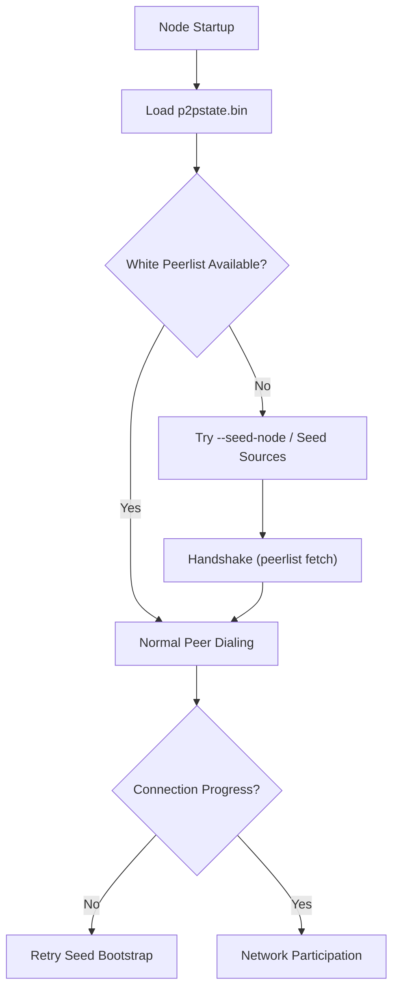

# Shekyl Seeds Setup Guide

This document explains how peer bootstrapping and seed discovery currently work in Shekyl, and how operators should configure seed behavior for mainnet/testnet/stagenet deployments.

It reflects current code behavior, including existing seed-list placeholders.

---

## 1) Seeding model at a glance

Shekyl startup is peerlist-first and seed-assisted:

1. Load persisted peer state (`p2pstate.bin`).
2. Attempt normal outgoing connections from known peers.
3. If peerlist is insufficient, query configured/default seed sources.
4. Seed node handshake fetches peer addresses, then normal dialing resumes.



---

## 2) Runtime seed/peer controls

The daemon supports these P2P bootstrap-related options:

- `--seed-node`: connect to node, retrieve peer addresses, disconnect
- `--add-peer`: add peer to local peerlist
- `--add-priority-node`: keep trying to maintain connection
- `--add-exclusive-node`: connect only to these peers (ignores priority and seed-node)

Additional useful controls:

- `--out-peers`, `--in-peers`: outbound/inbound peer limits
- `--enable-dns-blocklist`: apply DNS blocklist
- `--proxy` and `--proxy-allow-dns-leaks`: proxy behavior affecting DNS-based seed/blocklist resolution

---

## 3) How bootstrapping works internally

### 3.1 Persisted state comes first

On startup, node state is read from:

- `<data-dir>/p2pstate.bin`

This file contains previously learned peers for bootstrap continuity.

### 3.2 When seeds are used

Seed fallback is triggered when:

- white peerlist is empty, or
- regular connection attempts fail to make progress.

### 3.3 Seed connection behavior

Seed nodes are contacted for peer discovery:

- perform handshake
- fetch peerlist
- disconnect (`just_take_peerlist` behavior)

This is by design and differs from long-lived priority/exclusive peer links.

---

## 4) Seed sources and current status

### Public clearnet seed sources

Public seed mechanisms exist in code, but current Shekyl defaults are not yet populated:

- DNS seed host list exists but is currently empty.
- Fallback IP seed lists (mainnet/testnet/stagenet) are currently placeholders.

Operational implication:

- For reliable bootstrap today, operators should explicitly provide peers/seed nodes.

### Tor/I2P hardcoded seeds

There are hardcoded anonymity-network seeds in code for mainnet paths.

Operational implication:

- These entries should be reviewed and validated as Shekyl-owned/maintained infrastructure before treating them as production-trust anchors.

---

## 5) Network-specific behavior

Default P2P ports:

- mainnet: `11021`
- testnet: `12021`
- stagenet: `38080`

When daemon bind port differs from network default, peer-state pathing is segmented by port under data directory to avoid collisions.

For testnet/stagenet:

- DNS seed path currently short-circuits to fallback IP seed list logic.
- since fallback lists are placeholders, explicit operator-provided peers are strongly recommended.

---

## 6) Operator recipes

## 6.1 Bootstrap from trusted peers

Start with explicit peers:

```bash
./shekyld --add-peer <ip-or-host:port> --add-peer <ip-or-host:port>
```

Or seed-discovery style:

```bash
./shekyld --seed-node <ip-or-host:port> --seed-node <ip-or-host:port>
```

Recommended practice:

- use multiple independent peers/seeds
- retain persistent data-dir so `p2pstate.bin` can improve future restarts

## 6.2 Priority/exclusive topology

Use priority peers for preferred but flexible connectivity:

```bash
./shekyld --add-priority-node <ip-or-host:port>
```

Use exclusive peers for tightly controlled topology:

```bash
./shekyld --add-exclusive-node <ip-or-host:port> --add-exclusive-node <ip-or-host:port>
```

Note: exclusive mode bypasses seed-node and priority-node logic.

## 6.3 Public node baseline

For public remote usage, pair sane peer settings with restricted RPC posture.

Example:

```bash
./shekyld --public-node --restricted-rpc --out-peers 64 --in-peers 128
```

Tune peer counts to host/network capacity.

## 6.4 Proxy mode caveat

When using `--proxy`, DNS seed resolution and DNS blocklist are disabled unless DNS leaks are explicitly allowed:

- `--proxy` sets proxied transport
- `--proxy-allow-dns-leaks` re-enables direct DNS behavior

Example (no DNS leaks):

```bash
./shekyld --proxy 127.0.0.1:9050 --seed-node <trusted-onion-or-reachable-seed>
```

If you do not permit DNS leaks, provide explicit seed/peer entries.

---

## 7) Config file usage

Config syntax follows daemon CLI names:

- `option=value`
- booleans as `0/1`

Example snippet:

```ini
add-peer=203.0.113.10:11021
add-peer=198.51.100.20:11021
out-peers=32
in-peers=64
```

Note: sample file in `utils/conf/monerod.conf` currently retains legacy naming/comments and minimal defaults; for Shekyl service setups, use Shekyl binary and data/log paths.

---

## 8) Runtime adjustments

After startup, peer count limits can be adjusted via:

- daemon console commands: `out_peers <n>`, `in_peers <n>`
- RPC endpoints for in/out peer limits

Adding new seed nodes/peers at runtime via dedicated daemon command is not currently documented/implemented in command server pathways; plan startup configuration accordingly.

---

## 9) Current gaps (transparent status)

At current repository state:

1. Public DNS seed list is empty in code.
2. Public fallback IP seed lists are placeholders.
3. Some docs/config/service examples still use legacy `monero*` naming.
4. Seed operations are under-documented in user-facing docs.

Recommended near-term operator policy:

- always provide at least 2-5 trusted bootstrap peers for production nodes
- maintain environment-specific seed lists per network
- monitor peerlist health and restart bootstrap with explicit peers when needed

---

## 10) Quick validation checklist

After startup:

1. `./shekyld --help` confirms expected seed/peer flags.
2. logs show successful outbound peer connections.
3. white peerlist grows beyond bootstrap peers.
4. restart without explicit peers and verify retained peerlist bootstrap from `p2pstate.bin`.

If these fail, reintroduce explicit `--seed-node` / `--add-peer` entries and inspect network reachability/firewall/proxy settings.
