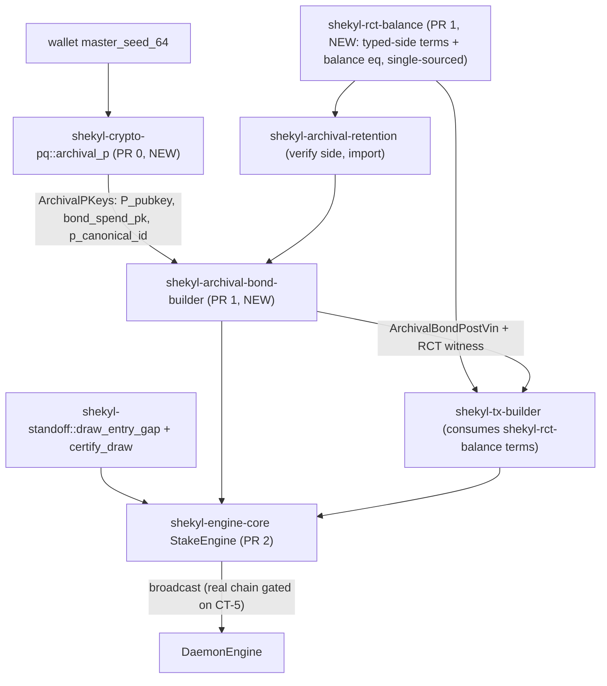
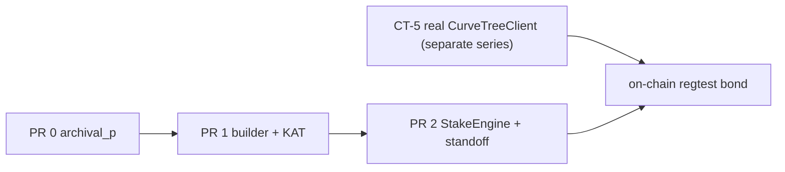

# Archival bond-post construction (wallet-side, Stage 3 StakeEngine)

Status: design, under review (target 2-3 rounds; see Section 11).
Scope owner: wallet/engine + crypto-pq.
Companion to the verify side in
[`rust/shekyl-archival-retention`](../../rust/shekyl-archival-retention) and the
spec in [`ARCHIVAL_BOND_GATE4.md`](ARCHIVAL_BOND_GATE4.md) /
[`ARCHIVAL_FIREWALL_GATE6.md`](ARCHIVAL_FIREWALL_GATE6.md).

This document specifies how the wallet **constructs** an archival bond-post
transaction. The consensus **verify** side already exists and is the fixed
contract construction must satisfy; this side does not.

---

## 1. Why this doc exists

The archival bond record format is **genesis-frozen** and **permanent**: a
bond posted at genesis is keyed by `p_canonical_id` and its `bond_spend_pk` is
immutable for the record's life (`ARCHIVAL_BOND_GATE4.md` §4.1). Construction
side genuinely does not exist yet -- there is no builder, no `TxRequest`
variant, no `bond_credit` handling in the RCT balance, and no `P`-identity
derivation. Designing before committing a permanent wire format and a
genesis-frozen derivation is build-enabling, not analysis for its own sake.

This is distinct from parameter/sim tuning (which the staker-archival work
froze as already-robust). Nothing here re-opens a tuned parameter; it specifies
unbuilt, permanent code.

## 2. Scope and non-goals

### In scope (this design)

- The full architecture for all four `BondPostKind`s (`JoinMarket`, `Rebond`,
  `Unbond`, `HoldingsUpdate`), so the JoinMarket-first implementation does not
  paint into a corner.
- The `archival_p` key-derivation primitive (`P` identity + `bond_spend_pk`),
  which is the genesis-frozen foundation that gates everything.
- The construct-side data flow, signing, and RCT balance for **JoinMarket**.

### Implemented first (JoinMarket only)

JoinMarket is the only kind with a complete verify counterpart today
([`bond_post.rs`](../../rust/shekyl-archival-retention/src/bond_post.rs)
`verify_join_market_bond_post`;
[`bond_rct_balance.rs`](../../rust/shekyl-archival-retention/src/bond_rct_balance.rs)).
Rebond / Unbond / HoldingsUpdate have wire types
([`bond_wire.rs`](../../rust/shekyl-archival-retention/src/bond_wire.rs)
`BondPostKind`) but **no verify implementation** ("V3.0 open"). Their
construction is **provisional** until paired with the verify-side work -- see
Section 9.

### Non-goals (sequenced dependencies, not this unit)

- **Real curve-tree integration (CT-5).** See Section 8 -- this is the
  difference between "construction logic works" and "a bond exists on a chain,"
  and it is named here as a sequenced dependency, not buried as an out-of-scope
  bullet.
- Off-chain announce/backing-presentation wire (separate gate-6 §7 item).
- HoldingsUpdate / Rebond / Unbond verify-side (their own PRs).

## 3. The honest milestone for this unit

> **What PR 0-2 delivers: construction validated against verify in a unit-test
> round-trip with a synthetic curve tree. NOT a bond on a real regtest chain.**

A transaction built with synthetic tree references (the placeholders still used
in [`signing_assembly.rs`](../../rust/shekyl-engine-core/src/engine/signing_assembly.rs)
via `synthetic_tree.rs`) will **not** pass a real daemon's verify, because the
membership proof references a tree the daemon does not have. On-chain
end-to-end is gated on the real `CurveTreeClient` wiring (CT-5 series), which is
separate work.

The milestone this unit honestly reaches is the **round-trip KAT**:

```text
archival_p derive -> build JoinMarket vin + RCT witness
  -> verify_join_market_bond_post(vin, record_exists=false) == Ok
  -> verify_bond_post_rct_balance(pseudo_outs, out_masks, fee, bond_credit=floor, bond_debit=0) == Ok
```

"A bond exists on a chain" comes when the curve-tree client is real. Naming this
now prevents discovering the gap after PR 2 ships.

**PR 2a strengthens this milestone (2026-06-18).** PR 1's round-trip KAT closed
the balance equation against a *synthetic* balance witness (hand-built
`pseudo_outs`/`out_masks`). PR 2a replaces the synthetic witness with the
**real FCMP++ prover**: the JoinMarket vin's `bond_credit` rides through
`shekyl-tx-builder::sign_transaction_with_terms` as the single output-side
cleartext term, and the verify side
(`verify_join_market_bond_post`, `verify_bond_post_rct_balance`, the BP+ range
proof, and the FCMP++ membership proof) is checked against the **prover-emitted**
commitments. The tree stays synthetic (depth-1 single-leaf-chunk, the M3c
fixture); what PR 2a removes is the gap between "construction balances against a
witness we wrote" and "construction balances against the proof the prover
actually emits."

The synthetic tree here is **not** a stale path: CT-5c
(`CT5C_ASSEMBLER_CUTOVER.md`) cut the *production* spend path over to the real
`assemble_path` / `CurveTreeClient`, and its A4 reversion clause deliberately
retained the `synthetic_tree` fixtures `#[cfg(test)]`-only for exactly the
`local_keys` signing KATs (and the tx-weight KAT) — depth-controlled fixtures a
real tree can't cheaply provide. So PR 2a uses the sanctioned KAT surface. The
remaining gap to a **real-tree bond** round-trip is therefore *not* "CT-5
doesn't exist" — `assemble_path` is real as of CT-5c, and transfers already have
a real-tree round-trip (`local_pending_tx::build_then_submit_marks_outputs_spent`
over `funded_ledger_and_tree`).

**PR 2c-1 lands the real-tree bond composition (2026-06-18).** When CT-5c made
`assemble_path` available earlier than planned, PR 2c was split: **PR 2c-1**
closes the real-tree bond round-trip and **PR 2c-2** carries the StakeEngine
wiring / JoinMarket orchestration. The 2c-1 KAT
(`local_pending_tx::join_market_bond_post_signs_and_verifies_over_real_tree`)
re-runs PR 2a's composition over a **real** depth-2 `assemble_path` tree (the
`funded_ledger_and_tree` fixture, the same path `build_then_submit_…` drives),
carrying the bond's `credit_term` through `sign_transaction_with_terms` over
genuine branch layers and checking BP+, the RCT balance over prover-emitted
commitments, and vin/signature accept+reject. It drives the prover directly
rather than the transfer bridge (`sign_bridge.rs` deliberately still calls the
**zero-terms** `sign_transaction`): per Q3 a bond does not take the transfer
signer path, so threading a credit term through the bridge would be dead code
until the StakeEngine caller lands in 2c-2 (rules 15/21).

One discovered blocker scopes 2c-1's honesty: FCMP++ `verify` does **not** yet
accept a proof built over a *real multi-layer* assembled path. No workspace test
verifies such a path today — PR 2a and the FFI round-trip verify a depth-1
**synthetic** single-leaf root, and the real-tree transfer KATs only *build and
submit* (they never call `verify` locally). The first attempt
(`join_market_bond_post_fcmp_verify_over_real_tree`) returns
`BatchVerificationFailed`, despite the prover succeeding over the same path and
`assemble_kat` proving the assembled branches re-hash to the consensus root —
isolating the gap to the upstream `Fcmp::prove`↔`verify` ↔ consensus
`hash_grow` consistency over real branch layers, a **CT-5** surface, not the
bond construction. The verify-accept assertion therefore rides as an
`#[ignore]`d sibling rather than a faked pass; it un-ignores when CT-5 lands a
real-tree prove→verify roundtrip (tracked in `FOLLOWUPS.md`,
"real-tree FCMP++ verify"). The earlier "not on CT-5" note above was correct for
the prove side only.
The KAT also asserts the verify side *rejects* a wrong `bond_credit`, a tampered
output commitment, a tampered signature preimage, and a replayed post -- the
honest milestone is "valid accepts and invalid rejects," not accept alone. Lives
in `shekyl-engine-core::engine::local_keys::tests`
(`join_market_bond_post_signs_and_verifies_through_prover`), reusing the M3c
synthetic-tree and key-derivation fixtures rather than promoting them to public
API. One encoding bridge: `sign.rs` emits output commitments as `8*C` (subgroup
cofactoring on the wire) while the balance equation is defined over the
prime-order `C`, so the KAT recovers `C = (8*C) * 8^{-1}` before the balance
check -- both sides then carry genuine prover output.

## 4. Single-sourcing by import

Construction reuses the validated verify-side types rather than re-deriving
them, so "what we validated is what ships" holds by construction (the same
discipline as `shekyl-standoff`):

| Reused symbol | Source | Used for |
| --- | --- | --- |
| `ArchivalBondPostVin`, `signature_preimage`, `serialize` | `shekyl-archival-retention::bond_wire` | the vin and its sig preimage |
| `bond_floor` | `shekyl-archival-retention::bond_floor` | `bonded_total == bond_credit == floor` |
| `p_canonical_id_from_hybrid_pubkey` | `shekyl-archival-retention::id` | record key |
| typed-side cleartext terms + balance eq | `shekyl-rct-balance` (NEW, §7.2/§11.1 Q2) | the consensus balance, single-sourced for construct *and* verify |
| `verify_join_market_bond_post`, `verify_bond_post_rct_balance` | `shekyl-archival-retention` (the latter now wrapping `shekyl-rct-balance`) | KAT oracle |

The bond-builder crate **depends on** `shekyl-archival-retention` and
`shekyl-rct-balance`; it copies no wire, floor, or balance logic. The balance
equation is the strongest case: single-sourcing it means construct and verify
*cannot* disagree on a genesis-frozen consensus rule (§11.1 Q2).

## 5. Crate / module layout



- **`shekyl-crypto-pq::archival_p`** (PR 0): the derivation. All key derivation
  already lives in this crate; `archival_p` mirrors
  [`account.rs`](../../rust/shekyl-crypto-pq/src/account.rs) exactly, with the
  archival labels.
- **`shekyl-archival-bond-builder`** (PR 1, new crate): deterministic, no
  async, no actor -- builds the vin + RCT witness. Testable and KAT-able in
  isolation. Depends on `shekyl-archival-retention` (types) and
  `shekyl-tx-builder` (RCT machinery).
- **`shekyl-rct-balance`** (PR 1, new crate): the **single-sourced** consensus
  balance equation and its typed-side cleartext terms (Section 7.2). Depends on
  `shekyl-units` (`AtomicUnits`) + `curve25519-dalek` + `shekyl-generators`;
  imported by *both* `shekyl-tx-builder` (construct) and
  `shekyl-archival-retention` (verify) so the two cannot diverge on a
  genesis-frozen equation. The existing `bond_rct_balance.rs` migrates here.
- **`shekyl-tx-builder`** (PR 1, extended): consumes the `shekyl-rct-balance`
  typed-side terms (Section 7.2); stays bond-agnostic.
- **`shekyl-engine-core` StakeEngine** (PR 2): orchestration -- funding
  selection, standoff timing + self-cert, actor wiring, broadcast over `P`'s
  own transport (§10.1).

(Resolved in §11.1 Q1: builder is a **new crate**, for dependency-graph
isolation -- it cannot pull in `tokio`/`kameo` -- not merely a convention.)

## 6. PR 0 -- `archival_p` derivation (PR #152, built in parallel)

PR 0 is **not gated on this doc's review rounds**; it is implemented separately
in [PR #152](https://github.com/Shekyl-Foundation/shekyl-core/pull/152)
(`feat/archival-p-derivation`). Its design was already settled: the bundle is
`ARCHIVAL_FIREWALL_GATE6.md` §9.4, the labels are §9.3, the crate home is
decided, and the freeze pattern mirrors
[`address_derivation_freeze.rs`](../../rust/shekyl-crypto-pq/src/address_derivation_freeze.rs).
None of that is among the open construction-flow questions the rounds exist to
resolve. PR 0 is the highest-stakes primitive in the project (a bit of
derivation drift means a user cannot recover their own bond) and was built
carefully alongside this doc's PR 1/2 rounds.

> **Merge-order note.** This section describes PR #152's derivation as built.
> If this doc lands on `dev` before #152, treat §6 as the **spec #152
> implements** rather than a description of code already on `dev`; the two are
> kept in sync deliberately (§6 was updated when #152 froze the scalar-vs-seed
> resolution). Merging #152 first keeps every "built/landed" reference here
> accurate on `dev`.

### 6.1 Keys (gate-6 §9.4 `ArchivalPKeys`)

```text
ArchivalPKeys {                       // PR #152: matches gate-6 §9.4 (post scalar-vs-seed resolution)
  p_slot: u32,
  spend_pk/sk, view_pk/sk,            // Ed25519 ADDRESS scalars, via wide-reduce (L=64)
  ml_kem_ek/dk,                       // ML-KEM-768
  x25519_pk,                          // montgomery(view_pk)
  hybrid_sign_pk/sk,                  // IDENTITY; Hybrid{ed25519=account_sign_seed, ml_dsa=account}
  bond_spend_pk/sk,                   // GF-1 debit authorizer; Hybrid{ed25519=bond_spend_ed_seed, ...}
}
// hybrid_bond_id() is an accessor returning &hybrid_sign_pk (== invariant enforced
//   structurally, no second copy). p_canonical_id is NOT a field: it is computed
//   downstream by shekyl-archival-retention::id over hybrid_bond_id's canonical bytes.
```

Per-field `ZeroizeOnDrop` (the container holds non-`Zeroize` public material, so
it is *not* a single `derive(ZeroizeOnDrop)`; each secret field wipes via its own
destructor), and **not `Clone`** (per `21-reversion-clause-discipline.mdc` and
`AllKeysBlob`'s precedent). Lives in the StakeEngine actor task; the `!Clone`
bound is what keeps the bundle from escaping the actor (§10.1).

**Scalar-vs-seed (genesis-frozen, 2026-06-17).** The two `hybrid` Ed25519 halves
(`account_sign_seed` for the identity, `bond_spend_ed_seed` for the debit
authorizer) are dedicated `L=32` RFC 8032 seeds, **not** the address spend
scalar -- `HybridEd25519MlDsa` is seed-keyed (`SigningKey::from_bytes` clamps
`SHA512(seed)`). The identity uses its own `account_sign_seed` rather than
reusing `spend`, which decouples the public `P_pubkey` from the receive-address
spend key (privacy-positive, gate-6 §9.3). Receive-address spend/view stay
`L=64` wide-reduce (real scalar consumers: `spend·B`, `montgomery(view)`).

### 6.2 HKDF labels (gate-6 §9.3, pinned `L`)

| Output | Label | L | Consumer |
| --- | --- | --- | --- |
| `spend_wide` | `shekyl-archival-p-ed25519-spend-v1` | 64 | wide-reduce -> address spend scalar |
| `view_wide` | `shekyl-archival-p-ed25519-view-v1` | 64 | wide-reduce -> address view scalar |
| `kem_d_z` | `shekyl-archival-p-ml-kem-768-v1` | 64 | SHA3-ChaCha -> ML-KEM-768 KG |
| `account_sign_seed` | `shekyl-archival-p-ed25519-account-sign-v1` | 32 | RFC 8032 seed -> identity Ed25519 half |
| `ml_dsa_seed` | `shekyl-archival-p-ml-dsa-65-v1` | 32 | `keygen_from_seed` -> identity ML-DSA half |
| `bond_spend_ed_seed` | `shekyl-archival-p-bond-spend-ed25519-v1` | 32 | RFC 8032 seed -> bond-spend Ed25519 half |
| `bond_spend_ml_dsa_seed` | `shekyl-archival-p-bond-spend-ml-dsa-65-v1` | 32 | `keygen_from_seed` -> bond-spend ML-DSA half |

`info = LABEL || 0x00 || p_slot.to_le_bytes()` -- **implemented and
genesis-frozen** in `archival_p` and the KAT (not merely a KAT-author note; the
separator is on the wire). Collision-safety note: the `0x00` is
belt-and-suspenders, not load-bearing. Because `p_slot` is a fixed-width 4-byte
suffix, two distinct `(LABEL, p_slot)` pairs already cannot produce the same
bytes -- different-length labels give different total lengths, equal-length
distinct labels differ in the label region -- so *distinct* labels suffice and
prefix-freeness is not required. The separator adds nothing semantically here;
it is frozen because it costs nothing and the corpus is already pinned (removing
it would be a pointless KAT re-open). The ML-KEM intermediary
(`SHA3-256(b"shekyl-mlkem-chacha-seed" || kem_d_z)` -> `ChaCha20Rng`) is the
same function as principal; archival separation comes from the distinct
`kem_d_z` bytes.

### 6.3 KAT -- `ARCHIVAL_P_DERIVE_V1` (third cross-arch-deterministic primitive)

After `reward_arithmetic` and the standoff draw, this is the **third**
primitive that must be bit-identical across architectures, and the
highest-stakes of the three. The KAT mirrors the
`docs/test_vectors/ADDRESS_DERIVATION_V1/{manifest.json,vectors.json}` corpus +
the `*_manifest_hash` freeze tripwire, and adds two determinism-discipline
requirements:

1. **aarch64 qemu-user lane.** The `address_derivation_freeze` KAT in
   `shekyl-crypto-pq` did **not** run on the aarch64 lane -- that lane
   ([`.github/workflows/depends.yml`](../../.github/workflows/depends.yml), step
   "archival KAT tests run under aarch64 (qemu-user)") ran only
   `shekyl-archival-retention` and `shekyl-standoff`. PR 0 **added the
   `ARCHIVAL_P_DERIVE_V1` KAT (`shekyl-crypto-pq --test
   kat_archival_p_derive_v1`) to that lane** (scoped to the KAT binary so the
   slow keygen path runs only for the pinned vectors), so the derivation is
   verified bit-identical on ARM, not just compiled. Confirmed passing under
   `qemu-aarch64-static` locally. (This is the "ARM phone can't recover the
   bond" failure mode made into a gate.)
2. **Label-sensitivity negative.** A test that derives under a wrong label and
   asserts a different key -- proving the GF-1-carve independence (P identity
   vs. `bond_spend_pk` under distinct labels) is *demonstrated*, not just
   asserted by the HKDF construction, and that a future label drift trips a
   test the way the standoff trap does.

## 7. PR 1 -- JoinMarket construction core

### 7.1 The vin

```rust
ArchivalBondPostVin {
    hybrid_public_key: keys.hybrid_bond_id.canonical_bytes(),   // identity = P_pubkey
    p_canonical_id: keys.p_canonical_id,                        // == p_canonical_id_from_hybrid_pubkey(hybrid_public_key)
    post_kind: BondPostKind::JoinMarket,
    holdings,                                                   // ShardSetCompact{ids} or CompleteTree
    bonded_total_atomic: bond_floor(&holdings),
    bond_credit: bond_floor(&holdings),
    bond_debit: 0,
}
```

Signed over `ArchivalBondPostVin::signature_preimage(&tx_prefix_hash)` with the
**P identity key** (`hybrid_sign_sk`): JoinMarket is a credit path
(`bond_debit == 0`), and per `ARCHIVAL_BOND_GATE4.md` §3.5 step 5 credit paths
authorize against `P_pubkey`; the JoinMarket signature additionally binds the
committed `bond_spend_pk` via the preimage. `bond_spend_pk` is committed on the
record at JoinMarket and authorizes only later debit paths (Unbond,
HoldingsUpdate drop) -- not exercised in PR 1.

### 7.2 Single-sourced, typed-side cleartext balance terms (`shekyl-rct-balance`)

The RCT balance the verify side enforces is

```text
sum(pseudoOuts) + extra_inputs = sum(out_masks) + fee + extra_outputs
```

where the *extra* terms are cleartext `amount*H` contributions of the same kind
as `fee` (today: `bond_credit -> extra_outputs`, `bond_debit -> extra_inputs`).

**Single-source the equation (§11.1 Q2, resolved).** The lean shape -- a generic
term added in `shekyl-tx-builder` (construct) while
[`bond_rct_balance.rs`](../../rust/shekyl-archival-retention/src/bond_rct_balance.rs)
holds the equation (verify) -- is rejected: it is *two* implementations of a
genesis-frozen consensus equation, the R-3 divergence risk single-sourced
everywhere else. Instead the term definitions, their fixed sides, and the
balance relationship live **once** in a new low crate **`shekyl-rct-balance`**,
imported by both `shekyl-tx-builder` and `shekyl-archival-retention`. Construct
then builds exactly what verify checks *by construction*; they cannot disagree
on which term is which side. (`shekyl-rct-balance`, not `shekyl-units` -- which
stays `zeroize`+`serde`-only -- and not `tx-builder` -- which would put verify
downstream of the wallet builder. It depends on `shekyl-units` +
`curve25519-dalek` + `shekyl-generators`; the existing `bond_rct_balance.rs`
verify equation migrates into it.)

**Side as type, not runtime tag.** Each term-kind has a statically fixed side
(fee->output, bond_credit->output, bond_debit->input, emission->input,
burn->output), so the side belongs in the type, not a `{ amount, side }` tag
that only catches a wrong-side term at verify. Two typed slices --
`extra_inputs: &[InputTerm]` and `extra_outputs: &[OutputTerm]`, each a
checked-`u64` newtype over `AtomicUnits` -- make a wrong-side term
*unrepresentable* (one newtype vs. one enum, comparable machinery, strictly
stronger). `fee` stays its own distinct field (consensus-load-bearing, already
wired); the typed slices are the *extra* terms. `shekyl-tx-builder` still never
learns the word "bond" (`18-type-placement`): it consumes generic typed-side
terms; the bond-builder supplies `floor` as an `OutputTerm` for JoinMarket.

Note: the economics "burn" (`shekyl-economics::burn::compute_n_split`) is a
fee-split calculation, **not** an RCT cleartext balance term -- so the typed-side
term machinery is genuinely new in `shekyl-rct-balance`, not a refactor of an
existing generic term.

### 7.3 Funding inputs

Credit paths carry FCMP++ `txin_to_key` funding inputs whose committed value
exceeds outputs + fee by exactly `bond_credit = floor`. Output construction
reuses the existing
[`shekyl-crypto-pq::output::construct_output`](../../rust/shekyl-crypto-pq/src/output.rs)
path (as `sign_bridge` does for transfers).

## 8. Sequenced dependency: real curve-tree (CT-5)

The funding inputs need real membership proofs against the live curve tree. PR
0-2 use the synthetic tree, which is sufficient for the round-trip KAT but not
for a real daemon. The dependency chain to "a bond on a chain":



`chain` requires **both** PR 2 and CT-5. This unit delivers up to PR 2.

## 9. The other three kinds are provisional

The four-kind architecture is designed here so JoinMarket-first does not paint
into a corner, but only JoinMarket is exercised by the round-trip KAT. Rebond,
Unbond, and HoldingsUpdate construction are **a hypothesis validated only on
paper** until their verify + construct PRs land. They are **reopenable** when
that work begins -- do not treat the deferred architecture as settled before
anything exercises it. Each carries its named verify-side gap:

| Kind | Auth key (§3.5 step 5) | Verify side today | Construction status |
| --- | --- | --- | --- |
| JoinMarket | `P_pubkey` | exists | PR 1 (KAT-validated) |
| HoldingsUpdate add | `P_pubkey` | absent | provisional |
| HoldingsUpdate drop | `bond_spend_pk` | absent | provisional (operator-guide footguns live here) |
| Rebond | `P_pubkey` | absent | provisional |
| Unbond | `bond_spend_pk` | absent | provisional |

## 10. PR 2 -- StakeEngine orchestration + standoff self-cert

> **Status (PR 2c-2a landed inert, `feat/archival-stake-wiring`).** The
> StakeEngine actor is now **wired into the engine lifecycle under Model D**
> (§10.2) and **no longer owns the master seed**. At `assemble()`, a
> staker-flagged wallet derives the **derive-forward set** of `ArchivalPKeys`
> bundles and hands them to the actor; the seed is borrowed (`&[u8; 64]`) and
> drops at function end, exactly as for `AllKeysBlob`. The actor holds the
> pre-derived bundles (`ZeroizeOnDrop`/`!Clone`, same class as `AllKeysBlob`),
> rotates the active slot in a single atomic transition, wipes only retired
> personas **with no live bond**, and is fail-stop with a user-facing
> `StakeActorUnavailable` recovery diagnostic. Lookahead exhaustion, first-stake
> mid-session, and post-panic recovery all collapse onto **reopen** (re-runs
> `assemble()` with the transient seed) — no re-auth / KEK machinery. New typed
> surface: `PSlot`; the operation-scoped `PersonaHandle` (minted only for held
> personas, §10.2); the `PersistedBondTicket` persist-before-use typestate (the
> cross-split seam, produced here and consumed in 2c-2b); the public-only
> `PersonaIdentity` reply. Staker metadata persists in a new sealed
> `StakingBlock` inside `WalletLedger` (§10.2, store decision). It is **inert**:
> wired, derived, spawned, and test-exercised, with **no JoinMarket request
> path** yet. The remaining scope -- the parallel JoinMarket request type that
> consumes the ticket, funding selection, the two typed timing seams, the live
> RNG degeneracy check + `certify_draw` self-cert, and the milestone KAT --
> lands in **PR 2c-2b**; broadcast/re-anchor and the `arti-client` transport
> isolation land in **PR 2d**.
>
> The 2b-era model in this section (seed-owning actor, lazy `spawn_blocking`
> derivation, re-derive-on-restart) is **superseded by Model D**; the
> "re-derive-on-restart makes `master_seed_64` the load-bearing root"
> disposition below is retained for history and explicitly marked superseded.

- A **parallel StakeEngine request type** for JoinMarket (§11.1 Q3, resolved) --
  *not* a variant on the shared `TxRequest`, which would route bond construction
  through the `LedgerEngine` transfer pipeline and violate §9.6/§10.1. A
  typed-separate request to a separate actor makes cross-assignment
  unrepresentable. Funding decorrelation defaults from
  [`ARCHIVAL_TIMING_CONSTANTS.md`](ARCHIVAL_TIMING_CONSTANTS.md) §7 (>= 1
  settlement-epoch spacing; fund-from-earnings ramp).
- **Runs the standoff self-cert, not just `draw_entry_gap`.** PR 2 wires
  `draw_entry_gap` for prep-spend / announce / bond-post separation (600-block
  window, inversion on) **and** runs `shekyl-standoff`'s `certify_draw` against
  the wallet's actual CSPRNG. The self-cert is the actionable half of the
  conformance work -- it proves the *shipping wallet's RNG* produces conformant
  draws, not merely that the reference does.
- This is where the operator-guide footgun guards
  ([`STAKER_OPERATOR_GUIDE.md`](../STAKER_OPERATOR_GUIDE.md), slice 2 of the
  operator unit) attach.

### 10.1 Actor encapsulation, efficiency, and lifecycle

The StakeEngine actor *is* the gate-6 firewall: §9.6's "StakeEngine is sole
owner of `P.view_sk`, structurally disjoint from LedgerEngine, route-by-decap,
never cross-assigned" is GF-2 realized as actor isolation. The three properties
below are what make that isolation hold rather than merely declare it; they are
design dispositions for PR 2, not open questions.

**Efficiency -- derivation is CPU-bound; keep it off the async hot path.**
`derive_archival_p_keys` is dominated by PQ keygen (ML-DSA-65 + ML-KEM-768
keygen; HKDF and Ed25519 are cheap). A single-`P` wallet is ~1 ms, borderline
inline. The multi-`P` whale -- the operator this dependability work exists for
-- derives `N` bundles on wallet open; `N` serial keygens run inside an async
`kameo` handler block the Tokio worker thread (cooperative scheduling, no
preemption), stalling the whole runtime for tens of ms at open. **Disposition:**
run derivation on `spawn_blocking`, and since per-slot keygens are independent,
either parallelize them or derive lazily per-`P` on first use rather than all
up-front. This keeps a whale's wallet-open from becoming a visible stall and
keeps the actor responsive to other messages during derivation.

**Robustness -- the message protocol stays operation-shaped, never
key-shaped.** Actor isolation holds *only* if the message API never leaks the
bundle. Messages carry **requests** ("sign this preimage", "decap this") and
responses carry **results** (a signature, an ownership decision) -- never the
key bundle, never a `Clone` of it. `ArchivalPKeys` being `!Clone` +
per-field-`ZeroizeOnDrop` (§6.1) is what *binds* this: the secret cannot escape
the actor because nothing can request it and nothing can copy it out. The P-scan
pipeline (`combined_ss` recovery) stays **inside** StakeEngine, so only scan
*results* cross the actor boundary, not shared secrets. The moment a decapped
secret would need to flow to another actor, that message type would need its own
`ZeroizeOnDrop` -- a door to keep shut. (If a future design opens it, that is a
gate-6 isolation amendment, not a PR-2 implementation detail.)

**Robustness -- re-derive-on-restart makes `master_seed_64` the load-bearing
root.** *(SUPERSEDED by Model D, §10.2 — retained for history. Under Model D the
actor no longer owns the seed; it holds pre-derived bundles, and "restart" is
"reopen the wallet", which re-runs `assemble()` with the transient seed. The
seed is no longer held session-long by anything. The atomic-rotation property in
point 2 below survives unchanged and is load-bearing under Model D.)*
`ArchivalPKeys` is derived on wallet open and **not persisted** (no
derived key at rest -- the right call). The consequence: StakeEngine re-derives
on every actor restart and every rotation, so `master_seed_64` must outlive the
StakeEngine actor and carry the same `mlock` + `ZeroizeOnDrop` discipline as the
bundle -- it is the root the whole firewall hangs off, and a `kameo` supervision
restart re-touches it. Two PR-2 confirmations:

1. **Seed survives a StakeEngine panic/restart cleanly**, so re-derivation
   succeeds deterministically. The `aarch64` `ARCHIVAL_P_DERIVE_V1` KAT (§6.3)
   is what guarantees the *same* keys come back -- restart-determinism is the
   runtime consumer of that cross-arch freeze. *(Under Model D this becomes:
   reopen re-derives deterministically; the KAT is still the cross-arch
   determinism anchor.)*
2. **`p_slot` rotation is atomic in the actor** -- the old bundle is wiped *as*
   the new one is installed, with no window where both `P`s are live. This is
   the restore-flow co-activation hazard (gate-6 §10.9 isolation pin) surfacing
   at the actor layer: a rotation that briefly holds two active `P` identities
   is exactly the co-activation §10.9 forbids, so it must be a **single state
   transition**, not drop-then-derive with a gap. *(Load-bearing and unchanged
   under Model D — rotation switches the active held bundle in one transition.)*

### 10.2 Model D — seed-free actor, bonded-union derive-forward, typed contracts (PR 2c-2a)

PR 2c-2a wires the inert actor into the lifecycle. The design round rejected the
"where do we stash the root so it's around at rotation time" trilemma (eager /
re-fetch / held) by dropping its shared premise — *that rotation re-acquires the
seed at all*. The `KeyEngine` already shows the pattern: the seed is transiently
on the stack during `assemble()`, derives `AllKeysBlob` there, and drops. Model D
applies the same shape to staking.

**The model.** At `assemble()`, for a staker-flagged wallet, derive the
**derive-forward set** —
`{personas with live bonds, from persisted state} ∪ {p_slot ..= p_slot + k}` —
hold those `ArchivalPKeys` bundles (same `ZeroizeOnDrop` / `!Clone` / `mlock`
class as `AllKeysBlob`, **not** the root), and **drop the seed as today**.
Rotation switches the active bundle and wipes only retired personas **with no
live bond**; it never touches the root. Non-stakers derive and hold nothing.
Lookahead exhaustion, first-stake mid-session, and post-panic recovery all
collapse onto **reopen**, which re-runs `assemble()` with the transient seed — no
re-auth machinery, so this ships in 2c-2 (smoother "re-auth without reopen" is a
later rule-21 polish, not a prerequisite). `k` defaults to **2** (current + one
rotation covers nearly every session), bounds `[0, 8]`; `k = 0` degenerates to
reopen-to-rotate, still root-free.

**Why the bonded *union*, not a clean lookahead window (load-bearing — bricks
unbonding otherwise).** The archival model rotates *while bonded*: you rotate to
a fresh persona for unlinkability and the retired persona's bonds sit on-chain as
dormant consensus balances (not co-activation — no simultaneous wire activity —
so the firewall permits it). Unbonding a retired persona later needs that
persona's `bond_spend` key. Under the discarded Model E the seed was held so any
slot was re-derivable on demand; under Model D the seed is gone after
`assemble()`, so a persona absent from the pre-derived set is **unreachable for
the rest of the wallet's life**. A retired-but-bonded persona under a bare
`{p_slot ..= p_slot + k}` window is exactly that — Model D as first converged
would brick unbonding for every persona you have rotated past. The fix keeps D
intact: the held set is the **bonded union plus the lookahead**. The live-bonded
set is knowable (the wallet tracks its own outstanding bonds per persona),
bounded by the staker's own behavior (unbond to shrink it), and each bundle is
the same derived class. Rotation-wipe is therefore "wipe retired personas with no
live bond", not a clean shrinking window.

**Persist-before-use is a typestate, not a discipline (typed contract #1; the
cross-split seam).** `p_slot` and the per-persona bond record must persist
**before the persona key signs the bond at build time** — not merely before the
bond posts on-chain (see the CT-5d finding below). A crash in that window,
combined with the bonded-union rule, could otherwise drop a bonded persona from
the derived set entirely and make it unreachable. The invariant is lifted into
the types: `Engine::persist_bond_record(..) -> PersistedBondTicket` is the *only*
producer of a `PersistedBondTicket`, and 2c-2b's `sign_bond(ticket:
PersistedBondTicket, ..)` consumes it — so sign-before-persist is *uncallable*,
there is no ticket to pass. The ticket is `!Clone` and consumed by value; minting
it goes through `save_state` → `atomic_write_file` (`tmp → fsync → rename →
fsync(parent)`), so the ticket witnesses a **durable, crash-atomic** commit. This
is the contract across the split: 2c-2a *produces* the type, 2c-2b *consumes* it,
so the cross-PR ordering is a type the second PR cannot violate, not a convention
to remember. Persist-before-use makes the only crash failure a *wasted slot*
(cursor ahead of chain — benign, slots are free), never a *lost* one.

**`PersonaHandle` is minted only for held personas, and is operation-scoped
(typed contract #2; collapses `PersonaUnreachable`).** Activation takes a
`PersonaHandle` minted only for a persona actually in the held set, not a raw
`PSlot` validated per use — so "use an unheld persona" has no expressible form
and the can't-happen guard collapses to the single slot→handle minting boundary.
`LookaheadExhausted` is kept as a **real** domain error (budget consumed →
reopen), not a can't-happen. The handle is **operation-scoped**: rotation wipes
retired *ephemeral* (unbonded) personas, so a handle to one held by a caller
across that rotation would sign against zeroized memory; handles are therefore
minted and consumed within one StakeEngine operation, `!Clone`, and an actor
**generation** counter advances on any activation that changes the active slot,
so a stale handle presented after a rotation is rejected (`StaleHandle`). Bonded
personas are never wiped while bonded, so the hazard is the ephemeral case, but
that is the security-relevant one.

**Wipe-only-no-live-bond is partly structural (typed contract #4).** The held
set distinguishes a `Bonded` bundle from an `Ephemeral` one (`HeldPersona`), and
the rotation-wipe path consumes only the `Ephemeral` variant by value
(`wipe_ephemeral`), so "wipe a persona with a live bond" is uncallable — the
bonded-union invariant enforced by the type of what wipe can touch, not by a
remembered check.

**Store decision — a new sealed `StakingBlock` in `WalletLedger` (Option C).**
Staker metadata persists as a new `StakingBlock` inside `WalletLedger`
(`shekyl-engine-state`, the region-2 *state* file) — **not** in `SettingsBlock` /
`WalletMetadata` (region-2 *metadata*, the wallet2/FFI surface, **not loaded by
the Rust engine's `assemble()`**) and **not** in `WalletPrefs` (advisory tier; a
tamper-reset silently drops funds-load-bearing state). The bonded-set is the
wallet's reconciled view of its own chain state — the same *kind* of state as the
output/balance set in `BookkeepingBlock`, reconciled the same way (scan →
reconcile → rewrite), so the ledger is its semantically correct home;
`p_slot`/`staking_enabled` are config-shaped but funds-load-bearing, so they want
the sealed tier regardless. `WalletLedger` is AEAD-sealed and written via
`atomic_write_file`, satisfying the ticket's "committed before sign" guarantee by
construction. A new `STAKING_BLOCK_VERSION` keeps staking entirely inside the
Rust domain — no `SETTINGS_BLOCK_VERSION` bump perturbing a C++-read schema for
state the C++ path has no use for.

**Two freeze-time semantics the store choice forces (both pinned at the
format freeze):**

1. **`bonded_slots` is a reconcilable *hint*, not a source of truth.** Because
   persist-before-use admits phantom records (a crash between commit and sign
   leaves "slot *i* bonded" with no actual bond), the bonded-union rule would
   otherwise derive a phantom slot forever. `bonded_slots` is a flat `Vec<u32>`
   with documented "hint, reconciled against bond state" semantics; the 2d
   scan-reconcile (scan posted + `consumer_held`, drop slots with no real bond,
   rewrite the block) GCs phantoms **without a second `STAKING_BLOCK_VERSION`
   bump**. No aggregator invariant treats `bonded_slots` as truth — that would
   contradict the hint semantics. The reconcile is 2d-era (it needs the personas
   derived first to scan them — a chicken-and-egg that forces it post-derive).

2. **`p_slot` is a scan-reconciled monotone cursor, not a trusted value — a
   *privacy* property.** Region-2 sealing gives confidentiality + integrity but
   not necessarily *anti-rollback* (a sealed blob can be replaced with an older
   validly-sealed one). A stale or rolled-back `p_slot` would re-activate a slot
   already rotated past, and re-using a retired persona **links its activities** —
   the exact unlinkability rotation exists to break. Fix:
   `current_slot = max(persisted p_slot, highest_bonded_slot_seen + 1)` after the
   scan, so current can never sit at or below a slot with on-chain activity. This
   makes Option C robust **without** depending on a region-2 anti-rollback
   property we cannot easily prove — the scan heals a reverted cursor.
   `StakingBlock::monotone_current_slot` is the pure, unit-tested helper for the
   `max` (full scan input arrives in 2d; 2c-2a feeds it the persisted/bonded-set
   evidence available at open).

**CT-5d re-anchor finding (verified at source — sets how early the bonded-union
rule bites).** The bond's persona signature covers
`ArchivalBondPostVin::signature_preimage(tx_prefix_hash)`: it binds the
`tx_prefix_hash`, canonical id, holdings, and cleartext terms — **not** the
FCMP++ membership proof or the curve-tree root (those live in the RCT/prunable
section, outside the prefix). A *content-preserving* reprove (same inputs ⇒ same
output locks ⇒ `tx_prefix_hash` unchanged) leaves the persona signature valid.
But CT-5d §4 (F-A) is explicit that a reprove *routinely moves `(fee, change)`* —
depth-growth shrinks the change output, a moved fee snapshot does the same — and
the change-output amount lives in the vout, so the prefix changes and the persona
re-signs. **Persona re-sign is therefore the common case, not the rare deep
reselect**: any fee/change drift over the standoff delay triggers it, and on a
600-block window that is most of the time. So a *pending-broadcast* bond needs its
building persona's key for essentially the whole standoff delay, and the
bonded-set rule spans the **`consumer_held` (built, pending broadcast) window
plus posted-and-still-bonded**, not posted-only. 2c-2 lands no submission, so this
does not execute yet; it is pinned now so the schema and derive-forward set are
correct when broadcast/re-anchor wiring lands in 2d.

**Perf — the derivation cost relocates, it does not vanish.** The actor loses its
in-handler `spawn_blocking`, but `assemble()` now inherits `|union|` PQ keygens
on *every* flagged-staker open (vs. the old actor's first-stake-only keygen) —
strictly more frequent. As implemented in 2c-2a the keygens run **synchronously
and sequentially** inside the sync `create` / `open_full` call (staker-only).
That whole call is the blocking unit async callers already wrap in
`spawn_blocking` (see the lifecycle module docs), so the keygens are off the
*async* hot path at that granularity without `assemble()` itself spawning
anything. Intra-call parallelism across the (small, `k`-bounded) `union` is a
documented perf follow-up (`docs/FOLLOWUPS.md`), not a correctness concern. This
is the perf side of the zero-root-exposure trade (privacy/security over
performance, the correct priority direction).

**Robustness -- isolate the transport, not just the request (§11.1 Q3).** The
parallel request type isolates *construction*; the residual gap is the network
layer. The bond's broadcast and `get_fee_estimates` **reuse the
`shekyl-tx-builder`/`DaemonEngine` code** but **traverse `P`'s own Arti
client/circuit, never the principal's connection** -- a shared connection links
`P` to the principal at the network layer regardless of the request enum, the
precise §10.9 correlation the firewall exists to prevent. Reuse the logic,
isolate the connection; do **not** duplicate the broadcast path for "more
isolation" -- shared-code + isolated-transport beats duplicated-code by
single-sourcing, and the isolation lives in *which transport*, not *how many
copies of the broadcast function*. (The standoff `draw_entry_gap` timing
separation and this transport separation are complementary: timing decorrelates
*when* `P` acts, transport decorrelates *over what link*.)

## 11. Review plan and open questions

Target **2-3 rounds, not 4-6.** The construct side is largely determined by the
already-validated verify side -- the point of single-sourcing -- so there are
fewer open choices than a greenfield design. Do not pad to 4-6 out of habit.

Questions for the rounds (PR 1/2; PR 0 is settled and built in parallel) --
**all four resolved in §11.1 (Round 1 closed 2026-06-17):**

1. Builder as a new crate (`shekyl-archival-bond-builder`) vs. a module in an
   existing engine crate. -> **new crate** (§11.1 Q1).
2. Exact API shape of the cleartext balance term(s). -> **single-sourced,
   typed-side terms in a new `shekyl-rct-balance` crate** (§11.1 Q2).
3. `TxRequest` extension shape for bond operations. -> **parallel StakeEngine
   request type, with isolated transport** (§11.1 Q3).
4. Where the round-trip KAT lives. -> **builder crate's `tests/`, dev-dep on
   verify** (§11.1 Q4).

### 11.1 Round 1 -- dispositions (RESOLVED 2026-06-17)

**Status: CLOSED.** Q1 and Q4 accepted as drafted; Q2 amended to the
fully-robust single-sourced + typed-side form; Q3 kept (firewall-forced) and
extended with a transport-isolation rule. The unifying read: the request enum
(Q3) and the balance terms (Q2) are where construction is correctly *isolated*
and the arithmetic *typed*; the two gaps were the places construction
*reconnects to something shared* -- the verify equation (single-source it) and
the broadcast transport (isolate it). Reopening per
`21-reversion-clause-discipline` is per-disposition and substrate-anchored, not
sequential-numbering; each entry names its reopening trigger.

**Q1 -- new crate (`shekyl-archival-bond-builder`). CLOSED.** The decisive
reason is *make-bad-states-unrepresentable at the dependency graph*: a separate
crate literally cannot pull in `tokio`/`kameo`, so "deterministic, no-async,
no-actor" is enforced by the build, not by a convention a maintainer must
remember. Keeps the round-trip KAT cross-crate and matches the single-sourcing
layering. **Reopen** only if the builder collapses to a trivial wrapper with no
logic of its own (substrate change: nothing left to isolate).

**Q2 -- single-sourced, typed-side cleartext balance terms. CLOSED (amended
more robust).** The lean draft (generic term in `tx-builder`, verify equation in
`archival-retention`) is **rejected**: it is *two* implementations of a
genesis-frozen consensus equation -- the exact R-3 divergence risk single-sourced
everywhere else. Two-part resolution:
- *Single-source the equation.* The cleartext-term definitions, their fixed
  sides, and the balance relationship
  `sum(pseudoOuts) + extra_inputs = sum(out_masks) + fee + extra_outputs` live
  **once** in a new low crate **`shekyl-rct-balance`**, imported by both
  `shekyl-tx-builder` (construct) and `shekyl-archival-retention` (verify), so
  construct builds exactly what verify checks *by construction* -- they cannot
  disagree on which term is which side, which is the property that matters for a
  consensus balance. **Crate-home grounded:** not `shekyl-units` (intentionally
  dependency-light -- `zeroize`+`serde` only -- and the balance needs
  `curve25519-dalek` + `shekyl-generators` for the `amount*H` term; folding
  curve crypto into the units primitive bloats a widely-depended-on low crate);
  not `tx-builder` (verify would then depend on the wallet builder, wrong
  direction). `shekyl-rct-balance` depends on `shekyl-units` (`AtomicUnits`) +
  `curve25519-dalek` + `shekyl-generators`; both consumers already carry those
  deps. The existing `bond_rct_balance.rs` verify equation migrates into it.
- *Side as type, not runtime tag.* Each term-kind has a statically fixed side
  (fee->output, bond_credit->output, bond_debit->input, emission->input,
  burn->output), so the side belongs in the type. Two typed slices
  (`extra_inputs: &[InputTerm]`, `extra_outputs: &[OutputTerm]`, each a
  checked-`u64` newtype over `AtomicUnits`) make a wrong-side term
  *unrepresentable* -- one newtype instead of one enum, comparable machinery,
  strictly stronger than a `{ amount, side }` tag that only caught the error at
  verify. `fee` stays its own distinct field (consensus-load-bearing, already
  wired); the typed slices are the *extra* terms. **Reopen** if a term-kind with
  a *runtime-variable* side ever appears (substrate change: the static-side
  premise breaks) -- none is known.

**Q3 -- parallel StakeEngine request type (firewall-forced) + transport
isolation. CLOSED.** The request type is **required**, not a lean choice: a bond
variant on the shared `TxRequest` would thread bond construction through the
`LedgerEngine` transfer pipeline, violating §9.6/§10.1 (`StakeEngine` sole
owner, never cross-assigned); a typed-separate request to a separate actor makes
cross-assignment unrepresentable. The gap the lean phrasing skipped is the
**transport**: reuse the broadcast and `get_fee_estimates` *code*, but the
bond's broadcast and fee query traverse **`P`'s own Arti client/circuit, never
the principal's connection** -- a shared connection links `P` to the principal at
the network layer regardless of the request enum, the precise §10.9 correlation
the firewall exists to prevent. Reuse the logic, isolate the connection; do
**not** over-correct into duplicating the broadcast path (shared-code +
isolated-transport beats duplicated-code by single-sourcing -- isolation lives in
*which transport*, not *how many copies*). Recorded as a PR-2 disposition in
§10.1. **Reopen** only on a gate-6 isolation amendment.

**Q4 -- round-trip KAT in the builder crate's `tests/`. CLOSED.** Spans both
crates (construct -> `verify_join_market_bond_post` + the single-sourced
`shekyl-rct-balance` check accept); the builder dev-depends on
`shekyl-archival-retention`'s verify path, so the KAT is cross-crate without a
third workspace member (the builder's isolation rationale from Q1 does not apply
to a test-only crate). **§8 honesty held explicitly:** it validates the bond
*logic against a synthetic tree, not real-chain* -- on-chain acceptance is gated
on CT-5.

> Round 1 closed. Round 2 is **not** auto-opened -- per the closure rule it
> reopens only on a substrate finding, not sequential numbering. PR 1
> implementation may begin against these dispositions once #152 and this doc
> land (specification-first, `05-system-thinking`).

## 12. Timeframe analysis (`05-system-thinking.mdc`)

- **Now (V3.0):** JoinMarket construction, round-trip-KAT-validated. The
  genesis-frozen derivation (PR 0) and permanent wire format are fixed
  correctly before launch.
- **Mining-era end (~30 yr):** bond construction is independent of the
  emission schedule; no coupling to the fee-only transition.
- **V4 (lattice-only):** `archival_p` is hybrid (Ed25519 + ML-DSA-65) like the
  principal account; the V4 transition that retires the classical half applies
  uniformly. `bond_spend_pk` rotation is already a full Unbond + re-JoinMarket
  (§4.1), so a V4 re-key path exists by construction.
