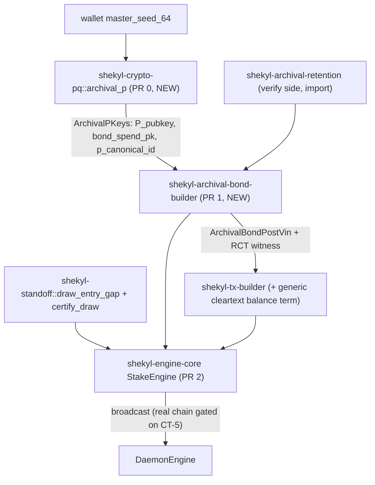
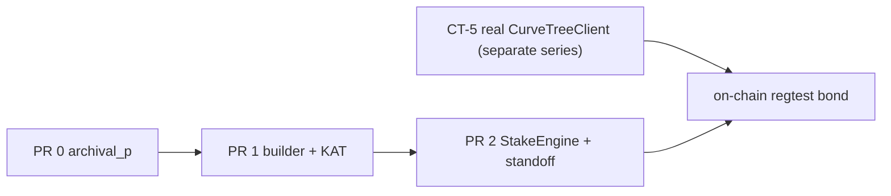

# Archival bond-post construction (wallet side, Stage 3 StakeEngine)

Status: design, under review (target 2-3 rounds; see Section 11).
Scope owner: wallet/engine + crypto-pq.
Companion to the verify side in
[`rust/shekyl-archival-retention`](../../rust/shekyl-archival-retention) and the
spec in [`ARCHIVAL_BOND_GATE4.md`](ARCHIVAL_BOND_GATE4.md) /
[`ARCHIVAL_FIREWALL_GATE6.md`](ARCHIVAL_FIREWALL_GATE6.md).

This document specifies how the wallet **constructs** an archival bond-post
transaction. The consensus **verify** side already exists and is the fixed
contract construction must satisfy; this side does not.

---

## 1. Why this doc exists

The archival bond record format is **genesis-frozen** and **permanent**: a
bond posted at genesis is keyed by `p_canonical_id` and its `bond_spend_pk` is
immutable for the record's life (`ARCHIVAL_BOND_GATE4.md` §4.1). Construction
side genuinely does not exist yet -- there is no builder, no `TxRequest`
variant, no `bond_credit` handling in the RCT balance, and no `P`-identity
derivation. Designing before committing a permanent wire format and a
genesis-frozen derivation is build-enabling, not analysis for its own sake.

This is distinct from parameter/sim tuning (which the staker-archival work
froze as already-robust). Nothing here re-opens a tuned parameter; it specifies
unbuilt, permanent code.

## 2. Scope and non-goals

### In scope (this design)

- The full architecture for all four `BondPostKind`s (`JoinMarket`, `Rebond`,
  `Unbond`, `HoldingsUpdate`), so the JoinMarket-first implementation does not
  paint into a corner.
- The `archival_p` key-derivation primitive (`P` identity + `bond_spend_pk`),
  which is the genesis-frozen foundation that gates everything.
- The construct-side data flow, signing, and RCT balance for **JoinMarket**.

### Implemented first (JoinMarket only)

JoinMarket is the only kind with a complete verify counterpart today
([`bond_post.rs`](../../rust/shekyl-archival-retention/src/bond_post.rs)
`verify_join_market_bond_post`;
[`bond_rct_balance.rs`](../../rust/shekyl-archival-retention/src/bond_rct_balance.rs)).
Rebond / Unbond / HoldingsUpdate have wire types
([`bond_wire.rs`](../../rust/shekyl-archival-retention/src/bond_wire.rs)
`BondPostKind`) but **no verify implementation** ("V3.0 open"). Their
construction is **provisional** until paired with the verify-side work -- see
Section 9.

### Non-goals (sequenced dependencies, not this unit)

- **Real curve-tree integration (CT-5).** See Section 8 -- this is the
  difference between "construction logic works" and "a bond exists on a chain,"
  and it is named here as a sequenced dependency, not buried as an out-of-scope
  bullet.
- Off-chain announce/backing-presentation wire (separate gate-6 §7 item).
- HoldingsUpdate / Rebond / Unbond verify-side (their own PRs).

## 3. The honest milestone for this unit

> **What PR 0-2 delivers: construction validated against verify in a unit-test
> round-trip with a synthetic curve tree. NOT a bond on a real regtest chain.**

A transaction built with synthetic tree references (the placeholders still used
in [`signing_assembly.rs`](../../rust/shekyl-engine-core/src/engine/signing_assembly.rs)
via `synthetic_tree.rs`) will **not** pass a real daemon's verify, because the
membership proof references a tree the daemon does not have. On-chain
end-to-end is gated on the real `CurveTreeClient` wiring (CT-5 series), which is
separate work.

The milestone this unit honestly reaches is the **round-trip KAT**:

```text
archival_p derive -> build JoinMarket vin + RCT witness
  -> verify_join_market_bond_post(vin, record_exists=false) == Ok
  -> verify_bond_post_rct_balance(pseudo_outs, out_masks, fee, bond_credit=floor, bond_debit=0) == Ok
```

"A bond exists on a chain" comes when the curve-tree client is real. Naming this
now prevents discovering the gap after PR 2 ships.

## 4. Single-sourcing by import

Construction reuses the validated verify-side types rather than re-deriving
them, so "what we validated is what ships" holds by construction (the same
discipline as `shekyl-standoff`):

| Reused symbol | Source | Used for |
| --- | --- | --- |
| `ArchivalBondPostVin`, `signature_preimage`, `serialize` | `shekyl-archival-retention::bond_wire` | the vin and its sig preimage |
| `bond_floor` | `shekyl-archival-retention::bond_floor` | `bonded_total == bond_credit == floor` |
| `p_canonical_id_from_hybrid_pubkey` | `shekyl-archival-retention::id` | record key |
| `verify_join_market_bond_post`, `verify_bond_post_rct_balance` | same crate | KAT oracle |

The bond-builder crate **depends on** `shekyl-archival-retention`; it does not
copy any wire or floor logic.

## 5. Crate / module layout



- **`shekyl-crypto-pq::archival_p`** (PR 0): the derivation. All key derivation
  already lives in this crate; `archival_p` mirrors
  [`account.rs`](../../rust/shekyl-crypto-pq/src/account.rs) exactly, with the
  archival labels.
- **`shekyl-archival-bond-builder`** (PR 1, new crate): deterministic, no
  async, no actor -- builds the vin + RCT witness. Testable and KAT-able in
  isolation. Depends on `shekyl-archival-retention` (types) and
  `shekyl-tx-builder` (RCT machinery).
- **`shekyl-tx-builder`** (PR 1, extended): gains a **generic** extra cleartext
  balance term (Section 7).
- **`shekyl-engine-core` StakeEngine** (PR 2): orchestration -- funding
  selection, standoff timing + self-cert, actor wiring, broadcast.

(Open question for review: builder as a new crate vs. a `construct` module
inside an existing engine crate. The new-crate option is the current proposal
for isolation + KAT-ability; Section 11.)

## 6. PR 0 -- `archival_p` derivation (BUILT NOW, in parallel)

PR 0 is **not gated on this doc's review rounds.** Its design is already
settled: the bundle is `ARCHIVAL_FIREWALL_GATE6.md` §9.4, the labels are §9.3,
the crate home is decided, and the freeze pattern mirrors
[`address_derivation_freeze.rs`](../../rust/shekyl-crypto-pq/src/address_derivation_freeze.rs).
None of that is among the open construction-flow questions the rounds exist to
resolve. PR 0 is the highest-stakes primitive in the project (a bit of
derivation drift means a user cannot recover their own bond) and is built
carefully today, with the doc's rounds running on PR 1/2 alongside.

### 6.1 Keys (gate-6 §9.4 `ArchivalPKeys`)

```text
ArchivalPKeys {                       // landed: matches gate-6 §9.4 (post scalar-vs-seed resolution)
  p_slot: u32,
  spend_pk/sk, view_pk/sk,            // Ed25519 ADDRESS scalars, via wide-reduce (L=64)
  ml_kem_ek/dk,                       // ML-KEM-768
  x25519_pk,                          // montgomery(view_pk)
  hybrid_sign_pk/sk,                  // IDENTITY; Hybrid{ed25519=account_sign_seed, ml_dsa=account}
  bond_spend_pk/sk,                   // GF-1 debit authorizer; Hybrid{ed25519=bond_spend_ed_seed, ...}
}
// hybrid_bond_id() is an accessor returning &hybrid_sign_pk (== invariant enforced
//   structurally, no second copy). p_canonical_id is NOT a field: it is computed
//   downstream by shekyl-archival-retention::id over hybrid_bond_id's canonical bytes.
```

Per-field `ZeroizeOnDrop` (the container holds non-`Zeroize` public material, so
it is *not* a single `derive(ZeroizeOnDrop)`; each secret field wipes via its own
destructor), and **not `Clone`** (per `21-reversion-clause-discipline.mdc` and
`AllKeysBlob`'s precedent). Lives in the StakeEngine actor task; the `!Clone`
bound is what keeps the bundle from escaping the actor (§10.1).

**Scalar-vs-seed (genesis-frozen, 2026-06-17).** The two `hybrid` Ed25519 halves
(`account_sign_seed` for the identity, `bond_spend_ed_seed` for the debit
authorizer) are dedicated `L=32` RFC 8032 seeds, **not** the address spend
scalar -- `HybridEd25519MlDsa` is seed-keyed (`SigningKey::from_bytes` clamps
`SHA512(seed)`). The identity uses its own `account_sign_seed` rather than
reusing `spend`, which decouples the public `P_pubkey` from the receive-address
spend key (privacy-positive, gate-6 §9.3). Receive-address spend/view stay
`L=64` wide-reduce (real scalar consumers: `spend·B`, `montgomery(view)`).

### 6.2 HKDF labels (gate-6 §9.3, pinned `L`)

| Output | Label | L | Consumer |
| --- | --- | --- | --- |
| `spend_wide` | `shekyl-archival-p-ed25519-spend-v1` | 64 | wide-reduce -> address spend scalar |
| `view_wide` | `shekyl-archival-p-ed25519-view-v1` | 64 | wide-reduce -> address view scalar |
| `kem_d_z` | `shekyl-archival-p-ml-kem-768-v1` | 64 | SHA3-ChaCha -> ML-KEM-768 KG |
| `account_sign_seed` | `shekyl-archival-p-ed25519-account-sign-v1` | 32 | RFC 8032 seed -> identity Ed25519 half |
| `ml_dsa_seed` | `shekyl-archival-p-ml-dsa-65-v1` | 32 | `keygen_from_seed` -> identity ML-DSA half |
| `bond_spend_ed_seed` | `shekyl-archival-p-bond-spend-ed25519-v1` | 32 | RFC 8032 seed -> bond-spend Ed25519 half |
| `bond_spend_ml_dsa_seed` | `shekyl-archival-p-bond-spend-ml-dsa-65-v1` | 32 | `keygen_from_seed` -> bond-spend ML-DSA half |

`info = LABEL || 0x00 || p_slot.to_le_bytes()` -- **implemented and
genesis-frozen** in `archival_p` and the KAT (not merely a KAT-author note; the
separator is on the wire). Collision-safety note: the `0x00` is
belt-and-suspenders, not load-bearing. Because `p_slot` is a fixed-width 4-byte
suffix, two distinct `(LABEL, p_slot)` pairs already cannot produce the same
bytes -- different-length labels give different total lengths, equal-length
distinct labels differ in the label region -- so *distinct* labels suffice and
prefix-freeness is not required. The separator adds nothing semantically here;
it is frozen because it costs nothing and the corpus is already pinned (removing
it would be a pointless KAT re-open). The ML-KEM intermediary
(`SHA3-256(b"shekyl-mlkem-chacha-seed" || kem_d_z)` -> `ChaCha20Rng`) is the
same function as principal; archival separation comes from the distinct
`kem_d_z` bytes.

### 6.3 KAT -- `ARCHIVAL_P_DERIVE_V1` (third cross-arch-deterministic primitive)

After `reward_arithmetic` and the standoff draw, this is the **third**
primitive that must be bit-identical across architectures, and the
highest-stakes of the three. The KAT mirrors the
`docs/test_vectors/ADDRESS_DERIVATION_V1/{manifest.json,vectors.json}` corpus +
the `*_manifest_hash` freeze tripwire, and adds two determinism-discipline
requirements:

1. **aarch64 qemu-user lane.** The `address_derivation_freeze` KAT in
   `shekyl-crypto-pq` did **not** run on the aarch64 lane -- that lane
   ([`.github/workflows/depends.yml`](../../.github/workflows/depends.yml), step
   "archival KAT tests run under aarch64 (qemu-user)") ran only
   `shekyl-archival-retention` and `shekyl-standoff`. PR 0 **added the
   `ARCHIVAL_P_DERIVE_V1` KAT (`shekyl-crypto-pq --test
   kat_archival_p_derive_v1`) to that lane** (scoped to the KAT binary so the
   slow keygen path runs only for the pinned vectors), so the derivation is
   verified bit-identical on ARM, not just compiled. Confirmed passing under
   `qemu-aarch64-static` locally. (This is the "ARM phone can't recover the
   bond" failure mode made into a gate.)
2. **Label-sensitivity negative.** A test that derives under a wrong label and
   asserts a different key -- proving the GF-1-carve independence (P identity
   vs. `bond_spend_pk` under distinct labels) is *demonstrated*, not just
   asserted by the HKDF construction, and that a future label drift trips a
   test the way the standoff trap does.

## 7. PR 1 -- JoinMarket construction core

### 7.1 The vin

```rust
ArchivalBondPostVin {
    hybrid_public_key: keys.hybrid_bond_id.canonical_bytes(),   // identity = P_pubkey
    p_canonical_id: keys.p_canonical_id,                        // == p_canonical_id_from_hybrid_pubkey(hybrid_public_key)
    post_kind: BondPostKind::JoinMarket,
    holdings,                                                   // ShardSetCompact{ids} or CompleteTree
    bonded_total_atomic: bond_floor(&holdings),
    bond_credit: bond_floor(&holdings),
    bond_debit: 0,
}
```

Signed over `ArchivalBondPostVin::signature_preimage(&tx_prefix_hash)` with the
**P identity key** (`hybrid_sign_sk`): JoinMarket is a credit path
(`bond_debit == 0`), and per `ARCHIVAL_BOND_GATE4.md` §3.5 step 5 credit paths
authorize against `P_pubkey`; the JoinMarket signature additionally binds the
committed `bond_spend_pk` via the preimage. `bond_spend_pk` is committed on the
record at JoinMarket and authorizes only later debit paths (Unbond,
HoldingsUpdate drop) -- not exercised in PR 1.

### 7.2 Generic cleartext balance term in `shekyl-tx-builder`

The RCT balance the verify side enforces is

```text
sum(pseudoOuts) + bond_debit = sum(out_masks) + fee + bond_credit
```

([`bond_rct_balance.rs`](../../rust/shekyl-archival-retention/src/bond_rct_balance.rs)
already adds `amount_h(fee)` and `amount_h(bond_credit)` **symmetrically** --
`bond_credit` is the same kind of cleartext H-term as `fee`). The split is:
the bond-builder owns vin assembly; `shekyl-tx-builder` owns the RCT balance
(reimplementing the pseudoOut/mask machinery in the new crate would violate
single-sourcing).

**`shekyl-tx-builder` must not learn the word "bond."** PR 1 adds a **generic
extra cleartext balance term** -- the way `fee` is one -- and the bond-builder
supplies it as `bond_credit`. This keeps tx-builder bond-agnostic
(`18-type-placement`: generic capability in the generic crate, bond semantics
in the bond crate) and means the next cleartext term (emission, a future burn)
reuses it rather than bolting on a second special case.

Note: the economics "burn" (`shekyl-economics::burn::compute_n_split`) is a
fee-split calculation, **not** an RCT cleartext balance term -- there is no
pre-existing generic RCT term to reuse, so PR 1 introduces it (generically).

### 7.3 Funding inputs

Credit paths carry FCMP++ `txin_to_key` funding inputs whose committed value
exceeds outputs + fee by exactly `bond_credit = floor`. Output construction
reuses the existing
[`shekyl-crypto-pq::output::construct_output`](../../rust/shekyl-crypto-pq/src/output.rs)
path (as `sign_bridge` does for transfers).

## 8. Sequenced dependency: real curve-tree (CT-5)

The funding inputs need real membership proofs against the live curve tree. PR
0-2 use the synthetic tree, which is sufficient for the round-trip KAT but not
for a real daemon. The dependency chain to "a bond on a chain":



`chain` requires **both** PR 2 and CT-5. This unit delivers up to PR 2.

## 9. The other three kinds are provisional

The four-kind architecture is designed here so JoinMarket-first does not paint
into a corner, but only JoinMarket is exercised by the round-trip KAT. Rebond,
Unbond, and HoldingsUpdate construction are **a hypothesis validated only on
paper** until their verify + construct PRs land. They are **reopenable** when
that work begins -- do not treat the deferred architecture as settled before
anything exercises it. Each carries its named verify-side gap:

| Kind | Auth key (§3.5 step 5) | Verify side today | Construction status |
| --- | --- | --- | --- |
| JoinMarket | `P_pubkey` | exists | PR 1 (KAT-validated) |
| HoldingsUpdate add | `P_pubkey` | absent | provisional |
| HoldingsUpdate drop | `bond_spend_pk` | absent | provisional (operator-guide footguns live here) |
| Rebond | `P_pubkey` | absent | provisional |
| Unbond | `bond_spend_pk` | absent | provisional |

## 10. PR 2 -- StakeEngine orchestration + standoff self-cert

- A `TxRequest`/StakeEngine surface for JoinMarket; funding decorrelation
  defaults from [`ARCHIVAL_TIMING_CONSTANTS.md`](ARCHIVAL_TIMING_CONSTANTS.md)
  §7 (>= 1 settlement-epoch spacing; fund-from-earnings ramp).
- **Runs the standoff self-cert, not just `draw_entry_gap`.** PR 2 wires
  `draw_entry_gap` for prep-spend / announce / bond-post separation (600-block
  window, inversion on) **and** runs `shekyl-standoff`'s `certify_draw` against
  the wallet's actual CSPRNG. The self-cert is the actionable half of the
  conformance work -- it proves the *shipping wallet's RNG* produces conformant
  draws, not merely that the reference does.
- This is where the operator-guide footgun guards
  ([`STAKER_OPERATOR_GUIDE.md`](../STAKER_OPERATOR_GUIDE.md), slice 2 of the
  operator unit) attach.

### 10.1 Actor encapsulation, efficiency, and lifecycle

The StakeEngine actor *is* the gate-6 firewall: §9.6's "StakeEngine is sole
owner of `P.view_sk`, structurally disjoint from LedgerEngine, route-by-decap,
never cross-assigned" is GF-2 realized as actor isolation. The three properties
below are what make that isolation hold rather than merely declare it; they are
design dispositions for PR 2, not open questions.

**Efficiency -- derivation is CPU-bound; keep it off the async hot path.**
`derive_archival_p_keys` is dominated by PQ keygen (ML-DSA-65 + ML-KEM-768
keygen; HKDF and Ed25519 are cheap). A single-`P` wallet is ~1 ms, borderline
inline. The multi-`P` whale -- the operator this dependability work exists for
-- derives `N` bundles on wallet open; `N` serial keygens run inside an async
`kameo` handler block the Tokio worker thread (cooperative scheduling, no
preemption), stalling the whole runtime for tens of ms at open. **Disposition:**
run derivation on `spawn_blocking`, and since per-slot keygens are independent,
either parallelize them or derive lazily per-`P` on first use rather than all
up-front. This keeps a whale's wallet-open from becoming a visible stall and
keeps the actor responsive to other messages during derivation.

**Robustness -- the message protocol stays operation-shaped, never
key-shaped.** Actor isolation holds *only* if the message API never leaks the
bundle. Messages carry **requests** ("sign this preimage", "decap this") and
responses carry **results** (a signature, an ownership decision) -- never the
key bundle, never a `Clone` of it. `ArchivalPKeys` being `!Clone` +
per-field-`ZeroizeOnDrop` (§6.1) is what *binds* this: the secret cannot escape
the actor because nothing can request it and nothing can copy it out. The P-scan
pipeline (`combined_ss` recovery) stays **inside** StakeEngine, so only scan
*results* cross the actor boundary, not shared secrets. The moment a decapped
secret would need to flow to another actor, that message type would need its own
`ZeroizeOnDrop` -- a door to keep shut. (If a future design opens it, that is a
gate-6 isolation amendment, not a PR-2 implementation detail.)

**Robustness -- re-derive-on-restart makes `master_seed_64` the load-bearing
root.** `ArchivalPKeys` is derived on wallet open and **not persisted** (no
derived key at rest -- the right call). The consequence: StakeEngine re-derives
on every actor restart and every rotation, so `master_seed_64` must outlive the
StakeEngine actor and carry the same `mlock` + `ZeroizeOnDrop` discipline as the
bundle -- it is the root the whole firewall hangs off, and a `kameo` supervision
restart re-touches it. Two PR-2 confirmations:

1. **Seed survives a StakeEngine panic/restart cleanly**, so re-derivation
   succeeds deterministically. The `aarch64` `ARCHIVAL_P_DERIVE_V1` KAT (§6.3)
   is what guarantees the *same* keys come back -- restart-determinism is the
   runtime consumer of that cross-arch freeze.
2. **`p_slot` rotation is atomic in the actor** -- the old bundle is wiped *as*
   the new one is installed, with no window where both `P`s are live. This is
   the restore-flow co-activation hazard (gate-6 §10.9 isolation pin) surfacing
   at the actor layer: a rotation that briefly holds two active `P` identities
   is exactly the co-activation §10.9 forbids, so it must be a **single state
   transition**, not drop-then-derive with a gap.

## 11. Review plan and open questions

Target **2-3 rounds, not 4-6.** The construct side is largely determined by the
already-validated verify side -- the point of single-sourcing -- so there are
fewer open choices than a greenfield design. Do not pad to 4-6 out of habit.

Open questions for the rounds (PR 1/2; PR 0 is settled and built in parallel):

1. Builder as a new crate (`shekyl-archival-bond-builder`) vs. a module in an
   existing engine crate.
2. Exact API shape of the generic cleartext balance term in `shekyl-tx-builder`
   (one term vs. a slice of terms; signed vs. credit/debit pair).
3. `TxRequest` extension shape for bond operations (new variant vs. a parallel
   StakeEngine request type).
4. Whether the round-trip KAT lives in the builder crate or a cross-crate
   integration test against `shekyl-archival-retention`.

## 12. Timeframe analysis (`05-system-thinking.mdc`)

- **Now (V3.0):** JoinMarket construction, round-trip-KAT-validated. The
  genesis-frozen derivation (PR 0) and permanent wire format are fixed
  correctly before launch.
- **Mining-era end (~30 yr):** bond construction is independent of the
  emission schedule; no coupling to the fee-only transition.
- **V4 (lattice-only):** `archival_p` is hybrid (Ed25519 + ML-DSA-65) like the
  principal account; the V4 transition that retires the classical half applies
  uniformly. `bond_spend_pk` rotation is already a full Unbond + re-JoinMarket
  (§4.1), so a V4 re-key path exists by construction.
