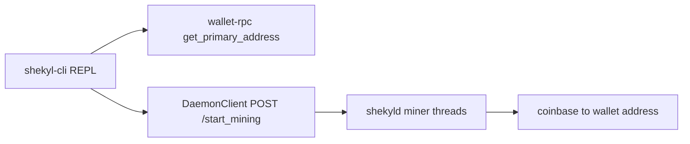

# CLI wallet coherence and usability (CU)

**Status:** OPEN — Round 1 (2026-09-11); CU-1…CU-6 implemented on
`feat/cli-usability-cu` (one commit per cut), awaiting landing on `dev`.
Owning doc for the `CU-1…CU-N` identifier family (registered in
[`IMPLEMENTATION_INDEX.md`](IMPLEMENTATION_INDEX.md) §2).

**Scope.** `shekyl-cli` is Shape B and internally coherent; the end-user
story is not. This doc owns the usability cuts that make the CLI wallet
workable for a new operator: first-class network selection (CU-1), human
vocabulary (CU-2), mining **control** from the wallet (CU-3), address
display for ~2 kB hybrid addresses (CU-4), enumerated failure-mode copy
(CU-5), and the doc realignment that closes the FOLLOWUPS `USER_GUIDE
realignment` row (CU-6).

**Timeframes (rule 05).** These are operator-surface cuts: they address
*now* and carry no consensus, wire, or key-material content. Nothing here
changes at mining-era end or the V4 transition — the mining-control
adaptor talks to whatever PoW the daemon runs, and network selection is
name-to-port data.

---

## 1. The correction of record: doing vs controlling mining

Two adjacent bullets in
[`WALLET_REWRITE_PLAN.md`](WALLET_REWRITE_PLAN.md) §"Hard cuts for
Phase 2" were later read as one refusal:

- *"`mining` commands (now in `shekyld`)"* — **correct, for doing.**
  Miner threads, RandomX, and `handle_block_found` live in the daemon.
  A `MiningEngine` inside the wallet was independently refused in
  [`../V3_ENGINE_TRAIT_BOUNDARIES.md`](../V3_ENGINE_TRAIT_BOUNDARIES.md)
  §"Hypothetical 8th-trait evaluation": no Stage-4 state distinct from
  the daemon connection; operations are RPC fan-out. That note's own
  "correct shape" is methods on the daemon client — i.e. **control**.
- *"`start_mining`, `stop_mining` (out-of-scope for a wallet)"* —
  **over-read.** Those names are the *control* surface. Treating them as
  the same cut as "don't hash in the wallet" is how
  [`../CLI_PARITY_MATRIX.md`](../CLI_PARITY_MATRIX.md) rows 71/73 became
  "Out of scope | Mining, daemon concern" with no reopen clause.

CU-3 is therefore **not** a rule-21 reopen of a product refusal — it is
the conflation corrected. The premise that failed is "the wallet must
not send `/start_mining`"; the load-bearing cut ("the wallet process
does not run RandomX") is unchanged and this doc re-pins it:

- **Doing** — RandomX threads, block templates, block submission — stays
  in `shekyld`. `shekyl-cli` gains no hashing code, ever.
- **Controlling** — `start` / `stop` / `status` with this wallet's
  payout address — is a CLI adaptor over the daemon's `AdminOnly`,
  loopback-only path RPCs, the same class of work `chain_health` already
  does through the independent `DaemonClient`
  ([`../../rust/shekyl-cli/src/daemon.rs`](../../rust/shekyl-cli/src/daemon.rs)).
- `wallet_rpc.yaml` gains **no** mining methods: control is daemon RPC,
  not a spend/scan concern, and the wallet-RPC server never proxies it.
  Parity rows 72/74 (`start_mining_for_rpc` / `stop_mining_for_rpc`)
  stay rejected — that was the removed RPC-wallet mining path.

Prior-art shape (taken deliberately): Bitcoin Core's `-generate` is a
client-side composition (`getnewaddress` + `generatetoaddress`); Monero's
wallet `start_mining [threads]` tells `monerod` to mine. We compose
`get_primary_address` + daemon `/start_mining` the same way.

## 2. Work items

### CU-1 — Network selection

- `--testnet` / `--stagenet` as flags on `shekyl-cli`, mutually
  exclusive with each other and with `--network` (which remains). No
  flag stays **mainnet** — there is deliberately no persistent
  "last network" config; a silent remembered network is how a testnet
  habit spends mainnet money.
- Connection flags (`--network`, `--testnet`, `--stagenet`,
  `--daemon-address`, `--engine-dir`/`--wallet-dir`,
  `--engine-file`/`--wallet`, `--rpc-url`, `--proxy`,
  `--daemon-ca-cert`, `--debug`) become clap **global** arguments, so
  `shekyl-cli create miner --testnet` works (previously flags after the
  subcommand failed to parse).
- The wallet directory defaults to `~/.shekyl/wallets/<network>/`
  (created on demand) instead of `.`, so testnet files cannot collide
  with mainnet files (the Electrum isolation shape). An explicit
  `--wallet-dir` is taken as given. Pre-genesis: no migration code —
  move or `rm` old `$PWD` wallet files by hand.
- The REPL prompt always names the network: `testnet:miner>` /
  `mainnet>`.
- Daemon-down copy names the matching daemon invocation
  (`shekyld --testnet`, port 12029), not a generic "connection refused"
  (§4).

`shekyld` already takes `--testnet` / `--stagenet`; daemon flags do not
change.

### CU-2 — Human vocabulary

- Public flag names `--wallet-dir` / `--wallet`; the engine-era names
  `--engine-dir` / `--engine-file` stay as **hidden aliases** so
  existing scripts do not break.
- REPL `engine_info` → `wallet`; `engine_info` stays as a hidden alias.
- `help <command>` prints a one-command usage block (the grin-wallet
  shape); bare `help` keeps the categorized listing.
- `start_mining` typed with no `mine` surface present was a bare
  "Unknown command" while `USER_GUIDE.md` taught it — the motivating
  rule-82 instance. With CU-3 the name is a live alias; the near-miss
  diagnostics in §4 cover the rest.

### CU-3 — Control mining from the wallet (daemon still hashes)

`DaemonClient` grows path-POST support for the daemon's DJSON path
handlers `/start_mining`, `/stop_mining`, `/mining_status`
(`src/rpc/core_rpc_server.h`; these are **not** `/json_rpc` methods).

REPL verbs:

- `mine start [threads|auto]` — payout address from this wallet's
  `get_primary_address`; default and `auto` threads =
  `min(available_parallelism, 4)` (a wallet convenience default, not a
  tuned miner — operators who care pass a count or use `shekyld`
  directly). Sends `do_background_mining: false`,
  `ignore_battery: false`.
- `mine stop`.
- `mine status` — active/idle, threads, hash rate in H/s, payout
  address (short form per CU-4), difficulty. The daemon's
  `pow_algorithm` string is **not** rendered: the inherited label table
  still emits Cryptonight names for dead pre-RandomX variants
  (`core_rpc_server.cpp` `on_mining_status`); deleting those arms is
  daemon-side rule-60 cleanup outside this PR's scope (FOLLOWUPS row,
  Target: pre-genesis).
- Aliases: `start_mining [threads]` / `stop_mining` / `mining_status`
  (Monero muscle memory; also what `USER_GUIDE.md` had been teaching).

Gates, all fail-closed before any daemon call:

1. **Wallet open** — `mine start` needs a payout address; without an
   open wallet the refusal names `open` / `create`. (`mine stop` /
   `mine status` also require it for symmetry: mining verbs are wallet
   verbs here; the daemon console is the wallet-less path.)
2. **Loopback daemon only** — mining RPCs are `AdminOnly`; a
   non-loopback `--daemon-address` is refused with "control mining from
   the daemon host" copy. This is a CLI refusal in addition to the
   daemon's own gating, so the operator hears it before a network
   round-trip.
3. **Unrestricted RPC** — a restricted listener refuses admin RPCs;
   the CLI surfaces that as "restricted RPC" copy (§4), not a raw
   error string.
4. **Sync state** — if the daemon reports `busy_syncing` (or
   `synchronized: false`), `mine start` warns and requires confirmation
   rather than silently mining a stale tip.

On successful `mine start`, the CLI states that mining continues after
the CLI exits — the daemon owns the threads.

### CU-4 — Address display

Hybrid addresses are ~2,030 characters; dumping one to the terminal is
unusable and encourages sloppy copy-paste. `address`:

- Default: a **short display form** — first 24 characters + `…` +
  last 12 — plus the full length, explicitly labeled as *display only,
  not a valid address*.
- `address --full` prints the whole address (unchanged behavior).
- `address --out <path>` writes the full address to a new `0600` file
  (refuses to overwrite), so the full string never has to transit
  scrollback or shell history. Not a secret — an address is public —
  but the same O_EXCL/0600 shape as `--seed-out` keeps the file
  handling uniform.

### CU-5 — Failure-mode copy

Enumerated here before code (rule 82); each path says what to run next.

| # | Failure | Where caught | Copy says |
|---|---|---|---|
| F1 | Daemon down / connection refused | `mine`, `chain_health`, `status`, startup disclosure | The network-matched daemon invocation: `shekyld` / `shekyld --testnet` / `shekyld --stagenet` and the port it would answer on |
| F2 | Wrong network vs daemon (wallet testnet, daemon mainnet) | `mine start` preflight (`get_info` nettype vs `--network`) | Name both networks and the flag to fix (restart CLI or daemon with the matching flag) |
| F3 | Restricted RPC | `mine *` | "The daemon's RPC listener is restricted (view-only); mining control needs the unrestricted loopback listener" |
| F4 | Remote (non-loopback) daemon | `mine *` preflight | "Mining is controlled on the daemon's own host; this CLI is pointed at `<addr>`" |
| F5 | No wallet open | `mine *` (and existing `require_open` sites) | `open <name>` / `create <name>` |
| F6 | Already mining | `mine start` | Current thread count + `mine stop` first (daemon reports the state; the CLI relays it, no error tone) |
| F7 | Daemon syncing | `mine start` | "syncing (height X of Y) — mining now may mine a stale chain"; requires confirmation |
| F8 | `start_mining` (or `mine`) typo'd / partial | parser | Usage diagnostic naming `mine start [threads]`, never bare "Unknown command" |
| F9 | Password/seed TTY rules | existing `display.rs` / `--password-stdin` surfaces | Already correct; unchanged |

### CU-6 — Docs (rule 91)

- Rewrite the wallet-basics, mining, and network-selection sections of
  [`../USER_GUIDE.md`](../USER_GUIDE.md) against the actual binary
  (`create <name>` in the REPL / `create` subcommand with `--seed-out`;
  no `--generate-new-wallet`, no accounts/subaddresses/sweeps/address
  book, no `[wallet]: seed`), absorbing the FOLLOWUPS **USER_GUIDE
  realignment** row.
- Split doing vs controlling where the conflation lived:
  `WALLET_REWRITE_PLAN.md` hard-cut bullets, `CLI_PARITY_MATRIX.md`
  rows 71/73 (→ Covered, with the doing-stays-daemon note),
  [`../EXECUTABLES.md`](../EXECUTABLES.md).
- `shekyld`'s mining console remains documented as the path for
  operators already on the node (and the only path with no wallet).

## 3. Out of scope (named, with reopen shape)

- **Auto-spawning `shekyld` from the wallet.** Process supervision is
  an operator/service-manager concern. Reopen only with a product
  decision for a bundled-node CLI mode (the GUI's sidecar already
  covers the desktop case).
- **Persistent "last network" config file.** Rejected for v1: a silent
  remembered network is a mainnet-spend hazard. Reopen if a `cli.toml`
  lands for other settings *and* the default stays mainnet unless the
  file is explicit.
- **`mine generate N`** (instant blocks): regtest/FAKECHAIN tooling
  only; never on a live PoW network.
- **GUI / mobile mining surfaces** — separate repos, separate plans.
- **Any change to wallet-rpc Shape B** for spend/scan.

## 4. Landing shape

CU-1 + CU-2 (ergonomics) → CU-3 (mining control) → CU-4 + CU-5 →
CU-6 (docs land with the verbs they describe). Single short-lived
branch off `dev` (`feat/cli-usability-cu`), one commit per CU item.
