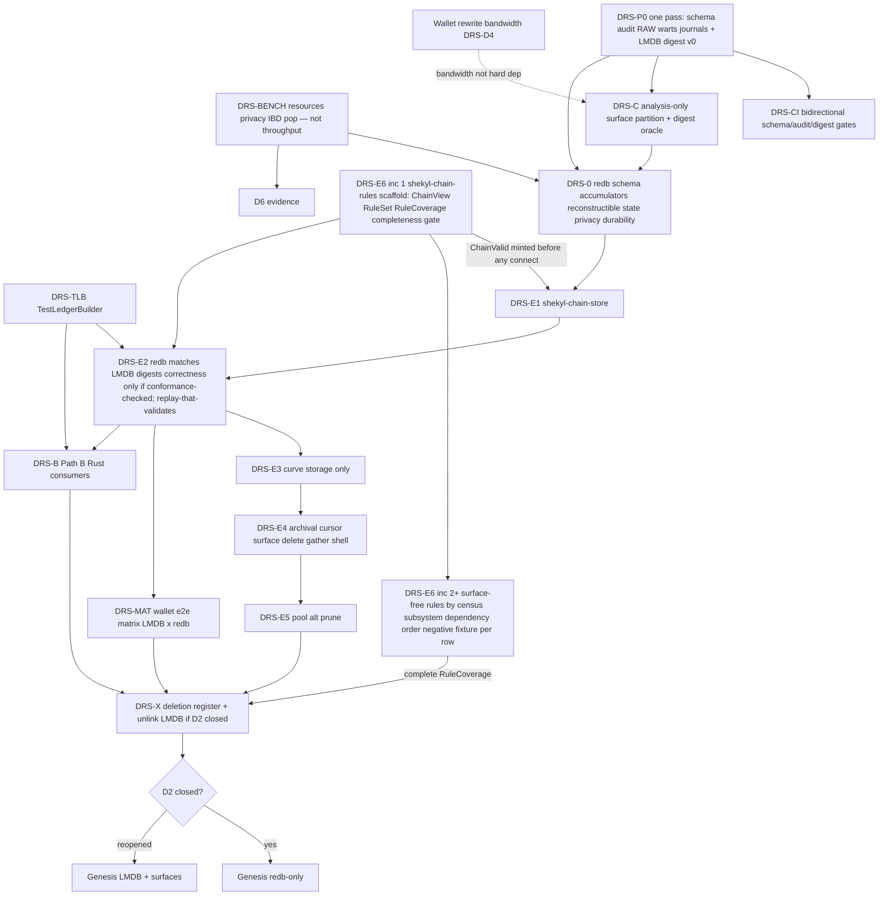

# Daemon chain store — redb at genesis (Path B)

**Status:** Design **open for execution of DRS-P0 / DRS-BENCH**, and of **DRS-C
as analysis only** (CSR-4, 2026-09-01 — DRS-C does **not** ship as C++ refactor
PRs; the surface partition is the scoping/review unit for the Rust rewrite).
After
Round-1 (**DRS-R-1…R-19**), Round-2 (**R2-1…R2-8**, **E-1…E-8**), a
**gap-close pass** (success criteria, surface map, concurrency, P0 multi-PR,
D2-reopen as first-class good, D10 mandatory reconstructible, IBD floor
sketch — 2026-07-27), and **post-close pin PC-1** (D2-R1 re-pointed at DRS-C —
2026-08-21, §14). Engine-swap (**DRS-E\***) **in progress: E1 increment 1 (S-TXN lifecycle, PR #740, 2026-09-13) landed; increment 2 (canonical codecs + rule-42 gate, `schema_version` seal, persisted provenance, typed `properties` cells — §11.1 implementation pointers) landed 2026-09-14; **increment 2.5** (the branded `WriteBatch<'id>` reachable only through `ChainStore::write`, `StoreError`'s three classes as its outer variants, `StoreInvariant` with SI-7 built, `InsertTable`/`UpsertTable`, batch poison — §3.6.3 implementation pointers) landed 2026-09-15; **increment 3 — S-CHAIN-W, the connect/pop write set — landed 2026-09-16 (PR #757; rulings and commits dated 2026-09-15)** (`connect(ChainValid, ConnectFacts, RuleSetId)` / `pop()` on the branded batch, one undo log per connect, SI-1/2/3/4/6/8/9 built, the writer halt, `ConnectState` wire type — §3.6.3 implementation pointers; plan and pre-flight in [`DRS_E1_SCHAIN_W.md`](../completed/DRS_E1_SCHAIN_W.md)); the daemon still opens LMDB only — DRS-E2's replay is the store's first production writer**; **C2-R8 RULED 2026-09-14** ([`CONSENSUS_C2_R8_STORE_PLACEMENT.md`](../completed/CONSENSUS_C2_R8_STORE_PLACEMENT.md)) — the storage-layer placement question that blocked S-CHAIN-W's writers is answered (validator crate with no store handle mints `ChainValid`; `ChainView` projected from the committing `WriteBatch`; the store computes nothing consensus-visible; pop is undo-log reverse replay; three error classes, invariant→verdict conversion banned and gated; belts in [`STORE_INVARIANT_REGISTER.md`](STORE_INVARIANT_REGISTER.md)). **S-CHAIN-W's E1 precondition (increment 2.5) is discharged; its DRS-E6 precondition — increment 1, the `shekyl-chain-rules` scaffold — landed 2026-09-15 ([`CHAIN_RULES_CRATE.md`](CHAIN_RULES_CRATE.md)), so S-CHAIN-W is unblocked; the plan amendment the ruling's §14 owed — DRS-D12 (validation precedes connect; replay-that-validates is the only pre-cutover writer), the DRS-E6 row and its §7.5 surface partition (141 of 153 live consensus rows have no storage surface at `02c086f4b`), `ChainTip.connect` in `get_info` — landed 2026-09-15**; **P0a–P0d delivered 2026-09-10**; **DRS-0 is UNBLOCKED as of 2026-09-11** — CEN-B5's S1 was re-verified at `e54e5b983` (the sha that merged PR #623) and the row promoted, discharging its last gate. Prior premature “ratified” banner remains withdrawn.
**Mission hierarchy** ([`00-mission`](../../.cursor/rules/00-mission.mdc)):
security/PQC → privacy → longevity. DRS success criteria (§0.1) and BENCH
columns are ordered by that hierarchy, not by engineering elegance.
**Process rule:** [`26-sub-pr-design-discipline.mdc`](../../.cursor/rules/26-sub-pr-design-discipline.mdc).
**Spec-first per** [`05-system-thinking.mdc`](../../.cursor/rules/05-system-thinking.mdc).
**Verification stamp:** Round-2 numbers vs `dev` **`3247fe3b6`**. The surface
map is **no longer stamped** — §3.5 is re-derived from the tree by
`scripts/ci/check_drs_c_surface_map.py` on every run, because the stamp here
said 97 while the tree had moved to 102. **The five table-inventory
rows (handles, opens, claimed total, undocumented, phantoms) re-measured
at `9742ec4f6` by P0a (2026-09-05); the atomicity-audit row re-measured at
`2dba46537` by P0b (2026-09-05)** — the remaining substrate rows
(`m_db->` counts, hardfork pop) were not — the pin→HEAD delta
is closed in the [P0a reconciliation registry](#p0a-reconciliation-registry-2026-09-05-dev-9742ec4f6);
the other stamped figures are unre-measured and keep the Round-2 pin.

**Identifier family:** `DRS-*` · **Crate names:** **`shekyl-chain-store`**
(pinned, DRS-R-19) · **`shekyl-chain-rules`** (the validation crate, pinned
DRS-D12 — no store handle by construction).

> **COUNTERMAND 2026-09-01 — read before acting on any decision below.**
> Rick ruled that the inherited C++ is **not a base**: its glitches and
> irregularities are proven bad enough that a complete rewrite gates release.
> This retires **DRS-D5**'s decompose-in-place rationale, empties the three
> **DRS-D2** reopen bridges of **D2-R1 and D2-R2** (both resolved to "ship
> genesis-on-LMDB", which is unavailable on sequencing and unshippable under the
> countermand — a reopen now means *testnet slips*); **D2-R3 survives** as an
> engine question, but its "stay LMDB" arm now means a **Rust** store over LMDB,
> never retaining the C++, inverts **DRS-P0c**'s FIX-IN-CPP-FIRST
> default, and demotes the C++ from *trusted* oracle to a differential
> reference for rules that are **both** ratified on record **and** carry an
> **affirmative conformance record** (**CSR-3a**). Two things are insufficient:
> ratification alone — CEN-L11 was bucket-1 ratified with an implementation
> that silently omitted an accepted output (fixed 2026-09-04), so a bucket-only
> rule would have scored reproducing that defect as correctness — and *absence of a recorded
> divergence*, which means **unreviewed**, not conformant — stated when the
> register was explicitly incomplete, and still the rule now that coverage is
> complete over the bucket-1/2 set: the set itself grows (bucket promotions
> enter UNREVIEWED), so absence keeps meaning unreviewed, never conformant. Three states: CHECKED-CONFORMANT (oracle),
> DIVERGENT, UNREVIEWED (**the default**); the last two are regression-only, and
> **DRS-P0f row coverage is complete** (2026-09-02): 102/102 bucket-1/2 rows disposed at that date — **100 CHECKED-CONFORMANT**, 1 DIVERGENT (CEN-B5's rule-71 FAKECHAIN skip — retired on PR #623 with its S1; **re-verified at merged sha `e54e5b983` and promoted 2026-09-11, so no row is DIVERGENT today**), 1 failed closed (CEN-L8; CEN-I12 was promoted 2026-09-05 once its anchor source was reconciled) — over the **102** bucket-1/2 rows that existed then. The set is now **131** (C2-R1b promoted nine rows 2026-09-03; C2-R1c ten more 2026-09-04, nine promotions plus the K1 split; CEN-I19 minted 2026-09-06 with its implementation; C2-R2 promoted eight — the omission that made this figure read 122; C2-R8 minted CEN-L1 into bucket 2 on 2026-09-14). **Three** are UNREVIEWED in the §5.4.1 register (CEN-L8 failed closed, CEN-I19 re-amended by PL-D3, CEN-L1 born with its ruling) — the twenty-seven-row P0f backlog closed 2026-09-11 at `eb1b60198`, I19 having been promoted that day. **Both S-graded findings are FIXED and re-verified:** the S0 by PR #602 (M8/G4/J26 promoted) and the S1 by PR #604 (CEN-D2/D1 promoted, 2026-09-03); **CEN-L11/L12 promoted at PR #609's merged fix (2026-09-04).** P0f is the per-row conformance review (*not* P0d, which is Digest v0); bucket-3/4 rows remain UNREVIEWED pending their design rounds. **A third S-grade was found 2026-09-04 and is **fixed on PR #623 (2026-09-05, census §7 #18)** — the check now runs at admission before the add, on every nettype; **re-verified at the merged sha `e54e5b983` and the row PROMOTED 2026-09-11, which discharged the last gate on DRS-0 — DRS-0 is UNBLOCKED (§front-matter):** CEN-B5's header check compared the root *after* the add while the header is filled from the root *before* it — every non-FAKECHAIN chain would have halted at height 60 (census §7 #17) — **S1**, masked by the FAKECHAIN skip, which the same PR retired. This invalidates the unhedged
> "trusted LMDB digest" phrasing in **A2 / D11 / E2**.
> **heed is retired** (no block has been mined on any network — every peer is at height 1, and that genesis block is **regenerated deterministically** from the `GENESIS_TX` / `GENESIS_NONCE` constants in `cryptonote_config.h` whenever the store is empty (`blockchain.cpp:513`), in any engine. There is no persisted state to preserve, so format compatibility is worth zero — DEL-007). **DRS-D4 is substantially discharged** (wallet ~90%).
> **Ruled 2026-09-01 and applied in this document — CSR-3:** the oracle
> clause is propagated into A2 / D11 / E2. The digest is an oracle only where a
> rule is **both** ratified **and** carries an **affirmative conformance record**;
> absence of a recorded divergence means *unreviewed*, not conformant. The
> conformance register that supplies that record (**CSR-3a**, seeded with
> CEN-L11) is **complete over the 102 bucket-1/2 rows P0f reviewed, not the
> live set (131 after C2-R8)** — **102 / 0 / 1 over the live 103-row §5.4.1 set as of 2026-09-11**, after CEN-B5 and CEN-I19 were re-reviewed at their merged shas and promoted, via **DRS-P0f** — so outside those the digest is
> a *regression* instrument. **The review's two S-grades are fixed and re-verified** — the S0
> by PR #602 (M8/G4/J26 promoted) and the S1 by PR #604 (D2/D1 promoted) — and a
> third (CEN-B5's header-check timing, S1, 2026-09-04, census §7 #17) is fixed on
> PR #623 (2026-09-05, §7 #18) and **re-verified at `e54e5b983` on 2026-09-11**,
> which promoted the row and released its hold on DRS-0. **Also applied — CSR-4:** DRS-C is
> **analysis-only**; §3.5's PR shape amended. **CSR-1** and **CSR-2** are ruled
> and recorded in the reconciliation; **CSR-5** is ruled in direction only,
> with no queue slot fixed.
> Blast radius, the row-level census map, and the work items are in
> [`CONSENSUS_STORE_RECONCILIATION.md`](CONSENSUS_STORE_RECONCILIATION.md)
> (`CSR-*`). Individual decision cells below are **not** rewritten in place —
> the countermand is recorded once, here and in §15, per rule 95.

> **Cross-reference (CSR-6).** This program shares its subject files with the
> all-Rust consensus rewrite: [`CONSENSUS_RULE_CENSUS.md`](CONSENSUS_RULE_CENSUS.md)
> (`CEN-*`) enumerates **173** rules (**164** consensus-flagged + **9** policy-flagged);
> **19 of 173 census rows** cite a file under `src/blockchain_db/` as an
> enforcement site (§7.5.2's predicate, re-derived by
> `check_drs_e6_partition.py`) — surfaces the store DRS replaces. Its **§10 R8
> batch ("storage-layer enforcement placement")** is the same decision as this
> document's schema/surface design, and **R8 is the ruling instrument**
> (CSR-1); §3.5's surface map is its input, not a competing authority.
> **R8 RULED 2026-09-14** — [`CONSENSUS_C2_R8_STORE_PLACEMENT.md`](../completed/CONSENSUS_C2_R8_STORE_PLACEMENT.md)
> — over the **eighteen** rows CSR-6 counted at 2026-09-01: none remains a
> rule the store enforces — seven were always ratified specs the rewrite
> consumes, two are validator rules (CEN-K3, CEN-L1), seven dissolved or
> re-homed as store invariants (`SI-1…SI-8`,
> [`STORE_INVARIANT_REGISTER.md`](STORE_INVARIANT_REGISTER.md)), and two are
> other batches' (CEN-B3 → R4; CEN-L14's semantics → R8b). The nineteenth,
> **CEN-I19** (minted 2026-09-06, bucket 1), joined after CSR-6 and R8 did
> not rule it: its store citation is an unreachable collector abort that
> DRS-E3's typed `0x07` entry dissolves (§7.5 table 2). The store's connect
> path is designed *after* the rules it used to carry were ruled.

### Substrate inventory (code-anchored)

| Fact | Measurement |
| --- | --- |
| Live `MDB_dbi` table handles in `db_lmdb.h` | **49** (1:1 with opens; was 46 at the Round-2 pin — the three births are in the P0a registry below) |
| `lmdb_db_open(` **call** sites (macro path) | **49** — the 50th `rg` hit is the **function definition**, not an open (the pin-era shape R2-3 ruled on: N calls + 1 definition; was 46+1) |
| `docs/LMDB_SCHEMA.md` claimed total | **49** — **current and gate-pinned** (`check_lmdb_schema_coverage.py`; claimed 41 at the Round-2 pin) |
| Tables in code, **0 hits** in schema doc | **none** (P0a, 2026-09-05). At the Round-2 pin these **seven** had zero hits: `block_burn`, `archival_budget`, `archival_budget_accrual`, `archival_bond_unbond_log`, `archival_bond_reinstate_log`, `archival_bond_holdings_update_log`, **`archival_emission_claim_log`** — all documented since (`2572e6f5b`, 2026-08-25 — the commit that landed all seven sections and the coverage gate; the gate's header dates its census 2026-08-26, the same moment in UTC, and counts **nine** = these seven + the two witness tables born 2026-08-04) |
| Phantom tables in schema/audit | **none** (P0a). At the pin: `staker_accrual`, `staker_claims` — **0** hits in `db_lmdb.{h,cpp}`; their sections died with the claim-era wire deletion, and the gate's ghost leg refuses their return |
| `m_db->` sites / distinct methods | **253** in `blockchain.cpp`; **97** distinct methods (same 97 across all files — no extra methods outside that vocabulary) |
| Atomicity audit | **rewritten by P0b (2026-09-05)** — covers all **declared** tables (matrix gate-pinned; declared, not runtime — DRS-W5 records that a writable `open()` deletes `hf_starting_heights`, leaving 48), all **three** prune shapes — one atomic, two checkpointed — and the store lifecycle (`open()`, `reset()`, `migrate()`); was: 183 lines, April 2026, **0** archival hits vs **702** in `db_lmdb.cpp` (22 of the live tables post-dated it) |
| Hardfork pop | `HardFork::on_block_popped` **reads** `get_hard_fork_version(height)` for heights **above** new tip (`hardfork.cpp:286–302`); interface has **set/get only**, no delete (`blockchain_db.h:1938,1947`) |

### Oracles of record — status

| Document | Status |
| --- | --- |
| [`docs/LMDB_SCHEMA.md`](../LMDB_SCHEMA.md) | **RECONCILED** (P0a, 2026-09-05) — gate-pinned duplicate-free bijection with `SHEKYL_LMDB_TABLES` (property rows, headings, total, DB-version header); a DRS-0 input |
| [`docs/LMDB_WRITE_ATOMICITY_AUDIT.md`](../LMDB_WRITE_ATOMICITY_AUDIT.md) | **RECONCILED** (P0b, 2026-09-05) — rewritten in place at `2dba46537` over every write path; §10 matrix gate-pinned to `SHEKYL_LMDB_TABLES`; A-2/A-4/A-6 transcriptions + RAW set carried; the April verdicts preserved as records-was |
| `db_lmdb.{h,cpp}` | **Authoritative** table inventory until re-census |
| Early **logical state digest** (E-1) | **Built** (P0d, 2026-09-10) against production LMDB — core chain + `spent_keys` + live curve-tree root. Archival journals are a named exclusion (§7.1.1), not first in DRS-E2 |

**DRS-P0 (P0a–P0d) landed 2026-09-10. DRS-0 is UNBLOCKED as of 2026-09-11** — the register's third S-grade was re-verified at its merged sha `e54e5b983` and CEN-B5 promoted. The S0 (CEN-M8, PR #602) and the first S1 (CEN-D2/D1, PR #604) are fixed, merged and re-verified; a **second S1 was found 2026-09-04 and fixed 2026-09-05 (PR #623)** — CEN-B5's header check compared the root *after* the add while `create_block_template` fills the header from the root *before* it, so every non-FAKECHAIN chain would have halted at height 60 (census §7 #17); the check now runs at admission before the add, red → green observed on a TESTNET Blockchain fixture (§7 #18); **re-verified 2026-09-11 at `e54e5b983` — ordering traced rather than read from the comment, uniformity established by the absence of any `m_nettype` token in the function, and the regression test confirmed wired at `tests/unit_tests/CMakeLists.txt:124`.** CEN-L11/L12 were promoted at PR #609's merged fix (2026-09-04).

### P0a reconciliation registry (2026-09-05, `dev` `9742ec4f6`)

The Round-2 substrate figures above were measured against `dev`
`3247fe3b6` (2026-07-27). This registry closes the delta to the current
tree by **set difference, not history search**: the pin's table-name set
(46) against the current `SHEKYL_LMDB_TABLES` X-macro (49 declared,
`db_lmdb.cpp` —
the single source `mdb_env_set_maxdbs` derives from, SO-D4). **Births =
3, deaths = ∅** — both directions of the set difference are the evidence,
so "no deaths" is a measurement, not an unstated conjunct of
`46 + 3 = 49` (a history search alone would have reported identically for
`4 births − 1 death`). The registry key is the on-disk name string — what
a deployed datadir contains; the `db_lmdb.h` handle set was separately
verified `m_<name>` 1:1 against it at HEAD (49/49).

**Birth provenance.** The independent witness is the schema version
ladder (`LMDB_SCHEMA.md` header): the pin defines `VERSION 8`, HEAD
defines `12`, v9 is recorded as "witness tables ride" and v10 carries
"the additive `archival_settlement` table riding the boundary" — all
three births are dated after the pin by a consensus-relevant schema
record before any text search is consulted. Text forensics, secondary: a
bare-substring pickaxe for `archival_settlement` returns `e3fd838ee`
(2026-06-10, **pre-pin**) via the longer identifier
`archival_settlement_epoch_at_height` — an epoch helper, not the table;
all 8 pin-era hits are that helper, and the pin file contains **zero**
occurrences of the quoted literal `"archival_settlement"` (control: the
quoted `"archival_serve_credit"` hits the pin file once, so the check
discriminates). The quoted-literal pickaxe's oldest hit is `9d7661daf8`
(2026-08-24, SO-D4), post-pin by ancestry. A census delta is a **set
question** answered by two extractions and a diff; when a pickaxe must be
used at all, its subject is the quoted name string, never the bare
identifier family. The sibling trap (hit twice during verification, once
per verifier): **the instrument must match the era it is pointed at** —
the pin declares names as `const char* const LMDB_* = "…"` constants
(the X-macro did not exist yet), so today's macro grep returns zero
against the pin, and a whitespace-rigid regex against the pin's aligned
declarations (`LMDB_CURVE_TREE_META   = …`, multiple spaces) silently
under-counts to 45 and manufactures a phantom fourth birth. Extract by
the pin's own form, and treat a count that misses the floor as a broken
parse, not a finding.

**Pin-era doc closure** (counted at `3247fe3b6:docs/LMDB_SCHEMA.md`, not
inferred from the claimed total): 42 third-level (`###`) headings over 41
`LMDB name` property rows and a claimed total of 41. The heading surplus
was a second `properties`-titled heading — already present at the pin,
invisible to the property-row comparison then as now (merged away, and
gated at the heading layer, by this PR). The 41 unique documented names =
**39 real + 2 phantoms** (`staker_accrual` / `staker_claims`); the 46 pin
tables = those 39 + the seven undocumented. The coverage gate's header
records **nine** undocumented at its 2026-08-26 census (landed as `2572e6f5b`, 2026-08-25 — the header's date is the same moment in UTC) — both figures are
correct at their own dates: nine = the seven, plus the two witness tables
born 2026-08-04 (between pin and census) and undocumented at birth.
Phantoms at HEAD: **0** — both lost their sections with the claim-era
wire deletion, and the gate's ghost leg refuses their return.

**49 rows**, one per **declared** table (declared, not runtime — a writable
`open()` drops `hf_starting_heights`, leaving 48; DRS-W5); dispositions
count 39 documented-at-pin
+ 7 since-documented + 3 born-since:

| Table | Disposition (pin `3247fe3b6` → `9742ec4f6`) |
| --- | --- |
| `alt_blocks` | in code at pin, documented at pin |
| `archival_alt_attestation_witness` | born since pin — `3dee502595` (2026-08-04, credit-wire PR-B2; schema v9) |
| `archival_attestation_witness` | born since pin — `a308eb430a` (2026-08-04, credit-wire PR-B2; schema v9) |
| `archival_bond` | in code at pin, documented at pin |
| `archival_bond_holdings_update_log` | in code at pin, **undocumented** at pin (Round-2 row above); section added post-pin in `2572e6f5b` (2026-08-25 — the one commit that landed all seven sections and the coverage gate) |
| `archival_bond_reinstate_log` | in code at pin, **undocumented** at pin (Round-2 row above); section added post-pin in `2572e6f5b` (2026-08-25 — the one commit that landed all seven sections and the coverage gate) |
| `archival_bond_unbond_log` | in code at pin, **undocumented** at pin (Round-2 row above); section added post-pin in `2572e6f5b` (2026-08-25 — the one commit that landed all seven sections and the coverage gate) |
| `archival_budget` | in code at pin, **undocumented** at pin (Round-2 row above); section added post-pin in `2572e6f5b` (2026-08-25 — the one commit that landed all seven sections and the coverage gate) |
| `archival_budget_accrual` | in code at pin, **undocumented** at pin (Round-2 row above); section added post-pin in `2572e6f5b` (2026-08-25 — the one commit that landed all seven sections and the coverage gate) |
| `archival_emission_claim_log` | in code at pin, **undocumented** at pin (Round-2 row above); section added post-pin in `2572e6f5b` (2026-08-25 — the one commit that landed all seven sections and the coverage gate) |
| `archival_epoch_close_log` | in code at pin, documented at pin |
| `archival_r_market` | in code at pin, documented at pin |
| `archival_serve_credit` | in code at pin, documented at pin |
| `archival_settlement` | born since pin — `9d7661daf8` (2026-08-24, SO-D4; schema v10 — see provenance note above) |
| `archival_shard_segment` | in code at pin, documented at pin |
| `archival_sigma_work` | in code at pin, documented at pin |
| `archival_slash_applied` | in code at pin, documented at pin |
| `archival_slash_log` | in code at pin, documented at pin |
| `block_burn` | in code at pin, **undocumented** at pin (Round-2 row above); section added post-pin in `2572e6f5b` (2026-08-25 — the one commit that landed all seven sections and the coverage gate) |
| `block_heights` | in code at pin, documented at pin |
| `block_info` | in code at pin, documented at pin |
| `block_pending_additions` | in code at pin, documented at pin |
| `blocks` | in code at pin, documented at pin |
| `curve_tree_checkpoints` | in code at pin, documented at pin |
| `curve_tree_layers` | in code at pin, documented at pin |
| `curve_tree_leaves` | in code at pin, documented at pin |
| `curve_tree_meta` | in code at pin, documented at pin |
| `curve_tree_roots` | in code at pin, documented at pin |
| `hf_starting_heights` | in code at pin, documented at pin |
| `hf_versions` | in code at pin, documented at pin |
| `leaf_to_output` | in code at pin, documented at pin |
| `output_amounts` | in code at pin, documented at pin |
| `output_metadata` | in code at pin, documented at pin |
| `output_to_leaf` | in code at pin, documented at pin |
| `output_txs` | in code at pin, documented at pin |
| `pending_tree_drain` | in code at pin, documented at pin |
| `pending_tree_leaves` | in code at pin, documented at pin |
| `properties` | in code at pin, documented at pin |
| `spent_keys` | in code at pin, documented at pin |
| `tx_indices` | in code at pin, documented at pin |
| `tx_outputs` | in code at pin, documented at pin |
| `txpool_blob` | in code at pin, documented at pin |
| `txpool_meta` | in code at pin, documented at pin |
| `txs` | in code at pin, documented at pin |
| `txs_pqc_auths` | in code at pin, documented at pin |
| `txs_prunable` | in code at pin, documented at pin |
| `txs_prunable_hash` | in code at pin, documented at pin |
| `txs_prunable_tip` | in code at pin, documented at pin |
| `txs_pruned` | in code at pin, documented at pin |

This registry is CI-pinned: `scripts/ci/check_lmdb_schema_coverage.py`
asserts these rows are a duplicate-free bijection with
`SHEKYL_LMDB_TABLES` and that the stated row count matches, in the same
run that pins `LMDB_SCHEMA.md`'s property rows, section headings, stated
total, and DB-version header. `docs-gates.yml` (né `doc-links.yml`; renamed by P0b) already triggers on
`docs/**` and on `db_lmdb.cpp`, so both a registry edit and a
source-only table change start the gate.

**Field evidence for the RECORD-AND-SPECIFY default (P0c), from the
round preceding this PR.** C2-R1c-Q3b repaired one inherited defect —
the sync-phase orphan arm punishing honest origins — and the fix took
three forms across six review rounds because the machinery around it is
undocumented: the first fix stalled sync because nothing re-schedules a
severed request loop (the pre-fix punishment *was* the recovery); the
second carried dead negotiation state into `request_missing_objects`,
whose nothing-to-request arm silently drops; the rig's first green came
through a wrong channel (`reserve_span` had parked the parent in
`requested_hashes`); and the cleanup-failure path returned early past
the recovery it guarded. Four failures, each from behavior no document
records. That per-defect, per-reviewer specification cost is the
wholesale-port argument in miniature: record the wart, specify the Rust
store, don't patch blind.

---

## 0. Problem statement

Durable state lives in C++ LMDB (**49** declared tables, 48 at runtime —
DRS-W5). Orchestration tangle is
**`blockchain.cpp`** (265 store call sites, 100 store methods), not the
storage class alone.
Policy math increasingly lives in Rust. Cross-language gather/FFI/store is a
**boundary-thickness and type-safety** problem under
[`40-ffi-discipline`](../../.cursor/rules/40-ffi-discipline.mdc) — marshal
*cost* is unmeasured and **must not** load-bearing-justify Path B (R2-4 / R-14).

**Program:** re-census LMDB truth **and** build a layout-independent **state
digest against LMDB** → **partition `blockchain.cpp` analytically** with that
digest as regression oracle (DRS-C is **analysis-only** since CSR-4; the surfaces
scope Rust rewrite increments, they are not C++ refactor PRs) → redb-native
`shekyl-chain-store` behind stable surfaces → **redb-only genesis**.
**The genesis-on-LMDB alternative is retired** by the 2026-09-01 countermand: it
ships the C++ ruled unshippable. Its former text is kept in §1.5 and §8.2 as
dated history only.

### 0.1 Success criteria — “Shekyl is better when …”

Ordered by [`00-mission`](../../.cursor/rules/00-mission.mdc). **Engine-
agnostic first** (Tier A). redb-only genesis is Tier B. Meeting Tier A under
**D2-reopen is a successful genesis outcome**, not a scar (§1.5).

#### Tier A — quality program (required for *any* honest genesis path)

| # | Shekyl is better when … | Mission | Lands by |
| --- | --- | --- | --- |
| **A1** | Archival **pop-reversal journals** have an atomicity/pop-symmetry audit (and S0/S1 findings fixed or decision-logged) — **met 2026-09-05 (P0b):** audit §§2-3 verdicts + §7/§8 transcriptions; both S-grades were closed by PR #602/#604 | Security | DRS-P0 |
| **A2** | A **layout-independent logical state digest** exists against production LMDB and is used as a regression oracle — **for rules ratified on record AND carrying an affirmative conformance record** (CSR-3 / CSR-3a; *not on the register* is **not** sufficient — absence means unreviewed, and unreviewed is regression-only). A bucket is not a conformance claim: CEN-L11 was bucket-1 ratified with an implementation that silently omitted an accepted output (fixed 2026-09-04), so a digest match there would have recorded reproduction of the defect — the reason the rule is written this way. Over a **DIVERGENT** or **UNREVIEWED** row — or any bucket-3/4 row — the digest is regression evidence and must be reported as that (a **CHECKED-CONFORMANT** register row is the one case where a match *is* correctness evidence). **Met-exists 2026-09-10 (P0d):** `shekyl-chain-store::digest_v0` + `BlockchainLMDB::logical_state_digest_v0` against production LMDB (core chain + spent_keys + live curve root). DRS-C consumes it. Archival journals excluded (§7.1.1) | Security | DRS-P0 → C |
| **A3** | Known durable-state **warts** are recorded (DRS-W1…DRS-W17); default **RECORD-AND-SPECIFY**. **Met 2026-09-08 (P0c):** four remaining rows registered in the audit §9; A-6 dominance analysis declined (possession-typed write handle). **Regraded 2026-09-09:** DRS-W15 Forbidden is DIVERGE-by-delete **conditional** on R4 keeping an incremental vote window; R4 answers that prior question, not two sequenced ones. DRS-W12 is latent (capability, not a blinded test) | Security | DRS-P0 / C |
| **A4** | Consensus store **durability is explicit** (strict fsync policy) and crash-tested — not library default by omission | Security | DRS-D9 (+ E\* or LMDB config path) |
| **A5** | **Resource bounds** under attacker-shaped load are measured: file growth, long-lived readers, peak RSS | Security → Privacy | DRS-BENCH |
| **A6** | **IBD wall time** meets the §1.3 floor (full-node viability → density → remote-node privacy) | Privacy | DRS-BENCH / DRS-0 |
| **A7** | **Cross-store leaf/position KAT** green (daemon encodings == wallet LeafStore) | Security (spendability) + Privacy (no “debug with remote node” pressure from broken local spend) | DRS-D3c |
| **A8** | Substrate docs cannot drift: bidirectional CI on schema ↔ `MDB_dbi` ↔ atomicity audit | Longevity | DRS-CI |
| **A9** | `blockchain.cpp` DB use is partitioned into **named validation surfaces** (§3.5) with digest-stable extractions as far as C progresses | Longevity | DRS-C |
| **A10** | **Derived state is reconstructible** from the local block corpus (mandatory for D2-closed; strongly preferred under reopen) | Longevity + Security (recovery) | DRS-D10 |

#### Tier B — pure-Rust / Path B (preferred under D2-closed; not required for “better”)

| # | Shekyl is better when … | Mission |
| --- | --- | --- |
| **B1** | Policy + persistence for connect paths share one language (no permanent gather/FFI/put façade) | Longevity (rule 40) + Security (layout-drift class) |
| **B2** | Production `shekyld` has **no C LMDB** in-process (residual risk shifts to audited Rust store + supply-chain governance) | Security (memory-safety class) / Longevity |
| **B3** | Commit-consuming write API makes forget-to-commit **unrepresentable** | Security + Privacy (txpool/Dandelion++ class) |

**Anti-criteria (not “better”):** faster ops/sec than LMDB; redb for prestige;
engine swap without A1–A3.

---

## 1. Binding decisions

| ID | Decision | Rationale |
| --- | --- | --- |
| **DRS-D1** | **Path B destination.** Rust owns store + connect consumers long-term. No permanent C FFI `BlockchainDB` façade over redb. | A permanent façade **thickens** the FFI boundary and freezes dual-language types — forbidden posture under rule 40. *(No marshal-perf claim — R2-4.)* |
| **DRS-D2** | **Preferred genesis: redb-only** production `shekyld`. | Tier B hosting. **Reopen §1.2** is a **first-class good path** when Tier A is met (§1.5) — not a scar. |
| **DRS-D3** | Daemon store ≠ wallet `LeafStore` — **schemas, tables, txn models, durability, APIs, and crates deliberately separate.** | **Opposed threat models** (§1.4) — not “overhead.” Unification forces the union of constraints on both stores. |
| **DRS-D3b** | **Shared layer = encodings + tree arithmetic only** (`shekyl-fcmp`, `shekyl-wire`, related pure crates). Daemon curve grow/trim/drain **hosts storage only** and **must not** reimplement leaf codecs, tree-position maps, or hash arithmetic. | Daemon produces roots; wallet reconstructs paths. Drift presents as “wallet can’t spend,” not a storage bug (§1.4). |
| **DRS-D3c** | **Cross-store KAT corpus** is mandatory: given output index *N* on a fixture chain, daemon tree position + leaf bytes **byte-equal** wallet LeafStore. Both stores run it. | Price of non-unification; makes separate schemas *safe* rather than merely separate. |
| **DRS-D3d** | **No shared `redb-helpers` crate** (or equivalent dependency edge). Idioms (schema_version cell, commit-consuming txn, error taxonomy) are a **written pattern** each store implements. **NARROWED 2026-09-18 by CTS-Q2** (maintainer, PR #776), landed as PR A: the **value contract** — `Canonical`, `CodecError`, the four value shapes and the codecs for types neither store owns — is shared as `shekyl-store-codec`; everything this row names is not. | Shared helpers are the unification vector: start as `open_or_create`, end as shared codecs. Rhyme by convention, not by dep. **Why the narrowing does not reopen the vector:** the admitted crate holds none of the three idioms above — each store still writes its own lifecycle, transaction model and error taxonomy — and the thing D3b already calls shared is codecs (that row covers them explicitly). What forced it is the orphan rule, not convenience: once `Canonical` is one trait for two stores, an impl for a foreign type can live only where the trait lives, and the vocabulary crates are `no_std` and must not learn about `redb`. What stays per store is what the vector would have eaten: each store's own column codecs, §11.1(b)'s bump obligation, the fixture snapshots and the `impl Canonical` scan. A second edge into that crate — a lifecycle helper, an `open_or_create` — is this row unnarrowed, and is refused. |
| **DRS-D4** | Wallet rewrite owns **reviewer/decision-maker bandwidth** first. | **Not** a technical “C++ cannot move until wallet Phase N.” **DRS-P0, DRS-BENCH, and DRS-C may proceed** when bandwidth allows; engine-swap (DRS-E*) stays behind wallet priority. Stated constraint = **reviewer bandwidth**, mitigable by surface-at-a-time PRs (E-5). |
| **DRS-D5** | **Decompose first (C++ / LMDB), engine swap second.** | One variable at a time (R-4). **Rationale retired 2026-09-01** by the countermand; the mechanism survives as analysis only (CSR-4) — the decomposition is a scoping cut for the rewrite, not a sequence of shipped C++ PRs. |
| **DRS-D6** | **Engine preference = redb, not heed** until **DRS-BENCH** says otherwise. | Pure Rust preference. Genesis-load-bearing only after **§7.4 resource/privacy measures** + IBD floor — **not** raw ops/sec vs LMDB. |
| **DRS-D7** | LMDB logical oracle / dual-backend **shadow** only during engine-swap. | One authoritative writer per env. |
| **DRS-D8** | Schema **redb-native** at engine swap; **divergence register** with **RECORD-AND-SPECIFY** default (inverted 2026-09-01 by the countermand; was FIX-IN-CPP-FIRST). | §6.4. |
| **DRS-D9** | Consensus store uses the **strictest practical durability** (full fsync / equivalent per block commit). | Steady-state commits are **block-cadence network-bound**; write set finishes in ms against a budget measured in minutes. A 10× engine difference is invisible; **strict fsync has no measurable steady-state cost** — security decision with no efficiency reopen (§5.2). Not inherited from LeafStore silence. |
| **DRS-D10** | **Reconstructible derived state is mandatory for D2-closed genesis.** **Domain (ratified 2026-09-13): consensus-bearing DERIVED state.** Every table in that domain must be rebuildable by replaying local blocks through `apply_block`, without exception. **The qualifier is a boundary, not an exemption list**, and it turns on original-versus-derived rather than on retention policy: bytes that are **original** — carried in the transaction as admitted, non-derivable from anything else, and read only at admission, such as the `txs_prunable` body and the `txs_pqc_auths` slice, both of which are slices of the tx blob itself (`db_lmdb.cpp:283–284`) — were **never in domain**, so D10 never claimed they were replayable and no future decision to stop keeping them can falsify it. Bytes that are **derived** stay in domain and stay rebuildable *after* any such decision, because replay regenerates them: curve-tree leaves are grown from the block's own outputs on the connect path (`collect_outputs` → `grow_curve_tree`, `BlockchainDB::add_block` (`blockchain_db.cpp:630–635`)), and the `output_to_leaf` / `leaf_to_output` indexes are functions of that same growth. **Unconfirmed and non-canonical content is outside the domain rather than exempt from it** — pool rows are unconfirmed by definition and the alt surface is, by definition, blocks the chain did not take, so replaying the local chain was never going to produce either. *Why this wording rather than a list of exceptions:* an exception list has to be edited as tables are added, and each edit is a chance to carry a reason past the mechanism that justified it; a domain stated as original-versus-derived is checked per table by asking what produces the bytes. Under D2-reopen, still **strongly preferred** and required before any later redb cutover. | Longevity + security recovery (E-6). Soft “preferred” language removed for the redb path — without this, format migration and crash recovery re-inherit debt. |
| **DRS-D11** | **Logical state digest** is a first-class artifact, built **against LMDB** in P0/C (E-1). | Oracle for DRS-C; input definition for DRS-D8; harness exercised before redb. **Scope (CSR-3 / CSR-3a):** oracle only where **both** hold — ratified on record **and** an **affirmative conformance record** exists. Three states: CHECKED-CONFORMANT (oracle), DIVERGENT (register), UNREVIEWED (**default**); the latter two are **regression** instruments. The register is **complete over the bucket-1/2 set** — a property `check_conformance_coverage.py` re-derives on every run (set-difference zero in both directions) and prints with the live tally; the live bucket-1/2 consensus count is §7.5 table 1's `C` rows at b1+b2, re-derived by `check_drs_e6_partition.py --describe`. **No live count is restated here** — every figure below is records-was at its date. At 2026-09-02 the set was 102 rows; the nineteen promoted by C2-R1b (nine, 2026-09-03) and C2-R1c (ten, 2026-09-04) were UNREVIEWED and made it 121 **at 2026-09-04**; the tally at 2026-09-05 was 100 CHECKED-CONFORMANT / 1 DIVERGENT / 1 failed closed over the 102 (CEN-I12 promoted once its anchor source was reconciled). The set has grown since — CEN-I19 (promoted 2026-09-11) and C2-R8's CEN-L rows (2026-09-14), per the census's status banner — and the two gates carry it. **DRS-P0f** populated the register per row (P0d is Digest v0 and cannot). **Mechanism on the redb side (2026-09-15, C2-R8 Q8 §9.2): replay-that-validates** — the harness that populates the Rust store for the E2 diff runs every block through `shekyl-chain-rules::validate` before `connect`, so the same run that produces a digest also grades the validator against the register (DRS-D12). |
| **DRS-D12** | **Validation precedes the store's connect path, and replay-that-validates is the Rust store's only writer before cutover.** Ratified 2026-09-15 as the plan amendment [`CONSENSUS_C2_R8_STORE_PLACEMENT.md`](../completed/CONSENSUS_C2_R8_STORE_PLACEMENT.md) §14 owed. (i) The consensus rules live in **one** crate, **`shekyl-chain-rules`** (name pinned here the way DRS-R-19 pinned `shekyl-chain-store`), with **no store handle**: it imports neither `shekyl-chain-store` nor `redb`; its input is the candidate plus a `ChainView` and an explicit `RuleSet`; its output is a `ChainValid<'id>` only it can mint, or an `InvalidBlock` naming the census row that refused. Pool admission calls the same crate (`tx_form` / `tx_against` over a `PoolView`) — there is no second validator (ruling §9.4). (ii) Every block the Rust store connects **before** the LMDB→redb cutover is validated by that crate first: D10's replay with the validator attached, which is also the E2 harness (D11). An FFI shim minting `ChainValid` from the C++ verdict is **rejected** — it would make the private constructor a fiction at exactly the boundary the ruling drew (§9.2). (iii) Therefore the crate's first slice — **DRS-E6 increment 1** (§7.5) — sits on the critical path **ahead of S-CHAIN-W**, and the rules arrive as their surfaces port (surface-bound) or as E6's own increments (surface-free), never bolted on afterwards. A `ChainValid` carries `RuleCoverage`; only **complete** coverage is parity evidence (§8.1). **UPDATE 2026-09-19 (E2 Round 0 ruling, [`DRS_E2_REPLAY_DRIVER.md`](DRS_E2_REPLAY_DRIVER.md) §0–§1):** (ii)'s replay is not a bench tool that E3 later replaces — it is the daemon's ingest pipeline, built once as production code with the corpus as its first source and p2p as E3's; and the C++ it validates against is a non-canonical reference, adjudicated against the spec and never fixed. | The C++ enforces CEN-L1 by an `MDB_NODUPDATA` return code (ruling §1); the alternative — build S-CHAIN-W first and attach a validator later — reproduces that fusion in Rust and then pays to unpick it, the cost-benefit-defer-to-later shape [`16-architectural-inheritance`](../../.cursor/rules/16-architectural-inheritance.mdc) names. Replay over the canonical chain can only ever catch **over-rejection**, so the rule-per-row negative fixture (§7.5) is the deliverable and the replay run is the regression check. |

### 1.1 Schedule honesty

Genesis under D2-closed = full DRS-E\* (Tier A+B). The wallet rewrite is no
longer on this path: Phase 5 closed 2026-08-19 (#507, `a9dc5e4db` —
`src/wallet/` deleted), so the chain store is the long pole of the daemon
cutover, not a co-runner behind the wallet. **Superseded 2026-09-01:** the former “under D2-reopen, Tier A on LMDB is the
genesis product” reading is retired with the bridge itself — a reopen now means
**testnet slips**, not a different genesis product. DRS-C is unparked as
**analysis** so D2-R2’s clock can start when C closes; D2-R1 is the
calendar backstop for the case where C never starts that clock.

### 1.2 DRS-D2 reopen criteria

**Default preference:** genesis production binary is redb-only (Tier B).

| ID | Trigger | Bridge (**concrete**) |
| --- | --- | --- |
| **D2-R1** | **RE-ANCHORED 2026-09-01 (CSR-2): the trigger is the **testnet-gate event**, not a date** — its three legs are R8 dispatched, consensus rewrite complete, wallet complete. *History: PC-1 (2026-08-21) re-pointed the original wallet-Phase-5 trigger at “DRS-C not closed by 2027-04-01”; that date measured against a milestone that cannot arrive early, since testnet gates on this work and genesis is downstream of testnet.* | **The genesis-on-LMDB bridge is RETIRED** (countermand, 2026-09-01 — it ships the C++ ruled unshippable). A reopen now means **testnet slips**, recorded as a schedule outcome; Tier A remains required either way. |
| **D2-R2** | **DRS-C closed**, but **DRS-E2** not green within **6 months** of C close | **Bridge retired 2026-09-01** (same reason as D2-R1: it ships the C++ ruled unshippable). Firing now means **testnet slips**; Tier A still required, E\* still the destination |
| **D2-R3** | **DRS-BENCH** fails §1.3 IBD floor (or resource DoS bounds) after one mitigation cycle | **Reopen D6** — this one survives, because it is an *engine* question, not a ship-the-C++ question. But “stay LMDB” now means **a Rust store over LMDB via the rewrite**, never retaining the C++ implementation; Tier A still required |

Reopen = decision-log + index update. Never silent.

**Why R1 was re-pointed, not retired (PC-1).** R2 is a *relative* clock that
starts only when DRS-C closes; R3 is a BENCH outcome that exists only once
DRS-E\* runs. Neither fires if C is never opened or never closes. Retiring R1
without a replacement would have left D2 with no calendar-anchored exit — the
reopen-by-subtraction shape R2-8 already rejected — so the trigger moved to
the item that is now the long pole, with the same date and the same bridge.
The date is the genesis-schedule backstop, not a wallet-specific estimate,
and is unchanged.

### 1.5 D2-reopen is a first-class good path — **RETIRED 2026-09-01, kept as dated history**

> **This section is no longer a live path.** The countermand ruled the inherited
> C++ unshippable, so “Tier-A LMDB genesis” is not an available outcome: a D2
> reopen means **testnet slips**, not a different genesis product. The text below
> records the posture as it stood before 2026-09-01 and is deliberately not
> rewritten.

Under one decision-maker, **Tier A + LMDB at genesis** may be the *rational*
outcome. The project **must not** thrash to finish redb for optics.

| | D2-closed | D2-reopened |
| --- | --- | --- |
| **Status language** | “redb-only genesis” | “**Tier-A LMDB genesis** — quality program complete; pure-Rust store deferred” |
| **Success** | A1–A10 + B1–B3 | A1–A8 (and A9–A10 as far as landed); B\* open post-genesis |
| **Shame?** | No | **No** — meeting §0.1 Tier A is the point of the program |

Index and CHANGELOG use the Tier-A framing when reopen fires.

### 1.3 DRS-D6 evidence / IBD floor (sketch)

1. **DRS-BENCH** (§7.4): resource / privacy / DoS / IBD / pop — **not**
   throughput-vs-LMDB.
2. **IBD floor (initial sketch — refine with first in-tree baseline, do not
   invent fake precision):**

| Parameter | Initial pin | Notes |
| --- | --- | --- |
| **Reference height** | **H = 100_000** synthetic or regtest-equivalent full-validation blocks (or max available fixture; raise only with BENCH plan amend) | Large enough for bulk-load shape; small enough for CI optional nightly |
| **Hardware class** | Single mid-range x86_64 workstation/server class used for project CI self-host notes; document CPU model, RAM, disk type (NVMe vs HDD) **in the artifact** | Cross-machine absolute times are not load-bearing; **ratios** are |
| **Primary metric** | Wall time IBD to H under **same** consensus verify cost as production (FCMP++ + PoW verify enabled as in real sync) | Privacy chain: slower IBD → fewer full nodes → more remote-node use |
| **Floor (relative)** | redb (or candidate) IBD wall time ≤ **1.25×** LMDB wall time on the **same** machine, **two binaries** (one backend per build — the daemon never compiles two store engines into one binary, ruled 2026-09-14), same flags, same durability policy as production intent (DRS-D9) | Absolute “N hours” deferred until first LMDB baseline lands in-tree |
| **Hard fail (D2-R3 / D6)** | Ratio **> 1.50×** after one documented mitigation cycle, **or** fails resource bounds (§7.4) | Between 1.25× and 1.50×: decision-log accept or mitigate |
| **Resource bounds (sketch)** | Peak RSS under attacker-feed scenario ≤ **2×** LMDB peak on same scenario; file-size / logical-size ratio after simulated year of 2-minute blocks stays within plan-stated ceiling (set after first multi-year sim) | Security/privacy > speed |

3. Artifacts must record **durability configuration**. Unlabeled redb numbers
   are not genesis-load-bearing (no redb benches on `dev` at Round-2 stamp).

4. **The pass/fail lines above are PRE-REGISTERED and frozen** at `ba4b3c73a` (2026-09-12, DRS-0 slice C). §7.4 names "IBD floor from DRS-0" as a BENCH input, and
   this is that input: **≤ 1.25× passes, > 1.50× after one documented
   mitigation cycle hard-fails, the band between them is a decision-log call,
   peak RSS ≤ 2×**. They are frozen **now, while no measurement exists** —
   re-verified at this pin: the workspace has no redb-touching or IBD bench,
   exactly as §7.4 records. (**Census corrected 2026-09-13** at `f103acd38`,
   no threshold touched: `rust/*/benches/` holds **38 bench files across 9
   crates**, not only crypto-pq and engine-core economics — those two are 17 of
   the 38. **Zero** of the 38 names `redb` or `LeafStore`, so the load-bearing
   claim, and with it this freeze, stands; the original parenthetical
   undercounted the denominator without affecting the conclusion drawn from
   it.) That is the point rather than a limitation: a threshold
   chosen after the first number is a threshold fitted to it, and these ratios
   decide whether redb is genesis-load-bearing at all.

   **What "refine with the first in-tree baseline" still covers**, unchanged: the
   *instrument* rows — reference height `H` (if no fixture reaches 100_000, the
   artifact records the height it reached and the plan is amended, not the
   ratio), hardware class, and the durability configuration every artifact must
   carry. **Refining a ratio after seeing a number is a threshold change and
   needs the reopening it would otherwise avoid.**

   **Named blocker (rule 22):** the floor cannot be *discharged* here, only
   stated — discharging it needs DRS-BENCH artifacts in-tree. This leg is
   therefore "thresholds frozen, measurement outstanding", not "IBD floor done".
   **No pop/reorg threshold is pre-registered and that is deliberate:** pop is
   off-chain (§5.3), so it has no propagation budget to miss. Its halt condition
   is journal/delete churn under §7.4, not a wall-time ratio. Reopener: if pop
   ever runs inside the block-propagation budget, it acquires a ratio like IBD's.

Marshal-tax remains qualitative; Path B stands on rule 40.

### 1.4 Non-unification (DRS-D3) — load-bearing rationale

**Do not** defend DRS-D3 with “overhead” or “less code.” Efficiency loses to
“think how much less code” under fatigue. The binding reason is **opposed
threat models**:

| Store | Input / custody | Hard requirement |
| --- | --- | --- |
| **Daemon** (`shekyl-chain-store`) | Consensus state derived from **adversarial network** input | Bounded, correct behavior under attacker-chosen data |
| **Wallet LeafStore** | Lives in a process that handles **secret key material**; deliberately **public-material-only** with no Zeroize obligation on the leaf cache (`rust/Cargo.toml` workspace notes on CT-1 redb) | Local disk compromise yields nothing *from this cache’s charter*; secrets stay out of it |

**Unify** and you either:

- drag **secure-memory discipline** onto a store that does not need it, or  
- put the wallet’s **deliberately public** cache adjacent to secret-handling
  code and shared decision weight,

Both **widen** constraints; neither simplifies.

**Further reasons that survive “but less code”:**

| Reason | Effect of unification |
| --- | --- |
| **Failure semantics** | Daemon store loss → resync (network-recoverable). Wallet store loss can be **fund-visible**. Different durability, backup, migration. Shared schema version couples wallet file-format bumps to daemon resync events and vice versa within a year. |
| **Deployment topology** | Remote-daemon wallet is first-class and privacy-relevant. Shared schema breeds assumptions that only hold when both stores are local. |
| **Review surface** | Daemon consensus requirements would dominate every shared decision; wallet inherits weight it does not need. Surface **moves**, not shrinks. |

#### Three layers (not two)

| Layer | Rule |
| --- | --- |
| **Encodings + tree arithmetic** | **Shared, single source** — `shekyl-fcmp`, `shekyl-wire` (leaf 128-byte layout, tree-position / output-index mapping semantics, hash/grow). DRS-D3b covers **codecs**, not only “call the math functions.” |
| **Storage schemas, tables, txn models, durability** | **Deliberately separate** (DRS-D3) |
| **APIs / crates** | **Deliberately separate** (DRS-D3); **no** shared redb-helpers dependency (DRS-D3d) — one admitted edge, the value contract `shekyl-store-codec` (CTS-Q2, 2026-09-18; D3d's narrowing states its bounds) |

#### Price of non-unification (DRS-D3c)

One **cross-store KAT corpus**: fixture chain → for output index *N*, daemon
store’s tree position and leaf bytes **equal** wallet LeafStore’s, byte for
byte. Both stores execute the corpus. That test is what makes separate
schemas **safe**. Without it, dual stores can drift where a unified store
cannot — and the failure mode is “wallet can’t spend.”

---

## 2. Goals and non-goals

### 2.1 Goals

1. Truthful LMDB docs + **bidirectional CI parity gates** (E-3).
2. **Layout-independent logical state digest** against LMDB (E-1).
3. Decomposed surfaces (`blockchain.cpp`) with digest-identical refactors.
4. redb `shekyl-chain-store` behind surfaces; total coverage digests at
   **linear** cost (§6.2).
5. Privacy / durability / supply-chain governance for consensus storage.
6. **Reconstructible derived state** from local block corpus (E-6).
7. **Cross-store leaf/position KAT** green (DRS-D3c).
8. Deletion register empty under D2-closed genesis path.

### 2.2 Non-goals

| Non-goal | Why |
| --- | --- |
| **Match pure C++ LMDB throughput / ops/sec** | Steady-state is network-bound at block cadence; 10× engine gap is invisible. **Retired from DRS-BENCH** (§7.4). |
| `data.mdb` compatibility | Pre-genesis |
| Unify LeafStore | DRS-D3 — threat model, not LOC |
| Shared redb-helpers crate — lifecycle, txn model, error taxonomy | DRS-D3d — threat model, not LOC. **One admitted edge since 2026-09-18** (CTS-Q2): the *value contract* `shekyl-store-codec`. The helpers this row names are not it, and remain refused — D3d states the bounds. |
| Permanent FFI DB façade | DRS-D1 |
| Port archival math | Already retention crate |
| 1:1 rehost of archival marshal shell | E-7: delete marshal; cursor surface |

---

## 3. Target architecture

### 3.1 Today

`blockchain.cpp` (100 store methods) → `BlockchainLMDB` (49 tables) + FFI gather
shells.

### 3.2 After DRS-C (+ LMDB digest)

Named validation surfaces; LMDB backend; **state digest** byte-identical across
extractions.

### 3.3 After DRS-E

Same surfaces → `shekyl-chain-store`; optional dual-backend **matrix** for
wallet e2e (E-8).

### 3.4 Rules

1. God object = **orchestration**, not row count in LMDB.
2. DRS-C + DRS-B dominate calendar risk; store is mechanical relative to that.
3. Archival (DRS-E4): **design typed cursors for retention; delete gather shell**
   — not “rehost ~3k / 77 methods” (E-7).
4. Curve: **storage only**; encodings + arithmetic single-sourced (DRS-D3b);
   cross-store KAT (DRS-D3c).

### 3.5 DRS-C surface map (100 methods from `blockchain.cpp`)

**Verified at PR #733 (PDM C++ residue: the F18 scan-table prefetch is deleted, and `can_thread_bulk_indices` — the capability probe only that prefetch consulted — with it; `get_output_key` stays in S-OUT-KI for its other callers).**
Every `m_db->` method reached from `blockchain.cpp` is assigned to **exactly
one** surface: 100 methods, 10 surfaces, no method in two and none in none.
Gated by `scripts/ci/check_drs_c_surface_map.py`, which re-derives the
vocabulary from `blockchain.cpp` at the tree it runs on and compares it against
this table in both directions.

**The vocabulary is derived across every `BlockchainDB *` alias, not from one
token — and that correction is itself a finding.** The first version of this map
and its gate both matched the literal `m_db->`, which gave **99**. But
`blockchain.cpp` also reaches the store through a second identifier: the
file-static helpers `fill(BlockchainDB *db, …)` (`:2917`, `:2938`) and
`archival_marshal_record_facts(BlockchainDB *db, …)` (`:4652`), plus the
`add_transaction_input_visitor` field (`:3209`). Counting those brings the true
vocabulary to **102**.

Three methods are reachable **only** through the alias and were therefore
missing from the partition entirely: `get_prunable_tx_blob`,
`get_prunable_tx_hash` and `is_open`. Worse, the first version reported the
first two as *removed since 2026-07-27* — they were not removed, they moved
from `m_db->` to `db->` when `fill` was extracted, and a token-matching
derivation cannot tell those apart.

**The gate could not catch this, because it shared the derivation that built
the table.** Both used the same `m_db->` regex, so the bijection was green by
construction over every call made through any other name. The gate now derives
the alias SET from `BlockchainDB *`/`&` declarations and collects calls on each,
so a third alias is covered without anyone remembering to add it. The call
**operator** comes from the declaration's sigil — `BlockchainDB *` is reached
through `->`, `BlockchainDB &` through `.` — because deriving a reference alias
and then collecting only `->` is worse than not deriving it at all: it looks
covered and contributes nothing. The pattern tolerates a cv-qualifier, so
`BlockchainDB* const m_db` derives `m_db` and not `const`.

**Every receiver shape is either collected or refused; none is skipped.** A
method that vanishes from the vocabulary is covered by any partition, so
undercounting is the failure mode and it must be loud. Three shapes the
derivation cannot follow are refused with file and line: `get_db` **on sight**
anywhere in the file (not merely where a call follows it — binding its result
to a reference and calling through that is exactly the invisible path), an
`auto` binding of the store, and a dereferenced call `(*db).method()`. The
refusals are built from the **derived** alias set rather than a written-down
pair; a gate whose collection is dynamic and whose refusals are hand-listed
reintroduces the original defect for every alias nobody remembered to add.

Where the derivation must guess, it guesses toward **over**-collecting: the
lookbehind excludes identifier characters only, so `this->m_db->height()` is
collected. Treating `>` as a boundary — the first version of this fix did —
dropped arrow-qualified receivers that even the original token match had
caught. Admitting `obj->db->x` for an unrelated member named `db` costs a
phantom, which fails loudly; dropping `this->m_db->x` costs a method, which
does not.

Verified complete for this file: exactly two identifiers exist, `db` and `m_db`,
both pointers; no `get_db` occurrence, no `auto` binding of the store, no
dereferenced calls, no `BlockchainDB &` declarations, and no arrow-qualified
receivers. Each of those is a **case** in
`scripts/ci/test_check_drs_c_surface_map.py`, not a one-time observation —
including the near-misses that must be neither collected nor refused, such as
`auto h = m_db->height()`, which binds a call result and not the store.

**The count moved, and the membership moved further — but the delta must be
measured with ONE instrument.** §3.5 was stamped at `3247fe3b6` (2026-07-27)
with **97**. That was the single-token figure; re-derived across aliases, the
true vocabulary at that pin was **98** — `is_open` was alias-only then too, so
the old instrument undercounted *both* eras, not just the current one. Measured
alias-to-alias, `3247fe3b6` → `f103acd38` is **98 → 102, net +4**: three methods
genuinely gone (`correct_block_cumulative_difficulties`, `get_blocks_from`,
`has_archival_serve_credit_bit`) and seven added
(`archival_serve_credit_pass_count`, `get_archival_alt_attestation_witness`,
`get_archival_attestation_witness_at_height`,
`get_archival_prune_watermark_epoch`, `get_curve_tree_leaf_count`,
`pop_target_allowed`, `store_archival_alt_attestation_witness`).

`is_open` appears in neither list: it is not new, it was never counted.
`get_prunable_tx_blob` and `get_prunable_tx_hash` appear in neither list
either — they are present at *both* pins, having moved from `m_db->` to `db->`
when `fill` was extracted. Subtracting 97 from 102 and calling the difference
"+8 new" would have been arithmetic over two different instruments: the right
total, the wrong membership, and three names misfiled as births or deaths that
were neither.

**Method lists are explicit, not globs.** The draft used patterns
(`batch_*`, `get_block*`, `archival_bond_*`) with counts beside them, and the
counts summed to ~100 against a stated 97 — a glob cannot be checked against a
vocabulary, and the arithmetic drifted because nothing could notice. Every name
below is written out so the partition is a set, not a description of one.

| Surface | Role | # | Methods | Extraction order | Path B / genesis note |
| --- | --- | --- | --- | --- | --- |
| **S-TXN** | Batch / open / sync / locks | 11 | `batch_abort` `batch_start` `batch_stop` `close` `fixup` `is_open` `is_read_only` `m_synchronization_lock` `reset` `safesyncmode` `sync` | **1** — Every other surface runs **inside** its transactions. Nothing can be extracted before the txn boundary is, so this is not a preference — it is the only position that works. | Stays with the store backend |
| **S-CHAIN-W** | Connect and pop write set — **LANDED 2026-09-16, PR #757** *[sibling-lane write, E6 slice 2, 2026-09-19: `ConnectFacts` loses `cumulative_difficulty` (the verdict carries it), `DELETED_BY` six entries, `SCHEMA_VERSION` 7 — the first fact this row's `DELETED_BY` table said a rule would delete, deleted]* (DRS-E1 increment 3, [`DRS_E1_SCHAIN_W.md`](../completed/DRS_E1_SCHAIN_W.md)); six of the seven are connect/pop writes, the seventh (`set_settlement_epoch_blocks_pin`) was **re-homed** (SCW-2) as the `settlement_epoch_blocks` header cell sealed at `ChainStore::create` and checked at every open — an init-time datadir pin, never a connect/pop write | 7 | `add_block` `add_block_burn` `pop_block` `remove_block_burn` `set_hard_fork` `set_settlement_epoch_blocks_pin` `set_total_burned` | **2** — The connect/pop write set is what the logical-state digest is computed **over**, so extracting it first gives DRS-E2 a subject to compare. Moving it later means every earlier increment is validated against an unported writer. | Long-term Rust `connect(ChainValid<'id>)` / `pop()` — shape ruled by **C2-R8** ([`CONSENSUS_C2_R8_STORE_PLACEMENT.md`](../completed/CONSENSUS_C2_R8_STORE_PLACEMENT.md) Q3–Q6): the store takes a validator-minted `ChainValid` brand-bound to the committing batch, writes the curve-tree root it is handed, journals one undo log per connect, and pops by reverse replay. **Preconditions (DRS-D12):** E1 increment 2.5 (the `WriteBatch<'id>` brand, `StoreError::class()`, `StoreInvariant`, `InsertTable`/`UpsertTable`, `StoreCannot`) — **landed 2026-09-15**, §3.6.3 — and **DRS-E6 increment 1** (**landed 2026-09-15**, [`CHAIN_RULES_CRATE.md`](CHAIN_RULES_CRATE.md)) (the `shekyl-chain-rules` scaffold, §7.5) — `connect` takes a `ChainValid<'id>` that only that crate mints. The surface-bound rules that arrive with this increment are CEN-L1 (`SI-1` belt), CEN-H5 (the typed input `enum` that dissolves L5) and CEN-B3 (`set_hard_fork`'s discard belt; body per R4) — §7.5 table 2. The writer also mints the halt: a `StoreInvariantViolated` on connect or pop latches `ChainStore::connect_state()` to `Halted` (§3.6.2). **Types only at this pin:** the `ChainTip.connect` wire field and `StoreInvariantRow` exist in `shekyl-rpc-types`, but the daemon still serves LMDB, `connect_state()` is not wired into `get_info`, and `CORE_RPC_VERSION` is deliberately unchanged — the field's producer is wired at cutover, and the bump lands with it |
| **S-CHAIN-R** | Tip, headers, weights, burns — **LANDED 2026-09-17 (PR #772; DRS-E1 increment 4, [`DRS_E1_SCHAIN_R.md`](../completed/DRS_E1_SCHAIN_R.md))**: 23 methods → 9 typed reads on `ReadSnapshot` (`tip` → `TipState`, `height_of`, `block_info`, `block_infos`, `block_blob` → `RawBlockBytes`, `block` → `RecordedBlockBody`, `blocks`, `block_burn`, `total_burned`; plus `cumulative_tx_count` / `long_term_effective_median` over A1's fields — §3.6.4), with the three S-CHAIN-W amendments and §11.1(f)'s value shapes on its two layout commits (`SCHEMA_VERSION 2 → 5` — 2a value shapes, 2b the amendments, and `spent_keys: Present` on review); `get_block_cumulative_rct_outputs` **not ported** (its only consumer chain, `get_output_distribution`, is dead at HEAD — SCR-2); `get_settlement_epoch_blocks_pin` already a handle read (SCW-2 / SCR-6); FL-R3-STORE's two per-block fold fields carried as S-CHAIN-W amendment A1 (SCR-10) | 23 | `block_exists` `for_blocks_range` `get_block` `get_block_already_generated_coins` `get_block_blob_from_height` `get_block_burn` `get_block_cumulative_difficulty` `get_block_cumulative_rct_outputs` `get_block_difficulty` `get_block_from_height` `get_block_hash_from_height` `get_block_height` `get_block_long_term_weight` `get_block_timestamp` `get_block_weight` `get_block_weights` `get_long_term_block_weights` `get_settlement_epoch_blocks_pin` `get_top_block` `get_top_block_timestamp` `get_total_burned` `height` `top_block_hash` | **3** — Reads the tables S-CHAIN-W writes. Split across increments, the two halves of one table's contract move separately and a digest mismatch cannot be localised to either. | Hot RPC path. **Halt visibility (C2-R8 Q8, §3.6.2):** the tip this surface serves carries `connect: ConnectState` — `Live`, or `Halted { at_height, row }` once the writer has refused a `StoreInvariantViolated` — so a node that keeps serving reads after a halt does not present a stale tip as current. **Status at this pin:** the wire types (`ConnectState`, `StoreInvariantRow`) and the store-side producer (`ChainStore::connect_state()`) landed with S-CHAIN-W (PR #757, types only — see that row); S-CHAIN-R puts the state on the store-side tip envelope (`TipState { recorded: Option<Tip>, connect }`, `DRS_E1_SCHAIN_R.md` §3.4); `get_info` still serves LMDB, and the field's RPC producer with its `CORE_RPC_VERSION` minor bump land **at cutover**, not with either increment |
| **S-OUT-KI** | Outputs and key images — **LANDED 2026-09-18 (DRS-E1 increment 5, [`DRS_E1_SOUT_KI.md`](../completed/DRS_E1_SOUT_KI.md))**: **7 methods → 4 typed reads** on `ReadSnapshot` (histogram **DELETED 2026-09-18** by #782, SOK-Q3 B — was 8) — K1 `has_key_image` (one body with `BatchView`, `chain_reads::has_key_image`), K2 `key_images()` (E2's digest scan), O1 `output(GlobalOutputIndex) -> AtIndex<RecordedOutput>`, O2 `output_origin(GlobalOutputIndex) -> AtIndex<OutTx>`; `has_key_images` and the batch output lookups dissolve into the snapshot (SOK-3); `for_all_outputs`, `get_output_distribution` not ported (SOK-4/5); `get_output_histogram` deleted with its CLI command and callerless store chain by #782 (SOK-6, Q3 ruled B). **Layout v6** (`SCHEMA_VERSION 5 → 6`): `output_amounts` is a keyed `(amount, amount_index) → Coded<OutKey>` table (SOK-1 — the ported multimap had no seek; the tuple is LMDB's `DUPSORT` pair as a key, same logical content and order, O(log n)); the multimap machinery is deleted with it; the amount dimension is carried, not chosen, with R8b-2 open | 7 | `for_all_key_images` `for_all_outputs` `get_output_distribution` `get_output_key` `get_output_tx_and_index` `has_key_image` `has_key_images` | **4** — Consensus-critical (double-spend admission) and needs chain reads for height context, so it follows S-CHAIN-R rather than racing it. |  |
| **S-TX** | Tx blob and existence — **LANDED 2026-09-19 (DRS-E1 increment 6, [`DRS_E1_STX.md`](DRS_E1_STX.md))**: 9 methods + `get_tx_block_height` re-homed from S-OUT-KI → 6 reads on `ReadSnapshot` — T1 `tx_location(&TxHash) -> Option<TxLocation>`, T2 `tx_count()`, T3 `tx_record(&TxHash) -> Option<TxRecord>` (pruned + `pqc_auths` segments, both permanent hash rows), T4 `tx_prunable(TxStorageId) -> AtIndex<Prunable>`, T5 `tx_output_indices(TxStorageId) -> AtIndex<TxOutputIndices>`, T6 `tx_locations(RangeInclusive<LmdbHashKey>)`; T3 + T4 recompose `get_tx_blob` (`TxRecord::wire_bytes`). `get_tx_unlock_time` not ported (transitively callerless, STX-Q2 A); `for_all_transactions` dissolves into T6. The three prune-shaped reads are the archival good's read path per `PDM-Q6`, ported — see the plan's §2.3 before reading `PDM-Q7` as their deletion. No layout change (`SCHEMA_VERSION` is untouched by this increment; it was 7 at the cut, moved by DRS-E6 slice 2) | 9 | `for_all_transactions` `get_prunable_tx_blob` `get_prunable_tx_hash` `get_pruned_tx_blob` `get_tx_amount_output_indices` `get_tx_blob` `get_tx_count` `get_tx_unlock_time` `tx_exists` | **5** — Tx blob and existence reads, dependent on chain-R for height context. No writer of its own in this vocabulary — `blockchain.cpp` writes txs only through `add_block`. |  |
| **S-CURVE** | Curve-tree reads | 5 | `get_curve_tree_depth` `get_curve_tree_leaf_chunk` `get_curve_tree_leaf_count` `get_curve_tree_root` `get_curve_tree_root_at_height` | **6** — Reads only; the arithmetic lives in `shekyl-fcmp`, not here. Depends on chain state but nothing depends on it, so it can move once the chain surfaces are stable. | Storage only; math in `shekyl-fcmp` |
| **S-ARCH** | Archival reads/writes reached from `blockchain.cpp` | 18 | `archival_bond_all_last_served_epochs` `archival_bond_good_through` `archival_bond_holds_shard` `archival_bond_join_epoch` `archival_bond_last_served_epochs` `archival_serve_credit_pass_count` `archival_shard_freeze_height` `gather_archival_emission_epoch_snapshot` `get_archival_alt_attestation_witness` `get_archival_attestation_witness_at_height` `get_archival_bond_hybrid_pubkey` `get_archival_bond_value` `get_archival_last_slash_epoch` `get_archival_prune_watermark_epoch` `get_archival_r_market` `get_archival_shard_segment_at_height` `set_archival_serve_credit_bit` `store_archival_alt_attestation_witness` | **7** — Largest surface (18) and **gated on the P0b journal audit** — its write paths are the ones whose atomicity is still being characterised. Extracting before that audit ports an unaudited contract. | Cursor surface for retention (E4) |
| **S-POOL** | Tx pool | 8 | `add_txpool_tx` `for_all_txpool_txes` `get_txpool_tx_blob` `get_txpool_tx_count` `get_txpool_tx_meta` `remove_txpool_tx` `txpool_tx_matches_category` `update_txpool_tx` | **8** — No consensus state and no dependency on the chain surfaces, so it can parallelize with 4–7 if there is capacity. Ordered here rather than earlier because it is privacy-sensitive (Dandelion++) and deserves attention that is not competing with the consensus path. | Privacy-sensitive (Dandelion++) |
| **S-ALT** | Alt chain | 6 | `add_alt_block` `drop_alt_blocks` `for_all_alt_blocks` `get_alt_block` `get_alt_block_count` `remove_alt_block` | **9** — Alt-chain storage depends on both chain surfaces being settled; its reorg path is the one place both are exercised together. |  |
| **S-PRUNE** | Pruning | 6 | `check_pruning` `get_blockchain_pruning_seed` `pop_target_allowed` `prune_blockchain` `prune_tx_data` `update_pruning` | **NOT EXTRACTED** — five of the six are the Monero-era stripe engine, superseded before they can be ported (see the PDM note below). `pop_target_allowed` **dissolved 2026-09-15 (S-CHAIN-W SCW-7)**: pop-ability is "does `undo_log[h]` exist", so the retention prune that eventually lives here inherits a contract before it has a home — **it deletes `undo_log` rows below its watermark in its own transaction, and the watermark may not go shallower than `D_max` blocks below the tip** (`ARCHIVAL_PRUNED_DAEMON_MODE.md` PDM-Q11, **RULED 2026-09-18** — `D_max = 720` PROVISIONAL): undo-log retention ≥ `D_max`, or a legal reorg returns `StoreCannot::PopBelowFloor`. Until this surface lands the floor is genesis and that refusal is unreachable — which is why the constraint is written on this row now rather than discovered by the implementation that picks the watermark. [`DRS_E1_SCHAIN_W.md`](../completed/DRS_E1_SCHAIN_W.md) §5.4. **Plan doc owed before the first increment (`PDM-Q-F31`, 2026-09-17, rule 26):** this row now carries two contracts (SCW-7's floor; `PDM-Q-F26`'s three-leg hash-row invariant) and is the landing surface for the **store-side** items of [`ARCHIVAL_PRUNED_DAEMON_MODE.md`](ARCHIVAL_PRUNED_DAEMON_MODE.md) §8 — discard predicate, ~~retention exceptions~~ (struck 2026-09-18: Q9 ruled no daemon holds any), undo-log floor, `pqc_auths` discard, `W` in D11; **not** F27's below-anchor mode (E6) or F28's wire field (`LV-`/`PWC-`) — with — until 2026-09-18 — no `DRS_E*_SPRUNE.md`. E1 got its plan before its writers; so does this. **Skeleton landed 2026-09-18 (a skeleton, `Status: SKELETON, not a plan` — the plan itself is still owed):** [`DRS_E1_SPRUNE.md`](DRS_E1_SPRUNE.md) — predicate (Q2, no exceptions — Q9 RULED on #775: no daemon holds retention exceptions, all daemons prune uniformly), horizons, the store invariant (three legs landed, A4's fourth owed), Q3's instrument, D10/D11, the serve-credit precondition, named inputs, C++ deletion timing; filename provisional until DRS numbers the increment. The plan itself is still DRS-E's; its `PDM-Q1` gate cleared 2026-09-18 (Q1 RULED), so it may open. FOLLOWUPS row carries the falsifier. | Bootstrap / prune tools |

**This is analysis, and it stops here (CSR-4, ruled 2026-09-01, status line
§0).** DRS-C does not ship as C++ refactor PRs. The partition is the scoping
and review unit for the Rust rewrite — one surface per increment, digest
identity checked per §6 and CSR-3's bucket scope. Several surfaces below look
cheap to extract now; that observation is not a licence, and the order column
exists to scope E1's increments rather than to start them.

**Authority:** this map is an **input** to the rewrite scoping, not a competing
authority on what a method does (§0, :78). Where the partition and
`CONSENSUS_RULE_CENSUS.md` disagree about a method's role, the census wins and
the disagreement is a finding.

**S-PRUNE is not extracted, and that is a supersession rather than a
deferral (recorded 2026-09-13).** PR #723's pruned-daemon-mode round rules that
the C++ stripe engine is not deleted until that design completes, may serve as
**reference** for the Rust cutover, and that removal of the Monero-era mechanism
(`prune_worker`, `pruning_seed`, `CRYPTONOTE_PRUNING_*`) happens at `DRS-E*` —
not as a C++ deletion now. `PDM-Q-F17` scopes "reference" narrowly: **not** the
prune worker, but the seed arithmetic (`src/common/pruning.h`), the wire
advertisement (`CORE_SYNC_DATA`, peerlist) and complement-seeking peer
selection. So S-PRUNE's order is **not extracted**, not "later" — and the
distinction is load-bearing, because two lanes read rules 60/16 as licence to
delete that code and #723 overturns that reading.

**Grounding, stated because it changes how much this is worth relying on:**
`PDM-Q-S0` and `PDM-Q7` are ruled, but **PR #723 is OPEN and unmerged as of
2026-09-13** — `ARCHIVAL_PRUNED_DAEMON_MODE.md` does not exist on `dev`, which
is why it is named here in prose rather than linked. Verified against the
round's own text on `docs/pruned-daemon-mode-round`, not from a relayed summary.

**The supersession does not cover the whole surface, and the remainder is a
scoping problem this note creates rather than solves.** Five methods
(`check_pruning`, `get_blockchain_pruning_seed`, `prune_blockchain`,
`prune_tx_data`, `update_pruning`) are stripe-era and die with it.
`pop_target_allowed` is **not** — it answers a question about Shekyl's own
archival prune watermark (C2-R1b-Q1c), which PDM does not retire. Parked in a
surface that is never extracted, it becomes a method the pop path needs and no
increment owns. It is **deliberately not re-homed here**: #723 is an open round,
and re-partitioning a map on an unmerged ruling is how a partition acquires a
dependency nobody can see. The falsifier below already names the condition, and
this sharpens it — if E1 cannot extract the pop path without
`pop_target_allowed`, that moves it, and the PDM supersession makes that
outcome likelier rather than less.

**The three tables ruled not-to-port do not touch this vocabulary — derived,
not assumed.** `txs_prunable_tip`, `txs` and `hf_starting_heights` are ruled out
of the Rust store (E1's target is 46 tables, not 49). **Zero** of the 102
methods names any of them: they are reached only through
`BlockchainLMDB::add_transaction_data`, `remove_transaction_data`,
`prune_worker`, `open` and `drop_hard_fork_info`, none of which is in
`blockchain.cpp`'s vocabulary. The count is therefore unchanged at 102. What
does change is narrower and belongs to S-CHAIN-W: `txs_prunable_tip` is written
on the insert path beneath `add_block`, so dropping it shrinks what that
surface's writer must reproduce without removing any method from its row.

**One judgment call, named so it can be overturned:** `pop_target_allowed` is
assigned to **S-PRUNE** rather than S-CHAIN-W. It is consulted on the pop path,
which argues for the writer surface, but what it answers is a prune-watermark
question — whether the target lies above the floor the prune receipt
establishes (C2-R1b-Q1c). Ported with the writer it would drag the watermark
contract into an increment that does not otherwise touch retention. If E1 finds
the pop path cannot be extracted without it, that is the falsifier and it moves.

**UPDATE 2026-09-15 (S-CHAIN-W pre-flight, SCW-7 — ruled):** the falsifier
did not fire; a third outcome did. `pop_target_allowed` **dissolves**: with pop
as reverse replay of one undo log (C2-R8 Q5), a block at *h* is poppable iff
`undo_log[h]` exists, so the predicate is a property of the journal and the
refusal is `StoreCannot::PopBelowFloor { tip, floor }`. The consequence lands
on **S-PRUNE**, recorded here as its contract: the retention prune deletes undo
rows below its watermark in the prune's own transaction, and **the watermark
may not go shallower than `D_max`** (`ARCHIVAL_PRUNED_DAEMON_MODE.md`
PDM-Q11, OPEN at `65e7be450`) — undo-log retention ≥ `D_max`, or a legal
reorg returns a capability refusal. [`DRS_E1_SCHAIN_W.md`](../completed/DRS_E1_SCHAIN_W.md)
§5.4 carries the mechanism; the method leaves S-PRUNE's row at landing.

**Not in the 102 but adjacent:** full archival *drivers* still inside
`BlockchainLMDB` (process_archival_*, apply_archival_*) — extracted toward
**S-ARCH** during C/E4; they are part of the god-object storage class, not
only `blockchain.cpp`.

**Status of the inherited pruning wiring, stated here because this is where a
porter looks and the default reading is wrong (Rick, 2026-09-12):** the
Monero-era stripe prune **stays in the C++ tree and is not ported** — "not
brought over" means left where it is, not deleted. It is therefore a
**reference implementation for the Rust rewrite, not debt to remove**, and
rules 60 and 16 do not point at deleting it: a deletion was ruled, started and
retracted on 2026-09-12 for exactly this reason. Its *reconstruction* half is
expected to inform **shard** reconstruction, which is a second reason to read
it rather than reach for it.

**One named instance, because it is countable by nothing (2026-09-12, `ba4b3c73a`):** the settlement write path — `set_archival_settlement`, `get_archival_settlement`, `delete_archival_settlement_for_epoch`, `delete_archival_settlement_before_epoch` — exists **only** on `BlockchainLMDB` (`src/blockchain_db/lmdb/db_lmdb.h:754–775`), with **zero** occurrences in `src/blockchain_db/blockchain_db.h` or `src/blockchain_db/testdb.h` against **48** virtual archival methods on the base class. DRS-0 therefore carries it as **known-unwired** (its production caller is a rule-22 hold on `SO-D8`, `ARCHIVAL_SETTLEMENT_WRITER.md` §5.1 — not an omission to helpfully fix) **and known-un-abstracted**: because the pair is off the interface, no port-surface completeness check enumerating `BlockchainDB` can see it — `DRS-W12`'s hazard inverted, and the half `db_lmdb.cpp:7669`'s *"not reachable, so not wrong"* note stopped one level short of. The base-class promotion is in `SO-D8`'s scope so the port does not discover it. **UPDATE 2026-09-13 — known-un-abstracted half DISCHARGED, and its hazard statement narrowed:** the four are pure virtuals on `BlockchainDB` (`src/blockchain_db/blockchain_db.h`, grep `set_archival_settlement`), `override` on `BlockchainLMDB`, and throw-on-write on `BaseTestDB` (read stays absent — SO-D1 non-observation, so a silent no-op is fail-open). The sentence above — *"no port-surface completeness check enumerating `BlockchainDB` can see it"* — was checked at source and is vacuously true: **no such check exists.** Every redb-side denominator (`check_redb_schema_bijection.py`, `check_redb_schema_key_types.py`, DRS-E1's `ApplyPolicy` families) is the `SHEKYL_LMDB_TABLES` X-macro, which has carried `archival_settlement` since `9d7661daf8`; the port could not have missed the *table*. What the promotion closes is the C++ *method-surface* gap for the interface's remaining lifetime, and nothing more. The **known-unwired** half is unchanged — the production caller is still the `SO-D8` §5.1 hold — and this paragraph's row count (48) is the pre-promotion figure. **UPDATE 2026-09-16 (SO Q15):** the hold is now also a DRS-D12 hold — SO waits until `shekyl-chain-rules` is the live validator and S-ARCH has the settlement write; no C++ production caller will be added. The four methods are not on the §7 S-ARCH method list (the table was born after that census); they join that row when E4 is scoped. UPDATE 2026-09-16 (SO Q15 amendment): S-CHAIN-W increment 3 is landed; SO's wait on S-ARCH is membership + dedup + the writer, not the whole port — deadline and SO-D9 are E6-landable whenever E6 takes them.

**DRS-C PR shape — amended 2026-09-01 (CSR-4 ruled: analysis-only).** DRS-C does
**not** ship as C++ refactor PRs. Rule 20 and
[`15-deletion-and-debt`](../../.cursor/rules/15-deletion-and-debt.mdc) both
refuse review bandwidth spent improving a file scheduled for wholesale
replacement, and P0c's RECORD-AND-SPECIFY inversion already commits to that
logic. The surface partition is retained as the **scoping and review unit for
the Rust rewrite** — one surface per rewrite increment, digest identity checked
per §6 and CSR-3's bucket scope. (Superseded: "one surface (or S-TXN+one) per
PR; digest identity before/after; no engine change.")

### 3.6 Writer / reader concurrency (process model)

Applies to **both** LMDB today and redb after E\*. Mission: security (DoS)
and privacy (node liveness → density).

| Rule | Specification |
| --- | --- |
| **Single writer** | At most one apply/pop (or batch) write transaction at a time. P2P block ingest, RPC that mutates pool, and maintenance share a **writer queue** (or equivalent mutex + ordered wakeups). No “optimistic” second writer. |
| **Apply owns the critical path** | Under backlog, **block connect/pop preempts** non-essential writes (pool relay timestamp updates may batch/coalesce — must not starve apply). |
| **Readers** | Unlimited concurrent read txns in principle; **RPC must not hold read txns across network waits**. Read txn lifetime ≤ request handler scope (hard guideline). Long-lived reads (export, debug) are **admin-only** or explicitly rate-limited. |
| **DoS: long-lived readers** | Attacker-influenceable RPC must not pin free pages indefinitely. Mitigations (pick in DRS-0 / implement in C or E1): max read-txn wall time; max concurrent heavy reads; reject/export-only paths for full scans. BENCH measures file growth under adversarial concurrent readers. **PICKED** at `ba4b3c73a` (2026-09-12, slice C) — see §3.6.1; implementation stays C/E1. |
| **redb-specific** | redb self-managed cache → peak RSS under attacker feed is a **hard BENCH bound** (§1.3). Writer still single; no multi-process multi-writer on one file. |
| **Multi-process** | Default `shekyld` = one process, one store file, one writer. Remote wallet talks **RPC**, never opens daemon redb. (D3 topology.) |
| **Shadow / dual backend** | Second engine is a **separate file**; never two writers on one LMDB env (V4). Shadow apply may lag; production authority is one backend. |
| **Writer halt** | A `StoreInvariantViolated` on connect **or pop** **halts the writer** — neither verb is accepted after it — and leaves the readers serving; the halt is **advertised on the tip** (§3.6.2), never inferred from silence, and **re-derived on restart**, never persisted. No peer penalty, no process exit (C2-R8 Q8). |

P2P and levin remain C++ at genesis under D2-reopen without requiring B;
they must still obey the writer queue when calling into surfaces.

#### 3.6.1 Long-lived-reader mitigations — PICKED at `ba4b3c73a` (2026-09-12, DRS-0 slice C)

§3.6's DoS row says *pick in DRS-0 / implement in C or E1*. These are the
picks. **Mechanisms and where they live — not values, and not code:** the
constants are E1's to choose against BENCH, and nothing here is implemented in
this change.

| Mitigation | Mechanism picked | Falsifier |
| --- | --- | --- |
| **Max read-txn wall time** | A **deadline carried by the read transaction itself**, enforced at the store boundary: the txn is aborted and the request fails loudly when it expires. **Not** a per-handler timeout — a handler added later cannot forget a deadline it does not set. | An RPC path that can hold a read txn past the deadline, or a handler that opts out |
| **Max concurrent heavy reads** | A **store-owned semaphore** over *heavy* reads, where **heavy is defined structurally, not by name**: any read whose cost is not bounded by a key range — full-domain scans and the `for_all_*` / cursor-walk family. Exceeding it **rejects with a retryable error**; it does not queue, because queueing converts a bounded refusal into an unbounded wait that pins pages anyway. | A full-domain read reachable without acquiring the semaphore |
| **Reject / export-only full scans** | Full-domain scans are **not reachable from the attacker-influenceable RPC surface at all** — they exist only on the export/admin path, which is the restricted surface. Reachability, not rate-limiting: a scan that is merely slowed still pins pages for as long as it runs. | Any full-domain scan reachable from an unauthenticated or public RPC method |
| **Countability** (added here, not in §3.6's list) | All three live **on the store API**, so a check that enumerates the store's read surface sees every read path. A mitigation attached to call sites is countable by nothing — the failure the settlement write path just demonstrated (§3.5, 2026-09-12). | A read path that reaches the engine without passing the store API |

**Why "pick the mechanism, not the number" is the right granularity here:** the
three constants are exactly what BENCH's adversarial-reader row measures, so
pinning them now would pre-empt the measurement that exists to set them. The
*shape* — deadline on the txn, structural definition of heavy, reachability
rather than rate — is not measurement-dependent and would otherwise be
re-litigated per handler.

#### 3.6.2 Writer halt (connect and pop) and its visibility — RULED 2026-09-15 (C2-R8 Q8 §9.6, plan amendment)

A `StoreInvariantViolated` means the store was handed something that breaks
an `SI-` row — the store refuses to be lied to (C2-R8 Q2) — and the correct
outcome is that **this node stops writing** until a human looks. *Which* lie
is the row's to say, and Q2's taxonomy already names more than one: for the
connect-path belts with a consensus twin (SI-1…SI-4) the validator admitted
what the rule forbids — a validator hole; for the pop-path belts (SI-5, SI-6)
the undo log and the tree disagree — a journal defect, no validator involved;
for SI-7 and SI-8 the file was modified outside this crate, or a fold
overflowed. The handling does not branch on the diagnosis — the writer stops
whichever path fired — and the diagnosis is what `row` on the tip (below)
carries to the operator. Three things follow that are easy to get half-right.

**The halt is a writer property, not a process property.** Any
`InvariantViolated` the writer observes arms it — on connect **or** pop, a
refused `insert` or a poisoned batch refusing to commit (§3.6.3) — and the writer
queue (§3.6, *Single writer*) then accepts neither connect nor pop;
`at_height` is the tip at that moment, the height the refused operation would
have changed. Read transactions keep serving. A read that itself hits a
violation (SI-7 on a corrupt cell) returns the error to its caller rather
than a value; it does not arm the halt, because the halt is the writer's
state and only the thread that owns it writes it — the writer arms it the
next time it touches that cell. Exiting the process would turn a defect into
a denial-of-service against every wallet using the node; penalising the peer
that relayed the block would blame the messenger for the recipient's bug.
Neither is done.

**A node that keeps serving after a halt must say so.** "Safe" and "silently
wrong to a wallet" are different properties: a halted node's tip is
**stale**, and a wallet that reads `height` or `get_top_block` without knowing
that will refresh against a chain that has moved on without it. So the halt
is carried **on the tip itself**, not in a log line. The tip is a wire type,
so what rides on it is the register's stable name for the belt, not the store
crate's enum:

```rust
// shekyl-rpc-types::chain — the wire contract. Depends on serde and the
// portable-storage codec only; never on shekyl-chain-store or redb.
pub struct StoreInvariantRow(pub u32); // the `n` of the register's `SI-n`

pub enum ConnectState {
    Live,
    Halted { at_height: BlockHeight, row: StoreInvariantRow },
}

pub struct ChainTip { /* height, hash, … */ pub connect: ConnectState }
```

`ChainTip` is the type S-CHAIN-R's `get_top_block` / `height` readers return;
`get_info` exposes `connect` as a `CORE_RPC_VERSION` minor bump recorded in
`shekyl-rpc-types::chain` when the field lands. It lands **with S-CHAIN-W**,
because S-CHAIN-W is the only producer of the `Halted` arm — a reader-side
field with no writer is the bare-`const`-with-no-consuming-arm shape rule 23
forbids.

`row` is the `SI-` ordinal from
[`STORE_INVARIANT_REGISTER.md`](STORE_INVARIANT_REGISTER.md), so the operator
can read which belt caught the hole without a debugger and resolve it against
the register — the one public authority on what each row means. It is
deliberately **not** `shekyl-chain-store::StoreInvariant`, for two reasons
that are one reason. *Dependency direction:* `shekyl-rpc-types` is consumed
by `shekyl-engine-core` and `shekyl-rpc-client`, so embedding the store's
enum would make every wallet link the redb-backed store crate to decode a
tip; and the store speaks no wire in the other direction — it computes
nothing consensus-visible (C2-R8) and imports no RPC type. *Stability:* the
enum gains a variant each time an increment builds a belt (register §5 step
1); a wire enum would owe a `CORE_RPC_VERSION` bump per belt, whereas the
ordinal is data the register already pins. The projection is one expression
at the writer that mints the halt — `StoreInvariantRow(v.row())` via
`StoreInvariant::row()` (E1 increment 2.5) — in the daemon, where the writer
queue and the `get_info` producer meet; neither leaf crate imports the other.
The violation's payload (`key`, `fault`) is the log line at the halt, not
the tip: the question a tip answers is *which belt*, and the diagnostic
detail is answered where it fired. Genesis checklist §8.1 carries the field.

**The halt is re-derived, not persisted.** It lives in the writer's memory;
nothing about it is written to the file, and that is a decision, not a gap.
The refusing transaction rolled back, so the store after a restart is exactly
the store before the refused write; the candidate is either on the network's
chain (peers re-offer it as sync) or the alt chain that motivated a pop is in
the store; the code is the same binary. Every input to the halt survives the
restart, so the restarted node replays to the same halt at its first retry —
and until that retry it reports what is true of it: a tip that is behind and a
writer that has refused nothing yet, the posture of any node still catching
up, which wallets already handle. The restart in which the block is **not**
re-offered is the case where the halt *should* lift: a block the network did
not accept is one the store was right to refuse and the validator wrong to
admit, and the node now syncs the chain that exists. A durable latch gets
that case wrong — it keeps a node halted over a block nobody else kept — and
adds state that outlives its cause: it needs an operator clear path, and an
operator who clears it without a fixed validator has produced exactly the
silently-wrong node this section exists to prevent, while a latch that clears
itself on a version bump is a heuristic standing in for the retry that answers
the question directly. A `StoreInvariantViolated` at `open` (SI-7 on a header
cell) is not a halt at all: there is no writer yet, `open` fails, and the
daemon does not come up to report anything.

The operator path is therefore: read `row`; fix what it names (SI-1…SI-4, a
validator hole — a code defect; SI-5/SI-6, a journal defect — likewise; SI-8,
an overflowed fold — a code defect unless the accumulator cell is corrupt;
SI-7, a file modified outside the crate — rebuild from the block corpus,
there is no repair); restart with the fix; let the retry rule — a connect that lands
lifts the halt, a repeat halt at the same height says the fix was wrong.
Reopener (rule 21): a halt cause whose inputs do **not** survive a restart —
a trigger that is not a deterministic function of committed state, candidate
and code — would falsify the re-derivation argument and reopens this
paragraph for a durable latch; none of SI-1…SI-8 is such a cause.

#### 3.6.3 The write handle — BUILT (DRS-E1 increments 1–3, `rust/shekyl-chain-store/src/store/`)

Implementation pointers for the rows above and for C2-R8 Q2/Q3/§7.3 as they
stand in the crate. Code wins where this list and the code disagree.

- **Single writer** is `ChainStore::write`, the only route to a `WriteBatch`
  (`store/mod.rs`). A second live batch is the typed
  `StoreCannot::WriteInProgress` — refused, never queued or spun on
  (DRS-W17; `store/shared.rs` `write_held`). The batch exists only inside
  the closure: `Ok` commits, `Err` or an unwind drops, and drop **aborts**.
  There is no abort verb (DRS-W2/W8); a failed abort is not lost either —
  redb latches `StorageError::PreviousIo` and the next `write` surfaces it.
- **One transaction, one brand** (Q3): `WriteBatch<'store, 'id>` carries an
  invariant `'id` (`PhantomData<fn(&'id ()) -> &'id ()>`) that `write`'s
  higher-ranked closure mints per call; a value branded by one batch cannot
  be presented to another — a compile error, pinned by a `compile_fail`
  doctest on `ChainStore::write` (`store/write.rs`).
- **Three error classes** (Q2): `StoreError::{Engine(EngineError),
  Cannot(StoreCannot), InvariantViolated(StoreInvariant)}`;
  `StoreError::class()` is a projection of the outer variant, not a
  judgement beside it. `Display`/`source()` are transparent
  (`store/error.rs`). `StoreInvariant` carries the register's `built`
  rows — every row but SI-5 since increment 3 (`store/invariant.rs`), held to
  [`STORE_INVARIANT_REGISTER.md`](STORE_INVARIANT_REGISTER.md) by
  `check_store_invariant_register.py`.
- **Two verbs** (§7.3): a keyed table opens as `InsertTable` or
  `UpsertTable` (`store/keyed.rs`), never a raw `redb::Table`. The verb is
  the handle — redb admits one table handle per transaction, so a set
  cannot upsert and a register cannot insert; a hard-fork that
  reclassifies a table opens the other handle. `open_insert_table(def,
  row)` binds the `SI-` belt (SI-1 `spent_keys`, SI-2 the block tables,
  SI-3 `tx_indices`, SI-4 `curve_tree_roots`, SI-9 the id-keyed tables —
  `store/connect.rs`); `insert` is fatal on a present key and leaves the
  table untouched.
  `open_upsert_table` is declared overwrite and returns the displaced
  value. The wrong verb does not compile (`compile_fail`, E0599); there is
  no public `remove` — the only deleter is the pop journal's reverse replay
  (`store/undo.rs`; S-CURVE names a journaling delete when its drain needs
  one). Reads return `StoreError`. Typed `properties` cells are registers
  and go through `upsert_property` (store-owned header cells go through
  `header::put`). There is no multimap verb: the catalogue has had no
  multimap since S-OUT-KI's layout v6 (`output_amounts` is a keyed
  `(amount, amount_index)` table, its `SetTable` opener and `MultiInserted`
  journal arm deleted with it); a future multimap re-mints its opener, its
  verb and its journal tag together.
- **Poison** (Q2 made a property of the batch): every
  `StoreInvariantViolated` produced or observed through a batch — a refused
  `insert`, a `get_property` on a cell that will not decode — arms a
  first-wins latch (`store/write.rs` `Poison`); `complete` refuses with
  that row on **both** the closure's `Ok` and `Err` arms and the
  transaction aborts on drop. A closure that catches a violation, or maps
  it to a different error, therefore still lands nothing, and `write`
  returns the violation. This is the batch-local half of the writer halt:
  the violation §3.6.2 advertises on `ChainTip.connect` is the one the
  batch refused to commit, on connect or pop alike.
- **The pop journal** (Q5; increment 3, `store/undo.rs`, `codec/undo.rs`):
  every declared verb records its own pre-image while the batch is
  recording — `InsertTable::insert` the key, `UpsertTable::upsert` and
  `upsert_property` the displaced value (journal tag 2, the retired
  multimap member arm, is RESERVED — never re-read) — and `connect` seals
  them as `undo_log[h]` (the first Rust-only table,
  named with its reason in `schema::RUST_ONLY_TABLES`; tables are named by
  declaration ordinal, so a reorder **or removal** is a `SCHEMA_VERSION`
  bump). `pop` replays the tip's row last-first; every inverse asserts the
  state it expects — presence, **and** that the value it displaces carries
  the post-image digest the journaled write left (SI-6 `UndoLogIncoherent`,
  `PostImageMismatch`: pop never quietly repairs a row something else
  wrote); bytes are checked before redb's panicking `from_bytes` (SI-7); and
  the only refusal is `StoreCannot::PopBelowFloor` at genesis. A recorded
  tip with **no** journal row is SI-6 (`NoRowForTip`), not the floor, until
  S-PRUNE lands and persists the floor it establishes (S-PRUNE's inequality:
  retention ≥ `D_max`) — nothing deletes undo rows before then.
- **`connect` and `pop`** (increment 3, `store/connect.rs`, `store/pop.rs`,
  `store/view.rs`): `WriteBatch::chain_view()` projects the batch as the
  validator's `ChainView<'id>` (its own uncommitted writes visible, so block
  *h*+1 validates against block *h*); `connect(ChainValid<'id, BatchView<'_,
  'id>>, ConnectFacts, RuleSetId)` writes the 17-table set in the C++
  funnel's phase order with E3/E4 as empty hook phases, refuses a verdict
  minted under a rule set other than the one in force (`StoreCannot::
  RuleSetNotInForce`), and records nothing it did not receive — the
  consensus-visible values arrive as `Fact<T> { value, origin }` and their
  origin is stamped into the file (below). `pop()` is the replay.
- **One read body for both transactions** (S-CHAIN-R commit 1,
  `store/chain_reads.rs`): the decode / verify / classify work behind
  `BatchView` — tip from `block_info`'s last row, typed cells, the block
  body parsed from `blocks` and verified to hash to the recorded identity,
  absence classified against the tip (SI-7 below it, `AboveTip` above) —
  is a private module generic over the transaction (`ReadTables`,
  implemented for redb's write and read transactions). `BatchView` adds
  only what a fault does: an **invariant** fault (SI-7) arms the batch's
  poison, an **engine** fault passes through — nothing about the file is
  implied, nothing to latch. The snapshot reader that S-CHAIN-R's later
  commits add differs on the first branch only (it returns the row and
  arms nothing; the halt is the writer's state, §3.6.2). Two readers of
  one table cannot drift because there is one body
  ([`DRS_E1_SCHAIN_R.md`](../completed/DRS_E1_SCHAIN_R.md) SCR-13, SCR-7). One
  deliberate tightening rode in with it: the tip is read **decoded**, so
  an undecodable `block_info[tip]` is SI-7 on every classified read — the
  same row `connect` decodes before its first belt.
- **Provenance has three components** (increment 3, `provenance.rs`,
  `codec/evidence.rs`): stubbed applies (increment 2), `rule_coverage_gaps`
  — the rows in force a verdict did not evaluate (C2-R8 §9.4) — and
  `passed_through_facts`; each an engine-local header cell widened inside
  the committing batch, all three empty ⇔ parity evidence. Under
  `RuleSet::GENESIS` today every connect records all enforced rows as gaps,
  which is the ruling working: no file fed by the scaffold validator can
  pass as parity evidence, and every evidential run starts from a fresh
  file.
- **The writer halt** (§3.6.2; increment 3, `store/halt.rs`,
  `store/shared.rs`): a poisoned batch that connected or popped latches
  `Shared::halt` once; `ChainStore::write` then refuses with
  `StoreCannot::WriterHalted { at_height, row }`, reads stay open,
  `ChainStore::connect_state()` reports `ConnectState::Halted`. In memory
  only. The wire form is `shekyl-rpc-types::chain::ConnectState` with
  `StoreInvariantRow(u32)`; `get_info` grows the field — and
  `CORE_RPC_VERSION` moves — when the Rust store serves it (cutover), not
  before.

#### 3.6.4 The read handle — BUILT (DRS-E1 increment 4, `rust/shekyl-chain-store/src/store/read.rs`)

The committed-chain read surface, S-CHAIN-R
([`DRS_E1_SCHAIN_R.md`](../completed/DRS_E1_SCHAIN_R.md) §3; PR #772, 2026-09-17). Nine
typed reads on `ReadSnapshot`, the handle `ChainStore::begin_read` already
returned; one snapshot is one redb read transaction, so a sequence of reads
sees one committed state and `tip()` then `block_info(tip)` cannot straddle a
connect (the hazard `blockchain.cpp:2735` warns about in prose).

- **The tip carries the writer's state.** `tip() -> TipState { recorded:
  Option<Tip>, connect: ConnectState }` — `Tip` is the rules crate's one
  definition; `connect` sits **outside** the `Option` because a genesis
  connect that halts has nothing recorded and a halt to report (SCR-18), and
  is read after `begin_read` as the writer's **current** state — `Halted`
  means halted now, and the halt is monotonic so a snapshot never shows a
  tip a halting write produced; but `at_height` carries no ordering against
  the snapshot's tip (a pop below it and a halt at the lower height is
  possible; PR #772 review). `None` replaces the C++'s three empty-chain
  sentinels and one underflow (SCR-4).
- **Absence is classified, never a value.** By-height reads return
  `AtHeight<T>`: `AboveTip` only above the dense tip; a `block_info` or
  `blocks` row missing at or below it is SI-7 `CellCorrupt { Absent }` —
  the same body as `BatchView` (`store/chain_reads.rs`: `tip_of`,
  `info_at`, `blob_at`, `block_body`). By-hash (`height_of`) returns
  `Option`: one meaning.
- **A read never arms the halt** (§3.6.2). The snapshot returns SI-7 plain
  (`ReadFault::into_plain`, a named conversion so a `?` inside `BatchView`
  cannot pick it); the writer arms on its next touch. Pinned:
  `read_tests::a_hole_below_the_tip_is_si7_and_does_not_halt_the_writer`.
- **The body is verified where it is decoded.** `block` / `blocks` return
  `RecordedBlockBody { hash, block }`, the blob parsed and checked against
  `block_info[h].hash` (SCR-7). `block_blob` returns `RawBlockBytes` — the
  bytes for the relay path, unverified, as a **type** (Q2): no `Deref`, no
  `AsRef`, no `From` into `Block`; `into_wire_bytes(self)` is the one exit,
  and two `compile_fail` doctests hold it.
- **Ranges are half-open and clamped** (§3.5, SCR-15/SCR-20):
  `AtHeight<impl Iterator<Item = RangeItem<T>>>`, `AboveTip` when the start
  is above the tip, `start..min(end, tip + 1)` otherwise, each item its own
  row's `Result` so a hole is reported where it is. `for_blocks_range`'s
  inclusive `h2` is `start..start + count` here.
- **The chain table set exists from the seal** (amendment A2), so `block_burn`
  on a chain that has never burned is `Recorded(0)` and an empty chain's
  `tip()` is a value, not `TableDoesNotExist`; the seal set is every
  non-`Unshaped` table (§11.1(f)), and `header::verify` refuses a sealed file
  missing one as SI-7 with the table named.
- **Raw handles are crate-private** (Q3): `open_table` is `pub(crate)`. (The
  `cfg(test)` multimap opener that stood here was deleted with the
  catalogue's only multimap at S-OUT-KI's layout v6; the typed output reads
  it waited for — `output`, `output_origin`, `has_key_image`, `key_images`
  — landed with that increment, §7 S-OUT-KI row.)
- **The transaction reads (S-TX, DRS-E1 increment 6, 2026-09-19;
  [`DRS_E1_STX.md`](DRS_E1_STX.md) §3):** `tx_location(&TxHash)` /
  `tx_record(&TxHash)` return `Option` — the sparse lookup is the
  counter-rule's worked case; `tx_prunable(TxStorageId)` /
  `tx_output_indices(TxStorageId)` return `AtIndex`, bound first against
  `tx_count()` (the dense authority, `txs_pruned.len()`); `tx_prunable`'s
  inner `Prunable { Retained, Discarded }` is §7.7 leg (iii) read back;
  `tx_locations(RangeInclusive<LmdbHashKey>)` walks `tx_indices` in its own key order.
  The shared body is `store/tx_reads.rs`, the third sibling of
  `chain_reads` / `output_reads`. **No public read type under `store/` has
  an `unlock_time` field** (STX-9; `check_store_unlock_time_projection.py`),
  which also removed S-OUT-KI's `RecordedOutput.unlock_time`.

---

## 4. Engine choice — provisional

Preference redb (no C LMDB under the API). **DRS-BENCH** (§7.4) before
genesis-load-bearing D6. Supply-chain: see §10 (R2-5: lockfile already pins
4.1.0; real gaps are VENDORED/AUDIT/CVE/procedure, not caret panic).

**Steady-state path:** at block cadence the write set is small enough that
every candidate engine finishes in single-digit milliseconds against a budget
measured in minutes. Anyone arguing **raw ops/sec** for that path optimizes a
rounding error. That **narrows** the spec (drop throughput column), not a
rebuttal of redb.

---

## 5. Privacy, durability, IBD, resources

### 5.1 Privacy / security hard findings (DRS-0 / P0)

| Surface | Concern | DRS-0 disposition (slice C, `ba4b3c73a`, 2026-09-12) |
| --- | --- | --- |
| Freed-page / COW residue | Forensic recovery of txpool / Dandelion++ timing state differs by engine | **PICKED — the pool does not live in the consensus store file.** Today it does: `m_txpool_meta` / `m_txpool_blob` are opened in the same env as the chain (`src/blockchain_db/lmdb/db_lmdb.cpp:1677–1678`), so consensus-store free pages carry relay-timing residue that outlives the tx. Pool state is **not consensus state and not reconstructible from blocks** (D10 does not reach it), so it belongs in a **separate store file that may be discarded wholesale** — which also makes residue a *policy* question rather than an engine-reclamation question. *Falsifier:* any pool table in the consensus store's `TableDefinition` set. **Depends on the slice-B schema map**; if one file is ruled instead, the fallback pick is wipe-on-open for pool tables, which is strictly weaker (it bounds residue lifetime rather than removing it) |
| File growth over multi-year small commits | Operator cost → node density → network privacy | **MEASURED, not picked** — §7.4 row 1; bound is §1.3's file-size / logical-size ratio after a simulated year of 2-minute blocks. No desk decision available: the quantity is engine reclamation behaviour |
| Long-lived concurrent readers | RPC readers are attacker-influenceable; pin free pages → unbounded growth / memory pressure — severity depends on engine reclamation | **PICKED — §3.6.1** (deadline on the txn; structural definition of *heavy*; full scans unreachable from the public surface; all three on the store API so they are countable). Values are E1's against BENCH |
| Peak RSS under attacker-shaped input | LMDB → OS page cache (evictable); redb self-managed cache — different DoS / partition profile | **MEASURED** — bound is §1.3's ≤ 2× LMDB peak, now **pre-registered and frozen** (§1.3 item 4) rather than a sketch |
| IBD wall time | Privacy chain only (R-15) — not vanity perf | **THRESHOLDS FROZEN, measurement outstanding** — §1.3 item 4. Rule-22 blocker: DRS-BENCH artifacts in-tree |
| Pop/reorg wall time | Off-chain window; COW delete churn + five archival revert journals | **No ratio pre-registered, deliberately** — pop is off-chain (§5.3) and has no propagation budget to miss; its halt condition is journal / delete churn under §7.4. Reopener stated at §1.3 item 4 |

### 5.2 Durability (DRS-D9) — no security-vs-speed tradeoff

Because steady-state commits are **rare and network-paced**, the strictest
durability setting is **free** at the only cadence that runs forever. There is
**no efficiency case** to trade against full fsync per block commit.

**Rationale to freeze:** do not reopen DRS-D9 later “to go faster” without
overturning the network-bound argument with measurement of **IBD/pop/resource**
columns only — never steady-state ops/sec.

Tests: `kill -9` mid-commit; fault injection; recovery via reconstructible
replay (E-6).

**DRS-0 disposition at `ba4b3c73a` (2026-09-12, slice C) — nothing to decide. DRS-D9 is a binding
decision (§1) and this section already carries its reopening criterion and its
tests.** Slice C's durability leg is discharged by pointing at it: the strictest
practical durability stands, the reopening criterion stands unchanged
(measurement of IBD / pop / resource columns only, never steady-state ops/sec),
and no slice-C ruling narrows or widens it. Recorded rather than silently
skipped, because a deliverable line that names "durability" and a decision that
already rules it are otherwise read as a gap by the next person down the list.

### 5.3 Where “network-bound” does **not** apply

| Path | Why measure separately |
| --- | --- |
| **IBD** | Not network-paced vs fast/LAN peer; saturates disk/CPU. LMDB batches + `MDB_APPEND` (~10 sites) is bulk-load optimized; redb COW insert has no direct equivalent. FCMP++ verify may still dominate — **measure**, don’t deduce. |
| **Deep pop** | Unwinds as fast as possible off-chain; deletes/journals may churn more than apply |
| **Resource bounds** | File growth, reader pinning, peak RSS — **security/privacy**, above speed in mission order |

---

## 6. Logical state digest and oracle design

### 6.1 When and against what (E-1 — highest leverage)

| Phase | Digest role |
| --- | --- |
| **DRS-P0 / DRS-C** | Build digest **against LMDB**. Oracle for decomposition: byte-identical before/after each extraction. Discovers “canonical logical state” definition DRS-D8 re-encodes. |
| **DRS-E2** | Same harness already exercised. **The acceptance condition is per conformance state (CSR-3a), not blanket digest identity** — changing only the *label* on a match would have left the unsafe gate in place, since blanket identity requires redb to reproduce CEN-L11's silent omission in order to pass. **CHECKED-CONFORMANT:** digest identity **required**, and a match *is* correctness evidence. **DIVERGENT:** identity is **not** the pass condition — the row needs an explicitly reviewed expected-divergence (or a replacement KAT/oracle asserting the corrected behavior); reproducing the defect **fails**. **UNREVIEWED (the default):** identity may be *observed* as regression signal but grants **no** correctness acceptance, and no row may be promoted out of this state without a **DRS-P0f** record. As of 2026-09-05 **100 rows are CHECKED-CONFORMANT** over P0f's 102-row snapshot (1 DIVERGENT — CEN-B5's rule-71 skip — plus 1 failed closed, CEN-L8; CEN-I12 promoted 2026-09-05, and the nineteen C2-R1b/R1c promotions UNREVIEWED; both S-graded findings closed: **M8/G4/J26 promoted** at PR #602's merged fix, **D2/D1** at PR #604's and **L11/L12** at PR #609's) and bucket-3/4 rows remain UNREVIEWED pending their design rounds, so E2 gates on correctness for those and on regression everywhere else — with **§7.1.1 barring E2 from acting on any S-ARCH row** (CEN-L7, CEN-L9 and CEN-L10 are its CHECKED-CONFORMANT rows) until archival digest coverage exists. **Precondition (§7.7, 2026-09-16):** `PDM-Q6` items 1–2 ruled and the per-tx identity shaped for both occupants — `TxIdentity.pqc_auth_hash` and `Transaction::hash_with_supplied_components` (**landed 2026-09-17, PR #768**), the `txs_pqc_auth_hash` row (S-CHAIN-R's layout commit, **LANDED 2026-09-17, PR #772**) — **before E2's first production writer**, or E2 rules them by construction and the cost steps at E2 (replay-derived identity rows, KATs, fixtures), not at genesis. **UPDATE 2026-09-19: the driver has a pre-flight — [`DRS_E2_REPLAY_DRIVER.md`](DRS_E2_REPLAY_DRIVER.md), Round 0.** Until then "the E2 lane" existed in no form while six deferrals named it as owner (RD-F3); DRS-D12 (ii)'s replay-that-validates is that lane's deliverable. Round-0 finding that shapes it: the daemon RPC cannot feed three of the six passed-through facts, so the trace source is LMDB (RD-F1, RD-Q2). **RULED 2026-09-19 (Rick; direction memo, verbatim): *"The C++ daemon is a non-canonical reference: divergences adjudicate against the spec, never resolve toward C++, and C++ is never fixed. All C++ written for E2 is harvest shims that die at cutover. The sole surviving C++ is the `external/randomx-v2` JIT behind the existing `randomx-v2-sys` boundary, its parity vectors promoted to a permanent gate re-run on either pin's move. The ingest pipeline is production code shared by E2 and E3, with the replay driver as its first source."* Two adjudication outcomes (fix Rust, or a `ReviewedDivergence` with the Rust behaviour canonical). The ingest pipeline (Source → parallel `form` → sequencer → single-writer validate+connect → sinks) is production code shared by E2 and E3 — crate `shekyl-chain-ingest`, the replay driver its first source — so E3's cutover is "swap the source, drop the grader". The sole surviving C++ is the mining JIT, behind a permanent parity gate (RD-F12). Grading semantics: the C++ trace is evidence, not a target — a run's goal is *no unadjudicated disagreement*; borrowed facts grade in two clauses (RD-Q9): a rule's *verdict* grades on its own evidence even against a borrowed oracle, while the digest *component* a borrowed fact feeds is never evidence (RD-F7: the redb digest's `curve_root` is LMDB's root copied in through `root_after`); a row that *produces* the borrowed value grades not-evidence until Rust derives it. After cutover the traces re-baseline from Rust.** **UPDATE 2026-09-20: increment 1 of the pre-flight's §7 landed on its branch** — `WriteBatch::refuse_corrupt` (SI-10, the first row armed by the validator reading the store), `ReadSnapshot::logical_state_digest_v0` (the redb half of this row's comparison; the root component is borrowed while `root_after` is passed through), `shekyl-chain-ingest` (the ingest spine's crate: `Extend`/`Rewind` event model, production RandomX substrate, the verifying corpus artifact), `connect(…, in_force: RuleSet)` (a Fakechain verdict can connect), and the FOLLOWUPS owner gate. Increment 2 (trace, pipeline stages, grading, first runs) is the next PR. |

No existing `state_hash` / `db_digest` in tree — greenfield; **when** is the
variable, not **whether**.

### 6.2 Totality at linear cost (R2-6)

Naive full-scan-per-block + reopen is **O(n²)** and will be weakened under
pressure. **DRS-0 freezes accumulator design** (constrains codecs):

| Table class | Digest mechanism |
| --- | --- |
| **Set-shaped** (`spent_keys`, `output_txs`, `block_heights`, `tx_indices`, …) | Order-independent incremental accumulator (XOR or additive field hash of per-element canonical encodings); update on insert, reverse on delete; **pop-symmetric by construction** |
| **Append-mostly** (`blocks`, `txs_*`, `curve_tree_leaves`, …) | Running chained hash. **Pop-symmetric by *checkpoint*, not by construction** — `H_n = h(H_{n-1} ‖ x_n)` cannot be reversed one step without retaining `H_{n-1}`; the fourth row's mechanism is what bounds the drift (DRS-0 slice A) |
| **Small** (`properties`, `curve_tree_meta`, `hf_versions`, archival journals, …) | Full-domain digest every block (cheap) |
| **Torn-commit / durability visibility** | **Reopen + full-domain reconciliation** of incremental accumulators at **declared checkpoint heights**, not every block |

Total coverage = every table in inventory contributes to some accumulator or
named exclusion. **No silent sampling.**

**Frozen 2026-09-12 by DRS-0 slice A.** The per-table assignment for all
**49** inventory tables is the `Accumulator class` column of
[`LMDB_WRITE_ATOMICITY_AUDIT.md`](../LMDB_WRITE_ATOMICITY_AUDIT.md) §10,
with the five tokens, the `set-shaped` delete-path falsifier, the named
exclusion reasons and the gate's stated limitation defined in that
document's §12. The vocabulary and write contracts live in
`shekyl-chain-store::accumulator` (`AccumulatorClass`, `TABLE_CLASSES`,
`SET_SHAPED_CONTRACTS`) — that is what DRS-E1 reads. Three qualifications the freeze establishes and this
section does not state: the Append-mostly caveat above; that **the fourth
row is a cross-cutting verification mechanism, not a table class** (no
table is "the torn-commit table" — it applies to the two *incremental*
classes); and that **"archival journals → Small" holds only for the seven
carrying a retention prune**, since Small is a claim about a *bounded*
domain — the six unpruned append-only journals are graded Append-mostly.
The freeze also adds a fifth token, `derived`, for tables recomputed from a
named source through an independently specified derivation. **Scope note:**
an accumulator class is a different axis from a digest-v0 state, and the
two disagree on 16 rows; a v0 exclusion is not an accumulator exclusion.

### 6.3 Independence

- Canonicalization path **independent** of `apply_block` writer helpers.
- Checkpoint verification = post-commit **reopen** reads.

### 6.4 Divergence register (R2-1, R2-2)

**Produced during DRS-P0** (wart list is a P0 output). Columns:

| Column | Requirement |
| --- | --- |
| Wart ID | Stable name |
| **Evidence** | **Traced reader/writer set** (call-graph: who reads/writes; file:line). **Not** “audit said Low.” |
| Class | See below |
| Artifacts | Per class |

**Classes (default first):**

| Class | Meaning | Artifacts |
| --- | --- | --- |
| **RECORD-AND-SPECIFY** (**default since 2026-09-01**) | Characterise the wart precisely enough that the Rust implementation gets it right; do **not** patch C++ scheduled for deletion (rules 20 + 15) | **Specification record** in the register (behaviour, call graph, intended Rust semantics); row **Closed** when the spec is complete, not when C++ changes |
| **FIX-IN-CPP** (narrow exception) | Patch the C++ **only** where the defect blocks it from serving as an interim oracle for a *ratified, conformance-checked* row, or where leaving it risks fund safety before the rewrite lands | Fix commit **plus** the specification record; justification naming which row the fix unblocks |
| **REPLICATE** | Must match C++ including wart (only if FIX impossible without unacceptable pre-cutover churn) | Digest includes warted semantics; KAT |
| **DIVERGE-INTENTIONALLY** | Intentional semantic change at engine swap | Named digest exclusion + **replacement KAT**; weakens total coverage — **reserve** |

**Seed row — `hf_versions` / pop (R2-1):**

| Field | Content |
| --- | --- |
| Evidence | **Writers:** `set_hard_fork_version` on connect. **Readers on pop:** `HardFork::on_block_popped` (`hardfork.cpp:286–302`) calls `db.get_hard_fork_version(height)` for `height` in `[new_tip, old_tip)`. **No delete** on `BlockchainDB` API. Stale rows are **load-bearing** for in-memory hardfork reconstruction after reorg — **not** cosmetic residue. Stale audit “Low (cosmetic)” is **false**. **CORRECTED 2026-09-09 (DRS-W15 regrade):** the July reading above is right that the rows are read and wrong about *where it matters* — “after reorg” is precisely the case where it does **not**, because both reorg callers follow the pop with `reorganize_from_chain_height`, which rebuilds the window from **block data** and discards the incremental result. The read-back is load-bearing only for the incremental window, which is retained by just two callers (`pop_blocks`, and `handle_block_to_main_chain`'s unwind) and is wrong on both — one deque entry too long per pop below `window_size` (10080). The function extends to `:309`, not `:302`. See the audit's DRS-W15 subsection. |
| Class | **RECORD-AND-SPECIFY** — settled 2026-09-08 as **DRS-W15**, **regraded 2026-09-09** (evidence in the audit §9, not restated here). Forbidden: DIVERGE-by-delete, **conditional** on R4 keeping an incremental vote window. Drop that window and the clause retires, leaving `hf_versions` deletable on pop. The A3 narrow exception does not fire (no ratified, conformance-checked row; CEN-B3 is bucket 4) and re-runs if R4 ratifies one. |
| Forbidden | Classifying **DIVERGE** + “Rust deletes row” + KAT asserts delete is forbidden **while R4 keeps an incremental window** — it would ship a hardfork-state regression on the two callers that retain that window (`pop_blocks`, `handle_block_to_main_chain` unwind). It does **not** ship a reorg regression: both reorg callers rebuild from block data and discard the incremental result. If R4 drops the incremental window, this clause retires. |

Independently: tip-above reconstruction under deep reorg is a **pre-genesis
hardfork design question** on its own merits.

Every other wart: **call-graph or it didn’t happen** before classification.

### 6.5 Genesis evidence (R-12)

Affirmative archived digest runs (heights, commit, artifact). **No**
“LMDB deleted ⇒ gate green.”

### 6.6 Read-after-write dependency set

Complete RAW edge enumeration is a **DRS-P0 output** (same pass as inventory).
Seeds to re-verify: multi-claim pool balance; drain-then-grow. Journals
expected to add more.

---

## 7. Work breakdown



| ID | Deliverable | May start | Notes |
| --- | --- | --- | --- |
| **DRS-BENCH** | Resource/privacy/IBD/pop suite (§7.4); halt conditions; durability config in artifact | **Now** | No schema/crate needed. **Not** throughput-vs-LMDB. Edges → DRS-0, D6. |
| **DRS-D3c** | Cross-store leaf/position KAT corpus | With E3 / LeafStore | Both stores; fixture chain |
| **DRS-P0** | **One pass, four (+digest) outputs** — see §7.1 | **Now** | Blocks DRS-0. Independent value. Escalation ladder §7.2. |
| **DRS-CI** | Bidirectional inventory gates (§9) | With P0 | Makes R-1 class unrepresentable (E-3). |
| **DRS-TLB** | TestLedgerBuilder design+impl | Standalone | Critical path E2/B. |
| **DRS-C** | **Analysis only (CSR-4):** partition `blockchain.cpp` into named surfaces to scope Rust rewrite increments; digest-stable, **no C++ refactor PRs** | When **bandwidth** allows | Unparked technically (E-5). Starts D2-R2 clock on close. |
| **DRS-0** | redb map from censused inventory; accumulators (R2-6); reconstructible-derived-state (E-6); privacy; durability; IBD floor; format policy | After P0; informed by BENCH | |
| **DRS-E1…E5** | Store, digests-on-redb, curve storage, archival **cursor/delete-shell**, pool/utils | After 0 + C preferred | E4 ≠ 1:1 rehost (E-7). Each increment carries the **surface-bound** consensus rows its surface enforces today (§7.5 table 2); S-CHAIN-W waits on E6 increment 1 (DRS-D12) |
| **DRS-E6** | **The validation crate and the surface-free consensus rules** (§7.5). Increment 1: `shekyl-chain-rules` scaffold — `ChainView`, `RuleSet`/`RuleSetId`, `RuleCoverage`, `ChainValid<'id>` / `InvalidBlock`, `tx_form`/`tx_against`, the census-derived **completeness gate**, the negative-fixture harness, the graded oracle hook — with no store handle. Increments 2+: the 141 of 153 live consensus rows (at `02c086f4b`) whose census site names no store file, one increment per census subsystem in **dependency order**, one negative fixture per row | **Increment 1: LANDED 2026-09-15** ([`CHAIN_RULES_CRATE.md`](CHAIN_RULES_CRATE.md); the graded-oracle *hook* is the `Row::as_str` key and lands with E2's replay harness, not here). **Slice 1 (increment 2, census 4.A + 4.B): LANDED 2026-09-17** on #768 (with #762, #767) — [`CHAIN_RULES_SLICE_1.md`](../completed/CHAIN_RULES_SLICE_1.md); record at close `implemented 6 / validator-enforced 151, held-by-cxx 2, enforced 153`. B4 deferred to the increment landing the bond-pubkey read (A3 subsumed into it); A5 subsumed into 4.G; A6/A7 to the wire-side invariant register. Rule increments: as bandwidth allows, in parallel with E1…E5. **Slice 2 (increment 3, census 4.C + 4.D): rules crate LANDED on the branch 2026-09-19** — [`CHAIN_RULES_SLICE_2.md`](../completed/CHAIN_RULES_SLICE_2.md), Rounds 1–2 ruled (Q1–Q10); the two-stage split (`form` → `StructurallyValid` outside the txn, `Substrate` for clock and longhash; `validate` inside), C1–C3, D1/D1b/D2/D3/D4/D6/D7 (D5 subsumed-by-D4 pending the alt view); record `implemented 16 / validator-enforced 151`, `ratified 126 / 153` unmoved. Store side LANDED 2026-09-19 after #783/#784: `cumulative_difficulty` **leaves** `ConnectFacts` (the verdict carries it; `passed_through` 7 → 6; `SCHEMA_VERSION` 6 → 7 as `FACT_FIELDS` loses the name) and the mock-vs-`BatchView` conformance harness (F11) runs on the store side through the rules crate's `harness` feature, with a negative control. Slice doc CLOSED → `completed/`; residue in FOLLOWUPS (Q10 consumers, F12 register, `Fault::Corrupt` writer-halt blocked on the E2 driver) | **The ordinal is the family's next free number, not a position in the E1→E5 sequence** — the flowchart edges are the schedule: inc 1 → S-CHAIN-W, inc 2+ → X. Bucket-4 rows port **as-is with a fixture** (parity first; ratification converts the class, it does not gate the port). Complete consensus `RuleCoverage` gates D2-closed (§8.1). **Received from `PDM-Q` 2026-09-16 (`PDM-Q-F27`, `F29`; detail [`CHAIN_RULES_CRATE.md`](CHAIN_RULES_CRATE.md) §13):** (a) a **below-anchor `RuleSet`** must be issuable — `PDM-Q5` band 1 (skeleton below the release anchor `C`) cannot pass a proof-checking set, so under DRS-D12 it has no writer without one; the seam is `RuleSet { id, enforced }` / `ISSUED`, the selector is anchor-relative (not `RuleSchedule`), and the anchor check's home (census row vs node policy) is `PDM-Q5`'s to rule — owed when `ISSUED` is next touched, as a decision either way; (b) **`ChainView` exposes no recorded transaction bytes** without a `CenRow` and an above-`W` marking — `PDM-Q3`'s instrument, true by construction at `645d09dc3`, held as a standing property with a compile-shaped falsifier. Contract on the row before the increment that would omit it (SCW-7) |
| **DRS-MAT** | Wallet Phase 6a / Track-2 as **LMDB×redb CI matrix** from first redb read path | During shadow | Continuous discharge (E-8), not a late phase |
| **DRS-B** | Path B consumers | After C + E* | |
| **DRS-X** | Empty deletion register; D2-closed or reopen path | End | |

### 7.1 DRS-P0 — multi-PR envelope (honest “one audit pass”)

**Intent:** one *intellectual* pass over `db_lmdb.{h,cpp}` + call graphs +
`blockchain_db.cpp` pop/connect hooks.
**Delivery:** **not** one mega-PR. Envelope:

| PR | ID | Deliverable | Blocks |
| --- | --- | --- | --- |
| **P0a** | Inventory + CI | Accurate `LMDB_SCHEMA.md` (46 tables, **seven** adds, drop phantoms — *the plan's Round-2-pin figures, kept as written; the declared count is 49 — 48 at runtime, DRS-W5 — see the P0a registry*); **DRS-CI** bidirectional gates. *(Delivered 2026-09-05 — the plan's figures had aged by delivery: the adds/drops landed with the coverage-gate commit `2572e6f5b` (2026-08-25), so P0a shipped the remaining truth: the 49-row reconciliation registry with birth/death provenance, the heading-layer and registry gate legs, and the duplicate-`properties` merge — see the P0a registry in the front matter)* | Mental model |
| **P0b** | Atomicity + journals + RAW + **transcriptions** | Rewrite audit for all tables + journals; **RAW edges**; CI every `MDB_dbi` in audit. **Transcribe (not invent):** (A-2) **height-base per journal** (hook height vs block-index *N*); (A-4) **revert partial-order table** (journal × fields × predecessors × reason) from `pop_block` comments; (A-6) note in-code `m_write_txn` assertions + error-type inconsistency. **CI housekeeping (from #624 review, Rick):** the schema-coverage gate rides a workflow named `doc-links` — rename the workflow for what it gates; the coupling is recorded at the trigger site, this closes it. *(Delivered 2026-09-05 — audit rewritten in place over every write path with the §10 gate-pinned matrix; A-2/A-4/A-6 transcribed from the pop-funnel comments and the guard census; RAW set enumerated with the dead §6.6 seed retired; workflow renamed `docs-gates.yml`; findings DRS-W1 through DRS-W11 recorded, none S-graded, no C++ touched. The RAW **edge** leftover — full read-set tracing per write path — closed 2026-09-10 in audit §6 (Digest v0 read set), where the three v0 families are named as digest reads)* | Apply/pop design; E2 pop_block |
| **P0c** | Wart register — **RECORD-AND-SPECIFY** (inverted 2026-09-01; was “cheap FIX-IN-CPP”) | Call-graph warts, registered as **DRS-W12 through DRS-W15** in [`LMDB_WRITE_ATOMICITY_AUDIT.md`](../LMDB_WRITE_ATOMICITY_AUDIT.md) §9 — the rows are there, not restated here. *(Delivered 2026-09-08; no C++ written, none owed. A-1's `= 0` patch withdrawn, not deferred; A-6 dominance analysis declined.)* | Wart register closed; C++ silent no-ops remain until rewrite |
| **P0d** | Digest v0 | Core chain + spent keys + curve root **minimum**; **must expand archival journals before S-ARCH / DRS-E archival port** (A-1 composes with blind min oracle — see §7.1.1). *(Delivered 2026-09-10 — `shekyl-chain-store::digest_v0` (cSHAKE256, layout-independent); FFI `shekyl_logical_state_digest_v0`; `BlockchainLMDB::logical_state_digest_v0` walks production LMDB; RAW read-set in the atomicity audit §6 (Digest v0 read set); archival journals remain the named §7.1.1 exclusion.)* | C oracle; logical-state definition |
| **P0e** | Digest totality | Full table inventory / named exclusions. *(Delivered 2026-09-11 — §9.1 leg 4 is live: every one of the 49 X-macro tables carries exactly one `Digest v0` state in [`LMDB_WRITE_ATOMICITY_AUDIT.md`](../LMDB_WRITE_ATOMICITY_AUDIT.md) §10, defined in §11 and enforced by `check_lmdb_schema_coverage.py`. **The leg asserts statehood, not coverage.** Measured: **1 `v0`** (`spent_keys`), **3 `v0-partial`** (`blocks` row-count only, `block_info.bi_hash` only, `curve_tree_meta` root only), **21 `excluded`** (16 archival journals under §7.1.1 with the replacement KAT still **owed**, 4 outside the oracle's domain, 1 dead), **24 `uncovered`** — main-chain state the digest cannot see, including stored tx bodies, block difficulty and weight, the output set, `curve_tree_roots`, and `properties`, which holds the `total_burned` that DRS-W9's partial commit corrupts invisibly. Widening the digest is **E1**'s: v0's read set is P0d's and pinned.)* | E2 |
| **P0f** | **Conformance register** (new, 2026-09-02, CSR-3a) | Per-row: does the C++ **implement** the spec its census row was ratified against? Record the verdict **and its evidence** — CHECKED-CONFORMANT or DIVERGENT — into the register in [`CONSENSUS_STORE_RECONCILIATION.md`](CONSENSUS_STORE_RECONCILIATION.md) §5.4.1. Rows never reviewed stay **UNREVIEWED** by construction. **This is the only artifact that can promote a row to correctness-oracle status**; without it E2's CHECKED-CONFORMANT arm is permanently empty | **E2 correctness acceptance** |

**“DRS-0 blocked on P0”** = **P0a–P0d** (P0e trailed with named exclusions and **landed 2026-09-11**; **P0f** gates E2's *correctness* arm, not DRS-0). **P0a–P0d are delivered** (2026-09-05 / -05 / -08 / -10). DRS-0 **is no longer blocked**: the CEN-B5 S1 re-verification at its merged sha was completed 2026-09-11 and the row promoted (front-matter). It was never blocked on a missing digest.

#### 7.1.1 Digest coverage gate (A-1 composition)

P0d’s *minimum* deliberately excludes archival journals for speed of first
oracle. That is **unsafe as a sole gate for archival surface extraction or
store port**: a backend can omit all apply/revert hooks and still pass core
digests.

**Rule:** do **not** extract/port **S-ARCH** (or implement archival apply in
`shekyl-chain-store`) until digest coverage includes the archival journal
families (or an explicit, named exclusion with a **replacement KAT** that
forces apply/revert to run). Pure-virtual hooks (A-1) force *someone* to
implement or stub explicitly; digests must still *see* production LMDB
behavior for those paths before claiming parity.

Pop-reversal atomicity is FCMP++ Phase-4 load-bearing.

### 7.2 DRS-P0 bug-escalation ladder (E-2)

| Severity | Example | Rule |
| --- | --- | --- |
| **S0 — fund-safety / consensus split under reorg** | Journal pop leaves inconsistent bond/emission/slash state | **Preempts wallet execution priority** until fixed or explicitly risk-accepted in decision log |
| **S1 — consensus correctness non-reorg path** | Connect-time invariant break | Blocks DRS-0; fix or accept before engine work |
| **S2 — privacy-only storage** | Uncommitted relay timestamps class | Fix in-tree; does not auto-preempt wallet unless decision-maker elevates |
| **S3 — doc/phantom only** | Schema phantoms | Fix in P0 PR |

### 7.3 Cross-program matrix (E-8 / R-6)

Do **not** budget a single late “re-run Phase 6a” phase. From the day
`shekyl-chain-store` can serve reads under shadow: **two-cell CI matrix**
(LMDB | redb) for wallet e2e / Track-2 harness against **RPC contract**, not
storage internals. Gate = matrix green.

### 7.4 DRS-BENCH — what to measure (reframed)

**Throughput vs LMDB: not measured.** Steady-state argument retires that column
as expensive noise. Spec is **narrowed**, not weakened.

| Measure | Why (priority order) |
| --- | --- |
| File size over simulated multi-year commit cadence | Operator cost → node density → network privacy |
| Free-page reclamation under long-lived concurrent readers | Attacker-influenceable growth / DoS |
| Peak RSS under attacker-shaped input | Self-managed cache vs OS page cache; partition adjacency |
| Pop/reorg wall time at stated depths | Off-chain window; archival journals |
| IBD wall time to reference height | The one true wall-time number — **only** via the privacy chain |
| **Throughput vs LMDB** | **Not measured** |

**Reproducibility:** no redb-touching benches on `dev` today
(`rg` over workspace `benches/*.rs` empty for redb/LeafStore;
`shekyl-curve-tree` has no `benches/`). Until artifacts land **in-tree** with
**durability configuration recorded**, no number is genesis-load-bearing.
Comparing default-durability redb to differently-synced LMDB measures the
wrong thing.

Compare engines (redb / heed / LMDB) on the rows above when the suite runs;
halt conditions named in the bench plan (e.g. file-growth slope, RSS ceiling,
IBD floor from DRS-0).

**Stage one — landed (2026-09-13; redb-engine probe and `blockers` removed
2026-09-14).** Gate `scripts/bench/drs_artifact.py` (schema, refusals, §1.3
compare) and runner `scripts/bench/drs_bench.py` (`measure` / `check` /
`validate`) with selftest `scripts/bench/test_drs_bench.py`, wired in
`docs-gates.yml`.
The **LMDB arm only**. The redb arm is a **second binary**, not a flag: the
daemon never compiles two store engines into one build (ruled 2026-09-14),
so there is no `--engine` selector on the harness and no `new_db()` switch to
watch for. The harness labels each artifact from the one backend its build
carries, recorded as `engine_selected_by`; `check` refuses two same-backend
artifacts because §1.3's floor is a ratio *between* backends. The redb arm
arrives when a redb-backed `shekyld` build target exists and reports its
backend — the named blocker, carried in `FOLLOWUPS.md` with its falsifier,
not by a source probe. An earlier probe that regexed `new_db()` for an
engine switch was deleted with the flag: it guarded a transition that is
not on the roadmap. The FFI-export clause is a stated
fact, not a probed leg.

Rows landed, all under one scenario label `ibd_coinbase_only`: **IBD wall time**
(the primary), plus **CPU time**, **peak RSS** and **store size** as free
denominators of the same run. An artifact is a **record of every live axis**,
not a bag of rows — omitting a thresholded axis would skip its floor. The
attacker-shaped and multi-year rows, and pop/reorg, stay follow-ons with named
blockers in `FOLLOWON_MEASURES` (recorded, not probed: a probe that cannot
observe its own blocker would fire while the blocker still stood). Pop/reorg is
the best positioned, since `/pop_blocks` already exists.

**Vehicle:** two daemons under `--regtest`. The seed generates **offline**
(`generateblocks` is gated on `check_core_ready()`, which a zero-peer daemon
never satisfies, and the protocol handler initialises `m_synchronized(offline)`)
then restarts **networked** over the same datadir; the **subject** syncs from it.
That measures IBD rather than in-process block connect. PoW verification is
exercised — the longhash is computed for every block with no nettype bypass and
`--fixed-difficulty` lowers the target only — but coinbase-only blocks exercise
**no FCMP++ verification**, which every artifact records in `verify_exercised`
rather than leaving §1.3's "FCMP++ + PoW verify enabled as in real sync" to
stand unqualified.

**First in-tree LMDB baseline.** Three artifacts in `docs/benchmarks/`, all
passing `drs_bench.py validate`: `drs_bench_ibd_lmdb_h2000_x86_64_20260913T192136Z.json`
and `drs_bench_ibd_lmdb_h2000_x86_64_20260913T192638Z.json` (the primary pair, two runs so the
spread is evidenced rather than asserted), plus
`drs_bench_ibd_lmdb_h200_x86_64_20260913T193129Z.json`, the only one in which generation ran —
the H = 2000 seed is reused, so its `generation_wall_s` is **null** rather than
reporting a rate it did not observe.

Conditions: one peer, coinbase-only, DRS-D9 durability **read back from the
daemon's own resolved-flags report** (`flags=0x1 (safe), sync_mode=3`), ext4 on
NVMe (probed, not operator-declared), i9-11950H, 16 cores. Load at the start and
end of each measured phase is recorded per artifact, for the reason below.

| axis | committed pair (H = 2000) | per block |
| --- | --- | --- |
| **IBD wall time** (primary) | 215.6 s / 226.8 s | 108-113 ms |
| IBD CPU time | 803 s / 826 s — **3.64-3.73x wall** | ~405 ms CPU |
| store, allocated | 9,736,192 B | 4,868 B |
| store, allocated / apparent | 1.0021 | — |
| peak RSS | 539 MiB | — |
| chain generation (fixture, H = 200 artifact) | 156.0 s / 200 blocks | 780 ms |

**THE ABSOLUTE IS PROVISIONAL, AND THE REASON IS RECORDED RATHER THAN APOLOGISED
FOR.** Ten runs of the *identical* fixture on this machine, differing only in the
machine's other work, spanned **IBD 198.6-415.8 s** (99-208 ms/block) and
**generation 0.717-0.941 s/block**, at 1-minute load averages from 0.7 to **27.3**
on 16 cores. That is a **2.1x** spread with engine, fixture, flags and durability
all held constant — and a **1.25x floor sits far inside it**. Both wall AND CPU
inflate under load (CPU 751 s quiet to 1006 s at load 27), so CPU time is not a
contention-robust substitute; it inflates less, which is not the same thing.

Three consequences, all deliberate:
1. Load is a recorded **measurement condition**, beside `fs_type` and
   `disk_class`; an artifact without it is refused.
2. It is **reported, never thresholded**. §1.3 states no load limit, and choosing
   one after seeing these numbers is precisely the pre-registration violation this
   harness exists to prevent. `check` prints both runs' loads and flags a run whose
   load exceeded its core count — saturation being a *definition*, not a chosen
   line — and that flag **does not move the verdict**.
3. **Quote the ratio, not the absolute.** §1.3 deferred its absolute "N hours"
   until a first LMDB baseline landed in-tree. This lands one, and lands it with
   the conditions that qualify it; a quiet-machine absolute is still owed before
   any "N hours" is fixed.

**Extrapolation to H = 100_000, with two separate uncertainties.** At the observed
per-block rates: IBD ~3.0-5.8 h per engine arm, generation ~19.9-26.1 h once,
store ~490 MB. The range is contention. The **direction** of the height-scaling
error is separately **unknown**, and the two heights say so: per-block cost did
not rise with height — ~112 ms/block at H = 200 against 108-113 ms at H = 2000,
store 7,311 B/block against 4,868 B. Fixed per-run overhead amortises **down**
over more blocks while chain and curve-tree growth push **up**; two points a
decade apart cannot separate them. An earlier revision called this a lower bound,
which asserts the second mechanism wins. Not measured, not claimed.

Generation dominates, so the seed chain is cached and topped up via `--seed-dir`;
only the subject is wiped per run, being the thing measured. Reuse also gives both
engine arms a byte-identical fixture, which `check` requires.

**IBD is compute-bound and parallel, not disk-bound.** Measured two independent
ways: **3.64-3.73x CPU-to-wall** on 16 cores, and tmpfs versus ext4 agreeing
within 5%. The CPU figure is a **delta** — sampled at the first successful
`get_info` and again at the end — so it spans exactly the phase
`ibd_wall_time_s` covers and excludes startup, RandomX dataset init and store
open. An earlier revision took one cumulative end-of-run reading against a wall
clock beginning at first RPC, mixing two phases and inflating the ratio in the
direction that made this very conclusion look established; correcting it barely
moved the number, so the conclusion survived a denominator it had not earned.

The tmpfs agreement is a measured result and **not** a licence to bench there:
fsync on tmpfs has no backing store to flush, so `safe` is indistinguishable from
`MDB_NOSYNC`, DRS-D9 is not in force, and the harness refuses such a run before it
starts.

**WHAT IS NOT MEASURED, and therefore must not be concluded.** The per-operation
breakdown of that ~405 ms of CPU per block is **unknown**: the block-addition path
carries no `PERF` instrumentation, so the daemon's own timings cover only RPC
entry points (in the subject's log `get_info` dominates, and that is this
harness's polling contending on the blockchain lock, not work). Attributing the
cost to PoW verification, to curve-tree leaf insertion, or to output indexing
would be an inference dressed as a measurement.

It matters for reading the floor in **both** directions, so neither is asserted.
If most of that CPU is verification neither engine can avoid, a common cost
**compresses** the ratio and a 1.25x floor on the total is a weaker discriminator
than it looks. If it is store work — leaf insertion, index maintenance, the very
tables DRS-E1 replaces — the ratio is **sharper** than it looks. Deciding needs
the block-add path instrumented, which is a follow-on. Until then §1.3's floor
stands exactly as frozen, and this paragraph records an open question rather than
a case for moving it.

**A STATED BOUND ON WHAT THIS BASELINE GENERALISES TO.** The fixture is
coinbase-only, so it holds no non-coinbase transaction and therefore no
transaction **prunable region** — the part of a tx covered by the
`txs_prunable_hash` table that already exists in `db_lmdb.h`. That region is the
subject of the pruning round's `PDM-Q-F13`/`PDM-Q-F14` findings in
[`ARCHIVAL_PRUNED_DAEMON_MODE.md`](ARCHIVAL_PRUNED_DAEMON_MODE.md), which name it
as the scarce replay-compatible good and put `pqc_auths` at ~60% of tx bytes.
Cited as **recorded findings, not rulings**: that round is **Status: OPEN** with
`PDM-Q1`…`PDM-Q6` and `PDM-Q8` unruled, so nothing here depends on how it
resolves — only on the shape of this fixture, which is settled. Store-size and IBD
figures taken here are consequently measured on the block shape **least**
sensitive to any scheme that discards prunable bytes, and they do not transfer to
a fixture containing transactions. Recorded per artifact as
`fixture.prunable_region`, cross-checked against `tx_per_block` so neither field
can move alone.

The trigger, not a conclusion: **when a tx-bearing fixture exists, re-take the
baseline rather than reuse these numbers.** The store-work share of the total
rises with transactions, and that share is precisely what §1.3's ratio is trying
to see — which also bears on the open question below, in the direction that still
needs the block-add path instrumented rather than inferred.

**WHAT IS NOT MEASURED, and therefore must not be concluded.** The
per-operation breakdown of that ~377 ms of CPU per block is **unknown**: the
block-addition path carries no `PERF` instrumentation, so the daemon's own
timings cover only RPC entry points (in the subject's log `get_info` dominates,
and that is this harness's polling contending on the blockchain lock, not work).
Attributing the cost to PoW verification, to curve-tree leaf insertion, or to
output indexing would be an inference dressed as a measurement.

It matters for reading the floor in **both** directions, so neither is asserted.
If most of that CPU is verification neither engine can avoid, a common cost
**compresses** the ratio and a 1.25x floor on the total is a weaker
discriminator than it looks. If it is store work — leaf insertion, index
maintenance, the very tables DRS-E1 replaces — the ratio is **sharper** than it
looks. Deciding needs the block-add path instrumented, which is a follow-on.
Until then §1.3's floor stands exactly as frozen, and this paragraph records an
open question rather than a case for moving it.

**Durability is measured, not labelled — and now genuinely observed.** DRS-D9 is
imposed as `--db-sync-mode=safe`, validated against an allowed set *before* a
daemon starts, **and then read back from the daemon's own report of the flags it
resolved**. `core::init` logs `Database sync: flags=0x…, sync_mode=…,
threshold=…` for exactly this purpose — A4's requirement is only checkable from
a running node if the node says what it opened with — so artifacts carry
`durability.observed: true` with the line itself, and the gate **refuses** an
artifact whose resolved line reports `MDB_NOSYNC`/`MDB_MAPASYNC` or lacks the
safe flag. An earlier revision of this section recorded `observed: false` and
said plainly that no readback existed; that was true when written and is not
now, which is the difference between a recorded gap and a stale claim.

**A4 status on the LMDB path, corrected 2026-09-13.** Of the three
default-by-omission mechanisms this section previously listed, **two are fixed**:
`parse_db_sync_mode` now **fails closed** on an unrecognised token rather than
falling through to `DEFAULT_FLAGS` (`--db-sync-mode=saf` refuses to start
instead of silently selecting `MDB_NOSYNC`), and the resolved posture is now
logged. **The third stands:** an unspecified `--db-sync-mode` still resolves to
`DBF_FAST`, and with the argument defaulted the protocol handler calls
`safesyncmode(false)` for the duration of sync — so **the shipped default
daemon's IBD still runs at its least durable setting**, which is exactly the
phase this table measures.

A DRS-D9 baseline is consequently slower than a default daemon's IBD and is
**not** a user-facing sync-time estimate; both engines pay the same cost, so the
**ratio** is unaffected.

### 7.5 DRS-E6 — the validation crate and the surface partition (RULED 2026-09-15, C2-R8 §14 amendment)

**The gap this increment closes.** Under "each migration inputs the rules for
its surface", a rule arrives in Rust when the store surface that enforces it
is ported. Only **19 of 173 census rows** name a store file at all, and seven
of those are already bucket 3. The other **141 of 153 live consensus rows** —
weight limits, fee floors, unlock windows, PoW, attestation, the whole of 4.F
and 4.J — have **no storage surface to arrive with**: at the end of E1…E5
every surface would be ported and roughly 92 % of consensus would never have
had an arrival event. The instrument covers what it touches and counts nothing it
does not — the same shape as the ungated `"twenty-seven UNREVIEWED"` sentence,
one layer up. DRS-E6 is the named home and schedule for that remainder, inside
the same family, so the completeness gate reads a fraction instead of nothing.

#### 7.5.1 What E6 delivers

**Increment 1 — the `shekyl-chain-rules` scaffold (DRS-D12; before S-CHAIN-W).**
No store handle: the crate imports neither `shekyl-chain-store` nor `redb`,
and a `compile_fail` doctest pins that. It carries:

- `ChainView<'id>` — the narrow read trait the rules consume (`has_key_image`,
  `block_at`, `root_at`; **not** `output_at` — dropped 2026-09-15, FCMP++
  inputs reference no output; see `CHAIN_RULES_CRATE.md` §3.3), implemented by
  the store over a `WriteBatch<'id>` (one transaction, one brand — ruling Q3)
  and by a mock in the crate's own tests. Substrate failure is the trait's
  `Fault` type, the outer `Err` of every entry point; a height above the tip
  is `AtHeight::AboveTip`, never `None`. The fork version is **not** a view fact: it enters
  through `RuleSet` (ruling Q7), and becomes derivable from the view only if
  R4 rules activation state-dependent;
- `RuleSet` / `RuleSetId` — the consensus rules **as an explicit input**, so a
  `ChainValid` is valid *under a named rule set* and the first fork cannot be
  invisible (ruling Q7); `AdmissionPolicy` is a separate input with a
  separate identifier, never merged into it;
- `ValidatedBlock` — the typed payload the verdict wraps: txs as
  `(TxHash, Tx)` pairs (ruling Q4, L4) and inputs as a Rust `enum` (L5
  dissolves into match exhaustiveness), so the store's count and whitelist
  belts are the type;
- `ChainValid<'id>` (private constructor) and `InvalidBlock { rule: CenRow, … }`
  — the verdict names the census row that refused; `StoreError` classes are
  never converted into either (`check_store_error_conversion_ban.py`);
- `RuleCoverage` on every `ChainValid`: which `CenRow`s were evaluated.
  **Only complete coverage is parity evidence** — the `ApplyPolicy` /
  `Provenance` discipline of increment 2 applied to rules, so a green run
  during the migration cannot be quoted as "the validator agrees with C++"
  when it agrees about eight rows and is silent on the rest;
- `tx_form` / `tx_against` — the transaction rules split by what they need,
  so pool admission (E5) and connect call the **same** functions over
  different views (`PoolView` decorates `ChainView`); there is no second
  validator;
- the **completeness gate** — `implemented / enforced` and
  `ratified / enforced`, computed from the census's flag and bucket columns
  **per flag first** (consensus `RuleSet` rows and admission `Policy` rows
  are different denominators; a policy row counted toward consensus coverage
  is proximity promotion arriving through the instrument);
- the **negative-fixture harness** — one fixture per row asserting
  *rejection*, with the census row id in the test name, and the **graded
  oracle** — Rust-vs-C++ disagreement routed through
  `conformance.rs::grade` so agreement on a DIVERGENT row is a **failure**
  (reproduced defect) and a Rust rejection of a canonical block is an
  UNREVIEWED finding, not a DIVERGENT verdict on arrival.

Zero rules may land in increment 1; the scaffold is STAGED with S-CHAIN-W as
its named consumer (rule 23).

**Increments 2+ — the surface-free rules.** One increment per census
subsystem (table 3), in **dependency order**: a row is not implemented before
the rows it is stated in terms of (CEN-L3 was a corollary of CEN-F5 — port the
corollary first and it passes for the wrong reason, which no replay run can
see). Each slice's pre-flight (a) names its parents and confirms they landed,
(b) audits each row's body — a Rust body that already exists
(`shekyl-difficulty`, `shekyl-economics`, `shekyl-fcmp`, the 4.J verdicts) is
**adopted** behind the crate's rule function, not re-written; a C++-only body
is ported — and (c) lists the fixture per row. **Bucket-4 rows port as-is**
(parity first): the fixture pins the inherited behaviour; the R-round that
ratifies or diverges the row later converts its class, and the port gives
that round an isolated function with a boundary pair instead of a
read-around (ruling §9.5). The 25 surface-free bucket-4 rows are therefore
E6 work like any other, not rows to leave for the round that ratifies them.

**Replay catches over-rejection only.** Every block replay sees is one C++
already accepted; a Rust rejection is a signal, a Rust acceptance says nothing
about invalid blocks. The negative fixture is the deliverable and the replay
run is the regression check — Rule 50's red-test discipline at rule
granularity.

#### 7.5.2 The partition, derived

A census row is **surface-bound** when its `site(s)` cell matches
`blockchain_db|db_lmdb|src/blockchain_db|lmdb/` — the row cites a file under
`src/blockchain_db/` as an enforcement site — and **surface-free** otherwise.
Derived from [`CONSENSUS_RULE_CENSUS.md`](CONSENSUS_RULE_CENSUS.md) §4 at
**`02c086f4b`** (2026-09-15, the `dev` tip after C2-R8 landed); CI re-derives
every figure and row below from the census it runs against
(`scripts/ci/check_drs_e6_partition.py`), so these tables are a dated
snapshot with a gate, not a second authority.

**Table 1 — rows by flag × surface × bucket.**

| flag | surface | b1 | b2 | b3 | b4 | total |
| --- | --- | --- | --- | --- | --- | --- |
| C | bound | 8 | 2 | 7 | 2 | 19 |
| C | free | 78 | 38 | 4 | 25 | 145 |
| P | bound | 0 | 0 | 0 | 0 | 0 |
| P | free | 1 | 4 | 0 | 4 | 9 |

Consensus **enforced** (bucket ≠ 3) = 153 = **12 bound + 141 free**;
consensus **ratified** (bucket 1 + 2) = 126. Policy enforced = 9, ratified
= 5 — all nine are 4.M and all arrive through E5's `AdmissionPolicy`. The
completeness gate's denominators are exactly these two `enforced` figures;
the bound/free split is a **schedule** view of the same rows, never a third
denominator.

**Table 2 — the live (bucket ≠ 3) surface-bound consensus rows and the increment each arrives with.**
The bucket-3 bound rows (at the pin: CEN-L2…L6, L13, L15) leave the denominator —
absorbed, dissolved, re-homed to `SI-` or deleted per the ruling — and arrive
nowhere.

| row | b | store site (per census) | arrives with |
| --- | --- | --- | --- |
| CEN-L1 | 2 | `spent_keys` `MDB_NODUPDATA` put | **E1 S-CHAIN-W** — rule in the validator (intra-block + CEN-I7's chain-wide clause), belt `SI-1` |
| CEN-H5 | 1 | L5's input-type whitelist at write | **E1 S-CHAIN-W** — dissolves into `ValidatedBlock`'s typed input `enum`; H5 remains the rule |
| CEN-B3 | 4 | `set_hard_fork` discard belt | **E1 S-CHAIN-W** — the surface; body as R4 rules the vote window (DRS-W15) |
| CEN-I19 | 1 | collector abort (unreachable) in the curve-tree grow path | **E3 S-CURVE** — the typed `0x07` entry dissolves the belt; the rule is admission's |
| CEN-L11 | 1 | curve-tree growth per accepted output | **E3 S-CURVE** |
| CEN-L12 | 1 | deferred-insertion maturity | **E3 S-CURVE** |
| CEN-L7 | 1 | archival connect-writer fatal backstops | **E4 S-ARCH** |
| CEN-L8 | 1 | epoch close + settlement hooks in `add_block` | **E4 S-ARCH** |
| CEN-L9 | 1 | slash processing per height | **E4 S-ARCH** |
| CEN-L10 | 1 | segment-freeze registry, CREATE-only | **E4 S-ARCH** |
| CEN-L14 | 4 | five flag-0 keyed overwrites | mechanism (`InsertTable`/`UpsertTable`, no raw table) **landed E1 increment 2.5, 2026-09-15**; each site's semantics with its surface (**E4 S-ARCH** ×4, **E3 S-CURVE** ×1) once R8b-3…R8b-7 name them |
| CEN-K3 | 2 | alt-block idempotent put | **E5 S-ALT** |

**Table 3 — the 141 of 153 live consensus rows that are surface-free, by census subsystem (E6's slices).**
`b1`/`b2`/`b4` are the row's bucket; the proposed order is dependency order
and each slice's pre-flight confirms it.

| subsystem | b1 | b2 | b4 | total | proposed slice / dependency note |
| --- | --- | --- | --- | --- | --- |
| 4.A Acceptance topology | 1 | 3 | 3 | 7 | slice 1 with 4.B — the roots: parent, height, genesis |
| 4.B Block header | 2 | 1 | 3 | 6 | slice 1 — identity (CEN-B6) is what every other row is stated against |
| 4.C Timestamps | 1 | 2 | 0 | 3 | slice 2 — MTP / FTL; body in `shekyl-difficulty` (adopt) |
| 4.D PoW and difficulty | 4 | 2 | 2 | 8 | slice 2 — LWMA-1 body in `shekyl-difficulty`, PoW in `shekyl-pow-randomx` (adopt) |
| 4.E Checkpoints | 0 | 3 | 0 | 3 | slice 3 — after 4.A/4.B |
| 4.F Miner transaction | 13 | 4 | 5 | 22 | slice 4 — emission / burn arithmetic in `shekyl-economics` (adopt); needs header + weights |
| 4.H Tx non-input | 8 | 7 | 7 | 22 | slice 5 — `tx_form`; the pool shares it |
| 4.I Tx inputs (FCMP++) | 14 | 4 | 0 | 18 | slice 6 — `tx_against`; verify bodies behind `shekyl_fcmp_verify` / `shekyl_pqc_verify` are Rust already (adopt); after 4.H |
| 4.G Block body | 7 | 2 | 4 | 13 | slice 7 — aggregates 4.F/4.H/4.I (weights, fees, listed-tx uniqueness) |
| 4.J Archival families | 26 | 0 | 0 | 26 | slice 8 — all verdicts already Rust-side; adopt behind the crate, C++ marshalling retired with E4 |
| 4.K Reorg / alt chains | 1 | 10 | 0 | 11 | slice 9 — re-validation over an alt `ChainView`; after everything above |
| 4.M Mempool (consensus rows) | 1 | 0 | 1 | 2 | slice 10 with E5 — the nine `P` rows enter as `AdmissionPolicy` here, never as `RuleSet` |

Reading the table: 4.J's 26 rows are Rust-side verdicts by the census's own
heading and 4.I's proof verification sits behind Rust FFI entry points, so
E6's cost is dominated by the 4.F/4.H/4.G ports and by the fixture per row,
not by cryptography. Each slice's pre-flight body audit (§7.5.1 (b)) is what
turns this reading into a per-row fact.

#### 7.5.3 Gate and reopeners

`scripts/ci/check_drs_e6_partition.py` re-derives tables 1–3, table 2's row
set, the derived-totals sentence and every `N of M … rows` phrase in this
document's live text from the census, and fails on any difference with the
derivation in its message — a census row that gains or loses a store
citation, or moves bucket, must be reflected here in the same PR (the row
moves the schedule). The bound/free regex above is quoted verbatim and checked,
so this section and the gate define "surface-bound" once. §15's dated entries
are records-was and are not read as live claims. Rule 47: an empty census, a
§4 header missing a read column (each table's own header — §4.J carries
three under one heading), a header in either document without its GFM
delimiter row directly beneath and of the same width (Markdown renders no
table, so its rows are not on the page — rule 94 §7), a §4 row whose id is
not a well-formed `CEN-` id, zero bound rows, an unterminated code fence in
either document, a table-2 row whose `arrives with` names no
`**E<n> S-<SURFACE>**` / `**E<n> increment <k>**` token (*which* increment is
this section's ruling; *that* one is named is the gate's), or a missing or
duplicated table row here is a missing subject, not a pass; `--selftest`
bites every refusal red and reports the count it fired.

Reopeners (rule 21): **(a)** the completeness gate's `enforced` figure and
the census's flag/bucket columns disagree — the gate reads the wrong column
or the census changed shape; re-anchor the derivation before the next rule
lands. **(b)** A rule is found whose body is stated *in terms of* a store
constraint (the ruling's §13 trigger 1) — the bound/free test stops being a
schedule question and the ruling's Q1 test is re-run for that row. **(c)** A
`P` row is cited by a consensus rule as a dependency — the flag partition is
wrong for that row and it moves, with a census update, before either side
ports it.

### 7.6 Parity first, then repair — the phase boundary and its gates (RULED 2026-09-16)

Ruled at the S-CHAIN-R pre-flight review
([`DRS_E1_SCHAIN_R.md`](../completed/DRS_E1_SCHAIN_R.md) Q4 and the encoding
discussion beneath it), and recorded here because it is a property of the
whole E-series, not of one surface.

**The ported partition is transitional.** The redb schema at this pin is
Monero's schema in a different engine — the gated catalogue
(`rust/shekyl-chain-store/schemas/tables.snap`) declares **51** tables at
layout v6: the 49 LMDB mirrors plus two Rust-only (`undo_log`, and
`txs_pqc_auth_hash` from S-CHAIN-R amendment A3). E1's write target is the
46 mirrors that survive the three ruled-not-to-port (§3.5) plus both
Rust-only tables — **48** — of which **18** have a live writer at this
layout (every table whose value shape is not `Unshaped`, §11.1(f); the
count is the catalogue's, `amendments_tests`) and the rest wait as
`Unshaped` for the increment that writes them; the same partition,
`output_amounts` keyed verbatim with R8b-2 open — **UPDATE 2026-09-18
(S-OUT-KI, SOK-1): the *physical* shape moved at layout v6 to a keyed
`(amount, amount_index)` tuple table, because redb's multimap had no seek
within a key's members and the surface's point read walked the whole
amount-0 bucket; the *logical* keying is unchanged (the comparator projects
the same pairs), and R8b-2 — whether the amount dimension is
consensus-visible — is exactly as open, the dimension carried, not chosen.
This is the projection sentence below in practice, not an exception to it.**
Reproducing it first is the parity-first choice already ruled: a shape cannot be redesigned before it is
characterised, and redesigning mid-port retires the comparator. But that is
a **decision with a named reopening, not an inheritance** (rule 16's whole
subject is inherited structure surviving because nobody decided to keep
it). The schema is **reopened after cutover**, when the C++ is gone and
there is one language to repair in. The reopening's scope is everything
*except* the encodings consensus pins.

**What actually constrains encoding — stated once.** Byte parity with LMDB
was never a constraint, and the tree already proves it: zerokval is an LMDB
`DUPSORT` workaround — a dummy 8-zero-byte primary key with the real
identifier in the duplicate value ([`LMDB_SCHEMA.md`](../LMDB_SCHEMA.md)
"Zerokval pattern") — and `schema.rs` already collapses it because redb has
no `DUPSORT` to work around. The redb schema diverges structurally from LMDB
on those tables today, and the E2 comparator was always going to compare
**logical content through per-table projections**. `SCHEMA_VERSION` is a
discipline with a bump mechanism — the thing that makes changing the layout
cheap and loud, the opposite of a constraint. The constraint is narrower:
**consensus-visible bytes** — hash preimages (the txid's component
structure, the block hash, the curve-tree leaf encoding) and the digest
fold's input. Those are pinned by consensus. Nothing else in the store's
layout is, and a layout choice argued from "the LMDB struct" (as
S-CHAIN-R's Q4 default was, and was overturned for) is argued from a
description of Monero's storage, not a specification of ours.

**Parity is a phase with a defined end; repairs start after it.** Every
**comparator-visible** deviation and glitch found during the port — one
the E2 diff over committed content would observe — is *reproduced* under
parity and *repaired* after cutover, in Rust, with one language left. A
**comparator-invisible** difference — a read-side API shape the diff never
sees (a C++ sentinel that becomes an `Option`, an unchecked `memcpy` that
becomes a codec refusal, an exception that becomes a typed arm) — is
**corrected at port**, because reproducing it buys parity nothing and
costs a second correction later; the test is "would the comparator see
it?", and the record of such a correction names both behaviours
(`DRS_E1_SCHAIN_R.md` §6.1, *corrected-at-port*). This is the
proper resolution of the CEN-I12 argument: the reason not to touch the C++
is not cosmetics, it is that a repair landing half in C++ and half in Rust
is two implementations of one correction, which is the thing every ruling
this month has been built to avoid. Three things the repair phase needs:

1. **The repair backlog is one artifact, not an accumulation.** A
   knowingly-reproduced deviation lands today in a different home by type:
   consensus ones as DIVERGENT rows in the CSR register
   ([`CONSENSUS_STORE_RECONCILIATION.md`](CONSENSUS_STORE_RECONCILIATION.md)
   §5.4.1), store ones in
   [`STORE_INVARIANT_REGISTER.md`](STORE_INVARIANT_REGISTER.md), schema-shape
   ones as inline notes (R8b-2), sentinels in a surface plan's finding list.
   Four homes, four lifecycles. The shape is already right where it matters
   — a DIVERGENT row carries a pass condition naming the ratified state — so
   the ask is narrow: **every reproduced deviation lands in a form carrying
   its ratified state ("what correct looks like"), and they share one
   query.** The query and its gate (rule 47: it asserts its subject) are
   DRS-E2's pre-flight deliverable, because E2 is the phase that produces
   DIVERGENT rows; carried in [`../FOLLOWUPS.md`](../FOLLOWUPS.md).
2. **Bucket-4 and the repair backlog share one denominator.** The
   inherited-enforced-never-ratified rows (the census's bucket-4 total,
   re-derived by its own sum-check line —
   [`CONSENSUS_RULE_CENSUS.md`](CONSENSUS_RULE_CENSUS.md) §7 — never
   restated here) and every deviation reproduced during the port are both
   "things we carry that nobody has judged". One phase resolves both; two
   finish lines that each look nearly done while the union is not is the
   failure the shared denominator prevents.
3. **The repair phase has a gate from day one.** Under parity the
   comparator is red until the store matches — a gate that cannot be argued
   past. After cutover the comparator retires and nothing goes red because
   a deviation is still unrepaired — the first phase in this programme that
   would otherwise run on intent. The instrument already exists: the
   coverage record's second number, **`ratified / enforced`**
   (`check_chain_rules_coverage.py`, G7), survives cutover. Declared here:
   **the comparator green over the replayed chain together with
   `implemented == enforced` gates cutover; `ratified == enforced` gates
   release.** *Checked against landed text, not the ruling as relayed:*
   parity evidence as defined today (§3 — coverage gaps, stubbed applies
   and passed-through facts all empty; `is_complete_for`) requires
   `implemented == enforced`, **not** `ratified == enforced`; the second
   figure is printed (`CHAIN_RULES_CRATE.md` §6.3) and gated nothing. The
   printing is the mechanism; the gate is what this ruling adds. Release
   is `ratified == enforced` on the consensus line — every remaining
   bucket-4 row ratified or diverged by an R-round, or ruled dead
   (bucket 3, leaving the denominator) — **and the repair-backlog query
   (item 1) at zero unresolved entries.** The ratio alone cannot carry the
   gate: `check_chain_rules_coverage.py` computes `ratified` from the
   census's consensus buckets only, so the store-invariant, schema-shape
   and surface-plan deviations item 1 puts in the backlog are outside it,
   and a ratified consensus row can still be *implemented* divergently
   with a DIVERGENT record open. The two instruments together are the one
   denominator item 2 names; either alone is half of it. The E6 slice-1 pre-flight
   (`CHAIN_RULES_SLICE_1.md` (PR #761, not yet on `dev` — named, not linked) §9) carries the
   same ruling read from the rules crate's side and verified the
   figure at `3560b80c2`: 27 enforced-and-unratified consensus rows (25
   surface-free + 2 surface-bound, `check_drs_e6_partition.py
   --describe`), not the pre-R8 34.

Reopener (rule 21): a consensus-visible encoding found *outside* the set
named above (hash preimages, digest input) reopens the "nothing else is
pinned" sentence for that encoding, with the row that pins it named.

### 7.7 Landing plan for `PDM-Q-F26` — the per-tx identity carries both of Q6's occupants before E2 (RULED 2026-09-16; items 1–2 LANDED 2026-09-17, PR #768; item 3 LANDED 2026-09-17, PR #772)

**The finding is the pruning round's, not this document's.** `PDM-Q-F26`
([`ARCHIVAL_PRUNED_DAEMON_MODE.md`](ARCHIVAL_PRUNED_DAEMON_MODE.md) §6,
PR #765) records it: S-CHAIN-W landed `TxIdentity { hash, prunable_hash }`
(`rust/shekyl-chain-rules/src/block.rs`) — the spend txid's fourth
component without its third, `H(pqc_auths)` — and `rg pqc_auth_hash rust/`
is empty, so the store is shaped for one of `PDM-Q6`'s two jointly-ruled
occupants before Q6 ruled either. F26 also fixes two facts this plan
inherits rather than re-derives. **The hash shape:** the txid component is
`keccak256(varint(count) ‖ auths)` (`rust/shekyl-wire/src/transaction.rs`,
`hash_from_components`; `hash_with_prunable` before #768), while the stored `txs_pqc_auths` segment has *no*
count prefix, so `keccak256(txs_pqc_auths[tx_id])` verifies nothing the
chain signed and the row must be the txid's component, KAT-pinned against
`Transaction::hash()`. **`Option`:** the coinbase and the empty-auths
serve-credit form hash 3-part, so the component is absent from the *txid*
and `None` is "the txid has no such component" — a different fact from
"the component exists and the bytes do not", which is a store state, and
the two never share a representation. **The store invariant has three
legs (F26, on `TxIdentity`'s doc comment), because under Q6 a hash row
*without* its segment is the steady state of every 4-part tx below the
universal window `W`, not a fault:** (1) hash row present ⇔ txid 4-part —
permanent, written at connect, never deleted (`validate` rejects the
shapes — gen-first or no-input with auths — that could split "4-part"
from "segment non-empty"; the oracle predicate is `!vin.empty() &&
vin[0] != gen`, `cryptonote_format_utils.cpp:1290`); (2) segment present ⇒ hash row present — a body the store
cannot verify is the violation; (3) hash row present ∧ segment absent ⇔
**discarded** — below `W` and not a retention exception, or never held (a
band-1 skeleton, F28). One store state, one meaning, however the node
arrived at it. This section is what DRS **owes** against F26 and where
each piece lands.

**Three pieces, four crates, one deadline.** The field alone was
insufficient, twice over. `Transaction::hash_with_supplied_prunable`
exists because a pruned body has no prunable region to hash, and it had no
`pqc_auths` twin — a node discarding `pqc_auths` under Q6 item 2 could not
compute a txid even holding the persisted digest. And the pre-#768 form
derived the txid's arity from `pqc_auths.is_empty()` on the body in hand
(`transaction.rs`, then `hash_with_prunable`): a **band-1 skeleton (F28) holds
neither `pqc_auths` nor the prunable region**, so supplying one component
at a time cannot reconstruct its 4-part txid at all — the arity must come
from the *supplied* third component's presence, not from a body that is
not there. What was owed, and where each piece stands:

1. **`TxIdentity.pqc_auth_hash: Option<PqcAuthHash>`**, from the one
   `validate` — the type's own doc comment ("no consumer re-hashes a body
   and the store never derives a consensus-visible value", C2-R8 Q4)
   applies verbatim to the component it omitted. **Two crates:**
   `PqcAuthHash` is a `shekyl-types` `hash32!` sibling of `PrunableHash`
   (the same move E6's scaffold PR made for `KeyImage` and `CurveTreeRoot`
   — `CHAIN_RULES_CRATE.md` Q1/Q2), and the field lives in the **rules
   crate**. **Owner: the E6 lane**, both crates, on its `Tip` PR, which is
   cut for the same S-CHAIN-R window. **LANDED 2026-09-17 (PR #768):**
   `PqcAuthHash` in `shekyl-types`; `TxIdentity { hash, pqc_auth_hash,
   prunable_hash }` populated by `TxIdentity::of` from the wire accessors,
   no conversion at the boundary.
2. **The two-supplied txid form on `Transaction`** — one entry point that
   takes `pqc_auth: Option<PqcAuthHash>` and `prunable: PrunableHash` and
   yields the txid with the arity read off `pqc_auth.is_some()`, of which
   `hash()` (both computed) and `hash_with_supplied_prunable` (one
   supplied) are the special cases, all sharing one body so no two paths
   can hash one transaction two ways; plus the `pqc_auth_hash()` accessor
   `validate` reads. KAT'd against `hash()` on a full body **and** on a
   skeleton (prefix + base only, both components supplied). Written for
   the S-CHAIN-R lane; **LANDED 2026-09-17 on PR #768 instead**, with
   item 1 — one contract, one KAT, one PR. As
   `Transaction::txid_parts()` (one construction) and
   `hash_with_supplied_components(Option<PqcAuthHash>, PrunableHash)`.
   The mixer's arity is the `Option` after `prefix_carries_pqc_component`
   (the oracle's `!vin.empty() && vin[0] != gen`) drops a `Some` the
   prefix cannot carry; auth presence is a separate fact. Typed exactly as
   written here — `shekyl-wire` took the `shekyl-types` dependency for it,
   and `prunable_hash()` now returns `PrunableHash`; the crate's raw
   `[u8; 32]` there was unfinished migration
   (`RAW_TYPE_NEWTYPE_MIGRATION.md` §6), not a boundary. KATs: the
   skeleton reconstructs the pinned oracle txid from both digests and a
   skeleton hashed as a body does not (`pruned_tx_hash_parity`);
   serve-credit, coinbase and the no-input shape are `None`; bond-post is
   `Some` — the arity is the predicate's, never an input arm's.
3. **The row** — `txs_pqc_auth_hash: u64 → Coded<PqcAuthHash>` (§11.1(f); the identity type, not a `Hash32`), written by `connect`
   beside `txs_prunable_hash` from the identity it is handed, under the
   three-leg invariant above (present ⇔ 4-part; never deleted by a
   prune; pop reverses the journaled insert), Rust-only until an LMDB twin exists (`RUST_ONLY_TABLES`,
   SCW-11), journaled, SI-9-fresh under `tx_id`. **Store crate: S-CHAIN-W
   amendment A3**, riding S-CHAIN-R's amendments layout commit
   ([`DRS_E1_SCHAIN_R.md`](../completed/DRS_E1_SCHAIN_R.md) §7 commit 2b, `SCHEMA_VERSION
   3 → 4`; commit 2a's value shapes, §11.1(f), took 2 → 3 ahead of it) so
   the three amendments share one bump. **LANDED 2026-09-17 on PR #772**
   (`schema.rs` `TableDefinition` `txs_pqc_auth_hash`). The second Rust-only table retires two
   sentences the first one wrote — §7.6's "50 tables, 49 mirrors plus
   Rust-only `undo_log`" (51, plus one) and `schema.rs`'s "first — and so
   far only" — in the same commit, and §7.6's write-target denominator
   moves with it.

**Precedent, stated exactly.** Reconstruct-from-stored-digest exists
**once** in this tree — `hash_with_supplied_prunable`, a stored 32-byte
digest standing in for a body the node does not hold — and item 2 is its
second application. `get_pruned_transaction_weight`
(`src/cryptonote_basic/cryptonote_format_utils.cpp:336`) is a *sibling*
shape, not the same one: it reconstructs weight from **retained metadata**
— it serialises the pruned body and adds deterministic sizes,
`ARCHIVAL_SERVE_CREDIT_PRUNED_RECORD_BYTES × n` among them — and consumes
no digest. Both say the same thing about Q6 item 2: a discarded region is
reconstructed from what was kept, by a rule written where the discard is.

**The deadline, as F26 states it and the E2 row carries it.** *E2's replay
is the store's first production writer.* `PDM-Q6` items 1–2 are ruled
before it, or E2 rules them by construction — the field added before E2
is a field; after E2 it is a migration of every replay-derived identity
row, KAT and fixture. Pre-genesis there is no chain to migrate, which is
exactly why this reads as free and is not: the cost is in derived state
and frozen vectors, and it steps at **E2**, not at genesis. F26's
falsifier: an E2 replay PR opening while the Q6 index row reads OPEN
voids the deferral — that PR states which items it rules, or does not
merge. F26's FOLLOWUPS row closed with the row (PR #772); this section
adds no second one. Q6 items 1–3 RULED (#773); the E2-writer deadline is
met.

---

## 8. Genesis gate checklists (R2-8 — not subtraction)

### 8.1 DRS-D2 **closed** (redb-only genesis) — Tier A + B

- [ ] **§0.1 A1–A10** all green
- [ ] DRS-P0a–P0d complete (multi-PR envelope §7.1); **P0f** conformance register populated for every row E2 claims as correctness
- [ ] DRS-C progressed as **analysis** (CSR-4): surface map §3.5 updated and used to scope Rust rewrite increments — **not** C++ refactor PRs; digest stability checked per CSR-3a's per-state acceptance
- [ ] Divergence register: every row RECORD-AND-SPECIFY-complete (or an explicitly justified FIX-IN-CPP); no unaudited DIVERGE
- [ ] DRS-BENCH suite green vs §1.3 floors; durability config on artifact
- [ ] DRS-D9 + **DRS-D10 reconstructible derived state implemented** (mandatory)
- [ ] Writer/reader concurrency rules (§3.6) implemented and tested; `ChainTip.connect` exposed in `get_info` (§3.6.2)
- [ ] **DRS-E6 complete consensus coverage (DRS-D12):** the completeness gate reports `implemented = enforced` for consensus-flagged census rows, computed from the census (policy rows are E5's `AdmissionPolicy` denominator, reported separately); every rule carries its negative fixture; the `RuleCoverage` the store persists is complete
- [ ] **Release gate (§7.6):** the comparator plus `implemented == enforced` gated **cutover**; **release** requires both **`ratified == enforced`** over consensus-flagged rows (`check_chain_rules_coverage.py`) **and** the repair-backlog query (§7.6 item 1) at **zero unresolved entries** — the ratio covers consensus rows only; the query covers the store-invariant, schema-shape and surface-plan deviations; together they are the one denominator
- [ ] Cross-store KAT (DRS-D3c) green
- [ ] Supply-chain governance (§10) for production redb
- [ ] Affirmative digest artifacts archived (survive LMDB deletion)
- [ ] DRS-MAT green on redb cell
- [ ] Deletion register empty; production `shekyld` does not link liblmdb
- [ ] **§0.1 B1–B3** met (Path B / no permanent façade)

### 8.2 DRS-D2 **reopened** — **RETIRED 2026-09-01, kept as dated history**

> **Not a live checklist.** “Tier-A LMDB genesis” is off the menu under the
> countermand; a reopen means testnet slips. Preserved unrewritten because it
> records what the programme committed to before that ruling.

**Required (do not shame):**

- [ ] **§0.1 A1–A3, A8** minimum (journals, digest, warts, CI)
- [ ] **A4** durability explicit on LMDB production config (safesync / sync
      policy documented and tested)
- [ ] **A5–A6** BENCH baseline recorded (LMDB); floors bind future engines
- [ ] **A7** cross-store KAT green (encoding layer — engine-agnostic)
- [ ] Vendored liblmdb: **CVE + ITS-patch currency current** (mainnet surface)
- [ ] Schema + atomicity audit + RAW = **genesis consensus documentation**
- [ ] Writer/reader rules (§3.6) respected on LMDB path
- [ ] Wallet e2e green on **LMDB** cell
- [ ] Status/index language: “Tier-A LMDB genesis” (§1.5)

**Strongly preferred:**

- [ ] **A9** DRS-C as far as bandwidth allowed
- [ ] **A10** reconstructible tooling even on LMDB

**Deferred without shame:**

- [ ] redb unlink, redb supply-chain, redb digest parity, B1–B3, full D10 on redb

---

## 9. Test strategy and CI gates (E-3)

### 9.1 Bidirectional inventory CI (≈ one script)

Makes DRS-R-1 **structurally unrepresentable**. Legs 1–2 are **live** as
`scripts/ci/check_lmdb_schema_coverage.py` (`2572e6f5b`, 2026-08-25; extended by P0a
2026-09-05), keyed on the `SHEKYL_LMDB_TABLES` X-macro — the single source
`mdb_env_set_maxdbs` derives from (SO-D4), which is the sharper subject
than this section's original `db_lmdb.h` phrasing (the handle set is
name-derived `m_<name>`, verified 1:1 by P0a):

1. Every X-macro table has an `LMDB name` property row **and** a section
   heading in `LMDB_SCHEMA.md` — headings checked duplicate-free (the
   property-row legs dedupe, which hid a doubled `properties` heading)
2. Every `LMDB_SCHEMA.md` property row and heading names an X-macro table
   (**catches phantoms** — the half that produced `staker_*`), plus the
   stated total, the DB-version header, and the P0a reconciliation
   registry's row bijection
3. Every `MDB_dbi` appears in `LMDB_WRITE_ATOMICITY_AUDIT.md` — **live**
   (P0b, 2026-09-05: the audit-matrix leg of `check_lmdb_schema_coverage.py`,
   stated at the table-name layer the macro owns)
4. After digest exists: every `MDB_dbi` in digest set **or** named exclusion
   row

**Seed count: 49/49** (46/46 at the Round-2 pin — R2-3's "no phantom 47"
ruled the definition-site `rg` hit; the same N+1 shape reads 49+1 today).
Gate must not cry wolf on day one — it has run green on `dev` since
its landing (`2572e6f5b`, 2026-08-25).

### 9.2 Other layers

P0 unit/integration; DRS-C digest identity; crash consistency; privacy lab;
archival journal KATs; DRS-MAT; TLB synthetic FCMP++ chains.

**DRS-E6 (§7.5):** the census-derived completeness gate (per flag,
`implemented / enforced` and `ratified / enforced`); one negative fixture per
census row, named by the row; the graded oracle through `conformance.rs`;
`check_drs_e6_partition.py` holding §7.5's tables to the census.

---

## 10. Supply chain (R2-5)

| Item | Status / action |
| --- | --- |
| `Cargo.lock` pin | Already **4.1.0** exact; Guix uses lockfile — build reproducibility OK |
| Caret in `Cargo.toml` | Optional five-minute `=` consistency with `kameo` precedent — **not** a genesis-gate drama |
| **Real gaps** | No `VENDORED_DEPENDENCIES.md` row, no `AUDIT_SCOPE.md`, no CVE tracking, no update procedure, no vendor-vs-pin **decision** |
| Maturity | Single-maintainer risk — document in decision log |

---

## 11. Format migration — reconstructible derived state (E-6 / DRS-D10)

**DRS-D10 (D2-closed): mandatory.**  
**Derived state must be reconstructible from the local block corpus alone**
(block blobs + minimum tx blobs needed to replay `apply_block`).  
A D2-closed genesis **without** this property is **out of policy**.

Under **D2-reopen**, reconstructible state remains **strongly preferred** on
LMDB (replay tooling may lag) and is **mandatory before any later redb
cutover**.

Implications:

| Concern | Effect |
| --- | --- |
| redb major format break | Local rebuild (CPU hours), not network-wide resync coordination |
| DRS-D9 crash recovery | Corrupt derived state → replay from last durable block |
| DRS-E2 / digest bootstrap | Replay-to-height is harness input — **replay-that-validates** (DRS-D12): every replayed block passes `shekyl-chain-rules::validate` before `connect`, so the harness grades the validator and diffs the digest in one run |
| redb→redb “migrator” | Trivial = replay into fresh store with already-tested code |

Fallbacks (pin forever / vendor / hand-written migrator / network resync) are
for engines that **refuse** reconstructibility — not the default design.

Blocks (and required blobs) live in the most format-stable representation
(simple versioned redb table **or** append-only side file). Other tables are
**derived**.

### 11.1 Format policy — RULED at `ba4b3c73a` (2026-09-12, DRS-0 slice C)

DRS-0's deliverable line names **format policy** and §7 is where it lands: this
section already rules the *strategy* (reconstruction is the migration
mechanism), and what follows is the policy that strategy implies. Four axes,
three ruled and one routed.

**(a) The store carries a schema-version cell, and a mismatch is answered by
rebuild, not by a migrator.** Key **`schema_version`**, in the `properties`
table, value `u64`. **Byte form pinned** because `properties` orders by string
comparison and the exact bytes are therefore load-bearing for the port: ASCII
`schema_version`, **14 bytes, no NUL terminator and no length prefix**
(`73 63 68 65 6d 61 5f 76 65 72 73 69 6f 6e`). **Absent reads as refuse, not as
version 1** — a store that exists and carries no cell is not a store this
binary wrote, and the wallet's `IMPLICIT_SCHEMA_VERSION` default
(`rust/shekyl-curve-tree/src/store/redb_backend.rs`) is a *migration* affordance
for a store that predates the cell, which pre-genesis there cannot be.
**Newer refuses; older refuses too** — there is no migration ladder and none
will be written, because §11 makes replay-from-blocks the answer, and because
the C++ precedent shows where the other posture ends: `#define VERSION 12`
(`src/blockchain_db/lmdb/db_lmdb.cpp:145`) with a `migrate()` ladder whose
Monero-era rungs are unreachable and were deleted under rule 60. Name and shape
follow DRS-D3b's *written pattern* rather than a shared crate: the
schema-version cell is one of the idioms DRS-D3d keeps **per store**, and it
did not travel with the value contract — D3d's 2026-09-18 narrowing admits
that one edge and no other, this one included.

**(b) A bump is required for any change that alters stored bytes — including a
value-codec change.** Adding, removing or re-keying a table bumps; so does
changing a value encoding, because under the accumulator design the redb value
codec **is** the canonical encoding the digest folds (slice A / slice B), so a
codec change is digest-visible rather than a refactor. Stated here because the
coupling runs from those slices into this policy and would otherwise be
discovered as a digest mismatch.

**(c) redb's own on-disk format version is handled by rebuild, never by an
in-place upgrade.** redb pins its file format independently of our schema —
4.1.0 carries `FILE_FORMAT_VERSION3` and fails a mismatched file with
*"Manual upgrade required"*
(`/redb-4.1.0/src/error.rs`, read at the pinned source, not recalled). Policy: a
redb upgrade that moves that constant is a **deliberate, artifact-recorded
operation — build a fresh store and replay** (§11's "trivial migrator"), never
redb's own upgrade path. The loud failure is the good case, and it is the reason
§11's reconstructibility mandate is load-bearing rather than aspirational.

**(d) §11's blocks-representation either/or — RULED: a simple versioned redb
table, not an append-only side file.** A side file is a second durability
surface and a second crash-consistency story, which under DRS-D9's full fsync
buys nothing it does not also cost: two files can disagree after a torn commit,
and the disagreement is precisely in the corpus everything else is rebuilt
*from*. One file, one writer, one durability policy. *Reopening criterion (rule
21):* a BENCH result showing the block corpus is the binding cost on the IBD
floor **and** that append-only storage moves it across the §1.3 line — not a
preference for bulk-load shape.

**(e) CLOSED at DRS-E1 increment 2 — rule 42 covers this store.** *Superseded
text, retained:* at `ba4b3c73a` rule 42 was scoped by its globs to the wallet
crates and (a)/(b) had no CI ratchet behind them; the glob was attached at
DRS-0 with an explicit "no gate" paragraph. The gate landed with the codecs, as
rule 42 said it should: the `codec::snapshot_tests` module in
`rust/shekyl-chain-store/src/codec/` pins the fixture encodings of every
`Canonical` impl **and** both catalogues — the table catalogue (name, shape,
key/value type of every `schema.rs` definition, (b)'s add/remove/re-key half)
and the property-cell catalogue (key, scope, value-codec name of every
`property_cells!` row, so a new digest-domain cell cannot land without a
version bump) — under
`rust/shekyl-chain-store/schemas/*.snap`, and
`.github/workflows/schema-snapshot.yml` runs the module and refuses any `.snap`
change there unless `SCHEMA_VERSION` is numerically greater at the PR head than
at its base. See
[`42-serialization-policy.mdc`](../../.cursor/rules/42-serialization-policy.mdc)
§"Two ratchets, one workflow".

**(f) Every table's value type is a named shape; `&[u8]` is not a value
type — RULED 2026-09-17 (S-CHAIN-R layout commit, `SCHEMA_VERSION 2 → 3`).**
The key side had this from the first increment: `lmdb_order` carries LMDB's
orderings into typed keys, and redb refuses at `open_table` a definition whose
stored key `TypeName` disagrees. The value side had no stated position, so
every table inherited `&[u8]` — two tables of identical `(u64, &[u8])` shape
were indistinguishable to the engine however different their meanings, and
each increment ahead (S-ARCH, E3, E5) would have answered the question locally
(the `TxIdentity` lesson, §7.7: the store takes its shape from the first
increment that touches it). Stated once, in the `shape` module — in
`shekyl-chain-store`'s `codec` when this was ruled, in
`shekyl-store-codec` since the move (last bullet); the statement did
not change with its address:

- A value is one of exactly four shapes. **`Coded<V>`** — rows are
  `V::encode` under a `Canonical` codec, `TypeName` = `shekyl::Coded<{V::NAME}>`
  — the wrapper's name carrying the codec's, which the codec contract already
  forbids reusing for a different layout; `tables.snap` pins the string.
  **`Blob<K>`** — wire bytes the chain itself encodes and the store does not
  re-codec (`blocks`, the three tx segments, `properties`' per-key cells);
  `BlobKind` names the kind and says what well-formed is. **`Present`** — a
  set-table's value: the key is the member, the value is a zero-width
  witness (`spent_keys`; `TypeName` `shekyl::Present`, SCHEMA_VERSION 5).
  **`Unshaped`** — a
  censused table no Rust writer has reached; its row type is uninhabited, so
  the table is catalogued (it has an ordinal) and refused by the journal
  replay, but it is **not** created by the seal (`Restorable::SEALED` is
  `false` for exactly this shape) and cannot be inserted into: "no writer
  yet" is a fact of the type. The increment
  that first writes such a table replaces `Unshaped` with the table's codec
  and bumps `SCHEMA_VERSION`. At the ruling: 15 tables `Coded`/`Blob`, 33
  `Unshaped`, `spent_keys` as `Present`, and `output_amounts`' order-bearing
  multimap member (a key type, `lmdb_order`). Scalar-valued tables take the
  domain newtype where one exists (`BlockHeight`, `RuleSetId`,
  `PrunableHash`) and a named column codec where none does (`BlockBurn`); the
  `Fact<u64>` → `AtomicUnits` lift is
  [`RAW_TYPE_NEWTYPE_MIGRATION.md`](RAW_TYPE_NEWTYPE_MIGRATION.md)'s, not the
  store's.
- **Two guards, with different reach — neither is "the name guards the
  type."** redb's `TypeName` check is at `open_table` and covers **table
  confusion**: a definition opened against a table whose stored value type is
  named differently is refused before any row is read. It sees nothing inside
  a correctly opened table. **Codec confusion** — decoding a row under the
  wrong codec, inserting bytes of the wrong codec — is closed by the Rust
  type: a `Coded<V>` table yields `Encoded<'_, V>` from every read and accepts
  only `Encoded<'_, V>` on every write. The **ergonomic** constructor is
  `Canonical::encoded`; but `redb::Value::from_bytes` is a public trait
  method, so constructor visibility is not the guarantee —
  the guarantee is the **insertion boundary**: every write through the
  crate's table handles runs `Restorable::well_formed` first
  (`store::keyed::check_row`) and refuses as `StoreCannot::RowWidth` (wrong
  declared width) or `StoreCannot::RowIllFormed` (a variable-width codec
  that does not decode, a blob that does not parse), a
  value, where the engine would have asserted. `chain_reads::cell` infers
  `V` from the `TableDefinition<u64, Coded<V>>` it reads; table identity and
  codec identity are one inference.
- **The decode path did not move.** `redb::Value::from_bytes` is infallible —
  every typed impl in the tree panics on malformed input — so decoding inside
  the engine would have turned `CodecError → SI-7 → halted writer` into a
  panic. `Coded<V>::from_bytes` hands back the bytes tagged; `Encoded::decode`
  runs `V::decode`, strict and fallible, where `cell` ran it before.
- **`fixed_width` is reported, deliberately, and it is a layout change.** A
  `Coded<V>` tells redb `V::FIXED_WIDTH`; redb lays fixed-width values down
  without per-entry offsets and **asserts** the width in `LeafBuilder::append`
  (4.1.0 `btree_base.rs:884`) — a panic, not a `Result`, and it poisons the
  transaction lock. Reporting `None` would have been a second width
  declaration that could drift from the codec's snapshot-pinned one, the
  thing (b) exists to prevent; reporting it is *sound* because two boundaries
  keep the assertion unreachable — the write boundary above refuses a
  wrong-width value before the engine sees it, and the journal replay runs
  `V::decode` as `Restorable::well_formed` before `from_bytes` (and refuses an
  `Unshaped` target outright, since an `Inserted` entry has no `prior` for
  `well_formed` to check). Two consequences: this is
  a leaf-page layout change from `&[u8]` (variable-width), paid by the bump
  the commit already owed; and for a fixed-width codec whose only check is
  its width (`BlockInfo`, `CurveRoot`, the scalars) an *undecodable* row is
  now **unrepresentable** in a file the engine accepted — SI-7's
  `Undecodable` arm keeps its instances on variable-width codecs' content
  checks and on `Blob` kinds (`view_tests::a_wrong_width_row_cannot_reach_a_coded_table`
  pins the refusal; `a_corrupt_row_read_through_the_view_is_si7_and_poisons_the_batch`
  pins what remains reachable).
- **No codec's bytes moved.** The row fixtures under `schemas/*.snap` are
  unchanged (`block_height.snap` is byte-identical to `u64.snap`: the newtype
  re-encoded nothing); `tables.snap` moved on its value column alone. The
  digest is unchanged — `digest_v0` folds hashes, not encodings, and
  `TypeName` never enters it. The file format is not: a file under version 2
  is refused at the header seal, per (a).
- **One trait, two stores; the rule stays with the digest. MOVED
  2026-09-18 (steering), ahead of wallet adoption.** `Canonical`,
  `CodecError`, `exact` and the value shapes (`Coded`, `Blob`, `Present`,
  `Unshaped`) are store-engine-generic and now live in `shekyl-store-codec`
  (plan: [`CURVE_TREE_STORE_SHAPES.md`](CURVE_TREE_STORE_SHAPES.md), Round 0
  executed 2026-09-18 and **closed as record** the same day with
  [`WALLET_SIDE_STORE.md`](WALLET_SIDE_STORE.md) as successor; PR A is the
  one increment that survived the closure), with `shekyl-chain-store` re-exporting at
  `crate::codec::*` so no import path moved. The move was taken **ahead of**
  the wallet-side curve-tree backend
  (`shekyl-curve-tree/src/store/redb_backend.rs`: `leaves`,
  `owned_identities`, `leaf_meta`, `frozen_segments`, today `&[u8; N]`)
  adopting the shapes, rather than as that PR's first commit: a move mixed
  with a rewrite is unreviewable, and PR B and E3 both depend on the crate
  existing. The crate is **not** `redb`-only as this bullet first said — the
  orphan rule strands every vocabulary codec in a `redb`-only crate once the
  trait is foreign to `shekyl-chain-store`, so it depends on `shekyl-types`
  and `shekyl-units` and hosts those codecs once for both stores (CTS-13,
  CTS-Q6); `RuleSetId` alone keeps a chain-store-local adapter
  (`RuleSetInForce`), because the codec crate must not depend on the rules
  crate. This is the one edge **DRS-D3d** admits, and that row states the
  bounds: none of the idioms it names travelled, so the unification vector
  it guards against stays closed. What did **not** travel: (b)'s bump obligation, the fixture
  snapshots and the `impl Canonical` source scan are properties of the
  daemon store's implementations — the consensus obligation lives where the
  digest is, and a general-purpose trait must not look like the thing
  someone could later relax for the wallet's convenience. The scan is
  therefore containment over *this* crate's tree, not equality: a registry
  row for a moved codec that ceased to exist is a compile error, the moved
  codecs' fixtures stay committed here, and
  `.github/workflows/schema-snapshot.yml` triggers on the codec crate's path
  so a byte change there still runs this gate.

**Implementation pointers (DRS-E1 increment 2, 2026-09-14).**

- (a) is `store/header.rs`: `seal` writes `schema_version` (and the
  `apply_policy` provenance cell — §7.1.1's sufficiency control, specified in
  [`ARCHIVAL_FORCING_CORPUS.md`](ARCHIVAL_FORCING_CORPUS.md) §"ApplyPolicy")
  in a fresh file's **first** transaction, before any batch; `verify` runs on every writable and read-only
  open and returns `SchemaVersionAbsent` / `SchemaVersionMismatch { found,
  expected }` / `CellCorrupt` — never a default. The key bytes are pinned by a
  test on `codec::SchemaVersionCell::KEY`.
- (b) is `codec::Canonical`: one fixed-width, strict encoding per stored value
  type, used both to store and to digest. Types are `u8`, `u64` (LE, matching
  `digest_v0` and redb's native `u64`), `Hash32`, `SchemaVersion`, `FamilySet`;
  the table-valued codecs land with their surfaces. The table set itself is
  `schema::catalogue()`, emitted by the same `tables!` invocation that declares
  the definitions, so the layout half of (b) is snapshotted from the
  declarations rather than from a hand-kept list. `property_cells!` is the
  same shape for the `properties` table: it emits `PROPERTY_CELLS` as
  `(key, scope, value-codec name)` rows, snapshotted as `properties.snap`.
- `codec::PropertyCell` is **sealed**: a cell can only be declared inside the
  crate's `property_cells!` invocation, which also emits the `PROPERTY_CELLS`
  registry. The set of `properties` keys is therefore closed and enumerable —
  a downstream crate cannot mint a cell whose `KEY` is `schema_version` or
  `apply_policy` and reach the header's cells through `upsert_property`.
- The `properties` table has **no raw write handle**:
  `WriteBatch::open_insert_table` / `open_upsert_table` refuse it
  (`PropertiesAreTyped`). Cells are typed by `codec::PropertyCell`
  with a `Scope` — `ChainState` (digest-visible, writable through
  `upsert_property` — a cell is a register, and the verb says so) or
  `EngineLocal` (`schema_version`, `apply_policy`: written only by the header
  code, and `upsert_property` on them does not compile).

---


### 11.2 E-6 — the reconstructibility boundary, drawn by table (DRS-0 slice C, `ba4b3c73a`, 2026-09-12)

§11 states D10's mandate and §8.1 puts *"DRS-D10 reconstructible derived
state implemented"* on the **genesis checklist**, so the boundary it assumes is
load-bearing rather than descriptive. This draws it.

**The digest side is slice A's and is cited, not restated.** The five
accumulator-class tokens and every table's class live in
[`LMDB_WRITE_ATOMICITY_AUDIT.md`](../LMDB_WRITE_ATOMICITY_AUDIT.md) §12, with
the discriminator that keeps the `derived` class honest (*can the table's
contents be stated as a function of its named source without reference to the
writer's code?*). **Reconstructibility is a recovery property and never a digest
exemption** — a derived table exempted from coverage because it can be rebuilt
yields a store that can repair a corruption it cannot see. The two axes are
independent and this section is only the recovery one.

**The corpus, by table.** §11 says "block blobs + minimum tx blobs needed to
replay `apply_block`". Concretely that is **`blocks`**, **`txs_pruned`**, and
**`txs_pqc_auths`** — the last because the V11 retention note
(`src/blockchain_db/lmdb/db_lmdb.cpp:128–135`) records that `prune_tx_data`
must **keep** `txs_pqc_auths` and `txs_prunable_hash` when it drops the prunable
body: both are operands of the pruned v3 txid, and neither has a hash table of
its own. **That note is D10's failure mode already realised once**: V10's depth
pass deleted them, so "a V10 datadir that ever pruned holds txs the V11 reader
cannot name … forever, with no repair path (the bytes are gone)." A corpus
boundary drawn one table too small is unrecoverable by construction, which is
why this is drawn by table rather than by phrase.

**D10 is stated universally and its wording does not hold. Three groups, each
grounded at this pin, and the classification agrees with slice A's `excluded`
reasons row for row** — two instruments, one field, cross-checked:

| Group | Tables | Why replay cannot produce them |
| --- | --- | --- |
| **Not chain state** | `txpool_meta`, `txpool_blob`, `alt_blocks`, `archival_alt_attestation_witness` | Replaying **main-chain** blocks produces the main chain. The pool is unconfirmed by definition and the alt surface is by definition what the chain did not take; two honest nodes at one height legitimately differ. Slice A excludes these from **all future digests** on the same ground. Slice C's §5.1 pick moves the pool out of the consensus store file entirely, which makes this a boundary rather than an exception |
| **Node-local by prune policy** | `txs_prunable`, `txs_prunable_tip`, `output_metadata` | Rebuildable **only from bytes a pruning node has deliberately discarded**. Replay cannot recreate what the local corpus no longer holds, and D10's own premise is *local* blocks |
| **Dead** | `txs` (never written, DRS-W4), `hf_starting_heights` (dropped at every writable `open()`, DRS-W5) | Empty domain. Trivially satisfied and trivially uninteresting |

> **AMENDED at `edb35dbb1` (2026-09-12, same day): the middle group's rationale
> is on a TRIGGER, not retired here.** *(Line anchors in this block are
> re-resolved at **`064d17d92`**, 2026-09-13 — `db_lmdb.cpp` moved after the
> amendment was written and every one of them had drifted onto live code at
> the wrong subject, which is this block's own subject. This document is
> outside `check_doc_code_citations.py`'s `DEFAULT_DOCS`, so they are
> unchecked by gate and were re-resolved by hand, symbol first.)* The reasoning: `PDM-Q-S0` is understood
> to rule that pruned-daemon mode is not implemented in the inherited C++
> daemon and lands in the Rust daemon after `DRS-E*`, which would mean the
> inherited stripe prune does not come over — and "rebuildable only from bytes
> a pruning node has deliberately discarded" would then describe a mechanism
> the ported store will not have. **That ruling does not resolve in this tree:
> `PDM-Q` appears in no document at `edb35dbb1` (its round is open at PR #723,
> unmerged).** So nothing is reclassified on it, in either direction — and the
> restraint is symmetric, which is the point: the same argument that forbids
> pre-declaring `curve_tree_leaves` into a class against an unlanded discard
> ruling forbids reclassifying `txs_prunable` **out** of one against the same
> unlanded ruling. What is recorded is the trigger and the per-table evidence,
> so that when `PDM-Q` lands this is a walkable list rather than a re-derivation.
> The stake is stated once: an exclusion carried on an expired rationale is
> **state excluded from a digest, which is the failure the digest exists to
> prevent** — so the trigger must not be forgotten either. Per table, and they
> do not share a disposition:
>
> **UPDATED the same day (Rick, 2026-09-12) — the trigger now has a stated
> direction, and it is the opposite of the one the conditionals below were
> drafted against.** *"We are leaving the old pruning implementation in C++ and
> writing the new one in Rust — it will include everything (more or less) that
> the C++ pruning had."* So: the inherited mechanism **stays in the C++ tree**
> and is simply not ported, and a **new Rust mechanism that does discard is
> being written**. The antecedent of each conditional below — *if no Rust-side
> discard exists* — is therefore **expected to be false**.
>
> **CORRECTED before merge (Rick, 2026-09-13): "pruning is NOT node variable",
> so the likely outcome is that these exclusions are LIFTED, not re-pointed.**
> An earlier draft of this paragraph predicted they would *survive on a
> re-pointed rationale (node-variability created by the new mechanism)*. That
> rationale never becomes available — and predicting it would have been **this
> block's own warning committed one level down**: a reason that happens to land
> on the right verdict for the wrong mechanism is how the next expiry goes
> unnoticed.
>
> **The distinction that makes three words load-bearing: a digest cares whether
> nodes AGREE, not whether bytes are PRESENT.** Uniform, consensus-scheduled
> discard leaves every node holding identical state at the boundary — a
> well-defined accumulator with the boundary *in the definition*, digestible.
> Only **node-variable** discard, where two honest nodes legitimately differ,
> forces exclusion. Absence alone never did, and reading absence as the trigger
> is what produced the expired rationale this block corrects.
>
> **One clause must be attached or the ruling is false for the one table this is
> about — routed, not assumed.** [`../V3_STAKER_ARCHIVAL.md`](../V3_STAKER_ARCHIVAL.md)
> ("Normal nodes vs archivers", `:171–176`) defines **three** retention classes
> of honest node: a non-staker retains **A** and prunes deep segment leaves to
> `R_k`; an archiver retains **B** plus shard-scoped **C**; the foundation floor
> retains **B + C** completely — and "market redundancy … above the floor"
> varies **between archivers**. So retained *content* is node-variable by
> design; it is the market's product. What is uniform is the discard
> **boundary**, and therefore the **floor** of what every honest node holds. The
> ruling holds exactly when the accumulator is defined **over that
> consensus-retained floor** rather than over "the table's contents", with
> archiver surplus definitionally **outside** the digest domain. **RESOLVED the same day
> — toward the second branch, and the first was malformed.** "Is archiver
> surplus inside the digest domain?" puts a **node-level** property inside a
> **table-level** set; read precisely, it proposes changing what a digest *is*
> for one table, to avoid using a mechanism the matrix already has. The proposed
> mechanism was the surrogate pattern frozen beside it — *variable-by-retention
> table `excluded`, invariant commitment carries the class*, as `txs_prunable`
> `excluded` sits beside `txs_prunable_hash` `append-mostly` — applied to
> `curve_tree_leaves` on the reading that it is the variable side holding the
> surrogate's token.
>
> **THAT DIAGNOSIS WAS FALSE AND NO TOKEN MOVED. `curve_tree_leaves` stays
> whole-table `append-mostly`, as originally frozen.** A narrowing landed and
> was **reverted** the same day (slice A, `116b424b6`). The premise — that the
> daemon's leaves vary between honest nodes — is contradicted by the tree in
> two places, and the citation it rested on is about a **different store**:
>
> - the pruning sentence is
>   [`../V3_STAKER_ARCHIVAL.md`](../V3_STAKER_ARCHIVAL.md) `:171–172`, whose
>   subject is *"a non-staker **wallet**"* and whose set-A holder column
>   (`:153`) reads "Every syncing wallet / lean node" — the **wallet's**
>   `LeafStore`, which `DRS-D3` (§1, `:300`) makes *"deliberately separate"*
>   from the daemon store in "schemas, tables, txn models, durability, APIs, and
>   crates";
> - the daemon's table is named in the negative:
>   [`ARCHIVAL_SEGMENT_FREEZE_PIPELINE.md`](ARCHIVAL_SEGMENT_FREEZE_PIPELINE.md)
>   fact §2.5 (`:144`) — *"**The daemon retains every leaf forever.**
>   `m_curve_tree_leaves` is deleted only by `trim_curve_tree` (reorg). This is
>   already **consensus-required**"* — and
>   [`ARCHIVAL_TEST_EQUALS_JOB_SEQUENCING.md`](ARCHIVAL_TEST_EQUALS_JOB_SEQUENCING.md)
>   `:105` puts it past doubt: the challenge design *"**structurally forces**"*
>   the unpruned world, since *"no daemon can prune while verification reads
>   arbitrary local leaves."*
>
> **And the narrowing would have cost coverage, which is the substantive half.**
> Folding leaf bytes detects a corruption unconditionally; an accumulator over a
> **stored** `R_k` detects one only if something recomputes `R_k` from the
> leaves — it certifies the commitment, not the data under it. For a table every
> daemon fully holds, direct folding is strictly stronger, so the split traded a
> stronger check for a weaker one in exchange for a variability that does not
> exist in that store.
>
> **Reopening, in its strengthened form:** a change to the challenge design that
> stops reading arbitrary local leaves, **followed by** a node-variable daemon
> discard. Not either alone — "unbuilt *and structurally blocked*" is a stronger
> not-yet than "unbuilt", so the earlier trigger conjunct stands rather than
> being superseded. **Nothing is routed to
> `PDM-Q` by this block**; the uniform-schedule-versus-uniform-content
> distinction above is what forced the question to be stated precisely enough to
> be seen as malformed, and that is all it was needed for.
> **`archival_attestation_witness`'s conditional row reopens on the same
> event**, having dissolved only while nothing could discard and nothing could
> acquire pruned. Neither is settled until the new mechanism's discard shape is
> ruled (`PDM-Q`, PR #723) — still a trigger, now with a direction.
>
> **Cross-reference:** slice A reached the same place from the digest side, and
> its reopening subsection states the conjunct this trigger needs — *discard
> lands **and** is node-variable*. Rick's ruling settles that conditional's
> second half. Two records, one finding: read them together
> ([`../LMDB_WRITE_ATOMICITY_AUDIT.md`](../LMDB_WRITE_ATOMICITY_AUDIT.md) §12,
> reopening criteria).
>
> - **`txs_prunable` — the exclusion is on a trigger, not lifted.** *If* no
>   Rust-side discard exists, the bytes are always present and replay
>   reproduces them, and it belongs **in the digest domain**; its `node-local`
>   reason and its surrogate (`txs_prunable_hash`) were sound against the C++
>   tree and would not be properties of the store being built. Not moved here:
>   that conditional's antecedent is the unlanded ruling above.
> - **`txs_prunable_tip` — CORRECTED 2026-09-12, same day, and the correction
>   is the interesting part.** This first read *"every consumer lives inside
>   `prune_worker`, so the Rust store should not carry the table"* — which was
>   **false as evidence**: that enumeration was the `mdb_cursor_open` sites
>   only (`:2406` / `:2464` / `:2569`, inside `prune_worker` `:2324–2605`). The table is also written in `add_transaction_data` (`:1163`) and
>   deleted in `remove_transaction_data` (`:1230`/`:1235`) — the connect and pop
>   paths, not the prune worker. *N hits of one pattern are not the
>   population*, and the conclusion did not follow from the evidence given.
>   **The argument that does survive is from the WRITE path, not the read
>   sites:** that write is guarded by `if (get_blockchain_pruning_seed())` four lines
>   above it (`:1160`), and the paired delete is `MDB_NOTFOUND`-tolerant. So on a node with no seed —
>   every node today — the table is **never populated** and the delete is a
>   tolerated no-op. Its *population*, not its call sites, is what ties it to
>   the mechanism. That is a reason to ask whether it ports; it is **not** a
>   settled deletion, and nothing is reclassified on it here.
> - **`output_metadata` — the stated reason does not cover it, and the correct
>   one is a different shape.** It is not discarded content; it is content
>   **created by discarding** — `store_output_metadata` is called from exactly
>   one site, inside `prune_tx_data` (`:10239`) — and **its read chain is dead
>   two levels deep**: `get_output_metadata` (`:10070`) has exactly one caller,
>   `is_output_pruned` (`:10093`, calling at `:10099`), and `is_output_pruned` has **no call site anywhere** in `src/`,
>   `rust/` or `tests/` — only its pure-virtual declaration, its `db_lmdb`
>   override and a `testdb.h` stub returning `false`. So the correct reason is
>   closer to **`dead`** (DRS-W4's shape) than to `node-local`. At
>   the port it is therefore **empty by construction** unless `PDM-Q`
>   re-commissions the need it serves ("what does a discarding node keep so
>   wallets can still scan?"), which is `PDM-Q`'s question and not a digest
>   classification.
>
> **The consequence for the port is positive and time-boxed.** With the
> inherited prune not coming over, the Rust store has **no node-variable
> content by construction** until set-B discard lands — so the digest oracle
> commissions against a **uniform** reference rather than a merely
> currently-uniform one. That is the cleanest window there will be, and it
> closes the day discard lands.


**And one CONDITIONAL row, which is the interesting one because it is neither
excluded nor unconditionally rebuildable.** `archival_attestation_witness` is
class `small` — digested, consensus-bearing, not excluded by anyone — and it
reaches the store through `block_connect_supplement::attestation_witness`
(`src/cryptonote_core/tx_verification_utils.h:87`), populated by the transport,
*"empty until the transport populates it"*. Its bytes ride the coinbase
transaction's **prunable** side (`ARCHIVAL_CREDIT_WIRE.md`, prunable-residence
row: *"Header kept; 3.43 KB countersignature on the coinbase-tx prunable
side"*). So it is reconstructible from the local corpus **iff the node retains
that prunable region**, and on a pruning node it is not — the same dependency
the `node-local` group carries, on a table nobody has classified that way.
**Flagged for the implementation to confirm at the byte level rather than
asserted here:** what this section establishes is that the table's rebuild path
runs through prunable bytes, not that the projection is exact.

**Consequence, stated rather than patched.** D10 reads *"All non-block-corpus
tables must be rebuildable by replaying local blocks through `apply_block`"*.
Its true domain is **consensus-bearing derived state whose inputs the node
retains** — which is what §8.1's checklist item can actually be checked
against. **The wording of a binding decision is not this slice's to change**
(rule 21 / `.cursor/rules` and §1 are the owner's), so this is routed, not
edited: either D10 gains a domain clause naming the three groups, or each group
gains a named exception. Leaving it universal is the option that should not be
taken, because §8.1 turns it into a genesis gate and a gate whose subject is
mis-stated is one that passes on the wrong set.

## 12. Deletion register

| ID | Artifact | Trigger | Status |
| --- | --- | --- | --- |
| DEL-001 | Permanent C++ façade over redb | DRS-B | N/A until created |
| DEL-002 | Time-boxed shims | Surface Rust-owned | Empty until created |
| DEL-003 | Production dual-backend / shadow | D2 closed + artifacts | Planned |
| DEL-004 | liblmdb in default `shekyld` | D2 closed path | Planned |
| DEL-005 | Schema phantoms / missing seven | DRS-P0 | **Closed** (P0a, 2026-09-05) — phantom sections died with the claim-era wire deletion, the seven documented in `2572e6f5b` (2026-08-25), both directions gate-pinned since |
| DEL-006 | V4 heed-as-destination without pointer | Docs | Closed |
| DEL-007 | **heed as an intermediate engine** — its only advantage over redb is on-disk compatibility with the C++ LMDB, and no block has been mined on any network — every peer is at height 1, and that genesis block is **regenerated deterministically** from the `GENESIS_TX` / `GENESIS_NONCE` constants in `cryptonote_config.h` whenever the store is empty (`blockchain.cpp:513`), in any engine. There is no persisted state to preserve — the genesis block is regenerated from `GENESIS_TX`/`GENESIS_NONCE` on any empty store, so it is a derived artifact of a repo constant, not state; LMDB→heed→redb is two switchovers to reach where one gets you | Rick, 2026-09-01 | **Closed — do not re-propose** (CSR-7) |

---

## 13. Documentation obligations

P0 → schema, audit, this doc, CI script, FOLLOWUPS.  
C → wallet plan matrix note.  
E6 → §7.5 tables re-derived whenever a census row moves bucket or gains/loses
a store citation (the gate fails otherwise); each slice's landed rows recorded
on the census row's `notes`; the R-round that ratifies a ported bucket-4 row
cites the crate's rule function as its subject.  
Each land → index, CHANGELOG.  
X → VENDORED, README, GENESIS_TRANSPARENCY.

---

## 14. Review disposition log

### Round-1 (DRS-R-1…R-19)

All **Accept** as previously recorded; residual fixes in Round-2 below.

### Round-2

| ID | Finding | Disposition |
| --- | --- | --- |
| **Self** | Seven missing tables, not six; `archival_emission_claim_log` confirmed 0 schema hits | **Accept** — inventory updated |
| **R2-1** | `hf_versions` DIVERGE was a bug; load-bearing pop read-back | **Accept** — evidence = call-graph. Settled 2026-09-08 as **DRS-W15**, **regraded 2026-09-09**: RECORD-AND-SPECIFY; Forbidden: DIVERGE-by-delete but **conditional** on R4 keeping an incremental vote window. “Load-bearing” holds only for that window, which two of four pop callers discard and the other two retain incorrectly. R4 answers **one prior question** — keep an incremental window at all? — not two sequenced ones |
| **R2-2** | FIX-IN-CPP-FIRST default class | **Accept** — §6.4 |
| **R2-3** | 46/46 not 46/47 | **Accept** — defn vs calls |
| **R2-4** | D1 rationale still used marshal tax | **Accept** — rule 40 only |
| **R2-5** | Over-corrected caret pin | **Accept** — governance gaps primary |
| **R2-6** | Total digest O(n²) | **Accept** — accumulators + checkpoint reopen |
| **R2-7** | D2-R2 unreachable; weak D2-R1 bridge | **Accept** — unpark C; same concrete bridge on R1 |
| **R2-8** | Reopen gate by subtraction | **Accept** — §8.2 own list |
| **E-1** | Digest vs LMDB in P0/C | **Accept** — DRS-D11; highest leverage |
| **E-2** | One pass + escalation | **Accept** — §7.1–7.2 |
| **E-3** | Bidirectional CI | **Accept** — §9.1 |
| **E-4** | DRS-BENCH node | **Accept** — §7 |
| **E-5** | Unpark C; bandwidth is the constraint | **Accept** — DRS-D4 restated |
| **E-6** | Reconstructible derived state | **Accept** — §11 / DRS-D10 |
| **E-7** | Archival delete marshal shell | **Accept** — DRS-E4 reframed |
| **E-8** | Wallet matrix CI | **Accept** — DRS-MAT |

**Positive confirmations (no change):** R-3 method count, D5 diagrams, §6.5
gate strike.

### Post-close pin (2026-08-21)

Not a new round (rule 21: a stale gate surfaced post-closure is named as a
post-closure pin, not re-derived). The sweep belonged to the PR that cleared
the trigger (#507) and was missed there.

| ID | Finding | Disposition |
| --- | --- | --- |
| **PC-1** | D2-R1’s trigger (“wallet Phase 5 not closed by 2027-04-01”) became unreachable when Phase 5 closed on 2026-08-19; the row read as live optionality that no longer existed | **Accept** — R1 re-pointed at **DRS-C not closed by 2027-04-01**, same bridge (§1.2); §1.1 restated: the chain store is the long pole, the wallet is off the path |

---

## 15. Decision log

| Date | Entry |
| --- | --- |
| 2026-07-27 | Initial Path B / redb / D1–D4 |
| 2026-07-27 | Round-1: P0 gate, C++-first, reopen draft, R-1…R-19 |
| 2026-07-27 | **Round-2:** hf_versions FIX-IN-CPP; FIX default class; 46/46 + seven missing; D1 rule-40 only; early LMDB digest; linear accumulators; unpark C; D2 bridges; reopen checklist; BENCH; P0 escalation; CI bidirectional; reconstructible state; E4 cursor/delete; MAT matrix; supply-chain nuance |
| 2026-07-27 | **DRS-D3 hardening:** opposed threat models (not overhead); three layers (encodings shared / store+API separate); D3c cross-store KAT; D3d no shared redb-helpers. **DRS-D9:** strict durability free at block cadence. **DRS-BENCH:** retire throughput column; resource/privacy/IBD/pop only; in-tree artifacts + durability label required |
| 2026-07-27 | **Gap-close:** §0.1 Tier A/B success criteria (mission-ordered); §1.5 D2-reopen first-class good; D10 reconstructible **mandatory** for D2-closed; §1.3 IBD floor sketch (H=100k, ≤1.25× LMDB); §3.5 97-method surface map; §3.6 writer/reader concurrency; §7.1 P0 multi-PR envelope P0a–P0d |
| 2026-07-27 | **Substrate findings A-1…A-6**: dispositions §17; P0b/P0c concrete rows; A-1/A-3/A-5 are **FIX-IN-CPP candidates for feature-branch PRs** (not applied on `dev` in the design session) |
| 2026-08-21 | **Post-close pin PC-1:** D2-R1 re-pointed from “wallet Phase 5 not closed by 2027-04-01” (unreachable since #507 closed Phase 5 on 2026-08-19) to “**DRS-C** not closed by 2027-04-01”; bridge unchanged. Retiring it outright would have left D2 with no calendar backstop (R2 is relative to C close, R3 is a BENCH outcome) — the reopen-by-subtraction shape R2-8 rejected. §1.1 restated accordingly |
| **2026-09-01** | **COUNTERMAND (Rick).** The inherited C++ is not a base; a complete rewrite gates release. D5 rationale retired; D2 bridges emptied; §1.5 Tier-A-LMDB-genesis outcome off the menu; P0c default inverted to RECORD-AND-SPECIFY; A2/D11/E2 "trusted digest" demoted to *ratified rules only* — **that scope was superseded the next day; see the 2026-09-02 CSR-3a row, which adds the conformance condition. This row records what was decided on 2026-09-01 and is deliberately not rewritten.** Evidence on record: CEN-L11 (silent unspendable output), CEN-B3 (discarded hardfork verdict), CEN-L1 (dead pre-DB double-spend check), CEN-L14 (five uniqueness rules with no DB constraint), census §6 findings 2/5/8/10/11. See [`CONSENSUS_STORE_RECONCILIATION.md`](CONSENSUS_STORE_RECONCILIATION.md) §0 |
| **2026-09-01** | **Sequencing (Rick):** testnet is gated on this work + consensus + the wallet (~90%); genesis is downstream of testnet. **D2-R1's 2027-04-01 trigger therefore measures against a milestone that cannot arrive early.** **Re-anchored the same day (CSR-2, ratified):** the trigger moves off the calendar to the **testnet-gate event** — R8 dispatched + consensus rewrite complete + wallet complete — because a new fixed date would carry the old one's failure mode. PC-1 re-pointed the trigger; this re-prices and then replaces the bridge it points at |
| **2026-09-01** | **heed retired** (DEL-007) — no block has been mined on any network — every peer is at height 1, and that genesis block is **regenerated deterministically** from the `GENESIS_TX` / `GENESIS_NONCE` constants in `cryptonote_config.h` whenever the store is empty (`blockchain.cpp:513`), in any engine. There is no persisted state to preserve, so format compatibility is worth zero. **D6 unchanged: redb stands.** **D4 substantially discharged** (bandwidth constraint, wallet ~90%) |
| **2026-09-01** | **Cross-reference established (CSR-6):** this document and `CONSENSUS_RULE_CENSUS.md` had **zero** references to each other while naming the same six files. Census **R8 is the ruling instrument** for store-enforced rules (CSR-1) |
| **2026-09-02** | **CSR-3 corrected on review (CSR-3a).** The oracle scope propagated on 2026-09-01 was **ratification-only**, and CEN-L11 disproves it: bucket 1, ratified spec (`CURVE_TREE_CLIENT.md`, `FCMP_PLUS_PLUS.md`), implementation silently omits an accepted output from the curve tree (`blockchain_db.cpp:570–576`, no verify-time twin). A bucket says a rule is *ratified*, never that the C++ *implements* it. **A2 / D11 / E2 and the §7 flowchart label now require both ratification and no recorded spec-vs-implementation divergence** — **that second condition was inverted to an affirmative one later the same day; see the next row. This entry records the first formulation and is deliberately not rewritten.** Rows failing it go on the conformance-exception register ([`CONSENSUS_STORE_RECONCILIATION.md`](CONSENSUS_STORE_RECONCILIATION.md) §5.4.1, seeded with CEN-L11, **not proven complete**). **E2 must consult the register before asserting any parity claim as correctness.** The census header was extended in the same change so the specification input does not retain the unsafe rule |
| **2026-09-02** | **CSR-3a condition inverted to fail closed (same-day correction).** The conformance condition was first written negatively — *not on the exception register* — which is unsafe while that register is explicitly incomplete: absence means **unreviewed**, not conformant, so an unexamined bucket-1/2 row would have taken correctness-oracle status by default. Now **affirmative**: three states (CHECKED-CONFORMANT / DIVERGENT / UNREVIEWED), default **regression-only**, and the checked-conformant set is **empty today** — **DRS-P0f** populates it per row, on record (corrected the same day: this entry first said P0d, which is Digest v0). A2 / D11 / E2 and the §7 label updated; census header likewise |
| **2026-09-15** | **Plan amendment owed by C2-R8 §14 ([`CONSENSUS_C2_R8_STORE_PLACEMENT.md`](../completed/CONSENSUS_C2_R8_STORE_PLACEMENT.md)).** **DRS-D12** ratified: validation precedes connect; the validation crate is **`shekyl-chain-rules`** (no store handle); replay-that-validates is the Rust store's only pre-cutover writer and D11's redb-side mechanism; the C++-verdict FFI shim is rejected. **DRS-E6** minted in the §7 table and flowchart — increment 1 (the scaffold: `ChainView`, `RuleSet`, `RuleCoverage`, completeness gate, fixture harness) **ahead of S-CHAIN-W**, increments 2+ the surface-free rules by census subsystem in dependency order. **§7.5** derives the partition from the census at `02c086f4b`: 173 rows, 19 surface-bound (12 live), **141 of 153** enforced consensus rows surface-free, policy 9 separate; each live bound row's arriving increment is named, and `check_drs_e6_partition.py` holds the tables to the census. **§3.6.2** `ChainTip.connect` (`Live` / `Halted { at_height, row }`) lands with S-CHAIN-W and is exposed by `get_info`; pinned in review the same day: the halt arms on **any** `InvariantViolated` the writer observes — connect or pop, every `SI-` row, not only the validator-hole rows — and is **re-derived on restart, never persisted** (its inputs all survive a restart; a durable latch would keep a node halted over a block the network did not keep, and needs a clear path that reintroduces the silently-wrong node). §8.1 gains the complete-coverage and halt-visibility items. The ruling's §14 pointed at a "§11 plan table" — the work-breakdown table is §7; corrected in the ruling with a dated bracket |
| **2026-09-15** | **DRS-E1 increment 2.5 landed** (§3.6.3): the store-side mechanics C2-R8 named — brand, three classes, `StoreInvariant`, two verbs. Two implementation rulings made in landing them, recorded so they are not re-derived: **(a) a violation poisons the batch.** Q2 says an invariant breach is fatal and never converted; making that a discipline asked of each call site would have been the L14 shape again (a property that holds only where every site remembers). So every `StoreInvariantViolated` produced or observed through a `WriteBatch` arms a latch the commit consults; a swallowed violation still cannot land. **(b) no `remove` on `KeyedTable`.** §7.3 names exactly two verbs; the pop path (Q5) is the only consumer of deletion and does not exist yet, so the verb and the row it enforces (SI-6) land with it — pre-provisioning one here is the rule-21 anti-pattern. Falsify (b) by a pop increment that finds `KeyedTable` cannot express its write set. S-CHAIN-W's remaining precondition is DRS-E6 increment 1 |
| **2026-09-15** | **Increment 2.5 review close (PR #752).** Three refinements so (a) and (b) above are properties of the type, not of the call site: **(c) poison owns both arms** — `WriteBatch::complete` returns the armed row even when the closure returned a different `Err`, so the Halt cannot be converted by mapping. **(d) one verb per handle** — `InsertTable` / `UpsertTable`; the `SI-` row is bound at `open_insert_table`, reads return `StoreError`, and the wrong verb does not compile. Falsify (b) against `InsertTable`/`UpsertTable` rather than the retired `KeyedTable` two-verb handle. **(e) `header::put`** is the store-owned cell write; `upsert_property` remains the public register verb. |
| **2026-09-15** | **DRS-E1 increment 3 (S-CHAIN-W) landed** — plan, rule-26 pre-flight and round-1 rulings in [`DRS_E1_SCHAIN_W.md`](../completed/DRS_E1_SCHAIN_W.md) (SCW-1…SCW-18). Nine commits: the undo log (first Rust-only table, ordinal-named; bijection gate's `{table: reason}` map keeps the extra-leg refusal), the connect write set's codecs at the LMDB layouts minus the collapsed key + `Transaction::write_segments`, `total_burned` and the re-homed settlement-epoch pin as header cells, `TxIdentity { hash, prunable_hash }` in the rules crate, `BatchView`, `connect` with per-field `Fact` origins, coverage-gap / pass-through provenance, `pop` + `PopBelowFloor` + the writer halt + `ConnectState` wire type. SI-1/2/3/4/6/8 built, SI-9 minted and built; DRS-W6/W9/W15/W17 closed at the port. `SCHEMA_VERSION` 1 → 2. `CORE_RPC_VERSION` not bumped: no `get_info` field changes until the Rust store serves it. **Review (same day, PR #757 + the pre-flight's #756 findings):** `BatchView::root_at(h)` reads key *h* — the state *at* *h*, CEN-I12's anchor — not *h+1* (SCW-19), with height 0 the pinned `CurveTreeRoot::EMPTY` (KAT in `shekyl-fcmp`); absence in `block_at` / `root_at` classified against the tip (`AboveTip` only above it, a hole below is SI-7) and the block blob held to `block_info`'s identity; `BlockInfo.rct_outputs` per-block (CEN-L15, the accumulation arm is dead); burn phase guarded `h > 0 && burned > 0` as a whole; the connecting height noted before the belts so an SI-2 halts the writer; provenance SI-7s and the commit-time widen routed through the halt; `complete` returns the closure's own error (the unsealed refusal only over a swallowed one); `Recording::sealed` set after the row insert; undo entries carry a cSHAKE256 post-image so SI-6's second arm is exact (`PostImageMismatch`, pop never silently repairs); an empty journal under a recorded tip is SI-6 `NoRowForTip` until S-PRUNE persists its floor; evidence cells refuse non-canonical name order; the bijection gate refuses unparsed map content. |
| **2026-09-15** | **DRS-E6 increment 1 landed** ([`CHAIN_RULES_CRATE.md`](CHAIN_RULES_CRATE.md), the crate's contract of record): `shekyl-chain-rules` — `ChainView<'id>`, `RuleSet`/`RuleSchedule`/`AdmissionPolicy`, `Coverage<R>`, `ChainValid<'id>`/`InvalidBlock`, `validate`/`tx_form`/`tx_against`, the census-derived completeness gate (`check_chain_rules_coverage.py`: the 153 + 9 enforced rows of the census at `02c086f4b`, registry ↔ census a bijection in census order), the transitive no-store belt (`check_chain_rules_no_store.sh`), the negative-fixture harness; zero rules ported (increments 2+). **S-CHAIN-W is unblocked.** Landing rulings, recorded so they are not re-derived: **(a) faults are not verdicts.** A view's substrate failure is `ChainView::Fault`, the *outer* `Err` of every entry point, never inspected by the crate — a store error cannot become an `InvalidBlock` by `?`, `From`, or a hand-written arm (clause 3 of the conversion-ban gate now live: `verdict_defs == 0` refuses). **(b) absence is a variant, not `None`.** `block_at`/`root_at` return `AtHeight<T>` (`Recorded | AboveTip`), no `From<Option>`, no `Try` — a rule must match the above-tip case, so CEN-B5 cannot fail open on a `?`. **(c) `output_at` dropped:** FCMP++ inputs reference no output; when the output-key-uniqueness row is ruled it needs `has_output_key`, not a global-index lookup. **(d) `KeyImage` moved to `shekyl-types`** (`hash32!`, new `redact, no_display` arm — truncated `Debug`, *no* `Display`, the wallet-correlation posture kept; `shekyl-crypto-pq` re-exports; serde encoding unchanged, snapshot checked); **`CurveTreeRoot` minted** beside it. **(e) `RuleSetId` is not the header major version** — its own space, `rules_at(nettype, height)` identity today. **(f) `CenRow`/`PolicyRow` are sibling enums** — the flag partition is a type error, not a runtime check. The graded-oracle hook is the `Row::as_str` key; the grader is consulted by E2's replay harness, never imported here. Round 2 of the design (`Fault`, `AtHeight`, cross-view pin) is implemented on its defaults and closes at PR review |
| **2026-09-16** | **Received from `PDM-Q` (`PDM-Q-F26`, [`ARCHIVAL_PRUNED_DAEMON_MODE.md`](ARCHIVAL_PRUNED_DAEMON_MODE.md) §6): the store is shaped for one of Q6's two occupants.** `TxIdentity { hash, prunable_hash }` (S-CHAIN-W SCW-10) carries the spend txid's fourth component and omits its third, `H(pqc_auths)` — the per-tx hash `PDM-Q6` item 2 needs persisted before the `pqc_auths` slice (~60 % of spend bytes, `txs_pqc_auths`) can be discarded. `Transaction::hash()` already computes it (4-part txid, `shekyl-wire`), so the fix is a field on the identity plus a row beside `txs_prunable_hash`, not a new consensus value; the row hashes the txid's **count-prefixed** component, not the raw segment. The field is `Option<PqcAuthHash>` — the txid is 3-part for the coinbase **and** for a spend with empty `pqc_auths` (serve-credit form), and `TxIdentity` is also `miner_tx`'s identity, so `None` is *no such component in the txid* and a sentinel would mislabel the miner tx. The store invariant has **three legs** (corrected 2026-09-16: the two-leg form made universal discard itself a violation): hash row present ⇔ txid 4-part (permanent, never deleted); segment present ⇒ hash row present; hash row present ∧ segment absent ⇔ discarded — below `W`, not in exceptions, or never held (band 1). Band-1 and post-discard are one store state. SCW-11's `RUST_ONLY_TABLES` map admits the row today. **Requested of this lane now, at SCW-7's standard (contract on the row before the implementation that omits it); the requirement is written on the type's doc comment.** **Ordering constraint PDM names:** `PDM-Q6` items 1–2 are ruled before **DRS-E2's first production writer**, or E2 rules them by construction — an E2 replay PR that opens while the Q6 index row reads OPEN states which items it rules, or does not merge. S-PRUNE's row already carries PDM-Q11's `D_max` floor (SCW-7); this is the second PDM constraint on the store's write surface, same shape. **Same day, on review (`PDM-Q-F27`, `F29`, to DRS-E6):** band 1 of `PDM-Q5` (skeleton below the release anchor) has **no writer under DRS-D12** unless `shekyl-chain-rules` issues a below-anchor `RuleSet` whose `enforced` omits the proof rows — the seam exists (`RuleSet { id, enforced }`, `ISSUED`), the set does not, and pre-cutover replay over a full chain never meets a skeleton so E2 will not surface it; and `PDM-Q3`'s instrument is `ChainView`'s surface — no recorded-body accessor without a `CenRow` and an above-`W` marking, held as a standing property. Both written on the DRS-E6 row and in [`CHAIN_RULES_CRATE.md`](CHAIN_RULES_CRATE.md) §13. `PDM-Q-F28` (the skeleton wire entry grows `pqc_auth_hash` under Q6 item 2) is the `LV-`/`PWC-` lanes', not this one's; ingest accepts it. |
| **2026-09-16** | **§7.7 minted — DRS's landing plan for `PDM-Q-F26`** (the finding is PR #765's, recorded there and in its own received-finding row here). Three pieces, three crates: `TxIdentity.pqc_auth_hash: Option<PqcAuthHash>` (rules crate; rides E6's `Tip` PR), `Transaction::pqc_auth_hash` + `hash_with_supplied_pqc_auth` (wire crate; owner the S-CHAIN-R lane, its own small PR, KAT against `hash()`), the sparse `txs_pqc_auth_hash` row from the identity (store; **S-CHAIN-W amendment A3** on S-CHAIN-R's layout commit, one bump). Hash shape (`varint(count) ‖ auths`, not the raw segment) and the `Option` predicate are F26's, inherited. E2 row carries the deadline as a precondition; F26's FOLLOWUPS row carries the falsifier — no second row here. |
| **2026-09-16** | **DRS-E6 slice 1 (increment 2, census 4.A + 4.B) landing** ([`CHAIN_RULES_SLICE_1.md`](../completed/CHAIN_RULES_SLICE_1.md)): rule-26 pre-flight ruled in full; `ChainView::tip() -> Result<Option<Tip>, Fault>` (Q1: `Option`, the SCR-4 discriminator — absence with caller-actionable semantics earns a type; an empty chain has none); `trait Rule { const ROW }` with the SCW-18 compile-time row pin; CEN-A2, B1, B2, B5, B6, B7 landed with negative fixtures; CEN-A1/A4 `held_by_cxx(<test>)` — a deferral with cutover expiry whose entry names the C++ test that proves the holder refuses, printed as the subtraction `validator-enforced = E − H` beside a fixed `E`; B4 DEFERRED (E4 S-ARCH), A3 SUBSUMED-by-B4, A5 SUBSUMED-by-4.G, A6/A7 → wire-side invariant register (R8 arm B). Findings: A7's count bound is `2^28` in C++ and `10^6` in `shekyl-wire` (both undocumented; FOLLOWUPS); the harness's mock was one height off the store on the SCW-19 axis, caught by B5's fixture. G13 added to the crate contract on the pruning lane's F26 review: no recorded transaction body crosses `ChainView`. |
| **2026-09-17** | **§7.7 items 1–2 LANDED on PR #768 (E6), item 2 there rather than on the S-CHAIN-R lane.** `PqcAuthHash` (`shekyl-types`); `TxIdentity::pqc_auth_hash: Option<PqcAuthHash>` from the one `validate`; `Transaction::pqc_auth_hash()`, `prunable_hash() -> PrunableHash`, `hash_with_supplied_components(Option<PqcAuthHash>, PrunableHash)` over one mixer (`hash_from_components`, `transaction/txid.rs`) whose arity is the `Option` after the prefix predicate `prefix_carries_pqc_component` — the oracle's `version >= 3 && !vin.empty() && vin[0] != gen` (`cryptonote_format_utils.cpp:1290`) — with auth presence a separate fact (`!pqc_auths.is_empty()` on a body, `pqc_auth.is_some()` when supplied); a Copilot review caught the `!vin.empty()` half missing, fixed with a KAT, and a second pass split the predicate from the presence boolean. Typed as §7.7 wrote it: `shekyl-wire` took the `shekyl-types` dependency; an earlier revision kept `[u8; 32]` at the wire boundary on a misreading of rule 17 and was reversed the same day — the raw surface there was `RAW_TYPE_NEWTYPE_MIGRATION.md` §6's unfinished work, not a boundary. KATs: skeleton → pinned oracle txid from both digests; serve-credit, coinbase, no-input `None`; bond-post `Some`. **Item 3 (the row) is the one piece still owed**, on S-CHAIN-R's layout commit. Section heading and items 1–2 annotated in place; E2 precondition updated. |
| **2026-09-17** | **§11.1(f) ruled — every table's value is a named shape; `&[u8]` is not a value type** (S-CHAIN-R commit 2a, `SCHEMA_VERSION 2 → 3`). `codec::shape`: `Coded<V>` (rows are `V::encode`, `TypeName` = `V::NAME`), `Blob<K>` (chain-encoded bytes, kind-named), `Unshaped` (censused, no Rust writer, uninhabited row type — insert does not type-check). 15 tables typed, 33 `Unshaped`; scalars take the existing domain newtype (`BlockHeight`, `RuleSetId`, `PrunableHash`) or a named column codec (`BlockBurn`). Two guards with different reach, stated as such; decode path unmoved (`from_bytes` is infallible, so decoding in the engine would have made SI-7 a panic); `fixed_width` reported deliberately and recorded as the leaf-page layout change it is; no row fixture moved, digest unchanged, file format not. The wallet-side curve-tree backend (`leaves` / `owned_identities` / `leaf_meta` / `frozen_segments`, `&[u8; N]`) is the same finding on the other store and takes the same shapes in its own PR, which also moves `Canonical` to a shared crate — (b)'s bump obligation does not travel with it. |
| **2026-09-18** | **DRS-E1 increment 5 (S-OUT-KI) landed** ([`DRS_E1_SOUT_KI.md`](../completed/DRS_E1_SOUT_KI.md)). Three code commits: K1/K2 key-image reads sharing one body with `BatchView`; the layout commit — `output_amounts` keyed `(amount, amount_index)`, `OutKey` 96 → 88 B, `UndoEntry::MultiInserted` retired (tag 2 RESERVED), `SetTable` / `U64PrefixBytes` / the multimap `UndoTarget` / both multimap openers deleted, `Restorable for (u64, u64)`, SI-9 restated for a unique-key table with the single-bucket premise checked at the site (SOK-Q2; the length alone was not self-guarding, #783 review), `check_redb_schema_key_types.py` parsing tuple keys (it had dropped the definition silently; the floor caught it), `SCHEMA_VERSION 5 → 6`; O1/O2 with `AtIndex<T>` (dense-index absence, `AtHeight`'s discipline at a second index) and `RecordedOutput`. Round 1 rulings as recorded on #779; Q3's deletion is PR #782. SOK-10 (the path builder passing a tree position to an output read) is routed to the path-FFI lane, not landed here. |
| **2026-09-20** | **S-TX review round 2 (PR #800).** T6 is `tx_locations(RangeInclusive<LmdbHashKey>)` — the table's own `Ord`, inclusive so `LmdbHashKey::MAX` is nameable; a `Range<TxHash>` converted endpoint-wise had inverted intervals. Hash-keyed reads (T1/T3/T6) refuse an index `tx_id` at or past `tx_count` as SI-9, so a `TxLocation` T4 would call `BeyondCount` is never handed out. |
| **2026-09-19** | **DRS-E1 increment 6 (S-TX) landed** ([`DRS_E1_STX.md`](DRS_E1_STX.md)). Two code commits: the STX-9 gate — *no public read type under `store/` has an `unlock_time` field* — with S-OUT-KI's `RecordedOutput.unlock_time` removed (the one offender, consumer-less; U-2 owns the field); and T1–T6 on `store/tx_reads.rs`, the third read body, `read.rs` delegating. `Option` for the sparse hash lookups, `AtIndex` bound first for the dense-id ones, `Prunable { Retained, Discarded }` for the archival good inside the bound (§7.7 leg (iii) read back; a missing hash row below the count is SI-7, never a third arm); `SegmentBytes<K>` per segment with `RawBlockBytes`' no-slice discipline; `tx_locations` over `tx_indices` in key order, no consumer named (E2 projects no tx table, #788) and no join. No layout change. `cargo test -p shekyl-chain-store` 270 + 13 doctests. |
| **2026-09-17** | **DRS-E1 increment 4 (S-CHAIN-R) landed — PR #772.** Seven commits: 2a value shapes (§11.1(f), 2 → 3); 2b the three S-CHAIN-W amendments (A1 fold fields, A2 seal-created table set derived from the shapes, A3 `txs_pqc_auth_hash`, 3 → 4); 3–5 the nine reads plus the two fold reads on `ReadSnapshot` (§3.6.4); 6 raw handles crate-private; 7 this. Sweep at cut: E6's #768 had landed §7.7 items 1–2 (`TxIdentity::pqc_auth_hash`, `PqcAuthHash`, `TxidParts`), so the wire PR the lane owed was not owed. `DRS_E1_SCHAIN_W.md` archived to `completed/` (its condition — S-CHAIN-R consuming the codecs — met at commit 5). FL-R3-STORE's store half closed; the consumer half (the blob walk and the stepped median reading the fields; the derivation bit-identity gate) stays queued with its own falsifiers. Next surface: S-OUT-KI, whose pre-flight is the reader `DRS_E1_SCHAIN_R.md` now exists for. |
| **2026-09-19** | **The value contract moved to `shekyl-store-codec`; §11.1(f)'s last bullet flipped** (`CURVE_TREE_STORE_SHAPES.md` PR A, CTS-Q2 / CTS-Q6 / CTS-13). `Canonical`, `CodecError`, `exact` and the four value shapes left `shekyl-chain-store` with the codecs for types neither store owns — the scalars and the `shekyl-types` / `shekyl-units` vocabulary — and `codec` re-exports all of it, so no call path moved. Taken **ahead of** the wallet-side adoption the bullet had scheduled it inside: a move mixed with a rewrite is unreviewable. Not `redb`-only as first written — the orphan rule strands every vocabulary codec there once the trait is foreign to the store — so the crate depends on the vocabulary and hosts those codecs once, with `RuleSetInForce` the single chain-store-local adapter (a storage crate must not depend on the consensus crate). Nothing travelled that (b) owns: this store's own column codecs, the fixture snapshots, the `impl Canonical` scan and the bump obligation stay. The scan is containment over this crate's tree now, with the reverse direction held by the compile error `snapshotted_codecs!` already produced, and `schema-snapshot.yml` gained the codec crate's path so a byte change there still runs the gate (red-bitten: a BE `BlockHeight` fails `codec_snapshot_block_height`). Every `schemas/*.snap` byte-identical; `SCHEMA_VERSION` unmoved. |

---

## 17. Substrate findings A-1…A-6 (confirmed vs `dev`)

Verified against `blockchain_db.cpp` / `db_lmdb.cpp` / headers. These are
**accepted** unless noted; nuance called out where the finding over-claims.

| ID | Claim | Verdict | Plan effect |
| --- | --- | --- | --- |
| **A-1** | Fourteen (plus segment-freeze process) archival apply/revert hooks are `{}` on `BlockchainDB`, not pure virtual; contrast deliberate fail-closed getter for `get_archival_last_slash_epoch` | **Accept.** Confirmed empties vs sentinel getter. Silent inheritance is a backend footgun. | **Settled 2026-09-08 as DRS-W12** (RECORD-AND-SPECIFY). The `= 0` + `BaseTestDB` stub patch is **withdrawn**, not deferred — no blocker to name, because the rewrite closes the row. Measured at settlement: fifteen hooks, `BlockchainLMDB` overrides **15/15**, so the exposure is test doubles, not production. Rust: no default methods on consensus hooks. |
| **A-2** | Two height conventions in `pop_block` (hook height vs block index *N*); schema comments do not distinguish | **Accept.** In-code F-B5b rationale is correct; schema/`db_lmdb.h` journal key comments are **underspecified**, not wrong. | **P0b:** height base per journal in schema; Rust **distinct newtypes** so wrong key type won’t compile |
| **A-3** | Curve pop reconstructs `TreePosition` by `leaf_count - drained_count + j` before “zero reconstruction” principle for pending keys | **Accept as hazard class.** Nuance: under *current* drain-to-tip + contiguous leaf invariant the arithmetic is *consistent*, not random. Still same **species** as slash pre-image reconstruction bugs (journal the truth). | **Settled 2026-09-08 as DRS-W13** (RECORD-AND-SPECIFY; the FIX-IN-CPP disposition is inverted, no C++ written). Rust: journal the `TreePosition` the drain assigned and have pop read it back — no reconstruction for pending keys |
| **A-4** | Revert partial order is load-bearing prose in one function | **Accept.** Best spec we have for journal×fields×order. | **P0b:** lift to reviewable table (transcription) |
| **A-5** | Dense `seq++` probe loops encode writer density invariant in the reader | **Accept.** Not a live bug today; porting fork (faithful vs range scan). | **Settled 2026-09-08 as DRS-W14** (RECORD-AND-SPECIFY; the FIX-IN-CPP disposition is inverted, no C++ written). Rust: range-scan the key prefix instead of probing a counter, epoch-marker seq on the same footing — gap-tolerance becomes a property of the query, not an assumption about the writer |
| **A-6** | `!m_write_txn` → `runtime_error` vs `DB_ERROR` elsewhere | **Accept as taxonomy note.** Both hit `pop_block` catch-all abort — behavior OK. | Document in P0b; Rust single error enum. **Checked clean:** journal rows are deleted on consume (no stale-row-on-re-pop) |

### 17.1 Pushback / extensions (not commandments)

| Topic | Position |
| --- | --- |
| Pure-virtual **getters** that return 0/false/empty | **Do not** blanket `= 0` without design. Fail-closed sentinels (`get_archival_last_slash_epoch` → max) are intentional verify marshaling. Empty **apply/revert** are the silent *mutation* hazard; getters are silent *read* defaults with different failure modes. Future: audit getters for “soft open” vs “fail closed” case-by-case. |
| A-3 “must fix before redb” | Agree on priority; also valid to fix under LMDB solely for pop-correctness. Not blocked on DRS schedule. |
| Count “fourteen” | User list + **`process_archival_segment_freezes_at_height`** empty → **15** mutation hooks pure-virtualized. |

### 17.2 Net effect on P0 (sharper than original)

- **P0b cheaper:** mostly **transcription** of height bases, partial order, txn assertions already in `pop_block` / LMDB.
- **P0c four wart rows** (DRS-W12 through DRS-W15): RECORD-AND-SPECIFY; A-1's `= 0` patch **withdrawn**, not deferred. Evidence in the audit §9 subsections, not restated here.
- ~~A-1 first regardless of DRS~~ withdrawn 2026-09-08 with DRS-W12 — do not open a C++ PR for the empty hooks.

---

## 16. One-sentence summary

**Make Shekyl better by Tier A (audited journals, logical digest, fixed
warts, explicit durability, resource/privacy bounds, encoding KATs,
decomposed surfaces) on whatever engine ships; prefer reconstructible
`shekyl-chain-store` (redb) for Tier B only when that quality bar is met —
**The Tier-A-LMDB-genesis outcome is retired** (countermand 2026-09-01): a D2 reopen means testnet slips, not a different genesis product.**
