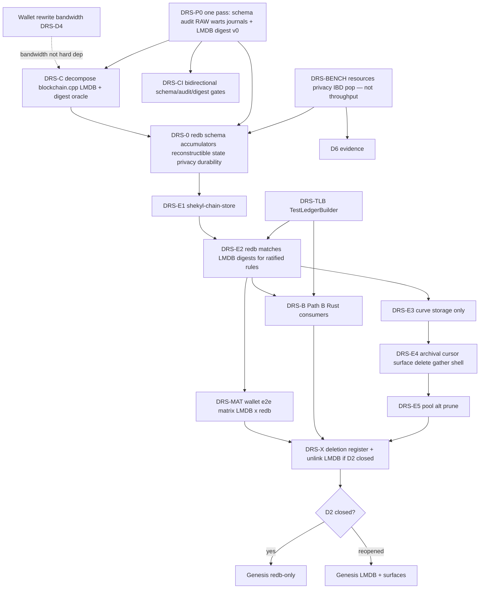

# Daemon chain store — redb at genesis (Path B)

**Status:** Design **open for execution of DRS-P0 / DRS-BENCH / DRS-C** after
Round-1 (**DRS-R-1…R-19**), Round-2 (**R2-1…R2-8**, **E-1…E-8**), a
**gap-close pass** (success criteria, surface map, concurrency, P0 multi-PR,
D2-reopen as first-class good, D10 mandatory reconstructible, IBD floor
sketch — 2026-07-27), and **post-close pin PC-1** (D2-R1 re-pointed at DRS-C —
2026-08-21, §14). Engine-swap (**DRS-E\***) not started; **DRS-0 blocked
on DRS-P0**. Prior premature “ratified” banner remains withdrawn.
**Mission hierarchy** ([`00-mission`](../../.cursor/rules/00-mission.mdc)):
security/PQC → privacy → longevity. DRS success criteria (§0.1) and BENCH
columns are ordered by that hierarchy, not by engineering elegance.
**Process rule:** [`26-sub-pr-design-discipline.mdc`](../../.cursor/rules/26-sub-pr-design-discipline.mdc).
**Spec-first per** [`05-system-thinking.mdc`](../../.cursor/rules/05-system-thinking.mdc).
**Verification stamp:** Round-2 numbers vs `dev` **`3247fe3b6`**; surface map
from `blockchain.cpp` `m_db->` vocabulary (97 methods).

**Identifier family:** `DRS-*` · **Crate name:** **`shekyl-chain-store`**
(pinned, DRS-R-19).

> **COUNTERMAND 2026-09-01 — read before acting on any decision below.**
> Rick ruled that the inherited C++ is **not a base**: its glitches and
> irregularities are proven bad enough that a complete rewrite gates release.
> This retires **DRS-D5**'s decompose-in-place rationale, empties the three
> **DRS-D2** reopen bridges (they resolve to "ship genesis-on-LMDB", which is
> both unavailable and now unshippable), inverts **DRS-P0c**'s FIX-IN-CPP-FIRST
> default, and demotes the C++ from *trusted* oracle to a differential
> reference **for rules ratified on record only** — which invalidates the
> unhedged "trusted LMDB digest" phrasing in **A2 / D11 / E2**.
> **heed is retired** (no chain data exists, so format compatibility is worth
> zero — DEL-007). **DRS-D4 is substantially discharged** (wallet ~90%).
> **Ruled 2026-09-01 and applied in this document:** **CSR-3** (the oracle
> clause is propagated into A2 / D11 / E2 — the digest is an oracle for the
> census's bucket-1/2 rules and a *regression* instrument for bucket-3/4) and
> **CSR-4** (DRS-C is **analysis-only**; §3.5's PR shape amended). **CSR-1** and
> **CSR-2** are ruled and recorded in the reconciliation; **CSR-5** is ruled in
> direction only, with no queue slot fixed.
> Blast radius, the row-level census map, and the work items are in
> [`CONSENSUS_STORE_RECONCILIATION.md`](CONSENSUS_STORE_RECONCILIATION.md)
> (`CSR-*`). Individual decision cells below are **not** rewritten in place —
> the countermand is recorded once, here and in §15, per rule 95.

> **Cross-reference (CSR-6).** This program shares its subject files with the
> all-Rust consensus rewrite: [`CONSENSUS_RULE_CENSUS.md`](CONSENSUS_RULE_CENSUS.md)
> (`CEN-*`) enumerates **171** consensus rules, **18** of which are enforced
> inside `src/blockchain_db/` — the store DRS-E1 replaces. Its **§10 R8
> batch ("storage-layer enforcement placement")** is the same decision as this
> document's schema/surface design, and **R8 is the ruling instrument**
> (CSR-1); §3.5's surface map is its input, not a competing authority.

### Substrate inventory (code-anchored)

| Fact | Measurement |
| --- | --- |
| Live `MDB_dbi` table handles in `db_lmdb.h` | **46** (1:1 with opens) |
| `lmdb_db_open(` **call** sites (macro path) | **46** — the 47th `rg` hit is the **function definition** at `db_lmdb.cpp:328`, not an open (R2-3) |
| `docs/LMDB_SCHEMA.md` claimed total | **41** — **stale** |
| Tables in code, **0 hits** in schema doc (**seven**) | `block_burn`, `archival_budget`, `archival_budget_accrual`, `archival_bond_unbond_log`, `archival_bond_rebond_log`, `archival_bond_holdings_update_log`, **`archival_emission_claim_log`** |
| Phantom tables in schema/audit | `staker_accrual`, `staker_claims` — **0** hits in `db_lmdb.{h,cpp}` |
| `m_db->` sites / distinct methods | **253** in `blockchain.cpp`; **97** distinct methods (same 97 across all files — no extra methods outside that vocabulary) |
| Atomicity audit | 183 lines, April 2026; **0** archival hits vs **702** in `db_lmdb.cpp` |
| Hardfork pop | `HardFork::on_block_popped` **reads** `get_hard_fork_version(height)` for heights **above** new tip (`hardfork.cpp:286–302`); interface has **set/get only**, no delete (`blockchain_db.h:1938,1947`) |

### Oracles of record — status

| Document | Status |
| --- | --- |
| [`docs/LMDB_SCHEMA.md`](../LMDB_SCHEMA.md) | **STALE** — not a DRS-0 input until DRS-P0 |
| [`docs/LMDB_WRITE_ATOMICITY_AUDIT.md`](../LMDB_WRITE_ATOMICITY_AUDIT.md) | **STALE** — PASS over superseded write set |
| `db_lmdb.{h,cpp}` | **Authoritative** table inventory until re-census |
| Early **logical state digest** (E-1) | **To be built** in DRS-P0/DRS-C against LMDB — not first in DRS-E2 |

**DRS-0 is blocked** until **DRS-P0** lands.

---

## 0. Problem statement

Durable state lives in C++ LMDB (~**46** tables). Orchestration tangle is
**`blockchain.cpp`** (253 `m_db->`, 97 methods), not the storage class alone.
Policy math increasingly lives in Rust. Cross-language gather/FFI/store is a
**boundary-thickness and type-safety** problem under
[`40-ffi-discipline`](../../.cursor/rules/40-ffi-discipline.mdc) — marshal
*cost* is unmeasured and **must not** load-bearing-justify Path B (R2-4 / R-14).

**Program:** re-census LMDB truth **and** build a layout-independent **state
digest against LMDB** → decompose `blockchain.cpp` with that digest as oracle
→ redb-native `shekyl-chain-store` behind stable surfaces → redb-only genesis
**or** first-class genesis-on-LMDB under DRS-D2 reopen (§1.2, §1.5) with the
quality program already landed.

### 0.1 Success criteria — “Shekyl is better when …”

Ordered by [`00-mission`](../../.cursor/rules/00-mission.mdc). **Engine-
agnostic first** (Tier A). redb-only genesis is Tier B. Meeting Tier A under
**D2-reopen is a successful genesis outcome**, not a scar (§1.5).

#### Tier A — quality program (required for *any* honest genesis path)

| # | Shekyl is better when … | Mission | Lands by |
| --- | --- | --- | --- |
| **A1** | Archival **pop-reversal journals** have an atomicity/pop-symmetry audit (and S0/S1 findings fixed or decision-logged) | Security | DRS-P0 |
| **A2** | A **layout-independent logical state digest** exists against production LMDB and is used as a regression oracle — **for rules ratified on record only** (CSR-3); over a bucket-3/4 census row a digest match proves fidelity to the C++'s *behavior*, defects included, and must be reported as that | Security | DRS-P0 → C |
| **A3** | Known durable-state **warts** are call-graph-traced; default **FIX-IN-CPP-FIRST** (e.g. hardfork pop / `hf_versions`) closed or explicitly REPLICATE | Security | DRS-P0 / C |
| **A4** | Consensus store **durability is explicit** (strict fsync policy) and crash-tested — not library default by omission | Security | DRS-D9 (+ E\* or LMDB config path) |
| **A5** | **Resource bounds** under attacker-shaped load are measured: file growth, long-lived readers, peak RSS | Security → Privacy | DRS-BENCH |
| **A6** | **IBD wall time** meets the §1.3 floor (full-node viability → density → remote-node privacy) | Privacy | DRS-BENCH / DRS-0 |
| **A7** | **Cross-store leaf/position KAT** green (daemon encodings == wallet LeafStore) | Security (spendability) + Privacy (no “debug with remote node” pressure from broken local spend) | DRS-D3c |
| **A8** | Substrate docs cannot drift: bidirectional CI on schema ↔ `MDB_dbi` ↔ atomicity audit | Longevity | DRS-CI |
| **A9** | `blockchain.cpp` DB use is partitioned into **named validation surfaces** (§3.5) with digest-stable extractions as far as C progresses | Longevity | DRS-C |
| **A10** | **Derived state is reconstructible** from the local block corpus (mandatory for D2-closed; strongly preferred under reopen) | Longevity + Security (recovery) | DRS-D10 |

#### Tier B — pure-Rust / Path B (preferred under D2-closed; not required for “better”)

| # | Shekyl is better when … | Mission |
| --- | --- | --- |
| **B1** | Policy + persistence for connect paths share one language (no permanent gather/FFI/put façade) | Longevity (rule 40) + Security (layout-drift class) |
| **B2** | Production `shekyld` has **no C LMDB** in-process (residual risk shifts to audited Rust store + supply-chain governance) | Security (memory-safety class) / Longevity |
| **B3** | Commit-consuming write API makes forget-to-commit **unrepresentable** | Security + Privacy (txpool/Dandelion++ class) |

**Anti-criteria (not “better”):** faster ops/sec than LMDB; redb for prestige;
engine swap without A1–A3.

---

## 1. Binding decisions

| ID | Decision | Rationale |
| --- | --- | --- |
| **DRS-D1** | **Path B destination.** Rust owns store + connect consumers long-term. No permanent C FFI `BlockchainDB` façade over redb. | A permanent façade **thickens** the FFI boundary and freezes dual-language types — forbidden posture under rule 40. *(No marshal-perf claim — R2-4.)* |
| **DRS-D2** | **Preferred genesis: redb-only** production `shekyld`. | Tier B hosting. **Reopen §1.2** is a **first-class good path** when Tier A is met (§1.5) — not a scar. |
| **DRS-D3** | Daemon store ≠ wallet `LeafStore` — **schemas, tables, txn models, durability, APIs, and crates deliberately separate.** | **Opposed threat models** (§1.4) — not “overhead.” Unification forces the union of constraints on both stores. |
| **DRS-D3b** | **Shared layer = encodings + tree arithmetic only** (`shekyl-fcmp`, `shekyl-wire`, related pure crates). Daemon curve grow/trim/drain **hosts storage only** and **must not** reimplement leaf codecs, tree-position maps, or hash arithmetic. | Daemon produces roots; wallet reconstructs paths. Drift presents as “wallet can’t spend,” not a storage bug (§1.4). |
| **DRS-D3c** | **Cross-store KAT corpus** is mandatory: given output index *N* on a fixture chain, daemon tree position + leaf bytes **byte-equal** wallet LeafStore. Both stores run it. | Price of non-unification; makes separate schemas *safe* rather than merely separate. |
| **DRS-D3d** | **No shared `redb-helpers` crate** (or equivalent dependency edge). Idioms (schema_version cell, commit-consuming txn, error taxonomy) are a **written pattern** each store implements. | Shared helpers are the unification vector: start as `open_or_create`, end as shared codecs. Rhyme by convention, not by dep. |
| **DRS-D4** | Wallet rewrite owns **reviewer/decision-maker bandwidth** first. | **Not** a technical “C++ cannot move until wallet Phase N.” **DRS-P0, DRS-BENCH, and DRS-C may proceed** when bandwidth allows; engine-swap (DRS-E*) stays behind wallet priority. Stated constraint = **reviewer bandwidth**, mitigable by surface-at-a-time PRs (E-5). |
| **DRS-D5** | **Decompose first (C++ / LMDB), engine swap second.** | One variable at a time (R-4). **Rationale retired 2026-09-01** by the countermand; the mechanism survives as analysis only (CSR-4) — the decomposition is a scoping cut for the rewrite, not a sequence of shipped C++ PRs. |
| **DRS-D6** | **Engine preference = redb, not heed** until **DRS-BENCH** says otherwise. | Pure Rust preference. Genesis-load-bearing only after **§7.4 resource/privacy measures** + IBD floor — **not** raw ops/sec vs LMDB. |
| **DRS-D7** | LMDB logical oracle / dual-backend **shadow** only during engine-swap. | One authoritative writer per env. |
| **DRS-D8** | Schema **redb-native** at engine swap; **divergence register** with FIX-IN-CPP-FIRST default. | §6.4. |
| **DRS-D9** | Consensus store uses the **strictest practical durability** (full fsync / equivalent per block commit). | Steady-state commits are **block-cadence network-bound**; write set finishes in ms against a budget measured in minutes. A 10× engine difference is invisible; **strict fsync has no measurable steady-state cost** — security decision with no efficiency reopen (§5.2). Not inherited from LeafStore silence. |
| **DRS-D10** | **Reconstructible derived state is mandatory for D2-closed genesis.** All non-block-corpus tables must be rebuildable by replaying local blocks through `apply_block`. Under D2-reopen, still **strongly preferred** and required before any later redb cutover. | Longevity + security recovery (E-6). Soft “preferred” language removed for the redb path — without this, format migration and crash recovery re-inherit debt. |
| **DRS-D11** | **Logical state digest** is a first-class artifact, built **against LMDB** in P0/C (E-1). | Oracle for DRS-C; input definition for DRS-D8; harness exercised before redb. **Scope (CSR-3):** oracle for the census's bucket-1/2 rules; for bucket-3/4 rows it is a **regression** instrument, not a correctness one — the C++ is a differential reference only for rules ratified on record. |

### 1.1 Schedule honesty

Genesis under D2-closed = full DRS-E\* (Tier A+B). The wallet rewrite is no
longer on this path: Phase 5 closed 2026-08-19 (#507, `a9dc5e4db` —
`src/wallet/` deleted), so the chain store is the long pole of the daemon
cutover, not a co-runner behind the wallet. Under D2-reopen = **Tier A on
LMDB** is the genesis product; redb is non-blocking post-genesis. DRS-C is
unparked technically so D2-R2’s clock can start when C closes; D2-R1 is the
calendar backstop for the case where C never starts that clock.

### 1.2 DRS-D2 reopen criteria

**Default preference:** genesis production binary is redb-only (Tier B).

| ID | Trigger | Bridge (**concrete**) |
| --- | --- | --- |
| **D2-R1** | **DRS-C** not closed by **2027-04-01** — *re-pointed 2026-08-21 (PC-1)*: the original trigger, “wallet rewrite Phase 5 not closed by 2027-04-01”, can no longer fire (Phase 5 closed 2026-08-19, #507) | **Ship genesis-on-LMDB** with Tier A as far as landed (minimum A1–A2–A8; A9 as C progressed). DRS-E\* post-genesis. |
| **D2-R2** | **DRS-C closed**, but **DRS-E2** not green within **6 months** of C close | Same: genesis-on-LMDB + Tier A; E\* post-genesis |
| **D2-R3** | **DRS-BENCH** fails §1.3 IBD floor (or resource DoS bounds) after one mitigation cycle | Reopen D6 / stay LMDB; Tier A still required |

Reopen = decision-log + index update. Never silent.

**Why R1 was re-pointed, not retired (PC-1).** R2 is a *relative* clock that
starts only when DRS-C closes; R3 is a BENCH outcome that exists only once
DRS-E\* runs. Neither fires if C is never opened or never closes. Retiring R1
without a replacement would have left D2 with no calendar-anchored exit — the
reopen-by-subtraction shape R2-8 already rejected — so the trigger moved to
the item that is now the long pole, with the same date and the same bridge.
The date is the genesis-schedule backstop, not a wallet-specific estimate,
and is unchanged.

### 1.5 D2-reopen is a first-class good path

Under one decision-maker, **Tier A + LMDB at genesis** may be the *rational*
outcome. The project **must not** thrash to finish redb for optics.

| | D2-closed | D2-reopened |
| --- | --- | --- |
| **Status language** | “redb-only genesis” | “**Tier-A LMDB genesis** — quality program complete; pure-Rust store deferred” |
| **Success** | A1–A10 + B1–B3 | A1–A8 (and A9–A10 as far as landed); B\* open post-genesis |
| **Shame?** | No | **No** — meeting §0.1 Tier A is the point of the program |

Index and CHANGELOG use the Tier-A framing when reopen fires.

### 1.3 DRS-D6 evidence / IBD floor (sketch)

1. **DRS-BENCH** (§7.4): resource / privacy / DoS / IBD / pop — **not**
   throughput-vs-LMDB.
2. **IBD floor (initial sketch — refine with first in-tree baseline, do not
   invent fake precision):**

| Parameter | Initial pin | Notes |
| --- | --- | --- |
| **Reference height** | **H = 100_000** synthetic or regtest-equivalent full-validation blocks (or max available fixture; raise only with BENCH plan amend) | Large enough for bulk-load shape; small enough for CI optional nightly |
| **Hardware class** | Single mid-range x86_64 workstation/server class used for project CI self-host notes; document CPU model, RAM, disk type (NVMe vs HDD) **in the artifact** | Cross-machine absolute times are not load-bearing; **ratios** are |
| **Primary metric** | Wall time IBD to H under **same** consensus verify cost as production (FCMP++ + PoW verify enabled as in real sync) | Privacy chain: slower IBD → fewer full nodes → more remote-node use |
| **Floor (relative)** | redb (or candidate) IBD wall time ≤ **1.25×** LMDB wall time on the **same** machine, same binary flags except engine, same durability policy as production intent (DRS-D9) | Absolute “N hours” deferred until first LMDB baseline lands in-tree |
| **Hard fail (D2-R3 / D6)** | Ratio **> 1.50×** after one documented mitigation cycle, **or** fails resource bounds (§7.4) | Between 1.25× and 1.50×: decision-log accept or mitigate |
| **Resource bounds (sketch)** | Peak RSS under attacker-feed scenario ≤ **2×** LMDB peak on same scenario; file-size / logical-size ratio after simulated year of 2-minute blocks stays within plan-stated ceiling (set after first multi-year sim) | Security/privacy > speed |

3. Artifacts must record **durability configuration**. Unlabeled redb numbers
   are not genesis-load-bearing (no redb benches on `dev` at Round-2 stamp).

Marshal-tax remains qualitative; Path B stands on rule 40.

### 1.4 Non-unification (DRS-D3) — load-bearing rationale

**Do not** defend DRS-D3 with “overhead” or “less code.” Efficiency loses to
“think how much less code” under fatigue. The binding reason is **opposed
threat models**:

| Store | Input / custody | Hard requirement |
| --- | --- | --- |
| **Daemon** (`shekyl-chain-store`) | Consensus state derived from **adversarial network** input | Bounded, correct behavior under attacker-chosen data |
| **Wallet LeafStore** | Lives in a process that handles **secret key material**; deliberately **public-material-only** with no Zeroize obligation on the leaf cache (`rust/Cargo.toml` workspace notes on CT-1 redb) | Local disk compromise yields nothing *from this cache’s charter*; secrets stay out of it |

**Unify** and you either:

- drag **secure-memory discipline** onto a store that does not need it, or  
- put the wallet’s **deliberately public** cache adjacent to secret-handling
  code and shared decision weight,

Both **widen** constraints; neither simplifies.

**Further reasons that survive “but less code”:**

| Reason | Effect of unification |
| --- | --- |
| **Failure semantics** | Daemon store loss → resync (network-recoverable). Wallet store loss can be **fund-visible**. Different durability, backup, migration. Shared schema version couples wallet file-format bumps to daemon resync events and vice versa within a year. |
| **Deployment topology** | Remote-daemon wallet is first-class and privacy-relevant. Shared schema breeds assumptions that only hold when both stores are local. |
| **Review surface** | Daemon consensus requirements would dominate every shared decision; wallet inherits weight it does not need. Surface **moves**, not shrinks. |

#### Three layers (not two)

| Layer | Rule |
| --- | --- |
| **Encodings + tree arithmetic** | **Shared, single source** — `shekyl-fcmp`, `shekyl-wire` (leaf 128-byte layout, tree-position / output-index mapping semantics, hash/grow). DRS-D3b covers **codecs**, not only “call the math functions.” |
| **Storage schemas, tables, txn models, durability** | **Deliberately separate** (DRS-D3) |
| **APIs / crates** | **Deliberately separate** (DRS-D3); **no** shared redb-helpers dependency (DRS-D3d) |

#### Price of non-unification (DRS-D3c)

One **cross-store KAT corpus**: fixture chain → for output index *N*, daemon
store’s tree position and leaf bytes **equal** wallet LeafStore’s, byte for
byte. Both stores execute the corpus. That test is what makes separate
schemas **safe**. Without it, dual stores can drift where a unified store
cannot — and the failure mode is “wallet can’t spend.”

---

## 2. Goals and non-goals

### 2.1 Goals

1. Truthful LMDB docs + **bidirectional CI parity gates** (E-3).
2. **Layout-independent logical state digest** against LMDB (E-1).
3. Decomposed surfaces (`blockchain.cpp`) with digest-identical refactors.
4. redb `shekyl-chain-store` behind surfaces; total coverage digests at
   **linear** cost (§6.2).
5. Privacy / durability / supply-chain governance for consensus storage.
6. **Reconstructible derived state** from local block corpus (E-6).
7. **Cross-store leaf/position KAT** green (DRS-D3c).
8. Deletion register empty under D2-closed genesis path.

### 2.2 Non-goals

| Non-goal | Why |
| --- | --- |
| **Match pure C++ LMDB throughput / ops/sec** | Steady-state is network-bound at block cadence; 10× engine gap is invisible. **Retired from DRS-BENCH** (§7.4). |
| `data.mdb` compatibility | Pre-genesis |
| Unify LeafStore / shared redb-helpers crate | DRS-D3 / D3d — threat model, not LOC |
| Permanent FFI DB façade | DRS-D1 |
| Port archival math | Already retention crate |
| 1:1 rehost of archival marshal shell | E-7: delete marshal; cursor surface |

---

## 3. Target architecture

### 3.1 Today

`blockchain.cpp` (97 DB methods) → `BlockchainLMDB` (46 tables) + FFI gather shells.

### 3.2 After DRS-C (+ LMDB digest)

Named validation surfaces; LMDB backend; **state digest** byte-identical across
extractions.

### 3.3 After DRS-E

Same surfaces → `shekyl-chain-store`; optional dual-backend **matrix** for
wallet e2e (E-8).

### 3.4 Rules

1. God object = **orchestration**, not row count in LMDB.
2. DRS-C + DRS-B dominate calendar risk; store is mechanical relative to that.
3. Archival (DRS-E4): **design typed cursors for retention; delete gather shell**
   — not “rehost ~3k / 77 methods” (E-7).
4. Curve: **storage only**; encodings + arithmetic single-sourced (DRS-D3b);
   cross-store KAT (DRS-D3c).

### 3.5 DRS-C draft surface map (97 methods from `blockchain.cpp`)

**Draft partition** — rule 19 validation surfaces. Method lists are the full
`m_db->` vocabulary (97 names); assignment is **initial** and refined when C
PRs open. “Owner at genesis” is intent, not a promise that B finishes pre-
launch under D2-reopen.

| Surface ID | Role | Methods (count) | C extraction order | Path B / genesis note |
| --- | --- | --- | --- | --- |
| **S-TXN** | Batch / open / sync / locks | `batch_*`, `close`, `reset`, `sync`, `safesyncmode`, `is_read_only`, `m_synchronization_lock`, `fixup` (10) | First (every other surface depends) | Stay with store backend |
| **S-CHAIN-W** | Connect/pop write set | `add_block`, `pop_block`, `correct_block_cumulative_difficulties`, `add_block_burn`, `remove_block_burn`, `set_hard_fork`, `set_total_burned`, `set_settlement_epoch_blocks_pin` (8) | Early — heart of connect | Long-term Rust `apply_block`/`pop_block` |
| **S-CHAIN-R** | Tip / headers / weights / burns | `height`, `top_block_hash`, `get_top_block*`, `block_exists`, `get_block*`, `get_block_*`, `for_blocks_range`, `get_blocks_from`, `get_total_burned`, `get_block_burn`, `get_settlement_epoch_blocks_pin` (24) | With or after S-CHAIN-W | Hot RPC path |
| **S-TX** | Tx blob / existence | `tx_exists`, `get_tx_blob`, `get_pruned_tx_blob`, `get_prunable_*`, `get_tx_count`, `get_tx_unlock_time`, `get_tx_amount_output_indices`, `for_all_transactions` (9) | Mid | |
| **S-OUT-KI** | Outputs + key images | `has_key_image(s)`, `for_all_key_images`, `get_output_*`, `for_all_outputs`, `can_thread_bulk_indices` (9) | Mid — consensus critical | |
| **S-CURVE** | Curve tree reads (writes live in add_block path today) | `get_curve_tree_root`, `get_curve_tree_root_at_height`, `get_curve_tree_depth`, `get_curve_tree_leaf_chunk` (4) | After chain | Storage only; math in fcmp |
| **S-ARCH** | Archival reads/writes used from `blockchain.cpp` | `archival_bond_*`, `archival_shard_*`, `get_archival_*`, `has/set_archival_serve_credit_bit`, `gather_archival_emission_epoch_snapshot` (14) | After journal audit (P0) | Cursor surface for retention (E4) |
| **S-POOL** | Tx pool | `add_txpool_tx`, `update_txpool_tx`, `remove_txpool_tx`, `get_txpool_*`, `for_all_txpool_txes`, `txpool_tx_matches_category` (8) | Can parallelize | Privacy-sensitive (Dandelion++) |
| **S-ALT** | Alt chain | `add_alt_block`, `get_alt_block*`, `remove_alt_block`, `drop_alt_blocks`, `for_all_alt_blocks` (6) | Later | |
| **S-PRUNE** | Pruning | `prune_*`, `check_pruning`, `update_pruning`, `get_blockchain_pruning_seed`, related (≤8) | Later | Bootstrap/prune tools |

**Not in the 97 but adjacent:** full archival *drivers* still inside
`BlockchainLMDB` (process_archival_*, apply_archival_*) — extracted toward
**S-ARCH** during C/E4; they are part of the god-object storage class, not
only `blockchain.cpp`.

**DRS-C PR shape — amended 2026-09-01 (CSR-4 ruled: analysis-only).** DRS-C does
**not** ship as C++ refactor PRs. Rule 20 and
[`15-deletion-and-debt`](../../.cursor/rules/15-deletion-and-debt.mdc) both
refuse review bandwidth spent improving a file scheduled for wholesale
replacement, and P0c's RECORD-AND-SPECIFY inversion already commits to that
logic. The surface partition is retained as the **scoping and review unit for
the Rust rewrite** — one surface per rewrite increment, digest identity checked
per §6 and CSR-3's bucket scope. (Superseded: "one surface (or S-TXN+one) per
PR; digest identity before/after; no engine change.")

### 3.6 Writer / reader concurrency (process model)

Applies to **both** LMDB today and redb after E\*. Mission: security (DoS)
and privacy (node liveness → density).

| Rule | Specification |
| --- | --- |
| **Single writer** | At most one apply/pop (or batch) write transaction at a time. P2P block ingest, RPC that mutates pool, and maintenance share a **writer queue** (or equivalent mutex + ordered wakeups). No “optimistic” second writer. |
| **Apply owns the critical path** | Under backlog, **block connect/pop preempts** non-essential writes (pool relay timestamp updates may batch/coalesce — must not starve apply). |
| **Readers** | Unlimited concurrent read txns in principle; **RPC must not hold read txns across network waits**. Read txn lifetime ≤ request handler scope (hard guideline). Long-lived reads (export, debug) are **admin-only** or explicitly rate-limited. |
| **DoS: long-lived readers** | Attacker-influenceable RPC must not pin free pages indefinitely. Mitigations (pick in DRS-0 / implement in C or E1): max read-txn wall time; max concurrent heavy reads; reject/export-only paths for full scans. BENCH measures file growth under adversarial concurrent readers. |
| **redb-specific** | redb self-managed cache → peak RSS under attacker feed is a **hard BENCH bound** (§1.3). Writer still single; no multi-process multi-writer on one file. |
| **Multi-process** | Default `shekyld` = one process, one store file, one writer. Remote wallet talks **RPC**, never opens daemon redb. (D3 topology.) |
| **Shadow / dual backend** | Second engine is a **separate file**; never two writers on one LMDB env (V4). Shadow apply may lag; production authority is one backend. |

P2P and levin remain C++ at genesis under D2-reopen without requiring B;
they must still obey the writer queue when calling into surfaces.

---

## 4. Engine choice — provisional

Preference redb (no C LMDB under the API). **DRS-BENCH** (§7.4) before
genesis-load-bearing D6. Supply-chain: see §10 (R2-5: lockfile already pins
4.1.0; real gaps are VENDORED/AUDIT/CVE/procedure, not caret panic).

**Steady-state path:** at block cadence the write set is small enough that
every candidate engine finishes in single-digit milliseconds against a budget
measured in minutes. Anyone arguing **raw ops/sec** for that path optimizes a
rounding error. That **narrows** the spec (drop throughput column), not a
rebuttal of redb.

---

## 5. Privacy, durability, IBD, resources

### 5.1 Privacy / security hard findings (DRS-0 / P0)

| Surface | Concern |
| --- | --- |
| Freed-page / COW residue | Forensic recovery of txpool / Dandelion++ timing state differs by engine |
| File growth over multi-year small commits | Operator cost → node density → network privacy |
| Long-lived concurrent readers | RPC readers are attacker-influenceable; pin free pages → unbounded growth / memory pressure — severity depends on engine reclamation |
| Peak RSS under attacker-shaped input | LMDB → OS page cache (evictable); redb self-managed cache — different DoS / partition profile |
| IBD wall time | Privacy chain only (R-15) — not vanity perf |
| Pop/reorg wall time | Off-chain window; COW delete churn + five archival revert journals |

### 5.2 Durability (DRS-D9) — no security-vs-speed tradeoff

Because steady-state commits are **rare and network-paced**, the strictest
durability setting is **free** at the only cadence that runs forever. There is
**no efficiency case** to trade against full fsync per block commit.

**Rationale to freeze:** do not reopen DRS-D9 later “to go faster” without
overturning the network-bound argument with measurement of **IBD/pop/resource**
columns only — never steady-state ops/sec.

Tests: `kill -9` mid-commit; fault injection; recovery via reconstructible
replay (E-6).

### 5.3 Where “network-bound” does **not** apply

| Path | Why measure separately |
| --- | --- |
| **IBD** | Not network-paced vs fast/LAN peer; saturates disk/CPU. LMDB batches + `MDB_APPEND` (~10 sites) is bulk-load optimized; redb COW insert has no direct equivalent. FCMP++ verify may still dominate — **measure**, don’t deduce. |
| **Deep pop** | Unwinds as fast as possible off-chain; deletes/journals may churn more than apply |
| **Resource bounds** | File growth, reader pinning, peak RSS — **security/privacy**, above speed in mission order |

---

## 6. Logical state digest and oracle design

### 6.1 When and against what (E-1 — highest leverage)

| Phase | Digest role |
| --- | --- |
| **DRS-P0 / DRS-C** | Build digest **against LMDB**. Oracle for decomposition: byte-identical before/after each extraction. Discovers “canonical logical state” definition DRS-D8 re-encodes. |
| **DRS-E2** | Same harness already exercised; redb must match LMDB digests **for ratified rules** (CSR-3). First use is **not** validating an unexercised harness against a new engine. A match on a bucket-3/4 row records behavioral parity with an implementation ruled defective — never correctness. |

No existing `state_hash` / `db_digest` in tree — greenfield; **when** is the
variable, not **whether**.

### 6.2 Totality at linear cost (R2-6)

Naive full-scan-per-block + reopen is **O(n²)** and will be weakened under
pressure. **DRS-0 freezes accumulator design** (constrains codecs):

| Table class | Digest mechanism |
| --- | --- |
| **Set-shaped** (`spent_keys`, `output_txs`, `block_heights`, `tx_indices`, …) | Order-independent incremental accumulator (XOR or additive field hash of per-element canonical encodings); update on insert, reverse on delete; **pop-symmetric by construction** |
| **Append-mostly** (`blocks`, `txs_*`, `curve_tree_leaves`, …) | Running chained hash |
| **Small** (`properties`, `curve_tree_meta`, `hf_versions`, archival journals, …) | Full-domain digest every block (cheap) |
| **Torn-commit / durability visibility** | **Reopen + full-domain reconciliation** of incremental accumulators at **declared checkpoint heights**, not every block |

Total coverage = every table in inventory contributes to some accumulator or
named exclusion. **No silent sampling.**

### 6.3 Independence

- Canonicalization path **independent** of `apply_block` writer helpers.
- Checkpoint verification = post-commit **reopen** reads.

### 6.4 Divergence register (R2-1, R2-2)

**Produced during DRS-P0** (wart list is a P0 output). Columns:

| Column | Requirement |
| --- | --- |
| Wart ID | Stable name |
| **Evidence** | **Traced reader/writer set** (call-graph: who reads/writes; file:line). **Not** “audit said Low.” |
| Class | See below |
| Artifacts | Per class |

**Classes (default first):**

| Class | Meaning | Artifacts |
| --- | --- | --- |
| **FIX-IN-CPP-FIRST** (**default**) | Fix under LMDB in P0/C; existing suite (+ digest) validates; **no** divergence when digests compare engines | Fix commit; register row **Closed** before harness depends on it |
| **REPLICATE** | Must match C++ including wart (only if FIX impossible without unacceptable pre-cutover churn) | Digest includes warted semantics; KAT |
| **DIVERGE-INTENTIONALLY** | Intentional semantic change at engine swap | Named digest exclusion + **replacement KAT**; weakens total coverage — **reserve** |

**Seed row — `hf_versions` / pop (R2-1):**

| Field | Content |
| --- | --- |
| Evidence | **Writers:** `set_hard_fork_version` on connect. **Readers on pop:** `HardFork::on_block_popped` (`hardfork.cpp:286–302`) calls `db.get_hard_fork_version(height)` for `height` in `[new_tip, old_tip)`. **No delete** on `BlockchainDB` API. Stale rows are **load-bearing** for in-memory hardfork reconstruction after reorg — **not** cosmetic residue. Stale audit “Low (cosmetic)” is **false**. |
| Class | **FIX-IN-CPP-FIRST** (default proposal) — decide correct semantics (e.g. maintain hardfork state without tip-above reads, *or* document and keep read-back with explicit journal) **in C++ under LMDB** this quarter; close row before redb. |
| Forbidden | Classifying **DIVERGE** + “Rust deletes row” + KAT asserts delete — **ships a hardfork-state regression** after every reorg. |

Independently: tip-above reconstruction under deep reorg is a **pre-genesis
hardfork design question** on its own merits.

Every other wart: **call-graph or it didn’t happen** before classification.

### 6.5 Genesis evidence (R-12)

Affirmative archived digest runs (heights, commit, artifact). **No**
“LMDB deleted ⇒ gate green.”

### 6.6 Read-after-write dependency set

Complete RAW edge enumeration is a **DRS-P0 output** (same pass as inventory).
Seeds to re-verify: multi-claim pool balance; drain-then-grow. Journals
expected to add more.

---

## 7. Work breakdown

| ID | Deliverable | May start | Notes |
| --- | --- | --- | --- |
| **DRS-BENCH** | Resource/privacy/IBD/pop suite (§7.4); halt conditions; durability config in artifact | **Now** | No schema/crate needed. **Not** throughput-vs-LMDB. Edges → DRS-0, D6. |
| **DRS-D3c** | Cross-store leaf/position KAT corpus | With E3 / LeafStore | Both stores; fixture chain |
| **DRS-P0** | **One pass, four (+digest) outputs** — see §7.1 | **Now** | Blocks DRS-0. Independent value. Escalation ladder §7.2. |
| **DRS-CI** | Bidirectional inventory gates (§9) | With P0 | Makes R-1 class unrepresentable (E-3). |
| **DRS-TLB** | TestLedgerBuilder design+impl | Standalone | Critical path E2/B. |
| **DRS-C** | Decompose `blockchain.cpp`; digest-identical extractions | When **bandwidth** allows | Unparked technically (E-5). Starts D2-R2 clock on close. |
| **DRS-0** | redb map from censused inventory; accumulators (R2-6); reconstructible-derived-state (E-6); privacy; durability; IBD floor; format policy | After P0; informed by BENCH | |
| **DRS-E1…E5** | Store, digests-on-redb, curve storage, archival **cursor/delete-shell**, pool/utils | After 0 + C preferred | E4 ≠ 1:1 rehost (E-7) |
| **DRS-MAT** | Wallet Phase 6a / Track-2 as **LMDB×redb CI matrix** from first redb read path | During shadow | Continuous discharge (E-8), not a late phase |
| **DRS-B** | Path B consumers | After C + E* | |
| **DRS-X** | Empty deletion register; D2-closed or reopen path | End | |

### 7.1 DRS-P0 — multi-PR envelope (honest “one audit pass”)

**Intent:** one *intellectual* pass over `db_lmdb.{h,cpp}` + call graphs +
`blockchain_db.cpp` pop/connect hooks.
**Delivery:** **not** one mega-PR. Envelope:

| PR | ID | Deliverable | Blocks |
| --- | --- | --- | --- |
| **P0a** | Inventory + CI | Accurate `LMDB_SCHEMA.md` (46 tables, **seven** adds, drop phantoms); **DRS-CI** bidirectional gates | Mental model |
| **P0b** | Atomicity + journals + RAW + **transcriptions** | Rewrite audit for all tables + journals; **RAW edges**; CI every `MDB_dbi` in audit. **Transcribe (not invent):** (A-2) **height-base per journal** (hook height vs block-index *N*); (A-4) **revert partial-order table** (journal × fields × predecessors × reason) from `pop_block` comments; (A-6) note in-code `m_write_txn` assertions + error-type inconsistency | Apply/pop design; E2 pop_block |
| **P0c** | Wart register + **cheap FIX-IN-CPP** | Call-graph warts. Concrete rows: (A-1) pure-virtual archival apply/revert hooks + explicit `BaseTestDB` stubs; (A-3) journal `TreePosition` in drain; (A-5) dense-seq → range scan; `hf_versions` FIX or REPLICATE. **Ship on a short-lived branch off `dev`, not on `dev` directly.** | Silent-failure classes removed pre-redb |
| **P0d** | Digest v0 | Core chain + spent keys + curve root **minimum**; **must expand archival journals before S-ARCH / DRS-E archival port** (A-1 composes with blind min oracle — see §7.1.1) | C oracle; logical-state definition |
| **P0e** | Digest totality | Full table inventory / named exclusions | E2 |

**“DRS-0 blocked on P0”** = **P0a–P0d** (P0e may trail with named exclusions).

#### 7.1.1 Digest coverage gate (A-1 composition)

P0d’s *minimum* deliberately excludes archival journals for speed of first
oracle. That is **unsafe as a sole gate for archival surface extraction or
store port**: a backend can omit all apply/revert hooks and still pass core
digests.

**Rule:** do **not** extract/port **S-ARCH** (or implement archival apply in
`shekyl-chain-store`) until digest coverage includes the archival journal
families (or an explicit, named exclusion with a **replacement KAT** that
forces apply/revert to run). Pure-virtual hooks (A-1) force *someone* to
implement or stub explicitly; digests must still *see* production LMDB
behavior for those paths before claiming parity.

Pop-reversal atomicity is FCMP++ Phase-4 load-bearing.

### 7.2 DRS-P0 bug-escalation ladder (E-2)

| Severity | Example | Rule |
| --- | --- | --- |
| **S0 — fund-safety / consensus split under reorg** | Journal pop leaves inconsistent bond/emission/slash state | **Preempts wallet execution priority** until fixed or explicitly risk-accepted in decision log |
| **S1 — consensus correctness non-reorg path** | Connect-time invariant break | Blocks DRS-0; fix or accept before engine work |
| **S2 — privacy-only storage** | Uncommitted relay timestamps class | Fix in-tree; does not auto-preempt wallet unless decision-maker elevates |
| **S3 — doc/phantom only** | Schema phantoms | Fix in P0 PR |

### 7.3 Cross-program matrix (E-8 / R-6)

Do **not** budget a single late “re-run Phase 6a” phase. From the day
`shekyl-chain-store` can serve reads under shadow: **two-cell CI matrix**
(LMDB | redb) for wallet e2e / Track-2 harness against **RPC contract**, not
storage internals. Gate = matrix green.

### 7.4 DRS-BENCH — what to measure (reframed)

**Throughput vs LMDB: not measured.** Steady-state argument retires that column
as expensive noise. Spec is **narrowed**, not weakened.

| Measure | Why (priority order) |
| --- | --- |
| File size over simulated multi-year commit cadence | Operator cost → node density → network privacy |
| Free-page reclamation under long-lived concurrent readers | Attacker-influenceable growth / DoS |
| Peak RSS under attacker-shaped input | Self-managed cache vs OS page cache; partition adjacency |
| Pop/reorg wall time at stated depths | Off-chain window; archival journals |
| IBD wall time to reference height | The one true wall-time number — **only** via the privacy chain |
| **Throughput vs LMDB** | **Not measured** |

**Reproducibility:** no redb-touching benches on `dev` today
(`rg` over workspace `benches/*.rs` empty for redb/LeafStore;
`shekyl-curve-tree` has no `benches/`). Until artifacts land **in-tree** with
**durability configuration recorded**, no number is genesis-load-bearing.
Comparing default-durability redb to differently-synced LMDB measures the
wrong thing.

Compare engines (redb / heed / LMDB) on the rows above when the suite runs;
halt conditions named in the bench plan (e.g. file-growth slope, RSS ceiling,
IBD floor from DRS-0).

---

## 8. Genesis gate checklists (R2-8 — not subtraction)

### 8.1 DRS-D2 **closed** (redb-only genesis) — Tier A + B

- [ ] **§0.1 A1–A10** all green
- [ ] DRS-P0a–P0d complete (multi-PR envelope §7.1)
- [ ] DRS-C progressed with digest-stable extractions; surface map §3.5 updated
- [ ] Divergence register: no open FIX-IN-CPP-FIRST; no unaudited DIVERGE
- [ ] DRS-BENCH suite green vs §1.3 floors; durability config on artifact
- [ ] DRS-D9 + **DRS-D10 reconstructible derived state implemented** (mandatory)
- [ ] Writer/reader concurrency rules (§3.6) implemented and tested
- [ ] Cross-store KAT (DRS-D3c) green
- [ ] Supply-chain governance (§10) for production redb
- [ ] Affirmative digest artifacts archived (survive LMDB deletion)
- [ ] DRS-MAT green on redb cell
- [ ] Deletion register empty; production `shekyld` does not link liblmdb
- [ ] **§0.1 B1–B3** met (Path B / no permanent façade)

### 8.2 DRS-D2 **reopened** (Tier-A LMDB genesis) — **first-class success**

**Required (do not shame):**

- [ ] **§0.1 A1–A3, A8** minimum (journals, digest, warts, CI)
- [ ] **A4** durability explicit on LMDB production config (safesync / sync
      policy documented and tested)
- [ ] **A5–A6** BENCH baseline recorded (LMDB); floors bind future engines
- [ ] **A7** cross-store KAT green (encoding layer — engine-agnostic)
- [ ] Vendored liblmdb: **CVE + ITS-patch currency current** (mainnet surface)
- [ ] Schema + atomicity audit + RAW = **genesis consensus documentation**
- [ ] Writer/reader rules (§3.6) respected on LMDB path
- [ ] Wallet e2e green on **LMDB** cell
- [ ] Status/index language: “Tier-A LMDB genesis” (§1.5)

**Strongly preferred:**

- [ ] **A9** DRS-C as far as bandwidth allowed
- [ ] **A10** reconstructible tooling even on LMDB

**Deferred without shame:**

- [ ] redb unlink, redb supply-chain, redb digest parity, B1–B3, full D10 on redb

---

## 9. Test strategy and CI gates (E-3)

### 9.1 Bidirectional inventory CI (≈ one script)

Makes DRS-R-1 **structurally unrepresentable**:

1. Every `MDB_dbi` member in `db_lmdb.h` appears in `LMDB_SCHEMA.md`
2. Every table name in `LMDB_SCHEMA.md` exists in `db_lmdb.h` (**catches
   phantoms** — the half that produced `staker_*`)
3. Every `MDB_dbi` appears in `LMDB_WRITE_ATOMICITY_AUDIT.md`
4. After digest exists: every `MDB_dbi` in digest set **or** named exclusion
   row

**Seed count: 46/46** — no phantom 47 (R2-3). Gate must not cry wolf on day one.

### 9.2 Other layers

P0 unit/integration; DRS-C digest identity; crash consistency; privacy lab;
archival journal KATs; DRS-MAT; TLB synthetic FCMP++ chains.

---

## 10. Supply chain (R2-5)

| Item | Status / action |
| --- | --- |
| `Cargo.lock` pin | Already **4.1.0** exact; Guix uses lockfile — build reproducibility OK |
| Caret in `Cargo.toml` | Optional five-minute `=` consistency with `kameo` precedent — **not** a genesis-gate drama |
| **Real gaps** | No `VENDORED_DEPENDENCIES.md` row, no `AUDIT_SCOPE.md`, no CVE tracking, no update procedure, no vendor-vs-pin **decision** |
| Maturity | Single-maintainer risk — document in decision log |

---

## 11. Format migration — reconstructible derived state (E-6 / DRS-D10)

**DRS-D10 (D2-closed): mandatory.**  
**Derived state must be reconstructible from the local block corpus alone**
(block blobs + minimum tx blobs needed to replay `apply_block`).  
A D2-closed genesis **without** this property is **out of policy**.

Under **D2-reopen**, reconstructible state remains **strongly preferred** on
LMDB (replay tooling may lag) and is **mandatory before any later redb
cutover**.

Implications:

| Concern | Effect |
| --- | --- |
| redb major format break | Local rebuild (CPU hours), not network-wide resync coordination |
| DRS-D9 crash recovery | Corrupt derived state → replay from last durable block |
| DRS-E2 / digest bootstrap | Replay-to-height is harness input |
| redb→redb “migrator” | Trivial = replay into fresh store with already-tested code |

Fallbacks (pin forever / vendor / hand-written migrator / network resync) are
for engines that **refuse** reconstructibility — not the default design.

Blocks (and required blobs) live in the most format-stable representation
(simple versioned redb table **or** append-only side file). Other tables are
**derived**.

---

## 12. Deletion register

| ID | Artifact | Trigger | Status |
| --- | --- | --- | --- |
| DEL-001 | Permanent C++ façade over redb | DRS-B | N/A until created |
| DEL-002 | Time-boxed shims | Surface Rust-owned | Empty until created |
| DEL-003 | Production dual-backend / shadow | D2 closed + artifacts | Planned |
| DEL-004 | liblmdb in default `shekyld` | D2 closed path | Planned |
| DEL-005 | Schema phantoms / missing seven | DRS-P0 | Open |
| DEL-006 | V4 heed-as-destination without pointer | Docs | Closed |
| DEL-007 | **heed as an intermediate engine** — its only advantage over redb is on-disk compatibility with the C++ LMDB, and no chain data exists on any network; LMDB→heed→redb is two switchovers to reach where one gets you | Rick, 2026-09-01 | **Closed — do not re-propose** (CSR-7) |

---

## 13. Documentation obligations

P0 → schema, audit, this doc, CI script, FOLLOWUPS.  
C → wallet plan matrix note.  
Each land → index, CHANGELOG.  
X → VENDORED, README, GENESIS_TRANSPARENCY.

---

## 14. Review disposition log

### Round-1 (DRS-R-1…R-19)

All **Accept** as previously recorded; residual fixes in Round-2 below.

### Round-2

| ID | Finding | Disposition |
| --- | --- | --- |
| **Self** | Seven missing tables, not six; `archival_emission_claim_log` confirmed 0 schema hits | **Accept** — inventory updated |
| **R2-1** | `hf_versions` DIVERGE was a bug; load-bearing pop read-back | **Accept** — FIX-IN-CPP-FIRST; evidence = call-graph |
| **R2-2** | FIX-IN-CPP-FIRST default class | **Accept** — §6.4 |
| **R2-3** | 46/46 not 46/47 | **Accept** — defn vs calls |
| **R2-4** | D1 rationale still used marshal tax | **Accept** — rule 40 only |
| **R2-5** | Over-corrected caret pin | **Accept** — governance gaps primary |
| **R2-6** | Total digest O(n²) | **Accept** — accumulators + checkpoint reopen |
| **R2-7** | D2-R2 unreachable; weak D2-R1 bridge | **Accept** — unpark C; same concrete bridge on R1 |
| **R2-8** | Reopen gate by subtraction | **Accept** — §8.2 own list |
| **E-1** | Digest vs LMDB in P0/C | **Accept** — DRS-D11; highest leverage |
| **E-2** | One pass + escalation | **Accept** — §7.1–7.2 |
| **E-3** | Bidirectional CI | **Accept** — §9.1 |
| **E-4** | DRS-BENCH node | **Accept** — §7 |
| **E-5** | Unpark C; bandwidth is the constraint | **Accept** — DRS-D4 restated |
| **E-6** | Reconstructible derived state | **Accept** — §11 / DRS-D10 |
| **E-7** | Archival delete marshal shell | **Accept** — DRS-E4 reframed |
| **E-8** | Wallet matrix CI | **Accept** — DRS-MAT |

**Positive confirmations (no change):** R-3 method count, D5 diagrams, §6.5
gate strike.

### Post-close pin (2026-08-21)

Not a new round (rule 21: a stale gate surfaced post-closure is named as a
post-closure pin, not re-derived). The sweep belonged to the PR that cleared
the trigger (#507) and was missed there.

| ID | Finding | Disposition |
| --- | --- | --- |
| **PC-1** | D2-R1’s trigger (“wallet Phase 5 not closed by 2027-04-01”) became unreachable when Phase 5 closed on 2026-08-19; the row read as live optionality that no longer existed | **Accept** — R1 re-pointed at **DRS-C not closed by 2027-04-01**, same bridge (§1.2); §1.1 restated: the chain store is the long pole, the wallet is off the path |

---

## 15. Decision log

| Date | Entry |
| --- | --- |
| 2026-07-27 | Initial Path B / redb / D1–D4 |
| 2026-07-27 | Round-1: P0 gate, C++-first, reopen draft, R-1…R-19 |
| 2026-07-27 | **Round-2:** hf_versions FIX-IN-CPP; FIX default class; 46/46 + seven missing; D1 rule-40 only; early LMDB digest; linear accumulators; unpark C; D2 bridges; reopen checklist; BENCH; P0 escalation; CI bidirectional; reconstructible state; E4 cursor/delete; MAT matrix; supply-chain nuance |
| 2026-07-27 | **DRS-D3 hardening:** opposed threat models (not overhead); three layers (encodings shared / store+API separate); D3c cross-store KAT; D3d no shared redb-helpers. **DRS-D9:** strict durability free at block cadence. **DRS-BENCH:** retire throughput column; resource/privacy/IBD/pop only; in-tree artifacts + durability label required |
| 2026-07-27 | **Gap-close:** §0.1 Tier A/B success criteria (mission-ordered); §1.5 D2-reopen first-class good; D10 reconstructible **mandatory** for D2-closed; §1.3 IBD floor sketch (H=100k, ≤1.25× LMDB); §3.5 97-method surface map; §3.6 writer/reader concurrency; §7.1 P0 multi-PR envelope P0a–P0d |
| 2026-07-27 | **Substrate findings A-1…A-6**: dispositions §17; P0b/P0c concrete rows; A-1/A-3/A-5 are **FIX-IN-CPP candidates for feature-branch PRs** (not applied on `dev` in the design session) |
| 2026-08-21 | **Post-close pin PC-1:** D2-R1 re-pointed from “wallet Phase 5 not closed by 2027-04-01” (unreachable since #507 closed Phase 5 on 2026-08-19) to “**DRS-C** not closed by 2027-04-01”; bridge unchanged. Retiring it outright would have left D2 with no calendar backstop (R2 is relative to C close, R3 is a BENCH outcome) — the reopen-by-subtraction shape R2-8 rejected. §1.1 restated accordingly |
| **2026-09-01** | **COUNTERMAND (Rick).** The inherited C++ is not a base; a complete rewrite gates release. D5 rationale retired; D2 bridges emptied; §1.5 Tier-A-LMDB-genesis outcome off the menu; P0c default inverted to RECORD-AND-SPECIFY; A2/D11/E2 "trusted digest" demoted to *ratified rules only*. Evidence on record: CEN-L11 (silent unspendable output), CEN-B3 (discarded hardfork verdict), CEN-L1 (dead pre-DB double-spend check), CEN-L14 (five uniqueness rules with no DB constraint), census §6 findings 2/5/8/10/11. See [`CONSENSUS_STORE_RECONCILIATION.md`](CONSENSUS_STORE_RECONCILIATION.md) §0 |
| **2026-09-01** | **Sequencing (Rick):** testnet is gated on this work + consensus + the wallet (~90%); genesis is downstream of testnet. **D2-R1's 2027-04-01 trigger therefore measures against a milestone that cannot arrive early** — re-anchoring owed (CSR-2). PC-1 re-pointed the trigger; this re-prices the bridge it points at |
| **2026-09-01** | **heed retired** (DEL-007) — no database entry exists on any network, so format compatibility is worth zero. **D6 unchanged: redb stands.** **D4 substantially discharged** (bandwidth constraint, wallet ~90%) |
| **2026-09-01** | **Cross-reference established (CSR-6):** this document and `CONSENSUS_RULE_CENSUS.md` had **zero** references to each other while naming the same four files. Census **R8 is the ruling instrument** for store-enforced rules (CSR-1) |

---

## 17. Substrate findings A-1…A-6 (confirmed vs `dev`)

Verified against `blockchain_db.cpp` / `db_lmdb.cpp` / headers. These are
**accepted** unless noted; nuance called out where the finding over-claims.

| ID | Claim | Verdict | Plan effect |
| --- | --- | --- | --- |
| **A-1** | Fourteen (plus segment-freeze process) archival apply/revert hooks are `{}` on `BlockchainDB`, not pure virtual; contrast deliberate fail-closed getter for `get_archival_last_slash_epoch` | **Accept.** Confirmed empties vs sentinel getter. Silent inheritance is a backend footgun. | **P0c PR (branch off `dev`):** `= 0` + `BaseTestDB` explicit stubs. Rust: no default methods on consensus hooks. |
| **A-2** | Two height conventions in `pop_block` (hook height vs block index *N*); schema comments do not distinguish | **Accept.** In-code F-B5b rationale is correct; schema/`db_lmdb.h` journal key comments are **underspecified**, not wrong. | **P0b:** height base per journal in schema; Rust **distinct newtypes** so wrong key type won’t compile |
| **A-3** | Curve pop reconstructs `TreePosition` by `leaf_count - drained_count + j` before “zero reconstruction” principle for pending keys | **Accept as hazard class.** Nuance: under *current* drain-to-tip + contiguous leaf invariant the arithmetic is *consistent*, not random. Still same **species** as slash pre-image reconstruction bugs (journal the truth). | **P0c FIX-IN-CPP:** put `TreePosition` in drain journal; pop uses journaled pos only |
| **A-4** | Revert partial order is load-bearing prose in one function | **Accept.** Best spec we have for journal×fields×order. | **P0b:** lift to reviewable table (transcription) |
| **A-5** | Dense `seq++` probe loops encode writer density invariant in the reader | **Accept.** Not a live bug today; porting fork (faithful vs range scan). | **P0c FIX-IN-CPP:** range scan under LMDB first (incl. epoch marker seq); avoid divergence-register tax |
| **A-6** | `!m_write_txn` → `runtime_error` vs `DB_ERROR` elsewhere | **Accept as taxonomy note.** Both hit `pop_block` catch-all abort — behavior OK. | Document in P0b; Rust single error enum. **Checked clean:** journal rows are deleted on consume (no stale-row-on-re-pop) |

### 17.1 Pushback / extensions (not commandments)

| Topic | Position |
| --- | --- |
| Pure-virtual **getters** that return 0/false/empty | **Do not** blanket `= 0` without design. Fail-closed sentinels (`get_archival_last_slash_epoch` → max) are intentional verify marshaling. Empty **apply/revert** are the silent *mutation* hazard; getters are silent *read* defaults with different failure modes. Future: audit getters for “soft open” vs “fail closed” case-by-case. |
| A-3 “must fix before redb” | Agree on priority; also valid to fix under LMDB solely for pop-correctness. Not blocked on DRS schedule. |
| Count “fourteen” | User list + **`process_archival_segment_freezes_at_height`** empty → **15** mutation hooks pure-virtualized. |

### 17.2 Net effect on P0 (sharper than original)

- **P0b cheaper:** mostly **transcription** of height bases, partial order, txn assertions already in `pop_block` / LMDB.
- **P0c three cheap FIX-IN-CPP rows:** pure-virtual (done), drain `TreePosition`, range-scan probes.
- **A-1 first regardless of DRS:** first P0c PR when coding opens — branch off `dev`, PR, merge.

---

## 16. One-sentence summary

**Make Shekyl better by Tier A (audited journals, logical digest, fixed
warts, explicit durability, resource/privacy bounds, encoding KATs,
decomposed surfaces) on whatever engine ships; prefer reconstructible
`shekyl-chain-store` (redb) for Tier B only when that quality bar is met —
and treat Tier-A LMDB genesis as success if D2 reopens.**
