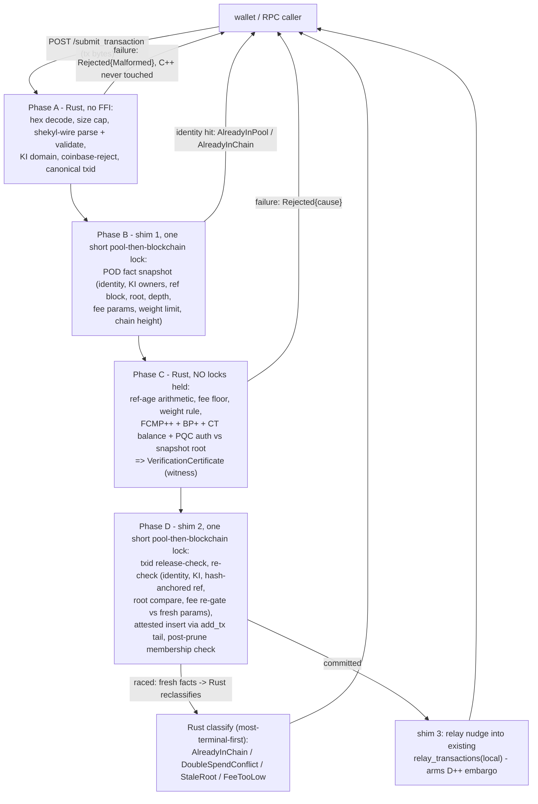

# Daemon Submit Verdict — Rust cutover of the transaction-submit path

**Status:** CONVERGED (architecture closed) after six adversarial design rounds;
rounds 1–5 accreted in review before this document was written, round 6 reviewed
the document itself. The rounds' decisions (D1–D5) and findings (F1–F39 +
minors) are recorded in §1 and folded into every section rather than appended
as errata. The 2c design round (2026-07-04, post-convergence) added F40
(`AlreadyInChain { height }`, §2.2 carve-out) and F41 (constant-work-on-Conceal
invariant, §3.1) without reopening the architecture. Round 5 confirmed the Rust cutover, the wallet-owned-liveness split,
the embargo-as-kernel resolution, and the two F22 pre-existing-defect commits
as sound and correctly scoped. Round 6 resolved the one finding that had
dropped through the round-2→round-3 index seam (F14, awaiting-confirmation
durability) and hardened the freeze gate (Phase-D policy re-check, archival
matrix rows, noise-zone threat entry, schema-evolution rule) without reopening
structure. Further rounds, if any, accrete in this document.
**Process rule:** [`26-sub-pr-design-discipline.mdc`](../../.cursor/rules/26-sub-pr-design-discipline.mdc)
(FFI-boundary-moving, consensus-adjacent: the submit path shares admission
logic with block validation, and getting the attestation seam wrong is a
consensus-integrity break, not a refactor).
**Spec-first per** [`05-system-thinking.mdc`](../../.cursor/rules/05-system-thinking.mdc):
this document freezes the contract and the parity matrix (§8) **before** any
implementation PR lands; the wire format falls out of this spec.
**Timeframes (rule 05):** *now* — the wallet rewrite needs a truthful submit
contract; *mining-era end* — the contract is fee-market-neutral and carries no
reward-era assumptions; *V4 lattice-only* — the verdict enum is
crypto-agnostic (causes name chain facts, not proof systems; `StaleRoot`
survives any membership-proof successor).

---

## 0. Problem statement (verified at source, not from docs)

The RPC transaction-submit path is a Monero-inherited compensation stack. At
the moment `on_send_raw_tx` executes, the daemon holds every fact a wallet
needs — identity-in-pool, identity-in-chain, whose key image conflicts, the
true rejection cause including stale FCMP++ root — and then (a) evaluates them
across several non-atomic lock scopes, so the answers can be mutually
inconsistent within one call, and (b) projects them into a reply schema (a
status string plus independent booleans) that cannot express them even when
they are consistent. Everything downstream is client-side reconstruction of
information the daemon had in hand and destroyed.

Defects, each verified against source:

| # | Defect | Site |
| --- | --- | --- |
| 0.1 | Identity hits return `true` with untouched `tvc`; `tvc.m_relay` default-initializes to `none`, so the RPC collapses **already-in-pool** and **already-mined** into `OK + not_relayed` | `cryptonote_core.cpp:1075-1085`, `core_rpc_server.cpp:1199-1206` |
| 0.2 | A txid in `m_timed_out_transactions` is rejected on resubmit with `m_verifivation_failed = true` and **no cause flag** → generic `Failed` → wallet maps a terminal rejection and releases locks on a tx that provably diffused before aging out. Stable false-terminal in the dangerous direction | `tx_pool.cpp:161-167` |
| 0.3 | `m_timed_out_transactions` grows without bound: inserted at `:764`, no erase path anywhere | `tx_pool.h:677`, `tx_pool.cpp:764` |
| 0.4 | Identity check, pool key-image check, and `check_tx_inputs` sit in separate critical sections; a relay-state upgrade or block-add landing between them turns a self-duplicate into `tvc.m_double_spend` on the wallet's own tx | `cryptonote_core.cpp:1075`, `tx_pool.cpp:218`, `:237` |
| 0.5 | FCMP++ verification of RPC submits runs under the pool lock (with the blockchain lock taken inside `check_tx_inputs`), head-of-line-blocking block ingestion for the duration of an expensive proof verification | `tx_pool.cpp:237` → `blockchain.cpp:3838-3850` |
| 0.6 | Stale FCMP++ root is detected, logged, and discarded — the wallet cannot distinguish "root moved, rebuild proof" from "malformed, never retry" | `blockchain.cpp:3736-3765`, `docs/FOLLOWUPS.md` `fcmp_root_stale` |
| 0.7 | `add_tx` calls `prune(m_txpool_max_weight)` *after* recording success; the just-inserted tx can be evicted while the caller reports success | `tx_pool.cpp:376`, `prune()` at `:418` |
| 0.8 | **Pre-existing defect (F22 leg 1):** `remove_stuck_transactions` evicts on receive-time age only; nothing evicts a tx whose FCMP++ reference crossed the max-age window → unminable, network-dead txs strand in the pool (and answer `AlreadyInPool`) for up to 3 days | `tx_pool.cpp:751-803` |
| 0.9 | **Pre-existing defect (F22 leg 2, live miner footgun):** `is_transaction_ready_to_go` honors the `fcmp_verified` cache seed; the verification hash binds proof‖referenceBlock‖key-images but **not height**, so template construction never re-runs ref-age and can pull a stale-ref tx into a block template **other validating nodes reject** (block validation runs ref-age before the FCMP skip) | `tx_pool.cpp:1477-1490`, `blockchain.cpp:4115-4147`, `:3745-3765` vs `:3830` |
| 0.10 | Wallet-side compensation fictions accumulated against all of the above: the `AlreadyKnown` outcome, the never-constructed `ProofStale`, `FeeTooLow`'s accidental safety, the three-bucket relay partition | `shekyl-rpc-client/src/lib.rs:191-`, `transaction_submitter.rs:36-` |

The conflict is not a wallet classification problem and not a missing-RPC
problem. It is that the daemon destroys facts it holds. Shekyl owns the
daemon, is pre-genesis, and this is wallet↔daemon wire, not consensus: there
is no compatibility constraint forcing inheritance of the lossy schema.

**The fix at one sentence:** the daemon computes a single truthful
`SubmitVerdict` with Rust owning parse, validation, FCMP++ verification, and
classification against narrow C++ state shims — and the wallet's cleverness
reduces to a projection verifiable by inspection.

---

## 1. Decision record

Six review rounds. Architecture converged and closed at round 5; round 6
hardened invariants and the freeze gate without reopening structure. Entries
here are binding; the referenced sections carry the mechanics.

**Round-2 decisions (user-ratified):**

| ID | Decision |
| --- | --- |
| D1/D2 | **Rust cutover, not C++ patching.** Validation and verdict logic move to Rust; the question was never "wrap the C++" but "is Rust equivalent (→ §8 parity matrix) and is cutover feasible (→ §3/§4)". C++ is reduced to logic-free state shims. |
| D3 | **`PreviouslyEvicted` deleted.** With FCMP++ reference-age mechanics (5..100-block window, `cryptonote_config.h`), aged-out resubmits resolve naturally: `AlreadyInChain`, `DoubleSpendConflict`, `StaleRoot`, or — for a still-fresh-ref unmined tx — full re-verification and `Accepted`. No eviction-history set, no relay bit, no `None` ambiguity arm. |
| D4 | **`diffused` payload deleted; three-bucket partition retired.** Chain-confirmation observation replaces daemon relay claims as the wallet's liveness key (trustless where the bit was trusted metadata). Reopen clause in §11. |
| D5 | **Minimal verdict enum**, transport failure stays in the `Err` arm of `Result`. |

**Findings index (all folded in):**

| Round | Findings | Landed in |
| --- | --- | --- |
| 1 | F1–F12: lock-order pin, FCMP++ cost, diffused-predicate ambiguity, version skew, txid canonicalization, race testing, oracle honesty, retry policy, spent-on-submit, dual-parser honesty, FFI-vs-wire contract distinction, evicted-history bounds | §2.3, §3, §4.4, §7.3, §10, §11 |
| 2 | D1–D5 above; F13–F19: F13 → F21 (reorg re-check); **F14 held open through round 5 — resolved round 6** (awaiting-confirmation durability, §2.6); F15 → Phase B takes both locks in one scope; F16 → trust rider (§7.2, via D4); F17 → moot under D3; F18 → Phase-C lock-freedom by construction (§3.1); F19 → skew test C | throughout; §2.6 |
| 3 | F20 (liveness machinery), F21 (reorg re-check), F22 (two pre-existing defects), F23 (prune-after-accept), F24 (txid authority), F25 (attestation choke point), F26 (FFI struct tests), F27 (no `detail` on wire), F28 (`Malformed` loop-breaker), F29 (`tx_sanity_check` parity rows) | §5, §3.1, §6, §3.4, §3.5, §4.5, §2.2, §2.5, §8 |
| 4 | Liveness ownership hand-off; embargo-as-kernel; health context; privacy-tiered escape ladder; `diffused` staking reopen | §5, §11 |
| 5 | F30 (rebuild-wound mechanization — **gating**, folded from first draft), F31 (resubmit is a status query), F32 (health-metadata trust rider), F33 (certificate witness type + blob binding); minors a–d (commit-check-time wording, matrix-pending hypothesis, F22 leg interaction, O(1) template re-check) | §7.1, §5.3, §7.2, §3.3/§3.5, §3.1, §8, §6 |
| 6 | F14 resolution (awaiting-confirmation persistence + confirmed-absent release), F34 (Phase-D dynamic-policy re-gate), F35 (noise-zone black-hole threat entry), F36 (archival-arm matrix rows, pinned at source), F37 (`FeeTooLow` loop-breaker + fee-param rider rows), F38 (schema-evolution authoring rule), F39 (Phase-C concurrency bound); minors a–d (Phase-D most-terminal-first order, watchdog present/absent branch, second-entry-point sweep, lock-freedom-by-construction sentence) | §2.6, §3.1, §7.5, §8.7.1, §2.5, §7.2, §2.3, §11, §5.3, §9 |
| 2c (2026-07-04, post-convergence) | F40 (`AlreadyInChain { height }` — §2.2 reasoned carve-out with R1 rescan-never-release + R2 fruitless-rescan breaker), F41 (constant-work-on-Conceal invariant + transport-layer per-source rate-limit sibling + cache reversion clause) | §2.1, §2.2, §2.3, §2.5, §3.1, §4.1, §7.2, §10, §11 |

The round-2 row's F13–F19 mapping was itself a round-6 fix: the index
previously jumped from round 1 to round 3, and F14 — the one round-2 finding
that was *not* absorbed elsewhere — fell through exactly the between-rounds
seam this record exists to prevent. The mapping is now explicit so absorption
is auditable, not assumed.

---

## 2. The wire contract

Owned by the new `rust/shekyl-rpc-types` crate — the single Rust definition
consumed by `shekyl-daemon-rpc` (server) and `shekyl-rpc-client` (wallet).
The C++ `tx_verification_context` becomes an internal detail behind it (and
remains the P2P ingestion contract, untouched — §9.4). The contract **freezes
when the parity matrix (§8) clears**; until then it is a draft.

### 2.1 Types

```rust
/// The daemon's atomic verdict on one submitted transaction.
#[derive(Serialize, Deserialize)]
#[serde(tag = "verdict", rename_all = "snake_case")]
pub enum SubmitVerdict {
    /// Admitted to this daemon's pool at commit-check time; relay is
    /// daemon-owned from here (§5.2).
    Accepted,
    /// Identity match: these exact bytes (same txid) are in the pool.
    AlreadyInPool,
    /// Identity match: this txid is in the main chain, confirmed at
    /// `height`. The height is the lock-lifecycle discriminant (§2.5): it
    /// decides *which release path* clears the awaiting-confirmation lock
    /// — refresh catch-up (confirming block above the wallet's synced
    /// height) vs targeted re-scan (at/below it). Carve-out from §2.2 wire
    /// minimalism, reasoned in §7.2 (F40): unlike the deleted relay-`height`,
    /// this is not trusted-daemon metadata the wallet consumes as truth —
    /// it is a routing hint whose misuse is damage-capped in both
    /// directions.
    AlreadyInChain { height: u64 },
    /// Not in pool, not in chain, and not admitted — `cause` says why.
    Rejected { cause: RejectCause },
}

#[derive(Serialize, Deserialize)]
#[serde(rename_all = "snake_case")]
pub enum RejectCause {
    /// Parse, structural, semantic, or policy-static failure — including
    /// coinbase-submit, zero-fee, tx-extra cap, nonzero unlock time,
    /// key-image domain/order violations. Deterministically permanent for
    /// these bytes.
    Malformed,
    /// Fee below the floor: at Phase C against the snapshot params, at the
    /// Phase-D re-gate against fresh params (the floor is per-block dynamic,
    /// §3.1 / F34), or admitted-then-evicted under pool pressure at the
    /// post-prune membership check. All mean the same thing to the wallet:
    /// not in the pool, fee is why.
    FeeTooLow,
    /// A *different* transaction (pool or chain) consumes at least one of
    /// this tx's inputs — a key image, or an archival claim slot (a bond
    /// record already posted for this P; a serve-credit already claimed for
    /// this (P, shard, epoch); §8.7.1). Emitted from Phase D re-check (or
    /// Phase C over chain-state facts) — never from the Phase B snapshot
    /// alone (§3.1), so it genuinely means a competing consumption.
    DoubleSpendConflict,
    /// The FCMP++ reference block is no longer canonical (reorged away), or
    /// the curve-tree root at the reference height no longer matches, or the
    /// tree depth moved out of range. Rebuild the proof against a fresh
    /// root; input selection is still sound.
    StaleRoot,
    /// Reference block is canonical but younger than
    /// FCMP_REFERENCE_BLOCK_MIN_AGE. Timed backoff, then resubmit-same-bytes.
    ReferenceTooRecent,
    /// Reference block hash unknown to this daemon (typically: daemon not
    /// yet synced to it). Sync-gated retry (§2.5).
    ReferenceNotFound,
    /// Forward-compat catch-all: a cause this client build does not know.
    #[serde(other)]
    Unrecognized,
}
```

The client-side type is `Result<SubmitVerdict, RpcError>`:

- **A verdict is truth at commit-check time** — act on it (lock lifecycle
  transitions only; ledger `spent` finality stays refresh-authoritative).
- **`Err(RpcError)` is the only irreducible ambiguity** (Two Generals:
  transport drop after send). Handled by TTL-then-resubmit; any subsequent
  definite verdict resolves it.

The three-bucket relay partition (definitely-relayed / definitely-not /
ambiguous) is **retired as a designed artifact**. What remains of it is the
trivial reading above: verdicts are definite; transport errors are not.

### 2.2 Wire minimalism

- **No payloads.** No `relayed`, no `diffused`, no relay-state `height`, no
  `was_diffused` (D3/D4). Every deleted field was either trusted-daemon
  metadata the wallet must not consume (§7) or a snapshot the wallet can
  observe trustlessly via refresh.

  **One reasoned carve-out (F40, 2c design round 2026-07-04):**
  `AlreadyInChain { height }`. The deleted relay-`height` failed both tests —
  relay metadata the wallet would have consumed as truth, *and* observable
  via refresh. The confirming-block height fails the second test in exactly
  the case that matters: when the confirming block is at/below the wallet's
  synced height with no reorg re-scan pending, refresh **never re-observes
  the spend** (the FOLLOWUPS stranded-lock finding), so "observe it
  trustlessly via refresh" is false there by construction. And it passes the
  first test because the wallet does not consume it as truth — it consumes
  it as a **release-path discriminant** (§2.5), with misuse damage-capped in
  both directions (§7.2 rider row). A unit `AlreadyInChain` forces the
  wallet to *guess* which release path applies; the guess is steerable by
  anyone who can slow the wallet's own daemon's block delivery, converting
  the guess into a selectable-input leak plus F28/F37 alarm fatigue on
  demand. Decidability beats minimalism here; the minimalism rule survives
  for every field that remains deleted.

  The carve-out is admitted **through the §5 principle** ("daemon messages
  *inform* wallet refresh decisions; they never *drive* them"), which is the
  test the deleted fields failed and this one passes — provided two rules
  are pinned as part of F40 itself:

  - **F40-R1 (rescan, never release).** A `height ≤ synced` claim authorizes
    a *targeted re-scan* and nothing else. Lock release comes **only** from
    refresh observing the spend (`mark_spent`,
    `ledger_indexes.rs`) or the §2.6 confirmed-absent watchdog path — both
    cross-check chain data the daemon cannot forge (§5.1). A failed re-scan
    must not release; it falls through to the F31 status query. Under R1 the
    height *informs* (which disposition to attempt) and never *drives* (the
    irreversible action is always refresh-authoritative) — the exact line
    §5 draws.
  - **F40-R2 (fruitless-rescan breaker).** Without a bound, a lie-low daemon
    gets a free wallet-work amplifier: each false `height ≤ synced` claim is
    cheap for the daemon and costs the wallet a re-scan. Consecutive
    daemon-directed re-scans that find no matching tx count against an
    F28/F37-family loop-breaker — N fruitless re-scans trip an operator
    alarm ("your daemon is claiming confirmations that don't exist"), the
    honest §7.1 surface for a violated trust bound. The lie is
    self-limiting and surfaces as the alarm it should be.

  Asserting the field without R1/R2 would contradict §2.1 (verdict-driven
  irreversible action) rather than satisfy §5; the two rules are what make
  the carve-out a carve-out and not an erosion of the rule.

  *Disambiguation (same field, opposite directions):* F40 is the **wallet**
  consuming a height as a bounded release-path discriminant — permitted
  under R1/R2. It is unrelated to, and must not be conflated with, F22
  leg 2 (§1 defect 0.9, fixed in PR-3): the **daemon's template
  construction** trusting a cached verification result whose hash does not
  bind height — the live consensus footgun. A later reader seeing "height"
  near "cache" in this document is looking at two different hazards with
  two different fixes.
- **No `detail` field (F27).** Sub-cause diagnostics (which of the ~12
  `Malformed` legs fired) are logged daemon-side at `INFO`, keyed by txid,
  where they are trustworthy and operator-correlatable. A wire field the
  wallet never branches on is erosion bait — the next maintainer starts
  branching on it — and a remote-daemon metadata channel.
- **Bootstrap-daemon forwarding does not exist on the new route.** Forwarding
  a submit to an arbitrary third-party daemon (`core_rpc_server.cpp:1120-1123`)
  is a silent trust-bound violation (§7.1): the wallet believes it spoke to
  its own daemon. A not-ready daemon returns a transport-level busy error;
  the wallet's health context (§5.2) distinguishes syncing from stuck.

### 2.3 Version-skew rules (F4)

Wallet and daemon are released together but not deployed atomically:

- Unknown `cause` string → deserializes to `Unrecognized` (`#[serde(other)]`)
  → disposition per §2.5 (release + one-shot rebuild). Fail-safe direction:
  never treat unknown-cause as retryable-in-place, never as
  ambiguous.
- Unknown `verdict` tag → deserialization error → the `Err` arm (transport-
  equivalent ambiguity, TTL-resubmit). A verdict the client cannot name is
  not a verdict it can act on.
- Wire types tolerate unknown *fields* within known variants — **no
  `deny_unknown_fields`** — so additive daemon-side evolution does not break
  older wallets.
- All three behaviors are pinned by the skew tests in `shekyl-rpc-types`
  (§10).

**Schema-evolution rule (authoring constraint, F38 — binding).** The runtime
asymmetry above is safe only while authors stay on the right side of it:

- New **rejection** semantics MUST land as additive `RejectCause` variants.
  Older wallets then degrade to `Unrecognized` → release + one-shot rebuild —
  the fail-safe direction, with the F28 loop-breaker bounding the worst case.
- New **top-level `SubmitVerdict` tags** are reserved for genuinely new
  *non-rejection* dispositions and are a **breaking change** requiring a
  coordinated wire-version bump plus skew-test extension. A rejection-shaped
  top-level tag would route every older wallet into `Err` → TTL-resubmit →
  the same unknown tag: a designed-in routine loop on every such release
  (the watchdog alarm would fire, but as a recurring operational cost, not a
  safety net).
- New **required fields on existing variants** (the third category, named by
  the F40 `AlreadyInChain { height }` addition) are asymmetric: an older
  wallet tolerates the new field (no `deny_unknown_fields`), but a newer
  wallet reading an older daemon's field-less variant takes a
  deserialization error → the `Err` arm → TTL-resubmit → the same error — a
  loop with the same shape as the rejection-shaped-tag hazard. **Pre-genesis
  this is a non-event** (wallet and daemon are released together, there are
  no deployed users — the atomic-cutover inversion per
  `16-architectural-inheritance.mdc`), and F40 lands that way: required
  field, frozen JSON fixtures updated, no `Option`. **Post-genesis**, a
  field addition to an existing variant MUST be optional-with-default
  (`#[serde(default)]`-shaped) or it is a breaking change under the same
  coordinated-bump rule as a new tag.

This is the priority-3 surface: the rule that makes the skew guarantee
durable rather than incidental. Reversion clause in §11.

### 2.4 Endpoint

`POST /submit_transaction`, body `{ "tx_blob": "<hex>" }`, response is the
serde-tagged verdict (HTTP 200 for every verdict including `Rejected`;
transport/availability failures use transport-level status codes). Served
natively by the axum server in `shekyl-daemon-rpc`; never proxied to the C++
HTTP stack. The legacy `/send_raw_transaction` + `/sendrawtransaction` routes
dual-serve within the PR series only and are deleted in PR-5 (§9).

Request-surface trims relative to `COMMAND_RPC_SEND_RAW_TX`:

- **`do_sanity_checks` deleted.** `tx_sanity_check` is deleted (§8 rows
  S1–S3); engine rules are always on.
- **`do_not_relay` deleted.** A submitted tx is an offered tx; relay is
  daemon-owned (§5). Checked against the staged-broadcast design, not just
  current callers: SP-T4's `P`-submitter posts via
  `shekyl-rpc-client` with no relay suppression
  (`docs/design/ARCHIVAL_BOND_2D2_SP_T4_BROADCAST.md:52`), and no other
  wallet-side design consumes admit-without-announce. Test harnesses that
  want pool-insertion-without-relay use regtest daemon configuration, not a
  public wire knob. Reversion clause in §11.

### 2.5 Per-cause wallet dispositions (D5 + F28)

| Verdict / cause | Wallet disposition |
| --- | --- |
| `Accepted` | Pending-tx enters *awaiting confirmation*; watchdog (§5.3) takes over. Outputs move to the awaiting-confirmation lock state (§2.6: persisted, dual release paths) — **not** marked spent at submit-accept (the current `local_pending_tx.rs:775-807` behavior moves to refresh-authoritative confirmation; PR-4). |
| `AlreadyInPool` | Same as `Accepted` (identity fact: the bytes are held). Resolves prior transport ambiguity for this txid. |
| `AlreadyInChain{height}` | Confirmation observed by verdict; refresh remains the settlement authority (reorgs happen — the verdict authorizes lock-lifecycle transitions only). Outputs enter the awaiting-confirmation lock in **both** height cases (fund safety first: no selectable window either way); `height` decides the **release path** (F40). *(a) `height` > wallet synced height:* the ordinary §2.6 path-1 release — refresh reaches the confirming block and settles spent-marking; baseline the lock at `height`, not at current daemon height. *(b) `height` ≤ wallet synced height:* refresh already passed that height without observing the spend — path-1 release is unreachable by construction (the FOLLOWUPS stranded-lock wedge). Enqueue a **targeted re-scan** of the window around `height` (the reorg-heal machinery — the wallet's view of that height is stale or divergent); the re-scan re-observes the spend and settles refresh-authoritatively. A failed re-scan **never releases** (F40-R1: release is refresh- or watchdog-authoritative only); it falls through to the F31 resubmit-as-status-query for a fresh definite verdict, and consecutive fruitless daemon-directed re-scans are breaker-bounded (F40-R2, F28/F37 family) → operator alarm. Every exit is verdict, confirmation, or operator alarm — no silent strand, no daemon-steered release. |
| `Rejected{Malformed}` | Release locks, surface, **one-shot rebuild**: if the rebuilt tx also returns `Malformed`, escalate to operator alarm — two independent builds rejected as malformed is a systematic wallet/daemon rule disagreement, not a bad tx; a third silent build burns fees and multiplies linking-tag artifacts (§7.1). Never loop. |
| `Rejected{FeeTooLow}` | Release, re-estimate fee, rebuild — **once** (F37; the F28 logic applies verbatim): a second consecutive `FeeTooLow` on the rebuilt tx is a systematic fee-model disagreement (a KAT gap on P2, or sustained pool pressure the wallet's estimate never meets) → operator alarm, never loop. The bound is privacy-load-bearing, not just liveness hygiene: unlike `Malformed`, a fee-driven rebuild can *change the input set* — covering a higher fee may pull in an additional input, so each iteration broadcasts a new tx sharing the original key image **and** revealing a newly co-owned input (F30 linkage plus wallet-clustering, once per loop, under the malicious-relay case of §7.1). Covers static-floor, Phase-D re-gate, and pool-pressure variants; under single-egress this verdict carries proof the tx is in neither pool nor chain, so release is safe. |
| `Rejected{DoubleSpendConflict}` | Terminal release. A different tx spends the input; refresh will surface which. |
| `Rejected{StaleRoot}` | Rebuild the **proof** over the same input selection against a fresh root. This constructs the wallet's deferred `ProofStale` path and closes the `fcmp_root_stale` FOLLOWUPS criterion (its named reopen was exactly "a daemon-side stale-root signal"). |
| `Rejected{ReferenceTooRecent}` | Timed backoff (min-age is 5 blocks; the wallet built too close to the tip), then resubmit-same-bytes. |
| `Rejected{ReferenceNotFound}` | Sync-gated: consult daemon health context (§5.2). If the daemon is behind, wait for sync and resubmit-same-bytes; if the daemon is synced and still does not know the reference, treat as `StaleRoot`. Own-daemon-gated branching per §7.2. |
| `Rejected{Unrecognized}` | Release + one-shot rebuild (the F28 loop-breaker applies). |
| `Err(RpcError)` | The ambiguous case. Hold locks, TTL, resubmit-same-bytes; the next definite verdict resolves. |

**Idempotent resubmission is the status query.** Under identity-first
ordering, resubmitting held bytes yields a definite verdict for every stable
state — a relayed-and-mined tx answers `AlreadyInChain`, a pool-resident tx
answers `AlreadyInPool`, a competing spend answers `DoubleSpendConflict`, a
dead tx re-offers and re-verifies. It requires possessing the full tx bytes,
so it adds **no txid-probe oracle** to the public RPC surface; the dedicated
txid-status RPC stays rejected (§7.3).

### 2.6 The awaiting-confirmation lock invariant (F14)

Moving spent-marking off submit-accept (the `Accepted` row above) deletes a
durable `spent = true` write. The state that replaces it must carry both
properties the old write had, or the redesign regresses fund safety *and*
privacy. Binding invariant, enforced by PR-4 and tested in §10 item 8:

1. **Persistence.** The awaiting-confirmation lock state is written to the
   wallet ledger with the same durability the old spent-marking had (the
   AEAD-sealed ledger file, not in-memory session state). If the wallet
   restarts between `Accepted` and confirmation and the state were
   in-memory, the outputs become selectable again and the wallet builds a
   second tx over the same inputs — **the same key image** — which by §7.1's
   mechanization is a broadcast-linkage artifact the wallet inflicts on
   itself. Post-F30 this is a priority-2 privacy regression, not only the
   fund-safety hazard originally filed.
2. **Two release paths, both required.**
   - *Confirmed-present:* refresh observes the tx in the chain → outputs
     transition to refresh-authoritative spent. (The path everyone
     remembers.)
   - *Confirmed-absent:* a tx that is evicted and never confirms must not
     strand its outputs in awaiting-confirmation forever. Release is wired
     to the watchdog horizon (§5.3), not a separate timer: the watchdog's
     resubmit rung converts absence into a definite verdict (re-offered →
     the wait restarts on fresh relay; `Rejected{*}` → release per this
     table; ref aged past the FCMP++ max-age window → `StaleRoot`, a
     natural terminal for same-bytes liveness), and refresh releases on
     N-of-horizon observed absence when no definite verdict is reachable
     (daemon unreachable → the alarm rung carries the decision to the
     operator). No path strands silently: every exit is
     release-by-verdict, release-by-confirmation, or operator alarm.
3. **Release is not rebuild authorization.** Releasing outputs makes them
   selectable; it does not authorize an automatic rebuild. For a tx that
   was ever network-exposed (`Accepted`/`AlreadyInPool` at any point), any
   new spend of the same outputs bears the same key image, so the
   escape-ladder ordering (§5.3) and §7.4's
   automatic-actions-are-privacy-neutral rule govern what happens *after*
   release. The confirmed-absent horizon is doing for verdict-less
   ambiguity exactly what the §7.1 cool-off knob does for terminal
   verdicts under multi-daemon — the two knobs are siblings, not the same
   knob: verdict-based release is immediate under the single-egress
   theorem (cool-off 0 at V3.0); absence-based release always waits the
   horizon because there is no verdict to trust.

---

## 3. The Rust admission engine

Lives in `rust/shekyl-daemon-rpc`, generic over the `SubmitStateShim` trait
(§3.2). Rust owns parse, structural and semantic validation, fee arithmetic,
FCMP++/BP+/CT/PQC verification, and verdict classification. C++ owns byte
storage and index membership behind three narrow shims (§4).



### 3.1 Phase spec

**Phase A — Rust-native admission (no FFI).** Hex decode; blob-size cap
(`get_max_tx_size` equivalent, snapshot-independent constant); `shekyl-wire`
`Transaction::read` + `validate()` (structural bounds, arm-mixing matrix,
`Null`-ct-iff-coinbase, unlock-time rule, per-arm archival bounds); key-image
domain check (thin-port, §8 row M8); **explicit coinbase-submit rejection**;
canonical txid via `shekyl-wire`'s hash. Any failure → `Rejected{Malformed}`
without touching C++. Working hypothesis, **matrix-pending, not settled**
(round-5 minor b): coinbase-reject is the only live `tx_sanity_check` residue
to reproduce — §8 rows S1–S3 are the gate, and if the matrix surfaces further
non-decoy residue the engine gains those rules. (Verification note recorded in
§8: the decoy-median heuristics are not merely obsolete but *vacuous* on
Shekyl — they operate on `key_offsets`, which FCMP++ consensus requires empty,
so `n_indices == 0` and the function early-returns true.)

**Phase B — fact snapshot (shim 1, one short lock).** POD snapshot under a
single pool→blockchain lock scope: identity-in-pool (both at the `all` and
`legacy` relay categories — tier-gated disclosure, see below),
identity-in-chain (with the F40 confirming-block height, read under the
same lock so the membership fact and its height cannot be racy — it rides
`SubmitFactsFfi`, so the Phase-D `Raced{fresh}` reclassification carries it
for free), per-input key-image conflict owners
(own-txid vs other), reference-block **existence by hash** + its height,
curve-tree root at that height, current tree depth, fee parameters
(fee-per-byte, quantization mask), weight limit, chain height. Early return:
`AlreadyInPool` / `AlreadyInChain` **only**. A Phase-B key-image hit is a
re-check input, never a verdict — emitting `DoubleSpendConflict` from a
snapshot would resurrect defect 0.4's self-duplicate race in the new
architecture.

**Identity category (implementation-round pin, tier-gated disclosure).**
Earlier drafts pinned identity-in-pool at the `legacy` relay category,
matching `add_new_tx:1075`. Implementation surfaced the contradiction:
`matches_category(local, legacy)` is **false** (`blockchain_db.cpp:51-80`),
so a tx sitting in its Dandelion++ embargo window (`relay_method::local` —
exactly the state the engine's own commit produces) would be invisible to a
`legacy`-category identity fact. The §5.2 ladder's resubmit probe (F31)
would then fall through Phase B, re-verify, and fault at the insert tail
(`add_txpool_tx` throws on duplicate) instead of returning `AlreadyInPool`.
The legacy path never hit this because its `add_tx` existing-tx arm caught
local-state duplicates later, lossily (`OK + not_relayed`).

The snapshot therefore carries **two** presence facts (§4.1): `in_pool` at
`relay_category::all` (the internal truth — duplicate-safety and the owner
status-query) and `in_pool_broadcast` at `relay_category::legacy` (the
broadcast-visible, foreign-disclosable fact). They differ exactly for an
embargoed tx, and the engine discloses by **caller tier**
([`SubmitCaller`](../../rust/shekyl-daemon-rpc/src/submit/engine.rs)),
derived from the endpoint's `restricted` bit:

- **Owner** (unrestricted/local endpoint — the daemon's own wallet) sees
  `in_pool`: the F31 resubmit-as-status query returns `AlreadyInPool`
  during the embargo, as intended.
- **Foreign** (restricted/public endpoint) sees only `in_pool_broadcast`.
  An embargoed self-tx (`in_pool && !in_pool_broadcast`) is **concealed**:
  the submit runs the full verification battery and reports `Accepted`
  (the commit races on `in_pool` and `classify_race` conceals it),
  indistinguishable in verdict from a fresh submission.

This closes the stem-presence oracle: without the tier gate, a Dandelion++
stem relay (which holds the tx bytes) could probe the public
`POST /submit_transaction` of many daemons — a fast `AlreadyInPool` vs a
full-verify `Accepted` maps the stem path back toward the origin. Relay-state
visibility tiers exist for *foreign* queries (the same reason
pool-inspection RPC has them); the fix restores exactly the disclosure the
legacy `relay_category::legacy` identity check gave a foreign caller, while
keeping the owner's wider `all`-category view for its own admission engine.
This was live in V3.0 (own-daemon still exposes the restricted public bind);
the §11 multi-daemon reopen re-evaluates the residual timing delta (a
concealed duplicate skips the insert, as the legacy existing-tx arm did).

**Constant-work-on-Conceal (F41, 2c design round 2026-07-04 — invariant,
not new design).** The oracle closure above holds only if `Conceal` is
indistinguishable in *time* as well as in verdict. Today that is true by
construction: the `Conceal` arm deliberately does not early-return — it
falls through to the full Phase-C battery
([`engine.rs`](../../rust/shekyl-daemon-rpc/src/submit/engine.rs), the
`disclose_pool_presence` fall-through) — and the Rust engine has **no
verification cache** (verified: no memoization anywhere on the submit
path). That is a security property held by the *absence of an
optimization*, with nothing previously asserting it — precisely the state
that silently vacates when a well-meaning perf PR adds a txid→certificate
or txid→verdict cache and the cached hit returns fast. A fast path for
already-seen bytes re-opens the stem-presence oracle as a **timing**
oracle: the foreign prober no longer needs a verdict difference, only a
latency difference. The invariant, stated as the coupling every future
change must satisfy:

> **F41.** Any cache, memoization, or fast path added to the submit
> route must either **exempt** the `Conceal` path (a foreign-caller
> submission whose bytes are pool-resident in a non-broadcast state runs
> the full battery regardless of any cached result) or **equally delay**
> it to full-battery cost. A perf/caching PR touching submit that does
> not cite F41 and demonstrate one of the two is rejected on review.

Two companions make the invariant durable rather than aspirational:

- **DoS relief lives at the transport layer, not in a cache.** The
  pressure that would motivate a verification cache is resubmit spam —
  cheap-to-send, expensive-to-verify bytes. That pressure is relieved
  where it does not touch the timing property: **per-source rate
  limiting at the transport/handler layer**, tier-appropriate — **Owner
  is never rate-limited** (the F31 status query is legitimate,
  unbounded-in-principle wallet behavior); **Foreign has no legitimate
  resubmit-spam case** (an honest relay submits a given tx once), so a
  per-source limiter costs honest traffic nothing. This sits beside the
  F39 semaphore, which bounds aggregate concurrency but not per-source
  rate; the two are complements, not substitutes.
- **The known residual is disclosed, not hidden by the invariant:** a
  concealed duplicate skips the Phase-D insert (as the legacy
  existing-tx arm did), a small timing delta at the commit tail. F41
  guards the dominant cost (Phase-C verification, orders of magnitude
  above the insert); the insert-skip residual stays on the §11
  multi-daemon reopen's ledger where it already lives.

Test obligation in §10; reversion clause (the terms under which a
submit-path cache may land) in §11.

**Phase C — verification (Rust, no locks held anywhere).** Ref-age window
arithmetic (min 5 / max 100, from config); fee floor against snapshot params;
weight rule (the *limit* is a compile-time constant on Shekyl —
`get_transaction_weight_limit` reduces to `get_min_block_weight`, which
returns `CRYPTONOTE_BLOCK_GRANTED_FULL_REWARD_ZONE_V5` unconditionally,
`cryptonote_basic_impl.cpp:66-71` — so unlike the fee floor it needs no
Phase-D re-check); the archival-arm battery for bond-post / serve-credit txs
(§8.7.1 — already Rust in `shekyl-archival-retention`, called natively); then
the expensive cryptography natively — FCMP++ membership (`shekyl-fcmp`, the
same Rust crate C++ calls through `shekyl_fcmp_verify` today, minus the FFI
hop), BP+ range proofs, CT balance, PQC hybrid auth with scheme-id
consistency. Defect 0.5 dies here: block ingestion proceeds while proofs
verify.

Phase C holds no locks **by construction**, not by discipline: it calls
`shekyl-fcmp` and the other Rust crates natively rather than routing through
`check_tx_inputs`, which takes the blockchain lock (`blockchain.cpp:3364+`)
— the C++ verification path is simply not on the submit route (closes
round-2 F18; a reader must not assume the reused C++ path is still reachable
from RPC).

**Concurrency bound (F39).** Moving verification outside locks (the F2 win)
also removed the *accidental* serialization the old path imposed — FCMP++
verification under the pool lock bounded concurrent verification to one.
Phase C therefore runs under a **bounded semaphore sized to available cores**
(a deliberate cap replacing the accidental one): cheap-to-submit /
expensive-to-verify is otherwise an unbounded CPU/memory amplification. For
own-daemon V3.0 the exposure is self-inflicted and moot; for any public-RPC
operator it is live, so the cap ships with PR-3 and is listed as a
multi-daemon-reopen prerequisite (§11). Success mints the
**`VerificationCertificate`** (§3.3).

**Phase D — check-and-commit (shim 2, one short lock).** Under one
pool→blockchain lock scope, re-check every mutable premise — chain-structural
*and* dynamic-policy (F34):

1. the release-mode txid equality check (§3.4 — internal-fault gate; runs
   first because nothing else is trustworthy if the blobs disagree),
2. identity-in-pool, identity-in-chain (unchanged since B?),
3. key-image owners (a competing spend may have landed), plus the
   archival-arm mutable premises for bond-post / serve-credit txs
   (record-exists, duplicate-credit bit, good-through, H_close deadline —
   §8.7.1: a block during C can flip any of them),
4. **`block_exists(referenceBlock)` hash-anchored, age window on the returned
   height** (F21: the reference is pinned by *hash*; a block hash commits to
   its prefix chain, so hash-canonicality at a height within the window ⇒
   root-canonicality — height arithmetic on a cached height cannot detect a
   reorg),
5. **root-at-height == certificate root** (belt-and-suspenders over 4; also
   catches root-table maintenance bugs),
6. **fee re-gate against fresh params (F34).** The floor is per-block
   dynamic — `check_fee` reads `m_current_block_cumul_weight_limit`, the
   long-term effective median, and supply at current height
   (`blockchain.cpp:3913-3936`), all of which move every block — so across
   a long Phase C the floor can rise with the pool *not* full, which the
   post-prune membership check (F23) would never catch: the tx would be
   admitted below the current floor, `Accepted`, and then neither relay nor
   mine — exactly the zombie-`Accepted` this redesign exists to abolish.
   The shim re-runs the existing `Blockchain::check_fee` gate against fresh
   params before the insert tail (mirroring `add_tx`'s own order,
   `tx_pool.cpp:176-192` before `:229`; mechanism reuse, not new logic —
   the same reuse shape as the tail itself, and its parity with Rust's
   Phase-C arithmetic is already KAT-pinned by row P2). Failure returns
   `Raced{fresh}`; Rust re-runs its own floor arithmetic on the fresh
   params and emits `FeeTooLow`.

If clean: insert through the existing `add_tx` insert tail (meta build,
`fcmp_verified` attestation from the certificate, key-image index, transient
lists, `prune`) — then **re-check membership after the tail's `prune()`**
(F23 / defect 0.7): evicted-on-insert → `Rejected{FeeTooLow}` (pool-pressure
variant). The resulting invariant is **`Accepted ⇒ in pool at commit-check
time`** (round-5 minor a: a concurrent insert's `prune()` can still evict
between commit-check and the reply hitting the wire; every snapshot can be
stale by reply — which is exactly why the wallet keys liveness on chain
confirmation, §5.3, not on verdicts).

If raced: the shim returns fresh facts and **Rust classifies,
most-terminal-first** (round-6 minor a; the order is load-bearing):

> `AlreadyInChain` (settled) → `DoubleSpendConflict` (terminal) →
> `StaleRoot` (retryable: rebuild proof) → `FeeTooLow` (retryable:
> re-estimate).

When multiple premises moved at once, the wallet must hear the most terminal
fact: a reorg *plus* a competing spend classified as `StaleRoot` would send
the wallet through rebuild → resubmit → `DoubleSpendConflict` — a wasted
round trip and a wasted proof rebuild — whereas `DoubleSpendConflict`
directly is correct and final. The C++ never chooses a verdict.

**Relay (shim 3).** Post-commit nudge into the existing
`relay_transactions(..., relay_method::local)` dispatch — the same entry
point that arms the Dandelion++ embargo (§5.2). The nudge is latency; the
embargo + periodic loop are the guarantee (a lost nudge is covered:
`add_tx`'s insert tail sets `last_relayed_time = max()` making the tx
immediately eligible for the periodic relay pass).

### 3.2 The `SubmitStateShim` trait — the named seam (rule 21)

```rust
pub trait SubmitStateShim {
    fn snapshot_facts(&self, txid: &TxId, key_images: &[KeyImage],
                      reference_block: &BlockHash) -> SubmitFacts;
    fn commit(&self, blob: &[u8], txid: &TxId, meta: &TxMeta,
              cert: &VerificationCertificate, expected: &SubmitFacts)
              -> CommitOutcome;
    // Committed | Raced(SubmitFacts) | PrunedOnInsert | InternalFault (§4.2)
    fn relay(&self, txid: &TxId);
}
```

The engine is generic over this trait. Production implements it over the FFI
shims (§4); tests implement it as a deterministic mock (§10). When the
mempool itself migrates to Rust, the Rust mempool implements the trait and
the engine, contract, and wallet are untouched — the seam is the reversion
boundary, not the wire.

### 3.3 The verification certificate — a witness type (F33)

```rust
/// Witness that Phase C fully verified the transaction identified by `txid`
/// against `root` at `ref_height`. Private fields; the ONLY constructor is
/// successful completion of Phase C. Possession ⇒ verification, by
/// construction.
pub struct VerificationCertificate {
    txid: TxId,
    reference_block: BlockHash,
    ref_height: u64,
    root: CurveTreeRoot,
    // private; no Clone, no Serialize, no public field access
}
```

Same shape as the project's `RetirementWitness` / `ExitedConfirmed` pattern:
on the Rust side, "holds a certificate" ⇒ "Phase C verified this txid" is
enforced by the type system, and the F25 setter-enumeration audit collapses
to "grep certificate construction = grep Phase C completion." Only the FFI
marshalling of the certificate's facts into `commit_tx` remains by-convention
— bounded by §3.4/§3.5.

### 3.4 Txid authority (F24)

The engine's `shekyl-wire` txid is authoritative for the verdict path. The
commit shim *also* computes C++ `get_transaction_hash` over the received blob
— required regardless, so an engine-admitted tx and a P2P-received copy of
the same tx key identically in the pool — and performs a **release-mode**
equality check against the engine txid. Mismatch fails the submit as an
internal fault (logged loud, transport-level error), never as a verdict: a
hash divergence is a wallet-and-daemon-disagree-about-bytes bug, and
converting it into a `Rejected` would teach the wallet to rebuild over a
daemon defect. The equality is additionally pinned by a frozen-hex KAT in
`shekyl-rpc-types` (§10) — KAT-proven at build time, release-checked at run
time, so "which txid is authoritative" is moot by construction. The pool
index remains keyed by C++'s hash while pool internals remain C++.

### 3.5 Attestation choke point (F25 + F33)

`fcmp_verified` metadata is consumed by block-template construction
(`is_transaction_ready_to_go` seeds `m_input_cache` from it) — an unearned
attestation is a consensus-integrity hazard, not a perf bug. Discipline:

1. The certificate is the only way to reach an attested insert. `commit_tx`
   refuses attestation without one and is the **only** RPC-path caller.
2. The P2P path never passes a certificate: it verifies inside `add_tx` as
   today, setting `fcmp_verified` (`tx_pool.cpp:336-345`) only after its own
   `check_tx_inputs`. This document's audit enumerates every `fcmp_verified`
   write site; each verifies first. Post-series, the write sites are exactly
   two: the P2P `add_tx` path and `commit_tx`.
3. **Certificate-blob binding falls out of F24 and is load-bearing:**
   `commit_tx` release-checks C++(blob) == engine-txid, and the certificate
   is minted for the engine txid — so a certificate cannot be replayed
   against a different blob: commit blob-B with tx-A's certificate →
   C++(blob-B) ≠ cert.txid → internal fault. The txid check does double duty
   as certificate-blob binding.

---

## 4. The C++ shims (FFI spec)

Three exported functions, POD-struct interfaces, zero verdict logic. Per
[`20-rust-vs-cpp-policy.mdc`](../../.cursor/rules/20-rust-vs-cpp-policy.mdc)
this is the C++-as-minimal-transport-shim shape.

**FFI boundary (implementation-round pin).** These shims deliberately do
**not** route through the single `shekyl-ffi` surface that
[`40-ffi-discipline.mdc`](../../.cursor/rules/40-ffi-discipline.mdc) /
[`25-rust-architecture.mdc`](../../.cursor/rules/25-rust-architecture.mdc)
otherwise mandate. They resolve pool/blockchain/protocol from a live
`core_rpc_server` (`core_rpc_ffi_*`), which is a daemon-only object;
`libshekyl_ffi.a` links into the wallet and every other consumer, so pulling
these symbols into it would drag the whole daemon RPC surface behind the FFI
crate. The submit shims therefore own their boundary — the C++ header
`src/rpc/daemon_submit_ffi.h`, its `#[repr(C)]` twins in
`rust/shekyl-daemon-rpc/src/ffi.rs`, and the marshalling in
`src/submit/ffi_shim.rs` — colocated with the daemon-RPC crate that is their
only caller, exactly as `core_rpc_ffi_*` already does. An FFI-surface audit
(rule 40's enumeration, rule 35/36 secret-locality sweeps) must include this
boundary, not only `shekyl-ffi`.

### 4.1 `shekyl_submit_snapshot_facts`

In: txid, key images (flat 32B array), reference block hash.
Out (POD `SubmitFactsFfi`): `in_pool: u8`, `in_chain: u8`,
`in_chain_height: u64` (valid iff `in_chain` — the F40 confirming-block
height, read under the same lock scope as the membership fact so the pair
cannot be racy), per-KI conflict descriptor (`none | own_txid | other`),
`ref_block_found: u8`, `ref_height: u64`, `root: [u8; 32]`,
`tree_depth: u8`, `fee_per_byte: u64`, `fee_quantization_mask: u64`,
`weight_limit: u64`, `chain_height: u64`.
One `CRITICAL_REGION` pair, pool→blockchain, reads only.

For archival-arm txs the snapshot extends with the arm's stateful facts
(§8.7.1): bond-record presence + stored pubkey, join epoch,
good-through-at-E, duplicate-credit bit, holdings-at-H_fire, registry
segment (subroot + leaf count), seal hash, leaf-layer scalars. The shim
derives H_fire via the existing Rust FFI epoch/fire helpers to key the
holdings/registry reads — exactly as `check_archival_serve_credit_input`
does today (`blockchain.cpp:4288-4319`); the derivation is Rust either way,
so this is fact-fetching, not logic.

### 4.2 `shekyl_submit_commit_tx`

In: blob, engine txid, meta fields (weight, fee), certificate facts
(ref hash/height, root), `expected_facts`.
Behavior: take pool→blockchain locks; recompute C++ txid over blob and
release-check (§3.4); re-run the §3.1 Phase-D re-check list against
`expected_facts`, including the `check_fee` re-gate against fresh params
(F34 — reused mechanism, mirroring `add_tx`'s gate-before-tail order); on
clean, execute the existing insert tail with `fcmp_verified = 1` +
verification hash; post-prune membership check.
Out: `Committed | Raced{fresh: SubmitFactsFfi} | PrunedOnInsert |
InternalFault`.

### 4.3 `shekyl_submit_relay_tx`

In: txid. Behavior: enqueue into the existing
`NOTIFY_NEW_TRANSACTIONS` / `relay_transactions(local)` dispatch. Fire and
forget; failure is covered by the periodic loop (§5.2).

### 4.4 Lock order (F1, confirmed at source)

Pool → blockchain everywhere both are held: `blockchain.cpp:5181-5182`
(`add_new_block`), `:404-405`, `:690-691`; pool-side `add_tx:155` →
`:264/:293`, `have_tx:1372-1373`. Both locking shims follow it; neither
holds any lock across the FFI boundary or across Phase C.

### 4.5 FFI struct compatibility domain (F26)

`SubmitFactsFfi` and the certificate marshalling are **same-build ABI**:
Rust and C++ sides ship in one artifact, so the layout is free to change and
carries no versioning. That freedom is bounded by tests, not convention:
**bidirectional round-trip tests** (Rust-writes/C++-reads and
C++-writes/Rust-reads) over representative and edge values (`u64::MAX`
heights, zeroed/max hashes, every conflict-descriptor arm). Rationale: a
width/offset mismatch in `expected_facts` would make the Phase-D re-check
silently pass or fail wrongly — the txid KAT cannot catch it.

This is deliberately **not** the wire contract: the wire (§2) is
version-skew-tolerant and frozen; the FFI structs are same-build and fluid.
Conflating the two compatibility domains was a round-1 finding (F11).

---

## 5. Liveness ownership — the named hand-off (F20 final form)

> **Liveness policy is wallet-owned; the daemon guarantees only honest
> reporting plus the Dandelion++ fail-safe.**

Daemon messages *inform* wallet refresh decisions; they never *drive* them.
A staking / shard-serving wallet and a plain wallet need not share refresh
periodicity — that is wallet policy, decided by the wallet from its own role
and state; the daemon is not consulted. This sentence is the contract
boundary between this plan and the wallet plan, stated here so the
wallet-side obligations cannot fall into the seam between documents.

### 5.1 Why the split is an improvement, not a reshuffle

Keying the wallet's liveness decision on **chain-confirmation observation**
is trustless where a daemon-reported `diffused` bit was trusted metadata: a
malicious daemon can forge a relay claim; it cannot forge the tx confirming
(the wallet cross-checks refresh data). Deleting the relay-claim channel
forces the wallet onto the observable fact, advancing priority-2 and
de-risking the multi-daemon reopen in advance.

### 5.2 Daemon-side guarantees (each source-verified)

1. **Periodic re-relay.** `core::on_idle` (`cryptonote_core.cpp:1597`) →
   `relay_txpool_transactions()` (`:1105-1145`) → `get_relayable_transactions`
   (`tx_pool.cpp:806-879`). The insert tail sets
   `last_relayed_time = max()` (`:313-322`), making a committed tx
   immediately eligible even if shim 3's nudge is lost. Bound: re-relay
   stops at half the pool lifetime (`:851-852` — 1.5 days of the 3-day
   `CRYPTONOTE_MEMPOOL_TX_LIVETIME`).
2. **Dandelion++ embargo fail-safe — the irreducible kernel.** The
   black-holed-stem case (honest daemon stems to one adversarial peer which
   drops the tx) is the one failure no wallet policy reliably fixes: wallet
   resubmission re-enters stem and can hit the same adversarial peer; only
   the origin's own embargo timer guarantees eventual broadcast. Mechanism,
   verified: public-zone dispatch of a `local` tx runs `dandelionpp_notify`
   (`levin_notify.cpp:876-893`), which calls `on_transactions_relayed(stem)`
   **before** the stem send (`:562`) → `set_relayed` arms
   `last_relayed_time = now + poisson(embargo)` as a *future deadline* for
   `dandelionpp_stem` entries (`tx_pool.cpp:909-913`); failed sends fluff
   immediately (`levin_notify.cpp:578-582`); stem entries past deadline are
   routed into the public fluff request by the periodic loop
   (`tx_pool.cpp:828-836` → `cryptonote_core.cpp:1127-1141`), re-arming on
   each attempt (`tx_pool.cpp:868-877`); a fluff echo arriving first cancels
   the embargo through ordinary ingestion. **Noise zones (Tor/i2p)
   intentionally do not arm the embargo** (`levin_notify.cpp:850`,
   `tx_pool.cpp:914-915`) — covert-channel re-send cadence covers them,
   and arming would fluff over clearnet, deanonymizing the origin.
   Recorded here so nobody "fixes" the noise-zone branch into arming —
   but the consequence is not a parenthetical: over anonymity networks
   the black-hole guarantee is **deployment-dependent**, a named threat
   entry (§7.5), and the wallet watchdog horizon must be sized for it.
   Shim 3 enters through the same `relay_transactions` entry point, so
   arming is **inherited, not re-implemented**; PR-3 carries the test
   obligation (§10.4).
3. **Honest health context.** The wallet's policy needs to distinguish "tx
   stuck" from "daemon has no peers to relay to" and "daemon is behind."
   The existing info surface's peer/connection counts and
   current-vs-target height are named **contract-accurate** fields this
   design relies on. No new RPC. Trust classification in §7.2.
4. **Pool-state honesty maintenance:** the two F22 fixes (§6) keep
   `AlreadyInPool` meaning "minable or freshly-doomed," never
   "stranded-dead for 3 days."

### 5.3 Wallet-side obligations (PR-4 scaffolding + wallet plan)

- **Role-aware watchdog with a guaranteed-terminating escape from "held."**
  Cadence is role policy (staking vs plain); termination is not — every held
  tx eventually reaches a definite disposition regardless of what the daemon
  claims.
- **Chain-confirmation keying.** The watchdog's success condition is
  confirmation observed via refresh — never a daemon relay claim.
- **Horizon bound (F35).** The escape horizon must fire **before the
  1.5-day re-relay cutoff** (§5.2 item 1), not after: between 1.5 days and
  the 3-day eviction a pool tx is held-but-no-longer-re-relayed, so a
  watchdog that fires inside that window is inspecting a tx the daemon has
  already stopped offering. And the horizon must be sized for the
  anon-network eclipse case (§7.5) — where the watchdog is the *only*
  backstop — not only for the clearnet-stem case where the embargo also
  protects.
- **Privacy-tiered escape ladder.** The timeout is itself an attack surface:
  an adversary who can delay confirmation (censoring miner, eclipse) can
  force the wallet past its threshold on demand; if the escape auto-rebuilds
  over different inputs, cheap censorship becomes an attacker-triggered
  linkage event (§7.1). The ladder:
  1. **Resubmit-same-bytes** — privacy-neutral (identical bytes, same txid,
     daemon dedups; zero new network artifact).
  2. **Operator alarm** — a human decides.
  3. **Deliberate, alarmed rebuild** — never automatic on timeout.
- **The ladder branches on presence (round-6 minor b).** Resubmit-same-bytes
  is *inert* for a stuck-but-present tx: it returns `AlreadyInPool` (no
  relay pulse, F31) and tells the wallet nothing it didn't know. The rungs
  are therefore presence-conditional, with one resubmit acting as the
  probe: **absent** (evicted / never landed) → the resubmit *is* the remedy,
  re-offering through full admission and fresh relay, and the wait restarts;
  **present-but-unconfirmed past horizon** → skip straight to the alarm rung
  — repeating the resubmit is pointless by construction, and the eclipse
  case (§7.5) lands exactly here. Terminal verdicts on the probe
  (`AlreadyInChain`, `DoubleSpendConflict`, `Rejected{*}`) resolve the wait
  per §2.5/§2.6.
- **Resubmit is a status query, not a relay trigger (F31, source-verified).**
  An in-pool resubmit early-returns `AlreadyInPool` at Phase B, before
  shim 3 — and the old path behaves identically
  (`core_rpc_server.cpp:1209-1211` is reachable only when
  `tvc.m_relay != none`; the in-pool hit takes the `:1199` branch and
  returns first). This is desirable: on-demand origin re-announcement of a
  pool-resident tx would be an origin-fingerprinting signal, the opposite of
  what a privacy coin wants. The resubmit's value is the definite verdict
  (`AlreadyInChain` / `DoubleSpendConflict` / `StaleRoot` resolve the wait);
  only when the tx is *absent* (evicted, never landed) does resubmission
  re-offer through full admission and fresh relay. Relay re-attempts for a
  pool-resident tx are wholly daemon-owned (periodic loop + embargo). The
  wallet owns the decision to wait or escalate — never the relay pulse.
- **Defense-in-depth demotion.** The watchdog backstops the entire
  daemon-side liveness-gap class (F20 black-hole, F22 stale-ref stranding,
  F23 pool-pressure eviction): none can strand the wallet indefinitely.
  Wallet-facing severity of all three is demoted; their daemon-side kernels
  stand and are fixed as filed.
- **`P`-submitter (SP-T4a):** relies solely on daemon-owned relay; there is
  no relay field left to branch on. Confirmed against the SP-T4 broadcast
  design.

---

## 6. Pre-existing defects fixed in PR-3 (F22, separately-scoped commits)

Both exist today independent of this series; both ride PR-3 as their own
commits per [`90-commits.mdc`](../../.cursor/rules/90-commits.mdc).

**Leg 1 — ref-age eviction.** `remove_stuck_transactions` (`tx_pool.cpp:751-803`)
gains: evict when
`chain_height - meta.max_used_block_height > FCMP_REFERENCE_BLOCK_MAX_AGE`.
The meta already carries the reference height for FCMP++ txs
(`blockchain.cpp:3767` → `tx_pool.cpp:326-327`); the sweep already holds both
locks and iterates metas. Closes defect 0.8 (`AlreadyInPool` stranding).

**Leg 2 — template-time ref-age re-check.** `is_transaction_ready_to_go`
re-checks the ref-age window **and** `max_used_block_id` canonicality at that
height before honoring the `fcmp_verified` cache seed. Closes defect 0.9
(mining a block the network rejects). Consensus-hygiene, priority-1.

**Interaction (round-5 minor c), stated so the cost is not a surprise:** a
stale-ref tx is *skipped* by leg 2 at every template build until leg 1's
sweep evicts it — bounded by the sweep interval, and acceptable because the
per-tx re-check is cheap by requirement:

**O(1) requirement (round-5 minor d):** the leg-2 re-check is height
arithmetic on `meta.max_used_block_height` plus one `get_block_id_by_height`
LMDB lookup compared against `meta.max_used_block_id` — the same lookup shape
`is_transaction_ready_to_go` already performs per call
(`tx_pool.cpp:1468-1469`). Never a chain walk. This sits on the mining hot
path; the O(1) property is a review gate for the leg-2 commit.

---

## 7. Threat model

### 7.1 The trust bound, with the rebuild wound mechanized for Shekyl's crypto (F30)

**The theorem:** under single-egress (the wallet's only path for these bytes
is its own daemon), `Rejected{*}` carries the proof that the tx is in neither
this daemon's pool nor its chain — so "reject ⇒ not relayed" holds and lock
release is safe. This is a theorem about single-egress, not a general truth;
it is the multi-daemon reopen's first casualty (§11).

**The attack:** a compromised daemon relays the tx *and* returns `Rejected`,
inducing the wallet to release locks and rebuild over the same inputs. This
attack exists today with the legacy schema (return `Failed`, relay anyway);
the richer verdict neither creates nor cures it. The mitigation is policy —
the escape ladder's no-auto-rebuild rule and a named rebuild cool-off knob
(N blocks of observed absence via refresh before re-spending inputs released
by a terminal verdict; default **0** for the own-daemon V3.0 deployment
model; reopens with multi-daemon).

**What the rebuild actually wounds — stated precisely, because the inherited
framing is false here.** Under ring signatures the rebuild-over-same-inputs
wound is decoy-set intersection: two rings over the same real input,
intersected, unmask it. **Shekyl has no decoys** — FCMP++ proves membership
over the whole chain, so intersecting two proofs of the same input yields
nothing, and a rule-60-aware reader who found an unmechanized "privacy wound"
claim here would rightly challenge it. The rule survives on different and
stronger footing:

> Both spends of one output necessarily carry the **same key image** — that
> is how double-spend prevention works, so the linking tag is public
> per-input by construction (`txin_to_key.k_image`; uniqueness enforced at
> `cryptonote_core.cpp:890-896`, domain at `:906-912`, canonical sortedness
> at `blockchain.cpp:3443-3464`, chain-spent check at `:3517-3522`, pool
> index keyed on it). A rebuild is therefore a **new network artifact bearing
> the same linking tag**: any observer who saw both broadcasts learns "these
> two transactions are the same spender retrying this input" — a
> **broadcast-linkage leak** (timing, origin correlation, retry behavior),
> not an input-unmasking one. It exists precisely when the original
> propagated — which is exactly the ambiguous/malicious-daemon case where
> the wallet is tempted to rebuild.

This is also why resubmit-same-bytes is *strictly* privacy-superior to
rebuild, not merely equivalent: identical bytes are the same txid, the
daemon dedups, and **zero** new linking-tag-bearing artifacts enter the
network. The escape ladder's ordering is a consequence of this mechanism,
not a preference.

### 7.2 Trusted-daemon-metadata rider (F7, extended by F32)

Enumeration of every daemon-reported field the wallet's logic consumes,
with trust classification:

| Field | Consumer | V3.0 (own daemon) | Multi-daemon reopen |
| --- | --- | --- | --- |
| `SubmitVerdict` itself | lock lifecycle | trusted (single-egress theorem) | `Rejected ⇒ safe-release` **dissolves**; cool-off knob activates |
| Peer/connection count | watchdog: tx-stuck vs daemon-peerless | trusted | **untrusted** — a lying "I'm healthy" makes the wallet wait on a non-propagating tx |
| Current vs target height | `ReferenceNotFound` sync-gating; watchdog | trusted | **untrusted** — a lying sync height flips backoff/terminal at will |
| Fee params (fee-per-byte, quantization mask) | fee estimation; the `FeeTooLow` re-estimate rung | trusted | **untrusted** — a lying fee oracle griefs: overpay, or an induced `FeeTooLow` loop (bounded by the F37 loop-breaker) |
| Curve-tree roots / chain view consumed at proof-construction time | tx builder (`shekyl-tx-builder`) | trusted | **untrusted** — a lying chain view yields proofs honest daemons reject (`StaleRoot`-shaped griefing); it cannot forge membership, since consensus verifies against canonical roots |
| `AlreadyInChain.height` (F40) | lock release-path routing (§2.5) | trusted (but R1/R2-bounded even here) | **untrusted** — but damage-capped in both directions: lie-high routes to path-1 waiting, released by the §2.6 confirmed-absent watchdog horizon (bounded liveness cost); lie-low routes to a targeted re-scan that finds nothing, **never releases** (F40-R1), falls through to the F31 status query, and is breaker-bounded against repetition (F40-R2 — a lie-low spam campaign is a wallet-work amplifier otherwise; the breaker converts it to an operator alarm). Neither lie can force a linkage event: the lock is placed in **both** branches, so no lie makes the inputs selectable. Categorically a *metadata* row, not a verdict row — the verdict (`AlreadyInChain` itself) is the §7.1-class claim; the height only routes its release |

Round 4 introduced the health-context consumption; F32 caught that the
then-current rider enumerated only the *deleted* relay fields
(`diffused`/`height`/`was_diffused`) while the *newly relied-upon* health
fields went unlabeled; F37 caught the same gap for the fee params the
re-estimate rung consumes, and widened the lens: the wallet's
**construction-time** chain view is daemon-sourced too, so the multi-daemon
reopen is broader than the submit-time fields — the rider now enumerates
both. The rider above is authoritative. Damage cap: because the escape
ladder never auto-rebuilds on timeout and `FeeTooLow` is retry-bounded,
lies in the **metadata rows** (peer count, sync height, fee params, chain
view) degrade **liveness or fees only** — none can force a linkage event.
The verdict row is categorically different: a lying `Rejected` is the §7.1
attack itself, which is why its multi-daemon cell activates the cool-off
knob rather than a mere trust downgrade. Wallet health-based branching is
**own-daemon-gated**; the multi-daemon reopen inherits every row as
untrusted remote metadata exactly as it inherits the relay-field deletions.

### 7.3 Resubmission-as-oracle rider (F7)

The status-query-by-resubmission primitive requires possessing the full tx
bytes — it adds no naked-txid probe oracle to the public RPC surface, which
is why the dedicated txid-status RPC stays rejected. Stated honestly: it is
*weaker* than a txid oracle, not absent — an adversary holding captured tx
bytes can probe pool/chain presence on daemons that expose RPC publicly, and
each probe perturbs (a dead tx is re-offered). Own-daemon deployment makes
this moot; public-RPC operators inherit the same exposure the legacy
endpoint already had.

### 7.4 Censorship-forced-timeout linkage

An adversary who can delay confirmation cheaply (censoring miner share,
eclipse of the daemon's peers) can force any wallet timeout to fire on
demand. The design treats every timeout-triggered *automatic* action as
attacker-triggerable and therefore restricts automatic actions to
privacy-neutral ones (resubmit-same-bytes). Everything linkage-bearing
(rebuild) requires the operator rung. §5.3's ladder is the enforcement.

### 7.5 Anonymity-network black-hole — the embargo's deployment boundary (F35)

The F20 resolution rests on the Dandelion++ embargo being *the* mechanism no
wallet policy can substitute (§5.2 item 2). That mechanism **does not run
for the deployment a privacy-maximalist coin most expects**: noise zones
(Tor/i2p) intentionally do not arm the embargo (`levin_notify.cpp:850`,
`tx_pool.cpp:914-915`), by design — an origin fluffing to clearnet because
its anon send stalled would deanonymize itself, which is the exact wound the
noise zone exists to prevent. The absence is correct and stays; what must
not stay is framing it as a parenthetical.

Wargamed: an anon-only node whose out-peers are all adversarial (anon-peer
eclipse) has no embargo — there is no clearnet identity to fluff from — and
the covert-channel re-send cadence re-offers into the same eclipsed peer
set. The tx sits in the pool; watchdog resubmits return `AlreadyInPool`,
which neither informs (the wallet knew) nor propagates (no relay pulse,
F31). Black-hole resistance over noise zones therefore reduces to
**fan-out across all anon out-peers plus re-send cadence — both of which an
anon-peer eclipse defeats — leaving the wallet watchdog's operator-alarm
rung as the sole backstop.**

That is an acceptable end state (the alarm is precisely the "a human
decides" rung, and eclipse is not silently survivable in any design), but
it carries two named obligations:

1. **The watchdog horizon is sized for this case**, not only for the
   clearnet-stem case where the embargo also protects (§5.3's horizon
   bound: fire before the 1.5-day re-relay cutoff, well inside the 3-day
   pool lifetime).
2. **The escalation for present-but-unconfirmed goes straight to alarm**
   (§5.3's presence branch) — the resubmit rung is inert here by
   construction, and burning horizon-multiples on it delays the only
   effective response.

Cross-boundary honesty: on clearnet the guarantee is "the origin itself
eventually fluffs" (mechanism); over noise zones it is "the operator is
told, in bounded time, that the tx is not confirming" (detection). The
design does not pretend the second is the first.

### 7.6 Untrusted-input surfaces (fuzz obligations)

- **The Rust admission parser (Phase A) is the front-line untrusted-input
  surface** — named fuzz target (§10.6), running `shekyl-wire` parse +
  `validate()` + txid over arbitrary bytes.
- The C++ deserializer remains reachable from P2P and from stored-blob
  re-parse (template/relay paths); it stays in fuzz scope until the mempool
  migration deletes it. The commit shim's C++ parse of the blob doubles as
  the same-build tripwire (§3.4): divergence is an internal fault at
  admission, never a verdict.

---

## 8. Parity matrix — the contract-freeze gate

The contract (§2) freezes only when every row below has a verified
disposition. Columns: the legacy check, its site, the legacy failure signal,
and the Rust-cutover disposition. Dispositions: **A** = Phase A
(Rust-native, exists today in `shekyl-wire` unless marked port), **C** =
Phase C (Rust arithmetic/crypto over snapshot), **B/D** = shim-provided fact
+ Rust decision, **DEL** = deleted with reason, **KEEP-P2P** = unchanged on
the P2P path (out of scope).

Rows marked ⚠ **resolve-before-freeze** carry an implementation-time
verification obligation (where exactly the Rust equivalent lives, or a KAT
against the C++ behavior); the matrix is the gate, per round-5 minor (b).

### 8.1 RPC transport layer (`on_send_raw_tx`, `core_rpc_server.cpp:1116-1215`)

| # | Check | Site | Legacy signal | Disposition |
| --- | --- | --- | --- | --- |
| T1 | Bootstrap-daemon forward | `:1120-1123` | silent proxy | **DEL** — trust-bound violation (§2.2) |
| T2 | Hex parse | `:1146` | `Failed` | **A** (hex decode) |
| T3 | `tx_sanity_check` gate (`do_sanity_checks`) | `:1153` | `Failed`, `sanity_check_failed` | **DEL** — see S1–S3 |
| T4 | tvc→booleans reply mapping | `:1169-1206` | lossy | **DEL** — replaced by §2 contract |
| T5 | Relay dispatch on accept | `:1209-1211` | — | shim 3 (§3.1), same entry point |

### 8.2 Core ingestion (`handle_incoming_tx`, `cryptonote_core.cpp:791-840`; `add_new_tx` `:1075-1085`)

| # | Check | Site | Legacy signal | Disposition |
| --- | --- | --- | --- | --- |
| I1 | Blob size cap (`get_max_tx_size`) | `:799-805` | `too_big` | **A** — constant, `Malformed` |
| I2 | Parse + hash (`parse_and_validate_tx_from_blob`) | `:809-814` | generic `Failed` | **A** — `shekyl-wire` parse + txid; `Malformed` |
| I3 | Weight computation (`get_transaction_weight`) | `:816` | — | **C** ⚠ — Rust weight formula, KAT-pinned against C++ over representative shapes (BP+ clawback arithmetic) |
| I4 | Identity: pool, tier-gated | `:1075-1079` | `OK + not_relayed` (lossy) | **B** — `AlreadyInPool`; snapshot carries `in_pool` (`all`) + `in_pool_broadcast` (`legacy`), and the engine discloses by [`SubmitCaller`](../../rust/shekyl-daemon-rpc/src/submit/engine.rs) tier: owner sees `all` (embargoed self-txs visible, F31), foreign sees only `legacy` (embargo concealed → stem-presence oracle closed; §3.1 identity-category pin) |
| I5 | Identity: chain (`have_tx`) | `:1081-1085` | `OK + not_relayed` (lossy) | **B** — `AlreadyInChain` |

### 8.3 Non-input consensus battery (`ver_non_input_consensus`, `tx_verification_utils.cpp:46-178` — invoked from `add_tx:169`)

| # | Check | Site | Legacy signal | Disposition |
| --- | --- | --- | --- | --- |
| N1 | Blob size ≤ max (Rule 1) | `:63-68` | `too_big` | **A** (= I1, deduplicated) |
| N2 | Version bounds, ==3 at Shekyl HF (Rules 2–3) | `:71-75` | flagless fail | **A** — `shekyl-wire` version gate; `Malformed` |
| N3 | Weight ≤ ½ min block weight (Rule 4) | `:78-84` | `too_big` | **C** ⚠ — weight from I3, limit from snapshot |
| N4 | `check_tx_semantic` (Rule 5) | `:87` | various | rows M1–M8 |
| N5 | `check_tx_outputs` (Rule 6) | `:91` | `invalid_output` | rows O1–O6 |
| N6 | Serve-credit fee-only RCT shape | `:120-139` | `invalid_input` | **A** ⚠ — `shekyl-wire::validate` arm-mixing + fee-only shape; confirm field-for-field parity incl. `verRctSemanticsFeeOnly` |
| N7 | Bond-post RCT shape (`verRctSemanticsBondPost`) | `:140-163` | `invalid_input` | **C** ⚠ — port or bind bond-post semantics check; KAT |
| N8 | BP+ canonical layout + batch semantics (`verRctSemanticsSimple`, Rule 7) | `:170-175`, `:194-239` | `invalid_input` | **C** ⚠ — resolve whether BP+/CT-balance verification is already Rust-backed (shekyl-oxide/shekyl-proofs) or needs binding; KAT either way |

### 8.4 `core::check_tx_semantic` (`cryptonote_core.cpp:842-923`)

| # | Check | Site | Legacy signal | Disposition |
| --- | --- | --- | --- | --- |
| M1 | Non-empty vin | `:845-851` | `invalid_input` | **A** — `shekyl-wire::validate` |
| M2 | Input types supported | `:853-859` | `invalid_input` | **A** — dense-tag parse rejects unknown arms |
| M3 | Outputs valid (`check_outs_valid`) | `:861-867` | `invalid_output` | **A** ⚠ — confirm `shekyl-wire` covers every `check_outs_valid` leg |
| M4 | `outPk` count == vout count (v2+) | `:868-877` | `invalid_output` | **A** — arity check |
| M5 | Money overflow | `:879-885` | `overspend` | **A** — checked arithmetic (rule 20 §4) |
| M6 | KI uniqueness within tx | `:890-896` | `invalid_input` | **A** — with sortedness (row K2) this is one pass |
| M7 | Ring-members-diff | `:898-904` | `invalid_input` | **DEL** — vestigial: FCMP++ requires empty `key_offsets` (row K1); nothing to compare. Rule-60 deletion recorded here |
| M8 | KI domain (`check_tx_inputs_keyimages_domain`) | `:906-912` | `invalid_input` | **A** ⚠ — thin-port: curve subgroup/domain check against the same rule the C++ applies; pinned vectors |
| M9 | Output types (view tags) | `:914-920` | `invalid_output` | **A** — `shekyl-wire` output-type gate |

### 8.5 `Blockchain::check_tx_outputs` (`blockchain.cpp:3281-3333`)

| # | Check | Site | Legacy signal | Disposition |
| --- | --- | --- | --- | --- |
| O1 | Version ≥ 3 | `:3285-3290` | `invalid_output` | **A** (= N2) |
| O2 | All vout amounts == 0 | `:3293-3298` | `invalid_output` | **A** |
| O3 | RCT type ∈ {Null, FcmpPlusPlusPqc} | `:3300-3306` | `invalid_output` | **A** — with Null-iff-coinbase (row S2 companion) |
| O4 | `unlock_time` < height sentinel | `:3308-3314` | `invalid_output` | **A** — subsumed by P1 (unlock_time == 0) |
| O5 | View tags required | `:3317-3321` | `invalid_output` | **A** (= M9) |
| O6 | Commitment mask non-trivial | `:3325-3330` | `invalid_output` | **C** ⚠ — needs point arithmetic; port or bind `check_commitment_mask_valid`; pinned vectors |

### 8.6 Pool policy (`tx_memory_pool::add_tx`, `tx_pool.cpp:147-379`)

| # | Check | Site | Legacy signal | Disposition |
| --- | --- | --- | --- | --- |
| P0 | `m_timed_out_transactions` gate | `:161-167` | flagless `Failed` (defect 0.2) | **DEL** — D3; set deleted (§9.1) |
| P1 | `unlock_time == 0` | `:204-211` | `nonzero_unlock_time` | **A** — `Malformed` |
| P2 | Fee floor (`get_tx_fee` + `check_fee`) | `:176-192`, `blockchain.cpp:3913-3936` | `fee_too_low` | **C + D re-gate (F34)** — Rust arithmetic over snapshot `fee_per_byte` + quantization mask + the 2% acceptance buffer at C, KAT against `check_fee`; the commit shim re-runs `check_fee` against fresh params at D because the floor is per-block dynamic (§3.1 item 6) |
| P3 | `tx.extra` ≤ `MAX_TX_EXTRA_SIZE` | `:194-201` | `tx_extra_too_big` | **A** — `Malformed` |
| P4 | Pool KI spent (relay-category-aware) | `:216-227` | `double_spend` | **B/D** — snapshot fact + Phase-D re-check; verdict decided by Rust only at D (§3.1) |
| P5 | Insert tail (meta, KI index, transient lists, DB) | `:229-366` | — | **KEEP** behind `commit_tx` (shim 2) — mechanism, not logic |
| P6 | `fcmp_verified` attestation | `:336-345` | — | certificate-gated (§3.5) |
| P7 | Post-insert `prune()` | `:376` | silent eviction (defect 0.7) | **D** — post-prune membership check → `FeeTooLow` |

### 8.7 Input consensus (`Blockchain::check_tx_inputs`, `blockchain.cpp:3364-3892`, regular FCMP++ spend path)

| # | Check | Site | Legacy signal | Disposition |
| --- | --- | --- | --- | --- |
| K0 | Arm detection (serve-credit / bond-post / regular) | `:3377-3398` | — | **A** — `shekyl-wire::validate` arm-mixing matrix |
| K1 | ≥2 outputs (v2+, non-serve-credit) | `:3400-3408` | `too_few_outputs` | **A** |
| K2 | FCMP++ type mandatory; max inputs; version ==3; sorted-unique KIs | `:3412-3464` | flagless fail | **A** |
| K3 | `txin_to_key` only; **empty `key_offsets`** | `:3505-3515` | flagless fail | **A** (the fact that makes M7/S3 vacuous) |
| K4 | Chain KI spent | `:3517-3522` | `double_spend` | **B/D** (= P4 chain leg) |
| K5 | `pqc_auths` / `pseudoOuts` arity | `:3546-3563` | flagless fail | **A** |
| K6 | Ref block exists (by hash) | `:3736-3743` | flagless fail (defect 0.6) | **B** fact → **C** decision: `ReferenceNotFound` |
| K7 | Ref min-age (5) | `:3745-3754` | flagless fail | **C** — `ReferenceTooRecent` |
| K8 | Ref max-age (100) | `:3756-3765` | flagless fail | **C** — `StaleRoot` |
| K9 | Root at ref height | `:3771` | (input to verify) | **B** fact; **D** re-compare (§3.1) |
| K10 | Tree depth in range | `:3781-3789` | flagless fail | **C** — `StaleRoot` |
| K11 | Proof non-empty; KI/pseudoOut/PQC-leaf flattening | `:3792-3820` | flagless fail | **A**/**C** |
| K12 | `shekyl_fcmp_verify` | `:3838-3850` | flagless fail | **C** — native `shekyl-fcmp` call (same Rust crate, no FFI hop) |
| K13 | PQC hybrid auth + scheme-id consistency | `:3870-3889` | flagless fail | **C** ⚠ — bind `verify_transaction_pqc_auth`'s Rust backend natively; confirm scheme-id rule parity |
| K14 | Bond-post / serve-credit input legs | `:3474-3530`, `:3565-3730` | flagless fail | expanded to §8.7.1 (F36) — the archival arms carry economic/semantic consensus checks that a one-line row was silently compressing |

### 8.7.1 Archival-arm legs (F36 — pinned at source)

**Completeness pin.** The submit call chain is `on_send_raw_tx` →
`handle_incoming_tx` → `add_new_tx` → `add_tx` → the four enumerated
functions; grep confirms the only archival validation reachable from it is
`check_tx_inputs` → `check_archival_serve_credit_input` (`:3602`) and
`check_archival_bond_post_input` (`:3614`). **There is no bond-specific
submit entry point outside the four functions.** Archival economics are
therefore submit-path, not block-only — the opposite disposition to the one
the matrix's silence implied, which is why these rows exist. (One
hypothesis-correction from the pin: no tier-ladder stake constants exist in
consensus code — the submit-path economic constraint is the **bond-floor
equality**, `bonded_total_atomic == bond_credit == bond_floor(holdings)`
with `ARCHIVAL_BOND_FLOOR_ATOMIC = 750_000_000` const-asserted at
`bond_floor.rs:32-35`, scaling per shard count.)

Bond-post rows (`check_archival_bond_post_input`, `blockchain.cpp:4183-4229`,
called at `:3614`; funding spend inputs run the regular K battery over
`spend_indices`, `:3628-`):

| # | Check | Site | Disposition |
| --- | --- | --- | --- |
| BP1 | Hybrid pubkey length == `PQC_HYBRID_SINGLE_KEY_LEN` | `:4187-4191` | **A** ⚠ — confirm `shekyl-wire`'s per-arm archival bounds cover it, else engine rule; `Malformed` |
| BP2 | `p_canonical_id` recomputation from pubkey | `:4193-4205` | **C** — already Rust behind `shekyl_archival_p_canonical_id_from_pubkey`; engine calls natively; `Malformed` |
| BP3 | Bond record does not already exist (DB) | `:4207-4208`, consumed at `bond_post.rs:73-75` | **B fact + D re-check** — a bond-post block landing during C flips it; conflict → `DoubleSpendConflict` (claim-slot leg) |
| BP4 | Economic battery: post-kind, holdings-shape consistency, credit/debit exclusivity, debit == 0, **bond-floor equality** | `:4212-4226` → `verify_join_market_bond_post`, `bond_post.rs:40-78`; floor per `bond_floor.rs:19-30` | **C** — already Rust (`shekyl-archival-retention`), native call; violations → `Malformed` |
| BP5 | `pqc_auths[i].hybrid_public_key == bond.hybrid_public_key` | `:3620-3626` | **A** — structural cross-field check; `Malformed` |

Serve-credit rows (`check_archival_serve_credit_input`,
`blockchain.cpp:4231-4379`, called at `:3602`):

| # | Check | Site | Disposition |
| --- | --- | --- | --- |
| SC1 | Path layer / branch-scalar bounds | `:4236-4257` | **A** ⚠ — confirm `shekyl-wire` per-arm bounds parity; `Malformed` |
| SC2 | No duplicate serve-credit for (P, shard, E) (DB bit) | `:4259-4263` | **B fact + D re-check** — a block during C can claim it; conflict → `DoubleSpendConflict` (claim-slot leg) |
| SC3 | Bond record present, stored pubkey fetched (DB) | `:4265-4270` | **B fact + D re-check** |
| SC4 | Settlement epoch ≥ join epoch + 1 | `:4272-4279` → `serve_credit_epoch_ok` | **C** — arithmetic over the B-fact join epoch; already Rust; `Malformed` |
| SC5 | `good_through(P, E)` interval semantics (DB) | `:4281-4286` | **B fact + D re-check** — debits during C can flip it |
| SC6 | Credit deadline `current_height ≤ H_close` | `:4288-4295` | **C** over snapshot height + **D re-check** (height moves during C); past-deadline → `Malformed` (permanent for these bytes) |
| SC7 | Seal hash at H_seal; H_fire derivation; shard-in-holdings at H_fire; registry segment; leaf-layer scalars | `:4297-4341` | **B facts** (historical state; deep-reorg drift is block-validation-backstopped) → **C** decision |
| SC8 | Serve-credit vin verification over wire bytes + ctx (incl. vin wire-tag pin) | `:4343-4376` → `shekyl_archival_verify_serve_credit_vin` | **C** — already Rust, native call; the wire-tag check folds into Phase A's parse (`shekyl-wire` owns the dense tag); `Malformed` |

Classification rule for archival premise failures: **state conflicts**
(BP3, SC2 — someone else consumed the claim slot) → `DoubleSpendConflict`;
**window/deadline/shape failures** → `Malformed`. If the archival wallet
(SP-T4a) later needs a finer-grained cause, it lands as an additive
`RejectCause` variant per the §2.3 schema-evolution rule — old wallets
degrade to `Unrecognized` → release, which is safe for both legs.

Scope honesty: **pool-level dedup of two concurrently pool-resident
archival claims is not attempted** — two bond-posts for the same P (with
disjoint funding inputs) can coexist in the pool, exactly as they can
today on the P2P path (the DB record is written at block-connect, not
pool-insert); block validation arbitrates, and the loser strands until the
F22 leg-1 sweep evicts it. Parity preserved, no regression, recorded so
nobody files it as a hole later.

### 8.8 `tx_sanity_check` (`tx_sanity_check.cpp:42-102`) — F29

| # | Check | Site | Disposition |
| --- | --- | --- | --- |
| S1 | Parse (duplicate of I2) | `:46-50` | **DEL** — strictly weaker duplicate; Rust parse is the gate |
| S2 | **Coinbase-submit reject** (`is_coinbase`) | `:52-56` | **A** — explicit engine rule (the live residue; hypothesis pending this matrix's freeze per minor b) |
| S3 | Decoy-median heuristics | `:57-101` | **DEL** — **vacuous, verified**: they operate on `key_offsets`, which FCMP++ requires empty (row K3), so `n_indices == 0` and the function early-returns `true` at `:78-82`. Not merely obsolete — dead at runtime today. Rule-60 deletion, reason recorded |

**Freeze rule:** rows marked ⚠ (I3, N3, N6, N7, N8, M3, M8, O6, K13, and
§8.7.1's BP1 + SC1) must be resolved — Rust location named or port
completed, with KAT/pinned vectors — before the §2 contract freezes and
PR-2's crate version is declared stable. The archival economic/semantic
legs (BP2–BP4, SC4, SC8) are already Rust with named sources and carry no
⚠; their obligation is the native-call binding, covered by PR-3. Everything
else is verified as of this document.

---

## 9. Deletion enumeration (grep-derived)

Per [`60-no-monero-legacy.mdc`](../../.cursor/rules/60-no-monero-legacy.mdc)
and [`15-deletion-and-debt.mdc`](../../.cursor/rules/15-deletion-and-debt.mdc).
Grep evidence gathered at design time; PR-5 re-runs the greps as its
completeness check.

### 9.1 `m_timed_out_transactions` (D3)

| Site | What |
| --- | --- |
| `src/cryptonote_core/tx_pool.h:677` | member declaration |
| `src/cryptonote_core/tx_pool.cpp:161-167` | resubmit gate (defect 0.2) |
| `src/cryptonote_core/tx_pool.cpp:764` | insert on stuck-sweep |

Re-verified at round 6 (minor c): the grep returns **exactly these three
sites** — no stats getters, serialization, or RPC readers exist. The member
deletes clean. PR-5's re-grep remains the backstop.

### 9.2 `tx_sanity_check` (F29 / §8.8)

| Site | What |
| --- | --- |
| `src/cryptonote_core/tx_sanity_check.{h,cpp}` | both overloads |
| `src/cryptonote_core/CMakeLists.txt:34` | build entry |
| `src/rpc/core_rpc_server.cpp:53`, `:1153` | include + only production call |
| `src/wallet/wallet2.cpp:55` | **dead include** (no call site) — drops with the include sweep |

### 9.3 Legacy submit endpoint

| Site | What | Disposition |
| --- | --- | --- |
| `src/rpc/core_rpc_server.cpp:1116-1215` | `on_send_raw_tx` | delete (PR-5) |
| `src/rpc/core_rpc_server.h:117-118`, `:199` | route maps + declaration | delete |
| `src/rpc/core_rpc_server_commands_defs.h:561` | `COMMAND_RPC_SEND_RAW_TX` epee defs | delete |
| `src/rpc/core_rpc_ffi.cpp:202-203` | `DJSON` legacy-route dispatch entries | delete |
| `rust/shekyl-daemon-rpc/src/server.rs:91-96`, `handlers/json.rs:70` | axum proxy routes for the legacy endpoint | replaced by the native typed route (PR-3); deleted PR-5 |
| `rust/shekyl-rpc-client/src/lib.rs:191-`, `:488-522` | `TxRelayResponse` + string-keyed `publish_transaction` | replaced by typed verdict (PR-4) |
| `src/wallet/wallet2.cpp:196`, `:7681-7690` | legacy C++ wallet caller (`get_text_reason`, `commit_tx`) | ports to the new endpoint as a minimal epee marshaling shim (transport-only per rule 20); its richer error text comes from the verdict cause |
| `tests/trezor/daemon.{h,cpp}:59-66`, `:36-38` | mock RPC daemon for trezor tests | follows wallet2's port |
| `utils/python-rpc/framework/daemon.py:92-100` | functional-test framework | gains `submit_transaction`; legacy helper deleted with the route |
| Docs: `docs/DAEMON_RPC_RUST.md:46`, `docs/SHEKYLD_PREREQUISITES.md` §5, `docs/FOLLOWUPS.md:6128,:6261-6301`, `docs/design/PHASE_2A_SEND_PATH.md`, `rust/shekyl-engine-core/.../traits/daemon.rs:125-141`, `transaction_submitter.rs:36-43` | stale contract descriptions | PR-6 sweep (rule 91) |

### 9.4 Explicitly kept

- **`tx_verification_context`** — the P2P ingestion contract
  (`handle_incoming_txs`, protocol handler, `relay_method` machinery) is
  untouched by this series. `tvc` stops being a wallet-facing surface and
  remains an internal P2P one.
- The **P2P `add_tx` path** including its own `ver_non_input_consensus` +
  `check_tx_inputs` verification — unchanged (§3.5).
- **Dandelion++ / levin relay machinery** — inherited by shim 3, not
  modified (§5.2).
- **`on_relay_tx`** (`core_rpc_server.cpp:3047-3096`) — kept, with its
  nature named: it is **relay-only, not a second submit entry** (requires
  the tx already pool-resident; unrestricted-RPC-gated,
  `core_rpc_server.h:179`). It *is* an operator-demand origin
  re-announcement pulse — the exact signal F31 keeps off the wallet path —
  which is acceptable for operator/debug tooling behind the unrestricted
  gate and must not grow a wallet-facing consumer.

**Second-entry-point sweep (round-6 minor c), grep-derived:** no ZMQ or
alternative submit surface mirrors `on_send_raw_tx` — `src/rpc/` contains
only the epee HTTP server, the `core_rpc_ffi` axum dispatch (whose
legacy-route entries are enumerated in §9.3), and the handler/args
plumbing; a repo-wide grep for `SendRawTx|send_raw_tx` matches only the
§9.3 sites plus the wallet-RPC caller that ports with wallet2. The
enumeration above is the complete submit surface.

---

## 10. Test obligations

1. **Wire contract (PR-2, `shekyl-rpc-types`):** serde round-trips for every
   variant; skew test A (unknown `cause` → `Unrecognized`); skew test B
   (unknown verdict tag → error/`Err` arm); skew test C (unknown fields
   inside known variants accepted); frozen-hex txid KAT (a fixed tx blob's
   txid pinned as hex — build-time proof that `shekyl-wire` and C++
   `get_transaction_hash` agree, alongside §3.4's runtime check). *F40
   amendment (lands with the 2c wire change):* the `AlreadyInChain` frozen
   JSON fixture gains `height`; add skew test D — a field-less
   `already_in_chain` deserializes to the `Err` arm (the §2.3
   required-field asymmetry, pinned so the post-genesis
   optional-with-default rule has a test to flip). Wallet-side (with the
   2c disposition implementation), the two F40 rules get pins: an R1 test —
   a failed targeted re-scan leaves the lock in place and emits the F31
   status query, never a release; an R2 test — N consecutive fruitless
   daemon-directed re-scans trip the breaker to operator alarm.
2. **Race suite (PR-3, pure Rust via mock `SubmitStateShim`):**
   deterministic interleavings — (i) block containing the tx lands during
   Phase C → `AlreadyInChain`; (ii) competing spend lands during C →
   `DoubleSpendConflict`; (iii) reorg during C orphans the reference block →
   `StaleRoot`; (iv) pool fills during C → post-prune eviction →
   `FeeTooLow`; (v) **fee floor rises during C with the pool *not* full**
   (F34) → Phase-D re-gate → `FeeTooLow` — the case the post-prune check
   cannot catch; (vi) multiple premises move at once (reorg + competing
   spend) → classification is most-terminal-first → `DoubleSpendConflict`,
   never `StaleRoot` (round-6 minor a). Plus one C++ latch-based
   integration test driving a real commit shim, and the old-path
   `m_double_spend` regression pin captured **before** PR-5 deletes the
   legacy path.
3. **FFI struct round-trips (PR-3):** bidirectional (Rust-writes/C++-reads,
   C++-writes/Rust-reads) over edge values (§4.5).
4. **Embargo arming (PR-3):** engine-admitted tx dispatched over a public
   zone ends in `dandelionpp_stem` state with a *future*
   `last_relayed_time`; forcing expiry routes it into the origin-fluff path
   via the periodic loop. Pool-level test, no real networking.
5. **F22 legs (PR-3):** leg 1 — a pool tx whose ref crosses max-age is
   evicted by the sweep; leg 2 — a `fcmp_verified` tx with a stale ref is
   excluded from the template (and the re-check is exercised on the
   canonicality arm via a simulated reorg).
6. **Fuzz (PR-3):** `cargo fuzz` target over Phase A (parse + validate +
   txid on arbitrary bytes).
7. **Functional (PR-3/PR-4):** regtest coverage of every verdict variant
   reachable end-to-end, via the python-rpc framework's new
   `submit_transaction`.
8. **Wallet projection (PR-4):** per-cause disposition table driven by a
   mock daemon returning each verdict; `Malformed` one-shot loop-breaker;
   **`FeeTooLow` bounded retry** (F37: second consecutive `FeeTooLow` on
   the rebuilt tx → alarm, no third build); watchdog escape-ladder ordering
   (resubmit precedes alarm precedes rebuild; rebuild never fires without
   the alarm rung) and **presence branching** (round-6 minor b:
   present-but-unconfirmed past horizon goes straight to alarm; absent
   re-offers). Awaiting-confirmation invariant (F14, §2.6): **restart
   mid-await → outputs still excluded from selection** (persistence leg);
   **evicted-never-confirmed → outputs released after the watchdog
   horizon**, via verdict where reachable and via observed-absence
   otherwise (confirmed-absent leg); confirmed-present → refresh clears to
   spent-final.
9. **Conceal timing uniformity (F41):** response-time comparison between a
   foreign-caller submit of embargoed-pool-resident bytes (the `Conceal`
   path) and a foreign-caller submit of fresh never-seen bytes of the same
   shape — the two distributions must be statistically indistinguishable at
   Phase-C granularity (the assertion is "both ran the full battery," not a
   wall-clock equality; a mock verifier counting invocations is the
   robust form). The test is the tripwire F41 names: it goes red the day a
   cache gives `Conceal` a fast path.

---

## 11. Reversion clauses (rule 21)

| Rejected disposition | Reopen criterion (substrate-anchored) | Re-evaluation shape |
| --- | --- | --- |
| `diffused` payload deleted (D4) | The staking-wallet persona-rotation timing budget proves chain-confirmation latency too slow: drain-and-rotate couples submit-liveness to rotation timing (a drain tx held too long stalls rotation with the GF-4 co-triggered-firewall consequence), and confirmation latency (blocks) is slower than an own-daemon relay signal (seconds) | Staking-lifecycle sim reconciled against persona-churn cadence; if it reopens, the field returns **own-daemon-trusted-only** with a trust-tier provenance marker — never as flat wire truth |
| `PreviouslyEvicted` deleted (D3) | FCMP++ ref-age mechanics change such that aged-out resubmits stop resolving to definite verdicts (e.g., unbounded reference validity in a V4 proof system) | Contract amendment round against the then-current §8 matrix |
| Dedicated txid-status RPC rejected | A consumer emerges that legitimately cannot hold tx bytes (hardware-wallet flow where the host discards them) **and** own-daemon deployment | Threat-model review (§7.3 oracle analysis re-run); privacy sign-off gate |
| `do_not_relay` deleted | A staged-broadcast design (SP-T2/T4 successors) needs admit-without-announce as a wire-level operation rather than a regtest configuration | Design round in the staged-broadcast doc, citing this table |
| Rebuild cool-off default 0 | Multi-daemon egress or third-party-daemon support lands (the single-egress theorem dissolves) | The multi-daemon design round must, before shipping: set a nonzero cool-off default, activate §7.2's untrusted rider (all five rows), and verify the Phase-C concurrency cap (F39) against public-RPC load — the three are one prerequisite bundle |
| C++ interim anything (there is none — the verdict is born in Rust) | n/a — recorded to memorialize round 2's rejection of the patch-C++ shape | n/a |
| `SubmitStateShim` over C++ FFI | The Rust mempool lands | Swap the trait impl; engine, contract, wallet untouched (§3.2). This is the *planned* reversion |
| Health-based wallet branching own-daemon-gated (F32) | Multi-daemon reopen | Same round as the cool-off row; peer count + sync height + fee params + construction-time chain view enter as untrusted remote metadata |
| New top-level `SubmitVerdict` tags rejected (F38 — additive rejection semantics go under `RejectCause`) | A genuinely new **non-rejection** disposition emerges that no `RejectCause` variant can express (a new stable state of the submitted bytes, not a new reason for refusing them) | Coordinated wire-version bump: contract amendment round, skew-test extension, dual-version deployment window — never a silent tag addition |
| Submit-path verification cache rejected (F41 — constant-work-on-Conceal) | Measured Phase-C load on a production-shaped workload that the transport-layer per-source rate limiter + F39 semaphore demonstrably cannot absorb (the DoS-relief siblings must be shown insufficient first, not skipped) | Perf design round that cites F41 and demonstrates either Conceal-exemption or equal-delay; the §10 item-9 timing-uniformity test must stay green through the change — a red is a rejected PR, not a test to update |

---

## 12. PR sequence (short-lived branches off `dev`; each lands within rule-06 bounds)

| PR | Content | Gate |
| --- | --- | --- |
| 1 | **This document** | Design rounds converged (rounds 1–6 recorded); F30 folded from first draft; round 6 amended in place (F14 resolution + freeze-gate hardening) |
| 2 | `rust/shekyl-rpc-types`: the §2 enums + request/response types, serde round-trips, skew tests, txid KAT | Contract freeze requires §8 ⚠-rows resolved (incl. §8.7.1 BP1/SC1) |
| 3 | Daemon: admission engine in `shekyl-daemon-rpc` (generic over `SubmitStateShim`) with the Phase-C concurrency cap (F39) and the Phase-D fee re-gate (F34), three C++ shims (archival fact legs included), typed axum route, **two separately-scoped F22 defect commits**, race suite + embargo test + FFI round-trips + fuzz target + regtest coverage. Legacy endpoint dual-serves from here | §10 items 2–7 green |
| 4 | Wallet cutover: typed `publish_transaction`, `TxSubmitOutcome` reshape + per-cause dispositions + `Malformed`/`FeeTooLow` loop-breakers (F28/F37), watchdog scaffolding (chain-confirmation-keyed held tracking, escape ladder with presence branching, health-context consumption, horizon inside the 1.5-day re-relay bound), retire `AlreadyKnown`, construct `ProofStale`, move spent-marking off submit-accept to the **persisted** awaiting-confirmation state with both §2.6 release paths (F14); both submitters share the mapping | §10 item 8 green |
| 5 | Deletions per §9 enumeration (greps re-run as completeness check) | old-path regression pin captured in PR-3 |
| 6 | Docs sweep per rule 91: `docs/DAEMON_RPC_RUST.md`, `PHASE_2A_SEND_PATH.md` (three-bucket language → Result shape), `SHEKYLD_PREREQUISITES.md` §5, FOLLOWUPS close-outs (`fcmp_root_stale`), SP-T4a comment rewrite, `CHANGELOG.md` | — |

---

## 13. Mission-hierarchy note (rule 00)

- **Priority 1 (security/PQC) — advanced and binding for:** untrusted-input
  parsing and amount/fee arithmetic move to Rust (rule 20 categories 3 and
  4); consensus-critical locks are held strictly shorter (verification
  outside all locks); the F22 leg-2 fix removes a live
  mine-an-invalid-block defect; the attestation choke point (§3.5) closes an
  unearned-`fcmp_verified` consensus hazard.
- **Priority 2 (privacy) — binding for:** the txid-status-RPC rejection
  (§7.3), wire minimalism (§2.2), the `diffused` deletion (chain-confirmation
  keying is trustless where a relay claim was trusted metadata), the escape
  ladder's never-auto-rebuild rule (§7.4), the F31
  no-origin-relay-pulse semantics, the F14 awaiting-confirmation durability
  (a wallet restart cannot self-inflict a same-key-image broadcast, §2.6),
  the F37 `FeeTooLow` bound (fee-driven rebuilds leak co-ownership per
  iteration), and the F30 mechanization that armor-plates all of these
  against rule-60-style erosion.
- **Priority 3 (outlast the team) — binding for:** the single-Rust-definition
  contract with named skew rules and the F38 schema-evolution rule that
  keeps the skew guarantee durable rather than incidental (§2.3), the
  `SubmitStateShim` seam that survives the mempool migration, the liveness
  hand-off sentence that survives the plan boundary, and this document's
  decision record.

P2P consensus ingestion is untouched throughout; this series changes the
wallet↔daemon wire and the RPC-side admission path only.
