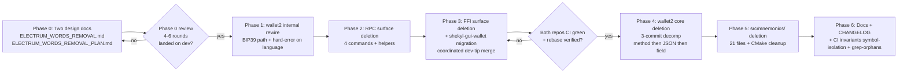

# Electrum-words removal — multi-phase plan

## Sequencing rationale

B-1 (Electrum-words removal) is **independent** of the Stage 1
Rust-migration PR series (Refresh Engine, Pending TX Engine,
Key Engine, etc.) and **independent** of the wallet2 cluster
(B-2/C-1/C-3/C-4/C-5 stop-gap migration) and the B-3
architectural workstream (Rust owns wallet-file orchestration).
The independence is by inspection:

- **Stage 1 PR 4 (Refresh Engine)** touches `wallet2.cpp` refresh
  paths and `wallet2_ffi.cpp` refresh-related FFI surface. B-1
  touches `wallet2.cpp` mnemonic/seed-management paths (lines
  600 + 660–661 + 669 in `parse_wallet_create_data` JSON helper —
  the only Phase 1 rewire site in `wallet2.cpp`; note: NOT
  lines 600–669 as a range covering generate/restore; the
  `wallet2::generate` / `wallet2::restore_from_keys` overloads
  at lines 5933, 6021, 6058, 6106 do NOT have Electrum-words
  branches per the substrate §2.2 corrected inventory; 1362–1435
  method bodies — deleted wholesale in Phase 4 Commit A,
  including the `wallet2::get_seed` body at line 1372 which
  Phase 1's dispatch-branch rewire leaves dead-but-extant;
  4793–4802 + 5344–5347 JSON ser/de — deleted in Phase 4
  Commit B) and `wallet2_ffi.cpp` generate/restore/query_key
  surface (line 648 dispatch branch implementation rewired in
  Phase 1; case label persists per substrate §4.5).
  **Functional non-overlap; merge-conflict surface empirically
  zero**, verified at each phase's branch-cut.

- **Stage 1 PR 5 (Pending TX Engine)** touches `wallet2.cpp`
  transfer-pipeline paths and `wallet2_ffi.cpp` transfer FFI
  surface. B-1 does not touch transfer paths. **Functional
  non-overlap.**

- **wallet2 cluster (B-2/C-1/C-3/C-4/C-5)** is the stop-gap
  migration of password-KDF / sign-message / encrypt-decrypt /
  cn_fast_hash domain-separation paths. B-1 is the Electrum-words
  deletion path. No shared call sites; no shared FFI surface.

- **B-3 architectural workstream** (Rust owns wallet-file
  orchestration) is the longer-term migration that subsumes the
  wallet2 cluster's stop-gap shapes. B-1's `wallet2::generate()`
  disposition (a) — retain orchestrator role — is itself a stop-gap
  for the B-3 architectural target. When B-3 lands, the B-1 (a)
  shape becomes dead intermediate code that B-3 deletes.

B-1 lands now because:

1. **Pre-genesis discount.** Per
   `15-deletion-and-debt.mdc` and `16-architectural-inheritance.mdc`,
   the pre-V3-launch migration path is `rm -rf ~/.shekyl` and
   re-sync. Pre-genesis, structural-deletion work is bounded;
   post-genesis, it requires migration tooling that runs forever
   to handle state that exists for a finite period.

2. **No external-audit dependency.** Electrum-words deletion is
   project-internal; BIP39 is the well-vetted industry standard
   already in production via `shekyl-crypto-pq::bip39` (which is
   itself a vendored implementation of BIP-0039). Phase 0 design
   and author review is the audit-of-record.

3. **Cross-repo migration scope is minimal.** Pre-flight
   (2026-05-19) confirms the cross-repo migration matrix has one
   active consumer (shekyl-gui-wallet). shekyl-mobile-wallet and
   shekyl-web are future consumers that pick up the post-deletion
   FFI surface without migration work in this PR series.

4. **The discipline-application timeline.** Per
   `16-architectural-inheritance.mdc`'s "continuous discipline
   as inheritance prevention" framing, each pre-genesis deletion
   PR shrinks the surface that future PRs have to migrate.
   Deferring B-1 to V3.x defers the discipline pay-back and
   compounds the migration cost.



Decision diamonds match the LWMA-1 / RandomX-v2 plan structure:
`R0` gates code-landing on Phase 0 review-rounds close; `R1`
gates Phase 4+ on the cross-repo Phase 3 cutover being verifiably
clean.

Phases 1, 2, 4, 5, 6 are sequential by deletion-leaf dependency
— the mnemonics subsystem leaf (Phase 5) cannot delete cleanly
until its callers (Phases 1–4) are gone; the wallet2 core methods
(Phase 4) cannot delete cleanly until their RPC/FFI callers
(Phases 2, 3) are gone; the RPC/FFI callers (Phases 2, 3) cannot
delete cleanly until the wallet2 internal use (Phase 1) is
rewired. Phase 3 sits in the middle because it is the cross-repo
atomic-cutover phase that gates everything depending on FFI
removal.

## Permanent architectural decisions

These decisions are made now and locked. The substrate doc
[`ELECTRUM_WORDS_REMOVAL.md`](./ELECTRUM_WORDS_REMOVAL.md) §4
carries the substantive disposition rationale; the entries below
are the **plan-level** decisions (PR shape, sequencing, cutover
mechanism) that the substrate doc's §4 references rather than
restates.

### 1. Five or six implementation PRs after Phase 0

Five or six PRs total post-Phase 0, depending on Phase 6's
fold-in disposition resolved at Phase 5 close (per §6.3 below):
Phase 1 (wallet2 internal), Phase 2 (RPC), Phase 3 (FFI +
cross-repo), Phase 4 (wallet2 core), Phase 5 (mnemonics
subsystem), Phase 6 (docs + CI). Phase 6 is bundled with Phase
5's PR if the docs delta is small (five PRs total post-Phase 0);
if the CHANGELOG entry plus the two CI scripts plus the
USER_GUIDE/DESIGN_CONCEPTS sweep is large, Phase 6 is its own
sixth PR (six PRs total post-Phase 0). Determined at Phase 5
close, not pre-decided here.

Each PR fits `06-branching.mdc` rule 2 (short-lived; expected
< 5 working days; < 10 commits).

The substrate doc's §1 framing ("Phase 0 plus five-to-six
implementation PRs") and the mermaid diagram above (six
implementation-phase nodes P1–P6) both reflect this five-or-six
shape consistently.

### 2. Cross-repo coordination at Phase 3 only

Phase 3 is the sole cross-repo coordination phase. Phases 1,
2, 4, 5, 6 are shekyl-core internal and have no cross-repo
implications. This minimizes the cross-repo blast radius to a
single boundary.

### 3. Pre-genesis cutover mechanism (coordinated dev-tip merge)

Per substrate §5.3. Documented here at plan level so the Phase
3 PR description can cite this section.

### 4. PR 4 / PR 5 merge-conflict gates as verification, not blocking

Per substrate §1 (Sequencing rationale) and the PR-4 / PR-5
checks in todos `phase3` and `phase4`: verification gates, not
blocking. If conflict surface is found at branch-cut time, the
phase rebases against dev tip; the phase does not wait for PR
4 / PR 5 to complete unless rebase is non-trivial.

### 5. Phase 1 hard-error inversion

Per substrate §4.3. Phase 1's behavior is signature-preserving,
hard-error on non-empty `language` parameter. Not silently-ignored.
This is the discipline-correct disposition for pre-genesis;
the alternative (graceful degradation) is the production-software
default that leaks into pre-genesis when not explicitly inverted.

### 6. shekyl-mobile-wallet / shekyl-web consumption freeze convention

Per substrate §3.3 and §5.1. During Phase 0 → Phase 3 flight,
neither repo initiates wallet2_ffi consumption work. If a repo's
roadmap forces this during flight, the matrix re-expands per
substrate §3.3.

## Phase 0 — Two design docs

**Status.** Landed. Phase 0 design docs landed on `dev` as PR #55
(merge commit `60943cb16`, 2026-05-19); pre-Phase-1 substrate
amendments folding §§4.7 / 4.8 / 4.10 fixes back landed as PR #56
(merge commit `5bd34f2a1`, 2026-05-19). Phase 0 closed within the
`20-rust-vs-cpp-policy.mdc` 4–6-round target on the substrate's
terms (see PR #55 + PR #56 review threads).

**Scope.** Write
[`ELECTRUM_WORDS_REMOVAL.md`](./ELECTRUM_WORDS_REMOVAL.md)
(substrate) and this plan doc. Both must close the Phase 0
review cycle (target 4–6 rounds per
`20-rust-vs-cpp-policy.mdc`'s migration-is-a-planning-activity
discipline) before any deletion code lands.

**Closure criteria:**

1. Both docs land on `dev` after the review cycle.
2. Substrate §4 architectural decisions are unchallenged through
   at least one no-changes review round.
3. Plan doc's todo list reflects the final phase decomposition;
   no late-stage phase additions or splits.

**Branch:** `feat/electrum-words-removal-phase0-design` (already
cut, off `dev` tip 2026-05-19 = post-RandomX-v2-Phase-1 +
post-LWMA-1-Phase-4 + post-Batch-α PRs #46/47/48 merge).

## Phase 1 — wallet2 internal rewire + BIP39 entropy persistence

**Status.** Landed on `dev` as PR #57 (merge commit `3c787df86`,
2026-05-19). Three-commit landing: implementation
(`827ea7ea9` — wallet2 BIP-39 rewire + `m_bip39_entropy`
persistence + hard-error language-parameter discipline) + post-
merge-review Copilot-fix layer (`b71ecd892` — `scan_from_height`
ordering preservation across `wallet->clear()`, `load_keys_buf`
throw-vs-return symmetry on malformed `bip39_entropy`,
`epee::wipeable_string` end-to-end materialisation through to
`account_base::generate_from_bip39`, JSON-escape-helper for the
`wallet_bip39.cpp` test harness, plus a Rust-side
`clippy::uninlined_format_args` fix in `bip39.rs`) + dependency-
discipline FOLLOWUPS layer (`04cfcec5c` — V3.1.x entry tracking
the `cargo audit` `RUSTSEC-2023-0089` (`atomic-polyfill 1.0.3`
unmaintained, transitive via `heapless` / `postcard`) and
`RUSTSEC-2025-0141` (`bincode 1.3.3` unmaintained, dev-only via
`iai-callgrind`) advisories with per-advisory upstream-readiness
gates and dedicated dep-housekeeping-PR scope). Branch lifetime
<1 working day against the `06-branching.mdc` rule-2
≤5-working-day window.

The substrate orchestration (BIP-39 phrase validation + entropy
extract → `m_account.generate_from_bip39` → entropy-persist →
keys-file-create) was inlined into `parse_wallet_create_data` via
a friend namespace function rather than a public
`wallet2::generate_from_bip39` member. The existing
`tests/unit_tests/wallet_storage.cpp` CI tripwire defending the
absence of `wallet2::generate_from_bip39` is preserved by design
per substrate §4.10.1 + the `wallet2.cpp` deletion-at-Rust-rewrite-
Phase-5 disposition recorded in `docs/FOLLOWUPS.md` §"V3.1+ Legacy
C++ → Rust rewrite scope".

Phase 1 is preparatory: the `src/mnemonics/` subsystem, the
`wallet2::{is_deterministic,get_seed,get_seed_language,
set_seed_language}` methods, the `seed_language` field, the
`COMMAND_RPC_GET_LANGUAGES` / `…RESTORE_DETERMINISTIC_WALLET` /
`get_wallet_words` RPCs, and the `wallet2_ffi_*` deletion targets
all remain in the tree pending Phases 2–5. Phase 6 will add the
comprehensive `### Removed` CHANGELOG entry citing all phase
merge SHAs.

**Scope:** signature-preserving rewire of the Electrum-words call
sites in wallet2 (per substrate §2.2 corrected inventory) +
addition of `m_bip39_entropy` wallet2 state field + public
read-only accessor `wallet2::bip39_entropy()` + keyfile JSON
ser/de (per substrate §2.3 + §4.10) + rewire of the
`query_key("mnemonic")` dispatch branch implementation at
`wallet2_ffi.cpp:648` and the equivalent RPC handler to call
`shekyl_bip39_mnemonic_from_entropy` directly via the FFI (per
substrate §4.5 + §4.10) + hard-error on non-empty `language`
parameter (per substrate §4.3) + tests. Phase 1 is the
discovery-point phase: consumer code that passes non-empty
`language` parameter breaks here, not at Phase 3. After Phase 1,
`wallet2::get_seed` is dead-but-extant (the only call sites — the
FFI and RPC dispatch branches — were rewired to call the FFI
directly), and Phase 4 Commit A deletes it per substrate §2.2.

**Detailed work items:**

1. **Add `m_bip39_entropy` field + JSON ser/de** (per substrate §4.10):
   - Add `std::optional<crypto::secret_bytes<32>> m_bip39_entropy;`
     to `src/wallet/wallet2.h` alongside other long-term-secret
     fields.
   - Add JSON write of `bip39_entropy` (hex-encoded) in the
     `store_keys`-encrypted JSON envelope build path
     (`src/wallet/wallet2.cpp` around the existing
     `seed_language` JSON write at L4793–4802, but as a
     separate field NOT replacing seed_language at this phase).
   - Add JSON read of `bip39_entropy` in the `load_keys` JSON
     parse path (`src/wallet/wallet2.cpp` around the existing
     `seed_language` JSON read at L5344–5347).
   - The two ser/de additions are net-new code; they coexist
     with `seed_language` ser/de which Phase 4 Commit B deletes.

2. **Add the fifth FFI function `shekyl_bip39_mnemonic_to_entropy`**
   (per substrate §4.10 + §3.1):
   - Rust-side: add `pub fn entropy_from_mnemonic(words: &str) ->
     Result<Zeroizing<[u8; SHEKYL_BIP39_ENTROPY_BYTES]>,
     CryptoError>` to `rust/shekyl-crypto-pq/src/bip39.rs`.
     Delegates to upstream `bip39::Mnemonic::to_entropy()` +
     enforces 32-byte length.
   - FFI: add `#[no_mangle] pub unsafe extern "C" fn
     shekyl_bip39_mnemonic_to_entropy(words_ptr, words_len,
     out32_ptr) -> bool` to `rust/shekyl-ffi/src/account_ffi.rs`.
   - C header: add the matching declaration to
     `src/shekyl/shekyl_ffi.h`.

3. **Rewire `parse_wallet_create_data` JSON helper** at
   `src/wallet/wallet2.cpp:600` (per corrected substrate §2.2):
   replace `crypto::ElectrumWords::words_to_bytes(field_seed,
   recovery_key, old_language)` with the BIP39 path that:
   (a) calls `shekyl_bip39_validate(field_seed)`;
   (b) calls `shekyl_bip39_mnemonic_to_entropy(field_seed) →
   entropy`;
   (c) **threads `field_seed_passphrase` (read from JSON at
   `wallet2.cpp:606–611`, currently consumed by
   `cryptonote::decrypt_key`) to
   `shekyl_account_generate_from_bip39(field_seed,
   field_seed_passphrase, ...) → account material`** per
   substrate §4.5.1 Surface A. The JSON field name
   `seed_passphrase` is preserved; the consumed-as semantic
   shifts from Monero-encrypt_key to BIP39-PBKDF2-HMAC-SHA512.
   The line range 606–611 (the `cryptonote::decrypt_key(recovery_key,
   field_seed_passphrase)` call site) is deleted as part of
   this rewire — the passphrase now lives inside the BIP39
   derivation rather than being applied post-hoc to the
   spend secret.
   (d) populates `recovery_key` from account material;
   (e) populates `m_bip39_entropy` from (b).
   Also delete L660–661 (deprecated-wallet detection via
   `get_is_old_style_seed` + `old_language_name`) and L669
   (`wallet->set_seed_language(old_language)`).

   - **No new wallet2 public methods.** The orchestration chain
     (validate → entropy-extract → account-generate →
     entropy-persist → keys-file-create) inlines into
     `tools::generate_from_json` (the JSON-restore-from-phrase
     path) per substrate §4.10.1. Implementation-shape choice
     (friend access vs. narrow private setter accessible via
     friend) is commit-author discretion provided no
     `wallet2::generate_from_bip39`-shaped public method is
     introduced. The audit-trail tripwire at
     `tests/unit_tests/wallet_storage.cpp:42–144` enforces this
     at CI build time; the FOLLOWUPS.md
     §"V3.1+ Legacy C++ → Rust rewrite scope" entry on
     `wallet2 has no generate_from_bip39 entry point` is the
     load-bearing architectural artifact.

4. **Add public accessor `wallet2::bip39_entropy()`** in
   `src/wallet/wallet2.h` alongside other read-only accessors
   (per substrate §2.3 + §4.5):

   ```cpp
   const std::optional<crypto::secret_bytes<32>>& bip39_entropy() const
   { return m_bip39_entropy; }
   ```

   The accessor returns a const reference to the new field — no
   copying of secret bytes, no caller-side ownership of a buffer.
   It is the read-side counterpart to the keyfile-load path that
   populates `m_bip39_entropy`. The dispatch-branch rewire in
   item 5 calls this accessor.

5. **Rewire `query_key("mnemonic")` dispatch branch
   implementation** at `src/wallet/wallet2_ffi.cpp:648` (per
   substrate §4.5 + §4.10) **plus hard-error on non-empty
   passphrase** (per substrate §4.5.1 Surface B):

   - Today the branch reads `wallet->get_seed(out_phrase,
     passphrase)` (which goes through
     `crypto::ElectrumWords::bytes_to_words`).
   - **New first check** (per substrate §4.5.1 Surface B):
     inspect the dispatch's `passphrase` parameter; if non-empty
     (i.e., `passphrase != nullptr && passphrase[0] != '\0'`,
     mirroring the §4.3 hard-error inversion at the
     `language` parameter), return a hard error:
     `"the 'passphrase' parameter is not meaningful when querying
     the BIP-39 mnemonic phrase. The passphrase is consumed during
     phrase-to-seed derivation (see query_key passphrase semantics
     in the BIP-39 spec), not during phrase emission. Pass an empty
     passphrase to retrieve the phrase."` Empty / nullptr /
     zero-length is the only accepted value. The RPC layer does
     not expose this parameter (RPC `query_key` request struct
     carries only `key_type`), so the hard-error surface is
     FFI-only.
   - After the passphrase check the branch reads
     `wallet->bip39_entropy()` (item 4's accessor); if the
     optional is unset, returns the §4.10 hard error
     (`"this wallet was not created from a BIP-39 mnemonic; the
     mnemonic phrase is not available"`); otherwise calls
     `shekyl_bip39_mnemonic_from_entropy(entropy_value.data(), …)`
     directly via the FFI and copies the phrase into the
     dispatch's output buffer using the cross-boundary
     zeroization contract from substrate §4.7.
   - The dispatch case label `"mnemonic"` is unchanged.

   The equivalent rewire applies to the `query_key("mnemonic")`
   dispatch inside `src/wallet/wallet_rpc_server.cpp` (same
   shape: read accessor + call FFI + emit phrase). The
   passphrase hard-error does **not** apply at the RPC level
   because the RPC request struct does not carry the parameter;
   the FFI-level hard-error is the sole surface. Both rewires
   land in the same atomic commit because they exercise the
   same architectural change.

   **`wallet2::get_seed` is NOT re-implemented in Phase 1.** Its
   declaration at `wallet2.h:1002` and body at `wallet2.cpp:1372`
   are left dead-but-extant after this rewire (the only call
   sites — the FFI and RPC dispatch branches — no longer call
   them). Phase 4 Commit A deletes both per substrate §2.2's
   inventory.

6. **Hard-error on non-empty `language` parameter** at the FFI
   entry sites (per substrate §4.3): `wallet2_ffi_create_wallet`
   (`src/wallet/wallet2_ffi.cpp:309`) and
   `wallet2_ffi_generate_from_keys` (`src/wallet/wallet2_ffi.cpp:523`)
   return a hard error (`WALLET_RPC_ERROR_CODE_UNKNOWN_ERROR` or
   equivalent) if `language != nullptr && language[0] != '\0'`.
   Empty / nullptr / zero-length is the only accepted value.
   Function signatures are preserved at Phase 1; Phase 3 drops
   the parameters entirely.

7. **Delete `#include "mnemonics/electrum-words.h"`** from
   `src/wallet/wallet2.cpp:79`. The other two include sites
   (`wallet2_ffi.cpp:38`, `wallet_rpc_server.cpp:64`) remain until
   their respective phases.

8. **Add `tests/unit_tests/wallet_bip39.cpp`** per substrate §7.3
   (BIP39 round-trip tests: generate via new path → query seed
   via `query_key("mnemonic")` → restore from that phrase →
   assert wallets identical; entropy-persistence-roundtrip via
   keyfile save/load).

9. **Add `tests/unit_tests/wallet_bip39_residency.cpp`** per
   substrate §7.4 (cross-boundary zeroization invariant; concrete
   test-pattern design is Phase 1 implementation-time
   sub-deliverable per §7.4's Round-3 fold-in — no extant pattern
   to inherit; the Phase 1 commit message + test file land as the
   load-bearing implementation reference).

10. **V6 — 25-word-restore error-message UX hint** (per the
    end-to-end function walk's V6 verification item). The
    helper wraps the BIP39 validation error path used by the
    `parse_wallet_create_data` JSON helper's BIP39 rewire (work
    item 3 above); when the input phrase is exactly 25 words,
    the wrapper surfaces a user-friendly hint pointing at the
    BIP-39 requirement:

    ```text
    Shekyl uses 24-word BIP-39 mnemonics. 25-word phrases from
    other wallets (Monero, CryptoNote-based projects) are not
    compatible — Shekyl begins at its own genesis and does not
    support legacy seed formats. See docs/USER_GUIDE.md for the
    BIP-39 seed format details.
    ```

    The 25-word-detection is a word-count check on the user's
    input before BIP39 validation; the hint is a wrapper around
    the generic BIP39 validation error from
    `shekyl_bip39_validate`. The hint is purely UX (a more
    informative error message); the underlying behavior is
    unchanged from substrate §4.6 (25-word phrases always
    produce a BIP39 validation error).

    **Placement rationale.** V6 was originally scoped as a
    Phase 6 docs item alongside the user-facing documentation
    sweep. It folds into Phase 1 on **cohesion grounds**: the
    helper is the user-facing wrapper around the BIP39
    validation error that Phase 1 introduces, and the
    implementation site (`wallet2.cpp` near
    `parse_wallet_create_data`) is already touched by work
    item 3's atomic commit. Landing V6 here means the error
    message ships in lockstep with the BIP39 path it wraps;
    landing it in Phase 6 would leave a multi-PR window during
    which 25-word restore attempts produce a bare BIP39
    validation error without the disambiguating hint. The
    UX-cost outweighs the architectural-cleanliness preference
    for a strictly-architectural Phase 1 commit; the helper is
    a small surface (single function in
    `wallet2.cpp`-or-adjacent) and does not enlarge the
    commit's architectural scope.

    Test coverage in `tests/unit_tests/wallet_bip39.cpp`
    includes a negative case: a known 25-word phrase produces
    the V6 hint (not a bare BIP39 validation error).

**Single atomic commit (Round-3 fold-in disposition per substrate
§4.10 + Round-3 reviewer Finding 2):**

Earlier plan-doc drafts proposed a four-commit decomposition
(rewire / routing / hard-error / tests). Round-3 review surfaced
that this decomposition opens a silent-ignore window: between the
rewire commit and the hard-error commit, calling with
`language="English"` produces a working BIP39 wallet with the
language parameter silently ignored — the exact anti-pattern
substrate §4.3 inverts. The disposition collapses to one
architecturally-atomic commit:

```text
wallet: rewire wallet2 to BIP39 with entropy persistence and hard-errors

  Phase 1 atomic deliverable for B-1 Electrum-words removal per
  docs/design/ELECTRUM_WORDS_REMOVAL.md §4.10 (entropy persistence)
  + §4.3 (language hard-error) + §4.5 (dispatch-branch rewire to
  Rust BIP39 via FFI; wallet2::get_seed left dead-but-extant until
  Phase 4 Commit A) + §4.5.1 Surface A (thread seed_passphrase
  through BIP39 PBKDF2) + §4.5.1 Surface B (hard-error on non-empty
  passphrase at query_key("mnemonic")).

  - Add m_bip39_entropy wallet2 state field + keyfile JSON ser/de.
  - Add public read-only accessor wallet2::bip39_entropy() returning
    const std::optional<crypto::secret_bytes<32>>&.
  - Add shekyl_bip39_mnemonic_to_entropy FFI + Rust bip39
    entropy_from_mnemonic.
  - Rewire wallet2.cpp:600 parse_wallet_create_data ElectrumWords
    branch to BIP39 path; thread field_seed_passphrase (from JSON
    field "seed_passphrase") to shekyl_account_generate_from_bip39
    per §4.5.1 Surface A. JSON field name preserved; semantic
    shifts from Monero-encrypt_key to BIP39-PBKDF2-HMAC-SHA512.
  - Rewire query_key("mnemonic") dispatch branch implementation at
    wallet2_ffi.cpp:648 and the equivalent RPC handler to read
    wallet.bip39_entropy() and call shekyl_bip39_mnemonic_from_entropy
    directly via FFI (case label "mnemonic" persists).
  - Hard-error query_key("mnemonic") FFI dispatch on non-empty
    passphrase parameter per §4.5.1 Surface B (passphrase has no
    meaning at phrase-emit time under BIP39).
  - Hard-error wallet2_ffi_create_wallet /
    wallet2_ffi_generate_from_keys on non-empty language parameter
    per §4.3.
  - V6 — wrap the BIP39 validation error path in
    parse_wallet_create_data to surface a 24-vs-25-word UX hint
    when the input phrase is exactly 25 words. Folded into Phase 1
    on cohesion grounds per work item 10 placement-rationale
    (helper wraps the BIP39 validation error this phase introduces).
  - Delete include "mnemonics/electrum-words.h" from wallet2.cpp.
  - Tests: wallet_bip39.cpp (round-trip + entropy persistence +
    passphrase round-trip positive case for §4.5.1 Surface A +
    passphrase hard-error negative case for §4.5.1 Surface B +
    V6 25-word-hint negative case) + wallet_bip39_residency.cpp
    (cross-boundary zeroization invariant).
```

The commit is large (~600–900 LoC delta across ~8 files) but
architecturally atomic — every change is the same architectural
change at a different surface. Bisecting any individual sub-piece
out produces a non-buildable intermediate state (e.g., rewiring
`parse_wallet_create_data` without `m_bip39_entropy` field
leaves `m_bip39_entropy = ...` referring to a non-existent field;
rewiring the dispatch branch without the public accessor leaves
the dispatch unable to read the entropy).

**Tests-in-commit discipline.** Tests land alongside the
implementation in the same commit per substrate §7.3 / §7.4 and
per Round-3 reviewer Finding 8. The earlier four-commit
decomposition's tests-last shape was bisect-passes-by-absence-of-test;
the atomic-commit shape is bisect-passes-by-positive-verification.

**PR scope:** shekyl-core only. shekyl-gui-wallet sees the
hard-error at runtime; the gui-wallet fix lands in the Phase 3
coordinated migration PR.

**Phase 1 implementation-time verification items (per substrate
§4.10 + §4.5.1 + the end-to-end function walk):**

- **V3 — Hardware-wallet path interaction with `m_bip39_entropy`.**
  Trezor / Ledger restore paths must be verified to not
  accidentally populate `m_bip39_entropy` (the hardware device
  manages the seed off-host; the phrase is recoverable from the
  device, not from wallet2 state). Inspection scope: any wallet2
  code that constructs `account_base` from device-side material;
  any FFI entry that bridges to `shekyl_account_generate_from_*`
  for device-restore. Expected outcome: `m_bip39_entropy` remains
  unset after device-restore; `query_key("mnemonic")` hard-errors
  on device-restored wallets (consistent with §4.10 partial-coverage
  state).
- **V4 — Keyfile encryption envelope correctness for `m_bip39_entropy`
  JSON ser/de.** Verify that the new `m_bip39_entropy` JSON entry
  lives inside the password-encrypted `keys` blob (the
  `store_keys`-encrypted JSON envelope, chacha20 with the wallet
  password-derived key), not inside the cache file or any plaintext
  envelope. Inspection scope: the JSON write path's `json` object
  (the one passed to the encryption path) vs other JSON objects
  in `wallet2.cpp` that might be tempting copy-targets. Expected
  outcome: a `hexdump` of the keyfile shows no plaintext hex
  representation of the entropy; the entropy is only recoverable
  via the password-derived key path.

These verification items are commit-author responsibilities at
Phase 1 implementation time, not pre-implementation design rounds.
Their resolution lands as part of the Phase 1 commit's test
coverage (V3 → device-restore negative test case asserting
`query_key("mnemonic")` hard-errors; V4 → keyfile-on-disk
inspection test asserting entropy bytes do not appear in plaintext
in the on-disk keyfile).

**Branch:** `feat/electrum-words-removal-phase1-wallet2-rewire`
off `dev`.

## Phase 2 — RPC surface deletion

**Status.** Surfaced on the branch
`feat/electrum-words-removal-phase2-rpc-deletion` as
[PR #58](https://github.com/Shekyl-Foundation/shekyl-core/pull/58)
(2026-05-19). Seven commits landed on the branch:

1. `5eb778cde` — `wallet-rpc: delete restore_deterministic_wallet
   RPC + handler + helpers`
2. `72312af2c` — `wallet-rpc: delete get_languages JSON-RPC method`
3. `011745d70` — `wallet-rpc: drop language field from
   create_wallet/generate_from_keys`
4. `255ea0abb` — `wallet-rpc: drop seed-recovery branch from
   stop_background_sync`
5. `9b4481101` — `wallet-rpc: drop electrum-words.h include +
   delete tests/functional_tests/`
6. `663b48394` — `docs: record Phase 2 actuals (functional_tests
   deleted, not migrated)` (plan-doc / substrate / CHANGELOG
   actuals-vs-draft reconciliation)
7. *Phase 2 closure pass* (this commit) — `docs/USER_GUIDE.md`,
   `docs/WALLET_RPC_RUST.md`, `docs/SHEKYLD_PREREQUISITES.md`,
   `docs/design/RANDOMX_V2_RUST.md` stale-doc cleanup;
   `docs/FOLLOWUPS.md` V3.2 `stop_background_sync` entry
   reframed (Electrum-words branch is gone; the work is now
   "add a BIP-39 / raw-seed entry in the Rust JSON-RPC server"
   rather than "replace the existing branch") + new V3.1
   "Shekyl-native end-to-end wallet/daemon test harness"
   entry filed against the deleted `tests/functional_tests/`;
   plan-doc Phase 2 Status subsection added.

The seven-commit shape replaces the originally planned five-commit
shape because (a) work item 9 was reassessed at implementation
time from "migrate functional tests" to "delete
`tests/functional_tests/` outright" + a docs closeout commit (see
work item 9's Disposition flip note below) and (b) the closure
pass per `91-documentation-after-plans.mdc` audited the wider
docs surface for stale references to the deleted RPC methods and
the deleted Python harness, which Phase 0's plan-doc draft did
not pre-enumerate. Awaiting CI / Copilot review / merge to dev.

**Scope:** delete the Electrum-words RPC commands and their
handlers in `wallet_rpc_server`.

**Detailed work items:**

1. Delete `COMMAND_RPC_GET_LANGUAGES` struct
   (`src/wallet/wallet_rpc_server_commands_defs.h:2074`) and its
   handler.
2. Delete `COMMAND_RPC_RESTORE_DETERMINISTIC_WALLET` struct
   (`src/wallet/wallet_rpc_server_commands_defs.h:2223`) and its
   handler at `src/wallet/wallet_rpc_server.cpp:4162–4225`
   (the `words_to_bytes` / `get_is_old_style_seed` /
   `is_valid_language` / `bytes_to_words` calls + explanatory
   comments).
3. Delete the `get_wallet_words` handler at
   `src/wallet/wallet_rpc_server.cpp:2214,2220`.
4. Delete the language-validation branches at
   `src/wallet/wallet_rpc_server.cpp:3661, 4082`
   (the `is_valid_language(req.language)` validation in
   `on_create_wallet` and `on_generate_from_keys`).
5. **G2 — Delete `set_seed_language` call sites + `language`
   request-struct fields on surviving RPC commands** (per
   substrate §2.4 G2 row):

   - Delete `wal->set_seed_language(req.language)` at
     `src/wallet/wallet_rpc_server.cpp:3688` (`on_create_wallet`)
     and `src/wallet/wallet_rpc_server.cpp:4088`
     (`on_generate_from_keys`). These are paired with the
     validation-branch deletions in work item 4; deleting only
     the validation branch would leave the `set_seed_language`
     call referencing the about-to-be-deleted `req.language`
     field.
   - Delete the `language` field from
     `COMMAND_RPC_CREATE_WALLET::request` and
     `COMMAND_RPC_GENERATE_FROM_KEYS::request` structs in
     `src/wallet/wallet_rpc_server_commands_defs.h`. The
     request-schema change forces a JSON-parse-error on any
     caller that supplies a `language` field — matches the §4.3
     hard-error discipline at the FFI layer. Consumers that
     pass `language="English"` see immediate breakage rather
     than silent ignore (the production-software
     graceful-degradation default §4.3 inverts).

6. **G1 — Delete `on_stop_background_sync` seed-based recovery
   branch** (per substrate §2.4 G1 row):

   - Delete the entire `if (!req.seed.empty()) { ... }` block at
     `src/wallet/wallet_rpc_server.cpp:2316–2366` (the
     `words_to_bytes` call + the explanatory comments at
     2345–2362 documenting the path as mainnet-broken-today).
   - Delete the `seed` and `seed_offset` fields from
     `COMMAND_RPC_STOP_BACKGROUND_SYNC::request` in
     `src/wallet/wallet_rpc_server_commands_defs.h`.
   - Password-only `stop_background_sync` survives unchanged
     (the password code path is the load-bearing surface in
     production).
   - A BIP39 seed-recovery replacement for
     `stop_background_sync` is a `docs/FOLLOWUPS.md` V3.2 item,
     not B-1 scope. If the V3.2 item lands, it adds a new
     BIP39-aware seed-recovery branch; it does not resurrect
     the Electrum-words path.

7. Delete `#include "mnemonics/electrum-words.h"` from
   `src/wallet/wallet_rpc_server.cpp:64`.
8. The `COMMAND_RPC_QUERY_KEY` mnemonic-string-routing branch is
   **left unchanged in Phase 2** (Round-3 + Round-4 fold-in
   resolution).

   Earlier plan-doc drafts deferred this to Phase 2 implementation
   time pending a routing decision. Substrate §4.5 already decided
   it: the dispatch label `"mnemonic"` persists indefinitely;
   Phase 1's atomic commit rewires the dispatch branch's
   implementation (both at the FFI layer in
   `src/wallet/wallet2_ffi.cpp:648` and in the RPC handler in
   `src/wallet/wallet_rpc_server.cpp`) to read
   `wallet.bip39_entropy()` and call
   `shekyl_bip39_mnemonic_from_entropy` directly via the FFI.
   Phase 2 makes no further change to either dispatch — the
   re-routing is already done by Phase 1, and the dispatch case
   label is the load-bearing external interface per substrate
   §4.5's string-key disposition.

9. **G7 disposition reassessed at Phase 2 implementation time:
   delete `tests/functional_tests/` outright instead of
   migrating.** (Pre-flight findings, 2026-05-19.)

   The plan-doc draft above proposed migrating 12 (actually 28)
   `restore_deterministic_wallet(seed=..., language=...)` call
   sites and 3 (actually 4) `stop_background_sync(seed=...)`
   call sites under `tests/functional_tests/` to the surviving
   `generate_from_keys` / password-only paths. Pre-flight
   investigation surfaced four blockers that flipped the
   disposition from migrate to delete:

   - The harness invokes `monerod` and `monero-wallet-rpc`
     binaries that do not exist in the Shekyl tree
     (`shekyld` and `shekyl-wallet-rpc`).
   - `tests/functional_tests/CMakeLists.txt:79` silently skipped
     `functional_tests_rpc` and `check_missing_rpc_methods` in
     the CI environment because `requests` / `psutil` /
     `monotonic` / `deepdiff` Python deps were absent at
     `cmake` configure time. The harness was not running in CI
     and had not been running for the lifetime of the Shekyl
     tree; no caller depended on it.
   - `shekyl-wallet-rpc` has no `--regtest` / `--fakechain`
     flag and defaults to mainnet network type even when
     bound to a `shekyld --regtest` daemon. The
     `shekyl_account_generate_from_raw_seed` FFI rejects the
     `(mainnet, raw)` pair per
     `rust/shekyl-crypto-pq/src/account.rs`'s permitted
     network/seed-format matrix, so any migrated test that
     restored a wallet on the regtest daemon would
     fail-closed at the FFI layer. Wiring a network-mode flag
     into `shekyl-wallet-rpc` is a separate planning activity
     under `20-rust-vs-cpp-policy.mdc`, not Phase 2 scope.
   - Even with the above three resolved, the harness would
     still be Monero-shaped end-to-end — file structure,
     Python 2 / 3 compat residue, ad-hoc daemon orchestration —
     and would warrant a Shekyl-native rewrite under its own
     design doc, not a "while we're here" revival here.

   Per `15-deletion-and-debt.mdc` ("default: delete; code with
   no live caller, code that handles state that doesn't exist
   — all of it goes"), the Phase 2 disposition is: delete
   `tests/functional_tests/` outright, drop
   `add_subdirectory(functional_tests)` from
   `tests/CMakeLists.txt`, rewrite the Functional tests
   section of `tests/README.md` to record the deletion + a
   pointer to the future Shekyl-native harness as a separate
   planning activity. The Shekyl-native end-to-end harness
   (`shekyld` + `shekyl-wallet-rpc` with raw-seed restore on
   testnet/fakechain) is recorded as a `docs/FOLLOWUPS.md`
   item; it is not a revival of `tests/functional_tests/`.

**Multi-commit decomposition (7 commits, as landed):**

1. `wallet-rpc: delete restore_deterministic_wallet RPC + handler + helper functions`
2. `wallet-rpc: delete get_languages JSON-RPC method`
   (work item 1; no `get_wallet_words` handler exists in the
   current tree — plan-doc drift versus the live code).
3. `wallet-rpc: drop language field from create_wallet/generate_from_keys`
   (work items 4 + 5; bisect-coupled deletion bundle).
4. `wallet-rpc: drop seed-recovery branch from stop_background_sync`
   (work item 6 / §2.4 G1).
5. `wallet-rpc: drop electrum-words.h include + delete tests/functional_tests/`
   (work items 7 + 9-as-reassessed; the migration originally
   bundled here under work item 9 was replaced with a deletion
   per the disposition above).
6. `docs: record Phase 2 actuals (functional_tests deleted, not
   migrated)` (post-implementation plan-doc / substrate /
   CHANGELOG actuals-vs-draft reconciliation per
   `91-documentation-after-plans.mdc`'s "after any Plan is
   executed, documentation must be read and updated to reflect
   the changes" rule).
7. *Phase 2 closure pass* — wider stale-doc cleanup
   (`USER_GUIDE.md`, `WALLET_RPC_RUST.md`,
   `SHEKYLD_PREREQUISITES.md`, `RANDOMX_V2_RUST.md`),
   `FOLLOWUPS.md` updates (V3.2 `stop_background_sync` entry
   reframed; new V3.1 Shekyl-native test-harness entry), and
   plan-doc Phase 2 Status subsection. Surfaced during the
   PR-pending interval while CI / Copilot review proceed; lands
   on the same branch rather than being deferred to a separate
   docs-only PR per the discipline of recording Phase 2
   actuals against the same review surface that's already
   open for the Phase 2 RPC deletions.

Commit 3 bundles three deletions because they are bisect-coupled:
work items 4 (the `is_valid_language(req.language)` validation
branches at lines 3661 and 4082), 5 (the
`wal->set_seed_language(req.language)` calls at lines 3688 and
4088), and the `language` request-struct fields all reference
the same field. Deleting only the validation branch leaves
`set_seed_language(req.language)` referencing the same field;
deleting only the call leaves the field validated-but-unused;
deleting only the field breaks both surviving sites. All three
must land together for bisect-cleanliness; the commit title
reflects the full scope.

**PR scope:** shekyl-core only. The project's
`rust/shekyl-rpc-server` does not bind these legacy RPC commands
(per pre-flight grep, 2026-05-19), so no consumer impact at the
Rust-wrapper layer. The in-tree `rust/shekyl-engine-rpc` wrapper
also does not consume the deleted RPC commands (it wraps
`wallet2_ffi` directly, not the JSON-RPC layer; the FFI
migration lands in Phase 3 per substrate §3.2.0).
Third-party `wallet-rpc` clients that depend on these RPC
commands (none known) would see RPC method-not-found errors at
the moment of attempted use. Internal Python functional tests
are deleted outright per work-item-9 reassessment, not migrated.

**Branch:** `feat/electrum-words-removal-phase2-rpc-deletion`
off `dev`.

## Phase 3 — FFI surface deletion + shekyl-gui-wallet migration

**Scope:** the cross-repo atomic-cutover phase per substrate §5.

### 3.1 shekyl-core PR work items

C++ FFI surface deletion:

1. Delete `wallet2_ffi_restore_deterministic_wallet` declaration
   (`src/wallet/wallet2_ffi.h:98–104`) and definition
   (`src/wallet/wallet2_ffi.cpp:414–431`).
2. Drop the `language` parameter from `wallet2_ffi_create_wallet`
   (signature change; declaration at `src/wallet/wallet2_ffi.h:87`,
   definition at `src/wallet/wallet2_ffi.cpp:309–319`).
3. Drop the `language` parameter from
   `wallet2_ffi_generate_from_keys` (signature change; declaration
   at `src/wallet/wallet2_ffi.h:113`, definition at
   `src/wallet/wallet2_ffi.cpp:523–527`).
4. Delete the language-list export at
   `src/wallet/wallet2_ffi.cpp:1197–1198`.
5. Delete all remaining `crypto::ElectrumWords::*` calls in
   `wallet2_ffi.cpp` (the `is_valid_language` and `words_to_bytes`
   calls in the deleted functions).
6. Delete `#include "mnemonics/electrum-words.h"` from
   `src/wallet/wallet2_ffi.cpp:38`.
7. Update FFI consumer tests (any test that calls
   `wallet2_ffi_create_wallet` / `wallet2_ffi_generate_from_keys`
   with a `language` argument): drop the argument.

**In-tree Rust consumer migration — `rust/shekyl-engine-rpc/`**
(per substrate §3.2.0 G5; atomic with C++ FFI work items 1–7
above — the `extern "C"` declaration and the C++ FFI definition
are two ends of one wire and cannot land separately without
producing a non-buildable intermediate state). Numbered as a
sub-list within the same §3.1 work-item scope:

1. **`rust/shekyl-engine-rpc/src/ffi.rs:57`** — drop the
   `language: *const c_char` parameter from the
   `extern "C" fn wallet2_ffi_create_wallet(...)` declaration
   (matches C++ work item 2 above).
2. **`rust/shekyl-engine-rpc/src/ffi.rs:72`** — delete the entire
   `extern "C" fn wallet2_ffi_restore_deterministic_wallet(...)`
   declaration (matches C++ work item 1 above; the C++ function
   no longer exists after this PR, so the Rust extern must also
   disappear).
3. **`rust/shekyl-engine-rpc/src/ffi.rs:82`** — drop the
   `language: *const c_char` parameter from the
   `extern "C" fn wallet2_ffi_generate_from_keys(...)`
   declaration (matches C++ work item 3 above).
4. **`rust/shekyl-engine-rpc/src/engine.rs:195–280`** — update
   the three Rust wrapper functions consumed by the daemon-side
   wallet engine:
   - `engine::create_wallet(...)`: drop the `language: &str`
     parameter from the wrapper signature; update the FFI call
     site to match the new C-ABI signature (no `language`
     argument).
   - `engine::restore_deterministic_wallet(...)`: delete the
     entire wrapper function. Callers either no longer exist
     (per cross-tree audit at Phase 3 branch-cut) or migrate
     to the BIP39-aware restore entry that lives in
     shekyl-gui-wallet's Rust code (which calls
     `shekyl_account_generate_from_bip39` directly via the
     Rust crate).
   - `engine::generate_from_keys(...)`: drop the
     `language: &str` parameter from the wrapper signature;
     update the FFI call site.
5. **Audit in-tree callers** of the three wrapper functions in
   sub-item 4. Run
   `git grep -E 'engine::(create_wallet|restore_deterministic_wallet|generate_from_keys)'`
   against `shekyl-core`; update each call site to match the
   new signatures (drop `language` arguments; replace any
   `restore_deterministic_wallet` call with a BIP39-aware
   equivalent or with `generate_from_keys` per the call site's
   intent). If a call site cannot trivially migrate, document
   the migration as a sub-work-item in this PR rather than
   deferring (deferring would leave an unbuildable intermediate).

### 3.2 shekyl-gui-wallet PR work items (coordinated sibling)

In the `shekyl-gui-wallet` repository, on a parallel branch:

1. `src-tauri/src/wallet_bridge.rs::create_wallet` drops
   `language` parameter; signature becomes
   `create_wallet(wallet_path, password)`. Updates the FFI call
   to match.
2. `src-tauri/src/wallet_bridge.rs::restore_deterministic_wallet`
   wrapper deleted in its current form. Replaced with a wrapper
   around the BIP39 restore entry. The Rust-side caller routes
   through `shekyl_account_generate_from_bip39` on the shekyl-core
   side (since `wallet2_ffi_restore_deterministic_wallet` no
   longer exists).
3. `src-tauri/src/commands.rs` Tauri command signatures lose
   their `language: Option<String>` parameters on import / create
   / restore flows (lines 498, 618, 666).
4. `SeedInfo { seed, seed_language }` data structure loses the
   `seed_language` field (line 64, 72, 527, 598, 652, 703).
5. UI flows that show a "select seed language" picker before
   wallet creation are deleted.
6. UI flows that show a 25-word display for backup are repointed
   to the BIP39 24-word display.
7. `Cargo.toml` shekyl-core pin updates to the post-Phase-3-merge
   `dev` SHA on shekyl-core.

### 3.3 Cutover mechanism

Per substrate §5.3 (coordinated dev-tip merge for pre-genesis):

**Verified pin mechanism (Round-3 fold-in correction).**
shekyl-gui-wallet's `src-tauri/Cargo.toml` uses Cargo **path
dependencies**: `shekyl-ffi = { path = "../../shekyl-core/rust/shekyl-ffi" }`,
`shekyl-engine-rpc = { path = "../../shekyl-core/rust/shekyl-engine-rpc" }`,
etc. There is no version pin, no git-submodule pin, no
`refs/tags/` pin in the Cargo manifest. Cross-repo coordination
happens at the **workflow file** layer: shekyl-gui-wallet's
`.github/workflows/{ci.yml,release.yml}` execute
`git clone --depth 1 --branch dev https://github.com/Shekyl-Foundation/shekyl-core.git ../shekyl-core`
to materialize a sibling checkout that the path dep resolves to.
The pin granularity at workflow run time is the dev-tip — there
is no commit-hash pin or refs/tags pin in the workflow's clone
command.

Earlier plan-doc drafts described the cutover via "Cargo.toml
pin update to post-merge dev SHA" — that framing was wrong; the
actual mechanism is dev-tip-clone in the workflow, with the
correctness of the pair (shekyl-core dev tip, shekyl-gui-wallet
dev tip) maintained by the merge-order discipline below.

**Cutover sequence:**

1. shekyl-core PR opens against `dev` with §3.1 work items.
2. shekyl-gui-wallet migration PR opens against
   `shekyl-gui-wallet`'s `dev` with §3.2 work items. PR body
   cites the shekyl-core PR by URL. For shekyl-gui-wallet PR's
   **local development** verification — building gui-wallet
   against the not-yet-merged shekyl-core PR — the developer
   checks out the shekyl-core PR branch as the sibling
   `../shekyl-core/` directory. For shekyl-gui-wallet PR's **CI**,
   either: (a) the workflow file remains unchanged and CI clones
   `--branch dev` (which until shekyl-core merges still points at
   the pre-deletion FFI; gui-wallet CI then fails to compile
   against pre-deletion FFI for any post-deletion call-site
   change, surfacing the cross-repo dependency at CI time but
   before shekyl-core merges); OR (b) the gui-wallet PR includes
   a single throwaway commit pinning the workflow's clone to the
   shekyl-core PR's branch
   (`git clone --branch feat/electrum-words-removal-phase3-ffi-cutover ...`),
   reverted after shekyl-core merges. The substrate disposition
   is **(b)** — explicit branch-pin commit in the gui-wallet PR
   that is reverted as part of the post-shekyl-core-merge dev-tip-repoint
   step. This gives gui-wallet's CI a green
   verification against the FFI surface gui-wallet expects to
   exist post-cutover, before either repo merges.
3. Both PRs run CI to green.
4. **Merge order is shekyl-core first, then shekyl-gui-wallet
   within the same session.** Concretely: (a) CI green on both
   PRs and reviewer-approval on both PRs are the prerequisites;
   (b) shekyl-core merges to `dev`; (c) shekyl-gui-wallet PR
   adds a follow-up commit reverting the temporary workflow pin
   from §step-2(b) back to `--branch dev` (mechanical
   single-file revert; the now-merged shekyl-core `dev` tip
   already contains the FFI deletion); (d) shekyl-gui-wallet's
   CI re-runs against `--branch dev` (which now resolves to the
   post-merge shekyl-core tip); (e) shekyl-gui-wallet merges.
   The intent is to confine the cross-repo inconsistency window
   to a single failure mode (gui-wallet `dev` references
   freshly-deleted FFI symbols, producing immediate compile
   failure on any local build that has a stale
   `../shekyl-core/` checkout during the gap) rather than the
   reversed order's failure mode (gui-wallet `dev` references
   not-yet-existing FFI symbols, allowing silent linker
   resolution against pre-deletion shekyl-core artifacts in
   stale build caches). The chosen order's failure mode is loud
   and bounded to the gap window; the reversed order's failure
   mode is silent and risks shipping pre-deletion shekyl-core
   binaries against post-deletion gui-wallet code.

**Note on path-dep brittleness.** The Cargo path-dep mechanism
means there is no compile-time SHA-pinning of gui-wallet to a
specific shekyl-core commit. Two consequences:

- Developer-local builds depend on whatever shekyl-core dev tip
  the developer has checked out in `../shekyl-core/`. This is
  not a Phase 3 problem (it's the pre-existing development
  posture); the Phase 3 cutover only exacerbates the brittleness
  during the merge gap.
- CI clones `--branch dev` at workflow run time. The pin
  granularity is "whatever dev is at clone time." Phase 3's
  merge-order discipline (shekyl-core first, then gui-wallet
  with workflow-pin revert) preserves the CI-green-against-cutover
  property despite the absence of SHA-level pinning.

Stronger CI pinning (e.g., gui-wallet workflow pins to a
shekyl-core commit hash recorded in `.shekyl-core-pin` file
checked into the gui-wallet repo) is **not** introduced in V3.0
— the team-scale and merge-discipline cost-benefit per substrate
§3.3 honor-system framing applies here too. Post-genesis, the
discipline may need automation if the team scales; the
disposition is re-opened per the substrate's reversion clauses
if cross-repo coordination friction surfaces empirically.

### 3.4 Reversion mechanism

Per substrate §5.4 (commit-revert in coordinated order). If a
revert is needed:

1. shekyl-gui-wallet revert PR restores Electrum-words consumption.
2. shekyl-core revert PR restores the FFI surface.
3. Verify both repos compile + tests pass against the post-revert
   `dev` tip.

### 3.5 Pre-flight check: PR 4 / PR 5 merge-conflict surface

Before opening the Phase 3 PR, run:

```sh
git log --oneline -- src/wallet/wallet2_ffi.cpp src/wallet/wallet2_ffi.h \
  $(git merge-base HEAD origin/dev)..origin/dev
```

Audit the output for commits that touch lines in the deletion
sites enumerated in §3.1 (lines 98–104 for `wallet2_ffi.h`;
lines 309–319, 414–431, 523–527, 1197–1198 for `wallet2_ffi.cpp`).
If overlap exists, rebase against `dev` tip; if not, proceed.

**Multi-commit decomposition (shekyl-core PR, 5 commits).**
Each C++-FFI-deletion commit pairs with the in-tree Rust
consumer migration in the same commit (extern declaration +
wrapper change atomic with the C++ definition deletion per
substrate §3.2.0):

1. `wallet-ffi: delete wallet2_ffi_restore_deterministic_wallet (C++ + shekyl-engine-rpc extern + wrapper)`
2. `wallet-ffi: drop language parameter from create_wallet (C++ + shekyl-engine-rpc extern + wrapper)`
3. `wallet-ffi: drop language parameter from generate_from_keys (C++ + shekyl-engine-rpc extern + wrapper)`
4. `wallet-ffi: delete language-list export + remaining ElectrumWords calls`
5. `wallet-ffi: cleanup mnemonics/electrum-words.h include + audit in-tree shekyl-engine-rpc callers`

The pairing discipline (each C++ deletion commit carries its
matching Rust-side change) means commits 1–3 each touch both
`src/wallet/wallet2_ffi.{h,cpp}` and
`rust/shekyl-engine-rpc/src/{ffi.rs,engine.rs}`. The
alternative (separate "C++ deletion" then "Rust extern
cleanup" commits) produces a non-buildable intermediate state
between the two commits — the Rust extern would reference a
non-existent C symbol — which violates the bisect-clean
discipline.

**Multi-commit decomposition (shekyl-gui-wallet PR, 5–6 commits):**

1. `ci: temporarily pin shekyl-core clone to feat/electrum-words-removal-phase3-ffi-cutover` (per §3.3 step 2(b); reverted in step 6)
2. `wallet-bridge: drop language parameter from create_wallet`
3. `wallet-bridge: migrate restore_deterministic_wallet to BIP39 entry`
4. `commands: drop language parameters and seed_language fields`
5. `ui: remove seed-language picker; update seed display to BIP39 24-word`
6. `ci: revert temporary shekyl-core branch pin back to dev` (per §3.3 step 4(c); lands after shekyl-core's PR has merged to dev)

Commit 6 is the only commit landing after shekyl-core's merge; the
preceding five commits land on the gui-wallet PR branch before
either repo merges, and the workflow-pin commit (1) is what
lets gui-wallet CI prove green against the post-deletion FFI.

**PR scope:** shekyl-core + shekyl-gui-wallet (coordinated unit).

**Branches:**

- shekyl-core: `feat/electrum-words-removal-phase3-ffi-cutover`
  off shekyl-core's `dev`.
- shekyl-gui-wallet: `feat/electrum-words-removal-bip39-migration`
  off shekyl-gui-wallet's `dev`.

## Phase 4 — wallet2 core deletion (3-commit)

**Scope:** delete the wallet2 core methods, JSON ser/de, and
`seed_language` field, per substrate §6 Spec-Gap-6 disposition.

### 4.1 Pre-flight: PR 5 (Pending TX Engine) stabilization gate

Before opening the Phase 4 PR, verify PR 5 has either:

- (a) merged to `dev`, **OR**
- (b) not touched `src/wallet/wallet2.cpp` lines 1300–1450 (the
  method-deletion region) or `src/wallet/wallet2.h` lines
  1000–1011 (the declaration-deletion region).

If conflict surface exists, rebase against `dev` tip after PR 5
lands. Phase 4 does not wait for PR 5 unless the conflict
surface is non-trivial.

### 4.2 Three commits in order

**Commit A — wallet2 method deletion.** Drop:

- `wallet2.h:1001` `bool is_deterministic() const;` declaration.
- `wallet2.h:1002` `bool get_seed(epee::wipeable_string&, const epee::wipeable_string&);` declaration.
- `wallet2.h:1007` `const std::string &get_seed_language() const;` declaration.
- `wallet2.h:1011` `void set_seed_language(...)` declaration.
- `wallet2.cpp:1362` `is_deterministic()` body.
- `wallet2.cpp:1372` `wallet2::get_seed(...)` body. Phase 1's
  rewire of the `query_key("mnemonic")` dispatch branch
  implementation in `wallet2_ffi.cpp:648` (and the equivalent
  RPC handler) already broke the only call sites' dependencies
  on `wallet2::get_seed`, leaving the method dead-but-extant at
  Phase 4's entry. Commit A deletes the body cleanly alongside
  the declaration.
- `wallet2.cpp:1425` `get_seed_language()` body.
- `wallet2.cpp:1433` `set_seed_language()` body.

**Kept in Commit A** (per substrate §4.5 — string-key disposition):

- `wallet2_ffi.cpp:648` `query_key("mnemonic")` dispatch **case
  label** — STAYS. The case label persists as the documented
  external interface per substrate §4.5's string-key disposition.
  The branch's implementation was rewired in Phase 1 to call
  `shekyl_bip39_mnemonic_from_entropy` directly via the FFI,
  reading the entropy via the public `wallet.bip39_entropy()`
  accessor (added in Phase 1); after Phase 1 the dispatch
  branch does not call `wallet2::get_seed` at all, so Commit A's
  deletion of `wallet2::get_seed` does not require any change
  at `wallet2_ffi.cpp:648`. The equivalent RPC handler dispatch
  case label in `wallet_rpc_server.cpp` similarly persists.

(Substrate §2.5 and §4.5 jointly settle the dispatch-site
disposition: the **case label** persists; the **implementation
body** rewires in Phase 1; the underlying **`wallet2::get_seed`
method** deletes in Phase 4 Commit A. Each piece has a single
phase home; no contradictions remain across substrate or plan.)

Also at this commit: delete the legacy CryptoNote-25-word comment
at `wallet2.cpp:6479`.

After Commit A: `seed_language` field is dead state (no setters
/ getters / accessors); JSON ser/de still writes/reads it.

**Commit B — JSON ser/de drop.** Drop:

- `wallet2.cpp:4793–4802` `seed_language` JSON write.
- `wallet2.cpp:5344–5347` `seed_language` JSON read.

Regenerate any touched test fixtures that previously serialized
`seed_language` (e.g., keyfile fixtures under
`tests/data/wallet/*.keys` or `tests/functional_tests/data/`).
At Commit A the field is dead state but JSON ser/de still
roundtrips fixtures cleanly; at Commit B the JSON read no
longer recognizes `seed_language`, so any fixture containing
that field either (a) regenerates without the field via the
post-Phase-1 wallet-creation path, or (b) is hand-edited to
drop the `"seed_language": "..."` entry. The pre-genesis posture
per substrate §7.5 means fixture regeneration is the
discipline-correct path (no production-keyfile concern); the
silently-skip-unknown-field alternative is forward-compat
hygiene that does not buy anything pre-genesis. This is the
spec-gap-6 fold-in disposition.

After Commit B: `seed_language` field is in-memory-only state,
never persisted; all fixtures roundtrip cleanly without the
field.

**Commit C — `seed_language` field deletion.** Drop:

- `wallet2.h:1728` `std::string seed_language;` field.
- All in-memory references to `seed_language` (initializer-list
  removals, any direct field access elsewhere in `wallet2.cpp`).

After Commit C: `seed_language` does not exist anywhere in
wallet2.

Each commit independently green; bisect-clean.

**PR scope:** shekyl-core only. No consumer impact (Phase 3
already migrated the only active consumer; shekyl-gui-wallet
does not access these wallet2 methods directly post-Phase-3).

**Branch:** `feat/electrum-words-removal-phase4-wallet2-core`
off `dev`.

## Phase 5 — Mnemonics subsystem deletion

**Scope:** delete the `src/mnemonics/` subsystem entirely.

### 5.1 Pre-flight verification

Before deleting `src/mnemonics/`, verify by grep that no
non-self-referential consumers remain:

```sh
git grep -E 'mnemonics/electrum-words|crypto::ElectrumWords' \
  -- ':!src/mnemonics/' ':!docs/' ':!tests/unit_tests/mnemonics.cpp'
```

Expected output: empty (all consumers handled by Phases 1–4).
If matches exist, the deletion is unsafe — investigate and
resolve before proceeding.

### 5.2 Deletion work items

1. Delete `src/mnemonics/` entire directory (21 files; see
   substrate §2.1).
2. Update `src/CMakeLists.txt` to drop
   `add_subdirectory(mnemonics)`.
3. Update `src/wallet/CMakeLists.txt` to drop `mnemonics` from
   link dependencies (if listed).
4. Update `tests/unit_tests/CMakeLists.txt` to drop
   `mnemonics.cpp` from test sources.
5. Delete `tests/unit_tests/mnemonics.cpp`.
6. Verify full-tree build is green with the `mnemonics` library
   completely absent: `cmake --build build/ -j$(nproc)`.

### 5.3 Multi-commit decomposition (3–4 commits)

1. `mnemonics: delete src/mnemonics/ directory (21 files)`
2. `build: remove mnemonics library from CMake configuration`
3. `tests: delete unit_tests/mnemonics.cpp and CMakeLists.txt entry`

If the build-system commit and the deletion commit produce a
transient unbuildable intermediate state (e.g., CMakeLists.txt
still references the deleted directory), combine commits 1 and
2 into a single commit. Bisect-cleanliness wins over fine-grained
decomposition here.

**PR scope:** shekyl-core only.

**Branch:**
`feat/electrum-words-removal-phase5-mnemonics-deletion` off
`dev`.

## Phase 6 — Documentation + CI invariants

**Scope:** per `91-documentation-after-plans.mdc` (docs update
after plans) + substrate §7 (CI invariants).

### 6.1 Documentation updates

1. **`docs/CHANGELOG.md`** — add a comprehensive `### Removed`
   entry under `## [Unreleased]`:

   ```markdown
   ### Removed
   - **Electrum-words (CryptoNote 25-word) mnemonic subsystem.** The
     inherited 25-word seed encoding and its 14-language word-list
     infrastructure have been removed from shekyl-core. BIP39 is now
     the sole seed format. Cross-references: `docs/design/ELECTRUM_WORDS_REMOVAL.md`,
     `docs/design/ELECTRUM_WORDS_REMOVAL_PLAN.md`. Phases 1–6 merged
     as PRs #<N1>, #<N2>, #<N3>, #<N4>, #<N5>.
   ```

2. **`docs/USER_GUIDE.md`** (and any other user-facing docs) —
   audit for references to:
   - "25-word seed", "Electrum-words", "seed language"
   - Seed-restoration flows that mention language selection
   - Seed-display flows that show 25 words
   Update to BIP39-only language.

3. **`docs/DESIGN_CONCEPTS.md`** (or equivalent) — audit for
   architectural references to the mnemonic subsystem; update
   to reflect BIP39-only seed flow.

4. **`docs/FOLLOWUPS.md`** — mark the B-1 finding as closed;
   cite Phase 1–6 merge SHAs. Add a V3.2 follow-up item for
   the `stop_background_sync` BIP39 seed-recovery replacement
   per Phase 2 work item 6 (the Electrum-words seed-recovery
   branch was deleted with no immediate BIP39 replacement).

(V6 — 25-word-restore error-message UX hint — folded into
Phase 1's atomic commit per Phase 1 work item 10's
placement-rationale paragraph. Phase 6 inherits no V6 work.)

### 6.2 CI invariants

1. **`tests/symbol_isolation/electrum_words_removed.sh`** — runs
   `nm` against build artifacts; greps for the substrate §7.1
   symbol list; fails build if any symbol matches. Pattern from
   LWMA-1 Phase 4 §7.1 precedent.

2. **`tests/grep_invariants/electrum_words_no_orphans.sh`** —
   runs `git grep -E` for the substrate §7.2 identifier list;
   fails build if any non-allowlisted match exists. Pattern from
   LWMA-1 Phase 4 §7 precedent.

3. Wire both scripts into the CI runner config (Drone / GitHub
   Actions / wherever lints + grep-invariants run today). The
   scripts join the existing LWMA-1 / RandomX-v2 isolation
   invariants.

### 6.3 Decision: PR boundary

If Phase 5's PR carries fewer than ~5 commits, fold Phase 6 into
the same PR as a sixth commit (or commit pair). If Phase 5's PR
is at or near the `06-branching.mdc` rule 2 commit-count limit,
Phase 6 is its own PR.

Decision deferred to Phase 5 close, not pre-decided here.

**Branch:** `feat/electrum-words-removal-phase6-docs-ci-invariants`
off `dev` (if separate PR; otherwise Phase 5 branch carries
Phase 6).

## Reviewer-discipline framing

### No external-audit dependency

Electrum-words deletion is project-internal. BIP39 is the
well-vetted industry standard, deployed for ~13 years across
all major cryptocurrencies. No Monero-funded audit equivalent
applies. Phase 0 design + author-side review + BIP39 round-trip
tests + the memory-residency invariant test are the
audit-of-record.

This matches the LWMA-1 reviewer-discipline framing
(`DAA_LWMA1_PLAN.md` "Reviewer-discipline framing" section):
zawy12-canonical-LWMA-1 was a community-vetted, ~8-year-deployed
specification; BIP39 is similarly a community-vetted,
~13-year-deployed specification. The audit pattern is the same.

### Review round expectations

Phase 0: 4–6 review rounds per
`20-rust-vs-cpp-policy.mdc`'s migration-is-a-planning-activity
discipline. Round 1 (this PR's initial draft) addresses the
critical-gap review surfaced 2026-05-19. Rounds 2+ address
specification refinements + line-number drift + cross-reference
correctness.

Phases 1–6: per-phase Copilot review + author review per the
`06-branching.mdc` default workflow. Each phase PR is bounded
enough that 1–2 review rounds suffice (LWMA-1 Phase 1 closed in
1 round; LWMA-1 Phase 4 took 5 Copilot rounds because of
cross-cutting cutover discipline; B-1's phases are simpler than
LWMA-1 Phase 4).

### Cross-repo review (Phase 3 specifically)

Phase 3's cross-repo coordination is reviewed by:

1. shekyl-core PR review: standard Phase 1–5 reviewer discipline.
2. shekyl-gui-wallet PR review: standard shekyl-gui-wallet
   reviewer discipline (the gui-wallet repo's own
   `.cursor/rules/` apply).
3. Cross-PR coherence review: author confirms the two PRs
   describe the same coordinated migration (cite each other's
   URLs; both reference the substrate doc §3.2.1 migration
   shape).

No new reviewer role is needed for cross-repo work; existing
per-repo discipline suffices when both PRs cite the substrate
doc as the shared specification.

---

*Plan doc end. Substrate-level rationale in
[`ELECTRUM_WORDS_REMOVAL.md`](./ELECTRUM_WORDS_REMOVAL.md).*
