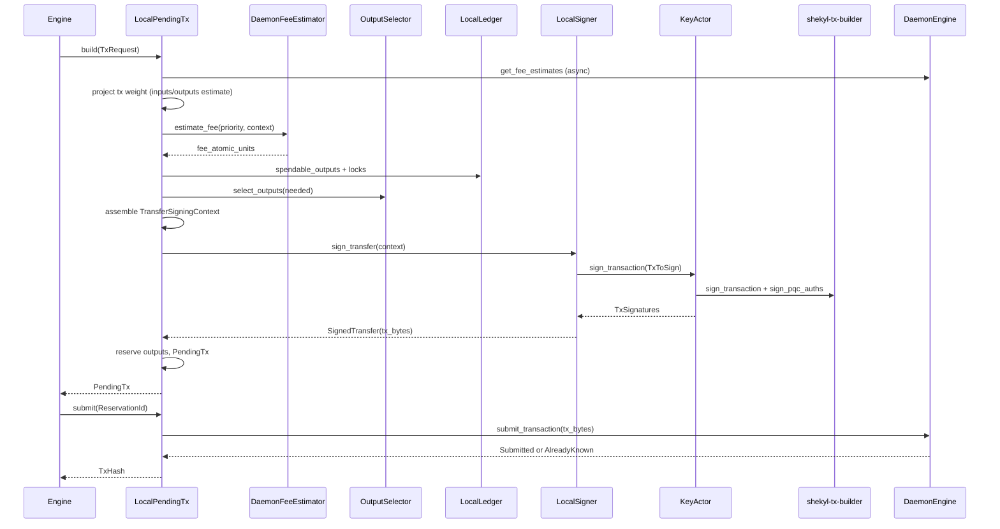

# Phase 2a — refresh + send path (design)

**Status:** Round 0 — specification for implementation.  
**Scope:** Land a **real** transfer on `Engine<S>`: daemon-backed fees, signed
`tx_bytes`, daemon broadcast. Excludes Phase **2b** (stake), **2c**
(addresses/proofs), **2d** (cold bundles), and Phase **6** regtest e2e (tracked
separately; 2a unit/hybrid tests use `TestDaemon`).

**Process:** Per `26-sub-pr-design-discipline.mdc`, adversarial review on this
doc before the first implementation commit. Sub-PRs stay within
`06-branching.mdc` size guidance (~5 files / ~200 lines each where possible).

**Binding constraints:** `00-mission.mdc` (security, privacy), `05-system-thinking.mdc`
(spec-first), `WALLET_REWRITE_PLAN.md` Phase 2a, `STAGE_1_PR_5_PENDING_TX_ENGINE.md`
(pipeline + reservations), `STAGE_2_KEY_ENGINE_ACTOR.md` (sign via actor),
`SHEKYLD_PREREQUISITES.md` §2 (fee RPC present), `V3_WALLET_DECISION_LOG.md`
(fee bucket mapping, no payment IDs).

---

## 1. Definition of done

Phase 2a is **done** when all of the following hold on `dev`:

1. **`Engine::build_pending_tx`** produces a `PendingTx` whose `tx_bytes` are a
   valid, consensus-shaped `RCTTypeFcmpPlusPlusPqc` transfer (not empty), with
   `fee_atomic_units` from the daemon (not `STUB_FEE_ATOMIC_UNITS`), and
   reservation semantics unchanged from Stage 1 PR 5.
2. **`Engine::submit_pending_tx`** publishes those bytes via
   `DaemonEngine::submit_transaction` and returns the daemon-observed `TxHash`
   (not `phase1_tx_hash(ReservationId)`).
3. **`KeyEngine::sign_transaction`** (actor path) is no longer
   `SignTransactionTraitSurfaceIncomplete` for the production transfer workflow;
   `LocalSigner::sign_transfer` routes through the actor.
4. **Fee policy:** `FeePriority` resolves per
   `V3_WALLET_DECISION_LOG.md` (2026-04-25 positional mapping); build refuses
   `TxError::DaemonFeeUnreasonable` when the priority-tier fee exceeds the
   documented ceiling vs economy.
5. **Tests:** Crate tests in `shekyl-engine-core` exercise build → submit with
   `TestDaemon` (non-empty `tx_bytes`, dedup on resubmit). FCMP++ proof bytes are
   validated in existing `shekyl-tx-builder` / KAT layers; 2a does not require
   the Phase 6 live-`shekyld` harness.
6. **Docs:** `WALLET_REWRITE_PLAN.md` Phase 2a todo reflects partial/complete
   status; this doc §10 checklist ticked.

**Not required for 2a:** `shekyl-wallet-core::Wallet` wrapper (Phase 1 orchestrator
crate), production output selector beyond greedy+largest-first, stake-aware
selection, payment-request / `enc_label` wire (subaddress round), Phase 6 regtest
transfer e2e.

---

## 2. Current substrate (already landed)

| Piece | Location | 2a disposition |
|-------|----------|----------------|
| Pending-tx lifecycle (γ shape, snapshots, submit staleness) | `local_pending_tx.rs`, `STAGE_1_PR_5` | **Keep** — wire real fee/sign/broadcast into existing `build_sync` / `submit_sync` bodies |
| `Signer` / `FeeEstimator` / `OutputSelector` traits | `signer.rs`, `fee_estimator.rs`, `output_selector.rs` | **Fill** — replace Phase 1 stubs |
| `DaemonEngine` trait + `FeeEstimates` / `TxSubmitOutcome` | `traits/daemon.rs` | **Implement** on `DaemonClient` |
| `Rpc::get_fee_rate` / `publish_transaction` | `shekyl-oxide` `rpc` | **Use** from `DaemonClient` |
| `shekyl-tx-builder::sign_transaction` | `shekyl-tx-builder` | **Call** from engine after witness assembly |
| `KeyEngine` types (`TxToSign`, `SourceSecretsBundle`, …) | `traits/key.rs` | **Finalize** empty forward-declarations |
| `KeyActor` + `LocalSigner` | `key_actor.rs`, `signer.rs` | **Implement** `SignTransaction` + `sign_transfer` |
| `TestDaemon` fee/submit contract | `test_support.rs` | **Reuse** for hybrid tests |
| Refresh + `apply_scan_result` | `refresh.rs`, `merge.rs` | **Prerequisite** — spendable outputs must exist |

**Explicit stubs to remove:**

| Stub | File |
|------|------|
| `STUB_FEE_ATOMIC_UNITS` in build | `fee_estimator.rs` (`DaemonFeeEstimator`), `pending.rs` (legacy test helper) |
| `TransferSigningContext::phase1_stub` / empty `SignedTransfer` | `signer.rs`, `local_pending_tx.rs` |
| `SignTransaction` → `SignTransactionTraitSurfaceIncomplete` | `key_actor.rs` |
| `DaemonClient::get_fee_estimates` / `submit_transaction` `todo!` | `daemon.rs` |
| `submit_sync` → `phase1_tx_hash` | `local_pending_tx.rs` |
| `build_sync` fee `input_count: 0` | `local_pending_tx.rs` |

---

## 3. Build pipeline (target shape)

### 3.1 Async boundary

`PendingTxEngine::build` / `submit` already return `impl Future + Send`. Phase 2a
**stops** wrapping `std::future::ready(build_sync)` and instead uses an `async`
block that `.await`s daemon RPCs. Mutex discipline unchanged: hold
`PendingTxState` lock only across synchronous ledger/signer steps; **no `.await`
while the mutex is held**.

### 3.2 Daemon handle on `LocalPendingTx`

`Engine` already owns `daemon: D`. Phase 2a adds `daemon: Arc<D>` to
`LocalPendingTx` (cloned at `assemble` from the engine's daemon). Rationale:
submit and fee snapshot share one connection; `DaemonFeeEstimator<D>` holds the
same `Arc<D>`.

### 3.3 Fee estimation (two-pass)

Fee depends on tx **weight**, which depends on **input count**. Stage 1 calls
`estimate_fee` with `input_count: 0` (bug). Phase 2a:

1. **Pass A — weight lower bound:** Use a conservative constant weight for
   `n_in = 1`, `n_out = recipients + 1` (change) to fetch a fee lower bound OR
   use daemon snapshot + `FeeRate::calculate_fee_from_weight` with documented
   constants from `V3_ENGINE_TRAIT_BOUNDARIES.md` / wallet2 parity notes.
2. **Select outputs** for `amount + fee_pass_a`.
3. **Pass B — refined weight:** Recompute weight with actual `n_in =
   selected.len()`, `n_out`, recompute fee; if fee increased, re-run selection once
   (bounded loop, max 2 iterations — document in code).

`Custom(NonZeroU64)` uses caller feerate directly (no daemon tier); still apply
sanity ceiling vs economy tier from the same `get_fee_estimates` snapshot.

**Priority → `FeeRate` mapping** (locked):

| `FeePriority` | `FeeEstimates` field |
|---------------|----------------------|
| `Economy` | `economy` |
| `Standard` | `standard` |
| `Priority` | `priority` |
| `Custom(rate)` | `FeeRate::new(rate, mask)` from snapshot's `standard.mask` or daemon `quantization_mask` |

Implement mapping in `daemon.rs` when composing the three `Rpc::get_fee_rate`
calls into one `FeeEstimates` snapshot (single RPC round-trip: one
`get_fee_estimate` returns all four tiers; wallet reads indices 0, 1, 3 per
decision log).

### 3.4 Signing context assembly

`TransferSigningContext` (Phase 2a) carries **non-secret** build inputs:

- Selected `TransferDetails` indices / public tx metadata (tx hash, output keys,
  amounts, on-chain ciphertexts, FCMP branch data pointers).
- Recipient `Address` + amounts.
- `TreeContext` for FCMP++ (`tree_root` from ledger/daemon at `built_at_height` —
  **must be curve-tree root, not block hash** per `shekyl-tx-builder` docs).
- `fee`, `tx_prefix_hash` inputs.

`LocalSigner::sign_transfer`:

1. Build `TxToSign` from context (populate `TxOutputContext`, `FcmpPlusPlusContext`,
   per-input `TxInputSigningContext`).
2. `key.sign_transaction(&tx_to_sign).await` (new async on handle).
3. Serialize signed material to wire `tx_bytes` (new `shekyl-engine-core` module
   or `shekyl-tx-builder` helper — **spec section 4** pins byte layout owner).

Secret derivation stays **inside** `KeyActor` (`derive_source_secrets_bundle` /
existing M3b primitives) — orchestrator never holds `SourceSecretsBundle`.

### 3.5 `KeyActor::sign_transaction` implementation sketch

1. Validate `TxToSign` (non-empty inputs, output count ≤ `MAX_OUTPUTS`, etc.).
2. For each input: recover secrets via existing key-engine helpers; map to
   `shekyl_tx_builder::SpendInput`.
3. `sign_transaction(...)` → `SignedProofs`.
4. Build transaction skeleton; insert proofs; compute PQC payload hashes;
   `sign_pqc_auths`.
5. Return `TxSignatures` + encoded `tx_bytes` (or return structs and let
   `LocalSigner` encode — prefer **one** encoding site).

Reopen `SignTransactionTraitSurfaceIncomplete` only if a **substrate** gap
remains (e.g. missing FCMP witness in `TransferDetails`); such gaps get a
named FOLLOWUPS row with reversion clause, not a silent stub.

### 3.6 `DaemonEngine::submit_transaction`

1. Parse `tx_bytes` → `Transaction` (strict — malformed bytes →
   `SubmitError::DaemonRejectedTerminal`).
2. `Rpc::publish_transaction(&tx)`.
3. Map daemon response → `TxSubmitOutcome::Submitted { hash }` or
   `AlreadyKnown { hash }` (hash from parsed tx id / daemon fields per
   `V3_ENGINE_TRAIT_BOUNDARIES.md` §2.5).

`TestDaemon` keeps byte-keyed dedup for tests; production uses real hash extraction
once parser lands.

---

## 4. Wire encoding ownership (Round 0 pin)

**Disposition (pending Round 1 review):** Add
`shekyl-tx-builder::encode_signed_transfer(...) -> Vec<u8>` (or a thin
`shekyl-tx-wire` crate) as the **single** encoder from `SignedProofs` +
`TxSignatures` to the blob `submit_transaction` accepts. Rationale: builder already
owns proof layout; avoids duplicating RCT serialization in `shekyl-engine-core`.

If Round 1 finds encoder belongs in `shekyl-io`, amend here before PR 2a-3.

---

## 5. PR decomposition (implementation order)

| PR | Title | Files (indicative) | Delivers |
|----|-------|-------------------|----------|
| **2a-1** | Daemon fee snapshot + broadcast | `daemon.rs`, `fee_estimator.rs`, `local_pending_tx.rs`, `lifecycle.rs`, `test_support.rs` tests | Real fees + `submit_transaction`; async build/submit; `Arc<D>` on pending engine |
| **2a-2** | Signing context + ledger witness plumbing | `signer.rs`, `traits/key.rs`, `local_pending_tx.rs`, `shekyl-engine-state` only if public fields needed | Populated `TransferSigningContext`; tree root + input public data from `TransferDetails` |
| **2a-3** | KeyActor sign + tx-builder + wire encode | `key_actor.rs`, `local_keys.rs`, `shekyl-tx-builder`, new encode helper | Non-empty `tx_bytes`; remove `SignTransactionTraitSurfaceIncomplete` on transfer path |
| **2a-4** | Hybrid send test + doc closeout | `local_pending_tx.rs` / `lifecycle.rs` tests, `WALLET_REWRITE_PLAN.md`, `FOLLOWUPS.md`, `CHANGELOG.md` | End-to-end `TestDaemon` build→submit; checklist §10 |

**Dependency:** 2a-2 and 2a-1 can overlap only if 2a-3 gates on both; default
serial order above.

**FCMP tree fixture:** `transfer_e2e` bench notes missing tree fixture
(`docs/benchmarks/shekyl_rust_v0.manifest.md`). 2a-3 tests use **synthetic**
`TreeContext` + `ProveInput` vectors from existing `shekyl-tx-builder` tests /
KATs, not mainnet chain sync.

---

## 6. Gates and ordering vs other work

| Gate | Relation to 2a |
|------|----------------|
| Subaddress / End-state 5 | **Does not block** 2a single-recipient transfer to a parsed `Address`; blocks Recipient-subaddress KEM stub and payment-request UX (2c) |
| Phase 2b / Stage 3 | **Parallel design only** — no `StakeEngine` code required |
| Stage 4 actor migrations | **After** 2a — daemon actor swap must not block 2a in-process `DaemonClient` |
| Cluster 2 `Hybrid*` types | Orthogonal unless `sign_pqc_auths` needs API churn — verify at 2a-3 pre-flight |

---

## 7. Error surface (no new silent stubs)

| Failure | Error |
|---------|-------|
| Daemon fee RPC down | `SendError::Io` / `FeeEstimatorError::DaemonUnreachable` |
| Absurd priority fee | `SendError::Tx(TxError::DaemonFeeUnreasonable { ... })` |
| Signer / builder failure | `SendError::Tx` or `SendError::CannotSign` |
| Malformed tx at submit | `SubmitError::DaemonRejectedTerminal` |
| Ambiguous daemon | `SubmitError::DaemonAmbiguous` (existing R9 discipline) |

Pre-genesis: **no** fallback to stub fee or synthetic tx hash on production paths.

---

## 8. Test plan

1. **Unit:** `DaemonFeeEstimator` maps each `FeePriority` to distinct fee under
   `TestDaemon::set_fee_estimates`.
2. **Unit:** Sanity ceiling rejects inflated priority fee.
3. **Integration:** `build` → `submit` records one entry in `TestDaemon::submitted_count`;
   retry submit same reservation → `AlreadyKnown`, same hash.
4. **Property (optional in 2a-4):** Parsed tx hash stable across submit retries.
5. **Existing:** `shekyl-tx-builder` unit/property tests remain the FCMP++/BP+
   correctness gate.

---

## 9. Round 0 open questions (for Round 1)

1. **Tx weight model:** Document constants for pass-A weight (cite wallet2 or
   measure one 1-in/2-out template tx).
2. **Encoder location:** Confirm §4 disposition (`shekyl-tx-builder` vs `shekyl-io`).
3. **`TransferDetails` FCMP fields:** Enumerate which ledger fields supply
   `ProveInput` / branch layers (grep-driven table in Round 1).
4. **Change output:** Phase 2a includes one change output when `sum(inputs) >
   amount + fee` (required for real transfers); document subaddress index for change
   (primary / `SubaddressIndex(0)` per rewrite plan).

---

## 10. Review checklist (pre-implementation)

- [ ] §1 definition of done agreed
- [ ] §3.2 `Arc<D>` on `LocalPendingTx` agreed (vs injecting fee-only trait)
- [ ] §3.3 two-pass fee loop bounded and testable
- [ ] §4 wire encoder owner agreed
- [ ] §5 PR split fits branching policy
- [ ] §9 open questions have owners / Round 1 targets
- [ ] `WALLET_REWRITE_PLAN.md` cross-link added when 2a-1 lands

---

## 11. References

- `docs/design/WALLET_REWRITE_PLAN.md` — Phase 2a product requirements
- `docs/design/STAGE_1_PR_5_PENDING_TX_ENGINE.md` — pipeline, reservations, stubs
- `docs/design/STAGE_2_KEY_ENGINE_ACTOR.md` — actor signing route
- `docs/V3_ENGINE_TRAIT_BOUNDARIES.md` — §2.4 `PendingTxEngine`, §2.5 `DaemonEngine`
- `docs/SHEKYLD_PREREQUISITES.md` — §2 `get_fee_estimate`
- `docs/V3_WALLET_DECISION_LOG.md` — fee priority mapping, payment ID dropped
- `rust/shekyl-tx-builder/src/lib.rs` — signing pipeline documentation
