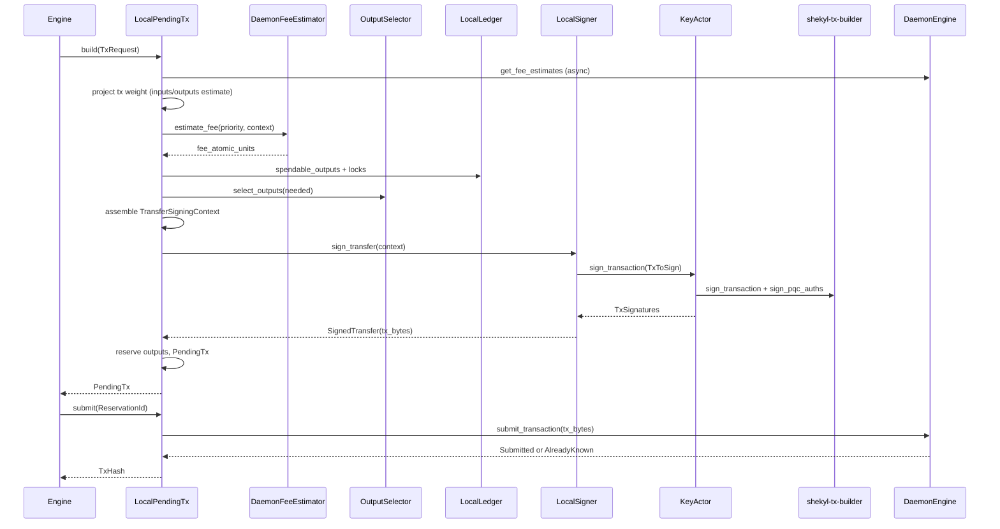

# Phase 2a — refresh + send path (design)

**Status:** Round 0 — specification for implementation.  
**Scope:** Land a **real** transfer on `Engine<S>`: daemon-backed fees, signed
`tx_bytes`, daemon broadcast. Excludes Phase **2b** (stake), **2c**
(addresses/proofs), **2d** (cold bundles), and Phase **6** regtest e2e (tracked
separately; 2a unit/hybrid tests use `TestDaemon`).

**Process:** Per `26-sub-pr-design-discipline.mdc`, adversarial review on this
doc before the first implementation commit. Sub-PRs stay within
`06-branching.mdc` size guidance (~5 files / ~200 lines each where possible).

**Binding constraints:** `00-mission.mdc` (security, privacy), `05-system-thinking.mdc`
(spec-first), `WALLET_REWRITE_PLAN.md` Phase 2a, `STAGE_1_PR_5_PENDING_TX_ENGINE.md`
(pipeline + reservations), `STAGE_2_KEY_ENGINE_ACTOR.md` (sign via actor),
`SHEKYLD_PREREQUISITES.md` §2 (fee RPC present), `V3_WALLET_DECISION_LOG.md`
(fee bucket mapping, no payment IDs).

---

## 1. Definition of done

Phase 2a is **done** when all of the following hold on `dev`:

1. **`Engine::build_pending_tx`** produces a `PendingTx` whose `tx_bytes` are a
   valid, consensus-shaped `RCTTypeFcmpPlusPlusPqc` transfer (not empty), with
   `fee_atomic_units` from the daemon (not `STUB_FEE_ATOMIC_UNITS`), and
   reservation semantics unchanged from Stage 1 PR 5. The FCMP++ membership
   path is built against a **locally-computed** `TreeContext` (§3.0); 2A is done
   when build/sign/encode are correct over that path. **Real-root mainnet
   validity is explicitly gated** on the curve-tree-client prerequisite (§3.0.4)
   **plus** Phase 6 — not on 2A. 2A tests use synthetic path/`TreeContext`
   vectors (§3.0.5, §5).
2. **`Engine::submit_pending_tx`** publishes those bytes via
   `DaemonEngine::submit_transaction` and returns the daemon-observed `TxHash`
   (not `phase1_tx_hash(ReservationId)`).
3. **`KeyEngine::sign_transaction`** (actor path) is no longer
   `SignTransactionTraitSurfaceIncomplete` for the production transfer workflow;
   `LocalSigner::sign_transfer` routes through the actor.
4. **Fee policy:** `FeePriority` resolves per
   `V3_WALLET_DECISION_LOG.md` (2026-04-25 positional mapping); build refuses
   `TxError::DaemonFeeUnreasonable` when the priority-tier fee exceeds the
   documented ceiling vs economy.
5. **Tests:** Crate tests in `shekyl-engine-core` exercise build → submit with
   `TestDaemon` (non-empty `tx_bytes`, dedup on resubmit). FCMP++ proof bytes are
   validated in existing `shekyl-tx-builder` / KAT layers; 2a does not require
   the Phase 6 live-`shekyld` harness.
6. **Docs:** `WALLET_REWRITE_PLAN.md` Phase 2a todo reflects partial/complete
   status; this doc §10 checklist ticked.

**Not required for 2a:** `shekyl-wallet-core::Wallet` wrapper (Phase 1 orchestrator
crate), production output selector beyond greedy+largest-first, stake-aware
selection, payment-request / `enc_label` wire (subaddress round), Phase 6 regtest
transfer e2e.

**Named prerequisite (own phase, not 2a):** the **curve-tree client** — the
wallet-local component that maintains/reconstructs curve-tree leaves from
non-spend-revealing bulk daemon data and assembles its own output's membership
path locally (§3.0.4). 2A consumes a locally-computed path; it does **not**
implement the curve-tree client. Real-root mainnet sends are gated on this
prerequisite + Phase 6.

---

## 2. Current substrate (already landed)

| Piece | Location | 2a disposition |
|-------|----------|----------------|
| Pending-tx lifecycle (γ shape, snapshots, submit staleness) | `local_pending_tx.rs`, `STAGE_1_PR_5` | **Keep** — wire real fee/sign/broadcast into existing `build_sync` / `submit_sync` bodies |
| `Signer` / `FeeEstimator` / `OutputSelector` traits | `signer.rs`, `fee_estimator.rs`, `output_selector.rs` | **Fill** — replace Phase 1 stubs |
| `DaemonEngine` trait + `FeeEstimates` / `TxSubmitOutcome` | `traits/daemon.rs` | **Implement** on `DaemonClient` |
| `get_fee_estimate` JSON-RPC (via `Rpc::json_rpc_call`) / `publish_transaction` | `shekyl-oxide` `rpc` | **Use** from `DaemonClient` — one `get_fee_estimate` call maps all tiers atomically (§3.3), **not** three `get_fee_rate` calls |
| `shekyl-tx-builder::sign_transaction` | `shekyl-tx-builder` | **Call** from engine after witness assembly |
| `KeyEngine` types (`TxToSign`, `SourceSecretsBundle`, …) | `traits/key.rs` | **Finalize** empty forward-declarations |
| `KeyActor` + `LocalSigner` | `key_actor.rs`, `signer.rs` | **Implement** `SignTransaction` + `sign_transfer` |
| `TestDaemon` fee/submit contract | `test_support.rs` | **Reuse** for hybrid tests |
| Refresh + `apply_scan_result` | `refresh.rs`, `merge.rs` | **Prerequisite** — spendable outputs must exist |
| FCMP++ tree primitives + daemon leaf/checkpoint substrate | `shekyl-fcmp::tree`, `curve_tree_leaves`, `curve_tree_checkpoints`, `prune_curve_tree_intermediate_layers` | **Reuse** — local path assembly (§3.0); only gap is a **bulk, non-revealing** leaf-range RPC |
| Curve-tree client (local leaf store + delta sync + local path assembly) | **new phase** (§3.0.4) | **Prerequisite (own phase)** — 2A consumes a synthetic locally-computed path; real-root sends gated on this + Phase 6 |
| `get_curve_tree_path` (per-output Merkle path) | `core_rpc_server` | **Forbidden on send path** — spend-revealing (§3.0.1); daemon-side Rule-60/privacy review is a separate C++ PR |

**Explicit stubs to remove:**

| Stub | File |
|------|------|
| `STUB_FEE_ATOMIC_UNITS` in build | `fee_estimator.rs` (`DaemonFeeEstimator`), `pending.rs` (legacy test helper) |
| `TransferSigningContext::phase1_stub` / empty `SignedTransfer` | `signer.rs`, `local_pending_tx.rs` |
| `SignTransaction` → `SignTransactionTraitSurfaceIncomplete` | `key_actor.rs` |
| `DaemonClient::get_fee_estimates` / `submit_transaction` `todo!` | `daemon.rs` |
| `submit_sync` → `phase1_tx_hash` | `local_pending_tx.rs` |
| `build_sync` fee `input_count: 0` | `local_pending_tx.rs` |

---

## 3. Build pipeline (target shape)



In the diagram, `assemble TransferSigningContext` includes assembling the FCMP++
membership path. Where that path comes from is the foundational decision below
(§3.0); the rest of §3 builds on it.

### 3.0 FCMP++ membership-path data source (F1 — privacy-hierarchy decision)

This section is **upstream** of every other build step: the path's *source*
determines the *shape* of the data the signing context carries (§3.4) and the
*scope* of what 2A can deliver (§1 DoD #1). It is specified first per
`05-system-thinking.mdc` (specify the source, then build the vessel that carries
it — F2).

#### 3.0.1 Decision (binding): the wallet never reveals which leaf it spends

**A per-output curve-tree path query is forbidden for real spends.** The wallet
must never tell the daemon which leaf it is proving membership for.

Rationale (privacy > security > features per `00-mission.mdc`):

- FCMP++ has **no ring**. The anonymity set is the **entire tree**; there is no
  decoy at the wallet↔daemon boundary. This is the Monero `get_outs` lesson
  inverted: `get_outs` fetched a ring's worth of outputs *so the daemon could
  not tell which was real* (the decoys were the cover). `60-no-monero-legacy.mdc`
  deleted `get_outs` because FCMP++ needs no ring — but that same absence means
  there is **nothing to hide behind** if the wallet asks for one specific path.
- The daemon already exposes `get_curve_tree_path(output_indices) -> {path_blob,
  chunk_outputs_blob}` (`core_rpc_server_commands_defs.h
  COMMAND_RPC_GET_CURVE_TREE_PATH`). If the wallet calls it with its real output
  index, the daemon learns **with certainty, before broadcast,** exactly which
  output is being spent — defeating the membership-proof privacy model at the
  one boundary FCMP++ was meant to close.
- Under the priority hierarchy this is decisive regardless of how much cheaper a
  per-output query would be. No per-leaf path query, full stop.

**Disposition of the existing `get_curve_tree_path` endpoint:** it must **not**
be used by the wallet send path. It is flagged for daemon-side Rule-60 / privacy
review as a **separate C++ PR** (acceptable, if at all, only for explicitly
non-private contexts — debug, or an opt-in light-wallet mode that documents the
linkability cost; it is not the default private spend path). Note also that
`DAEMON_RPC_RUST.md` §"Cutover Remaining Work" currently lists "curve tree path
fetch via `/get_curve_tree_path`" as part of the wallet-sync test — that
assumption is now **wrong for private spends** and is corrected by this section.

#### 3.0.2 Privacy-preserving shape: daemon serves bulk, wallet assembles locally

The daemon serves **non-spend-revealing bulk data**; the wallet assembles its
own output's path **locally**. This is the FCMP++ analog of "run your own node,"
and is the correct default for a privacy-maximalist coin.

Concretely the daemon serves:

- **Checkpoint metadata** — `get_curve_tree_checkpoint(height) -> {root, depth,
  leaf_count}` and `get_curve_tree_info -> {root, depth, leaf_count, height}`.
  Global state; reveals nothing about any wallet's spend.
- **Leaf ranges** — contiguous spans of the 128-byte leaf tuples
  (`{O.x, I.x, C.x, h_pqc}`) by canonical tree position (§3.0.3 — the bulk
  endpoint that needs adding).
- **The delta** between the wallet's last local checkpoint and the chosen
  reference block.

The wallet then assembles the path locally using the primitives that **already
exist** in `shekyl-fcmp::tree`:

- `construct_leaf(O, C, h_pqc) -> [u8; 128]` — build a leaf tuple.
- `hash_grow_selene` / `hash_grow_helios` — hash a chunk's children into the
  parent node (Selene at even layers / leaf, Helios at odd layers).
- `selene_point_to_helios_scalar` / `helios_point_to_selene_scalar` — feed a
  layer's node points into the next layer as children.
- `chunk_width(layer)` / `layer_is_selene(layer)` — topology
  (`SELENE_CHUNK_WIDTH` = `LAYER_ONE_LEN`, `HELIOS_CHUNK_WIDTH` = `LAYER_TWO_LEN`).

The daemon-side substrate this leans on **already landed** (Phase 2e/2f):

- `curve_tree_leaves` — `global_output_index → 128-byte {O.x, I.x, C.x, h_pqc}`,
  *all* UTXO leaves preserved (`LMDB_SCHEMA.md` §`curve_tree_leaves`,
  `INTEGERKEY`).
- `curve_tree_checkpoints` — root/depth/leaf_count every
  `FCMP_CURVE_TREE_CHECKPOINT_INTERVAL` (= 10,000) blocks (`FCMP_PLUS_PLUS.md`,
  `cryptonote_config.h`).
- `prune_curve_tree_intermediate_layers` — intermediate layer hashes are
  **recomputable** and may be pruned; **leaves are preserved**. This is exactly
  why "serve leaves + checkpoint roots, recompute layers wallet-side" is sound:
  the layers the wallet recomputes are the same ones the daemon treats as
  derivable.

#### 3.0.3 RPC surface gap (prerequisite addition — bulk, non-revealing)

The doc previously flagged "no RPC for FCMP paths." That gap is **real**, but the
addition is **bulk tree data, not a path-serving endpoint**:

- **Add** `get_curve_tree_leaves { start_index, count } -> { leaves: [128B...],
  reference_block, curve_tree_root, reference_height, leaf_count }` (or
  equivalent), serving a contiguous leaf range plus the anchoring checkpoint
  metadata. Non-revealing **because it is bulk/contiguous** — the daemon cannot
  tell which leaf in the range is a spend (the same way it cannot tell which
  block output a syncing wallet cares about). A maximal client fetches the whole
  range; an incremental client fetches checkpoint + delta.
- This goes to `SHEKYLD_PREREQUISITES.md` **with a KAT** (the KAT asserts that a
  reconstructed root over a known leaf set matches a fixed checkpoint root),
  scoped explicitly to **non-revealing** data.
- It is **not** `get_curve_tree_path` and does not take per-output indices keyed
  to a spend.

**Alternative considered (block-derived leaves, zero new RPC).** The wallet
already scans every block during refresh and can in principle derive every
leaf `{O, C, h_pqc}` itself, eliminating even the bulk endpoint. Rejected as the
2A-prerequisite default because it requires the wallet to replicate the
consensus maturity/drain ordering (`pending_tree_leaves` → drain → `tree_pos`)
exactly, which is consensus-sensitive code. The bulk-leaf endpoint lets the
daemon supply the canonical ordering while still revealing nothing about the
spend. **Reopening clause:** if the curve-tree-client phase finds the ordering
replication cheap and well-tested, the block-derived path is the strictly-more-
private option and may supersede the endpoint.

#### 3.0.4 Wallet-local curve-tree client (named prerequisite, its own phase)

A component — provisionally the **curve-tree client** — that:

1. maintains a local leaf store anchored at a known checkpoint;
2. on a build request, fetches the **delta** (leaves since the local checkpoint
   up to the chosen reference block) via the §3.0.3 bulk endpoint;
3. recomputes the intermediate layers locally via `shekyl-fcmp::tree`;
4. **verifies** the locally-computed root equals the daemon's
   `get_curve_tree_checkpoint` / `get_curve_tree_info` root for that reference
   block (integrity gate — a lying daemon cannot substitute a tree, only deny
   service);
5. extracts the wallet's own output's path: the `leaf_chunk` (the output's
   Selene chunk peers), `c1_layers` (Selene sibling hashes bottom-to-top),
   `c2_layers` (Helios sibling hashes bottom-to-top), and the `TreeContext`
   (`reference_block`, `tree_root`, `tree_depth`).

Privacy invariant: **only bulk/contiguous fetches; never a per-output query.**

This is plausibly its **own phase** given the effort (local tree persistence,
delta sync, reorg handling at the wallet tier, root verification, reference-block
selection). 2A does **not** implement it. The interface 2A codes against is "give
me a verified, locally-computed `{leaf_chunk, c1_layers, c2_layers, TreeContext}`
for output X at reference block B" — satisfied by synthetic vectors in 2A tests
and by the curve-tree client in production.

#### 3.0.5 DoD #1 reframe (honest scoping)

- **2A delivers** assemble + sign + encode against a **locally-computed**
  `TreeContext`/path (synthetic in tests).
- **"Wallet maintains/reconstructs the tree and serves its own paths"** is the
  named curve-tree-client prerequisite (§3.0.4), tracked as its own phase.
- **Real-root mainnet validity** is gated on **(curve-tree client + Phase 6)**,
  not on 2A. This is exactly the F10 framing held in reserve in the adversarial
  pass: the "overstated FCMP validation coverage" concern dissolves once F1 is
  resolved this way — 2A's KAT/synthetic coverage is *honest* about being
  pre-mainnet, and mainnet coverage is explicitly a downstream gate, not a 2A
  claim. F10 is therefore **closed into F1** rather than tracked separately.

#### 3.0.6 What this pins for F2 (the signing-context vessel)

F2's detailed field pass runs **next**, now that source-shape and scope are
fixed. F1 pins these constraints on it:

- `SpendInput.leaf_chunk` / `c1_layers` / `c2_layers` carry **locally-assembled,
  serialized sibling-hash data** — *not* a live handle into a daemon tree, and
  *not* freshly-fetched per-leaf blobs. The signing context therefore carries
  **owned `Vec<[u8; 32]>` layer data**, classified **public** (every sibling
  hash is public chain data; revealing it leaks nothing).
- The only secrets on the spend path remain `spend_key_x`, `spend_key_y`,
  `commitment_mask`, `combined_ss` — these stay **inside `KeyActor`**
  (`SourceSecretsBundle`, derived there). `TransferSigningContext` and `TxToSign`
  carry the **public** path + `TreeContext`; the actor adds secrets internally.
  This satisfies `36-secret-locality.mdc` and `16-architectural-inheritance.mdc`
  (orchestrator holds no per-output secrets).
- Correspondence to pin in F2: `TransferSigningContext` (orchestrator, public
  path + recipients + `TreeContext`) → `TxToSign` (actor input, same public data)
  → actor-internal `SpendInput` (public path **+** derived secrets). The
  `FcmpPlusPlusContext` / per-input `TxInputSigningContext` fields are the carrier
  for the public path data above — F2 enumerates them against `SpendInput`'s
  `leaf_chunk` / `c1_layers` / `c2_layers` exactly.

### 3.1 Async boundary

`PendingTxEngine::build` / `submit` already return `impl Future + Send`. Phase 2a
**stops** wrapping `std::future::ready(build_sync)` and instead uses an `async`
block that `.await`s daemon RPCs. Mutex discipline unchanged: hold
`PendingTxState` lock only across synchronous ledger/signer steps; **no `.await`
while the mutex is held**.

### 3.2 Daemon capabilities on `LocalPendingTx` (least-authority)

`Engine` already owns `daemon: D`. `LocalPendingTx` does **not** take a full
`Arc<D>`. It needs exactly two daemon-derived capabilities, and takes those:

- a **fee-snapshot source** — yields one atomic `FeeEstimates` per build (§3.3);
- a **submitter** — accepts a serialized tx and returns `TxSubmitOutcome` (§3.6).

Both are capability-narrowed handles (cloned from the engine's daemon at
`assemble`), not the daemon trait object. Rationale: `LocalPendingTx` is a
pure build/sign/encode unit; it must not be able to issue arbitrary daemon RPCs
(`get_blocks`, mempool queries, peer ops). Narrowing also keeps the Stage-4
`KeyActor` swap honest — the submitter/fee-source capabilities are what move
behind the actor boundary, not a god-object `Arc<D>`.

**Reopening clause:** if a later build directive genuinely needs a third daemon
capability (e.g. a live curve-tree-path fetch for FCMP++ rebuild, per §3.6
`ProofStale`), add a **named** capability to the pair — never widen back to
`Arc<D>`.

### 3.3 Fee estimation (two-pass)

Fee depends on tx **weight**, which depends on **input count**. Stage 1 calls
`estimate_fee` with `input_count: 0` (bug). Phase 2a:

1. **Pass A — weight lower bound:** Use a conservative constant weight for
   `n_in = 1`, `n_out = recipients + 1` (change) to fetch a fee lower bound OR
   use daemon snapshot + `FeeRate::calculate_fee_from_weight` with documented
   constants from `V3_ENGINE_TRAIT_BOUNDARIES.md` / wallet2 parity notes.
2. **Select outputs** for `amount + fee_pass_a`.
3. **Pass B — refined weight:** Recompute weight with actual `n_in =
   selected.len()`, `n_out`, recompute fee; if fee increased, re-run selection once
   (bounded loop, max 2 iterations — document in code).

`Custom(NonZeroU64)` uses caller feerate directly (no daemon tier), but is
**clamped to a sanity band** from the same atomic snapshot:

- **Floor:** the daemon-reported minimum relay feerate (snapshot `economy` tier
  is the wallet's proxy for min-relay). A `Custom` below the floor would build a
  tx the network drops as below-relay; reject with `BuildError` rather than
  silently producing an unrelayable tx.
- **Ceiling:** a multiple of the `economy`/`standard` tier (existing check) to
  catch fat-finger overpayment.

Both bounds read from the **same** `FeeEstimates` snapshot used for the build, so
the band and the selected feerate are mutually consistent.

**Priority → `FeeRate` mapping** (locked):

| `FeePriority` | `FeeEstimates` field |
|---------------|----------------------|
| `Economy` | `economy` |
| `Standard` | `standard` |
| `Priority` | `priority` |
| `Custom(rate)` | `FeeRate::new(rate, snapshot.quantization_mask)` — mask carried once on the snapshot (see below), clamped to the §3.3 sanity band |

**Atomic single-RPC snapshot.** `DaemonEngine::get_fee_estimates` issues **one**
`get_fee_estimate` JSON-RPC call (via `Rpc::json_rpc_call`), not three
`get_fee_rate` calls. The response carries a fee array plus one
`quantization_mask`; the impl maps the array to all tiers (`economy`,
`standard`, `priority` → indices 0, 1, 3 per decision log) and stores the single
`quantization_mask` **once** on the `FeeEstimates` snapshot. This guarantees the
four-tier band and the `Custom` mask all derive from the same daemon view (no
tier-vs-tier skew from interleaved calls).

`shekyl-rpc` is Shekyl-owned (renamed crate, Shekyl/FCMP++ divergence, primitive
deps only) — if a per-tier mask is ever needed, exposing a `FeeRate::mask()`
accessor is permitted. For Phase 2a the mask is a single snapshot-level quantity,
so it lives on `FeeEstimates`.

### 3.4 Signing context assembly

`TransferSigningContext` (Phase 2a) carries **non-secret** build inputs:

- Selected `TransferDetails` indices / public tx metadata (tx hash, output keys,
  amounts, on-chain ciphertexts, output tree position).
- The **locally-assembled, public** membership path for each selected input —
  `leaf_chunk` + `c1_layers` + `c2_layers` (owned `Vec<[u8; 32]>` data from the
  curve-tree client per §3.0.4/§3.0.6), **not** daemon-fetched-per-leaf blobs and
  **not** a live tree handle.
- Recipient `Address` + amounts.
- `TreeContext` for FCMP++ (`tree_root` = the **locally-computed** curve-tree
  root, verified against the daemon checkpoint per §3.0.4 — **must be curve-tree
  root, not block hash** per `shekyl-tx-builder` docs).
- `fee`, `tx_prefix_hash` inputs.

**Concrete field sets for `TxToSign` / `FcmpPlusPlusContext` /
`TxInputSigningContext` / `TxSignatures` are pinned in §3.7** (the F2 vessel
pass), source-verified against the builder. This subsection is the orchestrator
view; §3.7 is the type-level contract.

`LocalSigner::sign_transfer`:

1. Build `TxToSign` from context (populate `TxOutputContext`, `FcmpPlusPlusContext`,
   per-input `TxInputSigningContext`) — field sets per §3.7.2.
2. `key.sign_transaction(&tx_to_sign).await` (new async on handle). The actor
   runs the **full two-phase sequence in one round-trip** (§3.7.7) and returns a
   complete `TxSignatures`.
3. Serialize signed material to wire `tx_bytes` via the `shekyl-tx-builder`
   `wire`-module adapter into `shekyl-oxide`'s `Transaction::serialize()`
   (**§4** — byte layout owned by `shekyl-oxide`, adapter by `shekyl-tx-builder`).

Secret derivation stays **inside** `KeyActor` (`derive_source_secrets_bundle` /
existing M3b primitives) — orchestrator never holds `SourceSecretsBundle`.

### 3.5 `KeyActor::sign_transaction` implementation sketch

One round-trip, the two-phase ordering absorbed inside the actor (§3.7.7):

1. Validate `TxToSign` (non-empty inputs, output count ≤ `MAX_OUTPUTS`, etc.).
2. For each input: assemble `shekyl_tx_builder::SpendInput` = public path from
   `TxInputSigningContext` (§3.7.2) + engine-derived `SourceSecretsBundle` +
   engine-recovered amount. **C3 precondition check** before proving: recompute
   the leaf (`construct_leaf`), hash the path to the claimed `tree_root`, and
   assert `c1_layers.len() + c2_layers.len() + 1 == tree_depth` (§3.7.6).
3. `sign_transaction(...)` → `SignedProofs` (aggregate `fcmp_proof`; per-input
   `pseudo_outs`; empty `pqc_auths`).
4. Encoder **phase 1** (actor-reachable, §4): build the skeleton (proofs +
   per-input claim-time `key_image` (§3.7.4) + `pseudo_out`), compute per-input
   PQC payload hashes, then `sign_pqc_auths(payload_hashes, inputs)`.
5. Return a complete `TxSignatures` (reshaped per §3.7.3); `LocalSigner` runs the
   single **final** encode → `tx_bytes` (prefer **one** final encoding site).

Secret `Scalar` scratch in steps 2–4 is `Zeroizing` across all exit paths,
including kameo cancellation mid-prove (C5, §3.7.8).

Reopen `SignTransactionTraitSurfaceIncomplete` only if a **substrate** gap
remains (e.g. missing FCMP witness in `TransferDetails`); such gaps get a
named FOLLOWUPS row with reversion clause, not a silent stub.

### 3.6 `DaemonEngine::submit_transaction`

1. Parse `tx_bytes` → `Transaction` (strict — malformed bytes →
   `SubmitError::DaemonRejectedTerminal`).
2. **Compute the tx hash locally** from the serialized transaction
   (`tx_prefix_hash` / id computation over our own bytes). The hash is **always**
   derived from the bytes we submit — **never** read back from a daemon field.
   A remote/untrusted daemon must not be able to influence the id the wallet
   records for its own transaction; the daemon response is consulted only for
   accept/reject/already-known status, not for identity.
3. `Rpc::publish_transaction(&tx)`.
4. Map daemon response → `TxSubmitOutcome::Submitted { hash }` /
   `AlreadyKnown { hash }` (hash = the locally-computed value from step 2) /
   `ProofStale` (see below) / `DaemonRejectedTerminal` / `DaemonAmbiguous`.

**`ProofStale` outcome.** FCMP++ membership proofs are bound to a curve-tree
`tree_root` snapshot (§3.4). Between build and submit the chain can advance and
the daemon can reject the tx because its proof references a root the daemon no
longer treats as valid. This is **not** terminal and **not** a generic
ambiguous failure: it is a distinct, recoverable outcome whose remedy is
**rebuild against a fresh root**, re-sign, and re-submit (the spend selection can
be preserved; only the proof is stale). Phase 2a adds a `ProofStale` variant to
the submit outcome so the caller can drive a bounded rebuild loop rather than
discarding the reservation.

The exact **validity-horizon bound** (how many blocks a built proof stays
submittable before the wallet should pre-emptively rebuild) is **deferred** — see
§9 open question. Phase 2a only needs the reactive `ProofStale` signal; the
proactive horizon is a later refinement.

**Privacy note (remote-daemon origin leak).** When the wallet submits to a
**remote** daemon, that daemon learns the wallet's IP originated this tx, even
though FCMP++ hides the spent output and Dandelion++ obscures *propagation* from
downstream peers. Dandelion++ does **not** hide the originating connection from
the **first-hop** daemon the wallet talks to directly. This is an inherent
property of wallet→daemon submission, not a Phase 2a regression; it is called
out here so the threat model is explicit and so the mitigation surface (local
daemon, Tor/proxy transport) is documented rather than assumed. No code change
in Phase 2a — recorded for the send-path threat model.

`TestDaemon` keeps byte-keyed dedup for tests; production uses local hash
computation (step 2) once the parser/serializer lands.

### 3.7 F2 — signing-context vessel (type design)

§3.0 (F1) pinned **where** the membership path comes from and in what shape
(public, locally-assembled `leaf_chunk` / `c1_layers` / `c2_layers`; secrets in
the engine). F2 pins **the types that carry it** through
`TransferSigningContext` → `TxToSign` → the actor's internal `SpendInput`. The
field sets below are **source-verified** against `shekyl-tx-builder`
(`sign.rs`, `types.rs`), `shekyl-fcmp` (`proof.rs`), and the current
forward-declared shapes in `rust/shekyl-engine-core/src/engine/traits/key.rs`,
so they do not reshape later. C-tags below match the Round-0 F2 constraint set.

#### 3.7.1 C1 — one tree snapshot per tx, made structurally unrepresentable

The per-input `leaf_chunk` / `c1_layers` / `c2_layers` and the shared
`tree_root` **must** all derive from the same reference block. A block arriving
mid-assembly that computed input A against height `H` and input B against `H+1`
yields a mixed-snapshot witness — invalid at best, subtly wrong at worst.

The defence is **type shape, not validation**: `TreeContext { reference_block,
tree_root, tree_depth }` lives **once** on the tx-level `FcmpPlusPlusContext`,
**never** per-input. `reference_block` is selected a single time by the F1
curve-tree client (= `tip − MIN_AGE`, per C2/§3.6 horizon) and threaded
immutably downward; nothing below the client re-reads the tip. Divergent-snapshot
inputs become **impossible to construct**, which is stronger than catching them.
This is the anchor point for F5's validity-horizon (§3.6, §9 #5) and the
`MIN_AGE` spendability bound (C2).

#### 3.7.2 Concrete field sets (pinned under C1)

- **`FcmpPlusPlusContext`** (tx-level, **reshaped from `{}`**):
  - `tree: TreeContext` — the **single** `{ reference_block, tree_root,
    tree_depth }` snapshot for the whole tx (C1).
  - The `signable_tx_hash` / `tx_prefix_hash` the FCMP++ prover binds to is
    **computed in-actor** from the skeleton (C4 step 2), **not** a field here.

- **`TxInputSigningContext`** (per-input, **public**; extends today's
  `{ handle, source_ciphertext, output_index }` — **but `output_index` moves into
  the `handle`-recovered set per refinement C / §3.9, not a standalone field**):
  - `output_key: [u8; 32]`, `commitment: [u8; 32]`, `h_pqc: [u8; 32]` — the
    output's public identity; let the actor locate its own leaf and run the C3
    check. (Maps to `SpendInput.output_key` / `commitment` / `h_pqc`.)
  - `leaf_chunk: Vec<LeafEntry>` — the sibling leaf chunk `(O, I=key_image_gen,
    C, h_pqc)` (maps to `SpendInput.leaf_chunk`).
  - `c1_layers: Vec<Vec<[u8; 32]>>`, `c2_layers: Vec<Vec<[u8; 32]>>` — the
    locally-assembled Selene/Helios branch siblings (maps to
    `SpendInput.c1_layers` / `c2_layers`).
  - **`amount` is NOT here.** It is `OutputClaim.amount_atomic_units` (secret,
    wiped on drop) — it never rides the message; the actor recovers it
    engine-side via `handle` (C5). All fields above are public on-chain data.

- **`TxOutputContext`** (per-output, **reshaped from `{}`**): recipient
  destination (parsed `Address` / one-time dest + KEM context) plus an
  output-kind discriminant. **The two output kinds split by the same locality
  principle that put input amounts engine-side (C5/§3.7.8) — not into "secret
  vs. benign":**

  - **Payment output** — carries `amount` **on the message**, because it has
    **no engine-side source**: the actor can *recover* an input amount from the
    handle, but it cannot recover a user-chosen send amount, so the orchestrator
    must tell it. Classified **confidential** (minimal-lifetime, zeroized),
    **not** "orchestrator-chosen, not a recovered secret" — a future reader must
    not hear "not secret." It crosses because it is **unrecoverable**, not
    because it is benign.
  - **Change output** — carries **no cleartext amount**; the actor computes
    `change = Σinputs − sent − fee` from the recovered-input total it **already
    holds** engine-side, applies the dust-fold rule there, and the orchestrator
    decides only that a change output **exists** (the count/weight input the F4
    fee loop needs), never its value. This extends the input-amount pin one step
    further: change is the output amount most tightly coupled to the values
    already kept off the message; re-passing it on `TxOutputContext` would
    re-duplicate a confidential quantity onto the boundary. **This is locality,
    not access control** — the wallet process legitimately knows its own
    balance, so "engine-side" hides nothing from the orchestrator; the rule is
    *don't duplicate a confidential amount onto the boundary message when its
    natural home already holds it.*

  This defines a small orchestrator↔engine protocol — orchestrator:
  "to-recipient + change-to-self"; engine: compute change, apply dust-fold,
  **report the final output count back** so the orchestrator's weight/fee stays
  correct. That dust/count handshake is part of the **F4 + F8** unit deferred
  behind F1 (§9); pin the locality now, work the handshake in that pass.

  The actor does the ECDH/HKDF → `shekyl_tx_builder::OutputInfo`
  (`commitment_mask`, `enc_amount`, `enc_label` = sentinel at 2a). What defers
  to 2c is the **mechanism** (mask derivation, KEM encap to recipient,
  `enc_amount` formation) and the subaddress-KEM detail — **not** the secrecy
  classification, which is pinned now.

- **`TxToSign`** (top shape unchanged): `{ inputs: Vec<TxInputSigningContext>,
  outputs: Vec<TxOutputContext>, fcmp_plus_plus_context: FcmpPlusPlusContext }`.

The actor assembles `SpendInput` **internally** = public path (from
`TxInputSigningContext`) + engine-derived secrets (`SourceSecretsBundle`:
`spend_key_x` / `spend_key_y` / `commitment_mask` / `combined_ss`) + the
engine-recovered `amount`. `SpendInput` **never** crosses a boundary.

#### 3.7.3 C6 — aggregate proof + per-input openings (reshapes `TxSignatures`)

**Source-verified:** `shekyl_tx_builder::SignedProofs.fcmp_proof` is **one
aggregate `Vec<u8>`** blob over all inputs; `pseudo_outs: Vec<[u8; 32]>` and
`pqc_auths: Vec<PqcAuth>` are **per-input**. `shekyl_fcmp::proof::prove` returns
one `ShekylFcmpProof { data, num_inputs, tree_depth }` + a per-input
`pseudo_outs` vector. `verify(proof, key_images, pseudo_outs, …)` consumes the
proof blob and the per-input openings **separately**.

Therefore the current
`TxSignatures { per_input, fcmp_plus_plus_witnesses: Vec<FcmpPlusPlusWitness> }`
is the **wrong shape** — `Vec<FcmpPlusPlusWitness>` presupposes a per-input
proof object that does not exist. F2 reshapes:

- **`TxSignatures`**:
  - `bulletproof_plus: Vec<u8>` (aggregate range proof),
  - `out_commitments: Vec<[u8; 32]>`, `enc_amounts: Vec<[u8; 9]>`,
    `enc_labels: Vec<[u8; 9]>` (per-output),
  - `per_input: Vec<TxInputSignature>`,
  - `fcmp_proof: Vec<u8>` — the **single aggregate** FCMP++ blob,
  - `reference_block: [u8; 32]`, `tree_depth: u8` (echo for the `rctSig`
    container).
- **`TxInputSignature`** (per-input, **reshaped from `{}`**):
  `{ key_image: KeyImage, pseudo_out: [u8; 32], pqc_auth: PqcAuth }`.
- **`FcmpPlusPlusWitness` is deleted.** A "witness" is a prover *input*
  (`ProveInput`), not a signature *output*; the output is the aggregate
  `fcmp_proof`.

**Fold-in (builder-side, independent of the boundary classification):
`OutputInfo` zeroization gap.** In `shekyl-tx-builder/src/types.rs`, `SpendInput`
has an explicit `Drop` wiping `spend_key_x` / `spend_key_y` / `commitment_mask` /
`combined_ss`, but `OutputInfo` derives only `Clone, Debug, Serialize,
Deserialize` — **no `Drop`, no `Zeroize`**. So the output blinding factor
`commitment_mask` (the `z` whose secrecy *is* that output's commitment-hiding
property) and the cleartext `amount` are **never wiped** — the same class as the
hand-rolled `RecoveredOutput` `Zeroize` that silently omitted fields, and worse
for **change** outputs, where the mask is the wallet's own future-spendable
output's hiding factor. **Add `ZeroizeOnDrop` to `OutputInfo` wiping
`commitment_mask` and `amount`** (leave `enc_amount` / `enc_label` — those are
the public on-chain forms). This lands in the 2a-3 reshape regardless of the
§3.7.2 boundary decision.

#### 3.7.4 C7 — key image: single computation site (source-verified)

The `KeyImage` is computed **once at claim time** — `try_claim_output` →
`OutputClaim.key_image`, via the `shekyl-crypto-pq` derivation (`KI = x·Hp(O)`,
`ki_result.key_image` in `local_keys.rs` / `key_actor.rs` / `scan.rs`).
`KeyImage::from_canonical_bytes` is an explicitly **non-normalizing** wrapper
("caller's responsibility to ensure canonical"), so the canonicalization owner
is the crypto-pq derivation, **not** the wrapper. `verify()` takes `key_images`
**separately** from `fcmp_proof` → the key image is a **distinct tx field**, not
embedded in the proof blob.

**Pin:** builder, actor, and encoder **consume** the claim-time typed
`KeyImage` (sourced via `handle` → claim record); **none recompute or
re-normalize**. `TxInputSignature.key_image` is that value; the encoder places
it in the tx input slot. **Confirm-at-implementation (2a-3):** verify the
crypto-pq derivation emits the sign-bit-canonical encoding so the claim-time
value is wire-canonical and no downstream site ever normalizes (the single-site
guarantee C7 requires).

#### 3.7.5 C2 — spendability gate threads selection → assembly → actor

A leaf is in the tree at the reference block only if `eligible_height ≤
reference_block_height`. Combined with C1, the precise rule is
**`eligible_height ≤ tip − MIN_AGE`** — an output received in the last `MIN_AGE`
blocks is eligible at the tip but **not** at the reference block, so it is not
yet spendable. Enforced at **three** points:

1. **Selection** (output selector, F3/F4 territory): never pick outputs with
   `eligible_height > reference_block_height`.
2. **Path assembly** (F1 client): the leaf is absent at the reference block →
   assembly fails.
3. **Surface:** a clean `BuildError::OutputNotYetSpendable { eligible_height,
   reference_block_height, wait_blocks }`, **not** an opaque assembly miss.

F2's per-input context is where this rule becomes legible — it ties the
deferred-insertion / tree-as-spendability-enforcer decision into the signing
path.

#### 3.7.6 C3 — actor verifies path before proving (robustness, not secrecy)

**Threat precision:** a wrong path **cannot** leak the witness — the proof is
zero-knowledge, so a bad path yields an **invalid tx caught at submit**, not a
secret disclosure. This is **not** a security boundary. It **is** a robustness /
error-attribution boundary worth spending. Before committing prover effort, the
actor cheaply:

- recomputes the leaf via `construct_leaf(O, C, h_pqc)` and hashes the path up to
  the claimed `tree_root` (`hash_grow_selene` / `hash_grow_helios`); and
- checks the well-formedness precondition
  **`c1_layers.len() + c2_layers.len() + 1 == tree_depth`** (layer 0 is the leaf,
  which has no branch entry).

Feeding our modified FCMP++ circuit a malformed path is undefined-behaviour
territory for the prover; the length/shape check **fail-closes** first and turns
"local-assembly bug" and "prover bug" into **distinguishable** errors instead of
one opaque proof failure.

#### 3.7.7 C4 — one actor round-trip absorbing the two-phase ordering (source-verified)

**Source-verified:** `sign.rs` documents the circular dependency, and
`sign_pqc_auths(payload_hashes, inputs)` takes a **caller-computed** payload
hash (caller runs `get_transaction_signed_payload` per input, then Keccak-256).
That hash is external to the **builder**, not to the **actor** — so the whole
sequence collapses into **`KeyActor::sign_transaction`, one round-trip**:

1. builder `sign_transaction(tx_prefix_hash, inputs, outputs, fee, tree)` →
   `SignedProofs` (proofs populated, `pqc_auths` empty);
2. encoder **phase 1**: assemble the skeleton (proofs + per-input `key_image` +
   `pseudo_out`) → `get_transaction_signed_payload` per input → Keccak-256 →
   `payload_hashes`;
3. builder `sign_pqc_auths(payload_hashes, inputs)` → `Vec<PqcAuth>`;
4. assemble the complete `TxSignatures` (the reply).

**Implication for §4 (now closed there):** the adapter's **phase 1** (skeleton +
payload hash) must be **actor-reachable** (it lives in the `shekyl-tx-builder`
`wire` module — §4 — and is called *inside* the actor). The **final** encode
(`TxSignatures` + public tx fields → `tx_bytes`) runs once in `LocalSigner` over
public data; `shekyl-oxide`'s `serialize()` determinism guarantees `LocalSigner`
reproduces the actor's skeleton and appends auths. Splitting the two phases across **two** actor messages is **rejected**: it
drags the PQC signing keys out of the actor's single-task custody and creates a
half-signed intermediate state to manage. F7 and F2 are the same decision viewed
from the type side: the (now non-empty) `TxInputSignature` carries the complete
per-input material produced **in order, in one reply**.

#### 3.7.8 C5 — per-field locality assertion; scratch zeroization routed

The C5 boundary assertion is written **per-field-with-reason**, **not** as a
blanket "`TxToSign` is secret-free." A blanket label leaves a future reader to
re-derive *why* each amount is or isn't on the message, and lets the
change-vs-payment distinction silently collapse. The structural test enforces
the per-field classification:

| Quantity | Home | Why |
|----------|------|-----|
| Input amount | **engine-recovered, off-message** | `OutputClaim.amount_atomic_units` is recoverable via `handle`; don't duplicate it onto the boundary |
| Change amount | **engine-computed, off-message** | `Σinputs − sent − fee`; the input total is already engine-held — locality, one step further (§3.7.2) |
| Payment amount | **confidential, on `TxOutputContext`** | no engine-side source (unrecoverable user choice) → must cross; minimal-lifetime, **zeroized** — *not* labelled "benign" |
| Masks / spend secrets (`x`, `y`, `z`, `combined_ss`) | **engine-only** | never enter the message; derived inside the actor |

So `TxToSign` and `TxSignatures` carry **no secret-bearing field except the
zeroized confidential payment amount** on `TxOutputContext`; `TxSignatures`
(proofs + key images + PQC auths) is fully public. The live failure mode the
test guards: a future maintainer adds a secret-derived field to `TxToSign`
without the matching zeroization — the same class as the hand-rolled `Zeroize`
on `RecoveredOutput` that silently omitted fields. The existing `Debug`-redaction
discipline in `key.rs` stays; the test asserts every secret/confidential field
(today: the payment amount) carries `Zeroize` and every other field is public.
The **`OutputInfo` zeroization fix (§3.7.3)** is the builder-side companion to
this assertion and lands in the same reshape.

The secrets — derived `x`, `y`, source-secret scratch, and the
`curve25519-dalek::Scalar` locals inside `sign_transaction` / `proof::prove` —
**never enter the message**; they live and die inside the actor task. `sign.rs`
already wraps `masks` / `pseudo_masks` in `Zeroizing`; the open Stage-2
requirement F2 routes into the actor-task design is that those `Scalar` locals
must be `Zeroizing` across **all** exit paths, **including kameo cancellation
mid-prove** (the prove scratch must wipe on drop even if the actor future is
cancelled).

#### 3.7.9 The superset / projection framing (load-bearing pair)

- `TransferSigningContext` (orchestrator-side, §3.4) is the **superset**:
  recipients, selected output identities + public paths, the one `TreeContext`,
  fee, and tx-prefix inputs.
- `TxToSign` is the **projection** the actor needs: per-input public
  `{ handle, source_ciphertext, output_index, output_key, commitment, h_pqc,
  leaf_chunk, c1_layers, c2_layers }`, per-output recipient context, and the
  tx-level `FcmpPlusPlusContext { tree }`.
- The actor-internal `SpendInput` = the projection's public path + engine-derived
  secrets + engine-recovered amount.

These two shapes (§3.7.2 + §3.7.3) are the load-bearing type decisions; C2–C5
hang off them. **2a-2** populates the superset/projection and writes the C5
per-field locality assertion (§3.7.8); the change-locality dust/count handshake
is the **F4 + F8** unit, now pinned in **§3.10**. **2a-3** lands the
`TxSignatures`/`TxInputSignature` reshape, deletes `FcmpPlusPlusWitness`, adds
the `OutputInfo` `ZeroizeOnDrop` fix (§3.7.3), and ships the C5 structural test.

### 3.8 F4 + F8 — change / fee handshake (pressure-tested shape)

§3.7.2 pinned the change **value** engine-side. F4 (fee loop) + F8 (change
construction) define the orchestrator↔engine handshake that makes that work.
Pressure-tested against the existing surfaces: `shekyl-scanner`'s
`coin_select.rs` (`SelectionResult { total_amount, change }`, selection-side,
already knows Σinputs) and `fee_estimator.rs`
(`FeeEstimator::estimate_fee(priority, { ledger, recipient_count, input_count })`
— **explicitly structural**: "does not need output amounts or cryptographic
material, only structural counts").

#### 3.8.1 The circularity

`fee ← weight ← output_count ← (change output exists?) ← (change ≥ dust?) ←
change = Σinputs − sent − fee`. The loop closes on a predicate
(**`change ≥ dust`**) that ranges over a **secret** (the change value), which is
exactly the quantity §3.7.2 keeps engine-side. The existing build path does not
model this: `estimate_fee` is called once on `recipient_count`, `target = sent +
fee`, `change = total − target` — no dust-fold of the change output, and the
signed weight can differ from the estimate.

#### 3.8.2 Resolution: pass *both* candidate fees; the engine decides (no iteration)

Weight is a **public structural function** of `(n_in, n_out, proof sizes)` with
**no secret dependence** — confirmed by `FeeEstimationContext` carrying only
counts. So the **orchestrator** computes both candidate fees via the existing
structural estimator — `fee_N` (no change, `N` payment outputs) and `fee_{N+1}`
(with change) — and passes both, with the selected inputs, to the engine. The
**engine** (which alone holds the secret change value) picks the variant, in one
round-trip, **pre-prove**:

```text
leftover = Σinputs − Σsent
if leftover < fee_N            → InsufficientFunds { shortfall }   // early return, NO proving
change = leftover − fee_{N+1}
if !dust(change, fee_rate)      → WithChange  (build change output; count N+1; fee = fee_{N+1})   // canonical dust() §3.8.5
else                            → NoChange    (dust-fold / exact change; count N; fee = leftover)
```

`NoChange` validity: the `leftover ≥ fee_N` guard means `fee = leftover ≥` the
minimum fee for `N` outputs; the overpay (`leftover − fee_N`) is the
change-output's weight plus the sub-dust remainder — standard dust-as-fee
behavior. **Single-pass, no fixpoint iteration**: assume-change-exists is the
conservative selection target; the engine downgrades to `NoChange` when change
falls below dust. The exact-change case (`leftover ∈ [fee_N, fee_{N+1})`)
collapses into `NoChange` — which is why **both** candidate fees are
load-bearing.

#### 3.8.3 The return is one public bit

Engine → orchestrator build outcome: `{ final_output_count (N or N+1), fee }` —
both **public** (on-chain visible). The change **value never returns**; it lives
inside the signed commitments / `enc_amounts` (the public encrypted on-chain
forms). The minimal return is `change_included: bool` (the orchestrator derives
the fee from the count + its own Σinputs/sent); `fee` is echoed for convenience.
That the entire cross-boundary surface reduces to public structural facts in
**both** directions is the strongest evidence the §3.7.2 locality framing holds.

#### 3.8.4 Pre-prove early return (mirrors C3)

The affordability/dust decision is cheap arithmetic and runs **before** the
FCMP++ prover commits. `InsufficientFunds` returns without proving; the prover
runs only once the variant is locked and the output set assembled — the same
fail-cheap discipline as the C3 path precondition (§3.7.6).

#### 3.8.5 One canonical `dust()` predicate, two decision sites

Input-dust (selection) and change-fold (build) are the **same predicate** — "is
amount A worth less than `k×` the cost to spend one input at the current fee
rate?" — sited differently. What must stay separate is the **decision sites**
(selection *deprioritizes* tiny inputs; the engine *folds* a sub-threshold change
output into the fee); what must be **shared** is the predicate itself. So this is
**not** "two thresholds that must agree" — it is **one canonical function** called
from both sites, which makes drift *unrepresentable* rather than merely
discouraged:

```text
fn dust(amount: u64, fee_rate: FeeRate) -> bool {
    amount < K_DUST · fee_rate.calculate_fee_from_weight(MARGINAL_INPUT_WEIGHT)
}
```

The change-fold *decision* still has one authoritative owner — the engine's build
step (§3.8.2) — because it ranges over the **secret** change value; the
orchestrator's selection-side call is over input amounts it already holds. Same
function, two call sites, one decision owner. Selection targets `sent +
fee_{N+1}` (conservative), so `InsufficientFunds` is a **defensive** outcome (an
input locked/spent between select and sign), not the normal re-selection driver.

**Denominated in spend cost, not nominal SKL (rule 05 + rule 75).** An output is
dust iff it is worth less than `k×` **the cost to spend it later** — the Bitcoin
Core `dustRelayFee` model (`k ≈ 3`), measured against `MARGINAL_INPUT_WEIGHT`
(the weight one input adds when *spent*), **not** the output's own
inclusion weight. (Prose and formula must agree on this: the threshold is the
*spend* cost.) Reachable for free because the per-weight `FeeRate` primitive
(`shekyl-oxide` rpc `calculate_fee_from_weight`) already exists and §3.8.2 already
holds the rate. Properties: (a) **self-scaling** with the adaptive fee market
(`shekyl-economics::burn`, rule 75's "no hard-coded thresholds" model);
(b) **immune to nominal drift** — if SKL appreciates, the per-weight fee falls in
SKL terms and the threshold falls with it, so the satoshi-in-2009 problem (a
*nominal* problem) cannot recur; (c) **wallet policy only** — see the consensus
note below. The current `coin_select.rs` `dust_threshold = 1_000_000` (nominal)
migrates to a `dust()` call (constants pinned in §3.10.2).

**Rejected by name — fiat-value floating.** Floating the threshold on SKL's
*purchasing power* is the wrong axis and is rejected, not left un-chosen, because
it is a triple failure exactly where Shekyl can least afford it:

1. **Privacy.** A purchasing-power threshold needs a price oracle — the wallet
   either phones a price feed (network deanonymization) or reads a per-wallet
   configured rate; either way the fold boundary varies with the price the wallet
   believed at build time, a structural metadata leak in a coin whose thesis is
   uniformity.
2. **Not network-derivable.** The chain knows feerate, weight, emission, supply;
   it does **not** and **cannot** know SKL/fiat. A fiat-floating threshold is
   *definitionally* outside what the network sees, so it can never satisfy the
   "network/code/consensus" principle.
3. **Privacy-is-never-a-setting.** A configurable rate is the economics-side
   instance of the same anti-pattern already rejected for the user-dust knob.

The feerate-relative form delivers the value-responsiveness fiat-floating was
reaching for, without any of the three failures. **Reopen** only if a concrete
need for a hard floor emerges that `dust()` + `K_DUST` cannot express — the fiat
axis does **not** reopen.

**`K_DUST` is a canonical constant, not a per-wallet value.** The user-knob
rejection extends to `k` itself: if wallet A folds at `k=1` and wallet B at
`k=3`, the fold boundary fingerprints the wallet — the same uniformity logic that
forbids a per-wallet `enc_label` slot. `K_DUST` is pinned **once** in code (F4 +
F8 pass), identical for every honest wallet.

**Consensus where it can be; canonical convention where privacy forecloses
consensus.** This rule cannot be consensus-enforced, and that is **not** a gap to
close later — it is **forced by privacy**. Validators cannot see output values
(FCMP++/Pedersen), so they cannot reject a wallet that folds differently; a
deviant wallet's tx stays valid. The strongest available form is therefore
**canonical convention** — one `dust()` formula every honest wallet computes
identically — and that ceiling is set by privacy, not by unfinished work. Making
dust consensus-enforced would require revealing amounts, the trade Shekyl never
makes.

#### 3.8.6 Locality, not access control (consistent with §3.7.2)

Both ends *can* compute change — the orchestrator from selection state
(`coin_select` already does `total − target`), the engine from re-recovered
Σinputs. The invariant is **don't materialize change on the boundary message**,
not "only the engine knows it." `SelectionResult.change` stays a
selection-internal **estimate**; it is **not** transmitted to signing and is
**not** authoritative — the engine recomputes the authoritative change for output
construction.

#### 3.8.7 Surface deltas (concretized in §3.10.3; 2a-2/2a-3 work)

- `FeeEstimationContext` gains an explicit output-shape input (e.g.
  `change_output: bool` or `output_count`) so `fee_N` / `fee_{N+1}` are both
  computable. Public; no secret.
- A **build directive** carries `{ fee_rate snapshot (§3.3), fee_N, fee_{N+1},
  change-to-self subaddress intent }`.
- A **build outcome** carries `{ final_output_count, fee, change_included }`.
- New `InsufficientFunds { shortfall }` outcome (cheap, pre-prove); the dust-fold
  is a **normal non-error** outcome, not a stub.
- The dust threshold is **not** a nominal constant — it is the canonical
  `dust(amount, fee_rate)` predicate (§3.8.5). The pass pins one shared function
  + the canonical `K_DUST`, migrates `coin_select`'s nominal `1_000_000` to a
  `dust()` call, and computes `FeeDirective.dust_threshold` **via `dust()`'s inner
  expression** (not an inline recomputation): the orchestrator owning the fee
  *arithmetic* and the engine owning the variant *decision* is a clean cut —
  single-siting binds the *decision*, not the arithmetic — provided the value
  flows from the one canonical function.
- Weight model **resolved in §3.10.1**: `fee_{N+1} − fee_N` is *smooth* in 2a
  (`n_out ∈ {1,2}` ⇒ clawback 0; the step is one output's fields + the ~64 B BP+
  1→2 padding delta). The power-of-2 clawback discontinuity is forward-looking for
  >2-output 2b / multi-recipient, not a 2a concern.

#### 3.8.8 Phase 2b reuse

A stake output is payment-like (user-chosen amount, confidential, on the
message); change is identical. The handshake generalizes to 2B's stake/change
shape — the same shared-prerequisite relationship as the curve-tree client
(§6).

### 3.9 Pinned type definitions (F2 vessel + F4/F8 handshake, consolidated)

The single source-of-truth shapes the 2a-2 / 2a-3 implementation copies into
`rust/shekyl-engine-core/src/engine/traits/key.rs`. Types marked **(verified)**
are source-checked against `shekyl-tx-builder` / `shekyl-fcmp` /
`shekyl-crypto-pq` (`TreeContext`, `LeafEntry`, `KeyImage`, `PqcAuth`,
`SignedProofs`); types marked **(placeholder)** name a shape whose internals
defer (the recipient destination + KEM context defers to 2c per §3.7.2). The
design principle the shapes enforce — per the network/code-over-knobs rule:
**the engine computes the change variant from public, network-derived inputs;
no field is a human-settable policy knob.**

```rust
// ── F2 vessel: signing message (orchestrator → actor) ──────────────────

/// Tx-level FCMP++ context: ONE tree snapshot per tx (C1, §3.7.1).
/// Mixed-snapshot witnesses are unrepresentable because this is not per-input.
pub struct FcmpPlusPlusContext {
    pub tree: TreeContext,   // { reference_block, tree_root, tree_depth } (verified)
}

/// Per-input public membership path (C1). EVERY field is public on-chain data;
/// the spend secrets, the input amount, AND `output_index` are recovered in-actor
/// via the single `handle` (C5) — see the `output_index` note below.
pub struct TxInputSigningContext {
    pub handle: OutputHandle,                 // recovers SourceSecretsBundle + amount + output_index
    pub source_ciphertext: SourceCiphertext,
    pub output_key: [u8; 32],
    pub commitment: [u8; 32],
    pub h_pqc: [u8; 32],
    pub leaf_chunk: Vec<LeafEntry>,           // (verified) sibling leaf chunk
    pub c1_layers: Vec<Vec<[u8; 32]>>,        // locally-assembled Selene siblings (F1)
    pub c2_layers: Vec<Vec<[u8; 32]>>,        // locally-assembled Helios siblings (F1)
    // NOTE (refinement C): `output_index` is NOT a standalone field. The PQC
    // keypair is f(combined_ss, output_index); `combined_ss` is recovered in-actor
    // from `handle`, so `output_index` must be recovered from the SAME handle —
    // splitting the two derivation inputs across the boundary lets them desync (a
    // handle paired with the wrong index → wrong PQC key → invalid auth, caught
    // late). Co-locate via the handle. If a future revision must carry it on the
    // message (e.g. for the C3 path check), the C3 precondition MUST assert
    // `message.output_index == handle.output_index` — co-locate or assert, never
    // independently source.
}

/// Per-output destination + kind, split by LOCALITY not secrecy (C5, §3.7.8).
/// `ZeroizeOnDrop` wipes the one confidential field (the payment amount); all
/// other fields are public and `#[zeroize(skip)]`.
///
/// **NON-CLONE (refinement B).** `ZeroizeOnDrop` on `Payment { amount }` is only
/// as strong as the guarantee that no `Clone` of the variant outlives the wipe —
/// a clone of the amount that escapes the drop makes the zeroize theater. So
/// `TxOutputContext` is deliberately **not** `Clone` (and `TxToSign` transitively,
/// so a whole-message clone cannot duplicate the amount). This is the queued
/// non-Clone design pass arriving at its poster child — pinned here so
/// `derive(Clone)` is never added "for convenience" later.
#[derive(ZeroizeOnDrop)]  // deliberately NOT Clone
pub enum TxOutputContext {
    /// User payment. `amount` is the ONLY confidential field on the whole
    /// message: it is unrecoverable engine-side (a user choice, not a recovered
    /// secret), so it must cross — minimal-lifetime, wiped on drop. NOT "benign".
    Payment {
        // `#[zeroize(skip)]` here is correct IFF `OutputDestination` holds only
        // public material (recipient address + KEM ciphertext). REOPEN (refinement
        // D): 2c fills `OutputDestination` with the KEM construction; if any
        // KEM-derived secret (per-output shared secret, mask) lands in it, the
        // skip silently becomes a leak. 2c MUST re-audit this skip when it fills
        // the type.
        #[zeroize(skip)] dest: OutputDestination,  // (placeholder) recipient + KEM ctx; 2c
        amount: u64,                               // CONFIDENTIAL — wiped on drop (C5)
    },
    /// Change-to-self INTENT. Carries no amount: the actor computes the change
    /// value engine-side (§3.8) and derives the one-time output to its own
    /// subaddress. The actor materializes this output only if the variant is
    /// WithChange (§3.8.2); under dust-fold it is dropped.
    Change {
        #[zeroize(skip)] subaddress_index: SubaddressIndex,  // 2a default: primary / index 0
    },
}

/// Public, network-derived fee model the actor decides the change variant
/// against (§3.8.2). All three are atomic-unit `u64`s computed orchestrator-side
/// from the `FeeRate` snapshot (§3.3) — NO human knob, NO secret. `dust_threshold`
/// is fee-relative, not nominal (§3.8.5).
pub struct FeeDirective {
    pub fee_no_change: u64,    // weight_N     × rate (quantized)
    pub fee_with_change: u64,  // weight_{N+1} × rate (quantized)
    pub dust_threshold: u64,   // k · FeeRate::calculate_fee_from_weight(marginal_input_weight)
}

/// The actor message. F4/F8 adds `fee` to the F2 vessel.
/// `outputs` carries the INTENDED set (payments + one `Change` intent); the actor
/// drops the change entry under dust-fold, so the signed output count ∈ {N, N+1}.
///
/// **NON-CLONE (refinement B):** transitively non-`Clone` because it holds
/// `Vec<TxOutputContext>`; a whole-message clone must not be able to duplicate the
/// confidential payment amount past its drop-wipe.
pub struct TxToSign {                         // deliberately NOT Clone
    pub inputs: Vec<TxInputSigningContext>,
    pub outputs: Vec<TxOutputContext>,
    pub fcmp_plus_plus_context: FcmpPlusPlusContext,
    pub fee: FeeDirective,                    // F4/F8 (§3.8)
}

// ── Signed material (actor → orchestrator); FULLY PUBLIC, no ZeroizeOnDrop ──

/// Per-input opening (C6/C7). `key_image` is the claim-time value — never
/// recomputed or re-normalized downstream (C7, §3.7.4).
pub struct TxInputSignature {
    pub key_image: KeyImage,     // (verified) non-normalizing newtype
    pub pseudo_out: [u8; 32],
    pub pqc_auth: PqcAuth,        // (verified)
}

/// Complete signed material. The build OUTCOME is read OFF this — not a separate
/// return channel (§3.8.3): `out_commitments.len() > payment_count` ⇒ change was
/// included; `fee` is the chosen variant's fee. This is the "one public bit"
/// boundary made literal.
pub struct TxSignatures {
    pub bulletproof_plus: Vec<u8>,            // aggregate range proof
    pub out_commitments: Vec<[u8; 32]>,       // per-output (count ⇒ change presence)
    pub enc_amounts: Vec<[u8; 9]>,
    pub enc_labels: Vec<[u8; 9]>,
    pub per_input: Vec<TxInputSignature>,
    pub fcmp_proof: Vec<u8>,                  // single aggregate blob (C6)
    pub fee: u64,                             // chosen variant's fee; wire `txnFee`
    pub reference_block: [u8; 32],
    pub tree_depth: u8,
}
```

The signing entry point and the only non-success outcome:

```rust
// KeyEngine handle:
//   async fn sign_transaction(&self, tx: &TxToSign) -> Result<TxSignatures, KeyEngineError>;
//
// The variant decision + dust-fold run pre-prove inside the actor (§3.8.4); the
// FCMP++ prover commits only after the variant is locked. The sole pre-prove
// early return is the DEFENSIVE affordability miss (an input locked/spent
// between selection and sign — §3.8.5), surfaced up to BuildError (§7) to drive
// orchestrator re-selection:
//   KeyEngineError::InsufficientFunds { shortfall: u64 }
```

Notes the implementation must preserve:

- **`TxToSign` / `TxOutputContext` carry exactly one confidential field** (the
  payment amount); the C5 structural test (§3.7.8) asserts it is `Zeroize`-wiped
  and every other field is public. `TxSignatures` is wholly public.
- **`FcmpPlusPlusWitness` is deleted** (C6, §3.7.3); `OutputInfo` gains
  `ZeroizeOnDrop` (`commitment_mask` / `amount`) in the same reshape.
- **No `BuildOutcome` struct.** Final count, change presence, and fee are
  projections of `TxSignatures` (§3.8.3) — adding a parallel outcome type would
  duplicate the public material the orchestrator already receives.
- **`TxOutputContext` / `TxToSign` are non-`Clone`** (refinement B) — the
  zeroize-on-drop of the payment amount is only as strong as the no-escaping-clone
  guarantee. This is the queued non-Clone pass landing on its poster child.
- **`output_index` is recovered via `handle`, not carried** (refinement C) —
  `output_index` and `combined_ss` are the two inputs to the PQC keypair; sourcing
  them from one handle keeps them from desyncing. If ever carried on the message,
  the C3 precondition asserts `message.output_index == handle.output_index`.
- **`#[zeroize(skip)] dest` has a 2c reopening criterion** (refinement D) — valid
  iff `OutputDestination` holds only public material; 2c re-audits when it fills
  the KEM construction (any KEM-derived secret landing there voids the skip).

### 3.10 F4 + F8 — fee loop + change construction (design pass)

§3.8 pinned the handshake *shape* and §3.9 the *types*; this pass closes the
items §3.8 deferred (§9 #1 weight model; §9 #4 `k` / floor / change subaddress;
§3.8.7 surfaces). It is **design only** — no engine code — and it resolves three
sub-units in dependency order: **W** (weight model, the gate) → **D** (canonical
`dust()` + constants, derived from W) → **H** (the fee-loop / handshake surfaces
that consume W and D).

The 2a↔2c boundary it operates under (restated, not reopened — §3.7.2): this
pass pins the **protocol** — fee arithmetic, the variant decision, the dust
predicate, the count/fee handshake. The change output's **cryptographic
construction** (mask derivation, `enc_amount` formation, the self-subaddress
one-time key) is the same output-construction mechanism that defers to **2c**;
2a builds it against the synthetic/KAT path (§3.0.5), not mainnet-valid.

#### 3.10.1 W — tx weight model (§9 #1)

**The weight concept is already implemented and verified — the pass does not
invent it.** `Transaction::weight()`
(`shekyl-oxide/shekyl-oxide/src/transaction.rs`) is
`serialize().len() + Bulletproof::calculate_clawback(true, n_outputs).0`, and
`calculate_clawback` (`…/fcmp/bulletproofs/src/lib.rs`) is deterministic in
`n_outputs` alone. That function is the **authoritative post-build** weight. Fee
estimation, however, runs **pre-build** (before the proof exists), so the pass
deliverable is a **structural predictor** `predict_weight(n_in, n_out,
tree_depth)` that mirrors `weight()` without building the tx:

```text
predict_weight(n_in, n_out, tree_depth, fee)
  = predict_blob_size(n_in, n_out, tree_depth, fee)
  + calculate_clawback(true, n_out).0          // REUSE the existing oxide fn — no new constant

predict_blob_size = prefix
  + n_in  · (key_image 32 + pseudo_out 32 + hybrid_pqc_auth ≈ 3385 + input-prefix)
  + n_out · (one_time_key 32 + commitment 32 + enc_amount 9 + enc_label 9)
  + bp_plus_size(n_out)                          // deterministic (oxide bulletproofs)
  + fcmp_proof_size(n_in, tree_depth)            // ★ the ONLY measured term
  + varint_len(fee)                              // ProofBase.fee is varint (fcmp.rs:123) — fee↔weight fixpoint
  + extra (tx pubkey(s), …)
```

Grounding facts (all source-verified):

- **Secret-free.** Every input — `n_in`, `n_out`, `tree_depth`, `fee` — is public
  structural / on-chain data (the `fee` term is the public `txnFee`, not an
  amount). `tree_depth` is available pre-build from the one tx-level snapshot
  (`FcmpPlusPlusContext.tree`, C1); the curve-tree client picks the reference
  block, so the estimator and the prover see the same depth. This is why §3.8.2
  can have the **orchestrator** compute both candidate fees.
- **`fcmp_proof_size` is a deterministic function of `(n_in, tree_depth)`** —
  verified: `ShekylFcmpProof { data: Vec<u8>, num_inputs: u32, tree_depth: u8 }`,
  and `verify` deserializes `data` purely from `(num_inputs, tree_depth)`. No
  secret, no amount dependence. It is the only term that resists a closed-form
  byte formula (novel Selene/Helios circuit), so per §9 #1 it is **measured**, not
  derived: a KAT records `prove(…).proof.data.len()` over the bounded grid
  `n_in ∈ [1, MAX_INPUTS=8] × tree_depth ∈ [1, MAX_TREE_DEPTH=24]`. The constant
  table is the deliverable; the table is regenerated if the circuit changes.
- **`hybrid_pqc_auth ≈ 3385 B`** — `ml_dsa_65::SIG_LEN` (3309) + Ed25519 (64) +
  framing (`shekyl-crypto-pq::signature`), matching the `messages.rs` "~3,385
  bytes" note. The PQC auth **dominates** per-input weight (~3.4 KB vs ~64 B of
  points) — load-bearing for D below.
- **No clawback discontinuity in 2a.** `calculate_clawback` returns 0 unless
  `n_padded_outputs > 2`. 2a is 1 payment + optional change ⇒ `n_out ∈ {1, 2}` ⇒
  **clawback always 0** ⇒ `weight == blob_size`. The `fee_N → fee_{N+1}` step is
  therefore *smooth*: one output's fields + the BP+ delta from padding 1→2
  (~64 B, one extra L/R pair), no penalty cliff. The §3.8.7 "lumpy at a power-of-2
  boundary" caveat is **forward-looking for >2-output 2b / multi-recipient**, not
  a 2a concern — pinned here so a reader doesn't model a discontinuity 2a can't
  hit.
- **`predict_weight` also depends on `fee` (the varint fixpoint).** Verified:
  `ProofBase.fee` serializes as `write_varint(&self.fee, w)`
  (`shekyl-oxide/…/fcmp.rs:123`), so `weight() = serialize().len()` includes the
  fee's varint byte-width, which grows at every `2^{7k}` boundary. `predict_weight`
  is therefore **not** a pure function of `(n_in, n_out, tree_depth)` — it carries
  a `varint_len(fee)` term, and `fee` itself depends on weight. This is the **same
  fixpoint the §3.3 two-pass fee loop already converges**, now named at the
  varint-width boundary: the two-pass loop re-estimates if the chosen fee's varint
  width changes the weight (a ±1–2 byte, bounded effect). Real fees (millions of
  atomic units) are multi-byte varints, so the term is ~4–6 B and stable across a
  given fee's neighborhood; it only moves at the rare `2^{7k}` crossing.

**Self-consistency gate (closes the §3.8.1 estimate≠actual gap).** A structural
test asserts `predict_weight(n_in, n_out, tree_depth, fee) ==
built_skeleton.weight()` — the test that the fee charged against the *estimate*
matches the *signed* weight (the gap §3.8.1 flagged in the one-shot `estimate_fee`
path). It runs as a **grid, not a single tx**, because the directive carries both
`fee_N` and `fee_{N+1}` and the engine picks one — a bug in the *unchosen*
variant's prediction would pass a single-tx check and underpay only on a later
selection that picks it. The grid is:

- `n_in ∈ [1, MAX_INPUTS=8]` × `n_out ∈ {N, N+1}` (**both** candidate variants,
  not just the one this tx built) × representative `tree_depth` ×
- `fee ∈ {small, large}` — the **large** case forces a multi-byte `fee` varint so
  the test exercises the varint-width term rather than passing only on small fees.

Gated on the 2a-3 encoder existing (it needs a serializable tx); until then the
predictor is validated component-wise (`fcmp_proof_size` KAT + BP+ size +
`varint_len` + fixed fields).

#### 3.10.2 D — canonical `dust()` + `K_DUST` + `MARGINAL_INPUT_WEIGHT` (§9 #4)

§3.8.5 pinned the *form* (`amount < K_DUST · fee_rate.calculate_fee_from_weight(
MARGINAL_INPUT_WEIGHT)`), fee-relative not nominal, one fn / two sites, `K_DUST`
canonical. This sub-unit pins the two constants, derived from W:

- **`MARGINAL_INPUT_WEIGHT`** is the weight one *additional input* adds when
  spent: `predict_weight(n_in+1, …) − predict_weight(n_in, …)` =
  per-input fixed fields (~64 B) + hybrid auth (~3385 B) + the `fcmp_proof_size`
  per-input increment. The hypothesis is that it is **dominated by the PQC auth**
  (~3.4 KB), making spending an input intrinsically expensive and the dust floor
  meaningfully large and post-quantum-honest (a sub-spend-cost output genuinely
  costs more to spend than it is worth), with the FCMP depth term **second-order**.
- **`MARGINAL_INPUT_WEIGHT` is a canonical constant evaluated at `D_ref =
  MAX_TREE_DEPTH (24)`, not per-tx.** This is the canonical-convention discipline
  (§3.8.5) applied one level deeper: a `tree_depth`-local value would make two
  wallets at different sync heights compute different dust boundaries — the fold
  boundary would fingerprint sync state, the same uniformity failure that bans a
  per-wallet `enc_label` slot or per-wallet `k`. So it is pinned **once** at the
  fixed depth `D_ref = MAX_TREE_DEPTH` (`shekyl-fcmp`), identical for every honest
  wallet. `MAX_TREE_DEPTH` is the right `D_ref` because it is **a named ceiling
  that cannot be outgrown** and any change to it is **already a consensus event** —
  so there is no separate depth-tracking knob and no governance action specific to
  dust. **Reopen** (reversion clause, rule 21) **iff `MAX_TREE_DEPTH` or the
  hybrid-auth wire size changes** — both consensus events; the fiat axis (§3.8.5)
  does not reopen.
- **Decision 1 is provisional pending the §3.10.1 `fcmp_proof_size` KAT.** The
  "auth-dominated, depth nearly free" premise is precisely what the
  `[1,8]×[1,24]` grid measures — it is an assumption *until* the KAT shows the
  depth term is immaterial across the grid, not a settled fact. **If** the KAT
  shows depth moves `MARGINAL_INPUT_WEIGHT` by more than a token amount, then the
  choice of `D_ref` stops being free and becomes a real fold-direction decision —
  **high `D_ref` → larger threshold → fold more → less output-count uniformity;
  low `D_ref` → fold less → more 2-output uniformity** — to be re-decided under
  privacy > features with the measured numbers. Do not finalize the "nearly free"
  rationale ahead of the measurement that justifies it.
- **`K_DUST = 1` — re-derived against Shekyl's objective, not inherited.** The
  *form* (dimensionless `k` × spend cost) ports cleanly: `k` is unitless and the
  PQC-inflated base is already absorbed by `MARGINAL_INPUT_WEIGHT`. The *value* is
  **not** Bitcoin Core's `dustRelayFee` `k ≈ 3` — that number is a relay-spam risk
  appetite with **no privacy-uniformity term** in its optimization. Here the
  objective differs: a higher `k` folds change worth up to `k×` its spend cost
  into the fee, producing more 1-output txs and **less output-count uniformity** —
  and uniformity is the privacy property being protected (1-output txs are
  builder-permitted — verified `shekyl-tx-builder::tests` single-output
  `sign_transaction` — so the folded population is real and observable). `k = 3`
  is therefore the *least* uniform plausible choice. Under privacy > features,
  pin **`k = 1`**: fold change only when it is **at or below break-even to spend**
  (worth ≤ its own spend cost — strictly uneconomic to ever recover). This is the
  point that *both* maximizes 2-output uniformity (smallest fold band → fewest
  1-output txs) *and* never destroys net-recoverable value (`k > 1` folds change
  that is net-positive to spend). The `k → 0` limit is always-emit-change
  (Monero-style 2-output uniformity max); §3.8 already chose folding-exists
  (avoids unspendable-dust bloat), so `k = 1` is the most-uniform point *within*
  the pinned shape — this does not reopen §3.8. **Reopen** to `k = 2` only if
  marginal-dust accumulation proves a concrete wallet-hygiene problem that the
  privacy objective must yield to.
- **One function, two sites.** The `dust(amount, fee_rate)` fn (§3.8.5) is the
  single definition. `coin_select.rs`'s nominal `dust_threshold = 1_000_000`
  migrates to a `dust()` call (selection-site, over input amounts the orchestrator
  already holds); the engine's build step calls the same fn over the secret change
  value (decision-site). Drift is unrepresentable because there is one function.

#### 3.10.3 H — fee-loop + change handshake surfaces (§3.8.7)

The concrete surface deltas, now that W and D are pinned:

- **`FeeEstimationContext` gains output shape.** Add `output_count: usize` (the
  estimator already takes `recipient_count`/`input_count` and is documented
  "structural counts only"). The orchestrator calls the structural estimator
  twice — `output_count = N` and `N+1` — to produce both candidate fees. Public;
  no secret; consistent with the estimator's existing contract.
- **`FeeDirective` population (§3.9).** Orchestrator-side, from the `FeeRate`
  snapshot (§3.3):
  - `fee_no_change   = quantize(predict_weight(n_in, N,   depth, fee) × rate)`
  - `fee_with_change = quantize(predict_weight(n_in, N+1, depth, fee) × rate)`
    — each converged by the §3.3 two-pass loop over the `varint_len(fee)`
    fixpoint (§3.10.1); the `fee` self-feeds, the loop settles in ≤2 passes.
  - `dust_threshold  = dust()`'s inner expression
    `= K_DUST · rate.calculate_fee_from_weight(MARGINAL_INPUT_WEIGHT)` with
    `K_DUST = 1` and `MARGINAL_INPUT_WEIGHT` at `D_ref = MAX_TREE_DEPTH` (§3.10.2)
    — flowing from the **one** canonical fn (§3.8.7: orchestrator owns the
    *arithmetic*, engine owns the *decision*; single-siting binds the decision,
    not the arithmetic).
- **Variant decision** lives in the actor's pre-prove build step (§3.8.2 tree),
  ranging over the secret change value; returns the public bit via
  `TxSignatures` projection (§3.8.3 — no `BuildOutcome` struct).
- **`InsufficientFunds { shortfall }`** is the sole pre-prove early return
  (`KeyEngineError`, §3.9 / §7) — defensive (input locked/spent between select and
  sign), not the normal re-selection driver (§3.8.5).
- **Change subaddress index** = primary / `SubaddressIndex(0)` for 2a
  (`TxOutputContext::Change`, §3.9). The richer change-destination policy is a
  rewrite-plan item, not 2a.
- **Optional low-fee floor:** none in 2a. `dust()` + `K_DUST` express the boundary;
  a hard floor is a §3.8.5 reversion-clause item (reopen only on a concrete need
  `dust()` cannot express).

#### 3.10.4 What this pass does *not* do

- No engine implementation — design only; the work items land in **2a-2 / 2a-3**
  (§5) with the §3.9 types.
- No change-output crypto (mask / KEM / `enc_amount`) — **2c** (§3.7.2).
- No real-root weight validation — the predictor is exercised against the
  synthetic/KAT path; mainnet weight correctness rides the curve-tree-client +
  Phase 6 gate (§3.0.5, §6) like every other 2a real-root claim.

---

## 4. Wire encoding ownership (closed — Round 1)

**Decision.** The byte layout `submit_transaction` accepts is **already
single-owned by `shekyl-oxide`** — this is a finding, not a choice to make.
`shekyl_oxide::transaction::Transaction::V2 { prefix, proofs }` with its
`serialize()`, and the `fcmp::{ProofBase, PrunableProof}::write` it delegates to
(fee **varint** per §3.10.1, `encrypted_amounts`/`encrypted_labels`/
`commitments`, `pseudo_outs`, `bulletproof`, `reference_block`, `fcmp_proof`,
`pqc_auths`), define the wire format. There is **no RCT serialization to
duplicate** — it exists. The §4 question reframes accordingly: 2a does not build
an "encoder crate," it builds a thin **assembly adapter** that maps
crypto-material into the oxide types and calls their existing `serialize()`.

**Adapter location: `shekyl-tx-builder` (new `wire` module), not a separate
crate, not `shekyl-engine-core`, not `shekyl-io`.** `sign_transaction` returns
`SignedProofs`, which is *intentionally format-agnostic* ("does not know about
the full transaction format" — `types.rs`); that property of the **struct** is
preserved. The **crate** gains a `wire` module owning the adapter
`SignedProofs (+ TransactionPrefix + fee) → shekyl_oxide::Transaction::V2`,
because the builder alone holds both halves: it owns `SignedProofs` and already
depends on `shekyl-bulletproofs`, so it is the only crate that can parse its own
serialized `bulletproof_plus: Vec<u8>` back into oxide's typed
`PrunableProof.bulletproof: Bulletproof`. It gains a dependency on the top
`shekyl-oxide` crate; this is **cycle-free** (`shekyl-oxide`'s `Cargo.toml`
depends only on its own sub-crates, never on `shekyl-tx-builder`).

- **Reject a dedicated `shekyl-tx-wire` crate** (the §4-Round-0 alternative):
  per `15-deletion-and-debt.mdc`, a crate for a single ~one-function adapter
  over a near-1:1 field map is ceremony without a second consumer. Reopen only
  if a second non-builder producer of `SignedProofs`-shaped material emerges.
- **Reject `shekyl-engine-core`/`LocalSigner` ownership:** that would put
  tx-format knowledge **and** the BP+ parse into the orchestrator, the
  duplication §4-Round-0 set out to avoid. `LocalSigner` *invokes* the adapter;
  it does not host the layout.
- **Reject `shekyl-io`:** `io` owns serialization **primitives** (`write_varint`
  etc.) that `shekyl-oxide` already consumes; it does not own tx layout.

**The one non-trivial mapping step** (and the reason the adapter is a named,
tested function rather than scattered struct-fill): builder emits the BP+ range
proof as opaque `bulletproof_plus: Vec<u8>`, but `PrunableProof.bulletproof` is
oxide's typed `Bulletproof`. The adapter parses bytes → `Bulletproof`; the
adapter's test asserts the round-trip (`serialize(assemble(signed)) ==
expected`) so a layout drift fails loudly. `SignedProofs.tree_depth` is FCMP
context (echoed for proof deserialization), **not** a separate wire field.

**Not a one-shot encode — the PQC ordering is two-phase.** "Single owner" means
one crate owns the layout, **not** that one function call produces the final
blob. Hybrid PQC signing (Ed25519 + ML-DSA-65) requires the proofs and tx
skeleton to exist *before* the PQC authentication payload can be hashed and
signed, so the encoder is sequenced:

1. **Phase 1 — proofs + skeleton.** `sign_transaction(...) → SignedProofs` with
   Bulletproof+ range proofs and FCMP++ membership proofs populated, and
   `pqc_auths` **empty**. Assemble the transaction skeleton and serialize the
   prefix to obtain the PQC payload hash bytes.
2. **Phase 2 — PQC auths.** `sign_pqc_auths(...)` signs over the phase-1 payload
   hash and fills `pqc_auths`. Only **after** this does the encoder emit the
   final wire blob.

The encoder API must expose this ordering (e.g. a builder/state-typed sequence
or two functions), not pretend a single `encode(SignedProofs, TxSignatures)`
call exists. Re-ordering these phases is a correctness bug, not a style choice.

**Phase 1 is actor-reachable; phase 2's final blob is `LocalSigner`'s (F2/C4).**
Per §3.7.7, the phase-1 skeleton-serialize + per-input payload-hash step runs
*inside* `KeyActor::sign_transaction` (the builder's `sign_pqc_auths` consumes a
caller-computed payload hash). So the `shekyl-tx-builder` `wire` adapter exposes
phase 1 to the actor, and the **final** `TxSignatures → tx_bytes` encode runs
once in `LocalSigner` over public data; `shekyl-oxide`'s `serialize()`
determinism guarantees the final encode reproduces the actor's skeleton before
appending `pqc_auths`. This keeps the single-owner property (layout in
`shekyl-oxide`, adapter in `shekyl-tx-builder`) while accepting that the adapter
is *invoked* in two places (actor for the payload hash, `LocalSigner` for the
final blob) — same code, deterministic output.

**Scope: transfer-kind only.** The Phase 2a encoder covers transfer transactions
(`RCTTypeFcmpPlusPlusPqc`). Stake/unstake and other transfer kinds (Phase 2b+)
have their own output/extra-field layout; this encoder is **not** a general "all
tx kinds" serializer. Phase 2b extends or wraps it for the stake kind rather
than overloading the transfer encoder.

**Closed.** Owner pinned above (`shekyl-oxide` byte layout + `shekyl-tx-builder`
`wire`-module adapter). Reopen only on the named criterion (a second non-builder
producer of `SignedProofs`-shaped material).

---

## 5. PR decomposition (implementation order)

| PR | Title | Files (indicative) | Delivers |
|----|-------|-------------------|----------|
| **2a-1** | Daemon fee snapshot + broadcast | `daemon.rs`, `fee_estimator.rs`, `local_pending_tx.rs`, `lifecycle.rs`, `test_support.rs` tests | Atomic single-RPC fee snapshot + `submit_transaction` (local hash, `ProofStale`); async build/submit; capability-narrowed fee-source + submitter on pending engine |
| **2a-2** | Signing context + fee/change directive plumbing | `signer.rs`, `traits/key.rs`, `local_pending_tx.rs`, `fee_estimator.rs`, `coin_select.rs`, `shekyl-engine-state` only if public fields needed | Populated `TransferSigningContext`/`TxToSign` per §3.7.2 (tx-level `FcmpPlusPlusContext { tree }`; per-input public path on `TxInputSigningContext`); `TxOutputContext` reshape (payment-amount confidential-on-message, change-amount engine-side); C5 per-field locality assertion (§3.7.8). **F4/F8 orchestrator side (§3.10):** `predict_weight` predictor + `FeeEstimationContext` output-shape input; `FeeDirective` population (`fee_no_change`/`fee_with_change`/`dust_threshold`); one canonical `dust()` fn + `K_DUST`/`MARGINAL_INPUT_WEIGHT`; migrate `coin_select` nominal `1_000_000` → `dust()` |
| **2a-3** | KeyActor sign + tx-builder + wire encode | `key_actor.rs`, `local_keys.rs`, `shekyl-tx-builder` (new `wire` module: `SignedProofs → shekyl_oxide::Transaction::V2` adapter + BP+ parse + round-trip test; gains top `shekyl-oxide` dep, §4) | Non-empty `tx_bytes`; one-round-trip two-phase sign (§3.7.7); `TxSignatures`/`TxInputSignature` reshape + delete `FcmpPlusPlusWitness` + `OutputInfo` `ZeroizeOnDrop` fix (§3.7.3); C3 path precondition + C5 structural test; remove `SignTransactionTraitSurfaceIncomplete` on transfer path. **F4/F8 engine side (§3.10):** pre-prove variant decision + dust-fold (§3.8.2) + `InsufficientFunds`; `fcmp_proof_size` KAT over `[1,8]×[1,24]` + `predict_weight == tx.weight()` self-consistency test |
| **2a-4** | Hybrid send test + doc closeout | `local_pending_tx.rs` / `lifecycle.rs` tests, `WALLET_REWRITE_PLAN.md`, `FOLLOWUPS.md`, `CHANGELOG.md` | End-to-end `TestDaemon` build→submit; checklist §10 |

**Dependency:** 2a-2 and 2a-1 can overlap only if 2a-3 gates on both; default
serial order above.

**FCMP tree fixture:** `transfer_e2e` bench notes missing tree fixture
(`docs/benchmarks/shekyl_rust_v0.manifest.md`). Per §3.0.5, 2a-3 tests use
**synthetic** `{leaf_chunk, c1_layers, c2_layers, TreeContext}` vectors from
existing `shekyl-tx-builder` tests / KATs — these stand in for the curve-tree
client's output (§3.0.4), **not** mainnet chain sync. The seam 2A codes against
is "verified, locally-computed path for output X at reference block B"; the
synthetic vectors satisfy that seam without the client existing yet.

---

## 6. Gates and ordering vs other work

| Gate | Relation to 2a |
|------|----------------|
| Subaddress / End-state 5 | **Does not block** 2a single-recipient transfer to a parsed `Address`; blocks Recipient-subaddress KEM stub and payment-request UX (2c) |
| **Curve-tree client (§3.0.4)** | **Does not block** 2a (2a uses a synthetic locally-computed path); **gates real-root mainnet sends** together with Phase 6. Bulk-leaf RPC (§3.0.3) is its first deliverable + a `SHEKYLD_PREREQUISITES.md` KAT |
| Phase 2b / Stage 3 | **Parallel design only** — no `StakeEngine` code required. **Note:** stake lifecycle has the *same* curve-tree-path privacy constraint (§3.0.1) and the *same* root-staleness exposure (§3.6 `ProofStale`); the curve-tree client is a shared prerequisite, not a 2A-only one |
| Stage 4 actor migrations | **After** 2a — daemon actor swap must not block 2a in-process `DaemonClient` |
| Cluster 2 `Hybrid*` types | Orthogonal unless `sign_pqc_auths` needs API churn — verify at 2a-3 pre-flight |

---

## 7. Error surface (no new silent stubs)

| Failure | Error |
|---------|-------|
| Daemon fee RPC down | `SendError::Io` / `FeeEstimatorError::DaemonUnreachable` |
| Absurd priority fee | `SendError::Tx(TxError::DaemonFeeUnreasonable { ... })` |
| Signer / builder failure | `SendError::Tx` or `SendError::CannotSign` |
| Output not yet spendable at reference block (`eligible_height > tip − MIN_AGE`) | `BuildError::OutputNotYetSpendable { eligible_height, reference_block_height, wait_blocks }` (C2, §3.7.5) — clean wait-N-blocks signal, **not** an opaque assembly miss |
| Locally-assembled path malformed (length/shape) | `SendError::CannotSign` via the C3 precondition (§3.7.6) — distinguishes local-assembly bug from prover bug **before** committing prover effort |
| Malformed tx at submit | `SubmitError::DaemonRejectedTerminal` |
| Ambiguous daemon | `SubmitError::DaemonAmbiguous` (existing R9 discipline) |
| Stale FCMP++ root at submit | `TxSubmitOutcome::ProofStale` → bounded rebuild/re-sign/re-submit (§3.6); **not** terminal, **not** ambiguous |

Pre-genesis: **no** fallback to stub fee or synthetic tx hash on production
paths. The tx hash is always computed locally from the submitted bytes (§3.6
step 2), never read from a daemon field.

---

## 8. Test plan

1. **Unit:** `DaemonFeeEstimator` maps each `FeePriority` to distinct fee under
   `TestDaemon::set_fee_estimates`.
2. **Unit:** Sanity ceiling rejects inflated priority fee.
3. **Integration:** `build` → `submit` records one entry in `TestDaemon::submitted_count`;
   retry submit same reservation → `AlreadyKnown`, same hash.
4. **Property (optional in 2a-4):** Parsed tx hash stable across submit retries.
5. **Existing:** `shekyl-tx-builder` unit/property tests remain the FCMP++/BP+
   correctness gate.

---

## 9. Round 0 open questions (for Round 1)

1. **Tx weight model (resolved — §3.10.1):** Not invented — mirrors the verified
   `Transaction::weight()` (`blob_size + calculate_clawback`). The pre-build
   predictor `predict_weight(n_in, n_out, tree_depth)` is secret-free; its only
   measured term is `fcmp_proof_size(n_in, tree_depth)` (a KAT over the bounded
   `[1,8] × [1,24]` grid). 2a's `n_out ∈ {1,2}` ⇒ clawback always 0. Round 1
   confirms the KAT constant table + the `predict_weight == tx.weight()`
   self-consistency test (gated on the 2a-3 encoder).
2. **Encoder location (resolved — §4):** The wire byte layout is **already
   single-owned by `shekyl-oxide`** (`Transaction::serialize` + `fcmp::{ProofBase,
   PrunableProof}::write`); 2a adds only a thin assembly adapter
   `SignedProofs → Transaction::V2` in a new `shekyl-tx-builder` `wire` module
   (the only crate holding both `SignedProofs` and the BP+ parse). Dedicated
   `shekyl-tx-wire` crate, `shekyl-engine-core`, and `shekyl-io` ownership all
   rejected with named reopening criteria (§4).
3. **`TransferDetails` FCMP fields (reframed by §3.0):** branch layers
   (`c1_layers` / `c2_layers`) and `leaf_chunk` are **not** sourced from
   `TransferDetails` — they are assembled locally by the curve-tree client
   (§3.0.4). `TransferDetails` supplies the output's **identity and tree
   position** (`global_output_index`, `output_key`, `commitment`, `h_pqc`
   inputs) plus the secret-derivation inputs; the path is computed against those.
   Round 1 enumerates (grep-driven) exactly which `TransferDetails` fields feed
   (a) the curve-tree client's path lookup and (b) the actor's secret derivation
   — these are now two distinct field sets, not one `ProveInput` blob.
4. **Change output (F4 + F8 — handshake shape pinned in §3.8):** Phase 2a
   includes one change output when the inputs exceed `sent + fee` by at least the
   change-fold threshold. The change **value** is computed **engine-side**
   (`Σinputs − sent − fee`) and never crosses on `TxOutputContext`. The
   fee↔count circularity is resolved **without iteration** by passing both
   candidate fees (`fee_N` / `fee_{N+1}`) and letting the engine pick the variant
   pre-prove; the return is one public bit (`change_included` / final count). The
   pressure-tested decision tree, the two-dust-concept trap, and the surface
   deltas are pinned in **§3.8**. **The F4 + F8 pass is complete (§3.10):** W
   (weight predictor, §3.10.1) → D (`dust()` + `K_DUST = 1` re-derived for
   uniformity + canonical `MARGINAL_INPUT_WEIGHT` at `D_ref = MAX_TREE_DEPTH`,
   §3.10.2) → H (the `FeeEstimationContext` output-shape input, `FeeDirective`
   population, `InsufficientFunds`, and change subaddress `SubaddressIndex(0)`,
   §3.10.3). Dust is **fee-relative, not nominal** (§3.8.5); `coin_select`'s
   nominal `1_000_000` migrates to the one canonical `dust()`. No low-fee floor in
   2a (§3.10.3, reversion-clause). Change-output **crypto** stays 2c (§3.10.4).
   **One provisional item:** the "depth nearly free, so `D_ref` choice is free"
   premise behind D is confirmed only when the §3.10.1 KAT shows the depth term is
   immaterial across `[1,8]×[1,24]`; if it isn't, `D_ref` becomes a fold-direction
   choice re-decided under privacy > features (§3.10.2).
5. **FCMP++ proof validity horizon + reference-block selection (deferred):**
   §3.6 handles stale roots *reactively* via `ProofStale`. The *proactive* bound
   — how many blocks a built proof stays submittable before the wallet should
   pre-emptively rebuild against a fresh `tree_root` — is unbounded in Round 0.
   This is now coupled to **reference-block selection** in the curve-tree client
   (§3.0.4): which checkpoint/block the wallet anchors the path to directly
   determines how stale the proof is at submit. Owner: curve-tree-client phase
   (with a Phase 2b cross-check — stake lifecycle has the same exposure). Round 1
   decides whether to model a horizon or rely solely on the reactive signal.

**Closed by §3.0 (no longer open):**

- **F1 — membership-path data source.** Decided: no per-leaf path query; daemon
  serves non-revealing bulk leaves/checkpoints; wallet assembles locally (§3.0).
- **F10 — FCMP validation coverage.** Closed **into F1** (§3.0.5): 2A's
  synthetic/KAT coverage is honestly pre-mainnet; real-root coverage is the
  curve-tree-client + Phase 6 gate, not a 2A claim.

**Closed by §3.7 (F2 vessel — source-verified against `shekyl-tx-builder`):**

- **C1 snapshot locality** — `TreeContext` is tx-level on `FcmpPlusPlusContext`,
  never per-input; mixed-snapshot witnesses structurally unrepresentable.
- **C4 two-phase ordering** — collapses into one actor round-trip; the builder's
  caller-computed payload hash is external to the builder, internal to the actor.
- **C6 proof shape** — aggregate `fcmp_proof` blob + per-input openings;
  `TxSignatures` / `TxInputSignature` reshaped, `FcmpPlusPlusWitness` deleted.
- **C7 key-image owner** — single computation at claim time; downstream consumes
  the typed `KeyImage`, never re-normalizes (one confirm-at-2a-3 item: verify the
  crypto-pq derivation emits the sign-bit-canonical encoding).
- **C2 / C3 / C5** — spendability gate (`eligible_height ≤ tip − MIN_AGE`,
  clean error), actor path-precondition check (robustness, not secrecy), and the
  secret-free boundary assertion + scratch-zeroization requirement are pinned.

---

## 10. Review checklist (pre-implementation)

- [ ] §1 definition of done agreed (incl. locally-computed-path reframe + real-root gating)
- [x] §3.0 F1 decided: no per-leaf path query; bulk-leaf RPC + local assembly
- [x] §3.0.5 F10 closed into F1; real-root validity gated on curve-tree client + Phase 6
- [ ] §3.0.3 bulk-leaf RPC + KAT added to `SHEKYLD_PREREQUISITES.md`
- [ ] §3.0.4 curve-tree client scoped as its own phase (effort sizing)
- [x] F2 vessel pass (§3.7): field sets pinned under C1; C4/C6/C7 source-verified against `shekyl-tx-builder`
- [ ] §3.7.3 `TxSignatures`/`TxInputSignature` reshape + delete `FcmpPlusPlusWitness` + `OutputInfo` `ZeroizeOnDrop` (`commitment_mask`/`amount`) (2a-3)
- [ ] §3.7.8 C5 per-field locality assertion + structural test (payment-amount confidential/zeroized, change-amount engine-side); prove-scratch `Zeroizing` cancellation-safe (2a-2/2a-3)
- [x] §3.8 change/fee handshake pressure-tested (both-candidate-fees, engine-decides, one-bit return, two-dust-concept trap)
- [x] §3.9 consolidated type definitions pinned (`TxToSign` + `FeeDirective` + `TxOutputContext` enum + `TxSignatures` with `fee`; no `BuildOutcome` — outcome is a `TxSignatures` projection)
- [x] §3.8.5 canonical `dust(amount, fee_rate)` predicate (one function, two sites; `K_DUST` canonical not per-wallet; fiat-floating rejected by name; canonical-convention-not-consensus pinned)
- [ ] §3.9 refinements: `TxOutputContext`/`TxToSign` non-`Clone` (B); `output_index` via `handle` (C); `dest` `zeroize(skip)` 2c re-audit clause (D) (2a-2/2a-3)
- [x] §3.10 F4 + F8 design pass complete: W (weight predictor mirrors verified `Transaction::weight()`; only `fcmp_proof_size(n_in,tree_depth)` measured; 2a clawback ≡ 0; `+varint_len(fee)` fixpoint) → D (`dust()` + `K_DUST = 1` re-derived for uniformity + canonical `MARGINAL_INPUT_WEIGHT` at `D_ref = MAX_TREE_DEPTH`, **provisional pending KAT**) → H (surfaces)
- [ ] §3.10.1 implement: `fcmp_proof_size` KAT over `[1,8]×[1,24]`; `predict_weight == tx.weight()` self-consistency **grid** (n_in × {N,N+1} both variants × depth × {small,large fee}) (2a-3, gated on encoder)
- [ ] §3.10.2/3 implement: one `dust()` fn + `K_DUST`/`MARGINAL_INPUT_WEIGHT` constants; migrate `coin_select` nominal `1_000_000` to `dust()`; `FeeEstimationContext` output-shape input; `FeeDirective` population; `InsufficientFunds`; change `SubaddressIndex(0)` (2a-2/2a-3)
- [ ] §3.7.4 confirm crypto-pq key-image derivation emits sign-bit-canonical encoding (2a-3)
- [x] §3.2 capability-narrowed fee-source + submitter on `LocalPendingTx` (no `Arc<D>`)
- [ ] §3.3 two-pass fee loop bounded and testable
- [x] §3.3 atomic single-RPC fee snapshot; `Custom` clamped to floor+ceiling band
- [x] §3.6 tx hash computed locally (never daemon-provided); `ProofStale` outcome
- [x] §3.6 remote-daemon origin-leak documented in threat model
- [x] §4 two-phase PQC encode sequence + transfer-kind scope pinned
- [x] §4 wire encoder owner agreed — byte layout owned by `shekyl-oxide`; thin `SignedProofs → Transaction::V2` adapter in `shekyl-tx-builder` `wire` module (no `shekyl-tx-wire` crate; not engine-core; not `shekyl-io`)
- [ ] §5 PR split fits branching policy
- [ ] §9 open questions have owners / Round 1 targets (incl. #5 validity horizon)
- [ ] `WALLET_REWRITE_PLAN.md` cross-link added when 2a-1 lands

---

## 11. References

- `docs/design/WALLET_REWRITE_PLAN.md` — Phase 2a product requirements
- `docs/design/STAGE_1_PR_5_PENDING_TX_ENGINE.md` — pipeline, reservations, stubs
- `docs/design/STAGE_2_KEY_ENGINE_ACTOR.md` — actor signing route
- `docs/V3_ENGINE_TRAIT_BOUNDARIES.md` — §2.4 `PendingTxEngine`, §2.5 `DaemonEngine`
- `docs/SHEKYLD_PREREQUISITES.md` — §2 `get_fee_estimate`; **add** bulk-leaf RPC (§3.0.3)
- `docs/V3_WALLET_DECISION_LOG.md` — fee priority mapping, payment ID dropped
- `rust/shekyl-tx-builder/src/lib.rs` — signing pipeline documentation
- `rust/shekyl-tx-builder/src/sign.rs` — two-phase `sign_transaction` / `sign_pqc_auths` (C4 source)
- `rust/shekyl-tx-builder/src/types.rs` — `SpendInput` / `LeafEntry` / `TreeContext` (the path vessel)
- `rust/shekyl-fcmp/src/proof.rs` — `ShekylFcmpProof` (aggregate blob) / `ProveResult.pseudo_outs` / `verify` (C6 source); `KeyImage` re-export (C7)
- `rust/shekyl-engine-core/src/engine/traits/key.rs` — `TxToSign` / `TxInputSigningContext` / `FcmpPlusPlusContext` / `TxSignatures` forward declarations (F2 vessel)
- `rust/shekyl-crypto-pq/src/key_image.rs` — `KeyImage` newtype; non-normalizing `from_canonical_bytes` (C7)
- `rust/shekyl-fcmp/src/tree.rs` — local path-assembly primitives (`construct_leaf`, `hash_grow_*`, point↔scalar)
- `docs/FCMP_PLUS_PLUS.md` — curve tree, checkpoints (`FCMP_CURVE_TREE_CHECKPOINT_INTERVAL`), leaf format
- `docs/LMDB_SCHEMA.md` — `curve_tree_leaves`, `curve_tree_checkpoints` schema
- `docs/DAEMON_RPC_RUST.md` — curve-tree RPC surface (`get_curve_tree_path` forbidden on send path per §3.0.1)
- `60-no-monero-legacy.mdc` — `get_outs` removal; the no-ring/no-decoy basis for §3.0.1
