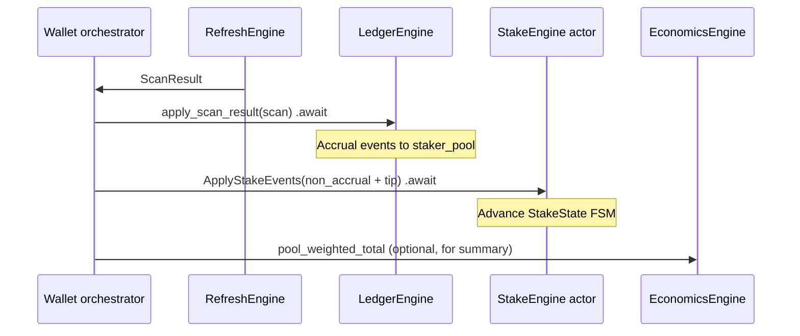

# Phase 2b — stake lifecycle (design)

**Status:** Round 0 pre-flight complete; Rounds 1–6 **open** (no design closure).
Planning-only — **no Stage 3 implementation** until Round 3 closes per
[`STAGE_1_PER_PR_TEMPLATE.md`](STAGE_1_PER_PR_TEMPLATE.md) §7.

**Process discipline:** [`26-sub-pr-design-discipline.mdc`](../../.cursor/rules/26-sub-pr-design-discipline.mdc)
(Round 0 = pre-flight / R0-D#; adversarial rounds 1–6 before code).

**Binding constraint when arbitrating:** [`00-mission.mdc`](../../.cursor/rules/00-mission.mdc)
priority-1 (security). Stake principal, lock boundaries, and claim watermarks
are consensus-load-bearing; wallet-side display must not invent economics the
chain did not authorize ([`STAKER_REWARD_DISBURSEMENT.md`](../STAKER_REWARD_DISBURSEMENT.md)
consensus-as-truth pin).

**Substrate pins (verified 2026-06-01 on `dev` @ `5f10af243`):**

| Precondition | Status |
|--------------|--------|
| Stage 2 KeyEngine actor (PR #99) merged to `dev` | **Met** — merged 2026-06-01 |
| `EconomicsEngine` landed (PR #94) | **Met** — consumed, not subsumed (§2.7) |
| Subaddress-under-PQC FA-1 for Phase 2b | **Met** — primary address only; no subaddress indices in stake model ([`SUBADDRESS_UNDER_PQC.md`](SUBADDRESS_UNDER_PQC.md) §3.7) |
| R2-F2 walkthrough closure | **Met on `dev`** — `docs/design/R2_F2_WALKTHROUGH.md` present; FOLLOWUPS cites R2-F2 **closed** (2026-05-31). Product §0 sign-off boxes may still be unchecked in the script; **does not block Phase 2b planning** per user gate. |

**Out of scope (this design):** `ArchivalEngine` (Stage 5), multisig staking UX (V3.1),
subaddress implementation / deletion PRs, wallet RPC/CLI, `Recipient` KEM / `create_subaddress`.

---

## 0. Round 0 pre-flight — substrate audit

Substrate re-read at `dev` tip (`5f10af243`, post–PR #99). Citations are to
that tip unless noted.

### 0.1 Engine identification ([`STAGE_1_PER_PR_TEMPLATE.md`](STAGE_1_PER_PR_TEMPLATE.md) §3.1)

- [x] **§2 trait binding:** [`V3_ENGINE_TRAIT_BOUNDARIES.md`](../V3_ENGINE_TRAIT_BOUNDARIES.md)
  §10.5.1 (`StakeEngine` additive trait); §2.7 (`EconomicsEngine` consumer framing);
  §3.3 (cross-engine `.await` sequencing); §8.3 lens table row for `StakeEngine`.
- [x] **§1.5 three-condition test (additive trait):**
  - **(1) Distinct state ownership:** per-stake FSM + wallet-side stake registry;
    distinct from `LedgerEngine`'s `TransferDetails` / `LedgerIndexes` and from
    `EconomicsEngine`'s parameter derivation. **Pass.**
  - **(2) Failure isolation:** stake actor crash must not take down ledger or keys;
    recoverable via re-hydration from persisted stake records + chain replay.
    **Pass** (Stage 2 validated `kameo` pattern).
  - **(3) Cross-cutting consumers:** `Engine<S>` orchestration, future
    `ArchivalEngine` via `is_active_staker(entity_id)`, JSON-RPC at V3.2+.
    **Pass.**
- [x] **Surface amendment:** this phase **introduces** `StakeEngine` (eighth trait
  slot); does not amend existing trait method signatures except orchestrator
  wiring and `ScanResult` / merge extensions enumerated in §4.

### 0.2 Plan-altitude principles ([`WALLET_REWRITE_PLAN.md`](WALLET_REWRITE_PLAN.md) op. 4–8)

- [x] **Principle 4 (architectural-integrity-now):** applies —
  `16-architectural-inheritance.mdc`, `21-reversion-clause-discipline.mdc`.
- [x] **Principle 5 (closure-rule discipline):** applies — Round-N record in §9;
  reopen only on substrate findings.
- [x] **Principle 6 (wider-substrate audit):** applies — §6 scheduled after Round 2
  close-out, before Round 3.
- [x] **Principle 7 (threat-model anchors):** applies — adversary-controlled daemon
  + memory-disclosure on stake/claim paths.
- [x] **Principle 8 (priority hierarchy):** applies — FA-1 / consensus-truth
  trade-offs in §5 and §7.

### 0.3 §8.3 design lenses

- [x] **Lens 1 (actor-mesh):** **yes** — stake registration, claim, unstake, and
  refresh reconciliation are cross-actor; Stage 3 is actor-from-inception per
  FOLLOWUPS Stage 3 row.
- [x] **Lens 2 (state-as-collection-membership):** **yes** — discrete per-stake
  lifecycle stages (`StakeState` enum).
- [x] **Lens 3 (diagnostic-stream / trust boundary):** **yes** — stake balances and
  claimable amounts are RPC-visible; §7.3 projection axes apply at Round 2.

### 0.4 Architectural-inheritance audit projection

| Inherited substrate | Shekyl disposition |
|---------------------|-------------------|
| Monero wallet2 "user tracks stake mentally" | **Rejected** — explicit FSM ([`V3_WALLET_DECISION_LOG.md`](../V3_WALLET_DECISION_LOG.md) 2026-04-25) |
| `TransferDetails::staked` / `stake_tier` / `stake_lock_until` on ledger rows | **Keep** — per-output chain truth on the transfer row; `StakeInstance` is the wallet lifecycle overlay |
| `StakerPoolState` in `LedgerIndexes` (runtime accrual cache) | **Keep** — fed by `StakeEvent::Accrual`; not yet in `LedgerBlock` on disk ([`ledger_block.rs`](../../rust/shekyl-engine-state/src/ledger_block.rs) §"What is not") |
| No `StakeEngine` / `StakeInstance` types in `rust/` yet | **Expected** — zero production trait; blast radius bounded to merge/scan hooks |

**Audit shape:** *confirmation with bounded new persistence* — not a Monero-shaped
migration of wallet2 stake code (none exists in Shekyl).

### 0.5 Branch posture

- [x] [`06-branching.mdc`](../../.cursor/rules/06-branching.mdc): design on `dev` or
  short-lived branch `feat/phase-2b-stake-lifecycle-design`; land doc on `dev`;
  **no push without explicit instruction**.

### 0.6 Trait-surface conformance lenses (CL-1–CL-7)

Deferred to Round 2 close-out when the trait sketch in §4.6 is binding-pinned.
Round 0 records intent: `StakeEngine::Error: Into<StakeEngineError>` (CL-3),
`#[non_exhaustive]` on `StakeState` / `StakeEvent` where wire-evolving (CL-7).

### 0.7 Codebase blast radius (grep baseline)

| Symbol | Production sites (summary) |
|--------|----------------------------|
| `StakeEngine` | **0** trait/impl — comments only in `economics.rs`, `chain_economics_source.rs` |
| `StakeInstance` | **0** — plan/decision-log prose only |
| `stake_events` | `scan.rs` (`ScanResult`), `merge.rs` (`apply_stake_events`), `refresh.rs` (`RefreshSummary.stake_events` count), `local_refresh.rs` (empty vec) |
| `StakeEvent` | `scan.rs` — only `Accrual { height, record }` variant today |
| `StakerPoolState` | `shekyl-engine-state` — `LedgerIndexes`, merge `insert_accrual` |

**Implication:** Stage 3 adds a new engine module tree (`stake_engine.rs`,
`stake_actor.rs`, `StakeEngineHandle`) parallel to [`key_actor.rs`](../../rust/shekyl-engine-core/src/engine/key_actor.rs);
extends `ScanResult` / merge / refresh summary without rewriting ledger transfer
semantics.

### 0.8 Stage 2 actor template (reference only — [`STAGE_2_KEY_ENGINE_ACTOR.md`](STAGE_2_KEY_ENGINE_ACTOR.md))

Patterns Phase 2b **inherits** at implementation time (not re-litigated in Round 0):

| Pattern | Stage 2 pin | Phase 2b application |
|---------|-------------|----------------------|
| Handle vs actor | `KeyEngineHandle` + `KeyActor`; blob inside task | `StakeEngineHandle` + `StakeActor`; stake registry inside task |
| Fail-stop | §4.5 — `Break` on panic; no restart with stale secrets | **Adopt** if actor holds claim watermarks / pending stake intents |
| Require-ambient runtime | §4.2 — `Handle::spawn` needs active Tokio | Same for `StakeEngineHandle::spawn` |
| `pub(crate)` handles | Orchestrator-only | Same |
| Forward actions | §8 — reopening criteria | §8 below |

**Not inherited:** master-secret containment (stakes are public ledger facts + amounts;
no `AllKeysBlob` in stake actor). Signing still routes through `KeyEngine` via
`PendingTxEngine`.

### 0.9 Round 0 disposition

**Pre-flight complete.** Round 1 may open. No substrate finding reopens Stage 2.

---

## 1. Mission posture

**Priority-1 (security):** stake flows must not leak spend/view material on RPC or
logs; claim/unstake txs must use consensus validation shapes from
[`shekyl-staking`](../../rust/shekyl-staking/) / C++ consensus, not wallet-invented
amounts.

**Priority-2 (privacy):** stake *actions* are visible on-chain by protocol design
([`DESIGN_CONCEPTS.md`](../DESIGN_CONCEPTS.md) multisig staking note); wallet must
not add secondary linkability (e.g. correlating stakes to subaddress indices —
**precluded by FA-1**).

**Timeframes:** **Now** (HF1+ claim-based staking). **Mining era** (emission-share
decay via `EconomicsEngine`). **V4** — lattice-only crypto does not change the
FSM shape; PQC signing stays on `KeyEngine` / `PendingTxEngine`.

---

## 2. Scope

### 2.1 In scope

- `StakeState` FSM and transition rules (§3)
- `StakeInstance` identity, persistence, and linkage to `TransferDetails` (§3–§4)
- `StakeEvent` vocabulary + `LedgerEngine` merge protocol (§4)
- Refresh reconciliation ordering with `apply_scan_result` (§5)
- Orchestrator user API: `Wallet::stakes`, `claimable_rewards`, `stake` / `claim` /
  `unstake` → `PendingTx` (§6)
- `StakeEngine` trait + `kameo` actor protocol (§4.6–§4.7)
- Cross-engine `.await` sequencing (§5.3)
- Threat model + diagnostic projections (§7)
- Stage 3 implementation DoD pointer (§10)

### 2.2 Out of scope

| Item | Disposition |
|------|-------------|
| `ArchivalEngine` | Stage 5; only `is_active_staker` query is forward-compatible |
| Multisig stake/claim ceremony | V3.1 — FOLLOWUPS |
| Subaddress indices in stake/recipient model | **Rejected** for V3.0 (FA-1) |
| Persisting `StakerPoolState` in wallet file | **Deferred** — reopen if rescan refill cost fails UX budget (§8.1) |
| Wallet RPC / CLI commands | Phase 3+ |
| Consensus rule changes | Use existing HF17 staking; wallet mirrors |

---

## 3. StakeState FSM (pinned draft for Round 1–2 review)

### 3.1 States

Aligned with [`WALLET_REWRITE_PLAN.md`](WALLET_REWRITE_PLAN.md) Phase 2b and refined
against [`STAKER_REWARD_DISBURSEMENT.md`](../STAKER_REWARD_DISBURSEMENT.md)
(principal lock vs reward claimability) and [`V3_WALLET_DECISION_LOG.md`](../V3_WALLET_DECISION_LOG.md)
2026-04-25.

```rust
/// Wallet-observed stake lifecycle. Distinct from on-chain `TransferDetails::staked`
/// flags — this enum is the orchestrator's consolidated view for UX and RPC.
#[non_exhaustive]
pub enum StakeState {
    /// Stake tx built locally; not yet broadcast.
    PendingBroadcast {
        built_at_height: u64,
        pending_tx_id: PendingTxId,
    },
    /// Broadcast seen in mempool or wallet tx pool; not yet in scanned chain.
    Unconfirmed {
        broadcast_at_height: u64,
        stake_tx: TxHash,
    },
    /// Staked output seen on-chain; principal locked until `effective_lock_until`.
    Locked {
        confirmed_at_height: u64,
        effective_lock_until: u64, // creation_height + tier_lock_blocks (consensus rule)
    },
    /// Within lock window; still contributing to `total_weighted_stake` on-chain.
    Accruing {
        last_scanned_height: u64,
        accrued_rewards_atomic: u64, // wallet estimate from pool + watermarks
    },
    /// Lock ended; principal still staked; reward backlog claimable via `txin_stake_claim`.
    Claimable {
        frozen_accrual_since: u64, // first height accrual stopped (effective_lock_until + 1)
        claim_watermark_height: u64, // last height claimed on-chain, if any
    },
    /// Unstake tx entered (PendingTx or observed); principal not yet spent.
    Unstaking {
        initiated_at_height: u64,
        unstake_tx: TxHash,
    },
    /// Principal output spent by unstake; instance retained for history/filtering.
    FullyUnstaked {
        unstaked_at_height: u64,
    },
}
```

**Round 1 load-bearing question:** whether `Accruing` and `Claimable` remain
separate states or collapse to chain-derived views on read — **provisional pin:**
keep separate for UX ("still earning" vs "frozen accrual, drain backlog") per
STAKER_REWARD_DISBURSEMENT wallet UX requirement.

### 3.2 Transition table (consensus-driven)

Heights are **chain heights** from scan/merge unless noted.

| From | Event / condition | To |
|------|-------------------|-----|
| — | `Wallet::stake` builds `PendingTx` | `PendingBroadcast` |
| `PendingBroadcast` | submit + mempool observe | `Unconfirmed` |
| `PendingBroadcast` | discard pending tx | *(remove instance or terminal — Round 2)* |
| `Unconfirmed` | scan finds `txout_to_staked_key` output | `Locked` → auto-advance to `Accruing` at same height if `height <= effective_lock_until` |
| `Locked` | next scan with `height > confirmed_at` and `height <= effective_lock_until` | `Accruing` |
| `Accruing` | scan height `> effective_lock_until` | `Claimable` (set `frozen_accrual_since`) |
| `Accruing` / `Claimable` | scan observes `txin_stake_claim` advancing watermark | update `claim_watermark_height`; stay in state |
| `Accruing` / `Claimable` | `Wallet::claim` builds pending claim tx | *(pending-claim sub-state — Round 2; may mirror PendingBroadcast)* |
| `*` | `Wallet::unstake` submitted | `Unstaking` |
| `Unstaking` | scan spends staked output (key image / spend) | `FullyUnstaked` |
| `*` | reorg rewinds below `confirmed_at_height` | rewind per §5.2 |

**Consensus pins:**

- `effective_lock_until = creation_height + tier_lock_blocks` — never stored as
  authoritative wallet field; recompute from tier table
  ([`shekyl-staking/src/tiers.rs`](../../rust/shekyl-staking/src/tiers.rs)).
- Reward claimability does **not** require `effective_lock_until <= current_height`
  ([`STAKER_REWARD_DISBURSEMENT.md`](../STAKER_REWARD_DISBURSEMENT.md) validation rules).

### 3.3 `StakeId` and `StakeInstance`

```rust
/// Stable wallet-local identifier. Phase 2b pin: derived from the staked output identity.
pub struct StakeId(pub [u8; 32]); // BLAKE3(domain, tx_hash || le(index)) — exact domain sep Round 2

pub struct StakeInstance {
    pub id: StakeId,
    /// Principal staked amount (atomic units) at confirmation.
    pub amount_atomic: u64,
    pub tier: StakeTier, // shekyl_staking::StakeTier
    pub state: StakeState,
    /// Primary-address output reference (FA-1: no subaddress index).
    pub staked_output: OutputRef, // { tx_hash, index_in_transaction }
    /// Optional link to the stake transaction hash once known.
    pub stake_tx: Option<TxHash>,
}
```

---

## 4. Persistence and engine ownership

### 4.1 What lives where (architectural pin)

| State | Owner at runtime | Persisted |
|-------|------------------|-----------|
| Per-output chain flags (`staked`, `stake_tier`, `stake_lock_until`) | `LedgerEngine` / `TransferDetails` | `LedgerBlock.transfers` |
| Per-block accrual aggregates | `LedgerEngine` / `LedgerIndexes.staker_pool` | **No** (rebuilt on scan) |
| Per-stake FSM (`StakeInstance`) | **`StakeEngine` actor** | **Yes** — new `LedgerBlock` field or bundle block (§4.2) |
| Pending stake/claim/unstake intents | `PendingTxEngine` | `TxMetaBlock` / pending metadata |
| Economics parameters / pool denominator | `EconomicsEngine` + chain mirror | N/A (derived) |

**Orchestrator** holds handles only; it does **not** store `StakeInstance` maps
directly ([`36-secret-locality.mdc`](../../.cursor/rules/36-secret-locality.mdc)
engine isolation).

### 4.2 Persistence schema (byte layout gate for Round 2)

**Pin:** extend [`LedgerBlock`](../../rust/shekyl-engine-state/src/ledger_block.rs)
with:

```rust
pub stakes: Vec<StakeInstance>, // or BTreeMap<StakeId, StakeInstance> — Round 2 wire choice
```

- Bump `LEDGER_BLOCK_VERSION` + `WALLET_LEDGER_FORMAT_VERSION` per
  [`42-serialization-policy.mdc`](../../.cursor/rules/42-serialization-policy.mdc).
- Postcard schema snapshot co-lands in the same implementation PR as the struct.
- Pre-genesis: no migration loader — version mismatch → resync.

**Hydration:** `Wallet::open*` loads `LedgerBlock.stakes` → `StakeEngineHandle::restore(instances)`.
**Flush:** `PersistenceEngine::save` snapshots actor registry → `LedgerBlock.stakes`.

### 4.3 `StakeEvent` and merge protocol

Extend [`StakeEvent`](../../rust/shekyl-engine-core/src/scan.rs) (`#[non_exhaustive]`):

```rust
pub enum StakeEvent {
    /// Existing — per-height pool accrual (aggregate).
    Accrual { height: u64, record: AccrualRecord },

    /// Staked output first observed at `height`.
    StakedOutputConfirmed {
        height: u64,
        output: OutputRef,
        amount_atomic: u64,
        tier: StakeTier,
        creation_height: u64,
    },

    /// Claim tx observed; advances watermark.
    ClaimObserved {
        height: u64,
        staked_output_index: u64, // consensus index space
        watermark_to: u64,
        claimed_amount: u64,
    },

    /// Staked output spent (unstake).
    StakedOutputSpent {
        height: u64,
        output: OutputRef,
    },
}
```

**Merge split (load-bearing):**

1. **`LedgerEngine::apply_scan_result`** (sync body today) continues to apply
   `StakeEvent::Accrual` into `LedgerIndexes::insert_accrual` only.
2. **Per-stake variants** are **not** applied inside `merge.rs` directly at Stage 3;
   instead the orchestrator forwards them to `StakeEngine` after ledger apply
   (§5.3). *Round 1 may collapse this to a single merge hook if cross-engine ordering
   is simpler — must not use `tokio::join!` stale snapshot.*

### 4.4 `RefreshSummary::stake_events`

Per [`V3_ENGINE_TRAIT_BOUNDARIES.md`](../V3_ENGINE_TRAIT_BOUNDARIES.md) deferred
work table: count becomes **non-zero** when per-stake events flow.

**Pin:**

```rust
pub struct RefreshSummary {
    // existing fields…
    /// Count of `ScanResult::stake_events` processed this refresh (all variants).
    pub stake_events: usize,
    /// Optional: stakes whose `StakeState` changed (for UI badges).
    pub stakes_updated: usize, // Round 2 — may defer
}
```

### 4.5 `EconomicsEngine` consumption (not a sub-trait)

`StakeEngine` calls:

- `pool_weighted_total() -> u128` for yield display / `projected_yield`
- `parameters_snapshot()` for tier multipliers / emission decay display

**Reversion clause (§8.2):** methods on `EconomicsEngine` that take `stake_id` or
encode per-stake state are **rejected** — reopen only via §10.6.1 revisit threshold
in trait-boundaries doc.

### 4.6 `StakeEngine` trait surface (draft)

```rust
pub(crate) trait StakeEngine: Send + Sync + 'static {
    type Error: Into<StakeEngineError>;

    /// Register a new instance when the user builds a stake pending tx.
    fn register_pending_stake(&self, instance: StakeInstance) -> Result<(), Self::Error>;

    /// Apply scan-derived events after ledger merge (ordered — §5.3).
    fn apply_stake_events(
        &self,
        tip_height: u64,
        events: Vec<StakeEvent>,
    ) -> Result<StakeApplySummary, Self::Error>;

    /// Query API backing `Wallet::stakes(filter)`.
    fn list_stakes(&self, filter: StakeFilter) -> Result<Vec<StakeInstance>, Self::Error>;

    /// Sum of claimable reward estimates across instances in `Claimable` / post-frozen.
    fn claimable_rewards_atomic(&self, tip_height: u64) -> Result<u64, Self::Error>;

    /// Projected yield for UI (divide-by-zero guarded).
    fn projected_yield(
        &self,
        stake_id: &StakeId,
        horizon_blocks: u64,
    ) -> Result<u64, Self::Error>;

    /// ArchivalEngine sibling query (Stage 5 consumer).
    fn is_active_staker(&self, entity_id: &EntityId) -> Result<bool, Self::Error>;
}
```

Async/sync split: **Round 2** — likely async `apply_stake_events` at Stage 3 actor
(handle `ask`), sync queries if actor snapshot is cheap.

### 4.7 Actor protocol (Stage 3 implementation target)

Mirror [`KeyEngineHandle`](../../rust/shekyl-engine-core/src/engine/key_actor.rs):

| Message | Direction | Notes |
|---------|-----------|-------|
| `RegisterPendingStake(StakeInstance)` | orchestrator → actor | after `build_pending_tx` |
| `ApplyStakeEvents { tip_height, events }` | orchestrator → actor | post-ledger-merge |
| `ListStakes(StakeFilter)` | orchestrator → actor | read-only |
| `ClaimableRewardsAtomic { tip_height }` | orchestrator → actor | read-only |
| `ProjectedYield { stake_id, horizon }` | orchestrator → actor | uses `EconomicsEngine` snapshot via orchestrator-passed params or separate economics handle message — **Round 2** |
| `IsActiveStaker(EntityId)` | orchestrator → actor | public for archival |
| `Restore(Vec<StakeInstance>)` | orchestrator → actor | wallet open |
| `Snapshot()` | orchestrator → actor | wallet save |

**Fail-stop:** adopt Stage 2 §4.5 for the stake actor if panic could leave
inconsistent pending stake maps.

**Secrets:** actor messages carry **no** view/spend keys; claim/stake tx building
stays in `PendingTxEngine` + `KeyEngine`.

---

## 5. Refresh reconciliation

### 5.1 Data flow



### 5.2 Reorg

When `ScanResult.reorg_rewind` is `Some`:

1. Ledger merge runs `handle_reorg` (existing).
2. Stake actor receives `RewindTo { fork_height }` — drops or rewinds instances
   confirmed at or above fork; resets pending states tied to abandoned chain.
3. `StakerPoolState` truncated by ledger reorg handler (existing accrual cache).

### 5.3 Cross-engine ordering ([`V3_ENGINE_TRAIT_BOUNDARIES.md`](../V3_ENGINE_TRAIT_BOUNDARIES.md) §3.3)

**Required pattern (Stage 4-ready):**

```rust
let merge_out = engine.ledger.apply_scan_result(scan).await?;
engine.stake.apply_stake_events(merge_out.tip_height, merge_out.stake_events_for_actor).await?;
// then persist, if needed:
let stakes_snapshot = engine.stake.snapshot().await?;
engine.persist.save_stakes(stakes_snapshot).await?;
```

**Forbidden:** `tokio::join!(ledger.apply_scan_result(...), persist.save(...))` with
ledger snapshot taken as join argument (§3.3.4 stale-snapshot anti-pattern).

---

## 6. User-facing orchestrator API (not on `StakeEngine` trait)

Per [`WALLET_REWRITE_PLAN.md`](WALLET_REWRITE_PLAN.md) — methods on `Wallet`:

| Method | Returns | Behavior pin |
|--------|---------|--------------|
| `stakes(filter)` | `Vec<StakeInstance>` | Delegates `StakeEngine::list_stakes` |
| `claimable_rewards()` | `AtomicUnits` | Sum across instances; **primary-address stakes only** |
| `stake(amount, tier)` | `PendingTx` | `PendingTxEngine::build` + `register_pending_stake` |
| `claim(stake_id)` | `PendingTx` | Builds `txin_stake_claim` tx; does not finalize |
| `unstake(stake_id)` | `PendingTx` | Spends staked output; FSM → `Unstaking` on submit |

**FA-1:** stake/claim/unstake transactions target **primary account address** outputs
only; no `SubaddressIndex` in `StakeInstance` or stake tx templates.

---

## 7. Threat model (Round 1 wargaming seed)

| Threat | Mitigation pin |
|--------|----------------|
| Malicious daemon understates `total_weighted_stake` | Display-only; claims validated by consensus; user warned when mirror stale |
| Wallet over-claims reward amount | `PendingTxEngine` builds from `shekyl-staking` / consensus math, not UI estimate |
| Memory disclosure of claim paths | No secrets in `StakeInstance`; RPC returns amounts + public refs only |
| Reorg desync between ledger and stake actor | Ordered §5.3; explicit `RewindTo` message |
| Fake `StakeEvent` injection | Events originate from scanner parsing blocks tied to daemon headers; merge rejects malformed `ScanResult` |

**Diagnostic projection (lens 3):** RPC fields are **field-redacted** (no view/spend),
**height-labeled**, and **distribution-safe** (no per-output secret correlation).

---

## 8. Forward actions and reversion clauses

### 8.1 Persist `StakerPoolState` in wallet file

**Rejection:** keep rebuild-on-scan model ([`ledger_block.rs`](../../rust/shekyl-engine-state/src/ledger_block.rs)).

**Reopen when:** rescan refill of accrual cache exceeds UX budget on mainnet-class
history **and** measured on V3.0 hardware — evidence in `PERFORMANCE_BASELINE.md`.

**Re-evaluation:** new design round + version bump per `42-serialization-policy.mdc`.

### 8.2 `EconomicsEngine` per-stake methods

**Rejection:** per [`V3_ENGINE_TRAIT_BOUNDARIES.md`](../V3_ENGINE_TRAIT_BOUNDARIES.md) §2.7 discipline test.

**Reopen when:** §10.6.1 three-part revisit threshold met with a named consumer that
cannot call `StakeEngine` + `pool_weighted_total()` composition.

### 8.3 Collapse `Accruing` / `Claimable` states

**Rejection for V3.0:** separate states for UX clarity (STAKER_REWARD_DISBURSEMENT).

**Reopen when:** a production UI proves single-state read model is strictly better
**and** STAKER_REWARD_DISBURSEMENT UX pin is amended.

### 8.4 Stage 2 merge-path actor re-route (6-ii)

**Not applicable** to stake actor in Phase 2b — no per-output crypto in stake merge.
Cross-reference only.

---

## 9. Round record

| Round | Status | Summary |
|-------|--------|---------|
| **0** | **Closed** | Pre-flight §0 — substrate confirmed; blast radius enumerated |
| **1** | Open | Load-bearing question: Accruing vs Claimable separation + merge split (§4.3) |
| **2** | Open | R-residuals: `StakeId` hash, pending-claim sub-state, wire map type, async trait |
| **3** | Open | Threat-model exhaustion + §6 wider-substrate audit |
| **4** | Open | Phase 0 binding pins (trait signatures, error enums, persistence version) |
| **5** | Open | Closure + Stage 3 implementation PR decomposition |
| **6** | Open | External critique buffer (optional per template) |

---

## 10. Definition of done

### 10.1 Planning (this document)

Matches [`FOLLOWUPS.md`](../FOLLOWUPS.md) Phase 2b planning row:

- [ ] `StakeState` FSM reviewed and transition table signed off (Rounds 1–2)
- [ ] Reconciliation rules signed off (§5)
- [ ] Persistence schema signed off (§4.2) with version-bump plan
- [ ] User method signatures signed off (§6)
- [ ] `StakeEngine` message protocol signed off (§4.7)
- [ ] Round 3 design closure recorded in §9

### 10.2 Stage 3 implementation (after closure — separate PR(s))

Matches FOLLOWUPS Stage 3 row:

- [ ] `StakeEngine` + `StakeEngineHandle` + `StakeActor` (`kameo`)
- [ ] FSM transition tests in isolation (no full `Engine<S>` required)
- [ ] `StakeEvent` wired through refresh → ledger → stake actor path
- [ ] `is_active_staker` message exposed
- [ ] Cross-engine ordering per §5.3

---

## 11. References

| Doc | Use |
|-----|-----|
| [`FOLLOWUPS.md`](../FOLLOWUPS.md) | Phase 2b planning + Stage 3 rows |
| [`WALLET_REWRITE_PLAN.md`](WALLET_REWRITE_PLAN.md) | Phase 2b scope |
| [`V3_ENGINE_TRAIT_BOUNDARIES.md`](../V3_ENGINE_TRAIT_BOUNDARIES.md) | §2.7, §3.3, §10.5.1, §8.3 |
| [`V3_WALLET_DECISION_LOG.md`](../V3_WALLET_DECISION_LOG.md) | 2026-04-25 stake lifecycle |
| [`STAKER_REWARD_DISBURSEMENT.md`](../STAKER_REWARD_DISBURSEMENT.md) | Consensus economics |
| [`DESIGN_CONCEPTS.md`](../DESIGN_CONCEPTS.md) | Components 3–4 |
| [`STAGE_2_KEY_ENGINE_ACTOR.md`](STAGE_2_KEY_ENGINE_ACTOR.md) | Actor template (§0.8, §10) |
| [`SUBADDRESS_UNDER_PQC.md`](SUBADDRESS_UNDER_PQC.md) | FA-1 |
| [`STAGE_1_PER_PR_TEMPLATE.md`](STAGE_1_PER_PR_TEMPLATE.md) | Round structure |
