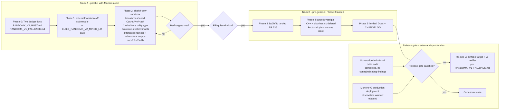

# RandomX v2 Rust port (Track A / Track B)


**Status:** LIVING CONTRACT (as of 2026-09-16). Phases 0–5 landed; the release-time algorithm-review gate remains. YAML `trackb-gate-check` deleted (moot: Phase 3 landed; no discharge recorded).
## Sequencing rationale

Three independent gates govern when phases land.

**Wallet-migration gate (Track B).** Historical: the wallet rewrite churned `shekyl-ffi` while Phase 3 was scoped. Phase 3 landed (PR #235). The YAML `trackb-gate-check` quiet-window row is deleted (moot: Phase 3 landed; no discharge recorded). Not gated on a V3.2 wallet cutover (that train does not exist).

**Algorithm-review gate (release-time, not intra-track).** Per `RANDOMX_V2_RUST.md` §1.4, the v2 algorithm-review gate is **release-time**, not before Phase 2. Phase 2 is faithful spec implementation against a stable spec — not an algorithm-soundness decision — so gating it on external review would either delay or duplicate effort. Monero is the parallel v2 deployer and v1→v2 delta audit funder, and the Shekyl-Foundation fork is non-divergent from upstream (§1.1), so Monero's audit covers Shekyl's pinned code byte-for-byte without coordination. Implementation work (Phases 1-4) proceeds in parallel; the gate fires before genesis release (§1.4: Monero production-deployment observation window plus completed delta audit without contraindicating findings). If the gate fails, re-add `external/randomx` as a configured CMake target at `102f8acf` (gitlink stays in `.gitmodules`), restore or rewrite a v1 verifier (`shekyl-pow-randomx` is v2 bytecode with zero v1 references), and restore the `check_submodule(external/randomx)` row with that target, per `RANDOMX_V1_FALLBACK.md` §1.

**Performance-target gate (Track A intra-track).** Phase 2 benchmarks had to hit Phase 0 budgets before Phase 3 started. Production verification is the Rust pure-software interpreter (Phase 3 landed). The C library's light-VM-JIT path is the opt-in miner/harness reference and the Phase 0 budget baseline (~2-3× slower per hash for Rust vs that baseline). Per-hash slowdown dominates initial-sync wall-time delta (~4 hours over 600k blocks at 3× ratio); cache-derivation overhead is noise (~44s).



Note that `MonAudit` and `MonDeploy` are external to Shekyl's control;
they run in parallel with the entire Phase 0→Phase 5 sequence.
Shekyl's implementation work never blocks waiting for them.

## Permanent architectural decisions

These decisions are made now and locked. Any future proposal to reverse them must start with a new design doc that addresses the rationale below.

### 1. C JIT for mining, Rust interpreter for verification — permanent

The `20-rust-vs-cpp-policy.mdc` "Rust by default" pressure exists to put Rust on consensus paths and untrusted-input parsing. A RandomX JIT for mining is neither: it's a code generator that the daemon's verification path does not touch and that consumes only data the miner produced.

Any JIT is structurally an `unsafe` operation: W^X pages, raw instruction-byte emission, `mprotect` transitions, trust in the encoder. The fork's C JIT has years of production exposure; reimplementing it in Rust trades that hardening for a fresh codegen surface, which is the wrong direction for `00-mission.mdc` commitment #1.

Cranelift is the wrong tool: RandomX's ASIC resistance depends on the *specific instruction mix* the bytecode dispatch produces.

Ecosystem argument: xmrig, SRBMiner, and every stratum pool consume the C ABI. A Rust-port either ships a C-ABI-wrapped Rust JIT (no gain) or diverges from the ecosystem and forces every miner to integrate a Rust crate (hostile to decentralization).

Concrete data point: the MSVC PDB type-server ICE from `CryptonightR_JIT.c` is evidence that a heavy C JIT in the daemon build path causes real cross-platform pain. The hybrid model isolates that pain to a separate artifact that MSVC and Guix reproducible-build pipelines can skip entirely.

**Verifiers don't need JITs.** Verification is one-shot per block at the cache mode that daemons actually use. There is no FOLLOWUPS entry to "Rust-port the JIT later" — the split is the answer, permanently.

### 2. `external/randomx-v2` is a rename, not a reuse of `external/randomx`

The v2 fork is added as a new submodule at `external/randomx-v2`. Makes the discontinuity visible, prevents accidental upstream-tracking updates, signals Shekyl-controlled fork. `external/randomx` is removed only when Phase 3 deletes its last consumer.

### 3. Spec is the source of truth, C reference is the cross-check

The Rust verifier is implemented from the v2 specification document. The v2 fork's C implementation is treated as a cross-check, not as the source of truth. If they disagree, the spec wins and a bug is filed against the C fork.

### 4. Cache, Dataset, and Hash are transform-shaped per `18-type-placement.mdc`

The rule: *"Transform-shaped types. Defined by a function. The canonical definition is the function; storage of the value is a memo of the function's output. Anyone with the function's inputs can recompute the value."*

A RandomX cache fits exactly: `Cache::derive(seedhash) -> Cache` is a pure function (~10-100ms, ~256 MB output). Same for `Dataset::derive(cache) -> Dataset` (~30s, ~2 GiB, miner-only) and `compute_hash(cache, data) -> Hash` (~10-30ms per hash).

The C code's process-global cache + thread-local VMs + async epoch-transition state machine is a *miner-side performance optimization* inherited from Monero. Per `16-architectural-inheritance.mdc`, "inheriting code is not inheriting architecture" — carrying the miner-shape state into a verifier-only Rust implementation is the inheritance anti-pattern the rule names.

Types are defined by their derivation functions:

```rust
pub struct Cache(Box<[u8; CACHE_SIZE]>);
impl Cache {
    /// Pure derivation. The canonical definition of a Cache.
    pub fn derive(seedhash: &Seedhash) -> Self { /* ~10-100ms */ }
}

/// Pure derivation. No memoization, no internal state.
/// VmState is a `pub(crate)` implementation detail of vm.rs — never
/// exposed at the public crate surface. Pooling, if needed, is
/// internal to compute_hash per Decision #7's Round 2 substrate-shift
/// form.
pub fn compute_hash(cache: &Cache, seedhash: &Seedhash, data: &[u8]) -> Hash {
    let mut state = VmState::new();           // private to vm.rs
    state.initialize(seedhash, data, cache);  // private to vm.rs
    state.run(cache);                          // private to vm.rs
    state.finalize()                           // private to vm.rs
}
```

### 5. Memoization is transparent inside `shekyl-ffi`, not exposed to C++

The daemon's hash-call shape is identical to today: `hash(seedhash, data) -> hash`. Caching of derived `Cache` values across calls is a function-level memo internal to `shekyl-ffi`. The load-bearing argument: `shekyl-ffi` *is* the C-ABI boundary, and module-level state at the C-ABI boundary is structurally unavoidable — C has no other way to hold cross-call state than process-globals, and FFI tracks C's reality. Other Rust crates (`shekyl-pow-randomx` included) are not at this boundary and do not get the same allowance.

The verifier crate `shekyl-pow-randomx` exports `CacheStore` as a generic utility type (`LruCache<Seedhash, Arc<Cache>>` wrapper). It **instantiates no module-level instance** — `shekyl-ffi` constructs one as part of its FFI bridge's lifecycle, hidden from C++ callers.

The two-crate split keeps the "no hidden state" property where it matters (the verifier crate that other Rust callers depend on) while permitting the necessary state at the FFI boundary.

### 6. No prewarm, no async cache rebuild — lazy derivation is the design

The C library moves cache derivation off the hot path via a background thread triggered by an explicit `rx_set_main_seedhash` call. That's a state machine. The Rust verifier doesn't have one.

The cost analysis:

- Per cache miss: ~150 ms one-time latency.
- Frequency on the verifier path: one per `SEEDHASH_EPOCH_BLOCKS` (2048) blocks = one per ~2.84 days at 120s block time.
- Perceptibility framing: ~150 ms exceeds Nielsen's 100 ms "feels instant" threshold by ~50 ms but sits an order of magnitude below the 1 s "continuous flow" / "stay focused" threshold. For a one-off event on the verifier path (not in any user-input feedback loop), 150 ms is invisible in practical RPC-call contexts where network round-trip already adds tens to hundreds of ms.
- Block propagation impact: 150 ms / 2048 blocks = 0.073 ms average. Below the variance floor of normal network propagation (~500 ms - 1 s).
- Initial sync impact: ~293 transitions × 150 ms ≈ 44 s of derivation overhead across a 600k-block sync. The canonical per-hash figures from `RANDOMX_V2_RUST.md` §8 are: C light-VM-JIT baseline ~12 ms/hash × 600,000 ≈ 2 hours of baseline PoW verification work; Rust target ceiling at 3.0× ratio (36 ms/hash) × 600,000 ≈ 6 hours of Rust-side PoW verification work; the **delta** is ~4 hours of additional verification time (the figure §8 ratifies for review). Against the Rust-side total of ~6 hours, the 44 s cache-derivation overhead is < 0.25% of total — noise relative to either baseline or Rust-target wall time.

What we trade away:

- Async-state-machine complexity. The C library's reader/writer locks + background-thread lifecycle were correct but not free. They cost test surface, cost reviewer attention, and embodied exactly the inherited-state pattern `16-architectural-inheritance.mdc` warns against.
- A `prewarm` FFI export that would need daemon-side scheduling logic ("a few blocks before transition," "not during a reorg," "wait for completion before validating," etc.). Non-trivial C++ logic we don't have to write.

No escape hatch is provided. With a capacity-2 LRU, any "fake prewarm" pattern (call `hash(upcoming_seedhash, dummy_data)`, discard the result, hope the cache stays warm) is unreliable: if any other seedhash is hashed in the interval before the real use, the warmed cache gets evicted. If a future caller genuinely needs prewarm semantics, the disposition is to propose a new design doc that revisits Decision #6, not to pretend the current API can simulate one.

**Phase 0 includes a "Why no prewarm" section** so future contributors who propose adding it back find the recorded reasoning instead of having to re-litigate it.

**Round 4 carry-forward — canonical-seedhash slot eviction-protection.** Per `RANDOMX_V2_PHASE2C_PLAN.md` §5.11.7 (threat-model addenda), the capacity-2 LRU is open to a 3-seedhash interleave attack: an adversarial peer submits alternate-chain block headers under three distinct seedhashes in rotation, forcing the LRU to evict the canonical seedhash's cache once per cycle and imposing ~200 ms cache re-derivation cost per attack iteration. Mitigation routed to Phase 2f's `CacheStore` implementation: the **current canonical seedhash slot is sticky against eviction** — only the secondary slot churns under attack. Concretely, the LRU's eviction policy treats the slot holding the chain-tip's canonical seedhash as ineligible for eviction; the chain-tip seedhash identifier is supplied by the caller (`shekyl-ffi`'s FFI shim knows the current canonical seedhash from its own chain-state view). When the canonical seedhash advances (epoch transition), the new canonical slot becomes sticky and the old one falls back into normal LRU eligibility. Phase 2f Round 1 enumerates the exact mechanism (per-entry sticky flag vs. dedicated slot vs. capacity-3-with-protected-slot); the disposition is design-time, not arbitrary.

### 7. Per-call `VmState` allocation inside `compute_hash` is the default; pooling, if needed, is internal to `compute_hash`

Per-hash VM state (the 2 MB scratchpad plus the register file) is a `VmState` value created inside `compute_hash` for each invocation and dropped at return. Per-call construction is ~µs with thread-local arena allocators. If Phase 2f benchmarks show allocation cost dominates per-hash time on the verifier path, the disposition is to **internalize a `VmState` pool inside `compute_hash`** (private to `vm.rs`, invisible to consumers) rather than expose a public `VmPool` type. This matches the dispatch-function-body-replacement discipline established in `docs/design/RANDOMX_V2_PHASE2C_PLAN.md` §5 F1 R2-D1: implementation-detail optimizations stay inside the transform function; the public API stays minimal.

Decision-shape note: the substance of this decision is unchanged from its pre-Round-2 form (per-call allocation is the default; pool only if needed). The implementation shape (internal pool inside `compute_hash` vs. public `VmPool` type) tracks the Round 2 substrate shift to `compute_hash`-as-public-transform per `21-reversion-clause-discipline.mdc`'s reopening-criterion shape — when the substrate (which surface is public) changes, the disposition tracking that substrate re-anchors without changing the decision itself. No thread-local globals in either form.

**Round 4 carry-forward — pool capacity sized against daemon parallel-verification fanout.** Per `RANDOMX_V2_PHASE2C_PLAN.md` §5.11.7 (threat-model addenda), if Phase 2f's benchmarks show that internalizing a `VmState` pool is needed, the pool capacity must be sized against the daemon's actual parallel-verification fanout, not chosen arbitrarily. The fanout is determined by two factors the daemon already enumerates: (a) the worker-thread count for alt-chain branch validation (typically `num_cpus`), and (b) the mempool's parallel-tx-verification fanout (a separate worker pool). Phase 2f Round 1 surveys the daemon-side code (or runs a single instrumented startup) to determine the actual maximum-concurrent-`compute_hash`-callers count; the pool capacity is sized to that maximum plus a small reserve (e.g., +1 for safety margin). An arbitrarily-chosen capacity (e.g., "let's pick 8") either over-allocates (wastes 16 MB per excess slot at 2 MB scratchpad) or under-allocates (forces serialization under load, gating the daemon's verification throughput on pool availability). The discipline mirrors `CacheStore`'s capacity-2 (chosen against canonical-plus-one-secondary-slot rather than arbitrarily): every capacity is justified against an enumerated demand source, not picked.

### 8. What irreducibly stays state, and where

Three things cannot be derived and must be remembered. Each lives in its semantic owner per `18-type-placement.mdc`:

- **`shekyl-ffi`'s internal `CacheStore` entries.** Function-level memo state. Lives in `shekyl-ffi`. Hidden from C++.
- **The chain's current `Seedhash` at any height.** State-shaped (chain progression). Computed as `block_hash(seed_block(height))`. Lives in the chain-state-owning crate (`shekyl-engine-state`).
- **`SEEDHASH_EPOCH_BLOCKS` / `SEEDHASH_EPOCH_LAG`.** Protocol constants, typed `const` in `shekyl-pow-randomx`. Not runtime-configurable; operator overrides of consensus-critical constants are a Monero-era anti-pattern per `60-no-monero-legacy.mdc`.

Everything else (caches, datasets, VMs, hashes) is transform-shaped and derived on demand.

## Track A — Phase 0 (start now)

Two design documents, **both** required before Phase 1.

### `docs/design/RANDOMX_V2_RUST.md`

1. **Why Shekyl-Foundation RandomX v2 fork.** Cite `RANDOMX_FLAG_V2` and `doc/design_v2.md` from the fork. Document the delta from v1.

2. **Hybrid architecture and the C/Rust split.** Cite Decision #1. No FOLLOWUP entry for porting the JIT to Rust later.

3. **v2 algorithm review status and release-gate framing.** Records (a) the algorithm-review situation — **Monero is funding the v1→v2 delta audit** and is the other production deployer of upstream RandomX v2 (PR #317); the Shekyl-Foundation fork is non-divergent (`RANDOMX_V2_RUST.md` §1.1) so the audit's scope covers Shekyl's pinned code byte-for-byte; and (b) the **release-time** (not Phase-2-time) framing of the algorithm-review gate. Phase 2 is faithful spec implementation against a stable spec, not an algorithm-soundness decision; gating Phase 2 on external review would either delay implementation behind work Shekyl does not control or duplicate Monero's audit for no security gain. Per `RANDOMX_V2_RUST.md` §1.4 the gate fires before genesis release (Monero deployment-experience window plus completed audit without contraindicating findings). Reference `RANDOMX_V1_FALLBACK.md` for the late-binding CMake-target re-add fallback if the release-time gate fails.

4. **Spec-as-source-of-truth doctrine.** Rust verifier implemented from spec; C reference is cross-check; spec wins on disagreement.

5. **FFI surface scope (1 function, plus 1 discretionary).** Decisions #4, #5, #6:
   - **Committed:** `shekyl_pow_randomx_v2_hash(seedhash: *const [u8; 32], data: *const u8, data_len: usize, out: *mut [u8; 32]) -> i32`. The pure derivation. Caller passes seedhash + data; receives hash. Internal `shekyl-ffi` `CacheStore` memoizes derived caches across calls, transparently. **Round 4 hardening (per `RANDOMX_V2_PHASE2C_PLAN.md` §5.11.6):** `seedhash` and `out` use typed-array-pointer (`*const [u8; 32]` / `*mut [u8; 32]`) rather than raw `*const u8` / `*mut u8`; the type system enforces 32-byte length at shim compile time, eliminating a class of "C++ caller passes wrong-sized buffer" bugs at the type boundary rather than at runtime documentation. `data` remains `*const u8` because it carries variable-length input.

     **Round 5 hardening: C-side header form and C++ call-site declaration discipline (per `RANDOMX_V2_PHASE2C_PLAN.md` §14 Round 5 entry).** The Rust `*const [u8; 32]` typed-array-pointer maps to **two** C surface forms, and the wrong one silently re-introduces the "C++ caller passes wrong-sized buffer" bug class that Round 4's typed-array-pointer was added to prevent. Phase 3a's plan must specify both:

     - **C header form: `const uint8_t (*seedhash)[32]`, not the decayed form `const uint8_t *seedhash`.** The pointer-to-array-of-32-bytes spelling is syntactically unusual in C (parentheses around `*seedhash`, then `[32]`), and many C++ programmers reflexively write `const uint8_t *seedhash` instead — the decayed form silently accepts buffers of any length, undoing the type-side safety. The header MUST use the explicit pointer-to-array form for `seedhash` and `out` (`uint8_t (*out)[32]`), with a comment at each declaration naming the discipline so a future contributor "simplifying" the signature to `const uint8_t *` is caught at code review.

     - **C++ call-site declaration pattern: `uint8_t seedhash_buffer[32]; ...&seedhash_buffer`.** The matching argument-construction form at every C++ call site is the C-array form `uint8_t seedhash_buffer[32]`, and the caller passes `&seedhash_buffer` — which has type `uint8_t (*)[32]` and matches the declared `const uint8_t (*)[32]` parameter exactly. The caller does **not** pass `seedhash_buffer` (decays to `uint8_t*`), does **not** pass `&seedhash_buffer[0]` (an element-address — also `uint8_t*`), and does **not** pass `seedhash_buffer.data()` from a `std::vector<uint8_t>` (also `uint8_t*`). Every alternative form is the decayed `uint8_t*` the C header form was designed to reject. A `std::array<uint8_t, 32>` does **not** simplify the call site — the address-of operator on a `std::array` yields `std::array<uint8_t, 32>*`, not `uint8_t (*)[32]`, and adapting it for the FFI requires a `reinterpret_cast` that defeats the type-discipline the typed-array-pointer was added to enforce. The single canonical C++ call-site pattern is the C-array form; alternatives are not equivalent. This pattern is non-obvious enough that Phase 3a's plan-doc and the implementation PR document it explicitly at *every* C++ call site (a one-line comment naming the typed-array-pointer discipline), not just at the header signature. The discipline at the call site is what catches "a future contributor refactoring the call site to use `std::vector<uint8_t>` for flexibility" — the type-check fails at compile time, but the diff context that motivated the refactor is what a reviewer needs to redirect.
   - **Discretionary (Phase 3 may add):** `shekyl_pow_randomx_v2_seedheight(height: u64, out_seedheight: *mut u64) -> i32` — pure function with the same out-parameter-plus-`i32`-error-code shape as the hash export. Returns `OK (0)` on success with the computed seed height written through `out_seedheight`, or `ERR_NULL_PTR (-1)` if `out_seedheight` is null. The shape matches `40-ffi-discipline.mdc`'s "all exports return `i32` error codes" rule. Added only if the Phase 3 survey of C++ callers identifies sites that genuinely cannot be rewritten in Rust. If the survey finds none, the FFI surface is one function.
   - **Explicitly not exported, with rationale documented:** `set_main_seedhash`, `set_miner_thread`, `get_miner_thread`, `allocate_state`, `free_state`, **and `prewarm`**. The first five manage state that doesn't exist in the derived-first design. `prewarm` is excluded per Decision #6.
   - All exports return `i32` error codes per `40-ffi-discipline.mdc`; values computed by the export reach the caller via out-parameters.
   - **FFI error taxonomy (Round 4 addition).** Per `RANDOMX_V2_PHASE2C_PLAN.md` §5.11.6, the Phase 3a FFI shim implements the following error taxonomy (mirroring the LWMA-1 FFI precedent):

     | Code | Name | Meaning |
     |------|------|---------|
     | `0` | `OK` | Success; out-parameter written. |
     | `-1` | `ERR_NULL_PTR` | One or more pointer arguments is null. The shim checks every pointer argument before constructing a Rust slice from it, regardless of length. (`slice::from_raw_parts(ptr::null(), 0)` is UB in Rust even at zero length.) |
     | `-2` | `ERR_DATA_TOO_LARGE` | `data_len` exceeds `RANDOMX_BLOCK_TEMPLATE_MAX_SIZE` (defined in Phase 0 §5 below). Prevents a hostile caller from passing a `data_len` that overruns the actual buffer (the shim cannot validate caller-side buffer extent, only that the requested length is bounded). |
     | other | future | Reserved for future error classes; never returned by Phase 3a's shim. |

   - **`RANDOMX_BLOCK_TEMPLATE_MAX_SIZE` (Round 4 addition; Round 5 rationale cross-check).** Per `RANDOMX_V2_PHASE2C_PLAN.md` §5.11.6, the bound on `data_len` is a Phase 0 design-time decision so Phase 3a's shim does not pick an arbitrary number. **Value: 2 MiB (`2 * 1024 * 1024` = 2 097 152 bytes).** Rationale: RandomX `data` carries a block-header-or-equivalent which is bounded by the protocol's block-size cap. **Round 5 cross-check (per `RANDOMX_V2_PHASE2C_PLAN.md` §14 Round 5 entry).** The 2 MiB value is a **generous ceiling well above any realistic Shekyl block-template size**, not a consensus-rule-derived constant and not coupled to the RandomX scratchpad size (which is also 2 MiB — the coincidence is not load-bearing). The effective block-size limit in Shekyl is dynamic: `CRYPTONOTE_BLOCK_GRANTED_FULL_REWARD_ZONE_V5 = 300_000` bytes (≈300 KiB; from `src/cryptonote_config.h`) is the median above which the dynamic block-size penalty kicks in, and the effective per-block cap is `2 × median` ≈ 600 KiB at the current ruleset. A 2 MiB ceiling is ~3.5× above the current effective cap and bounds the `slice::from_raw_parts` extent against catastrophic-overrun caller bugs with substantial headroom for future dynamic-cap growth — without coupling the shim's bound to the scratchpad constant in a way that would silently drift if either value moved independently. Defined as a typed `const` in `shekyl-ffi` (`pub const RANDOMX_BLOCK_TEMPLATE_MAX_SIZE: usize = 2 * 1024 * 1024;`); the FFI shim checks `data_len <= RANDOMX_BLOCK_TEMPLATE_MAX_SIZE` before constructing the slice. **Reversion-clause discipline (per `21-reversion-clause-discipline.mdc`).** The 2 MiB ceiling is re-evaluated if Shekyl's dynamic block-size cap exceeds 1 MiB (i.e., median reaches 500 KiB) or if a consensus rule introduces a fixed block-template ceiling that bounds `data_len` more tightly; the const moves to bound `min(ceiling, RANDOMX_BLOCK_TEMPLATE_MAX_SIZE)` accordingly. Until either substrate-change fires, the 2 MiB ceiling stands.

6. **Performance targets** (concrete numbers, not "set in review"):
   - **Per-hash latency (average):** Rust interpreter / C light-VM-JIT ≤ 3.0× on the cache mode daemons actually run in. Benchmarked in Phase 2g (consumes the differential harness binary that 2g produces); CI-enforced in Phase 3.
   - **Per-hash latency (worst-case; Round 4 addition).** Rust interpreter / C light-VM-JIT ≤ 5.0× on adversarial inputs. Per `RANDOMX_V2_PHASE2C_PLAN.md` §5.11.5 (Objective 4 pathological-program threat), the 3.0× average is insufficient against an attacker who grinds seedhashes to produce programs that exercise pathologically slow paths in the verifier (cache-miss-heavy access patterns, branch-misprediction-heavy dispatch, FP-rounding-mode-thrash via many CFROUND calls). Without a worst-case bound, an attacker can force the daemon's per-block verification into the pathological case and consume CPU disproportionately. **Originally scoped to Phase 2g** against an adversarial seedhash corpus (per 2c §5.11.5 forward-action): 5–10 seedhashes specifically chosen to produce programs heavy in CFROUND, FDIV_M, cache-misses, and branches; release-gate-suite cadence (not per-PR) to match the per-hash benchmark's deterministic-corpus framing. **Deferred to a post-2g design round per `RANDOMX_V2_PHASE2G_PLAN.md` §3.19 R7-D1 + R7-D3 + R7-D4.** R1-D5's class-heaviness grinding methodology surfaced two independent substrate findings against V2 — a verifier-accessor gap (the methodology requires a `test-internals`-gated opcode-stream accessor on `shekyl-pow-randomx` whose implementation duplicates `compute_hash_inner` under a feature gate) and a statistical-infeasibility gap (R1-D5's ≥40% per-class / ≥60% combined acceptance criteria were calibrated against V1 PROGRAM_SIZE = 256 and are unreachable by random grinding against V2 PROGRAM_SIZE = 384 with per-class σ-gaps from 6.8 (CACHE_MISS) to ~125 (CFROUND)) — triggering reopening per `21-reversion-clause-discipline.mdc`. **RECORDS-WAS:** the post-2g design round was tracked in `docs/FOLLOWUPS.md` as "Post-2g adversarial-corpus methodology + implementation". **That row is closed** (Phase 2h C10): T2 runs per-PR, T6 weekly in `randomx-v2-adversarial-ratio.yml`, `mode_adversarial_ratio` replaced the `mode_worst_case` placeholder. The ≤5.0× bound is the live T6 gate, not a queued item. Phase 2g's `mode_latency` continues to deliver per-hash latency benchmarking against the random + canonical-output corpus.
   - **Cache derivation latency:** ≤ 200 ms (C reference is ~10-100 ms; slack for pure-Rust). Benchmarked in Phase 2c (which absorbs `Cache::derive` from the originally-scoped Phase 2e per `RANDOMX_V2_PHASE2C_PLAN.md` §5 F4).
   - **Per-call `VmState` allocation inside `compute_hash`:** ≤ 100 µs (jemalloc/mimalloc thread-local arena typical). If exceeded, internalize a `VmState` pool inside `compute_hash` per Decision #7 (no public `VmPool` type).
   - **First-hash-after-epoch-transition latency hit:** ≤ 200 ms (~once per 2.84 days). Sits between Nielsen's 100 ms ("feels instant") and 1 s ("continuous flow") thresholds; in practical RPC-round-trip context where network already adds tens-to-hundreds of ms, the hit is invisible. **Accepted as design choice per Decision #6, not budgeted.**
   - **Initial-sync wall-time delta:** at 3.0× per-hash ratio over 600k blocks at ~12 ms C baseline, the delta is **~4 hours of additional PoW verification time**. Cache derivation overhead (~44 s across ~293 epoch transitions) is < 0.25% of the per-hash cost and treated as noise. Phase 0 review ratifies whether 4 hours additional PoW work in initial sync is acceptable. If not, the per-hash target tightens (e.g., to 1.5×, which requires platform-specific Rust tuning and re-scopes Phase 2 accordingly).
   - **CI enforcement mechanism for the per-hash target** (per-PR cadence, **activated starting at Phase 3a** when the FFI shim that exposes `compute_hash` to C++ callers lands; matches the "CI-enforced in Phase 3" framing of the per-hash-average bullet above): synthetic benchmark of N = 1024 hashes against a fixed seedhash + fixed inputs, asserting the median Rust-interpreter latency is ≤ 3.0× the corresponding C-reference median on the same hardware. <30s of CI wall time, deterministic, and validates the load-bearing ratio that drives the 4-hour figure. Pre-Phase-3a (i.e., during Phase 2c/2d/2f/2g) the benchmark runs in 2g without CI gating — 2g produces the harness binary that the per-PR CI mechanism then consumes; the gate activates when the FFI shim makes per-PR regressions reachable from C++ callers. The full 600k-block sync is a release-gate test (run before each release tag, not per-PR), so a single PR after Phase 3a can't smuggle in a regression that the per-PR synthetic benchmark catches.

7. **Structural isolation invariants** (CI-enforced, two of them):
   - **Symbol-isolation invariant.** Daemon binaries built with `BUILD_RANDOMX_V2_MINER_LIB=OFF` contain zero symbols from the v2 C library's export list: `randomx_alloc_cache`, `randomx_alloc_dataset`, `randomx_create_vm`, `randomx_init_cache`, `randomx_init_dataset`, `randomx_destroy_vm`, `randomx_vm_set_cache`, `randomx_calculate_hash`, `randomx_dataset_item_count`, `randomx_get_flags`. CI runs `nm shekyld | rg -q '^.* (T|U) (randomx_alloc_cache|...)'` and fails on match.
   - **Companion invariant: `shekyl-pow-randomx` never uses `#[no_mangle]` or `extern "C"`.** All C-ABI exports live in `shekyl-ffi` with the `shekyl_pow_randomx_v2_*` prefix. Without this, a future contributor adding a Rust function named `randomx_calculate_hash` for "test parity" reasons silently weakens the symbol-isolation grep. CI greps the crate source for `#[no_mangle]` and `extern "C"`; presence of either fails CI.
   - Differential test harness (Phase 2g) is a separate artifact, not a dev-dependency of `shekyl-pow-randomx`.

8. **Environment-configuration disposition.** Per Decision #8 and `93-legacy-symbol-migration.mdc`:
   - `MONERO_RANDOMX_UMASK` → explicit parameter on `compute_hash` (or an args struct passed to it) — caller's choice, not an env var. (Pre-Round-2 framing surfaced this as a `Vm::new` constructor parameter; post-Round-2, `Vm`/`VmState` is internal and the parameter rides on `compute_hash`'s signature.)
   - `MONERO_RANDOMX_FULL_MEM` → only relevant if daemon constructs a `Dataset` (very rare). Becomes an explicit call site decision. Not an env var.
   - `SEEDHASH_EPOCH_LAG`, `SEEDHASH_EPOCH_BLOCKS` → typed `const` in `shekyl-pow-randomx`. Env-var overrides removed entirely.
   - Net: zero `MONERO_*` carried forward, zero new `SHEKYL_*` env vars introduced, consensus constants are typed instead of runtime-tunable.

9. **Grover-bound argument for the lattice transition.** Grover gives a square-root speedup against unstructured preimage search — for 256-bit output the idealized work drops from ~2²⁵⁶ to ~2¹²⁸, i.e., the search-effort exponent halves. For 256-bit output and difficulty target T ≪ 2²⁵⁶, the classical bound on finding a hash below T is still ahead of Grover. Cite the specific calculation; audit reviewers will ask. (Mirrors `RANDOMX_V2_RUST.md` §10's framing; the canonical statement lives there.)

10. **`cncrypto` PUBLIC link survey.** [src/crypto/CMakeLists.txt](../../src/crypto/CMakeLists.txt) links `randomx` PUBLIC into `cncrypto`. Phase 0 surveys cncrypto's transitive consumers and documents which subsystems silently depend on `randomx` through the PUBLIC link. Phase 3 cannot drop the link until those consumers are resolved.

11. **What stays state, named explicitly.** Per Decision #8: `shekyl-ffi`'s internal `CacheStore` entries, chain's current `Seedhash`, protocol constants. Auditors can grep this section against the crate's public surface to confirm no hidden state in `shekyl-pow-randomx`.

12. **Why no prewarm.** Per Decision #6, with the full reasoning: 150 ms per ~2.84 days is below human perception threshold; 44 s of derivation overhead during initial sync is < 0.25% of total PoW work; the async-state-machine alternative was inherited Monero shape that violates `16-architectural-inheritance.mdc`. Documented here so future contributors find the recorded reasoning before proposing prewarm.

13. **Explicit non-goals** (per `60-no-monero-legacy.mdc`): no v1 compatibility, no CryptoNight fallback, no `RX_BLOCK_VERSION` gate, no version-dispatch switch in PoW selection, no env-var overrides of consensus constants, no prewarm.

14. **FFI quiet-window dependency** for Track B start (pre-genesis). Not a V3.2 wallet cutover.

15. **`wallet_rpc_payments.cpp` disposition — resolved to delete.** Phase 0 decision recorded in `RANDOMX_V2_RUST.md` §15: delete the RPC-payments feature in its entirety. The earlier "rewrite or delete" framing is closed; Phase 4 inherits the deletion checklist in §15.4 and does not re-litigate. This list item exists so the plan's Phase 0 contents include the resolved disposition rather than reopening the question.

### `docs/design/RANDOMX_V1_FALLBACK.md`

Real insurance, not theater. The cost is 4-6 review rounds on a doc we hope never to invoke; the expected value is justified by the asymmetric cost of crisis-replanning if v2 review fails. **Depth calibrated to Phase 0 §3's algorithm-review confidence assessment:** if confidence is very high (multiple independent reviewers, deployment elsewhere, etc.), this doc is a placeholder with trigger criteria and a high-level recovery sketch; if confidence is low, it gets the full 4-6 round treatment.

Sections required regardless of depth:

1. **Trigger criteria.** What findings from v2 algorithm review invoke this doc?
2. **What "ship v1" means for the rest of the plan.** Phase 1 changes (pin v1 fork); Phase 2 changes (v1 bytecode; transform-shaped design unchanged); Track B unchanged in shape, smaller in delta.
3. **v1's track record.** Trail of Bits review, Monero mainnet exposure, threat-model fit.
4. **What we lose by reverting to v1.** What v2 was supposed to fix that v1 doesn't.
5. **Re-evaluation trigger.** Under what conditions does Shekyl revisit v2 (or v3) post-launch?

Pass review rounds calibrated to confidence assessment. Markdown only — zero merge surface against wallet work.

## Track A — Phase 1 (parallel with Monero audit)

**Status.** Landed on `dev` as PR #54 (merge commit `c0c4a11e5`, 2026-05-19); detailed plan and reviewer-map are in [`docs/design/RANDOMX_V2_PHASE1_PLAN.md`](../completed/RANDOMX_V2_PHASE1_PLAN.md). The merge was a non-fast-forward merge commit per `06-branching.mdc` rule 1 (`dev → main` is the only release path, but `feat/* → dev` follows the same merge-commit convention here for visible release-boundary topology). Phase 1 landed in 5 commits (3 implementation-close + 2 Copilot-fix layers) on the `feat/randomx-v2-phase1` short-lived branch (cut 2026-05-18, merged 2026-05-19; under the ≤5-working-day window from `06-branching.mdc` rule 2).

- Add [external/randomx-v2](../../external/randomx-v2) as a new submodule pointing at Shekyl-Foundation/RandomX v2 fork at a pinned commit (`aaafe71`, v2.0.1; identical to `tevador:master` per RANDOMX_V2_PHASE1_PLAN.md §1.3). Do not repoint `external/randomx`; the two coexist until Phase 3.
- Add `BUILD_RANDOMX_V2_MINER_LIB` CMake option (default `OFF`; stayed default OFF after Phase 3 — production PoW is the Rust verifier). Default-OFF means daemon builds are byte-identical to a no-flag build per the byte-equivalence test in RANDOMX_V2_PHASE1_PLAN.md §4.1.
- Add the `ExternalProject_Add` block in `external/CMakeLists.txt` that, when the option is `ON`, builds the v2 fork out-of-tree under `${CMAKE_BINARY_DIR}/external/randomx-v2-build/` and exposes a Shekyl-side `IMPORTED` static-library target `shekyl_randomx_v2`. No Shekyl C++ consumer links the target in Phase 1; first consumer is Phase 2 cross-check tests. Target-collision disposition (v1 and v2 both declare `project(RandomX)` and `add_library(randomx ...)`) at RANDOMX_V2_PHASE1_PLAN.md §2.
- One PR, scoped to submodule add + CMake option + `ExternalProject_Add` wiring. Diff envelope ≤250 lines, ≤5 commits, per the plan's §"Scope envelope."

Reversibility: if the release-time algorithm-review gate fails (Monero's audit or production deployment surfaces a blocker before Shekyl's release), Phase 1 is **not** reverted — the fallback per `RANDOMX_V1_FALLBACK.md` §1 keeps the v2 submodule infrastructure and **re-adds** `external/randomx` as a configured CMake target at `102f8acf` (gitlink already in `.gitmodules`), restores or rewrites a v1 verifier, and restores the `check_submodule` row with that target. If Phase 1 needs to be undone for a different reason (e.g., the fork URL changes), removing the submodule and CMake option is mechanical (RANDOMX_V2_PHASE1_PLAN.md §5).

## Release-time algorithm-review gate (runs in parallel with all implementation phases)

Per `RANDOMX_V2_RUST.md` §1.4 the v2 algorithm-review gate is **release-time**, not before Phase 2. It fires before genesis release with two release-checklist conditions:

1. **Monero-funded v1→v2 delta audit completed without contraindicating findings.** Shekyl inherits this audit via fork non-divergence (§1.1); no Shekyl-direct audit coordination is required.
2. **Monero's parallel production deployment has had meaningful observation-window exposure** (specific duration recorded in the release checklist before genesis; target: at least one full epoch transition cycle plus a conservative incident-detection window).

Both conditions run **in parallel** with Phases 0–5. Shekyl's implementation never blocks waiting for them. If either condition fails before release, **re-add `external/randomx` as a configured CMake target** at `102f8acf` (gitlink stays in `.gitmodules`), restore or rewrite a v1 verifier (`shekyl-pow-randomx` is v2 bytecode with zero v1 references), and restore `check_submodule(external/randomx)` with that target, per `RANDOMX_V1_FALLBACK.md` §1. That is not a submodule SHA flip.

## Track A — Phase 2 (parallel with Monero audit; spec-stable)

**Status (as of 2026-05-26, T2 lift amended 2026-09-15).** All Phase 2 sub-PRs have landed on `dev`: 2a (Argon2d), 2b (AES + SuperscalarHash), 2c (`Cache` + `compute_hash` + T1–T8 spec parity), 2d (v2 bytecode dispatch + FPU rounding), 2f (`CacheStore` + crate-level invariants + A/B bench), 2g (differential-test harness + R5-D1 `test-internals` feature gate), and 2h (adversarial-corpus methodology + first-class evaluator + initial recipe corpus + canonical-output pinning + `mode_adversarial_ratio` measurement mode + T2/T6 reactivation + CI workflow scaffolding + M5 mechanical citation-validation script, per [`RANDOMX_V2_PHASE2H_PLAN.md`](../completed/RANDOMX_V2_PHASE2H_PLAN.md) §11 Round 4). The post-2g forward-actions cluster (R7-D1/R7-D2/R7-D3/R7-D4) is closed by Phase 2h. RECORDS-WAS: T2/T6 landed `#[ignore]`-gated until the `compute_hash` divergence FOLLOWUP closed; that FOLLOWUP closed on PR #79 merge `989610cac` (2026-05-26) and T2's `#[ignore]` was lifted. Track B Phase 3 has landed (PR #235); it was never gated on a V3.2 wallet cutover.

Add `rust/shekyl-pow-randomx/` as a new workspace member in [rust/Cargo.toml](../../rust/Cargo.toml). Crate is not yet wired to `shekyl-ffi` or C++.

Sub-PRs per `06-branching.mdc` (≤5 working days, ≤10 commits):

- **2a:** Argon2d primitive used by `Cache::derive`; spec-vector parity.
- **2b:** AES round / SuperScalarHash primitives from the v2 spec; spec-vector parity.
- **2c:** `Cache` (with `pub fn derive(seedhash)` constructor + `pub(crate)` `from_raw` / `derive_item(item_number)` / `item_bytes` accessors; 256 MB cache memory + 8 SuperscalarHash programs) and `pub fn compute_hash(&Cache, &[u8; 32], &[u8]) -> [u8; 32]` public transform (with `VmState` as a `pub(crate)` private struct internal to `vm.rs`; scratchpad allocated via `Box::new_zeroed_slice` or `Vec::into_boxed_slice` to avoid stack overflow on the 2 MB buffer; execution loop calls a private `fn dispatch_instruction(&Instruction, &mut VmState)` whose body is a Phase 2c NOP stub and is replaced in place by Phase 2d with real table-driven per-opcode dispatch — no trait, no impl swap, no signature change to `compute_hash`, per [`RANDOMX_V2_PHASE2C_PLAN.md`](../completed/RANDOMX_V2_PHASE2C_PLAN.md) §5 F1 R2-D1). Structural-parity spec vectors (T1–T8 enumerated in [`RANDOMX_V2_PHASE2C_PLAN.md`](../completed/RANDOMX_V2_PHASE2C_PLAN.md) §6): cache derivation, dataset-item derivation, scratchpad init, register init, program parse, spAddr derivation, F/E AES mix, end-to-end stub-NOP hash. Cache-derivation latency benchmark (≤200 ms per Phase 0 budget) + per-call `compute_hash` allocation benchmark (≤100 µs per Phase 0 budget; budget binds the `VmState` allocation portion under stub-NOP dispatch); `BENCH_RESULTS.md` baseline artifact committed at PR-merge. 256 MB cache buffer constructed via `Box::new_zeroed_slice(CACHE_SIZE).assume_init()` (unsafe but standard for large boxes; documented with `// SAFETY:` per `45-rust-lint-checks.mdc`) or `vec![0u8; CACHE_SIZE].into_boxed_slice()` — **never** `Box::new([0u8; CACHE_SIZE])`, which stack-constructs first and overflows default thread stacks. Both `Box::new_zeroed_slice` and `vec![]` are **infallible** allocation APIs: on OOM they call `handle_alloc_error` and abort the process rather than return an error. This is consistent with `RANDOMX_V2_RUST.md` §17's error taxonomy: `ERR_CACHE_DERIVE_FAILED` covers **structured VM-level failures the derivation deliberately returns** (e.g., a `debug_assert` caught at the shim), `ERR_INTERNAL` covers **uncaught Rust panics that cross the FFI boundary via `catch_unwind`**, and neither covers allocation failure (which aborts via `handle_alloc_error`). The two codes are disjoint at the shim by construction. If a future caller needs OOM-recoverable cache derivation (e.g., a wallet-side cold path), the disposition is V3.x work: rewrite the derivation to use `Box::try_new_zeroed_slice`/`Vec::try_reserve_exact` and add an `ERR_CACHE_ALLOC_FAILED` taxonomy entry. Until then, OOM at cache derivation aborts. **Phase 2c absorbs `Cache::derive` from the originally-scoped Phase 2e** — the work is small composition of existing 2a+2b primitives (Argon2d fill + 8× SuperscalarHash program generation), and the absorbed scope eliminates the `DatasetReader` trait abstraction the 2c-without-Cache shape would have required (see [`RANDOMX_V2_PHASE2C_PLAN.md`](../completed/RANDOMX_V2_PHASE2C_PLAN.md) §5 F4 for the absorption rationale). 2e is removed from the sub-PR sequence; the sub-PR count drops from 7 (2a-2g) to 6 (2a-2g minus 2e). Per-hash latency benchmark (≤3.0× ratio against C reference) deferred to 2g where the differential harness lives. **PR cannot merge if either Phase 2c benchmark (cache-derive ≤200 ms, compute_hash-alloc ≤100 µs) fails the target.**
- **2d:** v2 bytecode opcode set (delta from v1) as table-driven dispatch from the v2 spec, landed as a body replacement of Phase 2c's private `dispatch_instruction` free function (no trait wiring, no impl swap, no signature change to `compute_hash` — per [`RANDOMX_V2_PHASE2C_PLAN.md`](../completed/RANDOMX_V2_PHASE2C_PLAN.md) §5 F1 R2-D1); FPU rounding-mode plumbing for `fprc` register (deferred from 2c per F2c — 2c uses host-default rounding mode under stub-NOP dispatch; 2d adds the rounding-mode setter alongside CFROUND); byte-equality tests against spec vectors with end-to-end real-hash parity. `F128` newtype extraction decision (if needed) lands here per F3a deferral. The v2-only simplification table inherited from `RANDOMX_V2_PHASE2C_PLAN.md` §5 F5 includes a CFROUND throttling forward-pointer ensuring no v1 per-iteration-rounding-mode shim is constructed.
- **2f:** `CacheStore` utility type (`LruCache<Seedhash, Arc<Cache>>` behind a `Mutex`; default capacity 2). The crate exports it; instantiates none. **Two crate-level invariant tests, both CI-enforced**, with regex shapes calibrated to avoid false positives/negatives:
  1. **No module-level runtime-mutable state.** Test greps the crate source for the specific shapes that indicate runtime-mutable globals: `static\s+mut\s+\w+`, or `static\s+\w+\s*:\s*.*(?:Mutex|RwLock|Lazy|OnceCell|OnceLock|AtomicU|AtomicI|AtomicBool|AtomicPtr)`. Plain immutable data statics (`static FOO: &str = "..."`, `static TABLE: [u32; N] = [...]`) are explicitly permitted — they're effectively `const` and don't carry runtime state. Any hit on the mutable-shape patterns fails CI.
  2. **No C-ABI exports.** Three patterns checked, each failing CI on any hit:
     - **`#[no_mangle]` attribute, both spellings.** Pattern `#\[(?:unsafe\(\s*)?no_mangle(?:\s*\))?\]` covers both bare `#[no_mangle]` (older Rust) and `#[unsafe(no_mangle)]` (Rust 1.82+).
     - **`extern "C" fn` function declarations.** Pattern `\bextern\s+"C"\s+fn\b` catches `pub extern "C" fn foo()`, `pub unsafe extern "C" fn foo()`, and the private/internal forms. The `fn` token after the ABI string distinguishes function declarations from `extern "C" {` blocks. Catching this independent of `#[no_mangle]` is deliberate: a `pub extern "C" fn` without `#[no_mangle]` is Rust-mangled in its symbol and therefore not C-callable today, but the shape signals intent to be C-callable and a future `#[no_mangle]` would make it real — forbidding the shape now closes the door.
     - **`#[export_name = "..."]` attribute, both spellings.** Pattern `#\[(?:unsafe\(\s*)?export_name\b` covers both bare `#[export_name = "..."]` (older Rust / edition 2021) and `#[unsafe(export_name = "...")]` (edition 2024 / `unsafe-attributes` lint regime). Catches the rarer case where an export bypasses `#[no_mangle]` by naming the symbol directly. Without this check the shape would slip through both previous patterns. The double-spelling treatment mirrors the `#[no_mangle]` pattern above so the two attribute families have symmetrical coverage.
     - **Note:** `extern "C" { ... }` blocks (foreign imports) are explicitly NOT forbidden because the verifier crate is pure-Rust and the patterns above never match them. If a future contributor needs a foreign import for benchmarking or instrumentation, the import has no overlap with the exports the invariant guards.

     All C-ABI exports must live in `shekyl-ffi`.
  
  Benchmark per-call `VmState` allocation cost inside `compute_hash` (extending the Phase 2c BENCH_RESULTS.md baseline); if it exceeds the Phase 0 budget (100 µs), internalize a `VmState` pool inside `compute_hash` (private to `vm.rs`, invisible to consumers — no public `VmPool` type, no module-level state). Per Decision #7's Round 2 substrate-shift form: the pool is an implementation-detail optimization inside the transform function, not a public API surface.
  
- **2g (landed):** Differential-test harness shipped as PR #75 (merge `33d22a83b`, 2026-05-25), preceded by R5-D1 substrate-amendment PR #74 (merge `93d1155bb`) that added the `test-internals` feature gate on `shekyl-pow-randomx` so R1-D14's cache-equivalence precondition can read cache bytes without growing the production surface. Separate test-only artifact under [rust/shekyl-randomx-differential](../../rust/shekyl-randomx-differential/) (bin) consumes the new [rust/randomx-v2-sys](../../rust/randomx-v2-sys/) FFI bindings crate (sole consumer of the v2 fork's C ABI; `build.rs` resolves `RANDOMX_V2_INSTALL_DIR` with the R5-D2-refined in-tree fallback under `<build-dir>/external/randomx-v2-install`). The `shekyl-pow-randomx` crate's own `cargo test` still succeeds without the C library present (no dev-dependency edge per Phase 0 §7). Modes shipped: `mode_correctness` (Rust = C = canonical-output byte equality across random + canonical corpora), `mode_latency` (per-hash latency reporting; informational, not CI-gated until Phase 3a per §6), `mode_concurrent` (multi-worker correctness + Linux RSS-ceiling enforcement). C-side state-machine scenarios (epoch transition, secondary cache, async rebuild) are explicitly out of scope per the plan-doc. New [`.github/workflows/randomx-v2-differential.yml`](../../.github/workflows/randomx-v2-differential.yml) runs `structural-validate` per-PR (merge-blocking) and `cargo-mutants` weekly. **RECORDS-WAS (2026-05):** runtime modes landed `continue-on-error: true` until the then-open `compute_hash` divergence FOLLOWUP; that gate is gone — `randomx-v2-differential.yml` has zero `continue-on-error` today. **Deferrals named** per [`RANDOMX_V2_PHASE2G_PLAN.md`](../completed/RANDOMX_V2_PHASE2G_PLAN.md) §3.19 Round 7: `mode_worst_case` + adversarial-corpus methodology (R1-D5/R1-D6/R1-D8 reopened per R7-D1/R7-D2/R7-D3) defer to a post-2g design round (V2 substrate makes V1-shaped class-heaviness grinding statistically infeasible; per-class σ-gaps from 6.8 (CACHE_MISS) to ~125 (CFROUND); fewer than 10⁻⁸ threshold-meeting candidates expected within any realistic compute budget). The `--mode=worst-case` flag is reachable and emits an informative diagnostic citing the post-2g round per R7-D4.

- **2h (landed):** Adversarial-corpus methodology + first-class evaluator landed per [`RANDOMX_V2_PHASE2H_PLAN.md`](../completed/RANDOMX_V2_PHASE2H_PLAN.md) §11 Round 4 (C1–C10 commit sequence). Closes the post-2g forward-actions cluster (R7-D1/R7-D2/R7-D3/R7-D4): `mode_worst_case` is renamed `mode_adversarial_ratio` (the diagnostic-emitting placeholder is replaced by the first-class measurement mode), and the adversarial-corpus methodology lands as a declarative recipe DSL under [`rust/shekyl-randomx-differential/src/adversarial/`](../../rust/shekyl-randomx-differential/src/adversarial/) with first-class evaluator amortizing base-cache derivation, an initial recipe corpus of 8 Cat-1 + Cat-3 recipes (spec-silence anchors, boundary values, dataset-item extrema), and `FAMILY_1_RECIPE_OUTPUTS` canonical-output pinning. New accessor `PreparedCache::from_raw_for_testing` under [`rust/shekyl-pow-randomx/src/prepared_cache.rs`](../../rust/shekyl-pow-randomx/src/prepared_cache.rs) (`test-internals` feature gate per R1-D2/R5-D1 carve-out) satisfies the methodology's cache-equivalence precondition for derived-cache substrate. T2 (`adversarial_corpus_byte_equality`) integrates per-PR in [`.github/workflows/randomx-v2-differential.yml`](../../.github/workflows/randomx-v2-differential.yml); T6 (`worst_case_ratio`) runs weekly (`cron: "0 6 * * 2"`) plus `workflow_dispatch` in [`.github/workflows/randomx-v2-adversarial-ratio.yml`](../../.github/workflows/randomx-v2-adversarial-ratio.yml). **RECORDS-WAS (2026-05):** both tests inherited the Phase 2g `compute_hash`-divergence FOLLOWUP's `#[ignore]` gating; C7 cross-input diagnostics surfaced that the divergence is *universal across inputs* (32-byte fixed inputs + byte-identical caches still diverge) — not "at large data inputs" as the Phase 2g framing suggested — so the FOLLOWUP entry was amended at C10. That FOLLOWUP is closed; T2/T6 are live (T2 per-PR, T6 weekly). M5 mechanical citation-validation lands at `scripts/ci/check_phase2h_citations.sh` and wires into the `structural-validate` job as a fifth gate step, catching per-category prefix mismatch, missing plan-doc references, and out-of-range source-file line citations.

**Track A end state:** `shekyl-pow-randomx` exists, passes spec-vector parity, is cross-checked against the C reference via a separate CI harness, hits Phase 0 performance budgets, and is not consumed by anything in shipping binaries. Zero behavior change in shipping binaries.

## Track B — pre-genesis FFI cutover

**Gating signal (RECORDS-WAS):** historically a 1–2 week `shekyl-ffi` / `shekyl_ffi.h` quiet window before starting Phase 3. Phase 3 landed in PR #235. There is no V3.2 wallet train.

### Phase 3: Cutover (likely split 3a/3b/3c) — LANDED PR #235

Six C++ files form the **daemon-side `rx_*` caller set** Phase 3 must rewire onto the v2 FFI: `pow_randomx.cpp`, `blockchain.cpp`, `slow-hash.c`, `core_rpc_server.cpp`, `hash-ops.h`, `cryptonote_tx_utils.cpp`. Plus implementation files to delete (`rx-slow-hash.c`, `pow_cryptonight.cpp`, `slow-hash.c`), the `cncrypto` PUBLIC link to drop, and two CI invariants to add.

A repo-wide grep for `rx_` returns additional files (`src/cryptonote_basic/miner.cpp`, `src/cryptonote_basic/cryptonote_format_utils.cpp`, `src/rpc/rpc_payment.cpp`, `src/wallet/wallet_rpc_payments.cpp`) which are intentionally **not** in the Phase 3 caller-rewire set because they are handled by other plan steps that run in the same window or earlier:

- `src/rpc/rpc_payment.cpp` and `src/wallet/wallet_rpc_payments.cpp` are **deleted in full** by the RPC-payments removal recorded in `RANDOMX_V2_RUST.md` §15. The deletion removes the only PoW touchpoint in the wallet tree and the only RPC-payments call sites of `rx_*`.
- `src/cryptonote_basic/miner.cpp` and `src/cryptonote_basic/cryptonote_format_utils.cpp` are handled by Phase 4's **version-gate deletion** and `IPowSchema`/`pow_registry` removal. Their `rx_*` references are either inside `IPowSchema`-mediated dispatch (deleted with the registry) or inside `block.major_version` PoW-selection branches (deleted with the version gate). See Phase 4 §"Version-gate deletion" and §"C++ side."

Net: Phase 3 rewires six daemon files; the remaining four `rx_*`-touching files are deleted or surgically edited by §15 (RPC payments) and Phase 4 (version gate + IPowSchema), not by Phase 3. The Phase 3b deleted-call audit (next sub-section) confirms the per-site disposition for each call.

This exceeds `06-branching.mdc`'s 5-day / 10-commit limit; **the plan acknowledges the split with proposed phasing, finalized in Phase 3 planning:**

- **Phase 3a — FFI export + flagged swap.** Export `shekyl_pow_randomx_v2_hash` from `shekyl-ffi` (with internal `CacheStore`). Add header declaration. In [src/crypto/pow_randomx.cpp](../../src/crypto/pow_randomx.cpp), swap `crypto::rx_slow_hash` → `shekyl_pow_randomx_v2_hash` behind a build flag (default ON; legacy path still buildable for the duration of 3a review so reviewers can A/B the implementations and rollback is mechanical if Phase 3a's PR is bisected against a problem). **The flag does not survive Phase 3b.** Pre-genesis there are no shipped users to maintain a rollback story for; the flag is purely a developer-side knob between 3a-merge and 3b-merge — a span of days, not releases.

- **Phase 3b — Rewire remaining callers + delete lifecycle calls.** Rewire `blockchain.cpp`, `core_rpc_server.cpp`, `hash-ops.h`, `cryptonote_tx_utils.cpp`. Delete every call site for `rx_set_main_seedhash`, `rx_set_miner_thread`, `rx_get_miner_thread`, `rx_slow_hash_allocate_state`, `rx_slow_hash_free_state`. **A new versioned markdown file ships with the PR: docs/design/RANDOMX_V2_PHASE_3B_DELETED_CALL_AUDIT.md.** It is a permanent record, not a PR-description summary. The PR description summarizes and links to it. Required shape:

  | Deleted call site (file:line) | Original intent | New flow disposition |
  |---|---|---|
  | `rx_set_main_seedhash` in `blockchain.cpp:NNN` | Trigger async cache rebuild when daemon learns new seedhash | Lazy derivation on first `hash` call for new seedhash. ~150 ms one-time latency once per ~2.84 days, accepted per Decision #6. |
  | `rx_set_miner_thread` in `miner.cpp:NNN` | Register thread index to control `RANDOMX_FLAG_SECURE` for JIT mode | Irrelevant in Rust interpreter (no JIT, no SECURE flag). Deletion is correct; nothing to cover. |
  | ... (one row per deleted call site) | ... | ... |
  
  Each row's "new flow disposition" must be a positive statement of what covers the original intent, or an explicit "intent no longer applies in derived-first design" with rationale. The file is grep-able six months later, gets the same review rigor as code, and serves as audit evidence for the "things still compile, but is startup behavior the same?" question that the differential harness cannot answer.
  
  Build flag from 3a is removed; Rust path is the only path.

- **Phase 3c — LANDED (PR #235).** Implementation deletions + cncrypto link drop + CI invariants. **Ordering precondition (records-was):** 3c assumed every remaining `rx_slow_hash` / `cn_slow_hash` / `slow_hash_allocate_state` / `slow_hash_free_state` call site had already been rewired or deleted. RPC payments were already gone; Phase 4 later deleted miner.cpp lifecycle decls and `slow-hash.c`. Then: deleted `src/crypto/rx-slow-hash.c`, `src/crypto/pow_cryptonight.cpp`. `src/crypto/slow-hash.c` **DELETED 2026-09-15** (Phase 4; do not link — file is gone). Dropped randomx C linkage from `cncrypto` per `RANDOMX_V2_RUST.md` §11. Added CI symbol-isolation (`RANDOMX_V2_RUST.md` §7) and per-hash benchmark (`RANDOMX_V2_RUST.md` §8).

If during Phase 3 planning the work fits in one PR within `06-branching.mdc` limits, the split can be skipped. The default expectation is the split.

### Phase 4: Delete abstractions — LANDED 2026-09-15

Pure abstraction cleanup. Phase 3 handled the implementation files; Phase 4 deleted the rule-violating speculative scaffolding on the C++ side.

**Track D `nm` falsifier — RECORDS-WAS 2026-09-16 (PR [#755](https://github.com/Shekyl-Foundation/shekyl-core/pull/755#issuecomment-5692279402)).** Debug `shekyld` (`BUILD_SHARED_LIBS=OFF`) at stamp `3.1.0-6c3e91bf0` (`6c3e91bf0d70f375cf5bef45ad32794b4b1b1064`; `slow-hash.c` present at that SHA; not an ancestor of the Phase 4 merge line) showed `T cn_slow_hash` with live `U` from `account.cpp`; isolation check 5 **FAIL**. After, stamp `3.1.0-483fdb967` (`483fdb9676809ef9459774aa475380e61c6a2f97`) showed no CN family, no `IPowSchema` / `set_pow_schema_override_for_tests`, and `T shekyl_pow_randomx_v2_hash`; `check_randomx_symbol_isolation.sh` **exit 0**. The before half is unreproducible once this deletion reaches `main`; the after half is isolation check 5 on the differential cron.

Per `60-no-monero-legacy.mdc`, `15-deletion-and-debt.mdc`, and `70-modular-consensus.mdc`.

**C++ side (deleted 2026-09-15):**

- `src/crypto/pow_schema.h` (the `IPowSchema` interface). **DELETED — do not link.**
- `src/crypto/pow_registry.h` and `src/crypto/pow_registry.cpp`. **DELETED — do not link.**
- `src/cryptonote_core/cryptonote_tx_utils.cpp` (`get_block_longhash` /
  `get_altblock_longhash`) is the only C++ call site of `hash_pow_randomx`.
  Miner, RPC, and daemon hashing go through those two functions; they do
  not call the RandomX v2 FFI directly.

**Rust side — SUPERSEDED: do not delete `shekyl-consensus`.** Six live Cargo consumers (`shekyl-curve-tree`, `shekyl-daemon-rpc`, `shekyl-engine-state`, `shekyl-ffi`, `shekyl-genesis-tool`, `shekyl-wire`). The original crate-deletion bullets are withdrawn; Phase 4 is C++ vestige + `slow-hash.c` / `generate_chacha_key*` only.

**Version-gate deletion — LANDED 2026-09-15:**

- `RX_BLOCK_VERSION` constant and every reference: **DELETED**.
- Any `if (major_version >= X)` / `if (hf_version >= X)` switch in PoW selection: **DELETED**. The switch itself was the failure; even dead branches implied "we might dispatch differently someday."
- Applied at `src/cryptonote_basic/cryptonote_format_utils.cpp` and the other sites in the Phase 3 pin survey.

**Misc cleanup:**

- `src/wallet/wallet_rpc_payments.cpp` is gone (wallet2 cutover). Not a remaining Phase 4 site.
- Update PoW unit tests under [tests/unit_tests/](../../tests/unit_tests/) to v2-only.

### Phase 5: Docs — LANDED 2026-09-16

What landed (the followup-sweep PR off `dbf818619`):

- [docs/USER_GUIDE.md](../../docs/USER_GUIDE.md) — user-level (rule 81): the built-in miner is the node's checker; more hashrate needs a dedicated miner that uses this node's block template. A miner for another coin will not produce accepted blocks. No CMake flags in the user guide. (The plan's original "miner-only C build flag" bullet moved to builder docs; there were no `MONERO_RANDOMX_*` env-var mentions left to strike.)
- [docs/SHEKYLD_PREREQUISITES.md](../../docs/SHEKYLD_PREREQUISITES.md) §1 caveats and [`CLAUDE.md`](../../CLAUDE.md) build notes — the default daemon links only the Rust verifier; `-DBUILD_RANDOMX_V2_DIFFERENTIAL_HARNESS=ON` / `-DBUILD_RANDOMX_V2_MINER_LIB=ON` are harness / out-of-process-miner reference builds and never change what `shekyld` links.
- [docs/DESIGN_CONCEPTS.md](../../docs/DESIGN_CONCEPTS.md) — a "Proof of work" pointer section citing Decision #1, Decision #6, `18-type-placement.mdc`, the `shekyl-consensus` keep, and the mining-asymmetry disposition doc. Cite, not a second SoT.
- `rust/shekyl-cli` `mine start` — the operator-facing reminder that the built-in hasher is the node's checker and that a miner for another coin will not produce accepted blocks. No new C++ in `miner.cpp`.
- [docs/CHANGELOG.md](../../docs/CHANGELOG.md) — isolation check 6 and the miner-start notice.
- [docs/FOLLOWUPS.md](../../docs/FOLLOWUPS.md) — post-2g row closed; algorithm-review, mining-asymmetry, miner-template-conformance, cutover-seam and `shekyl-consensus`-fold one-liners with falsifiers; SHA-256 / Guix / ExternalProject reopen text amended.
- `DOCUMENTATION_TODOS_AND_PQC.md` was **struck** from this list: that file is RETIRED and takes no new rows.

Standing constraints, unchanged: **do not** delete `shekyl-consensus` (six live consumers); **do not** add a "Rust-port the JIT later" item — Decision #1 is permanent; **do not** add a "consider prewarm" item — Decision #6 is permanent. The daemon's own Rust cutover does not reopen Decision #1: competitive mining stays C/XMRig-class and out of process.

## Risk acknowledgments

- **Consensus-critical.** A bug here is a hard-fork crisis. Every Track B PR needs differential-test green, both CI invariants green, initial-sync wall-time CI green, and at least one reviewer who is not the author.
- **v2 algorithm posture is the largest external dependency.** Mitigated by (a) fork non-divergence inheriting Monero's audit byte-for-byte, (b) Monero deploying v2 in parallel as the other production network, and (c) the release-time gate (not Phase-2 gate, per `RANDOMX_V2_RUST.md` §1.4). Fallback is **not** unpin-and-revert of `102f8acf`: Phase 3c deleted the v1 C path. Recovery is re-add a CMake v1 verifier target plus a v1 `#[cfg]` in `shekyl-pow-randomx`, per `RANDOMX_V1_FALLBACK.md`.
- **Rust-vs-C arithmetic edge-case divergence (Round 4 risk).** Per `RANDOMX_V2_PHASE2C_PLAN.md` §5.11 Objective 6 ("consensus split via implementation divergence") and `RANDOMX_V2_PHASE2D_PLAN.md` §3.4 (`u128` / `__int128_t` edge-case differential discipline): Rust's `u128`/`i128` arithmetic diverges from C's `__int128_t` at edge cases the RandomX spec does not mechanically pin down (div-by-zero, signed-div overflow, shift-by-width, `u128 * u128` truncation high-half). If a dispatch opcode's input drives any of these edge cases at runtime, the Rust verifier produces a different result than the C miner and the chain forks. Mitigation: Phase 2d Round 1 audits every `u128`/`i128`-using opcode handler per §3.4 (audit-against-actual-code discipline, the same discipline that caught the R3-D1 `mp` correction in 2c plan-doc Round 3); Phase 2g's differential harness was originally scoped to extend with adversarial inputs driving each enumerated edge case per `RANDOMX_V2_PHASE2C_PLAN.md` §5.11.5. **The R1-D6 adversarial u128 / `__int128_t` edge-case data corpus is deferred from Phase 2g to a post-2g design round per `RANDOMX_V2_PHASE2G_PLAN.md` §3.19 R7-D2 + R7-D4** by structural analogy to R1-D5's reopening (same program-generation pipeline, same V2 substrate). Phase 2g delivers the random corpus + canonical-output corpus + cache-equivalence precondition; **RECORDS-WAS:** the deferred adversarial coverage was tracked in `docs/FOLLOWUPS.md` as "Post-2g adversarial-corpus methodology + implementation". **That row is closed** (Phase 2h C10); T2/T6 are live. Per `RANDOMX_V2_PHASE2G_PLAN.md` §2.5 Round 7 amplification, the rare-path coverage is carried in the interim by legs 1 (spec-faithful implementation discipline; Phase 2d Round 1's `u128`/`i128` opcode-handler audit is the canonical leg-1 catch for this risk class) and 2 (C-reference audit). Pre-genesis the cost of fixing is bounded; post-genesis the cost is a hard fork.
- **Per-call `VmState` allocation cost inside `compute_hash`** is empirically untested at plan creation time. Phase 2c BENCH_RESULTS.md baseline + Phase 2f follow-on benchmark gate Phase 3; if allocation dominates, an internal `VmState` pool lands inside `compute_hash` per Decision #7 (no public `VmPool` type).
- **State-statelessness and ABI-cleanliness invariants are load-bearing.** Phase 2f's two crate-level invariant tests are mechanical enforcement of Decisions #4–#6. If a future contributor removes, weakens, or marks them allow-failure, the principles silently revert to honor-system. Treat any PR that touches them as architectural.
- **Long-running work (RECORDS-WAS).** Track A was multi-PR; Phase 3's 3a/3b/3c split landed in PR #235.
- **FFI contention if Track B starts too early.** Discharged: Phase 3 landed in PR #235.
- **`cncrypto` PUBLIC link is wider than one file.** Phase 3c cannot drop the link until `RANDOMX_V2_RUST.md` §11 PUBLIC-link survey confirms no direct consumer (currently 13+ targets in production `src/` plus 6+ test executables, per the §11 expansion) and no transitive consumer (via `common` etc.) uses any `randomx_*` symbol.
- **Phase 3b's per-site audit doc is a versioned markdown file, not a PR-description summary.** Lives at `docs/design/RANDOMX_V2_PHASE_3B_DELETED_CALL_AUDIT.md`. Without a permanent grep-able record, lifecycle-call deletion risks a "things compile, but startup behavior is subtly different" regression the differential harness won't catch — and a PR-description audit isn't a record six months later.
- **Cargo.lock conflicts during Track A.** Mechanical; resolve by regenerating after rebase.
- **Symbol-isolation invariant is load-bearing.** If Phase 3c's CI job is removed or weakened, the "C JIT off the verification path" property reverts to honor-system. Consensus-critical PR.
