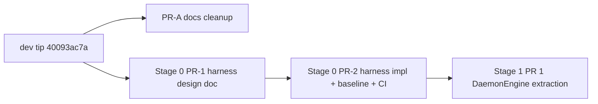

# Stage 1 PR 1: DaemonEngine extraction 

## Spec anchor

Spec: [`docs/V3_ENGINE_TRAIT_BOUNDARIES.md`](docs/V3_ENGINE_TRAIT_BOUNDARIES.md), accepted at Round 5 (`e484d5041`, merged to `dev` at `40093ac7a`).

Per §8.1, `DaemonEngine` lands first; subsequent traits (`LedgerEngine`, then `RefreshEngine` + `PendingTxEngine` in parallel) get their own plans informed by what this PR surfaces.

## Phase structure



**PR-A is independent** of both Stage 0 and Stage 1 — it lands FOLLOWUPS entries deferred during Round 4b. Can land in parallel with Stage 0 PR-1 (design) or Stage 0 PR-2 (implementation).

**Stage 0 is its own infrastructure phase**, distinct from Stage 1 trait extractions. Per the user's adversarial analysis: Stage 0 is "harness + measurement infrastructure only"; it does NOT introduce trait definitions or type-parameter prep. The §8.2 amendment co-landing pattern doesn't apply to trait *creation* (only to amendments to existing traits); each Stage 1 per-trait PR follows the same shape (trait + type-param + interior mutability + measurement) for seven-trait consistency.

**Stage 1 PR 1 (DaemonEngine extraction) blocks on Stage 0's frozen baseline.** The trait extraction PR uses a development-time three-checkpoint measurement discipline (pre-change → post-type-parameter → post-interior-mutability) to attribute any cost delta cleanly to its source; only the final committed delta lands in `PERFORMANCE_BASELINE.md`.

---

## PR-A — docs follow-on cleanup (tiny)

**Branch:** `chore/stage-1-prereq-followups-cleanup`

**Scope:** two `docs/FOLLOWUPS.md` entries deferred during Round 4b. Single commit, ~10 lines.

**Changes:**

- [`docs/FOLLOWUPS.md`](docs/FOLLOWUPS.md) — add V3.0 entry: *"Stage 1 performance baseline measurement is binding before any Stage 1 trait-extraction PR merges (per `V3_ENGINE_TRAIT_BOUNDARIES.md` §3.3.1). Closes when the harness PR lands the frozen baseline in `docs/PERFORMANCE_BASELINE.md`."*
- [`docs/FOLLOWUPS.md`](docs/FOLLOWUPS.md) — add V3.x entry: *"Stage 4 lifecycle async cutover requires `CHANGELOG.md` flagging per `V3_ENGINE_TRAIT_BOUNDARIES.md` §2.8.7 (the `Engine::create` sync→async signature change at the cutover commit)."*

**PR description:** normal-PR-quality (clear scope, clear rationale, clear changes); ~one paragraph naming the two FOLLOWUPS entries and that they were deferred during Round 4b. The §8.2 third-bullet discipline is for trait-amendment PRs specifically and does not apply here — borrowing it for a tiny docs cleanup over-applies a discipline meant for a specific case.

---

## Stage 0 — measurement harness + frozen baseline + CI (two PRs, multi-week)

**Decision pinned now (per Push 1 of the second adversarial pass):** Stage 0 lands as **two PRs**, not one. The design-vs-implementation split is committed before Phase 0a begins, not deferred.

- **Stage 0 PR-1 (design):** branch `chore/stage-0-harness-design`. Lands `docs/design/STAGE_0_HARNESS.md` with the six named decisions below. Reviewable independently as a design contract.
- **Stage 0 PR-2 (implementation):** branch `chore/stage-0-harness-impl`. Lands the criterion benches, baseline numbers, CI integration, and threshold sanity-check. Implementation honors what PR-1 pinned.

Three reasons the split is right and worth pre-committing:

1. **Six decision areas is a real design surface** that warrants its own review. Bundling design with implementation forces reviewers to evaluate "is the design right?" and "does the implementation honor it?" simultaneously — two questions of different shape.
2. **Same discipline that produced the trait spec.** Round 4a's phase splits surfaced design decisions for review *before* drafting. Stage 0 inherits the same discipline at a smaller scale.
3. **Avoids implementation-driven design.** Drafting design inline with implementation pulls toward "the design doc is what the implementation already does" rather than "the implementation honors what the design pinned." Separation produces design-driven implementation.

**Scope:** the §3.3.1 measurement gate's prerequisite, framed as its own infrastructure phase distinct from Stage 1 trait extractions. Per the adversarial analysis: Stage 0 produces the harness and baseline that Stage 1 PRs measure against; the §8.1 within-Stage-1 ordering stays intact.

### Design-doc-vs-spec relationship (framing for the executing agent)

The trait spec ([`docs/V3_ENGINE_TRAIT_BOUNDARIES.md`](docs/V3_ENGINE_TRAIT_BOUNDARIES.md)) is a contract; Stage 0's design doc is implementation governance. **Design docs implement the contract; they do not amend it.** If Stage 0's design surfaces a contract issue, that's a Round 6 spec-amendment situation (unlikely but possible per the watchpoint below) — handled in the trait spec, not in `docs/design/STAGE_0_HARNESS.md`. The executing agent must not conflate "design decision in Stage 0 doc" with "spec amendment in trait spec."

### Stage 0 internal phasing

**Phase 0a — design doc (Stage 0 PR-1).** Apply the same discipline the spec used: multi-framing gap-check before drafting, rejection-with-reasoning for harness scope decisions. Location pinned: [`docs/design/STAGE_0_HARNESS.md`](docs/design/STAGE_0_HARNESS.md) (new file). If `docs/design/` does not yet exist, this PR creates it; future spec-implementation governance docs (Phase 2b `StakeEngine` design notes, etc.) inherit the location convention. The doc names decisions on:

1. **Benchmark selection.** The spec lists §3.3.1's hot paths at category-level ("the hot read paths"); the harness pins the specific bench list. Boundary: spec stays at category-level pinning; harness's specific path list is a harness-document concern. If harness work surfaces "we need to bench these specific six methods, not the four §3.3.1 categorically lists," that's a harness refinement — *not* a spec refinement that requires Round 6.
2. **Baseline statistics.** Median? Mean? p99? Distribution? Pick one or several; commit to which numbers `PERFORMANCE_BASELINE.md` carries.
3. **Environmental variance handling.** CPU governor (performance vs powersave), thermal throttling detection, background-process noise floor, dedicated bench host vs CI runner. The §3.3.1 thresholds (10% / 25%) only mean something if variance is well below them.
4. **CI integration.** Automatic threshold-cross flag vs reviewer-judgment-only. PR-comment posting? Annotated GitHub-action checks? How does the harness signal the threshold-cross to the PR review surface?
5. **Harness's own update discipline.** When does the harness gain new benchmarks (Stage 2 actor methods? V3.1 multisig? V3.x archival)? Commit to a discipline — e.g., new traits add their measured methods to the harness as part of the trait-extraction PR.
6. **Stage 0 ↔ Stage 4 (§10.2.2) extension story.** Stage 4's cost characterization (deferred per §10.2.2) measures actor-backed implementations. Don't bake monolithic-only assumptions into Stage 0's harness — design it so the same `criterion` benchmarks work whether the implementation is concrete or actor-backed. This is forethought, not Stage 0 blocker.

The design doc's own "what are we missing" check applies: gap-check the harness design against (a) what would the first Stage 1 PR reviewer ask?, (b) what would future spec authors cite?, (c) what is implicit-but-discoverable-late in the harness's own surface?

**Phase 0b — harness implementation (Stage 0 PR-2, part 1).** Criterion benchmarks for the five §3.3.1-named hot paths (the harness's specific list may extend per Phase 0a's decisions). All bench against the *existing* monolithic `Engine<S>` surface — apples-to-apples comparison for subsequent Stage 1 PRs:

| Hot path | Crate / location for new bench file |
|---|---|
| `KeyEngine::account_public_address` | new `rust/shekyl-engine-core/benches/key_account_public_address.rs` (calls `Engine::account_public_address` or current equivalent) |
| `LedgerEngine::balance` | new `rust/shekyl-engine-core/benches/ledger_balance.rs` (calls `Engine::balance` via the engine surface, not via `shekyl-engine-state` directly) |
| `LedgerEngine::synced_height` | extend or new `rust/shekyl-engine-core/benches/ledger_synced_height.rs` |
| `EconomicsEngine::current_emission` | new `rust/shekyl-engine-core/benches/economics_current_emission.rs` |
| `EconomicsEngine::parameters_snapshot` | new `rust/shekyl-engine-core/benches/economics_parameters_snapshot.rs` |

The pre-read confirmed `criterion = "0.5"` is already pinned in `shekyl-engine-core/Cargo.toml`; existing benches (`refresh_snapshot`, `multisig_v31`) provide a Criterion configuration template to follow.

**Phase 0c — baseline capture + CI integration + threshold sanity-check (Stage 0 PR-2, part 2).**

- Run each bench at Stage 0 PR-2's SHA; record numbers in [`docs/PERFORMANCE_BASELINE.md`](docs/PERFORMANCE_BASELINE.md) per §3.3.1 Component 2 (methodology, host conditions, sampling, baseline numbers — post-interior-lock numbers and per-PR deltas remain blank until Stage 1 PRs fill them).
- Wire the harness into CI per Phase 0a's design decision.
- **Threshold sanity-check.** Measure run-to-run variance across the five hot-path benches; compare against §3.3.1's 10% and 25% thresholds.
  - **If variance is comfortably below thresholds (likely outcome):** no amendment needed; the §3.3.1 numbers stand verified, Stage 0 ships clean.
  - **If a refinement is needed: standalone spec update during Stage 0 (Stage 0 PR-2), NOT §8.2 co-landing with Stage 1 PR 1.** Decision pinned now (per Push 4 of the second adversarial pass). Three reasons: (1) the amendment is structurally Stage 0 work — it refines a Stage 0 measurement, not a Stage 1 trait surface; (2) Stage 1 PR 1's review surface is already substantial (trait + type-param + interior mutability + MockDaemon + derive_seed + hybrid test + measurement); adding a spec amendment to that scope risks reviewer attention overflow; (3) the §8.2 co-landing pattern was designed for trait amendments that affect implementors — a threshold parameter refinement does not affect implementors, so the co-landing pattern is the wrong tool. If the refinement is needed, Stage 0 PR-2 ships harness + amendment together; Stage 1 PR 1 inherits the refined thresholds.
- **Spec framing tightening (handled via PR description, NOT Round 6):** §3.3.1's "first Stage 1 PR that lands the measurement harness" framing was written before the Stage 0 reframing existed. The substantive content of §3.3.1 (frozen baseline + per-PR deltas) is unchanged; only the *timing of when the harness lands* shifts to Stage 0. Update §3.3.1 Component 1 in-place to name the harness as Stage 0's deliverable and Stage 0 PR-2's SHA as the frozen reference (single-line edit). This is contextual tightening — not a substantive Round 6 amendment — and Stage 0 PR-2's description carries the explanation.

### Watchpoints

- **Bench scope.** §3.3.1 names a minimum of five paths; Phase 0a's design decisions may extend the list. The category-vs-specific boundary lives in the design doc.
- **Host-condition documentation.** Record CPU model, kernel, allocator, build profile (`--release` with the project's standard codegen settings) in `PERFORMANCE_BASELINE.md`. Required for reproducibility per §3.3.1.
- **No `derive_seed` helper, no `MockDaemon` in this phase.** Per the user's confirmation: helper-with-first-caller discipline. The §6.2 helper has no users until Stage 1 PR 1's hybrid tests need it; landing the helper in Stage 0 produces dead code and prevents reviewers from seeing helper + first caller together.
- **Stage 0 might re-open the spec.** Honest framing: if Phase 0a's design surfaces something requiring spec revision (e.g., the bench-statistics decision implies a §3.3.1 wording change beyond the framing tightening), that's a Round 6 candidate. Round 5's "Case A holds" framing assumed implementation wouldn't surface structural items; Stage 0 *is* implementation-adjacent. If Stage 0 surfaces structural items, the round count's "6" becomes "6 + a small Round 7 for harness-surfaced refinements." Defensible but worth naming.
- **Threshold sanity-check might surface a small spec amendment.** Disposition pinned: standalone spec update in Stage 0 PR-2, never §8.2 co-landing with Stage 1 PR 1. See Phase 0c above for rationale.

---

## Stage 1 PR 1 — DaemonEngine extraction

**Branch:** `feat/stage-1-daemon-engine`

**Bundling rationale (per the adversarial analysis):** this PR bundles trait creation + type parameter introduction + interior mutability + MockDaemon + first hybrid test + measurement. The §8.2 amendment co-landing pattern doesn't apply here — that pattern separates trait *amendments* from consumer changes; trait *creation* has no existing implementor distinction to preserve. Seven-trait consistency (each per-trait PR follows the same shape) and clean cost attribution via the development-time three-checkpoint discipline (step 8 below) replace any benefit from a separate "structural prep" PR.

**Spec surface (§2.5, lines 999–1008):**

```rust
pub trait DaemonEngine: shekyl_rpc::Rpc + Clone + Send + Sync + 'static {
    type Error: Into<IoError>;

    async fn get_fee_estimates(&self) -> Result<FeeEstimates, Self::Error>;
    async fn submit_transaction(
        &self,
        tx_bytes: Vec<u8>,
    ) -> Result<TxSubmitOutcome, Self::Error>;
}
```

Inherited `Rpc` methods are *not* duplicated on `DaemonEngine`; consumers reach them via the supertrait bound.

### Changes

**1. Define the trait.** New module `rust/shekyl-engine-core/src/engine/traits/daemon.rs` (or extend an existing `traits` module if one exists; verify in clean chat). Visibility `pub(crate)` per §2 preamble Round 4a Item 13 (the seven traits ship `pub(crate)` until JSON-RPC server cutover at V3.2).

**2. Implement `DaemonEngine` for the existing `DaemonClient`.** [`rust/shekyl-engine-core/src/engine/daemon.rs`](rust/shekyl-engine-core/src/engine/daemon.rs) — add the impl block. The `submit_transaction` and `get_fee_estimates` methods either delegate to existing `DaemonClient` methods (if they exist) or wrap the underlying `SimpleRequestRpc` calls. Verify what's already on `DaemonClient` versus what needs new method bodies.

**3. Generic-ize `Engine<S>`.** [`rust/shekyl-engine-core/src/engine/mod.rs`](rust/shekyl-engine-core/src/engine/mod.rs):

- `pub struct Engine<S: EngineSignerKind>` becomes `pub struct Engine<S: EngineSignerKind, D: DaemonEngine = DaemonClient>`.
- `daemon: DaemonClient` field becomes `daemon: D`.
- `Engine::daemon(&self) -> &D` (was `-> &DaemonClient`).
- The default type parameter `D = DaemonClient` keeps every existing call site that names `Engine<S>` compiling unchanged.

**4. Generic-ize lifecycle entry points.** [`rust/shekyl-engine-core/src/engine/lifecycle.rs`](rust/shekyl-engine-core/src/engine/lifecycle.rs) — `create` and `open*` signatures (~5 sites at lines 381, 501, 602, 621, 639 per the pre-read) become generic over `D`. Default `D = DaemonClient` keeps callers compiling.

**5. Refresh: replace `daemon.inner()` with trait-bound calls.** [`rust/shekyl-engine-core/src/engine/refresh.rs`](rust/shekyl-engine-core/src/engine/refresh.rs) — four `inner()` sites (lines ~1460, 1514, 1875, 1892 per pre-read) currently call `&SimpleRequestRpc` methods. Migrate to calling `Rpc` methods directly on `&D` (the `Rpc` supertrait bound makes the methods reachable). One clone site at ~1448 also needs to clone the generic `D` instead of `DaemonClient`.

**6. `MockDaemon` per §6.1.** [`rust/shekyl-engine-core/src/engine/test_support.rs`](rust/shekyl-engine-core/src/engine/test_support.rs) — new `pub(crate) struct MockDaemon` with:

- `MockDaemon::with_seed(seed: [u8; 32]) -> Self` per §6.2.
- Full `DaemonEngine` impl that satisfies the §6.1 contract:
  - `submit_transaction` dedupes by tx hash exactly as the real daemon does (per §5.2 layered-call walk and §6.3 `MockDaemon::submit_transaction` bullet).
  - Cancellation contract per §3.4.3 (class-b for `submit_transaction`, class-a for `get_fee_estimates`); inherited `Rpc` methods follow §4 classifications.
  - Failure injection capable of producing `RuntimeFailure { actor: "MockDaemon", reason }` with each `ActorCrashReason` variant (`PanickedDuringHandler`, `DrainedDuringSupervisorCascade`, `Permanent`) per §5.1.
- `Clone` impl (the `DaemonEngine` supertrait requires it).

**Failure-injection API decisions pinned now (per Push 2 of the second adversarial pass), so implementation produces a consistent API rather than a draft-then-debate-then-revise API:**

- **Question A — per-call vs per-instance: per-call queue.** `MockDaemon::queue_failure(reason: ActorCrashReason)` enqueues one failure that the next call returns; subsequent calls succeed normally. Pattern after the existing `MockRpc::queue_height_error` / `queue_block_error` (which the §6.1 contract already references). This composes naturally with `MockDaemon::queue_failure` being callable multiple times to enqueue a sequence of failures.
- **Question B — failure injection vs dedup: injection takes precedence.** A queued failure on `submit_transaction` returns the failure even if the tx hash would otherwise hit dedup. Rationale: dedup is a daemon-side property; the failure injection models "the actor crashed before reaching the daemon-side dedup." Tests exercising §5.2's retry contract under failure want predictable failure-then-success behavior; failure-then-dedup would be less testable.

**`submitted_hashes` accessor (added per Push 3 of the second adversarial pass to support the first hybrid test's assertion shape):** `MockDaemon::submitted_hashes(&self) -> Vec<TxHash>` returns the ordered list of tx hashes that reached the dedup table (i.e., submissions that were not failure-injected away). Test authors assert against this accessor for "the daemon observed this submission" semantics.

**7. `derive_seed` master-seed helper per §6.2.** [`rust/shekyl-engine-core/src/engine/test_support.rs`](rust/shekyl-engine-core/src/engine/test_support.rs) — new `pub(crate) fn derive_seed(master_seed: &[u8; 32], role_tag: &[u8]) -> [u8; 32]`. Algorithm at the helper's discretion (HKDF-SHA256 or BLAKE2b-keyed are typical; the spec pins the contract, not the algorithm). Document the algorithm in the function's rustdoc so test authors reading test failures can trace the derivation.

**8. First hybrid test exercising the master-seed pattern.** New test in `rust/shekyl-engine-core/src/engine/refresh.rs` test module (or a new `tests/` integration target if cleaner) that:

- Defines a literal master seed (test name includes a hex prefix per §6.2).
- Uses `derive_seed(master, b"role/daemon")` to seed `MockDaemon`.
- Composes `Engine<SoloSigner, MockDaemon>` and exercises one end-to-end path that reaches `submit_transaction` (e.g., the existing `engine/refresh.rs` driver-side test, but now against `MockDaemon` instead of an unreachable `SimpleRequestRpc` URL).

**Specific assertions pinned now (per Push 3 of the second adversarial pass), because the first hybrid test sets the pattern for subsequent hybrid tests — vague-first means vague-onward, precise-first gives a template:**

1. `submit_transaction(tx_bytes)` returns `Ok(TxSubmitOutcome::Submitted { .. })` (the success variant; exact shape verified during implementation against the real `TxSubmitOutcome` enum).
2. `mock_daemon.submitted_hashes()` contains exactly one entry equal to the expected tx hash (computed from `tx_bytes`).
3. Calling `submit_transaction(tx_bytes)` a second time with the same bytes returns `Ok(TxSubmitOutcome::AlreadyKnown { .. })` or the equivalent dedup-success variant (verifies dedup behavior matches §5.2).
4. After the second call, `mock_daemon.submitted_hashes()` still contains exactly one entry (dedup is observable: same hash isn't double-counted).

These assertions exercise: success path (1), daemon-observed-the-submission semantics (2), retry-safety under same-hash resubmission per §5.2 (3), and dedup non-double-counting (4). Subsequent hybrid tests for other traits use this assertion shape as a template — observable behavior on returned values + observable behavior on mock-instance accessors, never internal state.

**9. §1.6 documentation discipline rustdoc.** Each method on `DaemonEngine` (and the trait itself) carries:

- `# Panics` section or "Never panics" note (per §1.6 bullet 1).
- Cancellation class reference (per §1.6 bullet 2): `submit_transaction` is class-b; `get_fee_estimates` is class-a per §4.
- Idempotency note (per §1.6 bullet 3): `submit_transaction` is "conditionally idempotent (daemon dedupes by tx hash) — see §5.2 for retry contract"; `get_fee_estimates` is "yes — read-only".

**10. Three-checkpoint measurement against Stage 0's frozen baseline (development-time discipline).** Re-run the five §3.3.1 benches at three points during PR development:

| Checkpoint | When | Purpose | Committed? |
|---|---|---|---|
| (a) pre-change | Before any code edit | Sanity-check: environment matches Stage 0; deltas near 0% confirm reproducibility | No (development-time) |
| (b) post-type-parameter | After step 3 (`Engine<S, D = DaemonClient>`), before step 6 (interior mutability via `MockDaemon` integration) | Isolates monomorphization cost — should be ≈ 0% under release builds | No (development-time) |
| (c) post-interior-mutability | After steps 5–6 land (final state) | Isolates the trait-extraction's actual cost; this is what gets compared against the 10% / 25% thresholds | **Yes — recorded in `PERFORMANCE_BASELINE.md`** |

Only checkpoint (c) is committed as the per-PR delta. Checkpoints (a) and (b) are development-time discipline that gives clean attribution if a regression appears (if (b) shows non-trivial cost, type-parameterization is the source; if (b) is clean and (c) shows cost, interior mutability is the source). Confirm no path at checkpoint (c) crosses the 10% justification threshold.

Expected outcome: deltas near 0% on `KeyEngine`/`LedgerEngine`/`EconomicsEngine` paths (DaemonEngine extraction doesn't change them); `DaemonEngine`-path benches don't exist yet (those land when `LedgerEngine`/etc. extractions add them via subsequent Stage 1 PRs).

**11. `CHANGELOG.md` [Unreleased] entry.** [`docs/CHANGELOG.md`](docs/CHANGELOG.md) — add a one-line entry under [Unreleased] / Internal naming `DaemonEngine` trait extraction as the first Stage 1 PR.

### Watchpoints

- **`Rpc` supertrait method ownership.** `shekyl_rpc::Rpc` lives in `rust/shekyl-oxide/shekyl-oxide/rpc/` (the upstream-vendored crate, per `10-shekyl-first.mdc`). Do *not* modify `Rpc` to make `DaemonEngine` work; if a method is missing on `Rpc`, that's a §8.2 amendment situation (two-commit form: amendment commit + consumer commit + PR-description bullet naming the amendment).

- **Default type parameter compatibility.** Verify by `cargo check --workspace` after step 3 that no downstream crate (`shekyl-engine-rpc`, `shekyl-cli`, `shekyl-mobile-wallet`'s engine consumers if any in this repo) breaks. Default type params are usually backward-compatible, but generic-bound additions can surface in subtle ways.

- **`refresh.rs` `inner()` → `&D` migration is type-driven.** Each `inner()` call returned `&SimpleRequestRpc`; the replacement calls a `Rpc` method on `&D` directly. The compiler will guide this — do *not* preserve `inner()` as a compatibility shim (per `60-no-monero-legacy.mdc` and `15-deletion-and-debt.mdc` defaults: delete the indirection, don't shim around it).

- **`MockDaemon` failure-injection surface.** API pinned in step 6 above: `MockDaemon::queue_failure(reason: ActorCrashReason)` (per-call queue) + injection-takes-precedence-over-dedup. Pattern after the existing `MockRpc::queue_height_error` / `queue_block_error` in [`rust/shekyl-engine-core/src/engine/test_support.rs`](rust/shekyl-engine-core/src/engine/test_support.rs). The §6.1 contract requires mocks to honor the full trait contract including failure modes; `MockDaemon::with_seed` alone isn't enough.

- **`derive_seed` algorithm choice.** HKDF-SHA256 is the safe default; the project's existing crypto-pq surface uses HKDF for KEM context separation. Reusing HKDF keeps the dependency surface small (already pulled in transitively). Document the algorithm in the helper's rustdoc.

- **`§5.2` reachability at Stage 1.** Per §5.1 line 3154–3162, `RuntimeFailure` is *unreachable* from real Stage 1 implementations because the outer `Arc<RwLock<Engine>>` lock prevents the actor-crash topology. `MockDaemon` failure-injection lets tests exercise §5.2's retry contract *now* against the trait surface, which is what makes the contract testable before Stage 4. Tests use the master-seed pattern to keep the failure injection deterministic.

- **§7 invariants are inherent to lifecycle, not the trait.** Per Round 4a Item 4, lifecycle methods (`create`, `open*`, `close`) are inherent on `Engine<S, D>`, not on `DaemonEngine`. This PR doesn't put lifecycle methods on the trait surface; only `get_fee_estimates`, `submit_transaction`, and inherited `Rpc` methods are on the trait.

### PR description requirements

Per §8.2 PR-description third bullet:

- Names the spec amendment status: *"Implements §2.5 verbatim; no §8.2 trait amendment in this PR. If implementation surfaces a need for a method not in §2.5, the §8.2 two-commit amendment form applies."*
- Names the §3.3.1 measurement disposition: per-PR delta (checkpoint (c) only) recorded in `PERFORMANCE_BASELINE.md`; baseline frozen at Stage 0's SHA; this PR's delta is within the 10% threshold; the three-checkpoint attribution result (e.g., "type-parameterization measured at +0.3%, interior mutability measured at +1.1%, total +1.4%, well within threshold").
- Names the §1.6 documentation discipline status: every new public method on `DaemonEngine` carries panic / cancellation / idempotency rustdoc per the three bullets.

---

## Branching-policy compliance

Per [`.cursor/rules/06-branching.mdc`](.cursor/rules/06-branching.mdc):

- All branches branch off `dev`, land on `dev`, never touch `main` directly.
- Descriptive branch names: `chore/stage-1-prereq-followups-cleanup` (PR-A); `chore/stage-0-harness-design` (Stage 0 PR-1); `chore/stage-0-harness-impl` (Stage 0 PR-2); `feat/stage-1-daemon-engine` (Stage 1 PR 1).
- Each branch should land within 5 working days. PR-A is hours; Stage 0 PR-1 (design doc) is days; Stage 0 PR-2 (implementation + baseline + CI) is days-to-a-week; Stage 1 PR 1 is days-to-a-week. Stage 0 PR-2 blocks on Stage 0 PR-1 landing.
- No `main` operations; no force-push to `dev`; no branch deletions without confirmation.
- Each push is a separate authorization (per rule 4); the executing agent surfaces commits and waits for explicit push instruction.

## Recurring pattern across Stage 1 PRs (named explicitly for reviewer expectation)

`Engine<S>` today has a single type parameter. Per §3's composition, by the end of Stage 1 it becomes `Engine<S, K, L, E, D, F, R, P>` — every per-trait PR adds a type parameter, not just the first one.

Each addition is mechanical (default type parameter preserves every existing call site that names `Engine<S>` without the new parameter), but each addition is a real change to the type signature that ripples through every site that names `Engine<S>` in bounds or as a return type. This PR's contribution to the pattern is `Engine<S> → Engine<S, D = DaemonClient>` (step 2 above); the next six Stage 1 PRs each contribute one more.

The spec anticipates this — §3.1's implementing types table and §8.1's ordering both presume the additive type-parameter pattern. Named here explicitly so that Stage 1 PR reviewers (this PR and the six that follow) don't perceive the type-parameter addition as scope creep. **"Adds type parameter X with default = LocalX" is the recurring change pattern; reviewers should expect it across all seven PRs.**

The default-type-parameter discipline is what makes this safe: every existing site naming `Engine<S>` continues to compile because each new parameter has a default. New code can opt into the generic surface (e.g., `Engine<S, MockDaemon>` in tests) without forcing every call site to thread the parameter through.

## What this plan deliberately defers

- **`LedgerEngine` extraction (§8.1 next).** Its own plan, informed by what Stage 1 PR 1 (DaemonEngine) surfaces. Will follow the same per-trait shape (trait + type-param + interior mutability + measurement) for seven-trait consistency. Will *not* re-do Stage 0 — the harness Stage 0 produces is reused.
- **Subsequent Stage 1 traits.** Each gets its own plan.
- **Adapting the workflow patterns into durable infrastructure (`docs/SPEC_WORKFLOW.md` or similar).** Defer until Phase 2b `StakeEngine` validates the patterns against a second spec cycle.
- **The §6.2 helper's choice of HKDF vs BLAKE2b-keyed.** Implementation detail; the plan permits either as long as the contract `derive_seed(master, role_tag) → seed` is deterministic and documented.

## Comprehensive-prompt seed for the clean chat

When ready to execute, the clean-chat prompt should include:

1. This plan in full (it's the comprehensive seed).
2. The user's authorization to begin (specifically: which phase to start with — PR-A and Stage 0 design can begin in parallel; Stage 1 PR 1 blocks on Stage 0 implementation + baseline).
3. The expected workflow: the executing agent drafts each PR on its own branch, commits with messages following [`.cursor/rules/90-commits.mdc`](.cursor/rules/90-commits.mdc), surfaces the commits without pushing, and waits for explicit push instruction per branching rule 4.
4. Reference to this plan's commit (the planning conversation's transcript can be cited if needed for audit).