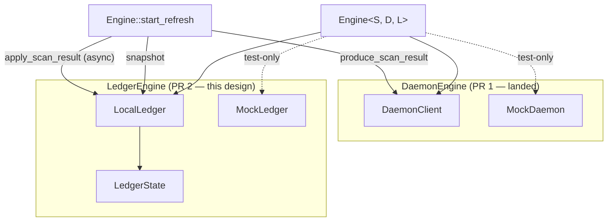

# Stage 1 PR 2 — `LedgerEngine` extraction — design

> **⚠ Staleness notice (post-Phase-0c).** Phase 0b
> ([PR #23](https://github.com/Shekyl-Foundation/shekyl-core/pull/23))
> and Phase 0c
> ([PR #25](https://github.com/Shekyl-Foundation/shekyl-core/pull/25))
> amended `V3_ENGINE_TRAIT_BOUNDARIES.md` §2.2 after this design doc
> was written. Inline references in §1.2, §2.1, §3.2, §5, §6, and §7
> below to (a) the now-removed `Balance` / `BalanceFilter` /
> `TransferFilter` types and (b) the now-removed `transfers()` trait
> method are **stale**. The binding contract for PR 2's surface is
> the spec at `V3_ENGINE_TRAIT_BOUNDARIES.md` §2.2 (post-Phase-0c
> four-method surface: `synced_height` / `snapshot` / `balance` /
> `apply_scan_result`); the design-doc realignment co-lands in PR 2's
> commit 9 per the alt-(c') template precedent established in PR #23.
> Reviewers reading this doc before commit 9 lands should treat it as
> spec-authority-supersedes for the affected sections.

**Status.** Stage 1 PR 2 of the seven-trait extraction chain pinned in
[`docs/V3_ENGINE_TRAIT_BOUNDARIES.md`](../V3_ENGINE_TRAIT_BOUNDARIES.md)
§8.1. Three pre-flight doc-only spec amendments landed before
substantive work began (Phases 0, 0b, 0c — all merged to `dev`
before the `feat/stage-1-ledger-engine` branch was cut from the
post-Phase-0c dev tip):

- **Phase 0** —
  [PR #22](https://github.com/Shekyl-Foundation/shekyl-core/pull/22)
  (reservation-tracker ownership correction in §2.2).
- **Phase 0b** —
  [PR #23](https://github.com/Shekyl-Foundation/shekyl-core/pull/23)
  (trait surface narrowing: drop `Balance` /
  `BalanceFilter` / `TransferFilter` filter types from the §2.2
  surface; use `BalanceSummary` directly).
- **Phase 0c** —
  [PR #25](https://github.com/Shekyl-Foundation/shekyl-core/pull/25)
  (drop `LedgerEngine::transfers()` from the §2.2 surface to
  preserve `TransferDetails`'s `!Clone` privacy discipline; the
  drift surfaced at commit-3 compile time, not pre-flight).

Phase 1 (the implementation work) cuts the
`feat/stage-1-ledger-engine` branch off the post-Phase-0c dev tip
and lands the nine substantive commits + one docs commit scoped
in §5. As of this document's most recent revision, Phase 1 commits
1–8 have landed on the feature branch; commit 9 (this docs
propagation) is the in-flight commit.

This document is the in-repo design contract that PR 2 implements.
The structure mirrors
[`docs/design/STAGE_0_HARNESS.md`](STAGE_0_HARNESS.md): the trait
spec is the contract, this document is the implementation
governance for the per-PR work that the contract already pins
abstractly.

The long-form draft history lives ephemerally in
`.cursor/plans/stage_1_pr_2_plan_*.plan.md`. This document is the
durable, in-repo equivalent — the source-of-truth for PR 2's scope
once the design doc lands. PR-2 reviewers verify against §6 below;
the plan file's pre-design wording is historical context, not a
checklist.

---

## 1. Scope

### 1.1 Phases 0 / 0b / 0c — spec amendments (doc-only, prerequisite)

Three single-commit doc-only PRs against
[`docs/V3_ENGINE_TRAIT_BOUNDARIES.md`](../V3_ENGINE_TRAIT_BOUNDARIES.md)
§2.2, each landed as a non-additive amendment re-opening the spec
for a new round per §8.2's closing clause. The §2.2 surface PR 2
implements is the cumulative post-Phase-0c shape.

**Phase 0 — reservation-tracker ownership correction
([PR #22](https://github.com/Shekyl-Foundation/shekyl-core/pull/22)).**

1. **Ownership correction.** Replace §2.2's stale "the runtime-only
   `BTreeMap<ReservationId, Reservation>` reservation tracker"
   ownership line with a pointer to §2.4. The ownership claim was
   a one-sided spec bug — every other location in the spec (§2.4,
   §1.5's actor-or-not table, §2's Round 3 trait-surface sweep,
   §3.1's Stage 1 implementing-types table, §3.2 layered call walk,
   §4 idempotency table) consistently places the tracker under
   `PendingTxEngine`, and §2.2's own trait surface defines zero
   methods that touch the tracker.
2. **`LedgerEngine::balance` reservation-agnosticism pin.** Make
   the previously-implicit semantic decision explicit: `balance`
   answers "what does the ledger say is mine?", not "what is
   currently spendable given in-flight reservations?" Spendable-
   balance computation is on `PendingTxEngine` or `Engine<S>`,
   not on `LedgerEngine`. The pin includes a safety-valve clause
   so a future revision (e.g., a `spendable_balance` helper if
   call patterns favor it) can land through §7's additive-revision
   process.
3. **§1.5 actor-identity application.** Record why the reservation
   tracker stays grouped with `PendingTxEngine` rather than
   becoming its own actor — tracker consistency requirements bind
   it tightly to in-flight transaction bytes and signing state, so
   isolating it produces no real failure-isolation benefit.

A "Stage 1 PR 2 spec-clarification" provenance subsection at the
end of §2.2 enumerates the cross-anchors that already align and
captures what the amendment changed vs. what it did not.

**Phase 0b — trait surface narrowing
([PR #23](https://github.com/Shekyl-Foundation/shekyl-core/pull/23)).**

The pre-flight pass for commit 1 surfaced that §2.2's trait surface
referenced a `Balance` type alongside `BalanceFilter` and
`TransferFilter` parameter types that no current Rust crate defines
— the design carry-over predated the §3.1 / §7 BalanceSummary→Balance
rename deferral, and the filter parameters had no current consumer.
Phase 0b narrows the §2.2 surface to drop the filter types entirely
and use `BalanceSummary` directly (`balance(&self) -> BalanceSummary`,
no parameters); the surface is a strict subset of the original. The
amendment is non-additive (a method signature change) and re-opens
§2.2 for a new round per §8.2's closing clause.

**Phase 0c — drop `transfers()` for `!Clone` discipline
([PR #25](https://github.com/Shekyl-Foundation/shekyl-core/pull/25)).**

The `transfers()` method declared in §2.2 returned
`Vec<TransferDetails>`. `TransferDetails` is deliberately `!Clone`
per the privacy-focused security discipline (no implicit secret
duplication; `00-mission.mdc` priority 1 is preconditional). The
`Vec<TransferDetails>` ownership-transfer signature is unsatisfiable
for `LocalLedger` without breaking the `!Clone` discipline at the
trait-impl level. The drift surfaced at commit-3 compile time —
the pre-flight pass had verified type alignment and the migration
sites but not trait-bound implications against derive policies. The
discipline pattern is documented in §2.2's "Pre-flight drift
expectation" subsection (added in
[PR #24](https://github.com/Shekyl-Foundation/shekyl-core/pull/24);
refined in this commit's lifecycle-coverage update). Phase 0c drops
`transfers()` from the trait surface; per-transaction history is
read directly from the underlying `LedgerBlock`'s `transfers()`
slice accessor (a `&[TransferDetails]` borrow that does not
duplicate secrets) for the foreseeable future.

**Cumulative §2.2 surface post-Phase-0c.** The trait declares four
methods:

- `synced_height(&self) -> u64` (sync, infallible read).
- `snapshot(&self) -> LedgerSnapshot` (sync, infallible read).
- `balance(&self) -> BalanceSummary` (sync, infallible read).
- `apply_scan_result(&self, ScanResult) -> Result<(),
  RefreshError>` (async, mutating; `RefreshError::ConcurrentMutation`
  signals the §5.2 retry contract).

### 1.2 Phase 1 — implementation

Phase 1 lands the post-Phase-0c §2.2 trait surface and
parameterizes `Engine<S, D>` over a third type parameter
`L: LedgerEngine`:

- **Trait surface.** `pub(crate) trait LedgerEngine` with
  `synced_height` / `snapshot` / `balance` (sync, infallible
  read) and `apply_scan_result` (async, mutating). Surface defined
  in `rust/shekyl-engine-core/src/engine/traits/ledger.rs`,
  re-exported from `traits/mod.rs`.
- **Implementing aggregate.** `pub struct LocalLedger { state:
  RwLock<LedgerState> }` with `LedgerState` bundling
  `WalletLedger` and `LedgerIndexes`. Reservations stay flat on
  `Engine` for now —
  they migrate to `LocalPendingTx` when the `PendingTxEngine` PR
  lands. `LocalLedger`'s visibility is `pub` (not the originally-
  planned `pub(crate)`); §3.4 records the rationale (a `pub`
  default for a `pub` generic parameter must itself be `pub` for
  external compilation units to resolve it). The trait
  `LedgerEngine` itself stays `pub(crate)` per §1.4 of the
  contract.
- **`Engine` parameterization.** `Engine<S, D: DaemonEngine =
  DaemonClient, L: LedgerEngine = LocalLedger>` mirrors PR 1's
  default-type-parameter pattern. `OpenedEngine<S, D, L>` carries
  the same parameterization.
- **Async-`&self` mutation.** `apply_scan_result` flips from sync
  `&mut self` to async `&self` with interior `RwLock` per §2.2's
  Round 3 disposition. The producer-side outer `Arc<RwLock<Engine>>`
  guard inside `run_refresh_task` becomes a read-lock; the mutation
  is now interior to `LocalLedger`'s lock. The synchronous wrappers
  `Engine::refresh` and `Engine::refresh_with` retain their
  `LocalLedger`-specialized impl block in PR 2 because the sync
  entry points use `LocalLedger`'s inherent `.write()` directly
  (the trait method is `async fn`; runtime-handle threading from
  a sync caller is V3.x work, queued in `FOLLOWUPS.md`).
  `Engine::start_refresh` and the producer task `run_refresh_task`
  *are* generalized over `L: LedgerEngine` — partial generalization
  is sufficient for PR 2's hybrid retry test (commit 7) to dispatch
  through the trait against `MockLedger`.
- **Test substrate.** `MockLedger` + `replace_ledger` mirror
  `MockDaemon` + `replace_daemon` from PR 1. `MockLedger` queues
  `RefreshError::ConcurrentMutation` for failure injection.
- **Hybrid test.** One end-to-end test (`hybrid_apply_scan_result_
  retries_on_concurrent_mutation`) exercising the §5.2-equivalent
  retry contract for ledger.

This design doc does not pin every method body. PR 2 has degrees
of freedom on internal structure (e.g., the precise shape of
`LocalLedger`'s `read` / `write` guard helpers, whether
`Engine::ledger()` retains its `LedgerReadGuard` wrapper for the
migration window — see §7). Those decisions land at commit time
and surface in the PR description.

---

## 2. Relationship to `V3_ENGINE_TRAIT_BOUNDARIES.md`

This section consolidates the contract-vs-implementation
relationship, mirroring `STAGE_0_HARNESS.md` §2.

### 2.1 Contract vs implementation

The trait-boundaries spec
([`V3_ENGINE_TRAIT_BOUNDARIES.md`](../V3_ENGINE_TRAIT_BOUNDARIES.md))
is the **contract**. This design doc is the **implementation
governance** for PR 2's per-trait extraction. The contract pins
(at the post-Phase-0c §2.2 surface plus the cross-anchors
enumerated in §1.1):

- The trait method list (`synced_height`, `snapshot`, `balance`,
  `apply_scan_result`) and their async/sync split.
- The `&self` + interior-mutability discipline (Round 3
  disposition).
- The `Arc<LedgerSnapshot>`-via-actor reader pattern at Stage 4.
- The `RefreshError::ConcurrentMutation` cross-trait contract
  signal.
- The `RwLock<LedgerState>`-not-`Mutex<…>` lock-shape rationale
  (many readers, one writer).

The contract does **not** pin: the exact shape of `LocalLedger`'s
constructors, which internal accessors `LocalLedger` exposes for
the migration window (e.g., a `pub(crate) fn read(&self) ->
RwLockReadGuard<'_, LedgerState>` escape hatch and the dual
`fn write(&self) -> RwLockWriteGuard<'_, LedgerState>` used by
the sync `refresh` / `refresh_with` wrappers), the precise
`LedgerReadGuard` wrapper preserved at `Engine::ledger()` for the
migration window. Those are PR-2-internal choices and they land in
this PR's commits.

If something in this document appears to amend the contract, the
contract wins and this document is wrong. Phases 0 / 0b / 0c spec
amendments **are** contract changes; Phase 1's implementation work
is not.

### 2.2 PR-1-mirroring discipline (load-bearing)

PR 2's commit shape deliberately mirrors PR 1's: trait surface →
implementing type → impl → parameterization → call-site migration
→ mock + test fixture → hybrid test → bench capture → docs. PR 1
was 7 substantive commits + 1 docs commit; PR 2 is 9 substantive
commits + 1 docs commit. The two extra commits are `LocalLedger`
introduction (PR 1 didn't introduce a new aggregate type because
`DaemonClient` already existed) and dedicated call-site migration
(PR 1's call-site work was simpler).

The mirroring is intentional template-establishment for Stage 1's
remaining trait extractions. Reviewers familiar with PR 1's shape
navigate PR 2 efficiently because each commit maps to a PR 1
analog; the deltas are visible. PRs 3 onward (the §8.1 chain —
`KeyEngine`, `PersistenceEngine`, `EconomicsEngine` off-the-
critical-path; `RefreshEngine` and `PendingTxEngine` on it) are
expected to follow the same template with trait-specific deltas.
By PR 7 the per-trait template is fully canonized and deviations
require explicit reasoning. [Post-merge: PR 3 / `KeyEngine` landed
at the M3-series (2026-05-11) with the template inherited and
trait-specific deltas surfaced in the architectural-inheritance
migration sub-PRs M3a–M3e; remaining: `PersistenceEngine`,
`EconomicsEngine`, `RefreshEngine`, `PendingTxEngine`.]

**Per-trait PR spec-drift expectation (lifecycle, not just
pre-flight).** PR 2's lifecycle surfaced **three** spec drifts that
warranted doc-only amendments before — and during — substantive
work:

- **Phase 0** (pre-flight) — §2.2's reservation-tracker ownership
  claim (corrected in
  [PR #22](https://github.com/Shekyl-Foundation/shekyl-core/pull/22)).
- **Phase 0b** (pre-flight) — §2.2's trait surface declaring
  unimplemented `Balance` / `BalanceFilter` / `TransferFilter`
  types (corrected in
  [PR #23](https://github.com/Shekyl-Foundation/shekyl-core/pull/23)).
- **Phase 0c** (commit-3 compile time) — §2.2's `transfers(&self)
  -> Vec<TransferDetails>` signature unsatisfiable for `LocalLedger`
  given `TransferDetails`'s deliberate `!Clone` privacy discipline
  (corrected in
  [PR #25](https://github.com/Shekyl-Foundation/shekyl-core/pull/25)).

All three landed as single-commit doc-only PRs against `dev`,
framed per §8.2 as non-additive amendments re-opening the spec for
a new round.

The Phase 0c pattern is informative for PR 3+ template inheritance:
**pre-flight is one of several discovery points**, not the only
one. Pre-flight verifies what *exists* (referenced types, signature
shape, migration sites, external-crate impact). Compile-time
catches what is *satisfiable* given the implementor's existing
trait derives and security policies (which PR 2's pre-flight
verified existed but did not check were satisfiable). Review and
post-merge usage catch still-other classes. Cumulative coverage
across the full per-trait-PR lifecycle is what produces clean
trait surfaces; no single discovery point is sufficient.

Future per-trait PRs should expect the same. PR 3 (`KeyEngine` per
§8.1) and PRs 4–7 authors run their own pre-flight gap-check
([`05-system-thinking.mdc`](../../.cursor/rules/05-system-thinking.mdc)'s
"ask why is this here" discipline applied to the trait under
extraction); surfacing 1–2 small spec drifts somewhere in the
lifecycle is the **expected outcome**, not a defect. [Post-merge:
PR 3 / `KeyEngine` landed at the M3-series (2026-05-11) and
surfaced exactly this pattern at a higher density than the PR 2
forecast — the M3-series produced an architectural-inheritance
migration (M3a–M3e) and the pre-flight-FOLLOWUP-scope discipline
lemma surfaced post-merge by PR #40's audit; the "1-2 small spec
drifts" forecast underestimated the per-trait variance for
cryptographic surfaces per `16-architectural-inheritance.mdc`
density-expectations guidance. Future per-trait PRs on
cryptographic surfaces should budget proportionally more spec-drift
discovery than non-cryptographic ones.] The discovery points to
actively check, in roughly ascending cost-of-late-detection order:

1. **Pre-flight type-existence and signature check.** Every type
   and method in the trait surface resolves to an existing crate
   item with a compatible signature. (PR #22 was caught here.)
2. **Pre-flight type-redundancy check.** No orphaned filter /
   parameter types that no current crate defines and no current
   consumer needs. (PR #23 was caught here.)
3. **Pre-flight trait-bound-implication check.** The trait's
   signatures are *implementable* given the candidate implementor's
   existing trait derives and security policies (`Clone` /
   `ZeroizeOnDrop` / `Send` / `Sync`); the trait's ownership
   semantics are *compatible* with those policies; existing
   accessors on the implementing type (e.g., a `&[T]` borrow)
   suggest whether the spec's ownership shape should also borrow.
   **The PR 2 lesson: pre-flight verified what exists, not what
   is satisfiable.** Future per-trait PR pre-flights should
   explicitly enumerate the candidate implementor's `derive(...)`
   and its `!Clone` / `!Send` / etc. discipline anchors and confirm
   each trait method's signature is satisfiable against them.
4. **Commit-time compile gate.** rustc rejects unsatisfiable trait
   impls; this is the safety net that catches what (3) missed.
   PR #25 was caught here.
5. **Review and post-merge usage.** Surfaces semantic drift,
   over-narrowing, and missing consumer methods.

Pre-flight-discovered drifts land as single-commit
`chore/spec-stage-1-pr<N>-<topic>` PRs against `dev` before the
per-trait `feat/` branch is cut; commit-time-discovered drifts
land as the same shape PR opened from the feat branch's stalled
state, merged to dev, and the feat branch resumes from the
post-amendment dev tip. Folding drift fixes into the substantive
PR is rejected: the substantive PR's reviewer attention is finite,
and a doc-only amendment merits independent review against §7 /
§8.2's amendment framing. This is the template-uniformity mirror
of [`15-deletion-and-debt.mdc`](../../.cursor/rules/15-deletion-and-debt.mdc)'s
"while we're here is the enemy" — applied to spec amendments
rather than implementation scope.

The PR 2 lifecycle drift count was three: this is **not** a defect;
it is the discipline working as designed across multiple discovery
points. The corollary for future per-trait PRs: budget for 1–3
per-trait drifts spanning pre-flight through commit-time compile,
and treat the cumulative-discovery story as the correctness
property — *not* a goal of "zero drifts in pre-flight."

§2.3 below extends the same forward-template discipline to the
§5.2 hybrid-test scoping question (each per-trait PR exercises one
§5.2 property predecessors have not yet covered).

PR 2's PR description states "this PR establishes the per-trait
PR template that subsequent Stage 1 extractions follow" so
reviewers and future-template authors find the discipline pinned.

### 2.3 §5.2 cumulative-coverage framing (forward-looking)

PR 2's hybrid test exercises a different §5.2 property than
PR 1's. PR 1's `hybrid_linear_scan_5_blocks_advances_synced_
height` exercised the **happy path** under failure-injection-free
conditions (`MockDaemon` did not queue failures; the test verified
producer/consumer plumbing). PR 2's `hybrid_apply_scan_result_
retries_on_concurrent_mutation` exercises the **retry-contract
failure path** with explicit failure injection via `MockLedger`'s
queueing.

Both are §5.2-equivalent reachability proofs; cumulatively, by
Stage 1 close (seven per-trait PRs), §5.2 has end-to-end test
coverage with each PR contributing one previously-untested
property. The PR 2 PR description makes this distinction explicit
so future per-trait PR authors can scope their hybrid test
accordingly: **each per-trait PR's hybrid test is scoped to one
§5.2 property the predecessor PRs have not yet exercised**.

PR 3 author's first scoping question for the hybrid test:
"which §5.2 property has not yet been exercised by PRs 1 and 2's
hybrid tests, and which one does this trait surface make newly
testable?" That question converts the §5.2 cumulative coverage
from accidental to load-bearing.

### 2.4 This document is the source-of-truth for PR 2's scope

Mirrors `STAGE_0_HARNESS.md` §2.4. The original Stage 1 PR 2 plan
named scope at task-list level. The plan was written before this
design doc existed. **The design doc is now the source of truth
for PR 2's scope** — §6 below ("What PR 2 implements") enumerates
the concrete handoff list; the original plan's task-list wording
is historical context, not a checklist. PR-2 reviewers verify
against §6.

---

## 3. The substantive design choices

The decisions that follow are pinned in dependency order. Each is
an implementation choice within the contract's degrees of freedom,
not an amendment of the contract.

### 3.1 `LocalLedger` is `WalletLedger` + `LedgerIndexes` only

`LedgerState` aggregates the persistent ledger and the runtime-
derived indexes. **Reservations are not in `LedgerState`.** The
Phase 0 amendment confirms the reservation tracker is owned by
`PendingTxEngine`; tracker migration into `LocalPendingTx` lands
when that PR ships (Stage 1 PR 4-ish per §8.1's `KeyEngine` /
`LedgerEngine` / `DaemonEngine` → `PendingTxEngine` chain).
[Post-merge: `KeyEngine` / `LedgerEngine` / `DaemonEngine` portion
of the chain landed; `PendingTxEngine` remains upstream.]

PR 2 leaves `Engine`'s `reservations: BTreeMap<…>` and
`next_reservation_id: u64` as flat fields. PR 2 does not touch
any reservation-related code; the surface is unchanged from PR 1
tip.

### 3.2 `RwLock<LedgerState>` not `Mutex<LedgerState>`

`LedgerEngine` has many readers (`synced_height`, `snapshot`,
`balance`, `transfers`) and one writer (`apply_scan_result`).
`RwLock` matches the contention pattern at Stage 1 and at Stage 4
(many concurrent readers of `Arc<LedgerSnapshot>` against one
mutating actor handler). The §2.2 narrative pins this rationale;
this design doc records it as the PR 2 lock-shape decision.

### 3.3 Async `&self` over sync `&mut self` for `apply_scan_result`

Per §2.2's Round 3 disposition: Stage 4's `ActorRef<LedgerActor>`
is `Clone` and cannot satisfy `&mut self` at the trait-impl level
without precluding the cheap-clone-for-concurrent-orchestration
pattern Stage 4 needs. PR 2 lands the `&self` shape with interior
mutability now so the Stage 4 cutover becomes a no-op for this
concern.

The refresh-path implication: `run_refresh_task`'s outer
`Arc<RwLock<Engine>>` write-lock around the merge becomes a
read-lock — the mutation is now interior to `LocalLedger`. This
is the §3.3 over-serialization framing in action: outer + inner
lock is acceptable Stage 1 cost; inner-lock-only is Stage-4-
correct.

### 3.4 Default `L = LocalLedger` for production constructors

Production callers (`shekyl-cli`, `shekyl-engine-rpc`,
forthcoming Rust JSON-RPC server) keep their existing concrete-
typed shape via the default. Only `#[cfg(test)]` paths exercise
`replace_ledger` and substitute `MockLedger`. Same compatibility
story as PR 1's `D: DaemonEngine = DaemonClient` parameterization.

**`LocalLedger` visibility — `pub`, not `pub(crate)`.** The
implementing aggregate landed as `pub struct LocalLedger`, not
the originally-planned `pub(crate)`. The reason surfaced at
commit-4 compile time and is structural, not stylistic:
`Engine<S, D = DaemonClient, L = LocalLedger>` is itself a `pub`
type, and Rust requires every default type parameter on a `pub`
type to be at least as visible as the type. Demoting `LocalLedger`
to `pub(crate)` would have demoted `Engine` (or required dropping
the `L = LocalLedger` default, which would have broken every
production call site). The trait `LedgerEngine` itself stays
`pub(crate)` per §1.4 of the contract — it is the trait whose
`pub`-promotion is gated on Stage 4 actor wiring, not the concrete
implementor.

The visibility lift is captured here because reviewers comparing
PR 2's aggregate visibility to PR 1's `DaemonClient` (which was
already `pub` for unrelated reasons predating the trait
extraction) will notice the asymmetry; the explanation is "Rust
forced it via the default-parameter visibility rule," not "the
design changed mid-PR."

V3.2 generalizes the production constructors (`Engine::create`,
`Engine::open_full`) over `L` alongside the `LedgerEngine`-to-
`pub` promotion — same trajectory as the §1.2 row records for
`DaemonEngine`, retiring the `#[cfg(test)] pub(crate)
replace_ledger` helper. PR 2 does not anticipate that work; it
preserves the `default type parameter` shape and lifts only the
visibility.

### 3.5 `MockLedger` failure-injection scope

PR 2's `MockLedger` queues `RefreshError::ConcurrentMutation` on
the next `apply_scan_result`. The hybrid test exercises a single
retry. Richer failure modes (queued sequences, terminal errors,
delayed responses) stay out of scope — they are added when a
later PR's hybrid test or unit test needs them. **`MockLedger` is
deliberately minimal**: it implements just enough surface to
serve PR 2's §5.2 coverage and gives subsequent per-trait PRs a
template to extend.

---

## 4. Architecture

The Stage 4 picture replaces `LocalLedger` and `DaemonClient` with
their `kameo` actor counterparts; the `Engine<S, D, L>` shape and
the call-graph stay identical. That is what "Stage 1 surface
pinned for Stage 4" means in §2.2's framing.

---

## 5. Commit shape

Nine substantive commits + one docs commit, mirroring PR 1's
template with the two structural additions (commits 2 and 5).

| Commit | Scope | PR 1 analog |
| --- | --- | --- |
| 1. Trait surface | `traits/ledger.rs`; `LedgerEngine` trait (post-Phase-0c four-method surface) + empty `LedgerError` starter; `traits/mod.rs` re-export | `traits/daemon.rs` introduction |
| 2. `LocalLedger` aggregate | `engine/local_ledger.rs`; `RwLock<LedgerState>` wrapping `WalletLedger` + `LedgerIndexes`; `Engine` field shift; `LedgerReadGuard` wrapper preserving `Engine::ledger()` accessor for the migration window | (none — new in PR 2) |
| 3. Trait impl | `impl LedgerEngine for LocalLedger`; flip `apply_scan_result` to async `&self` delegating to existing `apply_scan_result_to_state` | `impl DaemonEngine for DaemonClient` |
| 4. Engine parameterization | `Engine<S, D, L: LedgerEngine = LocalLedger>` + `OpenedEngine` mirror; `#[allow(private_bounds)]` parallel; `LocalLedger` visibility lift to `pub` (§3.4 rationale) | PR 1 commit 4 |
| 5. Refresh-path call-site migration | `refresh.rs`: `Engine::synced_height` → `LedgerEngine::synced_height` dispatch; `Engine::apply_scan_result` `&mut self` → `&self`; `Engine::refresh` / `Engine::refresh_with` `&mut self` → `&self` (sync wrappers retain `LocalLedger`-specialized impl block — see §1.2); `run_refresh_task`'s outer `Arc<RwLock<Engine>>` write-lock → read-lock per §3.3 over-serialization framing | (folded into PR 1's commit 2; here we surface it separately because it is non-trivial) |
| 6. `MockLedger` + `replace_ledger` | `test_support.rs`; `RefreshError::ConcurrentMutation` queueing; `derive_seed(master, ROLE_LEDGER)` | `MockDaemon` + `replace_daemon` |
| 7. Hybrid test | `hybrid_apply_scan_result_retries_on_concurrent_mutation`; one end-to-end coverage of §5.2's retry contract; `Engine::start_refresh` and `run_refresh_task` generalize over `L: LedgerEngine` (sufficient generalization for hybrid dispatch — full sync-wrapper generalization deferred per §1.2 / §7) | `hybrid_linear_scan_5_blocks_advances_synced_height` |
| 8. Bench baseline | `engine_trait_bench_ledger_balance{,_iai}` criterion + iai-callgrind pair on a 1024-`TransferDetails` state-populated fixture (`bench-internals`-gated `LocalLedger::populate_for_bench` injection); the existing `engine_trait_bench_ledger_synced_height` row carries forward unchanged. Cumulative-delta and frozen-baseline transcription to `docs/PERFORMANCE_BASELINE.md` happens after CI `workflow_dispatch` capture under N=3 invariance | PR 1's bench commit |
| 9. Docs | `CHANGELOG.md`, §1.2 status row update, `FOLLOWUPS.md`, crate-level rustdoc; full design-doc realignment to post-Phase-0b/0c spec, post-commit-4 visibility, post-commit-5/7 partial generalization | PR 1's docs commit |

Reviewers map each commit to its PR 1 analog; deltas are visible
per commit. PR-2-specific reasoning (e.g., why commit 2 introduces
a new aggregate, why commit 5 is split out) lands in each commit's
message.

---

## 6. What PR 2 implements (the handoff list)

The concrete deliverables PR 2's reviewer should expect:

- [`rust/shekyl-engine-core/src/engine/traits/ledger.rs`](../../rust/shekyl-engine-core/src/engine/traits/ledger.rs)
  — `LedgerEngine` trait (four-method post-Phase-0c surface) +
  empty `LedgerError` starter; `LedgerSnapshot` re-exported from
  the existing `refresh.rs` module path. No `Balance` /
  `BalanceFilter` / `TransferFilter` types — Phase 0b / 0c
  narrowed the surface to use `BalanceSummary` directly and
  removed `transfers()` from the trait.
- [`rust/shekyl-engine-core/src/engine/local_ledger.rs`](../../rust/shekyl-engine-core/src/engine/local_ledger.rs)
  — `pub struct LocalLedger` + `LedgerState`; the impl block;
  `LedgerReadGuard` wrapper used by `Engine::ledger()` for the
  migration window.
- [`rust/shekyl-engine-core/src/engine/mod.rs`](../../rust/shekyl-engine-core/src/engine/mod.rs)
  — `Engine<S, D, L>` parameterization; field shift from `ledger:
  WalletLedger, indexes: LedgerIndexes` to `ledger: LocalLedger`.
- [`rust/shekyl-engine-core/src/engine/refresh.rs`](../../rust/shekyl-engine-core/src/engine/refresh.rs)
  — `Engine::synced_height` / `apply_scan_result` / `refresh` /
  `refresh_with` migrated to `&self` per §3.3; `start_refresh` and
  `run_refresh_task` generalized over `L: LedgerEngine`;
  `run_refresh_task`'s outer `Arc<RwLock<Engine>>` access pattern
  relaxed from write to read.
- [`rust/shekyl-engine-core/src/engine/test_support.rs`](../../rust/shekyl-engine-core/src/engine/test_support.rs)
  — `MockLedger` + `Engine::replace_ledger`; `ROLE_LEDGER` derive
  seed wiring (constant already reserved in PR 1's
  `test_support.rs`).
- New hybrid test in the existing test file
  (`hybrid_apply_scan_result_retries_on_concurrent_mutation`).
- New `engine_trait_bench_ledger_balance{,_iai}.rs` benches under
  `rust/shekyl-engine-core/benches/` (`bench-internals`-gated;
  the existing `engine_trait_bench_ledger_synced_height` pair
  carries forward unchanged from Stage 0 PR-2).
- [`docs/PERFORMANCE_BASELINE.md`](../PERFORMANCE_BASELINE.md)
  — `engine_trait_bench_ledger_synced_height` cumulative-delta
  row appended at the PR 2 merge SHA;
  `engine_trait_bench_ledger_balance` frozen baseline + iai /
  criterion / capture-environment blocks transcribed under N=3
  invariance.
- [`docs/CHANGELOG.md`](../CHANGELOG.md) entry under
  `[Unreleased]`.
- [`docs/V3_ENGINE_TRAIT_BOUNDARIES.md`](../V3_ENGINE_TRAIT_BOUNDARIES.md)
  §1.2 — new "Generic `LocalLedger` *implementation*" row
  mirroring the `DaemonClient` row from Stage 1 PR 1.
- [`docs/FOLLOWUPS.md`](../FOLLOWUPS.md) — V3.1 row for
  `Engine::ledger()` accessor cleanup; V3.x row for sync refresh
  wrapper generalization (the trait method `apply_scan_result` is
  `async fn`, so `refresh` / `refresh_with`'s sync entry points
  cannot dispatch through it without a runtime-handle threading
  story; queued).

Reviewers verify against this list; deviations require an explicit
note in the PR description.

---

## 7. Out of scope for PR 2

Per [`.cursor/rules/15-deletion-and-debt.mdc`](../../.cursor/rules/15-deletion-and-debt.mdc)
"while we're here is the enemy":

- **Reservation tracker movement.** Phase 0 amendment confirms
  the tracker is owned by `PendingTxEngine`. PR 2 leaves
  reservations on `Engine`; the `PendingTxEngine` PR moves them.
- **`BalanceSummary` → `Balance` rename** (cosmetic; defer to a
  separate cleanup if naming churn is wanted). Status: still
  deferred — Phase 0b narrowed the trait surface to use
  `BalanceSummary` directly so the rename is **not** a precondition
  for any Stage 1 PR; queued in
  [`docs/FOLLOWUPS.md`](../FOLLOWUPS.md) as a V3.x cosmetic item if
  anyone takes it on.
- **`Engine::ledger()` accessor cleanup.** PR 2 commit 2 preserved
  the `pub fn ledger(&self) -> LedgerReadGuard<'_>` accessor with a
  guard wrapper rather than removing it outright; pre-flight
  surveyed the workspace and found zero in-tree callers, but
  external `shekyl-gui-wallet` / `shekyl-mobile-wallet` /
  downstream tooling may bind against it. Queued at V3.1 in
  `FOLLOWUPS.md` for review; if no caller emerges by then, the
  accessor (and the `LedgerReadGuard` wrapper) are deleted per
  [`15-deletion-and-debt.mdc`](../../.cursor/rules/15-deletion-and-debt.mdc)'s
  "default: delete" rule.
- **`transfer_details` Rust migration** (V3.1 per
  [`docs/FOLLOWUPS.md`](../FOLLOWUPS.md)).
- **Promoting `LedgerEngine` to `pub`** (Stage 4 trait promotion;
  out-of-charter per spec §1.4 / §1.2 status row).
- **Generalizing `Engine::create` / `Engine::open_full` over `L`**
  (V3.2 per §1.2).
- **Generalizing the sync refresh wrappers (`Engine::refresh`,
  `Engine::refresh_with`) over `L: LedgerEngine`.** PR 2 generalizes
  `Engine::start_refresh` and the producer task `run_refresh_task`
  over `L`, sufficient for the hybrid retry test to dispatch through
  the trait against `MockLedger`. The synchronous wrappers retain
  their `LocalLedger`-specialized impl block because the trait
  method `apply_scan_result` is `async fn` and the sync entry
  points use `LocalLedger::write()` directly without a Tokio
  runtime in scope. Queued at V3.x in `FOLLOWUPS.md`; resolves
  when the runtime-handle threading story or an alternative sync-
  trait mutator surfaces.
- **`shekyl-oxide` fmt drift on dev** (handled out-of-band; see
  §8 sequencing).

---

## 8. Sequencing summary

0. **External (out-of-band).** `shekyl-oxide` fmt drift on dev is
   resolved by the user out-of-band ("I'm addressing the Rust
   issues elsewhere", 2026-05-03; resolved at dev tip
   `a9e1bfc31` via three reverts). Phase 0 cuts off the post-
   resolution dev tip.
1. **Phase 0** — single doc-only commit on
   `chore/spec-stage-1-reservation-ownership` ([PR
   #22](https://github.com/Shekyl-Foundation/shekyl-core/pull/22)),
   merged to `dev` 2026-05-03. PR description follows the six-bullet
   structure pinned in §1.1. Merge `--no-ff` to dev; archive-tag;
   delete branch (with explicit user authorization for deletion).
2. **Phase 0b** — single doc-only commit on
   `chore/spec-stage-1-pr2-surface-narrowing`
   ([PR #23](https://github.com/Shekyl-Foundation/shekyl-core/pull/23)),
   merged to `dev` 2026-05-03. Surface narrowing of `LedgerEngine`'s
   `balance` / `transfers` signatures: drop `Balance` /
   `BalanceFilter` / `TransferFilter` parameter types (none had
   current consumers); use `BalanceSummary` directly. Framed per
   §8.2 as non-additive amendment re-opening §2.2 for a new round.
3. **PR 2 branch cut from post-Phase-0b dev tip** as
   `feat/stage-1-ledger-engine` (commit `7ae625b0e`).
4. **Phase 0c** — single doc-only commit on
   `chore/spec-stage-1-pr2-transfers-removal`
   ([PR #25](https://github.com/Shekyl-Foundation/shekyl-core/pull/25)),
   merged to `dev` 2026-05-03 after surfacing during commit-3 compile
   on the feat branch. Drop `LedgerEngine::transfers()` from the
   §2.2 surface to preserve `TransferDetails`'s `!Clone` privacy
   discipline. Framed per §8.2 as non-additive amendment. The feat
   branch's commit 1 (`81d1c16c8`, `engine: introduce LedgerEngine
   trait surface`) was followed by a revision commit
   (`120f16358`, `engine: revise LedgerEngine trait per Phase 0c
   spec amendment`) to align the trait declaration with the
   post-Phase-0c §2.2 surface. The two-commit pattern (declare +
   revise) is honest history of pre-flight-investigation evolution
   per §2.2's Per-trait PR spec-drift expectation refinement.
5. **PR #24 — meta-template additions** (interim doc-only PR on
   `chore/per-trait-pr-template-meta-additions`,
   [PR #24](https://github.com/Shekyl-Foundation/shekyl-core/pull/24),
   merged to `dev` 2026-05-03). Adds the Phase 0a/0b version of the
   "Pre-flight spec-drift expectation" subsection to §2.2; the
   Phase 0c lifecycle-not-just-pre-flight refinement lands in this
   PR's commit 9.
6. **Nine commits + one docs commit**, scoped per §5. Commit 9
   (this docs commit) realigns the design doc to the post-
   Phase-0b/0c spec, the post-commit-4 visibility lift, and the
   post-commit-5/7 partial generalization.
7. **Performance baseline captured from CI** (`workflow_dispatch`,
   N=3 invariance), transcribed to
   [`docs/PERFORMANCE_BASELINE.md`](../PERFORMANCE_BASELINE.md)
   in a follow-up commit on the feat branch before the PR opens
   for review. The transcription follows the "do-not-transcribe-
   laptop-captures" discipline established during Stage 0 PR-2.

   In practice, the follow-up path was taken (commit 9 deliberately
   reserves only the section structure in `PERFORMANCE_BASELINE.md`
   so the post-commit-9 dispatch numbers can be transcribed
   without re-touching commit 9's diff). Two preparatory commits
   landed before the dispatch could surface the new bench:
   `80d913ea2` extended the `BENCHES` row format in
   `scripts/bench/capture_rust_baseline.sh` to thread cargo
   `--features` through the criterion + iai invocations, and
   `8efae3a40` appended the `engine_trait_bench_ledger_balance`
   row with `:bench-internals` so the new bench appears in the
   captured envelope. The first dispatch attempt (against
   `2dcacd46e`, the docs commit) confirmed the gap: the artifact
   contained only the `synced_height` row. This pattern (script-
   row append at commit-8 time, not commit-9) is the lesson for
   subsequent per-trait PRs and lives in §2.2's lifecycle-not-
   just-pre-flight refinement.

   Final transcription cleanup commit lands on the feat branch
   after the post-script dispatch (against `8efae3a40`) is
   N=3-invariant. The cumulative-delta row for
   `engine_trait_bench_ledger_synced_height` exposes a `+390%`
   structural delta sourced entirely from the `RwLock::read()`
   acquisition in `LocalLedger::read()` — disposition (a) per
   `V3_ENGINE_TRAIT_BOUNDARIES.md` §3.3.1 (intrinsic to Stage 1's
   interior-mutability shape; retires at Stage 4 when Path B
   replaces the lock with `Arc`-published snapshots for read
   paths). The disposition is documented inline in the
   cumulative-delta footnote so future readers do not re-litigate
   it as a regression.
8. **PR opens for review.** Description states "this PR
   establishes the per-trait PR template that subsequent Stage 1
   extractions follow" so reviewers and future-template authors
   find the discipline pinned. Copilot findings addressed.
9. **Merge `--no-ff` to dev**; archive-tag; delete branch (with
   explicit user authorization for deletion, per the procedural-
   gap note from the caching PR).

---

## 9. Verification

- `cargo fmt --all -- --check` clean; `cargo clippy --workspace
  --all-targets --keep-going -- -D warnings` clean.
- `cargo test --workspace` passes including the new hybrid test.
- The new hybrid test fails when run against an `Engine` whose
  `MockLedger` does **not** queue `ConcurrentMutation`, confirming
  the test is exercising the retry path rather than the happy
  path.
- New `engine_trait_bench_ledger_*` rows show the §3.3 measurement-
  gate thresholds (10% justification / 25% optimization) hold —
  the §3.3 gate from `STAGE_0_HARNESS.md` covers PR 2's bench
  rows the same way it covers Stage 0's frozen baselines.
- No method signatures, trait shapes, or design claims in
  `V3_ENGINE_TRAIT_BOUNDARIES.md` change beyond the §2.2
  amendments that landed in Phases 0, 0b, 0c (PRs #22 / #23 /
  #25) plus the §1.2 status-row update in commit 9 (this PR's
  docs commit).

---

## 10. Cross-references

- [`docs/V3_ENGINE_TRAIT_BOUNDARIES.md`](../V3_ENGINE_TRAIT_BOUNDARIES.md)
  §2.2, §3.1, §8.1 — the contract.
- [`docs/design/STAGE_0_HARNESS.md`](STAGE_0_HARNESS.md) — the
  precedent for in-repo design contracts (Stage 0 PR-1's
  measurement harness governance) and §3.3 measurement-gate
  reference.
- [`docs/PERFORMANCE_BASELINE.md`](../PERFORMANCE_BASELINE.md) —
  destination for PR 2's bench rows.
- [`rust/shekyl-engine-core/src/engine/traits/daemon.rs`](../../rust/shekyl-engine-core/src/engine/traits/daemon.rs)
  — pattern reference (PR 1's trait surface).
- [`rust/shekyl-engine-core/src/engine/test_support.rs`](../../rust/shekyl-engine-core/src/engine/test_support.rs)
  — `MockDaemon`, `replace_daemon`, `derive_seed` (the substrate
  PR 2 extends with `MockLedger` and `replace_ledger`).
- [PR #20](https://github.com/Shekyl-Foundation/shekyl-core/pull/20)
  — the trait-boundaries spec acceptance PR (merged 2026-05-01).
- [PR #21](https://github.com/Shekyl-Foundation/shekyl-core/pull/21)
  — Stage 1 PR 1 (`DaemonEngine` extraction), the immediate
  predecessor (merged 2026-05-02).
- [PR #22](https://github.com/Shekyl-Foundation/shekyl-core/pull/22)
  — Phase 0 spec amendment, reservation-tracker ownership
  correction (merged 2026-05-03).
- [PR #23](https://github.com/Shekyl-Foundation/shekyl-core/pull/23)
  — Phase 0b spec amendment, trait surface narrowing (drop
  `Balance` / `BalanceFilter` / `TransferFilter`; use
  `BalanceSummary` directly) (merged 2026-05-03).
- [PR #24](https://github.com/Shekyl-Foundation/shekyl-core/pull/24)
  — meta-template additions: pre-flight spec-drift expectation
  subsection in §2.2 (merged 2026-05-03; refined in this PR's
  commit 9 to lifecycle-not-just-pre-flight framing).
- [PR #25](https://github.com/Shekyl-Foundation/shekyl-core/pull/25)
  — Phase 0c spec amendment, drop `LedgerEngine::transfers()` to
  preserve `TransferDetails`'s `!Clone` privacy discipline
  (merged 2026-05-03; surfaced at commit-3 compile time on the
  feat branch).
