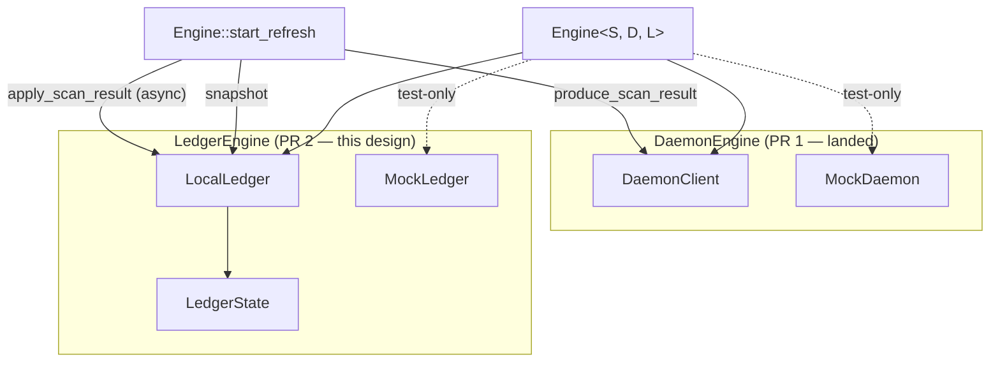

# Stage 1 PR 2 — `LedgerEngine` extraction — design

**Status.** Stage 1 PR 2 of the seven-trait extraction chain pinned in
[`docs/V3_ENGINE_TRAIT_BOUNDARIES.md`](../V3_ENGINE_TRAIT_BOUNDARIES.md)
§8.1. Phase 0 (a doc-only spec amendment to §2.2 correcting the
reservation-tracker ownership claim) is in flight as
[PR #22](https://github.com/Shekyl-Foundation/shekyl-core/pull/22).
Phase 1 (the implementation work) cuts off the post-Phase-0 dev tip.

This document is the in-repo design contract that PR 2 implements.
The structure mirrors
[`docs/design/STAGE_0_HARNESS.md`](STAGE_0_HARNESS.md): the trait
spec is the contract, this document is the implementation
governance for the per-PR work that the contract already pins
abstractly.

The long-form draft history lives ephemerally in
`.cursor/plans/stage_1_pr_2_plan_*.plan.md`. This document is the
durable, in-repo equivalent — the source-of-truth for PR 2's scope
once the design doc lands. PR-2 reviewers verify against §6 below;
the plan file's pre-design wording is historical context, not a
checklist.

---

## 1. Scope

### 1.1 Phase 0 — spec amendment (doc-only, prerequisite)

A single doc-only commit to
[`docs/V3_ENGINE_TRAIT_BOUNDARIES.md`](../V3_ENGINE_TRAIT_BOUNDARIES.md)
§2.2 that lands three substantive items:

1. **Ownership correction.** Replace §2.2's stale "the runtime-only
   `BTreeMap<ReservationId, Reservation>` reservation tracker"
   ownership line with a pointer to §2.4. The ownership claim was
   a one-sided spec bug — every other location in the spec (§2.4,
   §1.5's actor-or-not table, §2's Round 3 trait-surface sweep,
   §3.1's Stage 1 implementing-types table, §3.2 layered call walk,
   §4 idempotency table) consistently places the tracker under
   `PendingTxEngine`, and §2.2's own trait surface defines zero
   methods that touch the tracker.
2. **`LedgerEngine::balance` reservation-agnosticism pin.** Make
   the previously-implicit semantic decision explicit: `balance`
   answers "what does the ledger say is mine?", not "what is
   currently spendable given in-flight reservations?" Spendable-
   balance computation is on `PendingTxEngine` or `Engine<S>`,
   not on `LedgerEngine`. The pin includes a safety-valve clause
   so a future revision (e.g., a `spendable_balance` helper if
   call patterns favor it) can land through the standard amendment
   process.
3. **§1.5 actor-identity application.** Record why the reservation
   tracker stays grouped with `PendingTxEngine` rather than
   becoming its own actor — tracker consistency requirements bind
   it tightly to in-flight transaction bytes and signing state, so
   isolating it produces no real failure-isolation benefit.

A "Stage 1 PR 2 spec-clarification" provenance subsection at the
end of §2.2 enumerates the cross-anchors that already align and
captures what the amendment changed vs. what it did not.

### 1.2 Phase 1 — implementation

Phase 1 lands the full §2.2 trait surface and parameterizes
`Engine<S, D>` over a third type parameter `L: LedgerEngine`:

- **Trait surface.** `pub(crate) trait LedgerEngine` with
  `synced_height` / `snapshot` / `balance` / `transfers` (sync,
  read-only) and `apply_scan_result` (async, mutating). Surface
  defined in `rust/shekyl-engine-core/src/engine/traits/ledger.rs`,
  re-exported from `traits/mod.rs`.
- **Implementing aggregate.** `pub(crate) struct LocalLedger {
  state: RwLock<LedgerState> }` with `LedgerState` bundling
  `WalletLedger` + `LedgerIndexes`. Reservations stay flat on
  `Engine` for now — they migrate to `LocalPendingTx` when the
  `PendingTxEngine` PR lands.
- **`Engine` parameterization.** `Engine<S, D: DaemonEngine =
  DaemonClient, L: LedgerEngine = LocalLedger>` mirrors PR 1's
  default-type-parameter pattern. `OpenedEngine<S, D, L>` carries
  the same parameterization.
- **Async-`&self` mutation.** `apply_scan_result` flips from sync
  `&mut self` to async `&self` with interior `RwLock` per §2.2's
  Round 3 disposition. The outer `Arc<RwLock<Engine>>` write-lock
  on the refresh path becomes a read-lock; the mutation is now
  interior.
- **Test substrate.** `MockLedger` + `replace_ledger` mirror
  `MockDaemon` + `replace_daemon` from PR 1. `MockLedger` queues
  `RefreshError::ConcurrentMutation` for failure injection.
- **Hybrid test.** One end-to-end test (`hybrid_apply_scan_result_
  retries_on_concurrent_mutation`) exercising the §5.2-equivalent
  retry contract for ledger.

This design doc does not pin every method body. PR 2 has degrees
of freedom on internal structure (e.g., whether `Balance` is a
re-export of `BalanceSummary` or a fresh type, whether
`TransferFilter` starts as a unit type or a struct with fields).
Those decisions land at commit time and surface in the PR
description.

---

## 2. Relationship to `V3_ENGINE_TRAIT_BOUNDARIES.md`

This section consolidates the contract-vs-implementation
relationship, mirroring `STAGE_0_HARNESS.md` §2.

### 2.1 Contract vs implementation

The trait-boundaries spec
([`V3_ENGINE_TRAIT_BOUNDARIES.md`](../V3_ENGINE_TRAIT_BOUNDARIES.md))
is the **contract**. This design doc is the **implementation
governance** for PR 2's per-trait extraction. The contract pins
(at §2.2 plus the cross-anchors enumerated in §1.1):

- The trait method list (`synced_height`, `snapshot`, `balance`,
  `transfers`, `apply_scan_result`) and their async/sync split.
- The `&self` + interior-mutability discipline (Round 3
  disposition).
- The `Arc<LedgerSnapshot>`-via-actor reader pattern at Stage 4.
- The `RefreshError::ConcurrentMutation` cross-trait contract
  signal.
- The `RwLock<LedgerState>`-not-`Mutex<…>` lock-shape rationale
  (many readers, one writer).

The contract does **not** pin: the exact shape of `LocalLedger`'s
constructors, whether `Balance` re-exports `BalanceSummary` or
introduces a fresh type, the field shape of `BalanceFilter` /
`TransferFilter` beyond "filter parameters carry by value", which
internal accessors `LocalLedger` exposes for the migration window
(e.g., a `pub(crate) fn read(&self) -> RwLockReadGuard<'_,
LedgerState>` escape hatch). Those are PR-2-internal choices and
they land in this PR's commits.

If something in this document appears to amend the contract, the
contract wins and this document is wrong. Phase 0's spec amendment
**is** a contract change; Phase 1's implementation work is not.

### 2.2 PR-1-mirroring discipline (load-bearing)

PR 2's commit shape deliberately mirrors PR 1's: trait surface →
implementing type → impl → parameterization → call-site migration
→ mock + test fixture → hybrid test → bench capture → docs. PR 1
was 7 substantive commits + 1 docs commit; PR 2 is 9 substantive
commits + 1 docs commit. The two extra commits are `LocalLedger`
introduction (PR 1 didn't introduce a new aggregate type because
`DaemonClient` already existed) and dedicated call-site migration
(PR 1's call-site work was simpler).

The mirroring is intentional template-establishment for Stage 1's
remaining trait extractions. Reviewers familiar with PR 1's shape
navigate PR 2 efficiently because each commit maps to a PR 1
analog; the deltas are visible. PRs 3 onward (the §8.1 chain —
`KeyEngine`, `PersistenceEngine`, `EconomicsEngine` off-the-
critical-path; `RefreshEngine` and `PendingTxEngine` on it) are
expected to follow the same template with trait-specific deltas.
By PR 7 the per-trait template is fully canonized and deviations
require explicit reasoning.

PR 2's PR description states "this PR establishes the per-trait
PR template that subsequent Stage 1 extractions follow" so
reviewers and future-template authors find the discipline pinned.

### 2.3 §5.2 cumulative-coverage framing (forward-looking)

PR 2's hybrid test exercises a different §5.2 property than
PR 1's. PR 1's `hybrid_linear_scan_5_blocks_advances_synced_
height` exercised the **happy path** under failure-injection-free
conditions (`MockDaemon` did not queue failures; the test verified
producer/consumer plumbing). PR 2's `hybrid_apply_scan_result_
retries_on_concurrent_mutation` exercises the **retry-contract
failure path** with explicit failure injection via `MockLedger`'s
queueing.

Both are §5.2-equivalent reachability proofs; cumulatively, by
Stage 1 close (seven per-trait PRs), §5.2 has end-to-end test
coverage with each PR contributing one previously-untested
property. The PR 2 PR description makes this distinction explicit
so future per-trait PR authors can scope their hybrid test
accordingly: **each per-trait PR's hybrid test is scoped to one
§5.2 property the predecessor PRs have not yet exercised**.

PR 3 author's first scoping question for the hybrid test:
"which §5.2 property has not yet been exercised by PRs 1 and 2's
hybrid tests, and which one does this trait surface make newly
testable?" That question converts the §5.2 cumulative coverage
from accidental to load-bearing.

### 2.4 This document is the source-of-truth for PR 2's scope

Mirrors `STAGE_0_HARNESS.md` §2.4. The original Stage 1 PR 2 plan
named scope at task-list level. The plan was written before this
design doc existed. **The design doc is now the source of truth
for PR 2's scope** — §6 below ("What PR 2 implements") enumerates
the concrete handoff list; the original plan's task-list wording
is historical context, not a checklist. PR-2 reviewers verify
against §6.

---

## 3. The substantive design choices

The decisions that follow are pinned in dependency order. Each is
an implementation choice within the contract's degrees of freedom,
not an amendment of the contract.

### 3.1 `LocalLedger` is `WalletLedger` + `LedgerIndexes` only

`LedgerState` aggregates the persistent ledger and the runtime-
derived indexes. **Reservations are not in `LedgerState`.** The
Phase 0 amendment confirms the reservation tracker is owned by
`PendingTxEngine`; tracker migration into `LocalPendingTx` lands
when that PR ships (Stage 1 PR 4-ish per §8.1's `KeyEngine` /
`LedgerEngine` / `DaemonEngine` → `PendingTxEngine` chain).

PR 2 leaves `Engine`'s `reservations: BTreeMap<…>` and
`next_reservation_id: u64` as flat fields. PR 2 does not touch
any reservation-related code; the surface is unchanged from PR 1
tip.

### 3.2 `RwLock<LedgerState>` not `Mutex<LedgerState>`

`LedgerEngine` has many readers (`synced_height`, `snapshot`,
`balance`, `transfers`) and one writer (`apply_scan_result`).
`RwLock` matches the contention pattern at Stage 1 and at Stage 4
(many concurrent readers of `Arc<LedgerSnapshot>` against one
mutating actor handler). The §2.2 narrative pins this rationale;
this design doc records it as the PR 2 lock-shape decision.

### 3.3 Async `&self` over sync `&mut self` for `apply_scan_result`

Per §2.2's Round 3 disposition: Stage 4's `ActorRef<LedgerActor>`
is `Clone` and cannot satisfy `&mut self` at the trait-impl level
without precluding the cheap-clone-for-concurrent-orchestration
pattern Stage 4 needs. PR 2 lands the `&self` shape with interior
mutability now so the Stage 4 cutover becomes a no-op for this
concern.

The refresh-path implication: `run_refresh_task`'s outer
`Arc<RwLock<Engine>>` write-lock around the merge becomes a
read-lock — the mutation is now interior to `LocalLedger`. This
is the §3.3 over-serialization framing in action: outer + inner
lock is acceptable Stage 1 cost; inner-lock-only is Stage-4-
correct.

### 3.4 Default `L = LocalLedger` for production constructors

Production callers (`shekyl-cli`, `shekyl-engine-rpc`,
forthcoming Rust JSON-RPC server) keep their existing concrete-
typed shape via the default. Only `#[cfg(test)]` paths exercise
`replace_ledger` and substitute `MockLedger`. Same compatibility
story as PR 1's `D: DaemonEngine = DaemonClient` parameterization.

V3.2 generalizes the production constructors over `L` alongside
the `LedgerEngine`-to-`pub` promotion — same trajectory as the
§1.2 row records for `DaemonEngine`. PR 2 does not anticipate
that work; it preserves the `pub(crate)` visibility and `default
type parameter` shape.

### 3.5 `MockLedger` failure-injection scope

PR 2's `MockLedger` queues `RefreshError::ConcurrentMutation` on
the next `apply_scan_result`. The hybrid test exercises a single
retry. Richer failure modes (queued sequences, terminal errors,
delayed responses) stay out of scope — they are added when a
later PR's hybrid test or unit test needs them. **`MockLedger` is
deliberately minimal**: it implements just enough surface to
serve PR 2's §5.2 coverage and gives subsequent per-trait PRs a
template to extend.

---

## 4. Architecture

The Stage 4 picture replaces `LocalLedger` and `DaemonClient` with
their `kameo` actor counterparts; the `Engine<S, D, L>` shape and
the call-graph stay identical. That is what "Stage 1 surface
pinned for Stage 4" means in §2.2's framing.

---

## 5. Commit shape

Nine substantive commits + one docs commit, mirroring PR 1's
template with the two structural additions (commits 2 and 5).

| Commit | Scope | PR 1 analog |
| --- | --- | --- |
| 1. Trait surface | `traits/ledger.rs`; `LedgerEngine` + `LedgerError` + `Balance`/`BalanceFilter`/`TransferFilter` types; `mod.rs` re-exports | `traits/daemon.rs` introduction |
| 2. `LocalLedger` aggregate | `engine/local_ledger.rs`; `RwLock<LedgerState>` wrapping `WalletLedger` + `LedgerIndexes`; `Engine` field shift | (none — new in PR 2) |
| 3. Trait impl | `impl LedgerEngine for LocalLedger`; flip `apply_scan_result` to async `&self` | `impl DaemonEngine for DaemonClient` |
| 4. Engine parameterization | `Engine<S, D, L: LedgerEngine = LocalLedger>` + `OpenedEngine` mirror; `#[allow(private_bounds)]` parallel | PR 1 commit 4 |
| 5. Refresh-path call-site migration | `refresh.rs` `refresh_with` and `run_refresh_task` to async-aware paths; relax outer write-lock to read-lock | (folded into PR 1's commit 2; here we surface it separately because it is non-trivial) |
| 6. `MockLedger` + `replace_ledger` | `test_support.rs`; `RefreshError::ConcurrentMutation` queueing; `derive_seed(master, ROLE_LEDGER)` | `MockDaemon` + `replace_daemon` |
| 7. Hybrid test | `hybrid_apply_scan_result_retries_on_concurrent_mutation`; one end-to-end coverage of §5.2's retry contract | `hybrid_linear_scan_5_blocks_advances_synced_height` |
| 8. Bench baseline | `engine_trait_bench_ledger_*` rows captured via CI `workflow_dispatch`; transcribed to `docs/PERFORMANCE_BASELINE.md` with N=3 invariance | PR 1's bench commit |
| 9. Docs | `CHANGELOG.md`, §1.2 status row update, `FOLLOWUPS.md`, crate-level rustdoc | PR 1's docs commit |

Reviewers map each commit to its PR 1 analog; deltas are visible
per commit. PR-2-specific reasoning (e.g., why commit 2 introduces
a new aggregate, why commit 5 is split out) lands in each commit's
message.

---

## 6. What PR 2 implements (the handoff list)

The concrete deliverables PR 2's reviewer should expect:

- [`rust/shekyl-engine-core/src/engine/traits/ledger.rs`](../../rust/shekyl-engine-core/src/engine/traits/ledger.rs)
  — `LedgerEngine` trait + `LedgerError` + `Balance` /
  `BalanceFilter` / `TransferFilter` / `LedgerSnapshot` (or
  re-exported from `refresh.rs` with a new module path).
- [`rust/shekyl-engine-core/src/engine/local_ledger.rs`](../../rust/shekyl-engine-core/src/engine/local_ledger.rs)
  — `LocalLedger` + `LedgerState`; the impl block.
- [`rust/shekyl-engine-core/src/engine/mod.rs`](../../rust/shekyl-engine-core/src/engine/mod.rs)
  — `Engine<S, D, L>` parameterization; field shift from `ledger:
  WalletLedger, indexes: LedgerIndexes` to `ledger: LocalLedger`.
- [`rust/shekyl-engine-core/src/engine/refresh.rs`](../../rust/shekyl-engine-core/src/engine/refresh.rs)
  — call-site migration in `refresh_with` and `run_refresh_task`;
  outer `RwLock` access pattern relaxed.
- [`rust/shekyl-engine-core/src/engine/test_support.rs`](../../rust/shekyl-engine-core/src/engine/test_support.rs)
  — `MockLedger` + `Engine::replace_ledger`; `ROLE_LEDGER` derive
  seed wiring (constant already reserved in PR 1's
  `test_support.rs`).
- New hybrid test in the existing test file.
- New `engine_trait_bench_ledger_*` benches under
  `rust/shekyl-engine-core/benches/`.
- [`docs/PERFORMANCE_BASELINE.md`](../PERFORMANCE_BASELINE.md)
  rows added.
- [`docs/CHANGELOG.md`](../CHANGELOG.md) entry.
- [`docs/V3_ENGINE_TRAIT_BOUNDARIES.md`](../V3_ENGINE_TRAIT_BOUNDARIES.md)
  §1.2 row update from "Stage 1 PR 2 lands" to "landed at the
  PR 2 merge SHA".

Reviewers verify against this list; deviations require an explicit
note in the PR description.

---

## 7. Out of scope for PR 2

Per [`.cursor/rules/15-deletion-and-debt.mdc`](../../.cursor/rules/15-deletion-and-debt.mdc)
"while we're here is the enemy":

- **Reservation tracker movement.** Phase 0 amendment confirms
  the tracker is owned by `PendingTxEngine`. PR 2 leaves
  reservations on `Engine`; the `PendingTxEngine` PR moves them.
- **`BalanceSummary` → `Balance` rename** (cosmetic; defer to a
  separate cleanup if naming churn is wanted).
- **`transfer_details` Rust migration** (V3.1 per
  [`docs/FOLLOWUPS.md`](../FOLLOWUPS.md)).
- **Promoting `LedgerEngine` to `pub`** (Stage 4 trait promotion;
  out-of-charter per spec §1.4 / §1.2 status row).
- **Generalizing `Engine::create` / `Engine::open_full` over `L`**
  (V3.2 per §1.2).
- **`shekyl-oxide` fmt drift on dev** (handled out-of-band; see
  §8 sequencing).

---

## 8. Sequencing summary

0. **External (out-of-band).** `shekyl-oxide` fmt drift on dev is
   resolved by the user out-of-band ("I'm addressing the Rust
   issues elsewhere", 2026-05-03; resolved at dev tip
   `a9e1bfc31` via three reverts). Phase 0 cuts off the post-
   resolution dev tip.
1. **Phase 0** — single doc-only commit on
   `chore/spec-stage-1-reservation-ownership` ([PR
   #22](https://github.com/Shekyl-Foundation/shekyl-core/pull/22)).
   PR description follows the six-bullet structure pinned in §1.1.
   Merge `--no-ff` to dev; archive-tag; delete branch (with
   explicit user authorization for deletion).
2. **PR 2 branch cut from post-amendment dev tip** as
   `feat/stage-1-ledger-engine`.
3. **Nine commits + one docs commit**, scoped per §5.
4. **Performance baseline captured from CI** (`workflow_dispatch`,
   N=3 invariance), transcribed to
   [`docs/PERFORMANCE_BASELINE.md`](../PERFORMANCE_BASELINE.md)
   before PR opens.
5. **PR opens for review.** Description states "this PR
   establishes the per-trait PR template that subsequent Stage 1
   extractions follow" so reviewers and future-template authors
   find the discipline pinned. Copilot findings addressed.
6. **Merge `--no-ff` to dev**; archive-tag; delete branch (with
   explicit user authorization for deletion, per the procedural-
   gap note from the caching PR).

---

## 9. Verification

- `cargo fmt --all -- --check` clean; `cargo clippy --workspace
  --all-targets --keep-going -- -D warnings` clean.
- `cargo test --workspace` passes including the new hybrid test.
- The new hybrid test fails when run against an `Engine` whose
  `MockLedger` does **not** queue `ConcurrentMutation`, confirming
  the test is exercising the retry path rather than the happy
  path.
- New `engine_trait_bench_ledger_*` rows show the §3.3 measurement-
  gate thresholds (10% justification / 25% optimization) hold —
  the §3.3 gate from `STAGE_0_HARNESS.md` covers PR 2's bench
  rows the same way it covers Stage 0's frozen baselines.
- No method signatures, trait shapes, or design claims in
  `V3_ENGINE_TRAIT_BOUNDARIES.md` change beyond the §2.2
  amendment that landed in Phase 0 plus the §1.2 status-row
  update in commit 9.

---

## 10. Cross-references

- [`docs/V3_ENGINE_TRAIT_BOUNDARIES.md`](../V3_ENGINE_TRAIT_BOUNDARIES.md)
  §2.2, §3.1, §8.1 — the contract.
- [`docs/design/STAGE_0_HARNESS.md`](STAGE_0_HARNESS.md) — the
  precedent for in-repo design contracts (Stage 0 PR-1's
  measurement harness governance) and §3.3 measurement-gate
  reference.
- [`docs/PERFORMANCE_BASELINE.md`](../PERFORMANCE_BASELINE.md) —
  destination for PR 2's bench rows.
- [`rust/shekyl-engine-core/src/engine/traits/daemon.rs`](../../rust/shekyl-engine-core/src/engine/traits/daemon.rs)
  — pattern reference (PR 1's trait surface).
- [`rust/shekyl-engine-core/src/engine/test_support.rs`](../../rust/shekyl-engine-core/src/engine/test_support.rs)
  — `MockDaemon`, `replace_daemon`, `derive_seed` (the substrate
  PR 2 extends with `MockLedger` and `replace_ledger`).
- [PR #20](https://github.com/Shekyl-Foundation/shekyl-core/pull/20)
  — the trait-boundaries spec acceptance PR (merged 2026-05-01).
- [PR #21](https://github.com/Shekyl-Foundation/shekyl-core/pull/21)
  — Stage 1 PR 1 (`DaemonEngine` extraction), the immediate
  predecessor (merged 2026-05-02).
- [PR #22](https://github.com/Shekyl-Foundation/shekyl-core/pull/22)
  — Phase 0 spec amendment (in flight at the time this design
  doc lands).
