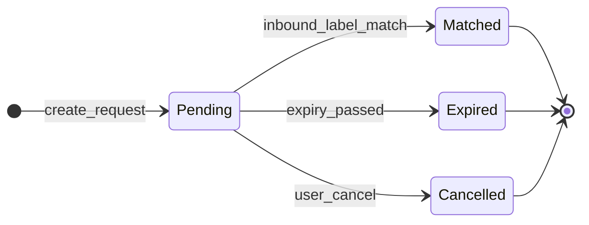
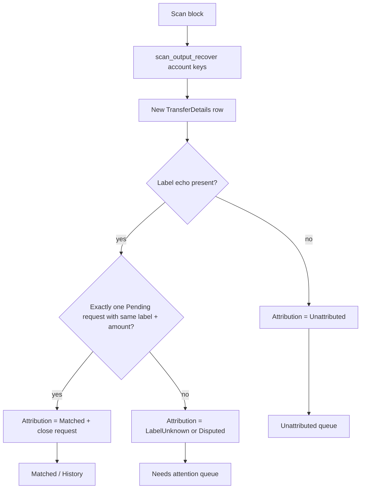
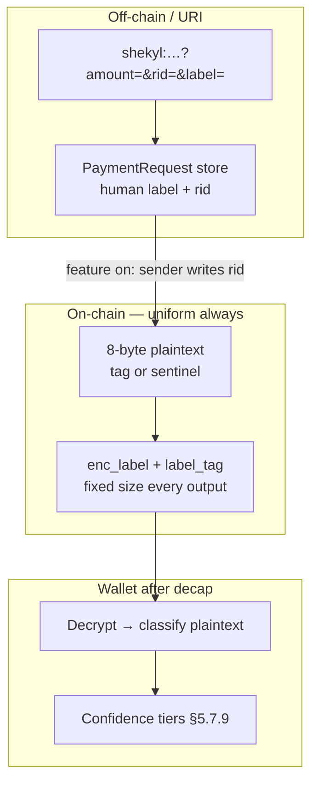

# Subaddress mechanism under PQC — design round

**Status.** Round 3 in progress. **5-T-substrate adopted** (§6.4, 2026-05-31).
**Logical tag system** specified (§5.7.11). **V3.0 wallet:** sentinel-only
at launch; payment-request / meaningful-tag UX behind product flag (later).
**FA-1 / FA-6** confirmed (§3.7). **R2-F2 CLOSED** (2026-05-31): product
sign-off — **no subaddresses at V3.0**; End-state 5 minimal; §5.7.9 +
`R2_F2_WALKTHROUGH.md` §6. **R2-F9 CLOSED** (pin): address-knowledge /
phishing tier (§5.7.12) — dust-tracking class closed; T6 harvest path named.
**FA-9 / T6 wargaming** is the active parallel track (§4.4, §4.8, FA-6).
Spec-first.
Target: V3.0 pre-genesis.

**Provenance.** Surfaced during Stage 2 `KeyEngine` actor pre-flight
(`docs/design/STAGE_2_KEY_ENGINE_ACTOR.md` §2.4 / §3.1). Tracked in
`docs/FOLLOWUPS.md` ("Subaddress mechanism under PQC — dedicated design
round"). Sequencing: **before Stage 3 / Phase 2b** (`StakeEngine`,
`WalletLedger` persistence) so stake and recipient models are designed
against a settled subaddress shape.

**Branch context.** Stage 2 actor work lives on
`torvaldsl/stage-2-key-engine-actor` (PR #99 → `dev` at open). This
design doc was opened from that branch tip (`9a0996bc4`) for substrate
citations; land the doc on `dev` (or a short-lived branch off `dev`) before
Round 1. The round does not depend on Stage 2 merging first.

**Process.** Per `26-sub-pr-design-discipline.mdc` (cited explicitly)
and `docs/design/STAGE_1_PER_PR_TEMPLATE.md` §3. Target **4–6**
adversarial design rounds before any implementation PR.

**Supersedes (when closed).** `docs/design/STAGE_1_PR_3_KEY_ENGINE.md`
§3.1.3 per-subaddress `kem_pk` disposition (β) — that section assumed
ML-KEM composes like Monero ECDH; substrate shows it does not and the
live scan/send path already chose account-level hybrid KEM.

---

## 1. Load-bearing question

Monero subaddresses are cheap because **ECDH composes under one view
secret**: one `a·R` per output, recover `B'`, table-lookup the subaddress.
**ML-KEM has no account-level decapsulation homomorphism.** A ciphertext
for `pk_i` requires `sk_i`.

**Round 1 pivot (R1-F5).** The A/B/C debate opened on the wrong layer.
Passive chain-observer privacy on receive is delivered by **output
construction** (per-output `ho`, hybrid-gated `combined_ss`), not by the
subaddress layer — and holds with **zero subaddresses** (§4.1). The
subaddress layer's headline privacy job is **off-chain counterparty
collusion** (T2): distinct address strings so two counterparties who each
hold one cannot byte-link them to the same wallet. That is the surface
R1-F2 proves Shekyl cannot make cheap post-quantum under Option A.

**Product principle (Round 2, R2-F1).** In Shekyl, **address reuse is
on-chain-private by construction.** One static address, pasted everywhere,
reused forever — a passive chain observer still cannot link receipts,
because per-output one-time keys and hybrid gating do that work (§4.1).
This is simpler than Bitcoin (reuse is a privacy disaster there) and
simpler than Monero (subaddresses partly manage reuse anxiety). The
"fresh address per payment" habit is an artifact Shekyl's construction
makes obsolete; user-facing docs should lead with **"your address stays
private when reused."**

The sharp questions (Round 2):

> 1. **Usability:** J2/J3 via **payment requests** (§5.7) — not subaddress
>    geometry.
> 2. **T2 (pinned §4.6):** Counterparty collusion is **not** a Priority-2-
>    mandated guarantee — it is irreducibly deliberate (user already
>    identified themselves to each counterparty). **Multi-account J1** is a
>    Priority-3 opt-in capability, not a closure gate for subaddress removal.
> 3. **T6 (still open):** Adversary surface (§4.8) — **not** laundered by
>    the user-behavior "pit of success" principle. Parallel pin (FA-6).
> 4. ~~**R2-F2**~~ **CLOSED:** Merchant receive-and-reconcile UX (§5.7.9);
>    `R2_F2_WALKTHROUGH.md` §6 — no subaddresses at V3.0.
> 5. **R2-F8 (Round 3):** Label transport — **not** optional-at-wire
>    (Priority-2 fatal). Synthesis: mandatory uniform slot at genesis +
>    wallet UX ship-later (§5.7.10). Gated by explicit foundation pin (§6.4).

**Orthogonality (non-negotiable).** FCMP++ hides the **spend** side.
Receive-side **observer** privacy is the output layer. Receive-side
**counterparty** privacy (J1) and **bookkeeping** (J2) are separate
layers with separate mechanisms in End-state 5.

---

## 2. Pre-flight (Round 0)

Per `26-sub-pr-design-discipline.mdc` §"Pre-flight pass" and
`STAGE_1_PER_PR_TEMPLATE.md` §3.

### 2.1 Engine / scope identification

| Item | Disposition |
|------|-------------|
| Trait surface | `KeyEngine::derive_subaddress`, `RecipientSubaddress`, scanner (`shekyl-scanner`), `scan_output_recover`, `ShekylAddress` encoding |
| Stage 2 scope | **Out of scope** — faithful actor port; `RecipientSubaddressKemKeygenNotImplemented` stub preserved |
| Blocks | Implementation of `derive_subaddress(_, Recipient)`; Phase 2b recipient/subaddress assumptions |
| §1.5 three-condition test | N/A (crypto mechanism round, not new engine trait) |

### 2.2 Plan principles (WALLET_REWRITE_PLAN.md 4–8)

| Principle | Applicability |
|-----------|----------------|
| **4 — architectural-integrity-now** | **Applies.** This round exists because inherited Monero-shaped subaddresses without KEM homomorphism were ported into trait/address specs without pricing scan cost. |
| **5 — closure + audit trail** | **Applies.** §10 carries round-by-round dispositions. |
| **6 — pre-execution wider-substrate audit** | **Applies.** Round 0 is that audit (this section). |
| **7 — threat-model anchors** | **Applies.** §4. |
| **8 — priority hierarchy** | **Applies.** §6 names binding commitment. |

### 2.3 Discipline citations (`V3_ENGINE_TRAIT_BOUNDARIES.md` §8.3)

| Discipline | Applicability |
|------------|----------------|
| §8.3.1 design lenses | Actor-mesh: low (no new actor). Crypto/substrate: **high**. |
| §8.3.2 pre-flight substrate re-check | **Load-bearing** — Round 0 table in §3. |
| §8.3.3 threat-model addenda | **Round 2–3** (after end-state pricing stable). |
| §8.3.4 reversion clauses | **Required** for rejections (§7). |
| §8.3.5 forward-action propagation | **§9** to Phase 2b, KeyEngine impl PR, address-format doc. |

### 2.4 Numeric / measurement claims

| Claim | Round 0 status |
|-------|----------------|
| ML-KEM-768 KeyGen ~50 µs (STAGE_1 §3.1.3) | **Inherited, not re-measured** — order-of-magnitude only; pre-flight B9 defers binding gates until an impl PR benches `derive_subaddress(Recipient)`. |
| Full slow-path `scan_output_recover` per output | **Bounded by PR4 bench methodology** (`rust/shekyl-scanner/benches/scan_transaction.rs`) — one decap per output in worst case; **not** multiplied by subaddress count in current code. |
| Per-subaddress decap multiplier | **Structural** — if Option B without window: `O(active_subaddresses × outputs)` ML-KEM decaps per block scan. |

---

## 3. Substrate re-audit (Round 0 — audit-against-actual-code)

Citations are at the workspace pin when this round opened
(`torvaldsl/stage-2-key-engine-actor` / `9a0996bc4` area). Line numbers
may drift on `dev`; re-verify at implementation PR pre-flight.

### 3.1 Finding: three surfaces, one live model

| Surface | Where KEM lives | Where subaddress identity lives | Matches live scan? |
|---------|-----------------|--------------------------------|--------------------|
| **Scanner (production)** | Account `ml_kem_dk` + account `x25519_sk` | `B'` → `HashMap<CompressedPoint, SubaddressIndex>` | **Reference model** |
| **`try_claim_output` / `LocalKeys`** | Account `keys.ml_kem_dk` + account `view_sk` | Recovered `B'` → `subaddress_registry` by **spend pk** (equivalent lookup after recovery) | **Yes** (same decap inputs) |
| **`RecipientSubaddress` / STAGE_1 §3.1.3** | Per-index `HybridKemPublicKey` (X25519 + ML-KEM) | Classical per-index + per-index KEM in encoding | **No** |
| **`derive_subaddress_kem_keypair`** | Specified in STAGE_1 §3.3 | **Not implemented** (`subaddress.rs` module comment only) | N/A |

**Round 0 conclusion (R0-F1).** The incoherence claimed in
`docs/FOLLOWUPS.md` is **confirmed at source**. The production scanner
and `LocalKeys::try_claim_output` implement **account-level hybrid KEM
decap + classical subaddress identification via recovered spend key**.
The trait-layer `RecipientSubaddress` and STAGE_1 §3.1.3 describe a
**different** model (per-subaddress hybrid KEM). The gap is masked by
`RecipientSubaddressKemKeygenNotImplemented` (`error.rs:615`).

### 3.2 Scanner path (Option A — account KEM)

```510:530:rust/shekyl-scanner/src/scan.rs
            let Ok(recovered) = scan_output_recover(
                self.pair.x25519_sk(),
                self.pair.ml_kem_dk(),
                ct_x25519,
                ct_ml_kem,
                // ...
            ) else {
                continue;
            };

            // --- Subaddress lookup via recovered spend key B' ---
            let recovered_b_compressed: CompressedPoint =
                CompressedPoint(recovered.recovered_spend_key);
            let Some(subaddress) = self.subaddresses.get(&recovered_b_compressed) else {
                continue;
            };
```

`ViewPair` holds **one** `ml_kem_dk` and **one** `x25519_sk` per wallet
(`view_pair.rs:35-38`). Subaddress registration precomputes classical
`(spend, view)` via `subaddress_keys` only (`scan.rs:386-389`) — not
per-subaddress KEM secrets.

`scan_output_recover` is explicitly designed for this pattern: one decap,
caller-side `B'` lookup (`output.rs:631-636`).

### 3.3 Round 2 substrate pin — no output label / memo field

Per-output confidential data on wire is **`enc_amounts` only** (9 bytes per
output in `rctSigBase`; amount XOR + `amount_tag` — no label slot).
`tx_extra` hybrid fields: KEM ciphertext (`0x06`), PQC leaf hashes (`0x07`)
— no encrypted memo tag in `ExtraField` (`rust/shekyl-scanner/src/extra.rs`).
Payment-request labels are **net-new** surface; transport is **5-T**
(§5.7.10–§5.7.11). Receiver recovers cleartext amount at scan;
amount-matching underpins confidence tiers 2–3.

### 3.7 Confirmations (2026-05-31 product decisions)

#### FA-1 — Stake / Phase 2b vs subaddresses

**Confirmed:** `StakeEngine` does not require subaddress indices.

| Evidence | Finding |
|----------|---------|
| No `StakeEngine` trait or impl in `rust/` yet | Phase 2b is design-only (`V3_ENGINE_TRAIT_BOUNDARIES.md` §10.5.1). |
| `TransferDetails` stake fields (`staked`, `stake_tier`, `stake_lock_until`) | Stake state is per-output on the same ledger row as normal receives — no `SubaddressIndex` in staking paths (`shekyl-engine-state/src/transfer.rs`). |
| `StakerPoolState` / stake grep in `shekyl-engine-state` | No subaddress coupling. |
| `STAKER_REWARD_DISBURSEMENT.md` | No subaddress requirement. |

**Disposition for Phase 2b:** Design `StakeEngine` against **primary-address
receive + account-level scan** (End-state 5). Reward disbursement credits
outputs scanned like any other inbound; no `B'` registry.

#### FA-6 — T6 view-tag (parallel adversary track)

**Confirmed:** T6 is **not** closed by End-state 5 or the 5-T pin; it stays
on the **adversary** track (§4.7–§4.8), separate from pit-of-success / T2.

| Item | Status |
|------|--------|
| View-tag pre-filter before ML-KEM decap | Unchanged — `output.rs` / `POST_QUANTUM_CRYPTOGRAPHY.md` derivation table. |
| Same impossibility shape as R1-F2 | Still load-bearing (§4.4). |
| Threat-model wargaming | **Deferred** until 5-T pin + tag system + launch posture + FA-1 are set (2026-05-31). FA-9 / FA-6 deep pin lands in that pass. |

End-state 5 **does not** relax T6. Sentinel-only launch **does not** change
the view-tag surface.

### 3.4 Send / test path (account hybrid + subaddress spend target)

Payments to a subaddress in tests use **account** hybrid public material
and **subaddress** spend public key as `construct_output`'s `spend_key`:

```1041:1048:rust/shekyl-engine-core/src/engine/local_keys.rs
        let constructed = construct_output(
            &TEST_TX_KEY_SECRET,
            &keys.keys.x25519_pk,
            &keys.keys.ml_kem_ek,
            &subaddr_spend_pk,
            999,
            0,
        )
```

So the **live coherent payment model** is not merely "shared ML-KEM PK
in the address bytes" — it is **shared hybrid KEM (X25519 + ML-KEM) for
encapsulation, classical subaddress spend point as the output destination
encoding**. That matches the scanner's account-level decap + `B'`
recovery.

Implementing STAGE_1 §3.1.3 β **without** changing the scanner would break
this test shape: per-subaddress `x25519_pk` in `construct_output` would
not decapsulate under account `x25519_sk` / view-tag derivation.

### 3.5 Address format

`ShekylAddress` always carries a single `ml_kem_encap_key` field
(1184 bytes, `address.rs:76`). There is no separate subaddress wire
format today — recipient addresses are expected to be built from
classical subaddress keys + **account** PQC segments when
`derive_subaddress(Recipient)` lands.

### 3.6 Stub and spec drift

| Artifact | Evidence |
|----------|----------|
| Stub | `RecipientSubaddressKemKeygenNotImplemented` — `error.rs:612-615`; returned from `local_keys.rs:491`, `key_actor.rs:592` |
| STAGE_1 §3.1.3 | Disposition β: per-subaddress `kem_pk` "rule-forced" by priority hierarchy |
| STAGE_1 §3.3 / `try_claim_output` spec text | Says recipient re-derives per-subaddress ML-KEM SK at claim time — **contradicts** `local_keys.rs:504-507` (account `ml_kem_dk`) |
| Code | `derive_subaddress_kem_keypair` — **absent** from `shekyl-crypto-pq` (only mentioned in comments) |

**Round 0 conclusion (R0-F2).** STAGE_1 §3.1.3 is **spec–implementation
drift**, not merely trait-vs-scanner drift. The implementation cluster
(scanner, `try_claim_output`, `construct_output` tests) is internally
consistent; the Stage 1 β disposition is the outlier.

### 3.7 Classical subaddress math (unchanged, genesis-locked)

```97:160:rust/shekyl-crypto-pq/src/subaddress.rs
const SUBADDR_DERIVATION_DOMAIN: &[u8] = b"shekyl-subaddr-v1\0";
// ...
/// spend = D + m_i * G
/// view = a * spend
pub fn subaddress_keys(...)
```

On-chain, distinct subaddresses produce distinct embedded spend points
`B_i = D + m_i·G` in `O = ho·G + B + y·T` (`output.rs:246-248`). That
distinction is **wallet-internal attribution** after hybrid decap (recover
`B'` → registry lookup). It is **not** what gives a passive chain
observer output-to-output unlinkability — that comes from per-output `ho`
(§4.1). What does **not** follow is byte-unlinkable **encoded addresses**
without per-subaddress KEM (and the scan cost that would require).

---

## 4. Threat-model frame

Objectives for adversarial rounds 2–4. Each finding routes to absorb,
discipline note, or forward-action per `26-sub-pr-design-discipline.mdc`
A3.

### 4.1 Layer separation (R1-F5) — load-bearing

Two protocol layers were conflated through Round 0 and the first half of
Round 1. They must stay separate.

**Output layer (passive chain observer).** Every output is
`O = ho·G + B + y·T` with per-output `ho, y` from
`derive_output_secrets(combined_ss)` and `combined_ss` gated behind the
account hybrid KEM (`output.rs:690-694`, `246-248`). Any two outputs are
distinct and unlinkable to an observer who lacks `combined_ss` — whether
they targeted the primary address, different subaddresses, or one single
address with no subaddresses at all. Post-quantum, the same hybrid gating
that protects `B'` recovery (R1-F1) protects this layer regardless of
subaddress count.

**Subaddress layer (off-chain + wallet-internal).** Distinct `B_i` and
distinct encoded address strings serve jobs that live **above** the output
construction:

| Job | What it is | Privacy-critical? |
|-----|------------|-------------------|
| **J1 — Off-chain distribution unlinkability** | Give different counterparties different-looking address strings so they cannot collude ("did you also pay this entity?") | **Deliberate capability (P3), not default guarantee** — §4.6 |
| **J2 — Attribution** | Recipient learns which receive line a payment hit (merchant accounting) | UX / bookkeeping; not a chain-observer property |
| **J3 — UX** | Avoid payment-ID-style sender-populated fields | UX; V3 dropped payment IDs for robustness reasons |

**Corollary.** Crediting "Option A's subaddresses" with on-chain
post-quantum unlinkability (Round 0 / early Round 1) misattributes a
property of the **output layer**. Strip subaddresses entirely → the
passive chain-observer trifecta (speed + on-chain PQ privacy + robustness
against sender misattribution) is **unchanged**. Subaddresses add J1
(optionally), J2, and J3 — not T1 against a passive observer.

**Option A's paradox (ties R1-F2 to R1-F5).** End-state 1 provides J2/J3
cheaply but **cannot deliver J1** post-quantum: every subaddress encoding
shares the same 1184-byte `ml_kem_ek` (and account `x25519_pk`), so two
counterparties who compare addresses you handed them link you instantly.
It spends registry / `B'`-lookup complexity on a layer that does not
improve the output layer, and fails at the layer's headline off-chain job.

### 4.2 End-state 3 / 5 — drop subaddresses (Round 2)

If counterparty collusion is **not** in the threat model, subaddresses are
not a privacy mechanism — they are attribution + UX misallocated to
address geometry. **End-state 5** (§5.7) supersedes the bare "drop"
sketch: single reusable private address + **payment-request URIs** for
J2/J3. Passive chain-observer privacy is **identical** to End-state 1 with
zero subaddresses.

**V3.0 minimal ship (Round 2 pin):** one account + payment requests only.
**Later (P3):** seed-derived multi-account for deliberate context separation
(§5.7.3, §7.4) — not blocked on subaddress-removal closure.

### 4.3 Threat objectives

| ID | Adversary objective | What "win" looks like | Primary surface |
|----|---------------------|------------------------|-----------------|
| T1 | **Passive chain observer** links two received outputs | Cluster outputs without wallet secrets | Per-output `ho`, hybrid KEM |
| T2 | **Counterparty collusion** — two parties you gave addresses to link them | Byte-compare PQC segments (1184-byte `ml_kem_ek`) or full address | Encoded `ShekylAddress` / QR / URI |
| T3 | **Daemon (refresh)** inflates scan work | Force full decap on every output | `scan_output_recover` |
| T4 | **Merchant** needs many concurrent receive identities | Thousands of active recipient IDs without refresh timeout | Subaddress count × scan cost |
| T5 | **Future maintainer** ships β because §3.1.3 says "rule-forced" | Implement per-subaddress decap loop | Docs + trait types |
| T6 | **Quantum observer + off-chain address** partitions chain by view tag | Account-level receive clustering via classical X25519 view tag | View-tag pre-filter (§4.4) |
| T7 | **Address-knowledge adversary** (phished/leaked receive address) | Dust oracle; channel substitution; harvest input for T6 | Public address; publication channel; wallet receipt behavior (§5.7.12) |

**T1 disposition (Round 2 pin).** Closed by **output construction +
hybrid gating**, option-independent of subaddresses (§4.1). Distinct `B_i`
does not add T1 against a passive observer; it adds J2 after decap.

**T2 disposition (Round 2 — PINNED).** **Out of mandatory V3.0 scope.**
Not because collusion is harmless — because counterparty-unlinkability
cannot be a universal-by-default guarantee under `00-mission.mdc` (§4.6).
End-state 5 **minimal** ships without multi-account. Optional multi-account
J1 is Priority 3 (§7.4).

**Round 0 pins superseded** where they attributed T1 to classical `B'`
diversity or subaddress mechanism.

### 4.6 T2 scoping — `00-mission.mdc` arbitration (Round 2, PINNED)

**Binding interpretation (named per mission arbitration clause).**

Priority 2's second sentence — *"privacy is never a setting"* — is read
as **pit of success**, not "no behavior-dependent guarantees anywhere":

> The **casual path must be the private path.** Deanonymizing yourself
> must require **deliberate work**, not casual accident. The platform
> cannot stop a determined user from misusing privacy tech (Tor + PII
> login is the analogy); it must make misuse **deliberate**, not default.

This is stricter than "no toggles" and weaker than "no behavior-dependent
surfaces at all" (the latter would condemn timing/amount/network hygiene
and is self-undermining).

**Why T2 (counterparty collusion) fails the pit-of-success test for
mandatory scope:**

1. **You already revealed yourself to each counterparty.** An address is
   what you hand someone so they know where to pay you. Collusion is two
   parties who each already hold that fact comparing strings **you gave
   them**. The privacy promise was never "counterparties can't know they
   paid you" — it is "the chain can't, and uninvolved third parties can't"
   (T1, output layer).
2. **R1-F2:** The platform cannot make casual address reuse collusion-
   proof post-quantum when counterparties hold the strings — same shape as
   Tor not defeating logged-in PII sites.
3. **Subaddress-style J1 is privacy-as-a-setting.** Only the user who
   rotates addresses per counterparty is protected; one-address-in-email-
   signature user is not. That is behavior-dependent protection elevated
   to a "default guarantee" — what Priority 2's wording rejects when read
   as pit-of-success. **Unconditional on-chain unlinkability** (End-state 5
   default, one reusable address) satisfies Priority 2; **conditional
   counterparty unlinkability** does not.

**Priority 1 role.** R1-F2 forecloses cheap PQ J1 (shared EK). Delivering
J1 costs End-state 2 scan blowup or multi-account — neither weakens PQC,
but neither is owed as a universal default under the reading above.

**Disposition table.**

| Reading | T2 mandatory? | V3.0 ship |
|---------|---------------|-----------|
| "No toggles" only | Ambiguous | — |
| "No behavior-dependent guarantees" | Yes → multi-account | Over-broad |
| **Pit of success (pinned)** | **No** | End-state 5 minimal now; accounts P3 |

**Marketing / threat-model claim (honest, licensed by pin):**

- **True by default:** "Your address is **private against the chain** no
  matter how carelessly you reuse it."
- **Deliberate, not casual:** "Keeping separate parts of your life
  unlinkable **from each other** is a deliberate choice we make easy — not
  a casual default we guarantee."

Record in threat-model-adjacent docs (FA-9) so the next reviewer does not
re-derive six rounds.

**Reopen T2 mandatory scope only if:** mission text is amended to
explicitly elevate counterparty collusion to a Priority-2 default
guarantee (foundation decision, not implementer inference).

### 4.7 Adversary surface vs user-behavior surface (do not conflate)

The pit-of-success principle governs **user-behavior** surfaces only.
It gives **zero cover** to **adversary** surfaces.

| Class | Example | Pit-of-success applies? | Track |
|-------|---------|-------------------------|-------|
| User-behavior | T2 collusion (you handed both addresses) | Yes → deliberate, not mandatory | T2 **closed** optional |
| User-behavior | Network hygiene, amount/timing correlation | Partially — educate, don't mandate platform fix | Out of this round |
| **Adversary** | **T6 view-tag clustering** (quantum + your address) | **No** — diligent user still clustered | **T6 open** (FA-6) |
| **Adversary** | **T7 address-knowledge / phishing** (§5.7.12) | **No** — publication + harvest are adversary-driven | **R2-F9 pinned**; FA-9 propagation |

**Anti-pattern (forbidden):** "We can't stop a careless user" → "we can't
stop a determined attacker, so why try." Priority 1 ("security is a
precondition, no trading") forbids laundering T6 into user responsibility.
T6 and T2 stay on **separate pins**.

### 4.8 Adversary surface index (parallel to pit-of-success closure)

Tracks that **do not** close when End-state 5 ships. Pit-of-success (§4.6)
governs user-behavior only (§4.7).

| ID | Surface | Round disposition | Forward action |
|----|---------|-------------------|----------------|
| **T6** | Quantum observer + off-chain address → view-tag receive clustering | **Open**, option-independent (§4.4) | **FA-6** — scan-speed / pre-filter trade |
| **T7** | Leaked receive address — phishing, dust, channel substitution, wallet liveness | **R2-F9 pinned** (§5.7.12): dust **receive/spend oracle closed** (FCMP++); substitution + T6 harvest + app-layer probes **named** | **FA-9** — propagate to `POST_QUANTUM_CRYPTOGRAPHY.md` or `THREAT_MODEL_WALLET.md` |

**T6 ↔ T7 cross-link (load-bearing).** Phishing that collects a public
receive address is the **concrete harvest step** for T6: the attacker needs
no break today — only archival chain + future quantum recovery of the
view secret from `V = a·G` in the address, then view-tag replay (§4.4).
Framing for FA-9: *"phishing + patience deanonymizes receive history
post-quantum"* — sharper than an abstract classical-tag note alone.

### 4.9 Priority 2 and label transport — the optional-at-wire fork (R2-F8)

Cooperative attribution (payment-request labels echoed on-chain) is **not**
a privacy primitive for passive observers (§4.1) — it is bookkeeping (J2).
It still must not become **privacy-as-a-setting** on the wire.

| Branch | Shape | Priority 2 |
|--------|-------|--------------|
| **Fatal** | **Optional at wire** — slot present only when merchant/URI path used; omitted otherwise | **Rejected.** Presence/absence partitions txs into "merchant-bound" vs not; variable or zero-length slots same failure. Delaying the wallet does not fix this — one omitting peer fingerprints the class network-wide. |
| **Clean** | **Mandatory uniform at wire** — every output always carries a fixed-size AEAD ciphertext (meaningful tag **or** per-output encrypted sentinel); **optional at wallet** — whether UX exposes meaningful tags, payment requests, reconcile tiers | **Clean.** Observer sees identical ciphertext shape always; receiver distinguishes tag vs sentinel only after decap. Minimal wallet still writes sentinel — not the feature. |

**Hold the line:** "Lean toward T but ship later" is sound **only** on the
clean branch. Optional-at-wire is the exact fingerprint two rounds excluded;
it must not re-enter via a "hybrid" that makes the slot conditional on
merchant use.

Full synthesis: §5.7.10. Foundation pin (§6.4) gates whether reserving
the bytes at genesis is **designing-to-last** vs **pre-provision-for-
flexibility** (`21-reversion-clause-discipline.mdc`).

### 4.4 View-tag leak — same structural shape as R1-F2 (not a footnote)

The X25519 view tag is derived from `x25519_ss` **before** hybrid combine
(`output.rs:674-678`), using only classical material. It is cheap because
it avoids ML-KEM — and that is exactly why it leaks post-quantum: an
adversary who holds your address (off-chain) recovers the view scalar,
recomputes each output's 1-byte tag, and partitions the chain into
"consistent with wallet W" (all of W's outputs + ~1/256 noise).

This is the **same impossibility shape** as R1-F2:

> `{cheap classical pre-filter, post-quantum account-level
> receive-unlinkability}` — pick one, because a cheap filter must avoid
> the expensive ML-KEM op and therefore uses quantum-breakable material.

T6 is **coarser but more sensitive** than subaddress-level questions: it
answers "same wallet?" not "which subaddress?" It is option-independent
(identical across End-states 1/2/4). **FA-6 is load-bearing for the PQ
threat model**, not a footnote to this round — but the subaddress A/B/C
choice does not close it; only a view-tag/scan-speed trade does.

| ID | Adversary objective | Status |
|----|---------------------|--------|
| **T6** | Quantum observer + off-chain address → account-level receive clustering via view tag | **Open, option-independent.** 8-bit, noisy, weak at scale — but the one classical leak surviving the quantum transition on the **receive** path. Closing it costs scan speed (drop or hybridize pre-filter). → **FA-6** (parallel track, same priority as T2 pin). |

### 4.5 Pressure test: per-subaddress isolation counterexamples (R1-F6)

Round 1 asked whether view-key delegation, selective disclosure, or V4
threshold/audit features could make per-subaddress isolation
privacy-critical despite §4.1. **Substrate check (2026-05-31): no
counterexample today.**

| Candidate | Substrate | Verdict |
|-----------|-----------|---------|
| **VIEW_ONLY delegation** | `WALLET_FILE_FORMAT_V1.md` §2.3: `view_sk \|\| ml_kem_dk \|\| spend_pk` — **account-level**, one primary `spend_pk`. Scanner uses account keys; `B'` recovery reveals any subaddress index the registry holds. | No per-subaddress view scope. Full view capability = all indices. |
| **Audit / export paths** | `SubaddressPurpose::Audit` returns classical `(spend_pk, view_pk)` per index; `AuditSubaddressSecret` holds the **account** view scalar (`STAGE_2_KEY_ENGINE_ACTOR.md` §2.4). | Inspection is per-index output; isolation is not scoped — same view secret derives all indices. |
| **Compromise isolation** | `subaddress_keys`: `m_i = f(view_secret, i)`; spend `b_i = b + m_i`. View or spend secret compromise → **full wallet**. | One-subaddress compromise = full compromise today. |
| **V3.1 multisig / V4 threshold** | `RESERVED_MULTISIG` mode placeholder; `PQC_MULTISIG_V3_1_ANALYSIS.md` models per-signer sessions, not per-subaddress view delegation. `WALLET_REWRITE_PLAN.md`: exchange isolation → **separate wallet files**. | No roadmap item for per-subaddress selective view disclosure. |

**Reopening criterion (R1-F6).** Re-evaluate End-state 1's "attribution
only" disposition if a **future** design lands **per-subaddress view
delegation** (a view capability scoped to `{i}` without the account view
scalar). That would make subaddress index isolation load-bearing for
selective disclosure. No such substrate exists pre-genesis; pin in
FOLLOWUPS only if a V3.x/V4 design doc proposes it.

---

## 5. End-state pricing

Three coherent end-states from `docs/FOLLOWUPS.md`, priced against four
reviewer axes. **Timeframes** per `05-system-thinking.mdc`:

| End-state | Now (V3.0) | Mining-era end | V4 lattice-only |
|-----------|------------|----------------|-----------------|
| **1 — Account hybrid KEM + classical subaddresses** | Aligns with live scanner/send | Scan cost scales with chain activity, not merchant subaddress count | Re-open when lattice-only drops ML-KEM half of hybrid |
| **2 — Per-subaddress KEM (bounded window)** | Caps `N` active indices; scan tries `N` decaps/output | Merchant cap is product policy | Same lattice migration trigger |
| **3 — Drop subaddresses** | Largest break from Monero UX; needs replacement primitive | Depends on replacement | May simplify if stealth addresses are lattice-native |

### 5.1 Comparison matrix

| Criterion | **1 — Account KEM + classical subaddr** | **2 — Per-subaddr KEM (window N)** | **3 — No subaddresses** |
|-----------|----------------------------------------|-------------------------------------|-------------------------|
| **Scan cost per output** | **1×** full `scan_output_recover` (account keys); independent of subaddress count | **N×** ML-KEM decap (+ likely N× view-tag path if per-subaddr X25519) | **1×** (single receive identity) |
| **Passive chain-observer privacy (T1)** | **Yes** — from output layer (§4.1); **not from subaddresses** | Same (output layer) | Same (output layer) |
| **Off-chain counterparty unlinkability (T2 / J1)** | **No** — shared `ml_kem_encap_key` (and shared account `x25519_pk`) | **Yes** — per-index hybrid keys in encoding | One address (collusion trivial if multiple strings issued) |
| **Wallet-internal attribution (J2)** | **Yes** — distinct `B_i` after decap | **Yes** | **No** — all incoming to primary |
| **Merchant UX** | Unlimited subaddress indices (registry grows; scan cost flat) | **Hard cap N** concurrent "active" recipient lines | Poor for exchange-style index-per-customer unless replaced |
| **Self-contained payment URI** | **Yes** — full hybrid in address | **Yes** | Depends on replacement |
| **Spec/code alignment today** | **Matches scanner + tests** | Contradicts scanner; needs full respec | Greenfield |
| **Stage 1 §3.1.3** | **Contradicts** P2 rejection of wallet-level ML-KEM in *encoding* — but P2 conflated encoding linkability with on-chain privacy | Was β disposition | N/A |

### 5.2 Monero comparison (why this hurts)

| Property | Monero | Shekyl (live path) | Shekyl (STAGE_1 β) |
|----------|--------|--------------------|--------------------|
| Scan cost vs subaddress count | Independent | **Independent** | **Linear** |
| Encoded address byte unlinkability | Distinct (ECDH leg per index) | Shared PQC segments | Distinct hybrid keys |
| Composable account secret for scan | View secret | View + **account** ML-KEM DK | View only for classical leg; ML-KEM per index |

Monero got byte-distinct subaddresses **for free** from ECDH composition.
Shekyl cannot get byte-distinct **and** account-composable ML-KEM without
paying a scan multiplier — **unless** we accept shared PQC segments in
encoded addresses (End-state 1).

### 5.3 Option 2 mitigated (bounded window)

If End-state 2 is chosen: pre-derive KEM (and likely X25519) material
only for indices in `[0..N)` or a sliding window of the last `N` issued
subaddresses; scan loops `N` decaps per output. **Product constraint:**
merchant cannot have more than `N` concurrently advertised receive
addresses without missing funds. **Rejection of unbounded N:** same as
unbounded Option B — refresh is a universal workload (every user scans
the chain), not a merchant-only cost.

### 5.4 End-state 4 — encrypted keyed-label (raised Round 1)

A fourth shape proposed in Round 1 (the reviewer's "Option C"; distinct
from End-state 3 because it *keeps* subaddresses, as labels). The
construction:

- Wallet derives `tag_i = SHAKE256(secret_salt ‖ i)` — a keyed
  hash / PRF, salt held internally — and publishes `tag_i` in address `i`.
- Sender pays uniform account spend key `D` (no per-subaddress spend
  point) and **echoes `tag_i`** into the output payload, encrypted under
  the per-output account-level hybrid-KEM shared secret (one decap, the
  scanner's existing path).
- Scan: one account decap per output, read the decrypted label, `O(1)`
  hash-table lookup `{tag → index}`. No per-subaddress trial, no
  per-subaddress keys, uniform spend, no `subaddress_keys`/registry.

Its claimed prize was "the only post-quantum on-chain option." **Round 1
falsifies that premise (R1-F1):** in Shekyl, subaddress-distinguishing
recovery is *already* gated behind the hybrid KEM, so End-state 1 holds
the same prize. The detail and disposition are in §5.5–§5.6.

### 5.5 The post-quantum premise correction (R1-F1) — load-bearing

The argument that End-states 1/2 are "classically recoverable on-chain
and therefore de-anonymize under a quantum view-secret recovery" imports
the **Monero** recovery shape and does not hold against Shekyl's
substrate.

- **Monero:** `B' = O − Hs(a·R)·G`. `Hs(a·R)` needs only the classical
  view secret `a` + on-chain `R`. Quantum recovery of `a` from `a·G`
  re-derives the whole subaddress graph.
- **Shekyl:** `B' = O − ho·G − y·T` (`output.rs:734-735`), where
  `ho, y = derive_output_secrets(combined_ss)` and
  `combined_ss = HKDF(x25519_ss ‖ ml_kem_ss)` (`output.rs:690-694`). The
  subaddress-distinguishing recovery is gated behind the **ML-KEM** half.
  A quantum adversary who recovers the classical view scalar recomputes
  `x25519_ss` but not `ml_kem_ss` (the account ML-KEM decap key is not
  derivable from any on-chain point and is post-quantum), so cannot strip
  `ho·G + y·T` off `O`, so **cannot group outputs by subaddress**.

**R1-F1: End-state 1 already delivers post-quantum, subaddress-level,
on-chain unlinkability.** End-state 4 (and the STAGE_1 §3.1.3 β
motivation) buys *zero* additional on-chain PQ unlinkability over
End-state 1, because both gate subaddress distinction behind the same
hybrid KEM. This is the round's central inherited-assumption
interrogation (`16-architectural-inheritance.mdc`): the assumption "Monero
subaddress recovery is classical, hence PQ-fragile" was inherited
verbatim, but Shekyl's hybrid-derived output secrets already broke it.

### 5.6 End-state 4 is dominated by End-state 1

| Criterion | **1 — Account KEM + classical** | **4 — Encrypted keyed-label** |
|-----------|----------------------------------|-------------------------------|
| On-chain subaddr unlinkability (PQ) | ✅ gated by hybrid | ✅ gated by hybrid (no gain) |
| Scan cost / output | 1× | 1× (same account-KEM path) |
| Account-level classical view-tag leak (§4 note) | present | present (same path) |
| Address-byte unlinkability | ❌ (shared PQC segment) | ❌ (shared `D` + `kem_pk`) |
| **Attribution bound to value** | ✅ destination point *is* the subaddress | ❌ uniform `D`; label is a side channel |
| Sender misattribution | safe by construction | **unsafe** (see R1-F3) |
| Reopens payment IDs (V3 removed them) | no | **yes** |
| Spend uniformity / no registry | no (cheap registry) | yes (marginal gain) |

**R1-F3 (the structural flaw AEAD cannot fix).** End-state 4 separates
value-routing (to uniform `D`) from attribution-routing (the label).
Binding the label into the output's AEAD associated data stops a
**third-party in-transit swap**, but **not the sender** — the sender holds
the per-output KEM shared secret and can author a valid AEAD over any
label (echo `tag_j`, or garbage). A payment can therefore land in the
wrong subaddress bucket. This is exactly the payment-ID misattribution
hazard Monero abandoned, and it is intrinsic to any "uniform destination +
side-channel attribution" design. End-state 1 binds attribution to value
(the destination point `B_i` *is* the subaddress identity), so misrouting
is impossible by construction. A GUI-primary wallet mitigates the
*honest-sender* UX (encode the label in the URI/QR) but not a malicious
sender or a third-party wallet implementation paying in.

**R1-F2 (address-byte unlinkability is provably expensive — impossibility-
flavored).** The only property End-state 1 lacks is address-byte
unlinkability. The classical + X25519 address components *can* be made
byte-distinct per subaddress at zero scan cost (Monero-style ECDH
composition: publish `(B_i, V_i = a·B_i)` and a per-index X25519 key while
the scanner still uses the single account `a`). The **ML-KEM EK cannot** —
no public-key composition exists; a ciphertext to a rerandomized EK does
not decap under the original SK. So of `{O(1) scan, PQ address-byte
unlinkability, ML-KEM EK in the address}` you may have **any two**.
End-state 4 does not escape this (it shares `kem_pk` too); it merely
concedes the surface. End-state 2 buys the corner by surrendering O(1)
scan. This is a genuine lattice-vs-discrete-log asymmetry, not a missing
trick.

### 5.7 End-state 5 — reusable address + payment requests (+ accounts if T2)

**Round 2 provisional disposition.** Drop the subaddress mechanism;
serve usability with simpler layers. End-states 1–2 remain documented as
rejected alternatives; End-state 5 is the closure target unless Round 2–3
adversarial review breaks it.

#### 5.7.1 Usability decomposition (separate from privacy)

| Job | Layer | End-state 5 mechanism | Privacy-critical? |
|-----|-------|----------------------|-------------------|
| **J3** — no payment-ID dance | UX | `shekyl:` payment URI (BIP-21 / Monero-style); amount in URI | No |
| **J2** — "which invoice paid?" | Bookkeeping | **Payment request** per invoice: `shekyl:<address>?amount=X&label=…&expiry=…` (QR); receiver matches by echoed label | No (recoverable mislabel) |
| **J1** — counterparty can't link your addresses | Off-chain (T2) | **P3 opt-in:** seed-derived accounts (§5.7.3) — not V3.0 gate | Deliberate opsec only (§4.6) |

Subaddresses conflated J2 with J1. Merchants used subaddresses for
**invoices**, not because the offset was a privacy primitive — and under
Shekyl, J1 on-chain was never the subaddress layer's job anyway (§4.1).

#### 5.7.2 Attribution — payment requests, not address geometry

**Payment request shape (proposed spec, not yet in Rust):**

```
shekyl:<primary_address>?amount=<atomic>&label=<invoice-id>&expiry=<unix>
```

- **Amount** in URI — reduces sender fat-finger risk (J3).
- **Label** — receiver-chosen bookkeeping id; cooperative sender wallet
  echoes it in an encrypted/advisory field (exact wire placement is Round
  3 spec work — must not become on-chain cleartext payment IDs).
- **Expiry** — optional; stale requests don't auto-match.

**Why this is not End-state 4 / not V3 payment IDs.** V3 removed
**on-chain encrypted payment IDs** (`WALLET_REWRITE_PLAN.md` Phase 1:
integrated addresses / payment IDs dropped; `TxRequest` has no
`payment_id`). End-state 5 carries attribution in the **payment-request
layer** (off-chain URI + optional encrypted echo), not in address geometry
and not as a consensus-visible identifier. Value routing stays
`construct_output` → account spend key `D` with per-output `ho` (§4.1).

**Robustness model (two tiers).**

| Tier | Mechanism | When |
|------|-----------|------|
| **Cooperative default** | Sender echoes `label` from URI | ~99% invoice flows; GUI encodes label in QR |
| **Dispute / high-value** | **Tx proof** — `shekyl-proofs` outbound/inbound (`shekyltxproof` HRP, `POST_QUANTUM_CRYPTOGRAPHY.md` §18) | Payer proves "I created output O, amount A" |

**Critical difference from End-state 4 (R1-F3).** Wrong label → **money
still arrives and is spendable**; only bookkeeping is wrong (ask payer,
reconcile manually). Option C misattributed value to the label; End-state
5 does not.

**Attribution UX (R2-F2).** Full receive-and-reconcile spec: **§5.7.9**.
Label is advisory; value routing is not. **Closure gate:** GUI prototype
or merchant walkthrough validates §5.7.9 scenarios S1–S6.

**Substrate note.** `shekyl:` scheme is genesis-locked (`README.md`,
`CHANGELOG.md`); Rust payment-URI **parameter** parsing is not yet present
(grep: no `amount=` / `label=` handler in `rust/` at Round 2). Round 3
specs the wire echo field and wallet persistence for open requests.

#### 5.7.3 J1 — seed-derived accounts (Priority 3, optional — not V3.0 gate)

T2 is **out of mandatory scope** (§4.6). Subaddresses still **fail** J1
post-quantum (R1-F2). End-state 2 is the wrong tool. **Independent
accounts** are the honest PQ path when a user **deliberately** wants
context separation — shipped as a **later opt-in capability**, not genesis
closure:

- `HKDF(master_seed, "shekyl-account-v1", account_index)` → independent
  Ed25519 spend/view + independent ML-KEM-768 keypair per index — **not**
  `D + m_i·G` algebraic offsets.
- Each account = one address string, byte-unlinkable from other accounts.
- **Scan (proposed):** per output, `k` cheap classical view-tag checks
  (one view scalar per account); ML-KEM decap only on tag hit
  (~`k/256` false-positive rate per account). For **small `k`** (2–5
  contexts: personal / merchant / donation) cost is negligible — unlike
  End-state 2's **thousands** of per-subaddress keys each forcing a
  decap attempt.

**Conceptual model:** "Want an unlinkable context? Create another account."
Most users: **one account** → one address → O(1) scan → paste once.
Merchants: 2–3 accounts, not 10⁴ subaddresses.

**Not in substrate today.** `WALLET_REWRITE_PLAN.md` locked **flat
`SubaddressIndex(u32)`** per wallet (no account level); C++/RPC still carry
`account_index` in legacy paths (`shekyl-cli`, `shekyl-engine-rpc`) —
End-state 5 **reverses** the flat-subaddress decision in favor of
seed-derived accounts + drops subaddress indices. Pre-genesis amendment to
`WALLET_REWRITE_PLAN.md` on closure (FA-7).

#### 5.7.4 What End-state 5 deletes (simplification)

| Removed | Why it existed | End-state 5 replacement |
|---------|----------------|-------------------------|
| `subaddress_keys`, `m_i = f(view, i)` | Monero-style offset | Primary spend key `D` only |
| `subaddress_registry` / `B'` lookup after decap | Map recovered point → index | No index; optional label match |
| `SubaddressPurpose`, `derive_subaddress`, `RecipientSubaddress` | Per-index address + audit | Primary address; payment requests |
| `AuditSubaddressSecret` / non-primary view projection (`STAGE_2` §2.4) | Audit derivation touched view scalar | **Deleted** — thread that opened this round |
| Subaddress variants in `ShekylAddress` encoding | Per-index bytes | One address form: `(B, V, x25519_pk, ml_kem_ek)` |

**Scanner shape (one account):** view-tag pre-filter → one hybrid decap →
claim output. No `HashMap<CompressedPoint, SubaddressIndex>`.

**Stage 2 impact.** Option-(a) handle fix for non-primary audit derivation
becomes **unnecessary** — there is no non-primary derivation to make safe.

#### 5.7.5 Comparison — End-state 5 vs 1 / 2 / 3

| Criterion | **5 — Requests + accounts** | **1 — Subaddresses** | **2 — Per-subaddr KEM** |
|-----------|----------------------------|----------------------|-------------------------|
| T1 (passive observer) | Output layer ✅ | Output layer ✅ | Output layer ✅ |
| J2 (attribution) | Payment requests ✅ | Subaddress index ✅ | Subaddress index ✅ |
| J1 (T2), PQ | Accounts (small `k`) ✅ | **Fails** (shared EK) | ✅ at O(N) scan |
| Code / mental model | **Simpler** | Registry + derivation | Worst scan |
| Stage 2 audit touch | **Removed** | `AuditSubaddressSecret` | Per-index KEM |

#### 5.7.6 Tradeoffs (plain)

**Give up:** thousands of cheap unlinkable receive lines in one wallet.

**Keep / improve:**

- On-chain observer privacy (outputs; unchanged),
- Merchant invoicing via payment requests (arguably **better** — amount +
  label + expiry in one QR),
- Honest J1 via a **few** accounts if T2 lands,
- Simpler scan, smaller address surface, deletion of secret-touch paths.

**Unchanged by this design:** T6 view-tag account clustering (§4.4) —
quantum adversary with your address still coarsely clusters **that
account's** outputs.

#### 5.7.7 WALLET_REWRITE_PLAN tension (must amend on closure)

Phase 1 locked:

- Flat `SubaddressIndex`, `create_subaddress(label)`,
- "Payment IDs dropped; subaddresses answer exchange tracking."

End-state 5 **supersedes** that binding:

- Drop `create_subaddress`; add `create_payment_request` + optional
  `create_account` (if T2),
- Payment-request **labels** are not V3 payment IDs (advisory, off-chain
  URI; no consensus field).

FA-7 tracks the amendment. Round 3 aligns OpenAPI / `WalletLedger`
(`subaddress_registry` → payment-request store + account list).

#### 5.7.8 UX constraints from pit-of-success (Round 2)

End-state 5 must **not** import Bitcoin's address-rotation habit:

| Do | Don't |
|----|-------|
| Teach **"reuse is private — paste anywhere"** | "Generate new address" as default hygiene |
| Present **accounts** as deliberate opsec ("separate contexts") | Nudge rotation ("used N times…") — trains pointless deanonymizing habit |
| **Unattributed inbound** as normal handled state (R2-F2) | Treat missing label as user error |

In Shekyl, rotating addresses buys **nothing** on-chain (per-output `ho`
already unlink outputs) and does **not** fix collusion (shared `ml_kem_ek`
under old subaddress model; one address under End-state 5). Rotation UI
would push users **out of** the pit of success.

#### 5.7.9 Receive-and-reconcile flow (R2-F2 — merchant UX spec)

**Purpose.** Replace subaddress-per-invoice with **payment requests + reconcile
UI**. This section is the binding gate for End-state 5 minimal closure:
if scenarios S1–S6 are acceptable in prototype or walkthrough, R2-F2 passes.

**Design principle (pit of success, §4.6).** Receiving money is always one
tap on a **single reusable address**. Invoicing is "create request → share
QR" — not "mint a new address." Unattributed inbound is a **normal** state,
not an error the user must fix to access funds.

**UX assertion (load-bearing).** **Money never depends on the label.**
Value routing is `construct_output → D` (primary spend point), unconditional.
A missing, wrong, or garbage label only degrades **bookkeeping confidence**
down the tiers below — it never loses or holds funds. That is what lets Tier 4
read as calm ("Received 12.5 SHEKYL") instead of alarming.

**Substrate confirmation (Round 2).** There is **no encrypted-memo / label
field on outputs today.** Per-output confidential payload is
`enc_amounts` (9 bytes: 8-byte XOR-encrypted amount + 1-byte `amount_tag`;
`rctSigBase`, `rctTypes.h`). `tx_extra` carries hybrid KEM (`0x06`) and PQC
leaf hashes (`0x07`) only (`rust/shekyl-scanner/src/extra.rs`). The payment-
request `label` is therefore **net-new wire surface** — which makes **where
the label rides** the load-bearing Round-3 decision, not an afterthought (§
below under "Wire: label transport").

##### Confidence tiers (not a binary match)

With one static address, attribution is a **probabilistic match** the wallet
computes — every confidence level is a first-class outcome (especially the
lowest). On detection the wallet recovers `(amount, label?)` per output
(account-level KEM + `scan_output_recover`; amount is always available) and
runs:

| Tier | Name | Condition | UX |
|------|------|-----------|-----|
| **1** | Auto-reconciled | Label present; matches **one** open request; amount within tolerance; inside expiry | Silent — payment shows already attributed (cooperative happy path; should be overwhelming majority) |
| **2** | Probable | Exactly **one** open request matches amount+window; label absent (inter-wallet sender) or amount slightly off (partial/overpay) | "Likely invoice 4567 — confirm." One tap |
| **3** | Ambiguous | Multiple open requests fit amount+window with no distinguishing label | Show candidates; merchant picks, or requests **tx proof** from customer |
| **4** | Unattributed | No open request matches — tip, donation, refund, expired invoice | Ordinary ledger entry, not an error. Funds valid and spendable; attribution is metadata, not a precondition |

This supersedes the simpler binary match table in the pipeline sketch below;
implementation maps pipeline branches to these tiers.

**Parity and merchant scale.** Cooperative case: same effort as subaddress-
per-invoice (generate `shekyl:?amount=X&label=…` URI/QR instead of derived
subaddress; payment auto-matches at Tier 1). **Strictly better at volume:**
subaddress-per-invoice consumes a tracked index forever; under Option B,
scan cost grew with active subaddresses. Payment-request labels are ephemeral
strings — generating 10,000 costs nothing at scan time because scan stays
account-level O(1). Label can be the invoice ID (or HMAC thereof), so
reconcile often needs no separate index→invoice table.

##### Actors and objects

| Object | Owner | Role |
|--------|-------|------|
| **Primary address** | Wallet | One `shekyl:` string; safe to reuse (§4.1) |
| **Payment request** | Receiver wallet | Off-chain invoice: amount + label + expiry; not on chain |
| **Open request** | Bookkeeping | Request state `pending` until matched or expired |
| **Inbound transfer** | Ledger | Existing `TransferDetails` row after scan/claim; gains attribution fields |
| **Label echo** | Sender → `enc_label` slot (§5.7.10) | Advisory bookkeeping; observer sees uniform ciphertext; not cleartext on wire |

**Payment request (persisted — replaces subaddress-per-invoice mentally):**

```rust
// Proposed — Round 3 lands in shekyl-engine-state / BookkeepingBlock
pub struct PaymentRequest {
    pub id: PaymentRequestId,           // opaque random u64 — see §5.7.11 rid pin
    pub label: LocalLabel,              // merchant invoice id; user-controlled free
                                         // text — treat as sensitive local data
                                         // (Zeroizing<String>; file_kek at rest)
    pub amount_atomic: u64,
    pub created_at: u64,                // wall or block height — product choice
    pub expiry: Option<u64>,
    pub state: PaymentRequestState,      // Pending | Matched | Expired | Cancelled
    pub matched_tx_hash: Option<[u8; 32]>,
    pub matched_output_index: Option<u64>,
}
```

**Inbound attribution (on `TransferDetails` — proposed fields):**

```rust
pub enum ReceiveAttribution {
    /// No label echo in output payload (or parse failed).
    Unattributed,
    /// Label echoed; matched exactly one open PaymentRequest.
    Matched(PaymentRequestId),
    /// Label echoed but no open request, or ambiguous (two open same amount).
    LabelUnknown { echoed_label_hash: [u8; 32] }, // store hash for display, not cleartext in logs
    /// User manually linked to a request (or created request retroactively).
    ManualMatch(PaymentRequestId),
    /// Wrong label suspected — user flagged; funds still spendable.
    Disputed { reason: DisputeReason },
}
```

`subaddress: Option<SubaddressIndex>` on `TransferDetails` is **removed**
under End-state 5 (always primary receive). `payment_id: Option<PaymentId>`
stays absent on new writes; legacy field deleted at schema bump per
`WALLET_REWRITE_PLAN.md`.

##### Payment request lifecycle (receiver)



**Create request (merchant / any user):**

1. User enters amount + invoice label (e.g. `INV-2026-0042`) + optional expiry.
2. Wallet persists `PaymentRequest { state: Pending, … }`.
3. Wallet shows **QR + copy string:**
   `shekyl:<address>?amount=150000000000&label=INV-2026-0042&expiry=…`
4. UI copy: *"Share this request — not your bare address — so we can match
   the payment."* Bare address remains available in Receive tab (pit of success).

**No new address is generated.** Contrast with subaddress flow: same
address every time; only the request string changes.

##### Inbound pipeline (refresh → reconcile)



**Matching rules (deterministic, loud on ambiguity):**

| Condition | Attribution | Request state |
|-----------|-------------|-----------------|
| Echo `label` + `amount` match **one** `Pending` request | `Matched(id)` | → `Matched` |
| Echo `label`, amount mismatch | `LabelUnknown` | stay `Pending` (request still open) |
| Echo `label`, **two+** pending requests same label | `LabelUnknown` | flag ambiguity — user picks |
| No echo, but **one** pending request with same amount + tx within Δt of share | **Hint only** (UI badge "possible match") — **do not auto-match** | stay `Pending` until user confirms |
| No echo, no hint | `Unattributed` | — |
| Expired request, payment arrives (sentinel / no rid echo) | `Unattributed` or `LabelUnknown` | request stays `Expired`; manual match |
| Expired request, **unambiguous `rid` echo** (feature build) | `Matched` with **warning** UI | see §5.7.9 matching precedence |

**Matching precedence (feature build — pin for FA-8).** When a cooperative
`REQUEST` tag echoes a `rid` that matches exactly one `PaymentRequest`, **rid
match overrides expiry** for auto-tier purposes: surface *"Matched to expired
invoice … — confirm"* (not silent Tier 1). Sentinel-only launch never sees rid
echo; S6 row applies. Re-validate in FA-8 implementation walkthrough.

**Δt hint window:** product constant (e.g. 7 days) — not consensus. Hints
never move funds or auto-close books; they reduce search only.

**Malicious wrong label:** funds arrive; attribution `LabelUnknown` or
user `Disputed`; merchant uses **tx proof** (dispute tier) or contacts payer.
No fund loss — difference from End-state 4 (R1-F3).

##### Dispute backstop (`shekyl-proofs`)

Cooperative labels are **advisory**; cryptographic floor is **on-demand**
(`rust/shekyl-proofs/src/tx_proof.rs` — round-trip tests in
`proof_round_trip.rs`):

| Direction | API | Use |
|-----------|-----|-----|
| Sender proves payment | `generate_outbound_proof` / `verify_outbound_proof` | Tier 3 dispute, wrong-label grief: proves "I created output O, amount A" via `tx_key_secret`-backed Schnorr proof against chain data |
| Recipient proves receipt | `generate_inbound_proof` / `verify_inbound_proof` | Refund disputes, "I never got paid" |

Voluntary disclosure to the counterparty only — not third-party visible.
Structure: **trust the label by default; prove when it matters.** Materially
different from subaddress-only attribution (no floor).

##### Receiver UI surfaces (GUI-primary)

**Tab: Receive**

- **Hero:** primary address + "Reuse freely — on-chain private" (§5.7.8).
- **Primary actions:** `Copy address` | `Create payment request`.
- **No** "Generate new address" as default action.

**Tab: Requests** (merchant-heavy; optional for casual users)

| Column | Content |
|--------|---------|
| Status | Pending / Matched / Expired |
| Label | `INV-2026-0042` |
| Amount | 0.15 SKYL |
| Created | timestamp |
| Actions | Show QR · Cancel |

**Tab: History → Incoming**

Split or filter — **not** a single undifferentiated list:

1. **Matched** — linked to a request (or user confirmed hint).
2. **Needs attention** — `LabelUnknown`, ambiguous hint, `Disputed`.
3. **Unattributed** — no label; casual donations, old-wallet senders, inter-wallet.

**Unattributed row is not red-error.** Copy: *"Received — not linked to an
invoice. You can match to a request, add a note, or leave as general income."*
Balance is spendable immediately.

**Row actions (context menu):**

- **Match to request…** (picker of open/expired requests),
- **Create request from this payment** (retroactive label for books),
- **Request tx proof from payer…** (generates message / URI for dispute),
- **Add note** (local only).

##### Sender UI (cooperative path)

1. User scans/pastes payment URI (not bare address when merchant sent request).
2. Wallet parses `amount`, `label`, validates address network.
3. Build tx: `construct_output(…, spend_pk = D, …)` + **`enc_label`**
   (`REQUEST` + `rid` when feature on; else sentinel — §5.7.11).
4. Confirm screen shows amount + *"Invoice: INV-2026-0042"* — sender sees
   what they're crediting.

**Bare-address send still allowed** (donation, friend). No label echo →
receiver gets `Unattributed` — by design.

##### R2-F2 closure walkthroughs (gate matrix)

**Closure record:** `docs/design/R2_F2_WALKTHROUGH.md` — **(a)–(d)**,
**S1–S6**, case **(b)** residual risk, product-owner sign-off §6
(**CLOSED** 2026-05-31). Adversarial addendum: **R2-F9** §5.7.12.

Four walkthroughs must read clean for End-state 5 closure. **5-N:** may ship
with no new wire surface. **5-T-substrate:** wire slot is already
committed; walkthroughs validate wallet UX, not whether bytes exist:

| ID | Walkthrough | Maps to | Pass if |
|----|-------------|---------|---------|
| **(a)** | Web-checkout cooperative path | **S1**, Tier 1 | Feels as easy as subaddress-per-invoice (95% case) |
| **(b)** | Cold QR, no return channel | **S3** (+ Tier 2 on amount alone) | Tier 2 one-tap on amount+window is **acceptable** without on-chain memo |
| **(c)** | Unattributed donation | **S2**, Tier 4 | Reads as normal income, not failure |
| **(d)** | Wrong-amount partial payment | **S4**/hint paths, Tier 2 | One-tap probable match; no false auto-close |

**Residual risk (case b).** Under **5-N**, cold-QR without return channel
stays Tier 2/3 + proofs. Under **5-T-substrate**, cooperative Shekyl→Shekyl
cold QR can reach Tier 1 when sender wallet writes meaningful tag (wire
already uniform). Inter-wallet senders that cannot write the slot are
consensus-invalid under **5-T**, not a privacy partition — distinct from
optional-at-wire (§4.9).

##### Merchant scenarios (walkthrough acceptance tests)

| ID | Scenario | Expected UX | Pass criterion |
|----|----------|-------------|----------------|
| **S1** | Merchant creates request, customer pays via Shekyl GUI with QR | Request → Matched; payment in Matched history; notification optional | Feels **easier or equal** to subaddress-per-invoice (amount pre-filled) |
| **S2** | Customer pays bare address (same merchant) | Unattributed queue; funds spendable; merchant can manual-match or add note | No panic; not treated as failed payment |
| **S3** | Customer uses non-Shekyl wallet (no label echo) | Unattributed; amount visible; optional hint if single pending request matches amount | Merchant can reconcile without support ticket |
| **S4** | Two open requests same amount, no label | Unattributed + no false auto-match; if hint shown, requires confirm | No wrong auto-close of books |
| **S5** | Wrong label echoed (buggy sender) | Funds received; LabelUnknown/Disputed; tx proof path offered | No fund loss; dispute path discoverable |
| **S6** | Request expired, then payment arrives | Payment Unattributed; expired request stays expired; manual match available | Stale QR doesn't break wallet |

**R2-F2 gate:** Product owner signs off walkthroughs **(a)–(d)** and S1–S6.
Case **(b):** under **5-N**, explicitly accept Tier 2/3; under **5-T**,
accept sentinel-only minimal wallet at launch with tag UX ship-later.
**R2-F8 gate:** foundation pin (§6.4) before consensus enc_label lands.
**Technical closure** can proceed on spec; **design closure** requires both
sign-offs.

##### R2-F2 product sign-off (CLOSED 2026-05-31)

**Disposition.** **V3.0 ships End-state 5 minimal — no subaddresses.**
One reusable receive address per account + payment requests for merchant
attribution (§5.7). Subaddress geometry is **rejected** for V3.0, not
deferred.

**Evidence.**

| Input | Result |
|-------|--------|
| Walkthroughs **(a)–(d)** + scenarios **S1–S6** | Users understood cooperative receive-and-reconcile; payment-request path meets or beats subaddress-per-invoice ergonomics for the merchant case |
| User research (2026-05-31) | Subaddress concept **confused** users (read as separate accounts); one address + requests aligned with mental model |
| Adversarial addendum **R2-F9** (§5.7.12) | Leaked receive address does **not** enable classical dust-based receive/spend tracking (FCMP++ structural); phishing risks redirected to publication-channel authenticity, T6 harvest, nuisance DoS, wallet liveness, label injection |

**Signed claims for V3.0.**

- **UX:** Payment requests + confidence tiers (§5.7.9) replace subaddress-per-invoice bookkeeping.
- **Privacy (Priority 2, chain):** Reusable address remains on-chain-private (R2-F1); no address-rotation nudges (R2-F7).
- **Phishing (R2-F9):** Address-only leak is **not** a classical on-chain surveillance oracle; view-key/seed leak remains catastrophic and out of band.
- **Not claimed:** T6 post-quantum receive clustering (FA-6); counterparty byte-link (T2, optional P3 accounts).

**Record.** `docs/design/R2_F2_WALKTHROUGH.md` §6 (product-owner block). **R2-F9**
is the threat-model pin; **FA-9** propagates it to user-facing threat docs.

##### Persistence / schema (Round 3 pointers)

| Today (`BookkeepingBlock` v2) | End-state 5 |
|-------------------------------|-------------|
| `subaddress_registry` | **Delete** — no B' lookup |
| `subaddress_labels` | **Delete** or repurpose → `payment_requests: Vec<PaymentRequest>` |
| `address_book.payment_id` | **Delete field** on new entries (Phase 1 decision) |

Bump `BOOKKEEPING_BLOCK_VERSION` per `42-serialization-policy.mdc`.

**Ledger:** `TransferDetails.subaddress` removed; add `receive_attribution`
+ optional `echoed_label` (engine-only, redacted in logs) or store only
`PaymentRequestId` after match.

##### Wire: label transport — see §5.7.10

Round-3 disposition for **where** the label rides, **mandatory-uniform wire
vs gated wallet**, foundation pin, byte tax, and FCMP++/tx-hash binding lives
in **§5.7.10** (supersedes the Round-2 options table that priced
"optional-at-wire hybrid" — **rejected** per §4.9).

##### CLI / RPC (V3.0 minimal)

Mirror GUI flows:

- `shekyl-cli request new --amount … --label …`
- `shekyl-cli requests list`
- `shekyl-cli history incoming --unattributed`

OpenAPI Phase 4b: `create_payment_request`, `list_payment_requests`,
`match_transfer_to_request` — per `WALLET_REWRITE_PLAN.md` amendment (FA-7).

##### What this proves against subaddresses

| Subaddress mental model | Payment request model |
|-------------------------|----------------------|
| New address per invoice | Same address; new QR per invoice |
| Match by which `B_i` recovered | Match by echoed `label` (advisory) |
| Wrong address = lost attribution | Wrong label = bookkeeping only; funds OK |
| Thousands of indices | Thousands of requests (cheap strings) |

Subaddress conflated **identity** (address) with **invoice** (label).
End-state 5 separates them — the correct factorization for Shekyl's
output-layer privacy.

#### 5.7.10 Label slot — mandatory uniform wire, gated optional wallet (R2-F8)

**Purpose.** Merge "lean toward on-chain attribution (T) but don't ship
merchant UX at launch" with Priority-2 discipline. The merge is **not**
"hybrid optional wire." It is **two decoupled decisions**:

| Layer | Decision | When | Who |
|-------|----------|------|-----|
| **Wire (consensus)** | Every output **always** carries a fixed-size **label slot**: AEAD ciphertext under the **per-output** hybrid-derived secret. Plaintext is either a meaningful tag or a **sentinel** — both written as ciphertext of **identical size**. | Genesis — irreversible | All validating nodes + all wallets (minimal included) |
| **Wallet (product)** | Whether UX exposes meaningful tags, payment requests, reconcile tiers, URI conventions | Soft — flag, ship-later, learn from merchants | Shekyl wallet(s) only |

**Observer** cannot distinguish tag-from-sentinel (cannot decrypt either).
**Receiver** distinguishes after account-level decap + decrypt — privately.
**Relay/adversary in transit** cannot swap sentinel for tag if the slot is
**authenticated in the transaction binding layer** (below).

##### Rejected: optional-at-wire (fatal — §4.9)

Do **not** implement:

- Slot **present only** when payment-request / merchant URI path used.
- "Reserved but empty" or variable-length label fields.
- Cleartext sentinel constant on wire (recognizable without decryption).

Any of the above recreates **privacy-as-a-setting** and merchant-tx
fingerprinting. Gating the **wallet feature** does not help if the **wire**
shape varies.

##### Proposed wire shape (Round 3 — pending pin + byte layout PR)

**Per-output label slot** (name TBD: `enc_label` alongside `enc_amounts`):

1. **Keying:** AEAD key/nonce derived from the same per-output
   `combined_ss` path as amount encryption (`output.rs` hybrid combine) —
   not a second KEM decap.
2. **Plaintext (fixed width):** e.g. **8 bytes** tag id (64-bit invoice
   namespace — ample for merchant labels; bias small — larger payloads are
   designing blind). Sentinel = defined constant **inside** plaintext, then
   **encrypted per output** with fresh nonce — **not** a global cleartext
   pattern on wire.
3. **Ciphertext:** fixed length on wire for all outputs (tag and sentinel
   produce indistinguishable blobs to observers).
4. **Minimal wallet at launch:** `construct_output` always encrypts
   sentinel — a few lines, not the merchant feature.
5. **Cooperative sender:** encrypts meaningful tag when wallet feature +
   URI supply it; wire shape unchanged.

**Integrity binding (consensus-adjacent — Round 3 confirm in bounded window):**

| Requirement | Disposition |
|-------------|-------------|
| Bind slot in **tx hash** / transaction AAD | **Yes** — relay cannot strip or swap sentinel→tag in flight (integrity half of cooperative-label trust model). |
| Include slot in **FCMP++ membership leaf** `{O.x, I.x, C.x, H(pqc_pk)}` | **No** — not spend-relevant; avoids circuit touch (`FCMP_PLUS_PLUS.md` leaf definition). |

Confirm binding lands in the **tx-hash / RCT binding layer**, not the leaf.

##### Granularity fork (Round 3 — one-time forever)

| | **Per-output slot** (provisional lean) | **Per-transaction slot** |
|--|----------------------------------------|---------------------------|
| **Bytes** | One slot × every output (≈2× typical 2-output tx) | One slot × tx (~half the tax for 2-output pays) |
| **Privacy posture** | Change and payment outputs **identical** shape | Multi-recipient txs share one tag — weaker per-output attribution |
| **Attribution** | Clean one-tag-per-paid-output | Ambiguous when tx pays multiple recipients |

**Provisional lean:** per-output for uniform output shape. Revisit only if
byte tax is blocking genesis and product accepts per-tx semantics.

##### Honest cost (non-deferrable)

The **universal byte tax** is permanent: every peer-to-peer payment carries
the slot forever, even if merchant UX never ships. **Cannot** soften with
empty/omitted slots — emptiness **is** the fingerprint. The Priority-2-clean
property **is** the cost; they are the same property.

**Ecosystem obligation (FA-10 cost ledger).** Mandatory uniform wire means
consensus and `serialize_rctsig_base` enforce **presence and exact size** (9
bytes per output: 8-byte `enc_label` + 1-byte `label_tag`) alongside
`enc_amounts`. They **do not** validate plaintext content (sentinel vs
`REQUEST` is opaque ciphertext). Every tx-producing implementation — full
wallet, light client, hardware signer, future third-party ports — must emit a
correctly sized encrypted label slot or produce an **invalid** transaction.
That permanent interoperability burden is part of what the 5-T pin commits
to, not a wallet-only convenience.

This is an **option-value bet** (`21-reversion-clause-discipline.mdc`):

- **Without foundation pin:** reserving noise-filled slots at launch is
  textbook pre-provision-for-flexibility → disciplined default stays
  **5-N** (off-chain label only, §6.4) and accept **hard-fork risk** if T is
  wanted later.
- **With foundation pin:** "cooperative on-chain attribution is a committed
  foundation direction" → genesis slot is **designing-to-last**, not
  speculative bytes. Same explicit shape as the T2 mission call (§4.6) —
  **implementer inference is insufficient.**

**Named failure mode the pin prevents:** ship **5-N** now, want **5-T**
later → adding mandatory uniform slot = **hard fork** — the planning
failure the discipline exists to avoid.

##### Wallet layer (ship later — zero consensus impact once wire is uniform)

Can be absent at V3.0 launch behind a product flag:

- Payment request CRUD, URI `label=` conventions, confidence tiers (§5.7.9),
- GUI reconcile surfaces, walkthrough gates **(a)–(d)**.

**Case (b)** (cold QR, no return channel): improves when **both** peers
run Shekyl wallets that write the slot — sender with feature writes tag;
minimal sender still writes sentinel; receiver decrypts. Inter-wallet /
legacy senders that omit the slot are **consensus-invalid** under **5-T**,
not "unattributed" — only possible if wire were optional (rejected).

##### Transport options table (superseded — for audit trail)

| Old option | Round-3 disposition |
|------------|---------------------|
| **N — Off-chain only** | **Withdrawn for V3.0** — pin adopted (§6.4). |
| **T — On-chain encrypted memo** | **Adopted** as mandatory uniform slot + sentinel (§5.7.11). |
| **Hybrid (off-chain default + on-chain opt-in)** | **Rejected** — opt-in wire = fatal branch (§4.9). |

**Synthesis name:** **5-T-substrate** = End-state 5 + genesis label slot;
**5-N** = End-state 5 without wire change.

##### Round-3 wire checklist (bounded window)

- [x] Foundation pin adopted — **5-T** (§6.4, 2026-05-31).
- [x] Logical tag plaintext layout — §5.7.11.
- [x] Per-output granularity — §5.7.11 (change/payment outputs identical).
- [x] V3.0 wallet posture — sentinel-only at launch; tag UX flag later.
- [x] `k_label` / `label_tag` HKDF labels in `POST_QUANTUM_CRYPTOGRAPHY.md` + `derivation.rs`.
- [x] `enc_label` wire field in `rctSigBase` (+ 1-byte `label_tag` parallel to amount).
- [x] Tx-hash binding via `serialize_rctsig_base`; FCMP++ leaf explicitly excluded.
- [x] Output serialization + verifier + `PQC_OUTPUT_SECRETS.json` KAT vectors (FA-11 landing).

#### 5.7.11 Logical tag system (5-T wire + wallet mapping)

**Purpose.** Define the **8-byte plaintext** every output encrypts (tag or
sentinel), how it maps to **payment requests** and URI parameters, and what
**sentinel-only** wallets do at launch. This is the Round-3 spec that
implements §5.7.10 under the adopted **5-T** pin.

##### Layering (do not conflate)



| Layer | Carries | Observer sees |
|-------|---------|---------------|
| URI `label=` | Human invoice string (bookkeeping) | Nothing on chain |
| URI `rid=` | `PaymentRequestId` for wire echo | Nothing on chain |
| **Wire `enc_label`** | XOR of 8-byte plaintext under per-output `k_label` | Fixed-size ciphertext only (opaque; varies per output) |
| Ledger | `PaymentRequest` + `ReceiveAttribution` | Local |

##### Wire plaintext — fixed 8 bytes

All outputs use the same ciphertext width. After decrypt, the receiver
classifies the **plaintext block** (not the URI string).

```
 offset | size | field
--------+------+------------------------------------------
   0    |  1   | wire_version  (must be 0x01 for meaningful tags)
   1    |  1   | label_kind    (see table below)
  2..7  |  6   | tag_body      (kind-dependent)
```

**`SENTINEL_PLAINTEXT` (8 bytes, normative):**

```text
FF FF FF FF FF FF FF FF
```

- Written by **every** wallet at launch (sentinel-only build).
- **Not** visible on chain — only inside AEAD/XOR under per-output keys.
- Receiver: if plaintext equals `SENTINEL_PLAINTEXT` → no cooperative label
  (label dimension → Tier 4 / unattributed; amount tiers unchanged).

Meaningful tags **must not** equal `SENTINEL_PLAINTEXT`. Wallets reject
encoding that collides before broadcast.

**`label_kind` (meaningful tags only, wire_version = 0x01):**

| Value | Name | `tag_body` encoding | Launch |
|-------|------|---------------------|--------|
| `0x01` | `REQUEST` | `PaymentRequestId` as **u48 LE** in bytes `[2..7]`; byte `2` is low byte | **Feature flag** — cooperative send |
| `0x02` | `HMAC_LABEL` | First 6 bytes of `HMAC-SHA256(wallet_label_key, utf8_label)` | Optional later — URI-only label without `rid` |
| `0x03`–`0xFE` | *reserved* | Must not be sent at genesis | Round 4+ only with spec amendment |
| `0xFF` | *invalid* | Do not use (reserved — collides with sentinel aesthetic) | — |

**`PaymentRequestId` (`rid`) — opaque, not sequential (pinned).** Wallet-local
`u64`; **0 reserved invalid**. Assigned with **cryptographic randomness** (e.g.
`OsRng` / CSPRNG `u64`, or HMAC of internal invoice key) — **never**
monotonic/sequential in the URI or on wire. Sequential `rid=42`, `rid=87`
leaks invoice volume to payers who see multiple QRs (counterparty surface).
The merchant maps `rid → PaymentRequest` locally; payers see an opaque id.
On wire, `REQUEST` carries **u48 LE** of `rid` inside the encrypted plaintext
only.

##### Wire invariants (normative — pre sign-off)

Load-bearing for the 5-T Priority-2 argument. FA-11 (`construct_output`,
`scan_output_recover`, `label.rs`) is the reference implementation. UX
walkthroughs **cannot** detect violations of these rules.

**1. Sentinel is plaintext encrypted per output — not a wire constant.**

- `SENTINEL_PLAINTEXT = 0xFF…` (8 bytes) is the **label plaintext** when no
  cooperative tag is sent.
- On-wire: `enc_label[i] = plaintext[i] XOR k_label[i]` for `i ∈ 0..8`, with
  `k_label` HKDF-derived **per output** from `combined_ss`.
- **Forbidden:** writing `0xFF` (or any fixed octet pattern) directly into
  `enc_label` without XOR under that output's `k_label`. That makes every
  sentinel payment byte-identical on chain while cooperative tags look random —
  a trivial total fingerprint; the mandatory-uniform-slot argument collapses.
- **No cleartext-constant code path** in production signing or `construct_output`.

**2. `label_tag` is an integrity tag — not a category discriminator.**

- `label_tag` = first byte of `HKDF-Expand(prk, "shekyl-output-label-tag" ‖
  index_le64, 32)` — **same discipline as `amount_tag`**.
- **Forbidden:** cleartext wire semantics such as `label_tag = 0` ⇒ sentinel,
  `label_tag = 1` ⇒ cooperative tag. The receiver distinguishes sentinel vs
  meaningful tag **only after** decrypting `enc_label` and classifying the
  8-byte plaintext block.
- Scan may fast-reject on `label_tag` mismatch (KEM/tamper); on match, decrypt
  then classify.

**3. Consensus: presence and size, not content.**

- Validators enforce `enc_labels.len() == enc_amounts.len()` and each entry is
  exactly 9 bytes in the RCT binding layer.
- **No** consensus rule inspects sentinel vs `REQUEST` plaintext; ciphertext is
  opaque. See **ecosystem obligation** under §5.7.10 honest cost.

**4. Label ciphertext integrity: prehash binding — not AEAD, not `label_tag`.**

- `enc_label` is XOR under `k_label` (8 bytes + `label_tag` byte on wire, same
  shape as `enc_amounts`). XOR is malleable; ML-KEM confidentiality does not
  imply content integrity.
- Unlike amounts (Pedersen commitment self-check after decrypt), **labels have no
  commitment backstop**. Integrity of the on-wire label octets comes **only**
  from inclusion in `serialize_rctsig_base` → the second component of
  `get_tx_prehash`. A relay that bit-flips `enc_label` without breaking the
  prehash cannot reach consensus — tampering is impossible, not merely
  detectable.
- **`label_tag` does not MAC the plaintext.** It is HKDF-derived from
  `combined_ss` (same shape as `amount_tag`): fast-reject “this output is for
  you,” not “this label bytes are intact.” Cooperative-sender misattribution
  remains in scope; unbound labels expand the threat model to every mempool
  relay.
- **Do not add AEAD** on `enc_label`: prehash binding is strictly stronger for
  relay tampering (tx rejected at consensus), costs zero extra bytes, and
  matches the amount discipline (XOR + prehash, commitment where available).
- **CI obligation:** flip one byte of `enc_label` on a signed tx fixture and
  assert verification fails (`tests/unit_tests/fcmp.cpp`:
  `enc_label_binds_rctsig_base_prehash`). Prehash wiring without this test is
  inspection-only; the test makes the binding durable across refactors.
- **Stub prohibition:** `fill_construct_tx_rct_stub` zero-fills `enc_labels`
  (uniformity break if it reached production). `genRctFcmpPlusPlus` rejects
  all-zero `enc_labels` outside `TRANSACTION_CREATE_FAKE` device mode.
- **KAT obligation:** `PQC_OUTPUT_SECRETS.json` records `enc_label_sentinel`
  and `enc_label_sentinel_9` (on-wire octets for sentinel plaintext) so
  independent implementations reproduce byte-exact wire encoding, not just HKDF
  derivation.

##### On-chain encryption (parallel to amount)

Mirror `enc_amounts` discipline (`POST_QUANTUM_CRYPTOGRAPHY.md` table):

| Derived secret | HKDF info (proposed) | Wire |
|----------------|----------------------|------|
| `k_label` | `shekyl-output-label-key` ‖ index_le64 | XOR key for 8-byte plaintext |
| `label_tag` | `shekyl-output-label-tag` ‖ index_le64 | 1-byte integrity check at scan |

**On-wire per output:** `enc_label: [u8; 8]` + `label_tag: u8` (9 bytes total,
same shape as amount). Scan rejects `label_tag` mismatch before decrypt
(integrity only); attributing uses decrypted plaintext, not wire-visible category.

**Not** a second KEM decap — derive from existing `combined_ss` /
`derive_output_secrets` extension.

##### URI conventions (cooperative path — feature flag)

Primary address unchanged. Payment request QR / copy string:

```text
shekyl:<address>?amount=<atomic>&rid=<u64>&label=<urlencoded>
```

| Param | Required | Role |
|-------|----------|------|
| `amount` | Yes (for requests) | Tier 1 amount match |
| `rid` | Yes for on-chain Tier-1 label | Echoed in `REQUEST` tag_body |
| `label` | Recommended | Human display + local store; not echoed verbatim on chain (fixed 8-byte wire) |

**URI schema pin (V3.0 — intentional, evolvable post-genesis).** Shekyl sets
the standard; third-party wallets will parse these names. **Pinned now:**

| Param | Convention | Notes |
|-------|------------|-------|
| `amount` | Atomic units (piconoins / smallest unit) | Same as Monero-style atomic; document in user-facing copy |
| `rid` | Opaque `u64` decimal in URI | Random assignment; never sequential |
| `label` | URL-encoded UTF-8 | Bookkeeping only; sensitive at rest |
| `expiry` | Product-defined (height or unix) | Not consensus |

Optional future params (`tx_description`, `recipient_name`, …) require an
explicit spec amendment — do not bolt on ad hoc aliases at first integration.

**Sentinel-only sender (V3.0 launch default):** parses URI for amount only;
**ignores** `rid`/`label` for wire; always writes `SENTINEL_PLAINTEXT`.
Payment still arrives; receiver uses amount/timing tiers (2–4).

**Feature-flag sender:** when building tx from a payment URI with `rid`,
sets `label_kind=REQUEST` and `tag_body=u48(rid)`.

##### Receiver classification → confidence tiers

After `scan_output_recover` + label decrypt:

| Decrypted plaintext | Label dimension | Typical tier |
|--------------------|-----------------|--------------|
| `SENTINEL_PLAINTEXT` | None | **4** Unattributed (label); amount may still tier 2 |
| `REQUEST` + matching open `PaymentRequestId` + amount | Matched | **1** |
| `REQUEST` + unknown rid | LabelUnknown | **2–3** |
| `REQUEST` + matching rid, request **expired** (feature build) | Matched + warning | **1** after confirm — rid overrides expiry per matching precedence |
| `REQUEST` + amount mismatch | LabelUnknown; request stays open | **2** |

Maps to `ReceiveAttribution` in §5.7.9.

##### Product gates

| Build | `construct_output` | Payment requests UI | URI `rid` echo |
|-------|-------------------|----------------------|----------------|
| **V3.0 launch (default)** | Always sentinel | Off / hidden | N/A |
| **Feature flag on** | Sentinel or `REQUEST` | §5.7.9 surfaces | Yes |

Consensus requires **both** builds to emit valid 9-byte label fields every
output.

##### Integrity (tx hash, not FCMP++ leaf)

`enc_label` and `label_tag` are included in the **transaction binding hash**
/ RCT serialization domain so relays cannot strip or swap label ciphertext.
They are **excluded** from the FCMP++ membership leaf
(`FCMP_PLUS_PLUS.md` — spend-relevant material only). Exact field order is
a Round-3 follow-up in the RCT spec PR (checklist above).

#### 5.7.12 Address-knowledge / phishing adversary (R2-F9 — CLOSED pin)

**Purpose.** Adversarial wargaming for **leaked receive address** — the
threat class raised during R2-F2 closure. Records what a passive adversary
with only `(B, V, x25519_pk, ml_kem_ek)` can and cannot do, and separates
that from publication-channel and post-quantum harvest threats. **Feeds
FA-9** (user/threat-model docs) and **cross-links T6** (§4.8).

**Status.** **CLOSED** as a design-round pin (2026-05-31). **T6 scoping**
remains **open** on FA-6.

##### What the address-holder actually gets (public material)

The receive address is **spend public** `B`, **view public** `V` (hence
derivable `x25519_pk`), and **~1184-byte** `ml_kem_ek` — all public. With
**only** that material, a passive chain adversary gets **nothing on-chain**:

- No view secret → no hybrid decap → no `combined_ss` → cannot recover
  `ho` / `y` / `B'` → cannot detect the wallet's outputs → cannot read
  amounts → cannot link receipts.
- T1 (chain-observer unlinkability, §4.1) holds against the phisher because
  the phisher is a chain observer who also knows a public address string that
  **never appears on-chain**.

##### Dust attack — traced precisely (classical)

When Eve sends dust, she is the **sender** and knows the ephemeral for that
output → she knows `combined_ss` for **that one** output only: *"output
O_dust is one I created to address X."* That is the **entire** extent.

| Eve's goal | Result |
|------------|--------|
| See **other** receives to you | **No** — each uses a different sender ephemeral; Eve lacks those shared secrets |
| Detect when you **spend** O_dust | **No** — key image `KI = x·Hp(O)` needs `x = ho + b`; Eve knows `ho` but not account spend secret `b` |
| Ring/decoy correlation (Monero dust/poisoning class) | **N/A** — FCMP++ has **no rings**; membership is against the full tree; key image is spend-side and not linkable to the dust output for Eve |

**Disposition:** Dust marks the dust, and nothing else. **Leaked address +
dust does not become a receive- or spend-tracking oracle** classically.

**Architecture note (statable advantage).** The Monero forced-reuse /
dust-poisoning class depends on **small decoy sets** and ring analysis.
Shekyl's FCMP++ choice **structurally removes** that mechanism — not a
parameter tweak.

##### Ranked threats — address knowledge is not harmless

Wargaming redirects attention: address leak is **not** tracking in the dust
sense, but it is **not benign**.

| Rank | Threat | Class | V3.0 disposition |
|------|--------|-------|------------------|
| **1** | **Address substitution** — swap QR/URI/email signature so payers pay attacker | Publication-channel **authenticity**; orthogonal to on-chain crypto | **FA-9 / product:** signed publication, out-of-band verify for high-value, protect payment-request URI integrity end-to-end |
| **2** | **Post-quantum harvest (T6)** — collect address today; quantum recovery of view secret later; view-tag replay on archived chain | **Adversary** (§4.4) | **Open (FA-6).** Phishing is the **concrete exploitation path** for T6 — no break required today (§4.8) |
| **3** | **Dust spam / DoS** — flood outputs; scan cost; clutter; fee to consolidate | Griefing, not deanonymization | Wallet **dust threshold / ignore-below** policy; consolidating dust does not re-open ring analysis |
| **4** | **Liveness oracle** — wallet auto-POSTs "payment received" on dust timing | Implementation footgun | **Passive receipt:** detect locally, emit nothing; flag merchant-integration hooks |
| **5** | **Label injection** (5-T) — Eve controls `enc_label` plaintext on dust she sends | Application layer after decrypt | Treat received label bytes as **untrusted input** at UI/export/backend boundaries |

##### Victim playbook (what to do)

| Compromise | Classical on-chain risk | Remediation |
|------------|-------------------------|-------------|
| **Address published** (phish page, scam invoice) | Third-party payments **not** visible; Eve can spam/dust | No key rotation for address-only leak; stop using hostile **context** for high-trust payers; never enter seed/view key |
| **View key or wallet file stolen** | Full receive history | **New seed, new wallet**, sweep, retire old wallet — rotating display address on same seed **does not help** |
| **Spend key / seed stolen** | Full loss | New seed immediately |
| **Need separate identity** (untrusted counterparty) | T2 off-chain compare | **P3 multi-account** or separate wallet — not subaddress rotation |

##### R2-F9 closure statement

**Closed for R2-F2 / End-state 5:** Classical **track-by-dust** is **out of
scope** as a viable attack — FCMP++ closes it structurally. **Not closed:**
substitution (channel), T6 harvest (quantum + patience), dust nuisance,
liveness footguns, label injection — each tracked above for **FA-9** and
**FA-6** respectively.

**Subaddresses would not improve any row in this table** for V3.0; product
sign-off on **no subaddresses** stands (§5.7.9 R2-F2 sign-off).

---

## 6. Provisional disposition (End-state 5 — Round 2)

**Not full design closure** (Round 4 propagation pending). End-state 5 is
the closure target (**5-T-substrate** per §6.4). **Gates:** (1) ~~T2~~
**closed** (§4.6); (2) ~~**R2-F2**~~ **closed** (§5.7.9, 2026-05-31); (3)
~~**R2-F8**~~ **closed** (§6.4); (4) **T6** parallel (**FA-6**, **FA-9**).

### 6.1 Binding commitment (`00-mission.mdc`) — Round 2

**Priority 2 (privacy is the product):**

- **T1:** Satisfied by **output construction** for all end-states. End-state
  5 does not weaken T1; it removes vestigial subaddress machinery.
- **T2 (pinned §4.6):** **Not** Priority-2-mandated. V3.0 ships **one
  account + payment requests** — unconditional on-chain privacy (pit of
  success). Counterparty separation is deliberate user opsec, not a
  default guarantee.
- **Priority 3:** Multi-account J1 is an **opt-in** capability (exchange vs
  donation identity) — separate design round after minimal End-state 5
  lands (§7.4). Does not block subaddress deletion.

**Priority 3 (outlast the team):** End-state 5 **reduces** audit surface vs
End-state 1 (deletes `derive_subaddress`, registry, `AuditSubaddressSecret`
path). Pre-genesis cost is migration from live subaddress-shaped code to
simpler scan — bounded by `rm -rf ~/.shekyl`.

**Alternatives rejected (do not implement):**

| Alternative | Rejection |
|-------------|-----------|
| **End-state 1 (subaddresses + account KEM)** | J2 served better by payment requests; J1 fails; adds registry/`B'` complexity without T1 benefit; contradicts R2-F1 product principle. |
| **End-state 2 (per-subaddress KEM)** | O(N) scan; wrong tool for J1 at merchant scale; superseded by small-k accounts if T2. |
| **End-state 4 (encrypted keyed-label)** | Dominated Round 1 (R1-F1, R1-F3). |
| **STAGE_1 β** | Unchanged — spec drift, never landed. |

### 6.2 Coherent target shape (End-state 5 — specified)

**Default user:** one seed → **account 0** → one `shekyl:` address → reuse
freely (on-chain private per §4.1).

**Merchant invoicing (J2/J3):**

1. `Wallet::create_payment_request(amount, label, expiry?) -> PaymentRequestId`
   (persisted open requests).
2. Emit `shekyl:<address>?amount=…&label=…` QR / copy string.
3. On refresh: decap → match **echoed label** to open request; else
   **unattributed** queue (amount/timing hints; tx proof on demand).

**Sender (cooperative):** parse URI → `construct_output` to primary `D`
with account hybrid KEM; label per §5.7.10 when **5-T-substrate** is
pinned (meaningful tag or sentinel — always ciphertext on wire).

**V3.0 wallet scope:** may ship **without** merchant UX (sentinel-only
writes) if **5-T-substrate** is pinned at consensus — see §6.4. No
multi-account in genesis closure PR (§7.4).

**Delete (implementation PR scope, post-closure):**

- `subaddress.rs` derivation path (or reduce to migration-only delete),
- `SubaddressIndex` registry / `subaddress_registry` in `WalletLedger`,
- `KeyEngine::derive_subaddress`, `RecipientSubaddress`,
  `RecipientSubaddressKemKeygenNotImplemented` stub,
- `AuditSubaddressSecret` and Stage 2 non-primary view projection (FA-5
  becomes "delete, not implement Recipient").

**Do not implement** End-state 1 `derive_subaddress(Recipient)` or
`derive_subaddress_kem_keypair`.

### 6.3 Stub / trait pin (supersedes Round 0)

| Item | Disposition |
|------|-------------|
| `RecipientSubaddressKemKeygenNotImplemented` | **Delete with stub path** — no Recipient subaddress |
| `derive_subaddress` | **Remove** from `KeyEngine` (or hard-error "removed V3.0") until migration complete |
| Stage 2 actor | Drop `AuditSubaddressSecret` forward-action; remove §2.4 secret-touch disposition as moot |

### 6.4 Foundation pin — cooperative attribution (T) at genesis (R2-F8)

**Adopted 2026-05-31.** **5-T-substrate** is the genesis path. **5-N** is
withdrawn for V3.0 (would accept hard-fork risk the pin was meant to prevent).

**Foundation pin (FA-10 — authoritative here until threat-model pass):**

> Shekyl commits at genesis to **Priority-2-clean cooperative attribution
> substrate**: every output carries a fixed-size encrypted label field
> (`enc_label` + `label_tag`, §5.7.11). Plaintext is either a logical tag or
> `SENTINEL_PLAINTEXT`, indistinguishable on wire. Wallet UX for payment
> requests and meaningful tags is **not** required at launch; **sentinel-only
> wallets are consensus-valid.** Propagate to `POST_QUANTUM_CRYPTOGRAPHY.md`
> during Round-4 doc sweep; threat-model wargaming (FA-9) follows.

| Track | Wire | Wallet at V3.0 launch | Status |
|-------|------|----------------------|--------|
| ~~**5-N**~~ | Off-chain label only | — | **Not V3.0** (pin declined path) |
| **5-T-substrate** | Mandatory uniform slot + sentinel always | **Sentinel-only**; `REQUEST` tags + reconcile UX behind **product flag** | **Adopted** |

**What "optional behind a gate" means (and does not):**

- **Means:** wallet feature flag for meaningful tags + reconcile UX.
- **Does not mean:** optional presence of the slot on wire, URI flag to
  "skip memo," or delayed network activation — any of those are §4.9 fatal.

**Design blind (answered).** Commit only the irreversible part now (uniform
slot); defer URI conventions, tier thresholds, and merchant workflows until
real usage — **without** a fork to add the slot later.

---

## 7. Reversion clauses (`21-reversion-clause-discipline.mdc`)

### 7.1 End-state 1 (account KEM) — reopen to End-state 2 or β

**Rejection:** Unbounded per-subaddress ML-KEM decap at scan time.

**Reopen when all are true:**

1. **Demonstrated need:** Production requirement for byte-unlinkable
   subaddress encodings between strings issued by the same wallet (T2),
   documented in a design amendment with threat-model review — not
   aesthetic "Monero had it."
2. **Bounded cost acceptance:** Product signs off on scan multiplier
   `N` with explicit `N` and merchant UX cap (End-state 2), with benches
   on target hardware showing refresh SLO still met.
3. **Spec coherence:** A single spec PR updates scanner, `construct_output`,
   `ViewPair`, address encoding, and `KeyEngine` in one atomic cutover
   (pre-genesis only).

**Re-evaluation shape:** New design round 1 on amended
`SUBADDRESS_UNDER_PQC.md`; implementation blocked until closure.

### 7.2 End-state 5 (payment requests — subaddress removal)

**Rejection (provisional):** Subaddress mechanism at genesis.

**Reopen when:**

1. Payment-request attribution UX gate (R2-F2) fails merchant scenarios, **or**
2. Phase 2b proves stake/recipient model requires per-index on-chain spend
   diversity (substrate check pending — not shown at Round 2).

**Re-evaluation shape:** Round 3 adversarial review or product council;
amend `WALLET_REWRITE_PLAN.md` (FA-7).

### 7.5 Genesis label slot (5-T-substrate) — post-pin

**Adopted 2026-05-31.** No reopen to **5-N** for V3.0.

**Reopen to remove `enc_label` post-genesis:** not applicable — removal is a
hard fork. Pin commits to the byte tax as designing-to-last.

**Reopen meaningful-tag semantics:** new `label_kind` values only via spec
amendment (reserved range §5.7.11); not wallet-only invention.

### 7.4 Multi-account layer (Priority 3 — optional, deferred)

**Rejection at V3.0 genesis closure:** Mandatory multi-account for T2.

**Disposition:** Opt-in **deliberate context separation** (exchange identity
vs donation identity; in-wallet analogue of separate wallet files). Not a
Priority-2 default guarantee per §4.6.

**Ship when:**

1. End-state 5 minimal has landed (one account + payment requests), **and**
2. Product names a consumer + refresh benches at chosen `k` pass SLO, **and**
3. Own design-round closure (account KDF spec, scan loop, GUI — §8.6).

**Reopen mandatory T2 if:** mission text amended to require counterparty
collusion as universal default (§4.6 reopen clause).

**Re-evaluation shape:** Follow `21-reversion-clause-discipline.mdc`; new
`docs/design/MULTI_ACCOUNT_RECEIVE.md` or V3.1 queue item in
`FOLLOWUPS.md`.

### 7.3 STAGE_1 §3.1.3 β (refuse forever without criteria)

**Rejection:** β as "rule-forced by priority hierarchy" without scan-cost
pricing.

**Reopen when:** Priority-hierarchy landscape changes per §3.1.3's own
clause — e.g. ciphertext-level linkability concern defanged, or lattice-only
V4 removes hybrid KEM from addresses entirely.

---

## 8. Open questions (Round 2–3)

1. ~~**T2 pin**~~ — **Closed (§4.6):** out of mandatory scope; pit-of-success
   reading; multi-account deferred P3.
2. **T6 pin (parallel, adversary):** Confirmed open (§4.4, §4.8). **Active**
   track — FA-6 scoping + FA-9 propagation. **R2-F9** named phishing as T6
   harvest path (§5.7.12).
3. ~~**R2-F2 — Attribution UX gate**~~ — **CLOSED** (2026-05-31): product
   sign-off; no subaddresses at V3.0; `R2_F2_WALKTHROUGH.md` §6.
4. ~~**Label transport (R2-F8)**~~ — **Closed:** 5-T adopted; logical tags
   §5.7.11. **Open:** RCT field order, KATs, `POST_QUANTUM` HKDF rows (FA-11).
5. ~~**Stake / Phase 2b (FA-1)**~~ — **Closed (§3.7):** primary address +
   `TransferDetails` stake fields; no subaddress dependency.
6. **Account KDF spec:** Domain strings, index width, relationship to
   existing C++ `account_index` (legacy) vs new `AccountIndex` type.
7. **User docs:** "Reusable address is private" — lead messaging (FA-4
   reframed).

---

## 9. Forward actions (propagation)

| ID | Carry to | Content |
|----|----------|---------|
| FA-1 | Phase 2b planning (`StakeEngine`) | **Confirmed §3.7** — primary-address receive; no subaddress indices |
| FA-2 | KeyEngine implementation PR | **Delete** subaddress surface per §6.2; do **not** implement `derive_subaddress(Recipient)` |
| FA-3 | `STAGE_1_PR_3_KEY_ENGINE.md` | §3.1.3 superseded banner → this doc |
| FA-4 | `POST_QUANTUM_CRYPTOGRAPHY.md` / user docs | **Reusable-address privacy** product principle (R2-F1); drop subaddress-per-invoice narrative; T2 disclosure if multi-account |
| FA-5 | `STAGE_2_KEY_ENGINE_ACTOR.md` §2.4 / §8.2 | **Delete** `AuditSubaddressSecret` disposition — moot under End-state 5 |
| FA-6 | `docs/FOLLOWUPS.md` + PQ threat-model docs | **Confirmed open §3.7** — not closed by 5-T; wargaming after 1–4 |
| FA-7 | `WALLET_REWRITE_PLAN.md` Phase 1–2 | Amend: drop flat `SubaddressIndex` / `create_subaddress`; add payment requests + optional seed-derived accounts; reconcile payment-ID rejection with URI labels (§5.7.2) |
| FA-8 | Payment URI + ledger (Round 3 PR) | **5-T:** `enc_label` + §5.7.11; **launch = sentinel-only**; `rid`/`REQUEST` + §5.7.9 UI behind flag; R2-F2 gates |
| FA-9 | Threat-model / user docs (`POST_QUANTUM_CRYPTOGRAPHY.md` or new `docs/THREAT_MODEL_WALLET.md` §) | **In progress.** Propagate §4.6–§4.8, **R2-F9** (§5.7.12): pit-of-success vs adversary; marketing split; address substitution; dust non-oracle; **T6 ↔ phishing harvest** framing; liveness + label-injection hygiene |
| FA-10 | Foundation pin (`POST_QUANTUM_CRYPTOGRAPHY.md` or `THREAT_MODEL_WALLET.md`) | **Adopted §6.4 (2026-05-31).** Propagate pin prose in Round-4 sweep; wargaming after 1–4 |
| FA-11 | Output / RCT spec + verifier | §5.7.10: `enc_label` layout; sentinel encrypt-per-output; bind in tx hash, **not** FCMP++ leaf; amend `rctSigBase` / consensus docs |

---

## 10. Adversarial review record

| Round | Status | Summary |
|-------|--------|---------|
| **0 — Pre-flight / substrate** | **Closed** | Confirmed scanner–trait–STAGE_1 §3.1.3 incoherence; live model = account hybrid KEM + classical `B'`. Provisional End-state 1. Findings: R0-F1..F5. |
| **1 — Challenge pricing & priority** | **Closed** | End-state 4 dominated by 1 (R1-F1 inverts PQ premise; R1-F3 misattribution). **R1-F5 layer separation:** T1 is output-layer, not subaddress-layer; subaddresses serve J1/J2/J3. Option A fails J1 (R1-F2). T2 pin deferred to Round 2. View-tag (T6) elevated to same impossibility shape as R1-F2 (§4.4). Per-subaddress isolation counterexamples negative (R1-F6). |
| **2 — Usability + End-state 5 + T2 pin** | **Closed** (R2-F2 + R2-F9) | **R2-F1** product principle. **End-state 5 minimal** **shipped decision.** **§4.6 T2 PINNED.** **R2-F2** + **R2-F9** closed 2026-05-31. **T6** → FA-6/FA-9. |
| **3 — Spec closure** | **In progress** | R2-F8 synthesis §5.7.10; foundation pin §6.4; enc_label wire; delete subaddress types; account KDF deferred P3. |
| **4 — Closure + forward propagation** | Pending | Amend STAGE_1 §3.1.3; checklist for impl PR. |

### Round 0 findings log

| ID | Finding | Disposition |
|----|---------|-------------|
| R0-F1 | Scanner + `try_claim_output` use account `ml_kem_dk` | Confirmed — §3.2–3.3 |
| R0-F2 | STAGE_1 §3.1.3 β ≠ live code | Spec drift — supersede on closure |
| R0-F3 | `derive_subaddress_kem_keypair` missing | Do not implement under End-state 1 |
| R0-F4 | `construct_output` tests use account hybrid + subaddr spend | Supports End-state 1 |
| R0-F5 | Per-subaddress X25519 in β would break view-tag account path | Absorb into rejection of naive β |

### Round 1 findings log

| ID | Finding | Disposition |
|----|---------|-------------|
| R1-F1 | **Shekyl gates `B'` recovery behind the hybrid KEM** (`combined_ss = HKDF(x25519_ss ‖ ml_kem_ss)`, `output.rs:690-694`/`734-735`), unlike Monero's classical `Hs(a·R)`. End-state 1 already gives PQ subaddress-level on-chain unlinkability. | **Load-bearing.** Removes End-state 4's sole rationale; reinforces End-state 1. The inherited "Monero recovery is classical" assumption is the thing this round was meant to interrogate. |
| R1-F2 | Address-byte unlinkability requires per-subaddress ML-KEM EK in the address; ML-KEM has no public-key composition → incompatible with O(1) scan. `{O(1) scan, PQ address-byte unlinkability, ML-KEM-EK-in-address}`: pick two. X25519/classical halves *can* be made byte-distinct for free (Monero-style). | Impossibility-flavored; the residual linkability localizes to the shared 1184-byte ML-KEM EK. Concede explicitly (FA-4) unless Option B's scan cost is accepted (§7.1). |
| R1-F3 | End-state 4 separates value-routing (uniform `D`) from attribution (sender-echoed label); AEAD AAD binding stops third-party swaps but **not the sender** (holds the KEM key). Misattribution = payment-ID hazard. GUI mitigates honest-sender UX only. | Structural rejection of End-state 4 on robustness; End-state 1 binds attribution to value by construction. |
| R1-F4 | The X25519 view-tag pre-filter is a **classical, account-level** receive-linkability signal surviving the quantum transition; identical across End-states 1/2/4 (T6). Same impossibility shape as R1-F2 (§4.4). | **Parallel track (FA-6)** — not subordinate to subaddress round; same threat-tier priority as T2. |
| R1-F5 | **Layer separation:** passive chain-observer privacy (T1) lives in output construction (per-output `ho`, hybrid `combined_ss`); subaddresses serve J1 (T2 off-chain collusion), J2 (attribution), J3 (UX). Zero subaddresses → identical T1. Round 0 wrongly credited subaddresses with T1. | Reframes sharp question to T2 pin (§1, §4.3). End-state 1 is J2/J3 layer if T2 rejected. |
| R1-F6 | Pressure test for per-subaddress isolation counterexamples (view delegation, selective disclosure, V4 threshold): **none in substrate** (`VIEW_ONLY` is account-level; `AuditSubaddressSecret` holds full view scalar; one-index compromise = full wallet). | Reopen End-state 1 disposition only if future per-subaddress view delegation lands. |

### Round 2 findings log (in progress)

| ID | Finding | Disposition |
|----|---------|-------------|
| R2-F1 | **Address reuse is on-chain-private** — per-output `ho` + hybrid gating; holds with zero subaddresses. User-facing principle: lead with reusable address, not rotation anxiety. | Product/docs (FA-4); reframes why End-state 5 is simpler than Bitcoin/Monero habits. |
| R2-F2 | **Payment-request attribution UX** — §5.7.9: confidence tiers 1–4; `shekyl-proofs` dispute floor; gate walkthroughs (a)–(d) + S1–S6. | **CLOSED** (2026-05-31): product sign-off — **no subaddresses at V3.0**; End-state 5 minimal; sign-off §5.7.9 + `R2_F2_WALKTHROUGH.md` §6. |
| R2-F9 | **Address-knowledge / phishing** — leaked receive address; dust oracle; FCMP++ vs Monero ring class; ranked threats; T6 harvest cross-link (§5.7.12). | **CLOSED** (pin). FA-9 propagation + FA-6 T6 scoping remain. |
| R2-F8 | Label transport: optional-at-wire fatal (§4.9). **5-T adopted** §6.4; logical tag system §5.7.11; per-output slot; sentinel-only launch. | **Pin + tag spec closed** — RCT/KAT implementation (FA-11) remains. |
| R2-F3 | **End-state 5** drops subaddress machinery; J2→`shekyl:?label=`; J1→accounts if T2; deletes `AuditSubaddressSecret` thread. Supersedes End-state 1 as impl target. | Provisional disposition §6; amend `WALLET_REWRITE_PLAN` (FA-7). |
| R2-F4 | URI **labels ≠ V3 payment IDs** — advisory; value routing unchanged. Tx proofs for dispute tier. | Round 3: `enc_label` in hybrid payload if **5-T**; never cleartext `tx_extra` payment id. |
| R2-F5 | **T2 pinned out of mandatory scope** via `00-mission.mdc` pit-of-success reading (§4.6). Counterparty collusion = deliberate, not casual accident. Priority 2 binds unconditional on-chain privacy; not behavior-dependent J1. | End-state 5 minimal unblocked; multi-account → §7.4 P3. |
| R2-F6 | **Adversary ≠ user-behavior** (§4.7–§4.8). Pit-of-success does not relax T6. | Keep T6 on FA-6 parallel track. |
| R2-F7 | **UX:** no Bitcoin-style address rotation nudges (§5.7.8). Reuse is the safe path. | GUI/docs (FA-4, FA-9). |

**Round 1 net.** End-state 4 dominated by End-state 1. **R1-F5 reframes
the round:** the A/B/C debate was optimizing the wrong layer for T1.
End-state 1 remains the provisional **conditional** disposition — correct
if T2 ∉ scope (attribution + UX only); **wrong on J1** if T2 ∈ scope.
Round 2 must pin T2 (and T6 in parallel) before closure. The trifecta
(robustness + on-chain PQ privacy + speed) is a property of the **output
layer**, not the subaddress layer; subaddresses are optional for T1 and
mandatory for J1 only when counterparty collusion is in scope.

---

## 11. Definition of done (round series)

From `docs/FOLLOWUPS.md`, checked at **design closure** (after Round 4):

- [ ] (a) End-states priced — §5
- [ ] (b) Binding priority named — §6.1
- [ ] (c) Scanner and address format coherent — §6.2
- [ ] (d) Subaddress stub **removed** / End-state 5 disposition pinned — §6.3
- [x] (e) R2-F2: §5.7.9 walkthroughs (a)–(d) + S1–S6 signed off —
  `docs/design/R2_F2_WALKTHROUGH.md` §6 (2026-05-31)
- [x] (e′) R2-F9: address-knowledge / phishing pin — §5.7.12 (2026-05-31)
- [x] (f) R2-F8: §6.4 **5-T adopted**; §5.7.11 logical tags; sentinel-only launch
- [x] (g) FA-11: RCT + HKDF + verifier + KATs for `enc_label`
- [ ] Adversarial record 4–6 rounds — §10
- [ ] Documentation: amend STAGE_1 §3.1.3, FOLLOWUPS item closed, relevant spec docs (§9)

**Explicitly out of scope for this doc series:** Stage 2 actor code changes;
consensus changes; wallet file migration (pre-genesis: `rm -rf ~/.shekyl`).
