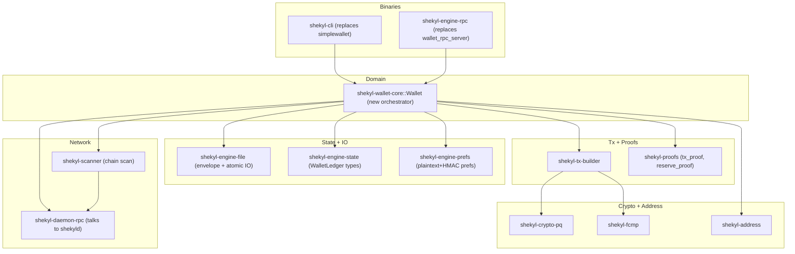

# Shekyl v3 Wallet — Rust Rewrite

## Scope and non-goals

- **In scope:** `shekyl-core` only. The Rust wallet stack (`rust/shekyl-wallet-*`, `shekyl-tx-builder`, `shekyl-scanner`, `shekyl-proofs`, `shekyl-cli`, `shekyl-wallet-rpc`, `shekyl-daemon-rpc`) is completed to feature parity with the daily-use surface of `simplewallet` + `wallet_rpc_server`. The C++ `wallet2` stack is deleted.
- **Out of scope (separate plans):** GUI ([shekyl-gui-wallet](../../shekyl-gui-wallet/)) re-wiring, mobile ([shekyl-mobile-wallet](../../shekyl-mobile-wallet/)) re-wiring, monero-oxide un-pin / primitives audit, V3.1 PQC-FROST multisig completion. Each follows once this plan delivers a stable Rust wallet API.
- **Non-goal:** Monero compatibility of any kind. No format detection, no migration shims, no carrying forward Monero-shaped APIs because they exist upstream.

## Locked design (from prior plans, do not re-litigate)

- **Wallet file format:** v1 split-file envelope (`.wallet.keys` + `.wallet`) per [docs/WALLET_FILE_FORMAT_V1.md](../WALLET_FILE_FORMAT_V1.md). Stance Minimum-Leak AAD, two-level KEK (DK → file_kek → wrap_key), capability-discriminated region 1, Poly1305 cross-file binding via `state_tag_of_seed_block`. Region 1 write-once; region 2 free to rewrite. Already landed in `rust/shekyl-crypto-pq/src/wallet_envelope.rs` + `rust/shekyl-engine-file/`.
- **Key signature:** master_seed_64 → HKDF with `shekyl-master-derive-v1-<network>-<format>` salt → wide-reduce Ed25519 scalars → ML-KEM-768 via SHA3-256(`shekyl-mlkem-chacha-seed` || d_z) → ChaCha20Rng. BIP-39 mainnet/stagenet (passphrase opt-in only), raw 32-byte seed testnet/fakechain. Already landed in `rust/shekyl-crypto-pq` per [stabilize_key_signature_15d8e48a](../plans/stabilize_key_signature_15d8e48a.plan.md).
- **Transaction shape:** `RCTTypeFcmpPlusPlusPqc` only (and `RCTTypeNull` for coinbase). FCMP++ membership proofs from genesis, hybrid PQC (Ed25519 + ML-DSA-65) on signing, ML-KEM-768 in addresses.
- **Multisig:** modified FROST scaffold lives behind `shekyl-wallet-core/multisig` feature; full V3.1 ship-readiness is a separate plan. The Rust wallet API is shaped FROST-aware from day 1 so V3.1 is a feature flip, not a refactor.

## Inventory: what exists, what's the gap

This is "we're pretty far, tbh." The phase plan below assumes this baseline. Discoveries during implementation that contradict this inventory get filed back here.

### Already landed in `rust/`

- [shekyl-engine-state](rust/shekyl-engine-state/): `TransferDetails`, `RuntimeWalletState`, `SubaddressIndex`, `PaymentId`, `StakerPoolState`, `LedgerBlock`, `BookkeepingBlock`, `TxMetaBlock`, `SyncStateBlock`, `WalletLedger` aggregator. Postcard round-trip proptests in place.
- [shekyl-engine-file](rust/shekyl-engine-file/): orchestrator with `Wallet::{create,open,save,change_password,verify_password}`. Advisory locking, atomic tmp→fsync→rename→fsync-parent. Per-block ledger payload framing.
- [shekyl-engine-prefs](rust/shekyl-engine-prefs/): plaintext-with-HMAC user prefs (layer 2 of [WALLET_PREFS.md](../WALLET_PREFS.md)).
- [shekyl-scanner](rust/shekyl-scanner/): chain scan, output identification, key-image computation.
- [shekyl-tx-builder](rust/shekyl-tx-builder/): BP+ range proofs, FCMP++ sign, hybrid PQC auth. `transfer_e2e_1in_2out` benched.
- [shekyl-proofs](rust/shekyl-proofs/): tx_proof, reserve_proof.
- [shekyl-staking](rust/shekyl-staking/), [shekyl-economics](rust/shekyl-economics/): consensus and fee maths.
- [shekyl-daemon-rpc](rust/shekyl-daemon-rpc/): client to `shekyld`.
- [shekyl-cli](rust/shekyl-cli/), [shekyl-engine-rpc](rust/shekyl-engine-rpc/): scaffolded crates, not yet binary-complete.
- [shekyl-ffi](rust/shekyl-ffi/) typed wallet-ledger surface ([wallet_ledger_ffi.rs](rust/shekyl-ffi/src/wallet_ledger_ffi.rs)) — kept as the SHKW1 contract; the C++ side that consumed it is deleted in this plan.

### Gap

- **Wallet domain API:** `shekyl-wallet-core` has stake/unstake/claim transaction builders, but no `Wallet` orchestrator type that composes file + state + prefs + scanner + tx-builder + RPC client into one cohesive surface for binaries to consume. This is the heart of the rewrite.
- **CLI feature parity:** `shekyl-cli` exists but does not yet implement the daily-use command set.
- **RPC feature parity:** `shekyl-engine-rpc` exists but does not yet implement the JSON-RPC method set the GUI/mobile clients will eventually depend on.
- **Wallet flows:** wallet creation (generate / restore-from-bip39 / restore-from-raw / restore-from-view-key / watch-only / hardware-offload), open with password rotation, lost-state rescan path are partially in [shekyl-engine-file](rust/shekyl-engine-file/) but not exposed as a clean `Wallet::*` API.
- **C++ deletion:** `wallet2.cpp` (~6500 LoC), `wallet2_ffi.cpp`, `wallet/api/` (Qt-API surface used by GUI today), `simplewallet/` (~10 kLoC), `wallet_rpc_server*.cpp` are still in tree. CMake still builds them.
- **monero-oxide vendor sync:** verify the vendored tree matches the upstream commit we want for the wallet stack's needs (`shekyl-primitives`, `shekyl-generators`, `shekyl-io`, `shekyl-fcmp-plus-plus`, `shekyl-bulletproofs`, `shekyl-rpc`, `helioselene`, `ec-divisors`, `generalized-bulletproofs`). Don't un-pin in this plan.

## Architecture target



C++ keeps only `shekyld` (daemon) and the FFI primitives layer that `shekyld` consumes. Everything in `src/wallet/`, `src/simplewallet/`, and `src/wallet/api/` is deleted.

## Operating principles (do not drift)

Three properties that distinguish this plan from the wallet-state-promotion plan that preceded it. Naming them explicitly so they survive contact with execution.

1. **Bisectability is not a goal.** The previous plans tried to keep `dev` green at every commit. This is a rewrite; an intermediate PR may leave `shekyld` building but `shekyl-cli` non-functional, or `wallet2.cpp` still in tree behind the new Rust stack. Bisectability is for incremental work, not for greenfield replacement. Phase boundaries are the coherence boundaries, not commits.
2. **The "why now / can we do better" framework is applied per-feature, not per-commit.** The previous plan asked "should we do 2l" once and didn't revisit. This plan asks the question per feature (address book, tx_keys, payment IDs, account hierarchy, background sync, cold wallet, agent mode, JSON shape). Feature-level granularity is where preservation theater hides; that's the level at which the question has to be re-asked.
3. **C++ deletion is a single commit, not death by 1000 cuts.** Phase 5 lands as one commit. This forces "is everything that needs to be in Rust actually in Rust?" to be answered concretely, not deferred to "we'll delete more later." If Phase 5 can't land in one commit because something is missing, that's a Phase 1–4 gap to fix, not a Phase 5 problem.

### Additional principles inherited from Stage 1 trait-extraction (PRs 3/4/5)

Five disciplines surfaced through the Stage 1 per-engine PR design
rounds
([`docs/design/STAGE_1_PR_3_KEY_ENGINE.md`](shekyl-core/docs/design/STAGE_1_PR_3_KEY_ENGINE.md),
[`STAGE_1_PR_4_REFRESH_ENGINE.md`](shekyl-core/docs/design/STAGE_1_PR_4_REFRESH_ENGINE.md),
[`STAGE_1_PR_5_PENDING_TX_ENGINE.md`](shekyl-core/docs/design/STAGE_1_PR_5_PENDING_TX_ENGINE.md))
that apply at plan altitude. Captured here so subsequent phases
(Phase 1 through Phase 6) inherit them by default rather than
re-derivation under adversarial review. The detailed inheritance
discipline is recorded at
[`docs/V3_ENGINE_TRAIT_BOUNDARIES.md`](shekyl-core/docs/V3_ENGINE_TRAIT_BOUNDARIES.md)
§8.3 (cross-PR discipline inheritance) with worked-example citations;
the principles below are the plan-altitude summary that subsequent
phase design rounds cite at pre-flight.

4. **Architectural-integrity-now governs disposition at all altitudes, not just load-bearing questions.** Cost-benefit analysis recommending incremental work runs counter to architectural-integrity analysis recommending structural work; the discipline-correct default for security-load-bearing work is *fix-structurally-now* unless the cost is genuinely prohibitive. The discipline applies at *every* altitude — load-bearing questions, R-residual dispositions, feature-level decisions, and trait-shape choices. The PR 5 R11 reframe (segment 2b) is the worked example: a Round-1 (a)-leaning disposition at the residual altitude was the cost-benefit-defer-to-later anti-pattern recurring outside the load-bearing-question altitude where the discipline had previously been applied. Per [`.cursor/rules/16-architectural-inheritance.mdc`](shekyl-core/.cursor/rules/16-architectural-inheritance.mdc). The corollary on extensibility shapes: pre-provision-for-flexibility is the same anti-pattern wearing different clothes — wider trait surfaces or enum shapes that *appear* extensible silently admit decision-class signals that established disciplines forbid; narrow shapes with per-candidate adjudication are the discipline-correct default (PR 5 G1 worked example per [`.cursor/rules/21-reversion-clause-discipline.mdc`](shekyl-core/.cursor/rules/21-reversion-clause-discipline.mdc)). Inherited by every phase's disposition decisions.

5. **Design rounds close on substrate-exhaustion, not schedule. Close-out produces audit-trail substrate that subsequent phases inherit.** A design round closes when the wargaming surface *known at closure time* is genuinely exhausted, not when a schedule says so. New shapes surfacing in Round-N+1 (or later) **reopen Round N explicitly** rather than slipping past closure as quiet revisions. Each closure produces audit-trail substrate — a discipline-citation matrix recording what the design got right by construction versus the failure modes other projects' deployed systems have absorbed; segment-level provenance for each load-bearing disposition. The substrate is the answer to "why this shape over the obvious shape?" that Phase 9 audit reviewers will ask first. The PR 5 §7 closure-rule strengthening (segment 2c), segment-2h reopen-and-close, segment-2i reopen-and-close, and §5.6.9 discipline-citation matrix are the worked examples. Applied to every phase that has multi-round design structure (Phase 1 wallet domain model; Phase 2 core operations; Phase 4 RPC surface). The audit-trail substrate is *not* documentation theater — it is the inheritance vehicle that makes subsequent phases' design rounds cheaper.

6. **Pre-execution wider-substrate audit is distinct from residual sweep.** Before committing to execution, every design phase runs a *wider-substrate audit* asking "what have other wallet ecosystems / cryptocurrency projects taught us about deployment failure modes that this phase hasn't named?" The yield is distinct from the residual sweep: residuals enumerate what the design rounds *themselves surfaced*; the wider-substrate audit enumerates what *deployed-system failure histories* have surfaced that the design rounds didn't ask about. Some items land as substrate-now (V3.0 variant pre-pins required for V3.x consumer-actor patterns per architectural-integrity-now); some land as deferred FOLLOWUPS with named reopening triggers; some land as priority-hierarchy rejections with named reopening criteria. The PR 5 segment-2i G1–G8 audit (mempool eviction, long-range reorg of confirmed txs, replacement/fee-bump, HW-wallet signing latency, output maturity filtering, confirmation tracking, build-cancel ergonomics, wallet-locked-during-in-flight) is the worked example; eight items found, five admitted as V3.0 substrate, three FOLLOWUPS'd, one priority-hierarchy-rejected with named reopening criteria. Applied to every phase before phase-execution begins.

7. **Threat-model anchors are structural, not optimizations.** Two threat-model anchors govern wallet design and are structural, not deferred-to-V3.x optimizations. *Anchor 1 — adversary-controlled daemon as expected deployment.* Shekyl's Tor/I2P-first deployment posture per [`ANONYMITY_NETWORKS.md`](shekyl-core/docs/ANONYMITY_NETWORKS.md) means wallets routinely connect to daemons under adversary control — anonymous-network exits, hosted deployments, mixed-trust environments. Designs that admit structural single-peer DoS, or that trust the daemon for any privacy-load-bearing decision (fee estimation; submission timing; current-state queries), are structurally incompatible with the project's primary deployment model. *Anchor 2 — HW-wallet as primary, not edge.* Hardware-backed secure-storage paths are dominant for privacy-conscious users; the Shekyl Foundation's own release-key signing already uses hardware-backed key storage. Trait surfaces are designed so spend material never enters the consuming actor from V3.0 baseline; HW-wallet integration is a `Signer`-impl substitution against the same boundary, not a retrofit. Per [`.cursor/rules/00-mission.mdc`](shekyl-core/.cursor/rules/00-mission.mdc) §1 (security as precondition, not optimization). PR 5 segment 2a (anchor 1 strengthening) and segment 2b (anchor 2 via R11 (b) split) are the worked examples. Inherited by every phase's wargaming surface as load-bearing criteria, not optional steelmen.

8. **Priority hierarchy is ordering, not magnitude comparison.** The [`.cursor/rules/00-mission.mdc`](shekyl-core/.cursor/rules/00-mission.mdc) priority hierarchy (security and quantum resilience > privacy > usability > performance > everything else) is **ordering**, not cost-benefit-balance. Any priority-N cost rejects any priority-(N+1)-or-below benefit regardless of magnitudes. Features whose privacy cost (priority 2) is bounded-but-real in exchange for substantial UX benefit (priority 3) are *rejected at design-rounds altitude*, not "evaluated-in-V3.x." Reopening requires named substrate-anchored criteria — cryptographic analysis demonstrating the cost dissolves; telemetry-driven priority-class re-classification of the benefit into a higher-priority class — not user-impact rate or consumer complaints. The PR 5 G3 transaction-replacement / fee-bump disposition (segment 2i §5.6.10) is the worked example: structural rejection with two named reopening criteria (FCMP++ fingerprint-unobservability cryptographic analysis OR R16 V3.x `WalletSideEstimator` telemetry demonstrating fee-estimation insufficiency at user-impact-significant rate that re-classifies stuck-tx-recovery from priority-3 UX to priority-1 security/integrity). Inherited by every phase's feature-decision surface; the discipline forecloses the recurring "users want X" pattern from re-opening priority-3 features at every phase.

---

**Inheritance pattern.** Principles 4 through 8 are *inheritance-by-citation*. Subsequent phase design rounds pay the citation cost (one paragraph at design-rounds open naming which principles apply and how) and inherit the substrate. The citation is not pro-forma — naming which principles apply to *this* phase's surface is itself part of the discipline. Phases whose surface doesn't admit a given principle (e.g., Phase 5's mechanical C++ deletion doesn't have priority-hierarchy adjudication surface) name the non-applicability explicitly rather than skipping the citation.

## Cross-cutting design decisions (locked in Phase 0 review gate)

Decisions that propagate across every phase. Each is one paragraph; rationale lives in `docs/V3_WALLET_DECISION_LOG.md` (see PR 0.1). Locking these now prevents the worst case: the first method written silently sets the precedent and every subsequent method inherits it without anyone choosing.

- **Async runtime — caller-provided multi-threaded tokio.** Every `Wallet::*` method that touches IO is `async`; pure compute (e.g., `balance()` reading in-memory `WalletLedger`) stays sync. `Wallet` does **not** own the runtime — the caller (binary or test harness) provides it via `tokio::main` or `Runtime::new()`. Multi-threaded because Phase 4a's `axum` benefits from it and Shape B inherits the choice. Justification for caller-owned: makes `Wallet` testable without runtime-state setup; lets the CLI/RPC binaries control runtime configuration independently.

- **Error types — per-domain in core, unified at the RPC boundary.** Domain layer (`shekyl-wallet-core`) ships per-domain error enums (`SendError`, `RefreshError`, `KeyError`, `IoError`, etc.) with `thiserror` + `#[from]` conversions for ergonomic `?` propagation. The RPC layer (`shekyl-wallet-rpc`) defines a single `WalletRpcError` enum that every domain error converts into. JSON-RPC error code allocation is **co-located with the OpenAPI spec** at [docs/api/wallet_rpc.yaml](docs/api/wallet_rpc.yaml), with stable code ranges (e.g., -29000..-29999 for wallet domain, -32xxx for protocol per JSON-RPC 2.0). Per-method codes can land alongside each method, but the ranges and error-shape contract are set in the spec from the first commit of Phase 4b.

- **Locking discipline — `&self` queries / `&mut self` mutations; writer-preferred `RwLock<Wallet>` at the RPC boundary; refresh via typed `ScanResult` merge.** Type-layer rule: query methods (`balance`, `primary_address`, `list_addresses`, `transfers`) take `&self`; mutating methods (`refresh`, `send`, `submit`, `create_subaddress`, `change_password`) take `&mut self`. Binary-layer wrapper: `Arc<RwLock<Wallet>>` with a **writer-preferred** implementation (e.g., `parking_lot::RwLock` or explicit lock-ordering on `tokio::sync::RwLock`) so refresh isn't starved by sustained reader load from a polling GUI. Refresh holds the write lock only briefly: take read lock to snapshot scan cursor and tip hash → release → network IO + scan to local `ScanResult` buffer with no lock held → take write lock briefly to call `Wallet::apply_scan_result(result)` → release. **`apply_scan_result` is additive-only and scoped to the scan-result slice** of `WalletLedger` (scanned transfers, sync cursor, scanned-pool cache); it never touches `unconfirmed_txs`, `address_book`, key-image caches, or any field owned by the send/lifecycle paths. The merge verifies `wallet.synced_height == result.start_height`; mismatch (concurrent mutation, second refresh raced ahead) is `RefreshError::ConcurrentMutation`, caller retries. The constraint is enforceable in the type system: the scanner produces a typed `ScanResult` value, not a `&mut Wallet` mutation; only `Wallet::apply_scan_result` consumes it, and that method's body is the single audited site for the merge contract.

- **`PendingTx` lifetime — process-local handle, chain-state-tagged, reservation-bearing, three-method lifecycle.** `PendingTx` lives in process memory only; not serialized to disk. Each `PendingTx` carries `(built_at_height: u64, built_at_tip_hash: BlockHash, fee_atomic_units: u64)`. Submit verifies (a) `built_at_height` is within the wallet's current reorg window, and (b) the wallet's recorded block hash at `built_at_height` equals `built_at_tip_hash`. Window failure = `PendingTxError::TooOld`; hash mismatch = `PendingTxError::ChainStateChanged`. The `fee_atomic_units` field is informational — submit does not refuse on stale fee, but the CLI/GUI can surface it for re-confirmation. **No clock-based TTL** — the real expiration condition is chain state, which is what the reorg-window + tip-hash check captures. Three-method lifecycle: `build_pending_tx(req) -> PendingTx`, `submit_pending_tx(handle) -> TxHash`, `discard_pending_tx(handle) -> ()`. **Reservation semantics:** `build_pending_tx` reserves the input outputs it selected (so a second build doesn't double-spend in-process); `submit_pending_tx` converts the reservation to "unconfirmed-spent" in `WalletLedger`; `discard_pending_tx` releases the reservation. `discard` is **idempotent and silent on unknown handles** (so a client that crashed mid-flow can safely call it for cleanup). `Wallet::close` returns an error if any `PendingTx` is in flight; the caller must submit or discard first. Air-gapped flows (Phase 2d) use `UnsignedTxBundle` / `SignedTxBundle` as the **explicitly persisted** form; that's a different concept with a different lifetime, and the persisted bundles carry their own height/hash/fee anchoring.

- **`Network` — closed enum, no feature flags, mismatch is a typed error.** `Network = { Mainnet, Testnet, Stagenet, Fakechain }`. No Cargo feature flags excluding networks at compile time (they create matrix complexity for no real benefit; runtime enforcement is sufficient). The wallet file authoritatively declares its network in region 1 (capability + network field). `Wallet::open` requires a `DaemonRpcClient` whose declared network matches; mismatch is `OpenError::NetworkMismatch`, never a warning. The daemon URL's network is **verified via `get_info` before any wallet operation** — defends against DNS hijack pointing a testnet wallet at a mainnet daemon.

- **Subaddress hierarchy — flat, not two-level.** `SubaddressIndex(u32)` newtype, single namespace per wallet. Index 0 reserved for primary address. JSON shape is `{"index": u32}`, not `{"account": u32, "index": u32}`. Exchanges that want stronger isolation use multiple wallet files (separate keys → stronger than wallet2's account-level subaddresses, which shared keys). The wallet2 two-level "account/subaddress" hierarchy is dropped from genesis. This decision propagates into the OpenAPI spec from Phase 4b's first method.

- **`RefreshHandle` semantics — cancel-on-drop, single-flight.** `RefreshHandle` returned from `Wallet::refresh()` aborts the underlying `tokio::task::JoinHandle` on drop (RAII). Single-flight is enforced by `&mut self` on `refresh`: a second call while a refresh is in flight is a compile error or returns `RefreshError::AlreadyRunning` (whichever the borrow checker permits given the call site). The scanner loop **checkpoints between blocks** so cancellation is clean — mid-block cancellation is not allowed.

- **Fee priority — 3-bucket UX over daemon-supplied named estimates with sanity ceiling.** `FeePriority = { Economy | Standard | Priority | Custom(NonZeroU64) }`. The three named buckets are resolved at tx-build time via a `get_fee_estimates` RPC call to `shekyld`; the daemon returns **named per-bucket estimates** (`{economy, standard, priority}` in atomic-units-per-byte), not raw percentile data, so the bucket-to-feerate mapping lives daemon-side and adapts to mempool conditions without wallet redeploy. `Custom(NonZeroU64)` bypasses the daemon estimate and submits a caller-specified feerate. **No hardcoded multipliers** — wallet2's `0.5x/1x/4x` were tied to assumed mempool dynamics that don't age well. **Sanity ceiling:** the wallet refuses build with `TxError::DaemonFeeUnreasonable` if the daemon's `priority` estimate exceeds a configurable ceiling (default loose, e.g., 10x the daemon's `economy` estimate). The ceiling defends against a compromised or buggy daemon returning extreme values; it is loose enough not to second-guess the daemon under normal conditions. **Phase 0 audit prerequisite:** does `shekyld` already expose `get_fee_estimates` returning named-bucket shape? If not, the daemon-side method is a Phase 2a prerequisite (file under `docs/SHEKYLD_PREREQUISITES.md` alongside the regtest audit). Document the bucket semantics in [docs/WALLET_RPC_README.md](docs/WALLET_RPC_README.md).

- **Logging — `tracing` with two-layer secret redaction (type + subscriber).** `tracing` crate, structured JSON output for production, per-crate spans, log level via `RUST_LOG` env var (no in-wallet config). **Layer 1 (type-level):** `LocalLabel(Zeroizing<String>)` (and peer types for any user-provided string near a key) ships **both** a redacting `Debug` impl and a redacting `Display` impl (`"<redacted N bytes>"` for both). Redacted-secret types have **no derived `Serialize`/`Deserialize`** — accidental wire-format serialization is a compile error. Disk persistence uses an explicit method (`expose_for_disk()` or similar on the wallet-file layer) that opts into the bytes. The only way to read inner contents is `expose() -> &SecretStr`, where `SecretStr` is itself a redacted-on-format newtype; the `&str` boundary is never crossed at the type layer. Code that genuinely needs label bytes for legitimate reasons calls `label.expose().to_disk_bytes()` or equivalent — the boundary is explicit and grep-able. **Layer 2 (subscriber-level):** `tracing` subscriber configured with a redacting field formatter as defense-in-depth, so non-redacted-typed strings entering a span via context (timestamps, heights, RPC method names) don't accidentally adjoin secret material in formatted output. The two layers are complementary: Layer 1 catches `println!` / `panic!` / `format!` / `Debug` / `Display` / `Serialize`; Layer 2 catches anything that slipped into a tracing span via legitimate paths.

- **KAT regression — plain tests, dedicated files, slow tests `#[ignore]`-gated, `CODEOWNERS` + branch protection.** KAT tests run under `cargo test --workspace` like any other test — no `--features kat-regression` build mode. **Dedicated locations:** KAT tests live in `tests/kat_*.rs` per-crate (or a per-crate `kat/` subdirectory); they are not scattered across general test files. CI verifies the expected KAT files exist and contain at least the expected test count, so silent deletion fails CI. **Slow KATs** (Argon2id KDF, large fixture roundtrips) use `#[ignore]` so a developer's local `cargo test` runs the fast subset; CI runs `cargo test -- --include-ignored` (or an equivalent target) to exercise the full suite. **Source-control protection:** `CODEOWNERS` covers both `docs/test_vectors/**` (the corpus) and `tests/kat_*.rs` (the assertion code). Branch protection on `dev` requires PR for all changes (no direct-push exemption for any path), so `CODEOWNERS` cannot be bypassed by direct push. The protection is at the source-control layer where it belongs, not at the build layer.

- **Decision Log — `docs/V3_WALLET_DECISION_LOG.md`.** Append-only markdown file capturing every binding decision in this plan with its rationale. Every entry is dated, names the decision, names alternatives considered, and names the reasoning. In 12 months when someone asks "why doesn't Shekyl support payment IDs?" the answer is in one place. Lands in PR 0.1 (bookkeeping). Future plans append; entries are never deleted, only superseded with a dated supersession note.

## Hard design questions to answer per phase

For each domain, the rewrite must answer:

1. **Why is this useful NOW?** If it exists only because Monero has it, delete it.
2. **Can we do better?** Type-system enforcement of invariants, secret-locality, and transactional safety should replace caller-discipline patterns inherited from C++.
3. **Three timeframes:** does the design work today, at mining-era end, and into the V4 lattice-only transition? (See [.cursor/rules/05-system-thinking.mdc](shekyl-core/.cursor/rules/05-system-thinking.mdc).)

Each phase below names its specific design questions inline. The cross-cutting decisions above are not re-litigated per phase — phase work conforms to them.

## Phase 0 — Close out the previous plan; align baseline

Six small PRs, all of which are bookkeeping or mechanical. None move into Phase 1 work.

### PR 0.1 — Bookkeeping (close prior plan + decision log)

- Add minimal `[DEFERRED — absorbed into shekyl-v3-wallet-rust-rewrite]` header to [.cursor/plans/2l-cache-rewire_80a08559.plan.md](../plans/2l-cache-rewire_80a08559.plan.md), preserving body as design record.
- Delete [docs/benchmarks/MID_REWIRE_WARNING_WINDOW.active](shekyl-core/docs/benchmarks/MID_REWIRE_WARNING_WINDOW.active); rotate bench baseline against post-2k.c steady state; update [docs/MID_REWIRE_HARDENING.md](shekyl-core/docs/MID_REWIRE_HARDENING.md) §3.3.1 closure note to point at this plan instead.
- Add **"V3.1+ — Legacy C++ → Rust rewrite scope"** section to [docs/FOLLOWUPS.md](shekyl-core/docs/FOLLOWUPS.md). Sub-sections: "wallet2.cpp" (capturing 2l/2m/2n absorption), "tx_pool / blockchain_db LMDB transactional wrapper" (capturing the Dandelion-class lesson — typed `LockedTXN` where commit-on-success is enforced by the type system, not by caller discipline).
- **Create `docs/V3_WALLET_DECISION_LOG.md`.** Initial entries (one per binding decision from the cross-cutting list and from per-phase locks): payment IDs dropped, Shape B chosen over Shape A, account hierarchy dropped, JSON shape Shekyl-native, async runtime caller-provided multi-threaded tokio, error types per-domain + RPC-unified, `RwLock<Wallet>` at RPC boundary with brief-write refresh, `PendingTx` height-tagged + 3-method lifecycle (build / submit / discard), `Network` closed enum + daemon `get_info` verification, fee priority over daemon estimates (no hardcoded multipliers), tracing with type-level secret redaction, KAT protection via `CODEOWNERS`, air-gapped flow as `UnsignedTxBundle` / `SignedTxBundle`. Each entry: date, decision, alternatives considered, rationale, link to plan section. Append-only thereafter; entries are superseded in place with a dated supersession note, never deleted.
- **Add `CODEOWNERS` entry for `docs/test_vectors/**`** requiring two-maintainer approval. (The CI mechanism is plain `cargo test`; the protection is at the source-control layer.)

### PR 0.2 — Rename `shekyl-wallet-file::Wallet` → `WalletFile`

Mechanical rename in its own PR, separate from PR 0.1 and PR 0.3 for clean bisect. Resolves the naming collision with the Phase 1 top-level `Wallet` orchestrator before either type acquires call sites. `Account` is rejected as a replacement (overloaded by account-model chains and the legacy account/subaddress hierarchy that Phase 1 may drop). `WalletFile` describes what it actually is: envelope, atomic IO, advisory locking, payload framing.

Touches: `rust/shekyl-wallet-file/src/lib.rs` plus every call site in `rust/shekyl-wallet-core/`, `rust/shekyl-wallet-rpc/`, `rust/shekyl-cli/`, and any FFI consumer. Does not touch C++ (`wallet2.cpp` does not import the typed Rust `Wallet`).

### PR 0.3 — `shekyld` prerequisites audit

Three `shekyld` capabilities the Rust wallet stack assumes. Audit all three now; surfacing gaps in Phase 0 is far cheaper than discovering them mid-Phase-6 or mid-Phase-2a.

**Audit 1 — instant-mining regtest mode (Phase 6 prerequisite).** Confirm `shekyld` already supports an instant-mining regtest mode suitable for the Phase 6 integration harness (mining 60 blocks for coinbase maturity at real-network difficulty would be hours per test run). Most likely candidates: `--regtest`, `--testnet --fixed-difficulty 1`, or an existing `--difficulty 1` mode used by daemon unit tests.

**Audit 2 — `get_fee_estimate(s)` daemon RPC (Phase 2a prerequisite).** The cross-cutting fee-priority decision assumes `shekyld` exposes a `get_fee_estimate(s)` RPC returning per-bucket estimates the wallet can map to its three priority levels. Confirm presence and shape — daemon supplies numbers, wallet supplies names. Whether the wire format is positional or name-keyed is a daemon implementation detail; the wallet maps positional-or-named buckets to its `Economy | Standard | Priority` taxonomy regardless.

**Audit 3 — fee policy / rules version exposure.** Does `shekyld` expose its current fee policy / rules version, either as a field in `get_fee_estimate(s)`'s response, on `get_info`, or as a separate RPC? Without an in-band version signal the wallet has no way to detect "this daemon is running fee math newer than my wallet binary knows about" except by comparing daemon binary versions, which conflates fee policy with unrelated daemon-binary changes. Absence is **not** a Phase 0 blocker for V3.0 (V3.0 launches with whatever fee policy `shekyld` ships with, and changes happen via hard fork; the wallet binary is rebuilt against the new daemon at fork time). Absence **is** a daemon-side V3.1 follow-up. The wallet uses `Option<u32>` for forward compatibility.

Output for all three audits goes into `docs/SHEKYLD_PREREQUISITES.md` (new). For each:

- If present and shape is correct: document the invocation / RPC schema the wallet will rely on.
- If absent or shape is wrong: file a pre-task issue scoped to add or reshape it. The regtest issue blocks Phase 6 only; the `get_fee_estimate(s)` issue blocks Phase 2a only; the fee-policy-version absence blocks neither Phase 0 nor Phase 1 (filed as a daemon-side V3.1 follow-up). Phases 1, 3, 4, and 5 proceed in parallel against unit-test fixtures while any daemon work lands.

### PR 0.4 — monero-oxide vendor-status baseline

Verify monero-oxide vendor freshness against both upstreams. Two heads to check:

1. `kayabaNerve/monero-oxide` (original upstream, source of truth for FCMP++ research).
2. `Shekyl-Foundation/monero-oxide` (our fork, what the vendored tree is sourced from).

For each of the crates the wallet stack consumes (`shekyl-primitives`, `shekyl-generators`, `shekyl-io`, `shekyl-fcmp-plus-plus`, `shekyl-bulletproofs`, `shekyl-rpc`, `shekyl-rpc/simple-request`, `helioselene`, `ec-divisors`, `generalized-bulletproofs`, `circuit-abstraction`, `ec-gadgets`, `fcmps`), record:

- Vendored commit (current `rust/shekyl-oxide/...`).
- `Shekyl-Foundation/monero-oxide` HEAD commit on the same path.
- `kayabaNerve/monero-oxide` HEAD commit on the same path.
- Any divergence: which patches are Shekyl-only, which are upstream-only and pending merge into our fork, which are conflicts.

Output goes into `docs/MONERO_OXIDE_VENDOR_STATUS.md` (new). If `kayabaNerve` has fixes our fork hasn't merged, file an issue on `Shekyl-Foundation/monero-oxide` rather than cherry-picking directly into the vendored copy. Sync the vendored tree only to match `Shekyl-Foundation/monero-oxide` HEAD.

Do **not** un-pin in this plan. The actual un-pin / fork-and-attribute / drop-unused-crates work belongs to the separate oxide-un-pin plan; this Phase 0 task only establishes the baseline that plan will work from.

**PR 0.4 outcome (landed 2026-04-25):** see [`docs/MONERO_OXIDE_VENDOR_STATUS.md`](docs/MONERO_OXIDE_VENDOR_STATUS.md). Three findings feed PR 0.6, the half-day review gate, and the future un-pin plan:

1. **Vendored ↔ fork delta is trivial** (5 commits, none crypto-substantive except `182b648`'s base58 decoder hardening). A vendor-bump from `87acb57` → `3933664` is mechanical and unblocked. This audit does not perform it; **PR 0.6 below does** (this is "Operation A").
2. **Fork ↔ upstream delta is significant** (40 commits since the 2025-11-22 merge base). Highest-priority correctness items: cypherstack `generalized-bulletproofs-fix` audit response (`cba7117`), Veridise-driven `HelioseleneField::invert` cluster (`00bafcf`, `af44fb4`, `f58f2a9`, `e5d533c`), missing `ConditionallySelectable` bound (`0d6f5e8`), WCG library invariant fix (`1ac294e`). The `00bafcf` field-inversion bug is **active in the vendored code**. Picking these up is **"Operation B"** — a separate un-pin plan, scheduled V3.1.x, **not** scoped to Phase 0 of this rewrite. Rationale: Operation B is a 40-commit cherry-pick across an upstream restructure (`monero-oxide/rpc` → `monero-oxide/interface`+`/daemon`, generators split, fcmp++ moved into `ringct/`), which forces architectural decisions about whether the Shekyl fork tracks upstream's layout — exactly what the un-pin plan exists to make. Folding that into Phase 0 breaks the "single coherent thing per phase" principle and adds a separate review burden the rewrite doesn't need. The `00bafcf` correctness bug exists today on `dev`; Phase 0 closing without picking it up leaves the world exactly as it currently is on this dimension.
3. **Fork-only crypto-substantive divergence is tightly scoped**: only `416d8d1` (rename) and `87acb57` (extra leaf scalars for Shekyl curves) actually change algorithms. The other six fork-only commits are policy / CI / docs.

The half-day review gate re-reads item 2 before Phase 1 commits to API shapes — gate item (5) below — to confirm whether any of the missing upstream commits change a public type signature the `Wallet` orchestrator would compose against. The two highest-priority upstream items live in `crypto/fcmps` and `crypto/helioselene`, below the wallet stack's API surface; almost certainly the answer is "no, the Wallet API shape is unaffected", but confirming it explicitly during the gate is cheap and pre-empts a later "wait, should we have…?" moment.

### PR 0.5 — Scoped `cargo fmt` cleanup

Five pre-existing files accumulated hand-edited formatting drift before this plan started; `cargo fmt --all --check` flags them on `dev`. The drifted set:

- `rust/shekyl-ffi/src/wallet_file_ffi.rs` (4 hunks — call-site reflows after enum-arm edits)
- `rust/shekyl-ffi/src/wallet_ledger_ffi.rs` (4 hunks — `#[serde(...)]` attribute and closure reflows)
- `rust/shekyl-scanner/benches/scan_block.rs` (2 hunks)
- `rust/shekyl-tx-builder/benches/transfer_e2e.rs` (1 hunk)
- `rust/shekyl-wallet-file/src/handle.rs` (1 hunk)

PR 0.5 is a one-commit, mechanical fmt cleanup: `cargo fmt --all`, no other changes. Lands after PR 0.4 and before Phase 1 so the workspace is fmt-clean when the Phase 1 PRs begin (which need `cargo fmt --check` green to land cleanly).

Drift cause is hand-edits, not a `rustfmt` version change, so the fix is unconditional `cargo fmt --all`. Filed separately rather than folded into PR 0.2 (mechanical rename) because mixing rename and fmt makes review harder and creates the wrong precedent for future rename PRs.

### PR 0.6 — Vendor-bump shekyl-oxide to fork tip (Operation A)

The operational consequence of PR 0.4. The audit identifies the vendor-bump `87acb57` → `3933664` (current vendored snapshot → `Shekyl-Foundation/monero-oxide` `fcmp++` HEAD) as **mechanical, cheap, and unblocked**. Doing the audit but not landing the available bump leaves the vendored tree in a known-stale state for the duration of Phase 1+, which is exactly what Phase 0 exists to prevent.

**Strict scope: Operation A only.** This PR syncs vendored↔fork, nothing else. Operation B (40-commit upstream merge into the fork) is **not** in scope for Phase 0 — it belongs to the V3.1.x un-pin plan (cross-linked from [`docs/FOLLOWUPS.md`](shekyl-core/docs/FOLLOWUPS.md) §"V3.1+ — Legacy C++ → Rust rewrite scope" → "monero-oxide un-pin"). See PR 0.4 outcome §2 above for the rationale.

PR shape (single commit, mechanical):

1. Copy the fork subtree at `3933664` into [`rust/shekyl-oxide/`](shekyl-core/rust/shekyl-oxide/), preserving the existing path layout (i.e., do **not** adopt upstream's restructure — that's Operation B).
2. Update [`rust/shekyl-oxide/UPSTREAM_MONERO_OXIDE_COMMIT`](shekyl-core/rust/shekyl-oxide/UPSTREAM_MONERO_OXIDE_COMMIT).
3. Run the workspace verification suite per [`docs/SHEKYL_OXIDE_VENDORING.md`](shekyl-core/docs/SHEKYL_OXIDE_VENDORING.md): `cargo build --workspace`, `cargo test --workspace`, KAT regression intact.
4. **Targeted content review of `182b648`'s base58 decoder hardening.** This is the only commit in the five-commit delta that changes algorithm semantics (the other four are non-crypto). Verify it does not alter the address-string ↔ bytes round-trip behavior that [`shekyl-address`](shekyl-core/rust/shekyl-address/) relies on. If review surfaces a concern (probably won't, but the audit doesn't pre-clear it), bail out of PR 0.6 and file a deeper analysis as a follow-up — do not paper over.

**Cost ceiling.** This is a half-day PR. If the verification suite goes red, `cargo test` regressions surface, or the base58 review opens a deeper question, **don't push through** — bail out, file the finding, and let Phase 1 begin against the existing vendored tree. The bump is a Phase 0 nicety, not a Phase 1 prerequisite.

After PR 0.6 lands, append a dated section to [`docs/MONERO_OXIDE_VENDOR_STATUS.md`](shekyl-core/docs/MONERO_OXIDE_VENDOR_STATUS.md) per its append-only lifecycle policy: new vendored commit, what changed, what verifications passed.

### Half-day review gate (between Phase 0 and Phase 1)

After PRs 0.1–0.6 land, take a half-day to walk this checklist. The gate's purpose is to **lock the cross-cutting decisions and the API-affecting external state** before any Phase 1 method signature commits to a shape that's expensive to change later.

1. **Read PR 0.4 vendor-status findings** ([`docs/MONERO_OXIDE_VENDOR_STATUS.md`](docs/MONERO_OXIDE_VENDOR_STATUS.md)). Original gate scope.
2. **Read PR 0.3 daemon-side findings** ([`docs/SHEKYLD_PREREQUISITES.md`](docs/SHEKYLD_PREREQUISITES.md)). Confirm regtest mode is sufficient for Phase 6, `get_fee_estimate(s)` shape is what Phase 2a binds to, and the `fee_policy_version` absence is the daemon-side V3.1 follow-up the wallet plans for via `Option<u32>`.
3. **Read FOLLOWUPS V3.1+ section** ([`docs/FOLLOWUPS.md`](docs/FOLLOWUPS.md) → "V3.1+ — Legacy C++ → Rust rewrite scope"). Confirm every item that touches the wallet rewrite is **either absorbed** (`wallet2.cpp`, `WalletPrefs` round-trip, daemon-side tracing init), **cross-linked** (`fee_policy_version`, `tx_pool` LMDB wrapper, `monero-oxide` un-pin), **or explicitly closed by Phase 5** (`shekyl-cli` key image binary format, `wallet_tools.cpp` mixin/decoy). Items independent of the rewrite (Chore #4 platform-gate audit, `rand 0.9` migration, libunwind diagnostics, etc.) are noted but not absorbed.
4. **Confirm cross-cutting locks** (the section above) before any Phase 1 method signature lands. Each binding decision either still stands or gets a dated supersession entry in [`docs/V3_WALLET_DECISION_LOG.md`](docs/V3_WALLET_DECISION_LOG.md). No silent reinterpretation.
5. **Confirm un-merged-upstream impact on Phase 1 API shape.** Re-read PR 0.4's "substantive upstream commits" list (item 2 of the PR 0.4 outcome). For each item, ask: does the public type signature change in a way the `Wallet` orchestrator (or `shekyl-tx-builder`, `shekyl-scanner`, `shekyl-proofs`) would compose against? The two highest-priority items (`cba7117` cypherstack response, `00bafcf` `HelioseleneField::invert`) are in `crypto/fcmps` and `crypto/helioselene` — below the wallet stack's API surface — so the expected answer is "no, the Wallet API shape is unaffected; the un-pin plan is fully separable from the rewrite." **If the answer is genuinely "no":** the un-pin plan runs in parallel with rewrite Phases 1–3 if bandwidth allows, but does not block them. **If the answer surfaces a yes** (e.g., lazy proof deserialization `7568518` changes a public type the wallet would compose against): either the un-pin lands first (delaying Phase 1) or Phase 1 commits to API shapes that will require update post-un-pin (acceptable but record it in the decision log so the post-un-pin sweep is explicit). Knowing which case applies before Phase 1 starts is the entire point of this gate item.

If all five items pass without surfacing new questions, Phase 1 begins.

## Phase 1 — Wallet domain model

The crate is `shekyl-wallet-core`; the type is `Wallet`. The naming collision with the file orchestrator was resolved in Phase 0 (renamed to `WalletFile`).

### What's a `Wallet`?

```rust
pub struct Wallet {
    file: shekyl_engine_file::WalletFile,       // envelope + payload IO
    keys: AccountKeys,                          // identity (master seed, derived scalars)
    ledger: WalletLedger,                       // shekyl-engine-state aggregator
    prefs: WalletPrefs,                         // plaintext+HMAC user prefs
    daemon: DaemonRpcClient,                    // shekyl-daemon-rpc
    capability: CapabilityMode,                 // FULL / VIEW_ONLY / HARDWARE_OFFLOAD
    network: Network,
}
```

Composition, not inheritance. No god-object. Each member's mutability + locking discipline is explicit. The `wallet2`-shaped pattern of "200+ public members" is rejected by construction.

### `RuntimeWalletState` audit

`shekyl-engine-state::RuntimeWalletState` was named that way during the wallet-state-promotion plan to disambiguate from `WalletMetadata`. With a top-level `Wallet` orchestrator now present, the "runtime" qualifier no longer disambiguates anything — it's just the in-memory representation of `WalletLedger`. Phase 1 includes a five-minute audit deciding among:

1. Keep as-is (aesthetically inconsistent, mechanically fine).
2. Rename to a final name (the transitional `pub use ... as WalletState` alias was scheduled for deletion in 2n anyway).
3. Fold into `WalletLedger` directly if the type distinction has become artificial.

Default lean: option 3 unless the audit surfaces a behavioral distinction. Whichever option wins, the transitional alias is deleted in the same commit.

### Domain questions (answer in Phase 1, codify in Phase 2)

- **Address book:** *Why now?* Daily-use convenience for "who is this address?". *Can we do better?* It's a privacy hazard if labels correlate addresses; type the field as `LocalLabel(Zeroizing<String>)` and document that labels never cross the FFI or RPC boundary unredacted. Carry forward, hardened.
- **`tx_keys` storage:** *Why now?* `get_tx_proof`. *Can we do better?* Re-derive per-call from view secret + tx pubkey when we have it; only persist when the user has requested an explicit proof artifact. Open question — answer empirically by checking the tx_proof derivation in [shekyl-proofs](rust/shekyl-proofs/).
- **`tx_notes`:** *Why now?* User memory aid. *Can we do better?* Same locality discipline as labels; never on the wire.
- **Integrated addresses / payment IDs: dropped.** Locked in. Integrated addresses are a Monero compatibility wart — they exist because Monero had no subaddresses originally and needed a way to attach a payment ID to "send to this address." Subaddresses solved that; modern Monero only carries them for backwards compatibility with old exchange integrations. Shekyl is pre-launch with zero users depending on payment IDs by definition. `TxRequest` has no `payment_id` field. The `PaymentId` type stays in `shekyl-engine-state` only as long as the on-disk schema requires it; it gets removed at the next schema bump. If a future exchange complains, the answer is "subaddresses give per-recipient tracking with stronger privacy properties than payment IDs ever did." Decision binding for Phase 2a.
- **Subaddress account vs subaddress:** wallet2 has a two-level "account / subaddress" hierarchy. Most users use one account. *Drop the account level entirely?* Ship one flat subaddress namespace per wallet; revisit if exchanges need account separation.
- **Hot-wallet view-key auto-import on receive:** wallet2 has a thing where receiving on a new subaddress auto-creates the entry. *Keep* — usability win with no privacy cost.
- **Background sync:** wallet2's "background sync" feature is an attempt at decoupled scan from foreground. *Replace with structured concurrency:* `tokio::spawn` a scan task whose lifecycle is tied to the `Wallet` handle; cancellation on drop is type-enforced.
- **Cold-wallet flow distinction (decision binding for Phase 2d):** "cold wallet" means two distinct things and they need separate code paths.
  - **Hardware-offload mode** (Ledger/Trezor signing in real-time over USB) is covered by the `HARDWARE_OFFLOAD` capability and does not use file-based handoff.
  - **Air-gapped flow** (view-only on a network-connected machine; signing on a separate offline machine via file-based unsigned/signed-tx handoff) is a separate feature. Required for high-value users who don't trust hardware vendors.

  Decision: keep air-gapped flow, **reshape cleaner than wallet2**. Replace wallet2's separate `export_outputs` / `import_outputs` / `export_key_images` / `import_key_images` with two typed bundle types: `UnsignedTxBundle` (network-connected machine produces; offline machine consumes) and `SignedTxBundle` (offline machine produces; network-connected machine consumes). Each bundle is a single file containing everything needed for the next stage. Phase 2d implements both bundle types end-to-end. The four wallet2 file-format dance methods do not survive.
- **Multisig type-system shape:** add `Wallet<S: WalletSignerKind>` where `S = SoloSigner | MultisigSigner<N, K>`. V3.0 only constructs `Wallet<SoloSigner>`; V3.1 enables the multisig path without changing call sites.

### Phase 1 deliverables

- New module `rust/shekyl-wallet-core/src/wallet.rs` with the `Wallet` struct, lifecycle (`create`, `open_full`, `open_view_only`, `open_hardware_offload`, `change_password`, `close`), and a single `RefreshHandle` for background scan management. Lifecycle methods follow the cross-cutting locks: `&self` queries / `&mut self` mutations, async where IO-bound, sync where compute-only. `Wallet::close` returns an error if any `PendingTx` is in flight (caller must submit/discard first).
- Per-domain error enums (`OpenError`, `RefreshError`, `SendError`, `PendingTxError`, `KeyError`, `IoError`, etc.) under `rust/shekyl-wallet-core/src/error.rs`, `thiserror`-shaped, with `#[from]` conversions. `RefreshError::ConcurrentMutation`, `PendingTxError::TooOld`, `PendingTxError::ChainStateChanged`, `TxError::DaemonFeeUnreasonable` all named here.
- **Typed `ScanResult` value** (`rust/shekyl-wallet-core/src/scan.rs` or in `shekyl-scanner`'s public surface): the scanner produces `ScanResult { start_height, start_tip_hash, end_height, end_tip_hash, scanned_transfers, scanned_pool_updates }` and **does not** mutate `Wallet` directly. `Wallet::apply_scan_result(&mut self, result: ScanResult) -> Result<RefreshSummary, RefreshError>` is the single audited merge site: verifies `wallet.synced_height == result.start_height`, performs an additive merge into the scan-result slice (`LedgerBlock` transfers, sync cursor, scanned-pool cache) and never touches `unconfirmed_txs` / `address_book` / key-image caches. The type system enforces the constraint — `shekyl-scanner` has no `&mut Wallet`.
- `PendingTx` type with `(built_at_height, built_at_tip_hash, fee_atomic_units)` anchoring and reservation ledger entry on input outputs. **The engine-actor-bearing implementation of the `PendingTx` lifetime + reservation surface lives in `PendingTxEngine` per [`STAGE_1_PR_5_PENDING_TX_ENGINE.md`](STAGE_1_PR_5_PENDING_TX_ENGINE.md)** — the cross-cutting decision pinned the trait surface and the (γ) lean three-collection state shape (`output_locks` + `consumer_held` + `in_flight`); the design doc holds the eight-commit C0–C8 decomposition that ships this surface under PR 5 of Stage 1. Snapshot identity is content-derived (`SnapshotId` via `cn_fast_hash` over `LedgerSnapshot` deterministic fields, 16-byte truncation), and chain-state-pinning lives there end-to-end. Reservations and submit-side staleness checks land in `LocalPendingTx` (the Stage 1 implementor); Stage 4's `PendingTxActor` swap is invariant per the trait surface.
- `SubaddressIndex(u32)` newtype lands here. Index 0 is the primary address.
- `Network` closed enum lands here. `Wallet::open` takes a `DaemonRpcClient` and verifies network match against the wallet file's region 1 declaration; the `DaemonRpcClient` itself verifies daemon network via `get_info` on first call.
- `LocalLabel(Zeroizing<String>)` (and peer types) with redacting `Debug` **and** `Display` impls, no `Serialize`/`Deserialize` derives, `expose() -> &SecretStr` accessor where `SecretStr` is also redacting.
- `tracing` setup + per-crate spans wired up (no `RUST_LOG` parsing here — that's binary-side, but the spans exist for binaries to consume); subscriber-level redacting field formatter ships alongside. **Absorbs the daemon-side staticlib follow-up**: per [`docs/FOLLOWUPS.md`](docs/FOLLOWUPS.md) §V3.2 → "shekyl-daemon-rpc staticlib: tracing::* calls silently dropped", today every `tracing::*` event from `rust/shekyl-daemon-rpc` linked into `shekyld` goes to the no-op global dispatcher because no C++ caller installs a subscriber. Phase 1's tracing layer is the natural fix site — it ships a `shekyl_daemon_rpc_init_logging` FFI export (or an equivalent shared-subscriber install path) that `shekyld`'s C++ entry point calls after `mlog_configure` runs. Solving the subscriber question once for the whole codebase is cleaner than solving it for the wallet rewrite and re-solving it for the daemon. Closes the V3.2 entry — re-target to V3.1 / Phase 1 in the FOLLOWUPS file with a closure note when this lands.
- `RuntimeWalletState` audit landed (per the audit section above; default lean: fold into `WalletLedger`).
- Tests: lifecycle round-trips, password rotation roundtrip, lost-state rescan trigger, capability-mode dispatch, network-mismatch typed-error coverage, `RefreshHandle` cancel-on-drop semantics, `apply_scan_result` rejects mismatched `start_height` (concurrent-mutation simulation), close-with-outstanding-PendingTx returns typed error.
- Doc: `rust/shekyl-wallet-core/src/wallet.rs` crate-level `//!` block names which monero-era patterns were rejected and why; cross-references the Decision Log entries.

## Phase 2 — Core operations

Each operation is a method on `Wallet` with a focused signature. No mode flags; if behavior diverges meaningfully (full vs view-only), it lives in different methods.

- **Refresh / scan:** `Wallet::refresh()` drives `shekyl-scanner`. Returns `RefreshSummary { blocks_scanned, transfers_added, reorg_height }`. Async; cancellable. Implements the brief-write-lock pattern from the cross-cutting locks (read snapshot → release → scan → brief write to merge → release).
- **Send (three-method lifecycle):** `Wallet::build_pending_tx(req: TxRequest) -> PendingTx`, `Wallet::submit_pending_tx(handle) -> TxHash`, `Wallet::discard_pending_tx(handle) -> ()`. `PendingTx` carries `built_at_height: u64`; submit verifies wallet tip is `>= built_at_height` with no reorg below. `TxRequest` is `{ dest: Address, amount: AtomicUnits, priority: FeePriority }`. **No `payment_id` field.** Fee priority is `Economy | Standard | Priority | Custom(NonZeroU64)`; the named buckets are resolved to feerate via a `get_fee_estimates` daemon call at build time, not via hardcoded multipliers. **The build/submit/discard methods on `Wallet` orchestrate against `PendingTxEngine`** per [`STAGE_1_PR_5_PENDING_TX_ENGINE.md`](STAGE_1_PR_5_PENDING_TX_ENGINE.md): the engine owns the per-output lock set and the per-reservation `consumer_held` / `in_flight` collection-state lifecycle; the orchestrator translates `TxRequest` into the `build` call and exposes the `submit` / `discard` results back to the binary-layer caller. Output selection delegates to `OutputSelector` (Phase 0i; `Wallet2GreedySelector` V3.0 default); fee estimation to `FeeEstimator` (Phase 0j; `DaemonRecommendationEstimator` V3.0 default with `ExplicitFeeEstimator` alternative). Daemon-rejection / daemon-ambiguous / snapshot-invalidated outcomes surface through the engine's `SubmitError { TerminalErrorKind | AmbiguousErrorKind | SnapshotInvalidated | ... }` enum (segment-2h reshape).
- **Stake / unstake / claim (Phase 2b — substantive scope, not "thin wrappers"):** A stake has a multi-step asynchronous lifecycle driven by chain progress, not by wallet operations: built-but-not-broadcast → broadcast-unconfirmed → confirmed-locked → accruing → claimable → unstaking → fully-unstaked. Wallet2 had no first-class concept for this; the wallet was a pure tx builder and the user tracked state mentally. Shekyl V3 makes the state machine explicit. Concrete shape:

  ```rust
  pub struct StakeInstance {
      pub txid: TxHash,
      pub amount: AtomicUnits,
      pub tier: StakeTier,
      pub state: StakeState,
      pub accrued_rewards: AtomicUnits,
      pub next_claim_height: Option<u64>,
  }

  pub enum StakeState {
      PendingBroadcast,
      Unconfirmed { broadcast_at: u64 },
      Locked { confirmed_at: u64, unlocks_at: u64 },
      Accruing { since: u64 },
      Claimable { since: u64, expires_at: Option<u64> },
      Unstaking { initiated_at: u64, completes_at: u64 },
      FullyUnstaked,
  }
  ```

  `StakeInstance` is a first-class persisted type in `WalletLedger`. Refresh-time reconciliation: `apply_scan_result` (per Decision 3) advances each `StakeInstance.state` based on the scanned blocks' height vs each stake's lock periods and accrual rules. The wallet exposes `Wallet::stakes(filter)`, `Wallet::claimable_rewards() -> AtomicUnits`, `Wallet::stake(amount, tier) -> PendingTx`, `Wallet::claim(stake_id) -> PendingTx`, `Wallet::unstake(stake_id) -> PendingTx`. The build/claim/unstake methods enter the state machine; they do not return a finalized tx. **Phase 2b is the largest single sub-phase by scope** — implementing the state machine, refresh-time reconciliation, persistence in `WalletLedger`, and the user-facing query/build methods. Plan budget accordingly; "thin wrappers" was the wrong framing.
- **Receive / addresses:** `Wallet::primary_address()`, `Wallet::create_subaddress(label) -> SubaddressIndex`, `Wallet::list_addresses(filter)`. Integrated addresses do not exist (Phase 1 decision).
- **History:** `Wallet::transfers(filter) -> impl Iterator<&TransferDetails>`. Filter on direction/state/account/since-height.
- **Balance:** `Wallet::balance() -> Balance { unlocked, locked, pending }`. Computed from `WalletLedger`.
- **Proofs:** `Wallet::tx_proof(txid, dest) -> TxProof`, `Wallet::reserve_proof(amount) -> ReserveProof`. Delegate to [shekyl-proofs](rust/shekyl-proofs/).
- **Air-gapped (cold) flow (Phase 2d):** two typed bundle types per the Phase 1 decision.
  - `UnsignedTxBundle` — produced by the network-connected view-only machine. Contains: scanned outputs (with full identification metadata), key-image inputs the offline machine needs to compute new key images, and a `TxRequest`. Single file, postcard-framed, integrity-tagged.
  - `SignedTxBundle` — produced by the offline machine. Contains: signed `RCTTypeFcmpPlusPlusPqc` transaction(s), updated key images, and a back-link to the originating `UnsignedTxBundle` hash so the network-connected machine refuses cross-bundle replay.
  - API: `Wallet::export_unsigned(tx_request) -> UnsignedTxBundle`, `Wallet::sign_unsigned(bundle) -> SignedTxBundle` (offline-only; refuses network calls), `Wallet::submit_signed(bundle) -> Vec<TxHash>` (network-connected; refuses without a known unsigned-bundle hash). Wallet2's separate `export_outputs` / `import_outputs` / `export_key_images` / `import_key_images` four-call dance is **not ported**.
- **Sign / verify message:** `Wallet::sign_message(msg)`, `Wallet::verify_message(msg, sig, address)`.
- **Restore-from-keys:** subset of constructors covering view-only restore and full-from-spend-key restore (mainnet uses BIP-39, but the type system shouldn't preclude it).

### Hard cuts for Phase 2

Drop without porting:
- `set_log_level` / `set_log_categories` (logger is process-global, not wallet-state).
- `mining` commands (now in `shekyld`).
- `set_default_priority` and similar pref-storage RPC methods (handled by [shekyl-wallet-prefs](rust/shekyl-wallet-prefs/)).
- `start_mining`, `stop_mining` (out-of-scope for a wallet).
- `payment_id` (Phase 1 decision; not a `TxRequest::extra` escape hatch either — gone).
- `make_integrated_address` / `split_integrated_address` and the `IntegratedAddress` type entirely.
- The four-call `export_outputs` / `import_outputs` / `export_key_images` / `import_key_images` dance — replaced by `UnsignedTxBundle` / `SignedTxBundle`.

## Phase 3 — `shekyl-cli` binary

Replaces `simplewallet`. Interactive REPL + scriptable single-command mode.

### Process model: locked to Shape B (CLI as thin client)

Two genuinely different shapes were considered:

- **Shape A:** `shekyl-cli` is the wallet-bearing process; agent mode is a flag.
- **Shape B:** `shekyl-cli` is **always** a thin client to `shekyl-wallet-rpc`; one-shot commands self-host an in-process `shekyl-wallet-rpc` and tear it down on exit.

**Decision: Shape B.** Rationale:

- "CLI and RPC are the same code path" becomes literal, not aspirational. There is one wallet-bearing process type.
- Integration tests in Phase 6 cover both binaries by exercising one harness against `shekyl-wallet-rpc`'s socket — no duplicate test surface.
- The CLI-as-thin-client pattern is established in modern Rust tooling (`sccache`, `cargo-watch`).
- The persistent agent question collapses into "did the user pre-start a `shekyl-wallet-rpc` and is `--rpc-url` pointing at it?" There's no separate "agent mode" code path.

Concrete shapes:

```text
shekyl-wallet-rpc --uds /run/user/1000/shekyl.sock my.wallet  # daemon
shekyl-cli --rpc-url uds:///run/user/1000/shekyl.sock balance # client
shekyl-cli transfer ...                                       # one-shot: spawns in-process rpc
```

`shekyl-cli` interactive REPL reuses the in-process rpc for the lifetime of the REPL session.

### Command set

Target ≤ ~25 commands, vs simplewallet's ~150:

`open`, `create`, `restore`, `close`, `status`, `refresh`, `balance`, `address`, `address new <label>`, `addresses`, `transfer`, `stake`, `unstake`, `claim`, `history`, `tx <id>`, `tx_proof`, `reserve_proof`, `verify_proof`, `sign`, `verify`, `change_password`, `export_view_key`, `export_unsigned`, `submit_signed`, `quit`.

### Hard design questions for the CLI

- **Why is interactive REPL useful NOW?** Daily power-user use, scripted batch ops via stdin. *Can we do better?* Yes: every command is also a one-shot subcommand (`shekyl-cli transfer ...`) with the same JSON output schema as the RPC, because under Shape B the CLI is literally calling the RPC.
- **Why are confirmation prompts useful NOW?** Real money. *Can we do better?* Show fees + recipient + change destination + dry-run merkle roots before commit; require explicit `yes` for non-trivial sends. Document the "what gets confirmed" surface in [USER_GUIDE.md](docs/USER_GUIDE.md). Confirmation lives in the CLI layer, not in the RPC — the RPC accepts already-confirmed `PendingTx` handles.

### Phase 3 deliverables

- `rust/shekyl-cli/src/bin/shekyl_cli.rs` with `clap` subcommand parsing + interactive REPL via `rustyline`.
- In-process `shekyl-wallet-rpc` spawn helper (a library entry point in `rust/shekyl-wallet-rpc/src/lib.rs` so `shekyl-cli` can launch one without shelling out).
- All commands hit the wallet-rpc; CLI is presentation only. The transfer flow is: CLI sends `build_pending_tx` → CLI displays fee + recipient + change destination + dry-run details → user types `yes` → CLI sends `submit_pending_tx` (or `discard_pending_tx` on no/timeout/Ctrl-C).
- **Optional `--format=qr-chunks` for `export_unsigned` / `submit_signed`.** The Phase 2d typed bundles (`UnsignedTxBundle`, `SignedTxBundle`) replace wallet2's hex-blob handoff, but the bundles are still bytes that have to cross an air gap. The [`docs/FOLLOWUPS.md`](shekyl-core/docs/FOLLOWUPS.md) §V3.2 entry "shekyl-cli offline signing uses hex blobs on the command line" calls for QR-chunked transfer for hardware-cameraless air-gap setups. Plumbing it as a `--format=` flag on the existing bundle export/submit commands is a one-line UX surface on top of the typed bundles. **Optional** — land alongside Phase 3b if cheap; otherwise carry the V3.2 follow-up forward and re-target it to a post-rewrite UX pass. Either way, do **not** preserve the hex-blob format: the bundles are the persisted form, QR is just a serialization channel.
- **XDG-compliant default paths** via the `directories` crate: `~/.local/share/shekyl/` for wallets, `~/.config/shekyl/` for config, `$XDG_RUNTIME_DIR/shekyl.sock` for the in-process RPC's UDS. All defaults overridable via CLI args / env / config.
- `RUST_LOG` env-var wired to the `tracing` subscriber set up at binary entry.
- `docs/USER_GUIDE.md` rewritten against the new command set, including the path-defaults table.

## Phase 4 — `shekyl-wallet-rpc` binary

Replaces `wallet_rpc_server`. JSON-RPC 2.0 over HTTP or UDS, authenticated.

### JSON shape: Shekyl-native, not Monero-shaped

Locked. The temptation to "make the JSON shape kind of look like `wallet_rpc_server`'s so existing tooling kind of works" is rejected. Partial compatibility creates a worst-of-both-worlds API: not compatible enough to be a drop-in replacement, not native enough to express V3 concepts cleanly. The JSON shape is the GUI/mobile/exchange integration contract for the next decade — it gets designed for V3, not retrofitted from V1 (Monero).

Concrete Shekyl-native shapes to make first-class:

- **Amounts:** atomic units only (`u64` strings to dodge JSON 53-bit int limits). No floats. No "monero unit" conversions. No `XMR` / coin-name strings.
- **Subaddress index:** `{"account": u32, "index": u32}` everywhere it appears (subject to Phase 1's "drop the account level?" decision — if the account hierarchy goes, this collapses to `{"index": u32}` and the JSON shape reflects that).
- **Balance:** `{"liquid": "u64", "staked": "u64", "unlocked": "u64", "claimable_rewards": "u64", "pending": "u64"}`. Staking is first-class.
- **Capability mode:** `"FULL" | "VIEW_ONLY" | "HARDWARE_OFFLOAD"` on every wallet handle response — never inferred.
- **PQC auth surface:** `{"ed25519": "<hex>", "ml_dsa_65": "<hex>"}` for hybrid signatures. Never a single opaque "signature" blob.
- **Transactions:** `RCTTypeFcmpPlusPlusPqc` is the only transaction type; the JSON does not enumerate "rct_type" because there is no choice.

### Spec-first

OpenAPI 3.1 spec at [docs/api/wallet_rpc.yaml](docs/api/wallet_rpc.yaml) lands **before or alongside** the first method (4b sub-PR). The spec is the contract; the implementation conforms to it. The reverse — writing the implementation first and back-filling the spec — produces "the API is whatever the implementation does," which is exactly what wallet_rpc_server became and exactly what we are rejecting.

### Hard design questions for the RPC

- **Why are 80+ JSON-RPC methods useful NOW?** They're not. wallet_rpc_server has accumulated methods that duplicate each other (`get_balance` vs `getbalance`, `get_address` vs `get_addresses`). *Can we do better?* Ship the minimum set that GUI/mobile/exchange-integrations actually need. Target ≤ ~30 methods.
- **Why is HTTP basic auth useful NOW?** Tooling compatibility. *Can we do better?* Keep HTTP basic available but recommend UDS+filesystem-perm auth as the default deployment mode in [docs/WALLET_RPC_README.md](docs/WALLET_RPC_README.md). UDS is the path Shape B (Phase 3) drives by default.
- **Why is the `--wallet-dir` multi-tenant mode useful NOW?** Exchanges. *Can we do better?* Yes: explicit `Tenant` type with separate lock + key material per wallet, no shared state, panic-on-cross-tenant-leak in debug builds.

### Phase 4 deliverables

- `rust/shekyl-wallet-rpc/src/bin/shekyl_wallet_rpc.rs` with `axum` + `tower` JSON-RPC handler.
- `rust/shekyl-wallet-rpc/src/lib.rs` with an in-process spawn entry point so `shekyl-cli` (Shape B) can host one without subprocess overhead.
- **Layered config** via `figment` (or equivalent): TOML at `~/.config/shekyl/wallet-rpc.toml`, env vars with `SHEKYL_WALLET_RPC_*` prefix, CLI args. Precedence: CLI > env > file > built-in default. Documented in [docs/WALLET_RPC_README.md](docs/WALLET_RPC_README.md).
- `WalletRpcError` enum at the boundary; every domain error from `shekyl-wallet-core` converts. JSON-RPC error code ranges allocated in the OpenAPI spec (e.g., -29000..-29099 wallet lifecycle, -29100..-29199 send/build, -29200..-29299 refresh, -29300..-29399 proofs, etc.). Per-method codes land alongside each method.
- Method set (subject to refinement; each refinement updates the spec first): `create_wallet`, `open_wallet`, `close_wallet`, `change_password`, `get_balance`, `get_addresses`, `create_subaddress`, `build_pending_tx`, `submit_pending_tx`, `discard_pending_tx`, `stake`, `unstake`, `claim`, `get_transfers`, `get_transfer_by_id`, `get_stakes`, `get_tx_key`, `get_tx_proof`, `check_tx_proof`, `get_reserve_proof`, `check_reserve_proof`, `sign`, `verify`, `export_unsigned`, `submit_signed`, `refresh`, `rescan_blockchain`, `get_height`, `get_version`.
- OpenAPI 3.1 spec under [docs/api/wallet_rpc.yaml](docs/api/wallet_rpc.yaml), landed before or alongside the first method. Includes the error-code allocation table.

## Phase 5 — C++ deletion

After Phase 4 lands and the binaries pass acceptance tests. Single commit, separately reviewable, long commit message naming every deleted path. Per [.cursor/rules/15-deletion-and-debt.mdc](shekyl-core/.cursor/rules/15-deletion-and-debt.mdc): "git history is the archive."

**Rule for this phase:** if a Rust symbol exists only because C++ called it, and C++ is deleted, the Rust symbol is deleted in the same commit. The "FFI surface" is part of the C++ surface as far as deletion goes. Leaving dead `extern "C"` exports because "we might need them later" is exactly the debt this phase exists to liquidate.

### C++ source

- Delete `src/wallet/wallet2.{h,cpp}` (~6500 LoC).
- Delete `src/wallet/wallet2_ffi.{h,cpp}`.
- Delete `src/wallet/wallet2_handle_views.{h,cpp}` (the per-block RAII wrappers introduced for 2l.b — never landed, but if they did, they go).
- Delete `src/wallet/api/` (Qt-API surface).
- Delete `src/simplewallet/`.
- Delete `src/wallet/wallet_rpc_server.{h,cpp}`, `wallet_rpc_server_commands_defs.h`, `wallet_rpc_server_error_codes.h`.
- Delete `src/wallet/CMakeLists.txt` entries; `src/wallet/` may shrink to a stub or be removed entirely.

### Transitional C++ helpers (introduced for `wallet2.cpp` rewires)

- Delete `account_base::load_from_shkw1` and `account_base::forget_master_seed` (added in 2k.a Phase 2 prep).
- Delete `account_base` itself if no remaining `shekyld` callers use it — it was a `wallet2`-shaped concept.
- Delete the SHKW1 throw sites added by 2k.b (`wallet_shkw1_operation_unsupported` etc.) since their callers go.

### Rust FFI surface that exists only for `wallet2.cpp`

- Delete `shekyl_wallet_*` C-ABI exports from `rust/shekyl-ffi/` (the 2j surface and the 2k.5 transitional FFI). Whether each symbol stays depends only on whether any non-`wallet2.cpp` C++ caller still needs it; for the wallet operations, none do.
- Delete `rust/shekyl-ffi/src/wallet_ledger_ffi.rs` (the typed FFI surface — its only consumer was `wallet2_handle_views`).
- Trim `src/shekyl/shekyl_ffi.h`: remove every wallet-side `static_assert` layout pin and every `extern "C"` declaration whose only caller was `wallet2.cpp` / `wallet_api` / `simplewallet` / `wallet_rpc_server`. The header stays (for daemon-side FFI), but shrinks to daemon-relevant entries.

### C++ tests

- Delete `tests/unit_tests/wallet*.cpp` for tests that exercised `wallet2` specifically. **Closes the [`docs/FOLLOWUPS.md`](shekyl-core/docs/FOLLOWUPS.md) §V3.2 entry "Test code `wallet_tools.cpp` still uses mixin/decoy infrastructure" by deletion** — `wallet_tools.cpp`'s `gen_tx_src` mixin/decoy infrastructure is `wallet2`-adjacent test code, swept up here.
- Delete `tests/unit_tests/shekyl_ffi_*.cpp` (or any test that pinned the wallet FFI shape) — the shape is gone.
- Rebuild equivalents in Rust under each crate's `tests/`. The Phase 6 integration harness covers the end-to-end story; per-crate Rust tests cover the units.

### Follow-ups explicitly closed by this phase (commit-message inventory)

The Phase 5 commit message names every closure so reviewers see them explicitly. Two from [`docs/FOLLOWUPS.md`](shekyl-core/docs/FOLLOWUPS.md) §V3.2:

- **"`shekyl-cli` key image export uses JSON-RPC format, not C++ binary"** — **explicitly closed, not deferred**. The follow-up proposed adding `wallet2_ffi_export_key_images_to_file` / `wallet2_ffi_import_key_images_from_file` for byte-identical interop with the C++ binary format (`"Shekyl key image export\003"` magic). The wallet2 binary format dies with `wallet2.cpp`; the air-gapped flow is replaced by `UnsignedTxBundle` / `SignedTxBundle` from Phase 2d, which is an explicit Shekyl-native shape, not a Monero binary-format port. Closing this here is consistent with [.cursor/rules/60-no-monero-legacy.mdc](shekyl-core/.cursor/rules/60-no-monero-legacy.mdc) — no Monero-shaped APIs because they exist upstream.
- **"Test code `wallet_tools.cpp` still uses mixin/decoy infrastructure"** — naturally swept by this phase's "C++ tests" deletion above. Logged here for inventory completeness.

### Build / docs cleanup

- Update root `CMakeLists.txt` so `shekyld` builds cleanly with zero `wallet2` references. The FFI primitives layer that `shekyld` shares with the Rust crates stays.
- Update `Doxyfile` exclude list.
- Update `docs/build/*` if any scripts referenced the deleted binaries.

## Phase 6 — Tests and docs

- **Integration tests:** `tests/integration/wallet_e2e/` — spin up a real `shekyld` regtest daemon, run end-to-end (create wallet, mine some blocks, send a tx, verify balance). Under Shape B from Phase 3, `shekyl-cli` is a thin client to `shekyl-wallet-rpc`, so exercising one wallet-rpc instance covers both binaries: every CLI command is a wallet-rpc call internally.
- **No mock daemon.** The whole point of Phase 6 is to catch bugs in the seam between the wallet and `shekyld`. A mock daemon defeats the purpose. Tests run against `shekyld` directly.
- **shekyld regtest prerequisite.** The harness needs an instant-mining regtest mode in `shekyld` (mining 60 blocks for coinbase maturity at real-network difficulty is hours per test). If `shekyld` already has this (likely under `--regtest` or `--testnet --fixed-difficulty 1`), use it. If not, that's a `shekyld` task that's a Phase 6 prerequisite and gets scoped before harness work begins. **Audit this before Phase 6a starts** so the prerequisite is either confirmed-present or filed as its own pre-task.
- **KAT carry-over:** the wallet-file-format Tier-3 KATs in [docs/test_vectors/WALLET_FILE_FORMAT_V1/](docs/test_vectors/WALLET_FILE_FORMAT_V1/) and the seed-derivation Tier-1/2/3/4 KATs continue to gate; no Rust change can drift them without two-of-two maintainer review.
- **Property tests:** `proptest` harness in `shekyl-wallet-core` for `Wallet::transfer` ↔ `Wallet::balance` invariants (sum-of-transfers == balance-delta, modulo fees and unconfirmed).
- **Docs sweep (per [.cursor/rules/91-documentation-after-plans.mdc](shekyl-core/.cursor/rules/91-documentation-after-plans.mdc)):**
  - [docs/USER_GUIDE.md](docs/USER_GUIDE.md): rewritten for `shekyl-cli`.
  - [docs/WALLET_RPC_README.md](docs/WALLET_RPC_README.md): rewritten for `shekyl-wallet-rpc`.
  - [docs/POST_QUANTUM_CRYPTOGRAPHY.md](docs/POST_QUANTUM_CRYPTOGRAPHY.md): hardware-offload section update.
  - [docs/FCMP_PLUS_PLUS.md](docs/FCMP_PLUS_PLUS.md): wallet integration section.
  - [CHANGELOG.md](CHANGELOG.md): "Wallet stack rewritten to Rust" entry; deletion log.
  - [README.md](README.md): build instructions for the new binaries.

## Branching and commit cadence

Per [.cursor/rules/06-branching.mdc](shekyl-core/.cursor/rules/06-branching.mdc), this work cannot live on a long-lived feature branch. Land it on `dev` in phase-sized PRs:

- Phase 0: six PRs (0.1 bookkeeping, 0.2 rename, 0.3 prerequisites audit, 0.4 vendor-status, 0.5 fmt cleanup, 0.6 vendor-bump Operation A), each ≤ 5 files except 0.2 (rename touches every call site of `shekyl-wallet-file::WalletFileHandle`) and 0.6 (mechanical subtree replace, large file count, content review scoped to `182b648` base58 hardening only); plus an expanded half-day review gate before Phase 1 starts.
- Phase 1: one PR introducing `shekyl-wallet-core::Wallet` skeleton + lifecycle, no consumers yet.
- Phase 2: one PR per operation cluster (refresh, send-stake-claim, history, proofs, etc.) — 4–6 PRs total. Each ≤ ~10 files, ≤ ~5 working days.
- Phase 3: one PR scaffolding shekyl-cli with `open`/`status`/`balance`, then one PR per command cluster.
- Phase 4: same shape as Phase 3.
- Phase 5: one PR. Single commit deleting C++.
- Phase 6: one PR.

Greenfield rule: an intermediate PR may leave `shekyld` building but `shekyl-cli` non-functional, or `wallet2.cpp` still in tree. The deletion lands at Phase 5 and only then.

## Small follow-ups (not blocking the next PR)

Cross-references that need to land after some upstream PR merges, formatting touch-ups that aren't blocking, doc tweaks discovered mid-execution. None of these gate progress; they get cleaned up as `dev` allows.

- **PR 0.3 cross-link followup.** After PR 0.1 lands on `dev` and PR 0.3 rebases to pick up the `docs/FOLLOWUPS.md` changes, append a one-paragraph entry to `docs/FOLLOWUPS.md` § *"V3.1+ — Legacy C++ → Rust rewrite scope"* referencing the fee-policy-version gap from `docs/SHEKYLD_PREREQUISITES.md` §3 (the daemon-side `fee_policy_version` follow-up). Trivial, tracked, blocks nothing.

## What this plan does **not** do

- Does not touch the GUI ([shekyl-gui-wallet](../../shekyl-gui-wallet/)) or mobile ([shekyl-mobile-wallet](../../shekyl-mobile-wallet/)). Their re-wiring against the new Rust wallet API is a follow-up plan that runs after Phase 6.
- Does not un-pin or re-fork monero-oxide. That's a separate plan; this plan only verifies the vendored tree is current for what the wallet stack consumes.
- Does not complete PQC-FROST multisig. The Rust wallet API is shaped to support it; the implementation lands in V3.1.
- Does not address `tx_pool.cpp` / `blockchain_db.cpp` LMDB transactional wrapper redesign (the Dandelion-class lesson). That's filed in [docs/FOLLOWUPS.md](docs/FOLLOWUPS.md) under "Legacy C++ → Rust rewrite scope" as its own future plan.
